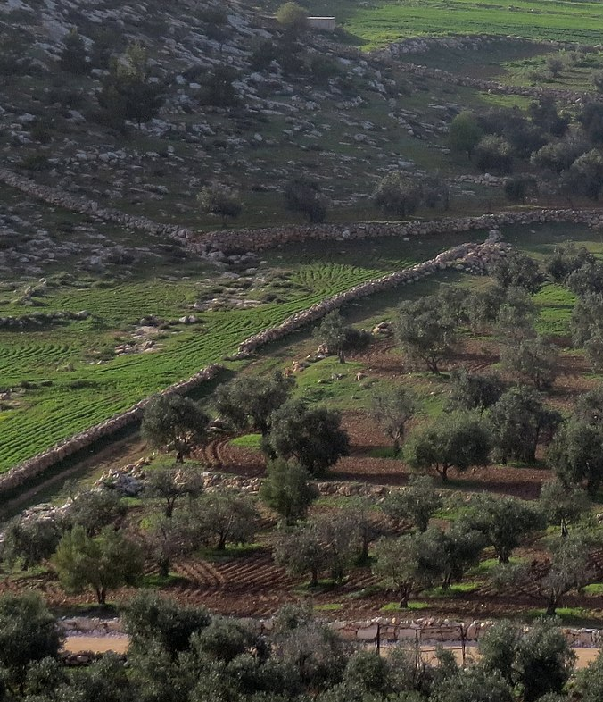

# Human-made Things in the Bible

## License Information

Human-made Things in the Bible © United Bible Societies, 2025. Adapted from: <cite>The Works of Their Hands: Man-made Things in the Bible</cite>, by Ray Pritz © 2009 United Bible Societies. This work is licensed under Creative Commons Attribution-ShareAlike 4.0 International (<a href="https://creativecommons.org/licenses/by-sa/4.0/">https://creativecommons.org/licenses/by-sa/4.0/</a>).

--------------------------------

## 標題：邊界牆、圍牆、圍欄、柵欄（boundary wall, fence） (id: REALIA:3.6)

3\.6 標題：邊界牆、圍牆、圍欄、柵欄（boundary wall, fence）
==========================================

經文出處
----

Hebrew 來： גְּבוּל (音譯： gvul)

[EZK 40:12](https://ref.ly/Ezek40:12), [EZK 40:12](https://ref.ly/Ezek40:12), [EZK 43:13](https://ref.ly/Ezek43:13), [EZK 43:17](https://ref.ly/Ezek43:17), [EZK 43:20](https://ref.ly/Ezek43:20)

Hebrew 來： גדר, גָּדֵר, גֶּדֶר, גְּדֵרָה, גְּדֶרֶת (音譯： gadar（動詞）, gader, geder, gderah, gdereth)

[NUM 22:24](https://ref.ly/Num22:24), [NUM 22:24](https://ref.ly/Num22:24), [EZR 9:9](https://ref.ly/Ezra9:9), [JOB 19:8](https://ref.ly/Job19:8), [PSA 62:4](https://ref.ly/Ps62:4), [PSA 80:13](https://ref.ly/Ps80:13), [PSA 89:41](https://ref.ly/Ps89:41), [PRO 24:31](https://ref.ly/Prov24:31), [ECC 10:8](https://ref.ly/Eccl10:8), [ISA 5:5](https://ref.ly/Isa5:5), [JER 49:3](https://ref.ly/Jer49:3), [LAM 3:7](https://ref.ly/Lam3:7), [LAM 3:9](https://ref.ly/Lam3:9), [EZK 13:5](https://ref.ly/Ezek13:5), [EZK 13:5](https://ref.ly/Ezek13:5), [EZK 22:30](https://ref.ly/Ezek22:30), [EZK 22:30](https://ref.ly/Ezek22:30), [EZK 42:7](https://ref.ly/Ezek42:7), [EZK 42:10](https://ref.ly/Ezek42:10), [EZK 42:12](https://ref.ly/Ezek42:12), [HOS 2:8](https://ref.ly/Hos2:8), [HOS 2:8](https://ref.ly/Hos2:8), [MIC 7:11](https://ref.ly/Mic7:11), [NAM 3:17](https://ref.ly/Nah3:17)

Hebrew 來： חוֹמָה (音譯： chomah)

[LAM 2:7](https://ref.ly/Lam2:7), [EZK 40:5](https://ref.ly/Ezek40:5), [EZK 42:20](https://ref.ly/Ezek42:20)

Hebrew 來： חַיִץ (音譯： chayits)

[EZK 13:10](https://ref.ly/Ezek13:10)

Hebrew 來： מְסוּכָה, מְשֻׂכָה, מְשׂוּכָּה (音譯： msukah)

[PRO 15:19](https://ref.ly/Prov15:19), [ISA 5:5](https://ref.ly/Isa5:5), [MIC 7:4](https://ref.ly/Mic7:4)

Hebrew 來： קִיר (音譯： qir)

[PSA 62:4](https://ref.ly/Ps62:4)

Hebrew 來： שׂוך (音譯： suk（動詞）)

[JOB 1:10](https://ref.ly/Job1:10), [HOS 2:8](https://ref.ly/Hos2:8)

Hebrew 來： שׁוּר, שׁוּרָה (音譯： shur, shurah)

[GEN 49:22](https://ref.ly/Gen49:22), [JOB 24:11](https://ref.ly/Job24:11)

Greek 希： ἀνάλημμα (音譯： analēmma)

[SIR 50:2](https://ref.ly/Sir50:2)

Greek 希： μεσότοιχον (音譯： mesotoichon)

[EPH 2:14](https://ref.ly/Eph2:14)

Greek 希： τεῖχος (音譯： teichos)

[1MA 4:60](https://ref.ly/1Macc4:60), [1MA 6:7](https://ref.ly/1Macc6:7), [1MA 6:62](https://ref.ly/1Macc6:62), [1MA 9:54](https://ref.ly/1Macc9:54)

Greek 希： τοῖχος (音譯： toichos)

[ACT 23:3](https://ref.ly/Acts23:3), [TOB 2:9](https://ref.ly/Tob2:9), [TOB 2:10](https://ref.ly/Tob2:10), [WIS 13:15](https://ref.ly/Wis13:15), [SIR 14:24](https://ref.ly/Sir14:24), [SIR 22:17](https://ref.ly/Sir22:17), [SIR 23:18](https://ref.ly/Sir23:18), [1ES 6:8](https://ref.ly/1Esd6:8), [ODA 10:5](https://ref.ly/Odes10:5)

Greek 希： φραγμός (音譯： fragmos)

[MAT 21:33](https://ref.ly/Matt21:33), [MRK 12:1](https://ref.ly/Mark12:1), [LUK 14:23](https://ref.ly/Luke14:23), [EPH 2:14](https://ref.ly/Eph2:14), [SIR 36:25](https://ref.ly/Sir36:25)

描述和用途
-----

*石圍欄 (© بدارين, CC BY\-SA 4\.0, via Wikimedia Commons)*

圍欄是用來圍住某個區域的構築物。在以色列地，圍欄通常是用石頭做的，少數是用樹枝和灌木做的（僅作臨時構築物）。

---

翻譯
--

許多社會都用某種類型的籬笆、圍牆或障礙物來把田地圍起來。在某些情況下，籬笆是由原木或樹枝堆砌而成，還有些情況是由夯實的泥土或堆疊的石頭做成。然而，這裡的重點不是「籬笆」的形式，而是它的功能，因此翻譯者可能常常要使用描述性的短語；例如，「圍住田地的障礙物」，或「防止動物進入田地的障礙物」。由於石頭在以色列地很常見，那裡的籬笆通常是用一些鬆散放置的石塊堆成的。在許多文化中，這種石頭構築物被稱為「牆」，而不是「籬笆」。

希伯來文*gvul* 通常是指「邊界」（參[3\.7 地界、界標 (boundary marker)\<REALIA:3\.7\>](#) ），這個詞在《以西結書》中出現過幾次，意思略有不同。在[EZK 40:12](https://ref.ly/Ezek40:12) 中，它似乎指的是「矮牆」（“low wall”；GNT (Good News Translation (1992)) ）、「欄杆」（“railing”；CEV (Contemporary English Version) ），或僅僅是指「障礙物」（“barrier\[s]”；RSV (Revised Standard Version (1952)) 、NJPSV (New Jewish Publication Society Version) ）。在[EZK 43:13](https://ref.ly/Ezek43:13); [EZK 43:17](https://ref.ly/Ezek43:17); [EZK 43:20](https://ref.ly/Ezek43:20) 中，該詞是指祭壇底部及各層周圍的某種「邊」（“rim”；RSV (Revised Standard Version (1952)) 、NIV (New International Version (1984)) ）。

有些語言會用不同的詞語表示建築物的外牆與分隔房間的內牆。希伯來文*chomah* 通常指外牆，尤其是城牆（參[3\.13\.3\.1 城牆、外郭、城垛 (city wall, rampart, battlement)\<REALIA:3\.13\.3\.1\>](#) ），但本條目列出的經文除外。其他希伯來文詞語既可指內牆，也可指外牆，翻譯者要根據上下文來確定詞語正確的意思。希臘文*toichos* 指內牆。在翻譯時，房子的外牆可稱為「房子的側面」，而內牆則可稱為「房子裡面的隔牆」。

[EZK 13:10](https://ref.ly/Ezek13:10) ：在這節經文中，希伯來文*chayits* 表示「分隔物」，是一面臨時的、不太堅固的牆。很多譯本通過添加修飾語來指出這一點，比如「搖晃的」（如CEV (Contemporary English Version) ）、「不結實的」（如NIV (New International Version (1984)) 、LB (Living Bible (1971)) ）、「脆弱的」（如NCV (New Century Version) ）、「不穩的」（如SPCL (Spanish Common Language Version (Dios Habla Hoy)) ），或「鬆散石塊堆砌的」（如GNT (Good News Translation (1992)) 、GECL (German Common Language Version (Gute Nachricht Bibel)) ）。

人們對希伯來文*shur* 和*shurah* 這兩個詞有多種理解。詞語的字面意思是「行列」，可以指一排石頭、一堵牆，或一道籬笆。在[GEN 49:22](https://ref.ly/Gen49:22) 中，大多數譯本都譯為「牆」（“wall”；RSV (Revised Standard Version (1952)) 、CEV (Contemporary English Version) 、FRCL (French Common Language Version (Bible en français courant)) ）。然而，在[JOB 24:11](https://ref.ly/Job24:11) 中，RSV (Revised Standard Version (1952)) 把*shurah* 譯為“olive rows”（「一排排橄欖樹」）。如《〈約伯記〉手冊》（*A Handbook on The Book of Job* ）所指出的，這可能不是文本的意思。在中東，橄欖樹通常生長在特別開墾的梯田上。梯田本身用擋土牆來支撐，*shurah* 在這裡可能就是指擋土牆。NRSV (New Revised Standard Version (1989)) 沒有採用RSV (Revised Standard Version (1952)) 的譯法，而是譯成「梯田」（“terraces”；NIV (New International Version (1984)) 同）。GECL (German Common Language Version (Gute Nachricht Bibel)) 譯為「花園」，NASB (New American Standard Bible) 譯為「牆」（“walls”）。GNT (Good News Translation (1992)) 和CEV (Contemporary English Version) 選擇不翻譯這個詞。

在[EPH 2:14](https://ref.ly/Eph2:14) 中，希臘文*mesotoichon* 和*fragmos* 喻指律法，它是猶太人和外邦人之間的屏障，是「分隔的牆」（RSV (Revised Standard Version (1952)) 直譯）。在本節經文中，這兩個詞可以譯為「隔斷的牆」或「分開的牆」。

* **Associated Passages:** 以西結書 40:12; 以西結書 43:13; 以西結書 43:17; 以西結書 43:20; 民數記 22:24; 以斯拉記 9:9; 約伯記 19:8; 詩篇 62:4; 詩篇 80:13; 詩篇 89:41; 箴言 24:31; 傳道書 10:8; 以賽亞書 5:5; 耶利米書 49:3; 耶利米哀歌 3:7; 耶利米哀歌 3:9; 以西結書 13:5; 以西結書 22:30; 以西結書 42:7; 以西結書 42:10; 以西結書 42:12; 何西阿書 2:8; 彌迦書 7:11; 那鴻書 3:17; 耶利米哀歌 2:7; 以西結書 40:5; 以西結書 42:20; 以西結書 13:10; 箴言 15:19; 彌迦書 7:4; 約伯記 1:10; 創世記 49:22; 約伯記 24:11; 德訓篇 50:2; 以弗所書 2:14; 瑪加伯上 4:60; 瑪加伯上 6:7; 瑪加伯上 6:62; 瑪加伯上 9:54; 使徒行傳 23:3; 多俾亞傳 2:9; 多俾亞傳 2:10; 智慧篇 13:15; 德訓篇 14:24; 德訓篇 22:17; 德訓篇 23:18; 厄斯德拉上 6:8; 頌歌 10:5; 馬太福音 21:33; 馬可福音 12:1; 路加福音 14:23; 德訓篇 36:25

