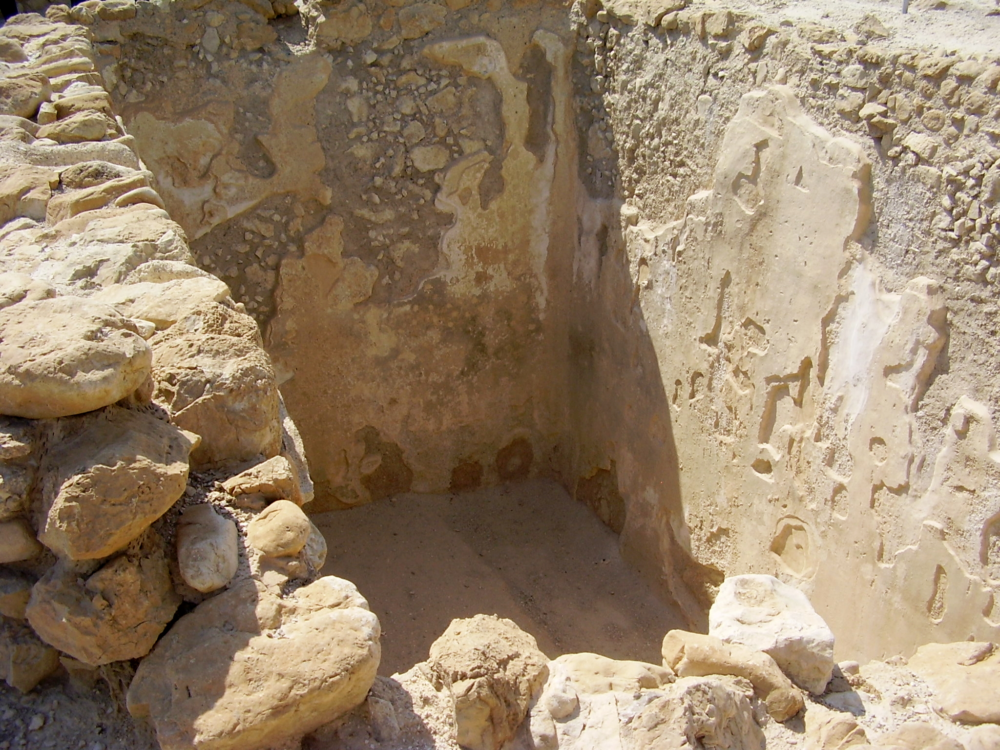

# Human-made Things in the Bible

## License Information

Human-made Things in the Bible © United Bible Societies, 2025. Adapted from: <cite>The Works of Their Hands: Man-made Things in the Bible</cite>, by Ray Pritz © 2009 United Bible Societies. This work is licensed under Creative Commons Attribution-ShareAlike 4.0 International (<a href="https://creativecommons.org/licenses/by-sa/4.0/">https://creativecommons.org/licenses/by-sa/4.0/</a>).

--------------------------------

## 標題：蓄水池（cistern） (id: REALIA:3.9)

3\.9 標題：蓄水池（cistern）
====================

經文出處
----

Hebrew 來： בֹּאר (音譯： bo’r)

[2SA 23:20](https://ref.ly/2Sam23:20), [JER 2:13](https://ref.ly/Jer2:13), [JER 2:13](https://ref.ly/Jer2:13)

Hebrew 來： בּוֹר (音譯： bor)

[GEN 37:20](https://ref.ly/Gen37:20), [GEN 37:22](https://ref.ly/Gen37:22), [GEN 37:24](https://ref.ly/Gen37:24), [GEN 37:24](https://ref.ly/Gen37:24), [GEN 37:28](https://ref.ly/Gen37:28), [GEN 37:29](https://ref.ly/Gen37:29), [GEN 37:29](https://ref.ly/Gen37:29), [GEN 40:15](https://ref.ly/Gen40:15), [GEN 41:14](https://ref.ly/Gen41:14), [EXO 12:29](https://ref.ly/Exod12:29), [EXO 21:33](https://ref.ly/Exod21:33), [EXO 21:33](https://ref.ly/Exod21:33), [EXO 21:34](https://ref.ly/Exod21:34), [LEV 11:36](https://ref.ly/Lev11:36), [DEU 6:11](https://ref.ly/Deut6:11), [1SA 13:6](https://ref.ly/1Sam13:6), [1SA 19:22](https://ref.ly/1Sam19:22), [2SA 23:15](https://ref.ly/2Sam23:15), [2SA 23:16](https://ref.ly/2Sam23:16), [2SA 23:20](https://ref.ly/2Sam23:20), [2KI 10:14](https://ref.ly/2Kgs10:14), [2KI 18:31](https://ref.ly/2Kgs18:31), [1CH 11:17](https://ref.ly/1Chr11:17), [1CH 11:18](https://ref.ly/1Chr11:18), [1CH 11:22](https://ref.ly/1Chr11:22), [2CH 26:10](https://ref.ly/2Chr26:10), [NEH 9:25](https://ref.ly/Neh9:25), [PSA 7:16](https://ref.ly/Ps7:16), [PSA 28:1](https://ref.ly/Ps28:1), [PSA 30:4](https://ref.ly/Ps30:4), [PSA 40:3](https://ref.ly/Ps40:3), [PSA 88:5](https://ref.ly/Ps88:5), [PSA 88:7](https://ref.ly/Ps88:7), [PSA 143:7](https://ref.ly/Ps143:7), [PRO 1:12](https://ref.ly/Prov1:12), [PRO 5:15](https://ref.ly/Prov5:15), [PRO 28:17](https://ref.ly/Prov28:17), [ECC 12:6](https://ref.ly/Eccl12:6), [ISA 14:15](https://ref.ly/Isa14:15), [ISA 14:19](https://ref.ly/Isa14:19), [ISA 24:22](https://ref.ly/Isa24:22), [ISA 36:16](https://ref.ly/Isa36:16), [ISA 38:18](https://ref.ly/Isa38:18), [ISA 51:1](https://ref.ly/Isa51:1), [JER 2:13](https://ref.ly/Jer2:13), [JER 2:13](https://ref.ly/Jer2:13), [JER 6:7](https://ref.ly/Jer6:7), [JER 37:16](https://ref.ly/Jer37:16), [JER 38:6](https://ref.ly/Jer38:6), [JER 38:6](https://ref.ly/Jer38:6), [JER 38:7](https://ref.ly/Jer38:7), [JER 38:9](https://ref.ly/Jer38:9), [JER 38:10](https://ref.ly/Jer38:10), [JER 38:11](https://ref.ly/Jer38:11), [JER 38:13](https://ref.ly/Jer38:13), [JER 41:7](https://ref.ly/Jer41:7), [JER 41:9](https://ref.ly/Jer41:9), [LAM 3:53](https://ref.ly/Lam3:53), [LAM 3:55](https://ref.ly/Lam3:55), [EZK 26:20](https://ref.ly/Ezek26:20), [EZK 26:20](https://ref.ly/Ezek26:20), [EZK 31:14](https://ref.ly/Ezek31:14), [EZK 31:16](https://ref.ly/Ezek31:16), [EZK 32:18](https://ref.ly/Ezek32:18), [EZK 32:23](https://ref.ly/Ezek32:23), [EZK 32:24](https://ref.ly/Ezek32:24), [EZK 32:25](https://ref.ly/Ezek32:25), [EZK 32:29](https://ref.ly/Ezek32:29), [EZK 32:30](https://ref.ly/Ezek32:30), [ZEC 9:11](https://ref.ly/Zech9:11)

Hebrew 來： גֵּב (音譯： gev)

[JER 14:3](https://ref.ly/Jer14:3)

Greek 希： ἀποδοχεῖον (音譯： apodocheion)

[SIR 50:3](https://ref.ly/Sir50:3)

Greek 希： λάκκος (音譯： lakkos)

[JDT 7:21](https://ref.ly/Jdt7:21), [JDT 8:31](https://ref.ly/Jdt8:31), [SIR 50:3](https://ref.ly/Sir50:3), [2MA 10:37](https://ref.ly/2Macc10:37)

Greek 希： φρέαρ (音譯： frear)

[1MA 7:19](https://ref.ly/1Macc7:19), [2MA 1:19](https://ref.ly/2Macc1:19)

描述
--

*石膏牆蓄水池 (© צילום:ד"ר אבישי טייכר, CC BY 2\.5, via Wikimedia Commons)*

蓄水池是在堅硬岩石上鑿出來的一個坑，用來蓄水，可能有6米（20英呎）寬，6米（20英呎）深，甚至更大。在古代，蓄水池是從不會滲水的岩石中鑿出來的。在人們懂得製作灰泥之後，便可以在多種岩石中鑿出蓄水池，然後在裡面塗一層灰泥，堵住所有孔洞或裂縫。

---

用途
--

在以色列地，幾乎全年的降雨都發生在11月到3月之間，蓄水池用來儲存雨水，或者把夏天將要乾涸的水泉裡的水儲存起來，以供一年中其餘的日子使用。

---

翻譯
--

蓄水池和井不同，蓄水池的水源地是在一定的距離之外，而井中的水是由附近的水匯聚而成。在上面列出的經文中，我們並不是總能通過上下文判定該詞所指的是井還是蓄水池；例如，在[NEH 9:25](https://ref.ly/Neh9:25) 中，NIV (New International Version (1984)) 、TOB (Traduction Oecuménique de la Bible (French, 1975)) 和NCV (New Century Version) 譯為“wells”（「井」），而RSV (Revised Standard Version (1952)) 、GNT (Good News Translation (1992)) 和CEV (Contemporary English Version) 則譯為“cisterns”（「蓄水池」）。在上文所列經文中，出現希伯來文*bor* 的大部分經節都存在類似的不確定性。在有些情況下，*bor* 可以指自然形成的「坑」。[GEN 37:0](https://ref.ly/Gen37:0) 記載約瑟被哥哥們扔到*bor* 裡面，可能就是指這種坑。一些譯本譯為“cistern”（「蓄水池」；NIV (New International Version (1984)) 、FRCL (French Common Language Version (Bible en français courant)) 、GECL (German Common Language Version (Gute Nachricht Bibel)) ），一些譯為“well”（「井」；GNT (Good News Translation (1992)) 、CEV (Contemporary English Version) ），還有一些則含糊地譯為“pit”（「坑」；RSV (Revised Standard Version (1952)) 、NASB (New American Standard Bible) ）。

翻譯者可以用一個描述性的短語來表示「蓄水池」，例如，「岩石中用來儲存水的洞坑」。在[2CH 26:10](https://ref.ly/2Chr26:10) 中，CEV (Contemporary English Version) 把從句「他挖了蓄水池」進行了擴展翻譯，英文意為「他在那裡挖了蓄水池來匯集雨水」，這是一個很好的範例。在[JER 2:13](https://ref.ly/Jer2:13) 中，可譯為「你想把水儲存在從地上挖出來的、有裂縫的、漏水的坑裡」（ CEV (Contemporary English Version) 直譯）。

[PRO 5:15](https://ref.ly/Prov5:15) ：參[3\.8 井 (well)\<REALIA:3\.8\>](#) 關於這節經文的註解。

[ECC 12:6](https://ref.ly/Eccl12:6) ：對於這節經文中的最後一個分句，可譯為「輪子在蓄水池處斷裂」（RSV (Revised Standard Version (1952)) 直譯）。這種譯法是否正確不確定，並且各個譯本的譯法也不同。在這節經文的末尾，希伯來文本有兩個平行的分，按字面翻譯是：「罐子必在水泉處打碎，輪子必在蓄水池旁斷裂。」大多數翻譯者和解經家都認為，希伯來文*galgal* （「輪子」）指的是一種滑輪，方便人將裝水的容器從井裡拉上來；例如，最後一個句子可譯為「滑輪在井邊斷裂」（CEV (Contemporary English Version) 直譯；NJB (New Jerusalem Bible (1985)) 、NAB (New American Bible (1970)) 、ITCL (Italian Common Language Version) 的譯法類似）。斯科特（Scott）指出，在這個平行結構中，*galgal* 要與*kad* （一種黏土壺或罐）相對應。然而，在他自己的譯本中，他譯為「水輪在蓄水池處斷裂」（第254頁）。GNT (Good News Translation (1992)) 似乎依循事件發生的先後順序，把最後兩個分的順序調換，英文意為：「井旁的繩子必斷裂，水罐必破碎。」翻譯者最好把「輪子」作為滑輪處理。在人們不知道滑輪的地方，翻譯者可以依循GNT (Good News Translation (1992)) 的譯法。然而，即使依循GNT (Good News Translation (1992)) ，也有必要在附註中說明，這繩子是用來拉起綁在上面的打水容器的。

* **Associated Passages:** 撒母耳記下 23:20; 耶利米書 2:13; 創世記 37:20; 創世記 37:22; 創世記 37:24; 創世記 37:28; 創世記 37:29; 創世記 40:15; 創世記 41:14; 出埃及記 12:29; 出埃及記 21:33; 出埃及記 21:34; 利未記 11:36; 申命記 6:11; 撒母耳記上 13:6; 撒母耳記上 19:22; 撒母耳記下 23:15; 撒母耳記下 23:16; 列王紀下 10:14; 列王紀下 18:31; 歷代志上 11:17; 歷代志上 11:18; 歷代志上 11:22; 歷代志下 26:10; 尼希米記 9:25; 詩篇 7:16; 詩篇 28:1; 詩篇 30:4; 詩篇 40:3; 詩篇 88:5; 詩篇 88:7; 詩篇 143:7; 箴言 1:12; 箴言 5:15; 箴言 28:17; 傳道書 12:6; 以賽亞書 14:15; 以賽亞書 14:19; 以賽亞書 24:22; 以賽亞書 36:16; 以賽亞書 38:18; 以賽亞書 51:1; 耶利米書 6:7; 耶利米書 37:16; 耶利米書 38:6; 耶利米書 38:7; 耶利米書 38:9; 耶利米書 38:10; 耶利米書 38:11; 耶利米書 38:13; 耶利米書 41:7; 耶利米書 41:9; 耶利米哀歌 3:53; 耶利米哀歌 3:55; 以西結書 26:20; 以西結書 31:14; 以西結書 31:16; 以西結書 32:18; 以西結書 32:23; 以西結書 32:24; 以西結書 32:25; 以西結書 32:29; 以西結書 32:30; 撒迦利亞書 9:11; 耶利米書 14:3; 德訓篇 50:3; 友弟德傳 7:21; 友弟德傳 8:31; 瑪加伯下 10:37; 瑪加伯上 7:19; 瑪加伯下 1:19; 創世記 37:0

