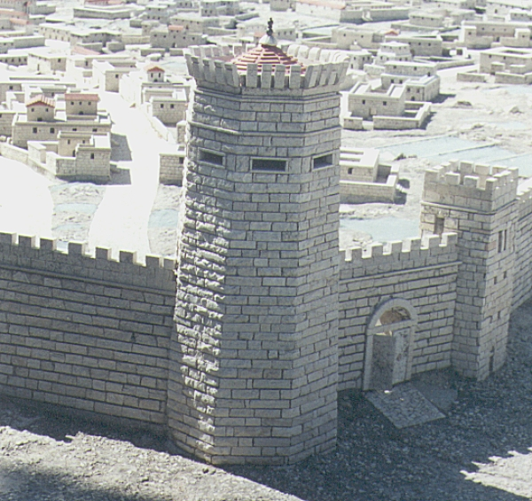

# Human-made Things in the Bible

## License Information

Human-made Things in the Bible © United Bible Societies, 2025. Adapted from: <cite>The Works of Their Hands: Man-made Things in the Bible</cite>, by Ray Pritz © 2009 United Bible Societies. This work is licensed under Creative Commons Attribution-ShareAlike 4.0 International (<a href="https://creativecommons.org/licenses/by-sa/4.0/">https://creativecommons.org/licenses/by-sa/4.0/</a>).

--------------------------------

## 標題：瞭望塔、塔樓、塔（watchtower, tower） (id: REALIA:3.13.3.3)

3\.13\.3\.3 標題：瞭望塔、塔樓、塔（watchtower, tower）
==========================================

經文出處
----

Hebrew 來： אַלְמָן (音譯： ’alman)

[ISA 13:22](https://ref.ly/Isa13:22)

Hebrew 來： בַּחַן (音譯： bachan)

[ISA 32:14](https://ref.ly/Isa32:14)

Hebrew 來： מִגְדָּל, מִגְדֹּל (音譯： migdal, migdol)

[JDG 8:9](https://ref.ly/Judg8:9), [JDG 8:17](https://ref.ly/Judg8:17), [JDG 9:51](https://ref.ly/Judg9:51), [JDG 9:51](https://ref.ly/Judg9:51), [JDG 9:52](https://ref.ly/Judg9:52), [JDG 9:52](https://ref.ly/Judg9:52), [2KI 9:17](https://ref.ly/2Kgs9:17), [2KI 17:9](https://ref.ly/2Kgs17:9), [2KI 18:8](https://ref.ly/2Kgs18:8), [1CH 27:25](https://ref.ly/1Chr27:25), [2CH 14:6](https://ref.ly/2Chr14:6), [2CH 26:9](https://ref.ly/2Chr26:9), [2CH 26:15](https://ref.ly/2Chr26:15), [2CH 27:4](https://ref.ly/2Chr27:4), [2CH 32:5](https://ref.ly/2Chr32:5), [NEH 3:1](https://ref.ly/Neh3:1), [NEH 3:1](https://ref.ly/Neh3:1), [NEH 3:11](https://ref.ly/Neh3:11), [NEH 3:25](https://ref.ly/Neh3:25), [NEH 3:26](https://ref.ly/Neh3:26), [NEH 3:27](https://ref.ly/Neh3:27), [NEH 12:38](https://ref.ly/Neh12:38), [NEH 12:39](https://ref.ly/Neh12:39), [NEH 12:39](https://ref.ly/Neh12:39), [PSA 48:13](https://ref.ly/Ps48:13), [PSA 61:4](https://ref.ly/Ps61:4), [PRO 18:10](https://ref.ly/Prov18:10), [SNG 4:4](https://ref.ly/Song4:4), [SNG 5:13](https://ref.ly/Song5:13), [SNG 7:5](https://ref.ly/Song7:5), [SNG 7:5](https://ref.ly/Song7:5), [SNG 8:10](https://ref.ly/Song8:10), [ISA 2:15](https://ref.ly/Isa2:15), [ISA 30:25](https://ref.ly/Isa30:25), [ISA 33:18](https://ref.ly/Isa33:18), [JER 31:38](https://ref.ly/Jer31:38), [EZK 26:4](https://ref.ly/Ezek26:4), [EZK 26:9](https://ref.ly/Ezek26:9), [EZK 27:11](https://ref.ly/Ezek27:11), [ZEC 14:10](https://ref.ly/Zech14:10)

Hebrew 來： מָצוֹר (音譯： matsor)

[HAB 2:1](https://ref.ly/Hab2:1)

Hebrew 來： מִצְפֶּה (音譯： mitspeh)

[ISA 21:8](https://ref.ly/Isa21:8), [2CH 20:24](https://ref.ly/2Chr20:24)

Hebrew 來： פִּנָּה (音譯： pinah)

[2CH 26:15](https://ref.ly/2Chr26:15), [ZEP 1:16](https://ref.ly/Zeph1:16), [ZEP 3:6](https://ref.ly/Zeph3:6)

Hebrew 來： שֶׁמֶשׁ (音譯： shemesh)

[ISA 54:12](https://ref.ly/Isa54:12)

Greek 希： πύργος (音譯： purgos)

[MAT 21:33](https://ref.ly/Matt21:33), [MRK 12:1](https://ref.ly/Mark12:1), [LUK 13:4](https://ref.ly/Luke13:4), [LUK 14:28](https://ref.ly/Luke14:28), [TOB 13:14](https://ref.ly/Tob13:14), [TOB 13:17](https://ref.ly/Tob13:17), [JDT 1:3](https://ref.ly/Jdt1:3), [JDT 1:14](https://ref.ly/Jdt1:14), [JDT 7:5](https://ref.ly/Jdt7:5), [JDT 7:32](https://ref.ly/Jdt7:32), [1MA 1:33](https://ref.ly/1Macc1:33), [1MA 4:60](https://ref.ly/1Macc4:60), [1MA 5:5](https://ref.ly/1Macc5:5), [1MA 5:5](https://ref.ly/1Macc5:5), [1MA 5:65](https://ref.ly/1Macc5:65), [1MA 13:33](https://ref.ly/1Macc13:33), [1MA 13:43](https://ref.ly/1Macc13:43), [1MA 16:10](https://ref.ly/1Macc16:10), [2MA 10:18](https://ref.ly/2Macc10:18), [2MA 10:20](https://ref.ly/2Macc10:20), [2MA 10:22](https://ref.ly/2Macc10:22), [2MA 10:36](https://ref.ly/2Macc10:36), [2MA 13:5](https://ref.ly/2Macc13:5), [2MA 14:41](https://ref.ly/2Macc14:41), [3MA 2:27](https://ref.ly/3Macc2:27), [4MA 13:6](https://ref.ly/4Macc13:6), [1ES 1:52](https://ref.ly/1Esd1:52), [1ES 4:4](https://ref.ly/1Esd4:4)

Greek 希： σκοπή (音譯： skopē)

[SIR 37:14](https://ref.ly/Sir37:14)

描述
--

*城牆上的守望塔模型 (© Ray Pritz by United Bible Societies)*

瞭望塔是一座很高的建築物，頂部有一個瞭望臺。

---

用途
--

城牆每隔一段距離就建有一個瞭望塔，用來戒備靠近的敵人。城中的守軍還可以從瞭望塔上對進攻者的側面進行攻擊。有時，私人產業也建有塔樓作為保護。另參[2\.19\.3 射擊臺、攻城塔 (firing platform, siege tower)\<REALIA:2\.19\.3\>](#) 。

---

翻譯
--

在許多語言中，「塔樓」一詞僅僅是指「很高的建築」（當然不是指摩天大樓）。在其他情況下，把它譯為「很高的平臺」或「很高的瞭望臺」可能更合適。

在[ISA 13:22](https://ref.ly/Isa13:22) 中，希伯來文*’alman* 的字面意思是「他的寡婦」。這個詞與意為「宮殿」的希伯來文詞語非常相像（參[3\.4 宮殿 (palace)\<REALIA:3\.4\>](#) 中的*’armon* ）。我們不清楚是這裡的文本出現了問題，還是作者有意互換了兩個字母，以表示「荒涼」的意思（參瓦爾德［de Waard］，《〈以賽亞書手冊〉》（*A Handbook on Isaiah* ），第61頁）。

[2CH 20:24](https://ref.ly/2Chr20:24) ：雖然有些譯本把希伯來文*mitspeh* 譯為「塔樓」或「瞭望塔」（如NRSV (New Revised Standard Version (1989)) 、GNT (Good News Translation (1992)) 、CEV (Contemporary English Version) ），但*mitspeh* 可能只是一個天然形成的、視野開闊的高點，因此可譯為「曠野的瞭望塔」（如RSV (Revised Standard Version (1952)) ）、「俯瞰曠野的地方」（如NIV (New International Version (1984)) ）、「他們可以看到曠野的一個地方」（如NCV (New Century Version) ），ITCL (Italian Common Language Version) 將這個詞譯為「一座小山，從山上面可以看到曠野」。

希伯來文*pinah* 的字面意思是「角落」。在本詞條的參考經文中，該詞不一定指某個獨立的構築物，而僅僅是城牆的一個轉角。在[ZEP 1:16](https://ref.ly/Zeph1:16) 中，有些譯本將這個詞譯為「角樓」（如NIV (New International Version (1984)) 、NJPSV (New Jewish Publication Society Version) ），還有譯本的譯法比較籠統，作「高聳的城垛」（RSV (Revised Standard Version (1952)) 直譯；NLT (New Living Translation) 的譯法類似）。

有些較早的譯本把[ISA 21:5](https://ref.ly/Isa21:5) 中的希伯來文*tsafith* 譯為「瞭望塔」（“watchtower”；KJV (King James Version (1611)) ）。現在，學者普遍認為這個詞的意思是「地毯」（參[5\.17 地毯、毯子 (carpet, rug)\<REALIA:5\.17\>](#) ）。

在新約中，希臘文*purgos* 可以指任何類型的塔，包括用於軍事目的或者供守望者保護收成的塔（參[1\.1\.11 瞭望樓 (watchtower)\<REALIA:1\.1\.11\>](#) ）。[LUK 13:4](https://ref.ly/Luke13:4) 中的塔可能是耶路撒冷古城牆的一部分。

* **Associated Passages:** 以賽亞書 13:22; 以賽亞書 32:14; 士師記 8:9; 士師記 8:17; 士師記 9:51; 士師記 9:52; 列王紀下 9:17; 列王紀下 17:9; 列王紀下 18:8; 歷代志上 27:25; 歷代志下 14:6; 歷代志下 26:9; 歷代志下 26:15; 歷代志下 27:4; 歷代志下 32:5; 尼希米記 3:1; 尼希米記 3:11; 尼希米記 3:25; 尼希米記 3:26; 尼希米記 3:27; 尼希米記 12:38; 尼希米記 12:39; 詩篇 48:13; 詩篇 61:4; 箴言 18:10; 雅歌 4:4; 雅歌 5:13; 雅歌 7:5; 雅歌 8:10; 以賽亞書 2:15; 以賽亞書 30:25; 以賽亞書 33:18; 耶利米書 31:38; 以西結書 26:4; 以西結書 26:9; 以西結書 27:11; 撒迦利亞書 14:10; 哈巴谷書 2:1; 以賽亞書 21:8; 歷代志下 20:24; 西番雅書 1:16; 西番雅書 3:6; 以賽亞書 54:12; 馬太福音 21:33; 馬可福音 12:1; 路加福音 13:4; 路加福音 14:28; 多俾亞傳 13:14; 多俾亞傳 13:17; 友弟德傳 1:3; 友弟德傳 1:14; 友弟德傳 7:5; 友弟德傳 7:32; 瑪加伯上 1:33; 瑪加伯上 4:60; 瑪加伯上 5:5; 瑪加伯上 5:65; 瑪加伯上 13:33; 瑪加伯上 13:43; 瑪加伯上 16:10; 瑪加伯下 10:18; 瑪加伯下 10:20; 瑪加伯下 10:22; 瑪加伯下 10:36; 瑪加伯下 13:5; 瑪加伯下 14:41; 瑪加伯三書 2:27; 瑪加伯四書 13:6; 厄斯德拉上 1:52; 厄斯德拉上 4:4; 德訓篇 37:14; 以賽亞書 21:5

