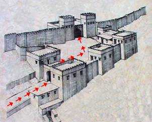
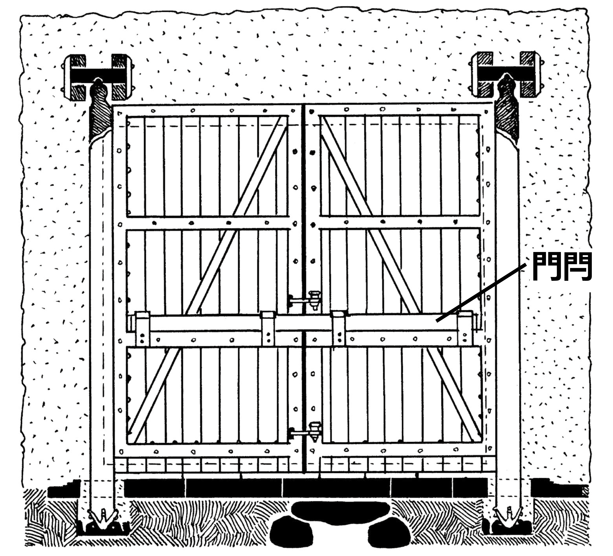

# Human-made Things in the Bible

## License Information

Human-made Things in the Bible © United Bible Societies, 2025. Adapted from: <cite>The Works of Their Hands: Man-made Things in the Bible</cite>, by Ray Pritz © 2009 United Bible Societies. This work is licensed under Creative Commons Attribution-ShareAlike 4.0 International (<a href="https://creativecommons.org/licenses/by-sa/4.0/">https://creativecommons.org/licenses/by-sa/4.0/</a>).

--------------------------------

## 標題：堡壘、城市防禦工事（city fortifications） (id: REALIA:3.13.3)

3\.13\.3 標題：堡壘、城市防禦工事（city fortifications）
==========================================

古時，城市通常建有特殊的防禦工事來保護居民不受外敵的攻擊。有些防禦工事憑依天然，例如陡峭的山頂或河邊。人工修建的防禦工事至少包括一堵又高又厚的牆，通常是用磚或石頭砌成的。城牆有一個或多個入口，用大門關閉。大門通常是木製的。入口的結構往往相當複雜，包含一個或多個轉彎通道和幾個警衛室。城門和城牆的其餘部分可能還建有高過城牆的塔樓。這些塔樓既有利於觀察從遠處靠近的人，也是向敵人投射槍矛弓箭的制高點。

## 標題：城牆、外郭、城垛（city wall, rampart, battlement） (id: REALIA:3.13.3.1)

3\.13\.3\.1 標題：城牆、外郭、城垛（city wall, rampart, battlement）
=======================================================

經文出處
----

Hebrew 來： גְּבוּל (音譯： gvul)

[ISA 54:12](https://ref.ly/Isa54:12)

Hebrew 來： גָּדֵר (音譯： gader)

[MIC 7:11](https://ref.ly/Mic7:11)

Hebrew 來： חֵיל, חַיִל (音譯： chel, chayil, cheylah)

[2SA 20:15](https://ref.ly/2Sam20:15), [1KI 21:23](https://ref.ly/1Kgs21:23), [PSA 48:14](https://ref.ly/Ps48:14), [PSA 122:7](https://ref.ly/Ps122:7), [ISA 26:1](https://ref.ly/Isa26:1), [LAM 2:8](https://ref.ly/Lam2:8), [NAM 3:8](https://ref.ly/Nah3:8)

Hebrew 來： חוֹמָה (音譯： chomah)

[EXO 14:22](https://ref.ly/Exod14:22), [EXO 14:29](https://ref.ly/Exod14:29), [LEV 25:29](https://ref.ly/Lev25:29), [LEV 25:30](https://ref.ly/Lev25:30), [LEV 25:31](https://ref.ly/Lev25:31), [DEU 3:5](https://ref.ly/Deut3:5), [DEU 28:52](https://ref.ly/Deut28:52), [JOS 6:5](https://ref.ly/Josh6:5), [JOS 6:20](https://ref.ly/Josh6:20), [1SA 31:10](https://ref.ly/1Sam31:10), [1SA 31:12](https://ref.ly/1Sam31:12), [2SA 11:20](https://ref.ly/2Sam11:20), [2SA 11:21](https://ref.ly/2Sam11:21), [2SA 11:21](https://ref.ly/2Sam11:21), [2SA 11:24](https://ref.ly/2Sam11:24), [2SA 18:24](https://ref.ly/2Sam18:24), [2SA 20:15](https://ref.ly/2Sam20:15), [2SA 20:21](https://ref.ly/2Sam20:21), [2KI 3:27](https://ref.ly/2Kgs3:27), [2KI 6:26](https://ref.ly/2Kgs6:26), [2KI 6:30](https://ref.ly/2Kgs6:30), [2KI 14:13](https://ref.ly/2Kgs14:13), [2KI 18:26](https://ref.ly/2Kgs18:26), [2KI 18:27](https://ref.ly/2Kgs18:27), [2KI 25:4](https://ref.ly/2Kgs25:4), [2CH 8:5](https://ref.ly/2Chr8:5), [2CH 14:6](https://ref.ly/2Chr14:6), [2CH 25:23](https://ref.ly/2Chr25:23), [2CH 26:6](https://ref.ly/2Chr26:6), [2CH 26:6](https://ref.ly/2Chr26:6), [2CH 26:6](https://ref.ly/2Chr26:6), [2CH 27:3](https://ref.ly/2Chr27:3), [2CH 32:5](https://ref.ly/2Chr32:5), [2CH 32:18](https://ref.ly/2Chr32:18), [2CH 33:14](https://ref.ly/2Chr33:14), [2CH 36:19](https://ref.ly/2Chr36:19), [PSA 51:20](https://ref.ly/Ps51:20), [PSA 55:11](https://ref.ly/Ps55:11), [PRO 25:28](https://ref.ly/Prov25:28), [SNG 5:7](https://ref.ly/Song5:7), [SNG 8:9](https://ref.ly/Song8:9), [SNG 8:10](https://ref.ly/Song8:10), [ISA 2:15](https://ref.ly/Isa2:15), [ISA 22:10](https://ref.ly/Isa22:10), [ISA 22:11](https://ref.ly/Isa22:11), [ISA 26:1](https://ref.ly/Isa26:1), [ISA 30:13](https://ref.ly/Isa30:13), [ISA 36:11](https://ref.ly/Isa36:11), [ISA 36:12](https://ref.ly/Isa36:12), [ISA 49:16](https://ref.ly/Isa49:16), [ISA 56:5](https://ref.ly/Isa56:5), [ISA 60:10](https://ref.ly/Isa60:10), [ISA 60:18](https://ref.ly/Isa60:18), [ISA 62:6](https://ref.ly/Isa62:6), [JER 1:15](https://ref.ly/Jer1:15), [JER 1:18](https://ref.ly/Jer1:18), [JER 15:20](https://ref.ly/Jer15:20), [JER 21:4](https://ref.ly/Jer21:4), [JER 52:7](https://ref.ly/Jer52:7), [JER 52:14](https://ref.ly/Jer52:14), [LAM 2:8](https://ref.ly/Lam2:8), [LAM 2:8](https://ref.ly/Lam2:8), [LAM 2:18](https://ref.ly/Lam2:18), [EZK 26:4](https://ref.ly/Ezek26:4), [EZK 26:9](https://ref.ly/Ezek26:9), [EZK 26:10](https://ref.ly/Ezek26:10), [EZK 26:12](https://ref.ly/Ezek26:12), [EZK 27:11](https://ref.ly/Ezek27:11), [EZK 27:11](https://ref.ly/Ezek27:11), [EZK 38:11](https://ref.ly/Ezek38:11), [EZK 38:20](https://ref.ly/Ezek38:20), [JOL 2:7](https://ref.ly/Joel2:7), [JOL 2:9](https://ref.ly/Joel2:9), [AMO 1:7](https://ref.ly/Amos1:7), [AMO 1:10](https://ref.ly/Amos1:10), [AMO 1:14](https://ref.ly/Amos1:14), [AMO 7:7](https://ref.ly/Amos7:7), [NAM 2:6](https://ref.ly/Nah2:6), [NAM 3:8](https://ref.ly/Nah3:8), [ZEC 2:9](https://ref.ly/Zech2:9)

Hebrew 來： מְצוּרָה (音譯： mtsurah)

[NAM 2:2](https://ref.ly/Nah2:2)

Hebrew 來： קִיר (音譯： qir)

[NUM 22:25](https://ref.ly/Num22:25), [NUM 22:25](https://ref.ly/Num22:25), [NUM 35:4](https://ref.ly/Num35:4), [JOS 2:15](https://ref.ly/Josh2:15), [ISA 25:4](https://ref.ly/Isa25:4)

Hebrew 來： שׁוּר (音譯： shur)

[2SA 22:30](https://ref.ly/2Sam22:30), [EZR 4:12](https://ref.ly/Ezra4:12), [EZR 4:12](https://ref.ly/Ezra4:12), [EZR 4:13](https://ref.ly/Ezra4:13), [EZR 4:16](https://ref.ly/Ezra4:16), [PSA 18:30](https://ref.ly/Ps18:30)

Greek 希： ἐπάλξις (音譯： epalxis)

[JDT 14:1](https://ref.ly/Jdt14:1), [SIR 9:13](https://ref.ly/Sir9:13)

Greek 希： προμαχών (音譯： promachōn)

[TOB 13:17](https://ref.ly/Tob13:17)

Greek 希： τεῖχος (音譯： teichos)

[ACT 9:25](https://ref.ly/Acts9:25), [2CO 11:33](https://ref.ly/2Cor11:33), [HEB 11:30](https://ref.ly/Heb11:30), [REV 21:12](https://ref.ly/Rev21:12), [REV 21:14](https://ref.ly/Rev21:14), [REV 21:15](https://ref.ly/Rev21:15), [REV 21:17](https://ref.ly/Rev21:17), [REV 21:18](https://ref.ly/Rev21:18), [REV 21:19](https://ref.ly/Rev21:19), [TOB 1:17](https://ref.ly/Tob1:17), [TOB 13:17](https://ref.ly/Tob13:17), [JDT 1:2](https://ref.ly/Jdt1:2), [JDT 1:2](https://ref.ly/Jdt1:2), [JDT 7:32](https://ref.ly/Jdt7:32), [JDT 14:1](https://ref.ly/Jdt14:1), [JDT 14:11](https://ref.ly/Jdt14:11), [SIR 49:13](https://ref.ly/Sir49:13), [1MA 1:31](https://ref.ly/1Macc1:31), [1MA 1:33](https://ref.ly/1Macc1:33), [1MA 4:60](https://ref.ly/1Macc4:60), [1MA 6:7](https://ref.ly/1Macc6:7), [1MA 6:62](https://ref.ly/1Macc6:62), [1MA 9:50](https://ref.ly/1Macc9:50), [1MA 9:54](https://ref.ly/1Macc9:54), [1MA 10:11](https://ref.ly/1Macc10:11), [1MA 10:45](https://ref.ly/1Macc10:45), [1MA 10:45](https://ref.ly/1Macc10:45), [1MA 12:36](https://ref.ly/1Macc12:36), [1MA 12:37](https://ref.ly/1Macc12:37), [1MA 13:10](https://ref.ly/1Macc13:10), [1MA 13:33](https://ref.ly/1Macc13:33), [1MA 13:45](https://ref.ly/1Macc13:45), [1MA 14:37](https://ref.ly/1Macc14:37), [1MA 16:23](https://ref.ly/1Macc16:23), [2MA 3:19](https://ref.ly/2Macc3:19), [2MA 5:5](https://ref.ly/2Macc5:5), [2MA 6:10](https://ref.ly/2Macc6:10), [2MA 10:17](https://ref.ly/2Macc10:17), [2MA 10:35](https://ref.ly/2Macc10:35), [2MA 11:9](https://ref.ly/2Macc11:9), [2MA 12:13](https://ref.ly/2Macc12:13), [2MA 12:14](https://ref.ly/2Macc12:14), [2MA 12:15](https://ref.ly/2Macc12:15), [2MA 12:27](https://ref.ly/2Macc12:27), [2MA 14:43](https://ref.ly/2Macc14:43), [3MA 1:29](https://ref.ly/3Macc1:29), [1ES 1:52](https://ref.ly/1Esd1:52), [1ES 2:14](https://ref.ly/1Esd2:14), [1ES 2:15](https://ref.ly/1Esd2:15), [1ES 2:18](https://ref.ly/1Esd2:18), [1ES 4:4](https://ref.ly/1Esd4:4), [ODA 1:8](https://ref.ly/Odes1:8), [PSS 2:1](https://ref.ly/PssSol2:1), [PSS 8:17](https://ref.ly/PssSol8:17), [PSS 8:19](https://ref.ly/PssSol8:19)

Greek 希： χάραξ (音譯： charax)

[4MA 3:12](https://ref.ly/4Macc3:12)

Latin 拉： murus

[2ES 2:22](https://ref.ly/2Esd2:22), [2ES 11:42](https://ref.ly/2Esd11:42), [2ES 15:42](https://ref.ly/2Esd15:42)

描述
--

*耶路撒冷希律城牆模型（以色列博物館） (© Ray Pritz by United Bible Societies)*

城邑或要塞的周圍會建造堅固的永久性城牆，以提供保護。有些城邑甚至建有兩道城牆。敵人若想攻擊內城牆，必須先攻破外城牆。外城牆有時也被稱為外郭。單道城牆以及兩道城牆中的內城牆通常用石頭建成，有時會用泥磚。外城牆也可以用這些材料建造，或者簡單地用土堆成。

城垛或護牆是防禦牆最上面的部分，上有開口，供士兵偵察或使用武器攻擊。

---

翻譯
--

今天，在世界上的大多數地方，城牆都不是城市建築的一部分，翻譯者經常要使用描述性短語來翻譯「城牆」，例如，「用來保護城市不受敵人攻擊的牆」，或「把敵人擋在城外的牆」。在許多地方，人們用灌木、樹枝、泥土或石塊圍成的一圈籬笆來保護房子或花園，可以使用表示這種保護措施的詞語來翻譯城牆。然而，這種籬笆可能不夠寬，人們可能無法在上面行走。如果經文提到人們在城牆上行走或做其他事情，翻譯者要留意譯詞的選用，以免讀者感覺這是不可能的或荒謬的。在這些情況下，可能需要擴展譯文，如譯成「城周圍用石頭砌成的厚籬笆」，或「城周圍的加固籬笆」。

希伯來文*chel* 和*chomah* 平行出現了好幾次。在一些地方，*chel* 指*chomah* 的附加防禦工事或加固措施，兩者有些區別。然而，如果目標語言只有一個表示城牆的詞語，通常可以把這兩個詞語視為一個來處理。當*chel* 及其相關詞語單獨出現時，翻譯者可以增加一個修飾語，譯為「堅固的牆」或「加固的牆」。

在一些經文中（[1SA 25:16](https://ref.ly/1Sam25:16); [PRO 18:11](https://ref.ly/Prov18:11); [SNG 8:9](https://ref.ly/Song8:9); [SNG 8:10](https://ref.ly/Song8:10); [ISA 26:1](https://ref.ly/Isa26:1); [JER 15:20](https://ref.ly/Jer15:20); [ZEC 2:9](https://ref.ly/Zech2:9) ），*chomah* 一詞是比喻用法，表示力量或保護。在[1SA 25:16](https://ref.ly/1Sam25:16) 中，可以不採用牆的比喻，而簡單地譯為「他們保護了我們」（GNT (Good News Translation (1992)) 直譯）。

[JOS 2:15](https://ref.ly/Josh2:15) 記載喇合的「房子建在城牆裡面」（GNT (Good News Translation (1992)) 直譯）。考古發掘顯示，耶利哥城曾經有兩道城牆：一道內城牆，一道外城牆，兩道城牆之間相隔約3\.5—4\.5米（11\.5—14\.5英呎）。在兩道城牆之間鋪上粗木頭，然後在木頭上面建造房屋。喇合把兩個探子縋下去的窗戶開向外城牆朝外的那一面。「建在城牆裡面的房子」這個短語的意思可能不清楚，譯為「城牆的一部分形成喇合房子的外牆」比較好。此外，可能有必要添加一個腳註，以便更清楚地說明房子和城牆之間的關係。

[JDT 14:1](https://ref.ly/Jdt14:1) ：如果目標語言沒有表示「護牆」的詞語，或者這個詞語的意思比較模糊，可以將這節經文中字面意思為「你牆上的護牆」的短語譯為「城牆」（如GNT (Good News Translation (1992)) ）或「城牆頂部」（如CEV (Contemporary English Version) ）。

* **Associated Passages:** 以賽亞書 54:12; 彌迦書 7:11; 撒母耳記下 20:15; 列王紀上 21:23; 詩篇 48:14; 詩篇 122:7; 以賽亞書 26:1; 耶利米哀歌 2:8; 那鴻書 3:8; 出埃及記 14:22; 出埃及記 14:29; 利未記 25:29; 利未記 25:30; 利未記 25:31; 申命記 3:5; 申命記 28:52; 約書亞記 6:5; 約書亞記 6:20; 撒母耳記上 31:10; 撒母耳記上 31:12; 撒母耳記下 11:20; 撒母耳記下 11:21; 撒母耳記下 11:24; 撒母耳記下 18:24; 撒母耳記下 20:21; 列王紀下 3:27; 列王紀下 6:26; 列王紀下 6:30; 列王紀下 14:13; 列王紀下 18:26; 列王紀下 18:27; 列王紀下 25:4; 歷代志下 8:5; 歷代志下 14:6; 歷代志下 25:23; 歷代志下 26:6; 歷代志下 27:3; 歷代志下 32:5; 歷代志下 32:18; 歷代志下 33:14; 歷代志下 36:19; 詩篇 51:20; 詩篇 55:11; 箴言 25:28; 雅歌 5:7; 雅歌 8:9; 雅歌 8:10; 以賽亞書 2:15; 以賽亞書 22:10; 以賽亞書 22:11; 以賽亞書 30:13; 以賽亞書 36:11; 以賽亞書 36:12; 以賽亞書 49:16; 以賽亞書 56:5; 以賽亞書 60:10; 以賽亞書 60:18; 以賽亞書 62:6; 耶利米書 1:15; 耶利米書 1:18; 耶利米書 15:20; 耶利米書 21:4; 耶利米書 52:7; 耶利米書 52:14; 耶利米哀歌 2:18; 以西結書 26:4; 以西結書 26:9; 以西結書 26:10; 以西結書 26:12; 以西結書 27:11; 以西結書 38:11; 以西結書 38:20; 約珥書 2:7; 約珥書 2:9; 阿摩司書 1:7; 阿摩司書 1:10; 阿摩司書 1:14; 阿摩司書 7:7; 那鴻書 2:6; 撒迦利亞書 2:9; 那鴻書 2:2; 民數記 22:25; 民數記 35:4; 約書亞記 2:15; 以賽亞書 25:4; 撒母耳記下 22:30; 以斯拉記 4:12; 以斯拉記 4:13; 以斯拉記 4:16; 詩篇 18:30; 友弟德傳 14:1; 德訓篇 9:13; 多俾亞傳 13:17; 使徒行傳 9:25; 哥林多後書 11:33; 希伯來書 11:30; 啟示錄 21:12; 啟示錄 21:14; 啟示錄 21:15; 啟示錄 21:17; 啟示錄 21:18; 啟示錄 21:19; 多俾亞傳 1:17; 友弟德傳 1:2; 友弟德傳 7:32; 友弟德傳 14:11; 德訓篇 49:13; 瑪加伯上 1:31; 瑪加伯上 1:33; 瑪加伯上 4:60; 瑪加伯上 6:7; 瑪加伯上 6:62; 瑪加伯上 9:50; 瑪加伯上 9:54; 瑪加伯上 10:11; 瑪加伯上 10:45; 瑪加伯上 12:36; 瑪加伯上 12:37; 瑪加伯上 13:10; 瑪加伯上 13:33; 瑪加伯上 13:45; 瑪加伯上 14:37; 瑪加伯上 16:23; 瑪加伯下 3:19; 瑪加伯下 5:5; 瑪加伯下 6:10; 瑪加伯下 10:17; 瑪加伯下 10:35; 瑪加伯下 11:9; 瑪加伯下 12:13; 瑪加伯下 12:14; 瑪加伯下 12:15; 瑪加伯下 12:27; 瑪加伯下 14:43; 瑪加伯三書 1:29; 厄斯德拉上 1:52; 厄斯德拉上 2:14; 厄斯德拉上 2:15; 厄斯德拉上 2:18; 厄斯德拉上 4:4; 頌歌 1:8; 所羅門詩篇 2:1; 所羅門詩篇 8:17; 所羅門詩篇 8:19; 瑪加伯四書 3:12; 厄斯德拉下 2:22; 厄斯德拉下 11:42; 厄斯德拉下 15:42; 撒母耳記上 25:16; 箴言 18:11

## 標題：要塞、堡壘、城堡（fortress, stronghold, castle, citadel, fort） (id: REALIA:3.13.3.2)

3\.13\.3\.2 標題：要塞、堡壘、城堡（fortress, stronghold, castle, citadel, fort）
====================================================================

經文出處
----

Hebrew 來： בִּירָה (音譯： birah)

[2CH 17:12](https://ref.ly/2Chr17:12), [2CH 27:4](https://ref.ly/2Chr27:4), [NEH 2:8](https://ref.ly/Neh2:8), [NEH 7:2](https://ref.ly/Neh7:2)

Hebrew 來： מִבְצָר (音譯： mivtsar)

[2SA 24:7](https://ref.ly/2Sam24:7), [2KI 8:12](https://ref.ly/2Kgs8:12), [PSA 89:41](https://ref.ly/Ps89:41), [ISA 17:3](https://ref.ly/Isa17:3), [ISA 34:13](https://ref.ly/Isa34:13), [JER 48:18](https://ref.ly/Jer48:18), [LAM 2:2](https://ref.ly/Lam2:2), [LAM 2:5](https://ref.ly/Lam2:5), [DAN 11:39](https://ref.ly/Dan11:39), [HOS 10:14](https://ref.ly/Hos10:14), [AMO 5:9](https://ref.ly/Amos5:9), [MIC 5:10](https://ref.ly/Mic5:10), [NAM 3:12](https://ref.ly/Nah3:12), [NAM 3:14](https://ref.ly/Nah3:14), [HAB 1:10](https://ref.ly/Hab1:10)

Hebrew 來： מִגְדַּל־שְׁכֶם (音譯： migdal shkem)

[JDG 9:46](https://ref.ly/Judg9:46), [JDG 9:47](https://ref.ly/Judg9:47), [JDG 9:49](https://ref.ly/Judg9:49)

Hebrew 來： מִסְגֶּרֶת (音譯： misgereth)

[2SA 22:46](https://ref.ly/2Sam22:46), [PSA 18:46](https://ref.ly/Ps18:46), [MIC 7:17](https://ref.ly/Mic7:17)

Hebrew 來： מָעוֹז (音譯： ma‘oz)

[ISA 23:11](https://ref.ly/Isa23:11), [DAN 11:7](https://ref.ly/Dan11:7), [DAN 11:10](https://ref.ly/Dan11:10), [DAN 11:10](https://ref.ly/Dan11:10), [DAN 11:19](https://ref.ly/Dan11:19), [DAN 11:31](https://ref.ly/Dan11:31), [DAN 11:38](https://ref.ly/Dan11:38), [DAN 11:39](https://ref.ly/Dan11:39)

Hebrew 來： מְצָד, מְצוּדָה (音譯： mtsad, mtsudah)

[2SA 5:7](https://ref.ly/2Sam5:7), [2SA 5:9](https://ref.ly/2Sam5:9), [1CH 11:5](https://ref.ly/1Chr11:5), [1CH 11:7](https://ref.ly/1Chr11:7), [JER 48:41](https://ref.ly/Jer48:41), [JER 51:30](https://ref.ly/Jer51:30)

Hebrew 來： מָצוֹר (音譯： matsor)

[ZEC 9:3](https://ref.ly/Zech9:3)

Hebrew 來： מְצוּרָה (音譯： mtsurah)

[2CH 11:11](https://ref.ly/2Chr11:11), [2CH 11:23](https://ref.ly/2Chr11:23), [2CH 12:4](https://ref.ly/2Chr12:4), [2CH 14:5](https://ref.ly/2Chr14:5), [2CH 21:3](https://ref.ly/2Chr21:3)

Hebrew 來： מִשְׂגָּב (音譯： misgav)

[2SA 22:3](https://ref.ly/2Sam22:3), [PSA 9:10](https://ref.ly/Ps9:10), [PSA 9:10](https://ref.ly/Ps9:10), [PSA 18:3](https://ref.ly/Ps18:3), [PSA 46:8](https://ref.ly/Ps46:8), [PSA 46:12](https://ref.ly/Ps46:12), [PSA 48:4](https://ref.ly/Ps48:4), [PSA 59:10](https://ref.ly/Ps59:10), [PSA 59:17](https://ref.ly/Ps59:17), [PSA 59:18](https://ref.ly/Ps59:18), [PSA 62:3](https://ref.ly/Ps62:3), [PSA 62:7](https://ref.ly/Ps62:7), [PSA 94:22](https://ref.ly/Ps94:22), [PSA 144:2](https://ref.ly/Ps144:2), [ISA 25:12](https://ref.ly/Isa25:12), [ISA 33:16](https://ref.ly/Isa33:16), [JER 48:1](https://ref.ly/Jer48:1)

Hebrew 來： צְרִיחַ (音譯： tsariach)

[JDG 9:46](https://ref.ly/Judg9:46), [JDG 9:49](https://ref.ly/Judg9:49), [JDG 9:49](https://ref.ly/Judg9:49)

Greek 希： ἀκρόπολις (音譯： akropolis)

[2MA 4:12](https://ref.ly/2Macc4:12), [2MA 4:28](https://ref.ly/2Macc4:28), [2MA 5:5](https://ref.ly/2Macc5:5)

Greek 希： ἄκρα (音譯： akra)

[1MA 1:33](https://ref.ly/1Macc1:33), [1MA 3:45](https://ref.ly/1Macc3:45), [1MA 4:2](https://ref.ly/1Macc4:2), [1MA 4:41](https://ref.ly/1Macc4:41), [1MA 6:18](https://ref.ly/1Macc6:18), [1MA 6:26](https://ref.ly/1Macc6:26), [1MA 6:32](https://ref.ly/1Macc6:32), [1MA 9:52](https://ref.ly/1Macc9:52), [1MA 9:53](https://ref.ly/1Macc9:53), [1MA 10:7](https://ref.ly/1Macc10:7), [1MA 10:7](https://ref.ly/1Macc10:7), [1MA 10:9](https://ref.ly/1Macc10:9), [1MA 10:32](https://ref.ly/1Macc10:32), [1MA 11:21](https://ref.ly/1Macc11:21), [1MA 11:21](https://ref.ly/1Macc11:21), [1MA 11:41](https://ref.ly/1Macc11:41), [1MA 12:36](https://ref.ly/1Macc12:36), [1MA 13:21](https://ref.ly/1Macc13:21), [1MA 13:50](https://ref.ly/1Macc13:50), [1MA 13:50](https://ref.ly/1Macc13:50), [1MA 13:52](https://ref.ly/1Macc13:52), [1MA 14:7](https://ref.ly/1Macc14:7), [1MA 14:36](https://ref.ly/1Macc14:36), [1MA 15:28](https://ref.ly/1Macc15:28), [2MA 15:31](https://ref.ly/2Macc15:31), [2MA 15:35](https://ref.ly/2Macc15:35), [4MA 4:20](https://ref.ly/4Macc4:20)

Greek 希： βάρις (音譯： baris)

[1ES 6:22](https://ref.ly/1Esd6:22)

Greek 希： ὀχύρωμα, ὀχυρωμάτιον (音譯： ochurōma, ochurōmation)

[2CO 10:4](https://ref.ly/2Cor10:4), [1MA 1:2](https://ref.ly/1Macc1:2), [1MA 4:61](https://ref.ly/1Macc4:61), [1MA 5:9](https://ref.ly/1Macc5:9), [1MA 5:11](https://ref.ly/1Macc5:11), [1MA 5:27](https://ref.ly/1Macc5:27), [1MA 5:29](https://ref.ly/1Macc5:29), [1MA 5:30](https://ref.ly/1Macc5:30), [1MA 5:65](https://ref.ly/1Macc5:65), [1MA 6:61](https://ref.ly/1Macc6:61), [1MA 6:62](https://ref.ly/1Macc6:62), [1MA 8:10](https://ref.ly/1Macc8:10), [1MA 9:50](https://ref.ly/1Macc9:50), [1MA 10:12](https://ref.ly/1Macc10:12), [1MA 10:37](https://ref.ly/1Macc10:37), [1MA 11:18](https://ref.ly/1Macc11:18), [1MA 11:18](https://ref.ly/1Macc11:18), [1MA 11:41](https://ref.ly/1Macc11:41), [1MA 12:33](https://ref.ly/1Macc12:33), [1MA 12:34](https://ref.ly/1Macc12:34), [1MA 12:35](https://ref.ly/1Macc12:35), [1MA 12:45](https://ref.ly/1Macc12:45), [1MA 13:33](https://ref.ly/1Macc13:33), [1MA 13:33](https://ref.ly/1Macc13:33), [1MA 13:38](https://ref.ly/1Macc13:38), [1MA 14:42](https://ref.ly/1Macc14:42), [1MA 15:7](https://ref.ly/1Macc15:7), [1MA 16:8](https://ref.ly/1Macc16:8), [1MA 16:15](https://ref.ly/1Macc16:15), [2MA 8:30](https://ref.ly/2Macc8:30), [2MA 10:15](https://ref.ly/2Macc10:15), [2MA 10:16](https://ref.ly/2Macc10:16), [2MA 10:23](https://ref.ly/2Macc10:23), [2MA 10:32](https://ref.ly/2Macc10:32), [2MA 11:6](https://ref.ly/2Macc11:6), [2MA 12:19](https://ref.ly/2Macc12:19), [3MA 6:25](https://ref.ly/3Macc6:25)

Greek 希： φρούριον (音譯： frourion)

[2MA 10:32](https://ref.ly/2Macc10:32), [2MA 10:33](https://ref.ly/2Macc10:33), [2MA 13:19](https://ref.ly/2Macc13:19)

描述
--

*耶路撒冷安東尼亞堡壘（Antonia Fortress）模型 (© Ray Pritz by United Bible Societies)*

堡壘是一種大型防禦工事，通常是城鎮防禦的一部分。在中東，這種防禦工事是用石頭建造的。堡壘可能是一座特別堅固的建築物，或者是一個建築群，周圍有自身的防護牆。

---

翻譯
--

在有些語言中，「堡壘」一詞可以根據其功能來翻譯，例如譯為「提供保護的地方」或「防衛自己的地方」。然而，堡壘通常是根據它的建築結構來描述的，例如「有堅固圍牆的地方」。

在[NEH 2:8](https://ref.ly/Neh2:8); [NEH 7:2](https://ref.ly/Neh7:2) 中，希伯來文*birah* 指的是位於耶路撒冷聖殿建築群西北角的一處防禦工事，用來防守聖殿北側，那是敵人最有可能進攻的地方。後來，大希律擴大並加強了該防禦工事，並把它命名為安東尼亞堡（參[3\.20\.1 鋪道、石板地、鋪石地、鋪華石處 (pavement, The Pavement)\<REALIA:3\.20\.1\>](#) ）。在[NEH 2:8](https://ref.ly/Neh2:8) 中，原文字面意思為「聖殿的堡壘」的短語可譯為「靠近聖殿的堡壘」（CEV (Contemporary English Version) 直譯）、「防守聖殿的堡壘」（GNT (Good News Translation (1992)) 直譯）、「緊挨著聖殿的要塞」（REB (Revised English Bible (1989)) 直譯）。

在[JDG 9:47](https://ref.ly/Judg9:47); [JDG 9:47](https://ref.ly/Judg9:47); [JDG 9:49](https://ref.ly/Judg9:49) 中，不同譯本對希伯來文短語*migdal shkem* 有不同的理解。我們查閱的大部分譯本都將其譯為「示劍塔」或「示劍城堡」；有些譯本將“Tower”（「城樓、塔」）的首字母大寫，表明它可能是一個地名。許多非英文譯本（如SPCL (Spanish Common Language Version (Dios Habla Hoy)) 、FRCL (French Common Language Version (Bible en français courant)) 、DUCL (Dutch Common Language Version) 、TOB (Traduction Oecuménique de la Bible (French, 1975)) ）把它當做地名，僅僅進行了音譯（DUCL (Dutch Common Language Version) 譯為「米格達爾—示劍」）。

在新約中，希臘文*ochurōma* 僅出現在[2CO 10:4](https://ref.ly/2Cor10:4) ，喻指謬論的力量。許多語言可能更適合採用明喻來翻譯該詞，以突出原文中的比喻用法；例如，這節經文可譯為：「我們爭戰所用的兵器不是這世界的兵器，而是上帝大能的兵器，我們用這兵器可以摧毀謬論，就像人們摧毀堡壘一樣。」

* **Associated Passages:** 歷代志下 17:12; 歷代志下 27:4; 尼希米記 2:8; 尼希米記 7:2; 撒母耳記下 24:7; 列王紀下 8:12; 詩篇 89:41; 以賽亞書 17:3; 以賽亞書 34:13; 耶利米書 48:18; 耶利米哀歌 2:2; 耶利米哀歌 2:5; 但以理書 11:39; 何西阿書 10:14; 阿摩司書 5:9; 彌迦書 5:10; 那鴻書 3:12; 那鴻書 3:14; 哈巴谷書 1:10; 士師記 9:46; 士師記 9:47; 士師記 9:49; 撒母耳記下 22:46; 詩篇 18:46; 彌迦書 7:17; 以賽亞書 23:11; 但以理書 11:7; 但以理書 11:10; 但以理書 11:19; 但以理書 11:31; 但以理書 11:38; 撒母耳記下 5:7; 撒母耳記下 5:9; 歷代志上 11:5; 歷代志上 11:7; 耶利米書 48:41; 耶利米書 51:30; 撒迦利亞書 9:3; 歷代志下 11:11; 歷代志下 11:23; 歷代志下 12:4; 歷代志下 14:5; 歷代志下 21:3; 撒母耳記下 22:3; 詩篇 9:10; 詩篇 18:3; 詩篇 46:8; 詩篇 46:12; 詩篇 48:4; 詩篇 59:10; 詩篇 59:17; 詩篇 59:18; 詩篇 62:3; 詩篇 62:7; 詩篇 94:22; 詩篇 144:2; 以賽亞書 25:12; 以賽亞書 33:16; 耶利米書 48:1; 瑪加伯下 4:12; 瑪加伯下 4:28; 瑪加伯下 5:5; 瑪加伯上 1:33; 瑪加伯上 3:45; 瑪加伯上 4:2; 瑪加伯上 4:41; 瑪加伯上 6:18; 瑪加伯上 6:26; 瑪加伯上 6:32; 瑪加伯上 9:52; 瑪加伯上 9:53; 瑪加伯上 10:7; 瑪加伯上 10:9; 瑪加伯上 10:32; 瑪加伯上 11:21; 瑪加伯上 11:41; 瑪加伯上 12:36; 瑪加伯上 13:21; 瑪加伯上 13:50; 瑪加伯上 13:52; 瑪加伯上 14:7; 瑪加伯上 14:36; 瑪加伯上 15:28; 瑪加伯下 15:31; 瑪加伯下 15:35; 瑪加伯四書 4:20; 厄斯德拉上 6:22; 哥林多後書 10:4; 瑪加伯上 1:2; 瑪加伯上 4:61; 瑪加伯上 5:9; 瑪加伯上 5:11; 瑪加伯上 5:27; 瑪加伯上 5:29; 瑪加伯上 5:30; 瑪加伯上 5:65; 瑪加伯上 6:61; 瑪加伯上 6:62; 瑪加伯上 8:10; 瑪加伯上 9:50; 瑪加伯上 10:12; 瑪加伯上 10:37; 瑪加伯上 11:18; 瑪加伯上 12:33; 瑪加伯上 12:34; 瑪加伯上 12:35; 瑪加伯上 12:45; 瑪加伯上 13:33; 瑪加伯上 13:38; 瑪加伯上 14:42; 瑪加伯上 15:7; 瑪加伯上 16:8; 瑪加伯上 16:15; 瑪加伯下 8:30; 瑪加伯下 10:15; 瑪加伯下 10:16; 瑪加伯下 10:23; 瑪加伯下 10:32; 瑪加伯下 11:6; 瑪加伯下 12:19; 瑪加伯三書 6:25; 瑪加伯下 10:33; 瑪加伯下 13:19

## 標題：瞭望塔、塔樓、塔（watchtower, tower） (id: REALIA:3.13.3.3)

3\.13\.3\.3 標題：瞭望塔、塔樓、塔（watchtower, tower）
==========================================

經文出處
----

Hebrew 來： אַלְמָן (音譯： ’alman)

[ISA 13:22](https://ref.ly/Isa13:22)

Hebrew 來： בַּחַן (音譯： bachan)

[ISA 32:14](https://ref.ly/Isa32:14)

Hebrew 來： מִגְדָּל, מִגְדֹּל (音譯： migdal, migdol)

[JDG 8:9](https://ref.ly/Judg8:9), [JDG 8:17](https://ref.ly/Judg8:17), [JDG 9:51](https://ref.ly/Judg9:51), [JDG 9:51](https://ref.ly/Judg9:51), [JDG 9:52](https://ref.ly/Judg9:52), [JDG 9:52](https://ref.ly/Judg9:52), [2KI 9:17](https://ref.ly/2Kgs9:17), [2KI 17:9](https://ref.ly/2Kgs17:9), [2KI 18:8](https://ref.ly/2Kgs18:8), [1CH 27:25](https://ref.ly/1Chr27:25), [2CH 14:6](https://ref.ly/2Chr14:6), [2CH 26:9](https://ref.ly/2Chr26:9), [2CH 26:15](https://ref.ly/2Chr26:15), [2CH 27:4](https://ref.ly/2Chr27:4), [2CH 32:5](https://ref.ly/2Chr32:5), [NEH 3:1](https://ref.ly/Neh3:1), [NEH 3:1](https://ref.ly/Neh3:1), [NEH 3:11](https://ref.ly/Neh3:11), [NEH 3:25](https://ref.ly/Neh3:25), [NEH 3:26](https://ref.ly/Neh3:26), [NEH 3:27](https://ref.ly/Neh3:27), [NEH 12:38](https://ref.ly/Neh12:38), [NEH 12:39](https://ref.ly/Neh12:39), [NEH 12:39](https://ref.ly/Neh12:39), [PSA 48:13](https://ref.ly/Ps48:13), [PSA 61:4](https://ref.ly/Ps61:4), [PRO 18:10](https://ref.ly/Prov18:10), [SNG 4:4](https://ref.ly/Song4:4), [SNG 5:13](https://ref.ly/Song5:13), [SNG 7:5](https://ref.ly/Song7:5), [SNG 7:5](https://ref.ly/Song7:5), [SNG 8:10](https://ref.ly/Song8:10), [ISA 2:15](https://ref.ly/Isa2:15), [ISA 30:25](https://ref.ly/Isa30:25), [ISA 33:18](https://ref.ly/Isa33:18), [JER 31:38](https://ref.ly/Jer31:38), [EZK 26:4](https://ref.ly/Ezek26:4), [EZK 26:9](https://ref.ly/Ezek26:9), [EZK 27:11](https://ref.ly/Ezek27:11), [ZEC 14:10](https://ref.ly/Zech14:10)

Hebrew 來： מָצוֹר (音譯： matsor)

[HAB 2:1](https://ref.ly/Hab2:1)

Hebrew 來： מִצְפֶּה (音譯： mitspeh)

[ISA 21:8](https://ref.ly/Isa21:8), [2CH 20:24](https://ref.ly/2Chr20:24)

Hebrew 來： פִּנָּה (音譯： pinah)

[2CH 26:15](https://ref.ly/2Chr26:15), [ZEP 1:16](https://ref.ly/Zeph1:16), [ZEP 3:6](https://ref.ly/Zeph3:6)

Hebrew 來： שֶׁמֶשׁ (音譯： shemesh)

[ISA 54:12](https://ref.ly/Isa54:12)

Greek 希： πύργος (音譯： purgos)

[MAT 21:33](https://ref.ly/Matt21:33), [MRK 12:1](https://ref.ly/Mark12:1), [LUK 13:4](https://ref.ly/Luke13:4), [LUK 14:28](https://ref.ly/Luke14:28), [TOB 13:14](https://ref.ly/Tob13:14), [TOB 13:17](https://ref.ly/Tob13:17), [JDT 1:3](https://ref.ly/Jdt1:3), [JDT 1:14](https://ref.ly/Jdt1:14), [JDT 7:5](https://ref.ly/Jdt7:5), [JDT 7:32](https://ref.ly/Jdt7:32), [1MA 1:33](https://ref.ly/1Macc1:33), [1MA 4:60](https://ref.ly/1Macc4:60), [1MA 5:5](https://ref.ly/1Macc5:5), [1MA 5:5](https://ref.ly/1Macc5:5), [1MA 5:65](https://ref.ly/1Macc5:65), [1MA 13:33](https://ref.ly/1Macc13:33), [1MA 13:43](https://ref.ly/1Macc13:43), [1MA 16:10](https://ref.ly/1Macc16:10), [2MA 10:18](https://ref.ly/2Macc10:18), [2MA 10:20](https://ref.ly/2Macc10:20), [2MA 10:22](https://ref.ly/2Macc10:22), [2MA 10:36](https://ref.ly/2Macc10:36), [2MA 13:5](https://ref.ly/2Macc13:5), [2MA 14:41](https://ref.ly/2Macc14:41), [3MA 2:27](https://ref.ly/3Macc2:27), [4MA 13:6](https://ref.ly/4Macc13:6), [1ES 1:52](https://ref.ly/1Esd1:52), [1ES 4:4](https://ref.ly/1Esd4:4)

Greek 希： σκοπή (音譯： skopē)

[SIR 37:14](https://ref.ly/Sir37:14)

描述
--

*城牆上的守望塔模型 (© Ray Pritz by United Bible Societies)*

瞭望塔是一座很高的建築物，頂部有一個瞭望臺。

---

用途
--

城牆每隔一段距離就建有一個瞭望塔，用來戒備靠近的敵人。城中的守軍還可以從瞭望塔上對進攻者的側面進行攻擊。有時，私人產業也建有塔樓作為保護。另參[2\.19\.3 射擊臺、攻城塔 (firing platform, siege tower)\<REALIA:2\.19\.3\>](#) 。

---

翻譯
--

在許多語言中，「塔樓」一詞僅僅是指「很高的建築」（當然不是指摩天大樓）。在其他情況下，把它譯為「很高的平臺」或「很高的瞭望臺」可能更合適。

在[ISA 13:22](https://ref.ly/Isa13:22) 中，希伯來文*’alman* 的字面意思是「他的寡婦」。這個詞與意為「宮殿」的希伯來文詞語非常相像（參[3\.4 宮殿 (palace)\<REALIA:3\.4\>](#) 中的*’armon* ）。我們不清楚是這裡的文本出現了問題，還是作者有意互換了兩個字母，以表示「荒涼」的意思（參瓦爾德［de Waard］，《〈以賽亞書手冊〉》（*A Handbook on Isaiah* ），第61頁）。

[2CH 20:24](https://ref.ly/2Chr20:24) ：雖然有些譯本把希伯來文*mitspeh* 譯為「塔樓」或「瞭望塔」（如NRSV (New Revised Standard Version (1989)) 、GNT (Good News Translation (1992)) 、CEV (Contemporary English Version) ），但*mitspeh* 可能只是一個天然形成的、視野開闊的高點，因此可譯為「曠野的瞭望塔」（如RSV (Revised Standard Version (1952)) ）、「俯瞰曠野的地方」（如NIV (New International Version (1984)) ）、「他們可以看到曠野的一個地方」（如NCV (New Century Version) ），ITCL (Italian Common Language Version) 將這個詞譯為「一座小山，從山上面可以看到曠野」。

希伯來文*pinah* 的字面意思是「角落」。在本詞條的參考經文中，該詞不一定指某個獨立的構築物，而僅僅是城牆的一個轉角。在[ZEP 1:16](https://ref.ly/Zeph1:16) 中，有些譯本將這個詞譯為「角樓」（如NIV (New International Version (1984)) 、NJPSV (New Jewish Publication Society Version) ），還有譯本的譯法比較籠統，作「高聳的城垛」（RSV (Revised Standard Version (1952)) 直譯；NLT (New Living Translation) 的譯法類似）。

有些較早的譯本把[ISA 21:5](https://ref.ly/Isa21:5) 中的希伯來文*tsafith* 譯為「瞭望塔」（“watchtower”；KJV (King James Version (1611)) ）。現在，學者普遍認為這個詞的意思是「地毯」（參[5\.17 地毯、毯子 (carpet, rug)\<REALIA:5\.17\>](#) ）。

在新約中，希臘文*purgos* 可以指任何類型的塔，包括用於軍事目的或者供守望者保護收成的塔（參[1\.1\.11 瞭望樓 (watchtower)\<REALIA:1\.1\.11\>](#) ）。[LUK 13:4](https://ref.ly/Luke13:4) 中的塔可能是耶路撒冷古城牆的一部分。

* **Associated Passages:** 以賽亞書 13:22; 以賽亞書 32:14; 士師記 8:9; 士師記 8:17; 士師記 9:51; 士師記 9:52; 列王紀下 9:17; 列王紀下 17:9; 列王紀下 18:8; 歷代志上 27:25; 歷代志下 14:6; 歷代志下 26:9; 歷代志下 26:15; 歷代志下 27:4; 歷代志下 32:5; 尼希米記 3:1; 尼希米記 3:11; 尼希米記 3:25; 尼希米記 3:26; 尼希米記 3:27; 尼希米記 12:38; 尼希米記 12:39; 詩篇 48:13; 詩篇 61:4; 箴言 18:10; 雅歌 4:4; 雅歌 5:13; 雅歌 7:5; 雅歌 8:10; 以賽亞書 2:15; 以賽亞書 30:25; 以賽亞書 33:18; 耶利米書 31:38; 以西結書 26:4; 以西結書 26:9; 以西結書 27:11; 撒迦利亞書 14:10; 哈巴谷書 2:1; 以賽亞書 21:8; 歷代志下 20:24; 西番雅書 1:16; 西番雅書 3:6; 以賽亞書 54:12; 馬太福音 21:33; 馬可福音 12:1; 路加福音 13:4; 路加福音 14:28; 多俾亞傳 13:14; 多俾亞傳 13:17; 友弟德傳 1:3; 友弟德傳 1:14; 友弟德傳 7:5; 友弟德傳 7:32; 瑪加伯上 1:33; 瑪加伯上 4:60; 瑪加伯上 5:5; 瑪加伯上 5:65; 瑪加伯上 13:33; 瑪加伯上 13:43; 瑪加伯上 16:10; 瑪加伯下 10:18; 瑪加伯下 10:20; 瑪加伯下 10:22; 瑪加伯下 10:36; 瑪加伯下 13:5; 瑪加伯下 14:41; 瑪加伯三書 2:27; 瑪加伯四書 13:6; 厄斯德拉上 1:52; 厄斯德拉上 4:4; 德訓篇 37:14; 以賽亞書 21:5

* **Associated ACAI Concepts:** Tower (ID: `realia:Tower`)

## 標題：護城河、壕溝（moat） (id: REALIA:3.13.3.4)

3\.13\.3\.4 標題：護城河、壕溝（moat）
===========================

經文出處
----

Hebrew 來： חָרוּץ (音譯： charuts)

[DAN 9:25](https://ref.ly/Dan9:25)

描述和用途
-----

*有護城河環繞的一座堡壘的廢墟 (© Ya'acov Sa'ar, Israel Government Press Office)*

護城河是在城牆外挖掘出來的一條較寬的溝渠或壕溝，使那些試圖從城外進攻的人更加難以靠近城牆。護城河可能是乾的，也可以注滿水；以色列地的護城河較有可能是乾的。

---

翻譯
--

當希伯來文*charuts* 一詞的意思是指城市防禦設施的一部分時，僅用於[DAN 9:25](https://ref.ly/Dan9:25) 。各譯本對這個詞的理解也很不同，但這裡最有可能是指上文提到的護城河。RSV (Revised Standard Version (1952)) 和NASB (New American Standard Bible) 譯為“moat”（「護城河」），NIV (New International Version (1984)) 譯為“trench”（「壕溝」），CEV (Contemporary English Version) 擴展了譯文，英文意為「在城市周圍挖出來提供保護的壕溝」。GNT (Good News Translation (1992)) 的「堅固的防禦工事」也是一個很好的翻譯範例。

另參 [3\.10 水池 (pool)\<REALIA:3\.10\>](#) 關於[ISA 22:11](https://ref.ly/Isa22:11) 的說明。

* **Associated Passages:** 但以理書 9:25; 以賽亞書 22:11

## 標題：城門（city gate） (id: REALIA:3.13.3.5)

3\.13\.3\.5 標題：城門（city gate）
============================

經文出處
----

Hebrew 來： דֶּלֶת (音譯： deleth)

[DEU 3:5](https://ref.ly/Deut3:5), [JOS 6:26](https://ref.ly/Josh6:26), [JDG 16:3](https://ref.ly/Judg16:3), [1SA 21:14](https://ref.ly/1Sam21:14), [1SA 23:7](https://ref.ly/1Sam23:7), [1KI 16:34](https://ref.ly/1Kgs16:34), [2CH 8:5](https://ref.ly/2Chr8:5), [2CH 14:6](https://ref.ly/2Chr14:6), [NEH 3:1](https://ref.ly/Neh3:1), [NEH 3:3](https://ref.ly/Neh3:3), [NEH 3:6](https://ref.ly/Neh3:6), [NEH 3:13](https://ref.ly/Neh3:13), [NEH 3:14](https://ref.ly/Neh3:14), [NEH 3:15](https://ref.ly/Neh3:15), [NEH 6:1](https://ref.ly/Neh6:1), [NEH 7:1](https://ref.ly/Neh7:1), [NEH 7:3](https://ref.ly/Neh7:3), [NEH 13:19](https://ref.ly/Neh13:19), [PSA 107:16](https://ref.ly/Ps107:16), [ISA 45:1](https://ref.ly/Isa45:1), [ISA 45:2](https://ref.ly/Isa45:2), [JER 49:31](https://ref.ly/Jer49:31), [EZK 26:2](https://ref.ly/Ezek26:2), [EZK 38:11](https://ref.ly/Ezek38:11)

Hebrew 來： פֶּתַח, שַׁעַר (音譯： pethach, pethach sha‘ar)

[GEN 38:14](https://ref.ly/Gen38:14), [JOS 8:29](https://ref.ly/Josh8:29), [JOS 20:4](https://ref.ly/Josh20:4), [JDG 9:35](https://ref.ly/Judg9:35), [JDG 9:40](https://ref.ly/Judg9:40), [JDG 9:44](https://ref.ly/Judg9:44), [JDG 18:16](https://ref.ly/Judg18:16), [JDG 18:17](https://ref.ly/Judg18:17), [JDG 19:27](https://ref.ly/Judg19:27), [2SA 11:23](https://ref.ly/2Sam11:23), [1KI 17:10](https://ref.ly/1Kgs17:10), [1KI 22:10](https://ref.ly/1Kgs22:10), [2KI 7:3](https://ref.ly/2Kgs7:3), [2KI 10:8](https://ref.ly/2Kgs10:8), [1CH 19:9](https://ref.ly/1Chr19:9), [2CH 18:9](https://ref.ly/2Chr18:9), [PRO 1:21](https://ref.ly/Prov1:21), [PRO 8:3](https://ref.ly/Prov8:3), [JER 1:15](https://ref.ly/Jer1:15), [JER 19:2](https://ref.ly/Jer19:2)

Hebrew 來： שַׁעַר (音譯： sha‘ar)

[GEN 19:1](https://ref.ly/Gen19:1), [GEN 22:17](https://ref.ly/Gen22:17), [GEN 23:10](https://ref.ly/Gen23:10), [GEN 23:18](https://ref.ly/Gen23:18), [GEN 24:60](https://ref.ly/Gen24:60), [GEN 34:20](https://ref.ly/Gen34:20), [GEN 34:24](https://ref.ly/Gen34:24), [GEN 34:24](https://ref.ly/Gen34:24), [EXO 20:10](https://ref.ly/Exod20:10), [DEU 12:12](https://ref.ly/Deut12:12), [DEU 12:15](https://ref.ly/Deut12:15), [DEU 12:17](https://ref.ly/Deut12:17), [DEU 12:18](https://ref.ly/Deut12:18), [DEU 12:21](https://ref.ly/Deut12:21), [DEU 14:21](https://ref.ly/Deut14:21), [DEU 14:27](https://ref.ly/Deut14:27), [DEU 14:28](https://ref.ly/Deut14:28), [DEU 14:29](https://ref.ly/Deut14:29), [DEU 15:7](https://ref.ly/Deut15:7), [DEU 15:22](https://ref.ly/Deut15:22), [DEU 16:5](https://ref.ly/Deut16:5), [DEU 16:11](https://ref.ly/Deut16:11), [DEU 16:14](https://ref.ly/Deut16:14), [DEU 16:18](https://ref.ly/Deut16:18), [DEU 17:2](https://ref.ly/Deut17:2), [DEU 17:5](https://ref.ly/Deut17:5), [DEU 17:8](https://ref.ly/Deut17:8), [DEU 18:6](https://ref.ly/Deut18:6), [DEU 22:15](https://ref.ly/Deut22:15), [DEU 22:24](https://ref.ly/Deut22:24), [DEU 23:17](https://ref.ly/Deut23:17), [DEU 24:14](https://ref.ly/Deut24:14), [DEU 25:7](https://ref.ly/Deut25:7), [DEU 26:12](https://ref.ly/Deut26:12), [DEU 28:52](https://ref.ly/Deut28:52), [DEU 28:52](https://ref.ly/Deut28:52), [DEU 28:55](https://ref.ly/Deut28:55), [DEU 28:57](https://ref.ly/Deut28:57), [DEU 31:12](https://ref.ly/Deut31:12), [JOS 2:5](https://ref.ly/Josh2:5), [JOS 2:7](https://ref.ly/Josh2:7), [JOS 7:5](https://ref.ly/Josh7:5), [JDG 5:8](https://ref.ly/Judg5:8), [JDG 5:11](https://ref.ly/Judg5:11), [JDG 9:40](https://ref.ly/Judg9:40), [JDG 16:2](https://ref.ly/Judg16:2), [JDG 16:3](https://ref.ly/Judg16:3), [JDG 18:16](https://ref.ly/Judg18:16), [JDG 18:17](https://ref.ly/Judg18:17), [RUT 4:1](https://ref.ly/Ruth4:1), [RUT 4:10](https://ref.ly/Ruth4:10), [RUT 4:11](https://ref.ly/Ruth4:11), [1SA 4:18](https://ref.ly/1Sam4:18), [1SA 9:18](https://ref.ly/1Sam9:18), [1SA 17:52](https://ref.ly/1Sam17:52), [1SA 21:14](https://ref.ly/1Sam21:14), [2SA 3:27](https://ref.ly/2Sam3:27), [2SA 10:8](https://ref.ly/2Sam10:8), [2SA 11:23](https://ref.ly/2Sam11:23), [2SA 15:2](https://ref.ly/2Sam15:2), [2SA 18:4](https://ref.ly/2Sam18:4), [2SA 18:24](https://ref.ly/2Sam18:24), [2SA 18:24](https://ref.ly/2Sam18:24), [2SA 19:1](https://ref.ly/2Sam19:1), [2SA 19:9](https://ref.ly/2Sam19:9), [2SA 19:9](https://ref.ly/2Sam19:9), [2SA 23:15](https://ref.ly/2Sam23:15), [2SA 23:16](https://ref.ly/2Sam23:16), [1KI 8:37](https://ref.ly/1Kgs8:37), [2KI 7:1](https://ref.ly/2Kgs7:1), [2KI 7:3](https://ref.ly/2Kgs7:3), [2KI 7:17](https://ref.ly/2Kgs7:17), [2KI 7:17](https://ref.ly/2Kgs7:17), [2KI 7:18](https://ref.ly/2Kgs7:18), [2KI 7:20](https://ref.ly/2Kgs7:20), [2KI 9:31](https://ref.ly/2Kgs9:31), [2KI 10:8](https://ref.ly/2Kgs10:8), [2KI 14:13](https://ref.ly/2Kgs14:13), [2KI 14:13](https://ref.ly/2Kgs14:13), [2KI 23:8](https://ref.ly/2Kgs23:8), [1CH 11:17](https://ref.ly/1Chr11:17), [1CH 11:18](https://ref.ly/1Chr11:18), [2CH 6:28](https://ref.ly/2Chr6:28), [2CH 25:23](https://ref.ly/2Chr25:23), [2CH 25:23](https://ref.ly/2Chr25:23), [2CH 26:9](https://ref.ly/2Chr26:9), [2CH 26:9](https://ref.ly/2Chr26:9), [2CH 32:6](https://ref.ly/2Chr32:6), [2CH 33:14](https://ref.ly/2Chr33:14), [NEH 1:3](https://ref.ly/Neh1:3), [NEH 2:3](https://ref.ly/Neh2:3), [NEH 2:13](https://ref.ly/Neh2:13), [NEH 2:13](https://ref.ly/Neh2:13), [NEH 2:13](https://ref.ly/Neh2:13), [NEH 2:14](https://ref.ly/Neh2:14), [NEH 2:15](https://ref.ly/Neh2:15), [NEH 2:17](https://ref.ly/Neh2:17), [NEH 3:1](https://ref.ly/Neh3:1), [NEH 3:3](https://ref.ly/Neh3:3), [NEH 3:13](https://ref.ly/Neh3:13), [NEH 3:13](https://ref.ly/Neh3:13), [NEH 3:14](https://ref.ly/Neh3:14), [NEH 3:15](https://ref.ly/Neh3:15), [NEH 3:26](https://ref.ly/Neh3:26), [NEH 3:28](https://ref.ly/Neh3:28), [NEH 3:29](https://ref.ly/Neh3:29), [NEH 3:31](https://ref.ly/Neh3:31), [NEH 3:32](https://ref.ly/Neh3:32), [NEH 6:1](https://ref.ly/Neh6:1), [NEH 7:3](https://ref.ly/Neh7:3), [NEH 8:1](https://ref.ly/Neh8:1), [NEH 8:3](https://ref.ly/Neh8:3), [NEH 8:16](https://ref.ly/Neh8:16), [NEH 8:16](https://ref.ly/Neh8:16), [NEH 11:19](https://ref.ly/Neh11:19), [NEH 12:25](https://ref.ly/Neh12:25), [NEH 12:30](https://ref.ly/Neh12:30), [NEH 12:31](https://ref.ly/Neh12:31), [NEH 12:37](https://ref.ly/Neh12:37), [NEH 12:37](https://ref.ly/Neh12:37), [NEH 12:39](https://ref.ly/Neh12:39), [NEH 12:39](https://ref.ly/Neh12:39), [NEH 12:39](https://ref.ly/Neh12:39), [NEH 12:39](https://ref.ly/Neh12:39), [NEH 12:39](https://ref.ly/Neh12:39), [NEH 13:19](https://ref.ly/Neh13:19), [NEH 13:19](https://ref.ly/Neh13:19), [NEH 13:22](https://ref.ly/Neh13:22), [JOB 5:4](https://ref.ly/Job5:4), [JOB 29:7](https://ref.ly/Job29:7), [JOB 31:21](https://ref.ly/Job31:21), [PSA 69:13](https://ref.ly/Ps69:13), [PSA 122:2](https://ref.ly/Ps122:2), [PSA 127:5](https://ref.ly/Ps127:5), [PRO 8:3](https://ref.ly/Prov8:3), [PRO 22:22](https://ref.ly/Prov22:22), [PRO 24:7](https://ref.ly/Prov24:7), [PRO 31:23](https://ref.ly/Prov31:23), [PRO 31:31](https://ref.ly/Prov31:31), [SNG 7:5](https://ref.ly/Song7:5), [ISA 14:31](https://ref.ly/Isa14:31), [ISA 22:7](https://ref.ly/Isa22:7), [ISA 24:12](https://ref.ly/Isa24:12), [ISA 26:2](https://ref.ly/Isa26:2), [ISA 28:6](https://ref.ly/Isa28:6), [ISA 29:21](https://ref.ly/Isa29:21), [ISA 45:1](https://ref.ly/Isa45:1), [ISA 54:12](https://ref.ly/Isa54:12), [ISA 60:11](https://ref.ly/Isa60:11), [ISA 60:18](https://ref.ly/Isa60:18), [ISA 62:10](https://ref.ly/Isa62:10), [JER 17:19](https://ref.ly/Jer17:19), [JER 17:19](https://ref.ly/Jer17:19), [JER 17:20](https://ref.ly/Jer17:20), [JER 17:21](https://ref.ly/Jer17:21), [JER 17:24](https://ref.ly/Jer17:24), [JER 17:25](https://ref.ly/Jer17:25), [JER 17:27](https://ref.ly/Jer17:27), [JER 17:27](https://ref.ly/Jer17:27), [JER 22:19](https://ref.ly/Jer22:19), [JER 31:38](https://ref.ly/Jer31:38), [JER 31:40](https://ref.ly/Jer31:40), [JER 39:3](https://ref.ly/Jer39:3), [JER 39:4](https://ref.ly/Jer39:4), [JER 51:58](https://ref.ly/Jer51:58), [JER 52:7](https://ref.ly/Jer52:7), [LAM 1:4](https://ref.ly/Lam1:4), [LAM 2:9](https://ref.ly/Lam2:9), [LAM 4:12](https://ref.ly/Lam4:12), [LAM 5:14](https://ref.ly/Lam5:14), [EZK 21:20](https://ref.ly/Ezek21:20), [EZK 21:27](https://ref.ly/Ezek21:27), [EZK 26:10](https://ref.ly/Ezek26:10), [EZK 48:31](https://ref.ly/Ezek48:31), [EZK 48:31](https://ref.ly/Ezek48:31), [EZK 48:31](https://ref.ly/Ezek48:31), [EZK 48:31](https://ref.ly/Ezek48:31), [EZK 48:31](https://ref.ly/Ezek48:31), [EZK 48:32](https://ref.ly/Ezek48:32), [EZK 48:32](https://ref.ly/Ezek48:32), [EZK 48:32](https://ref.ly/Ezek48:32), [EZK 48:32](https://ref.ly/Ezek48:32), [EZK 48:33](https://ref.ly/Ezek48:33), [EZK 48:33](https://ref.ly/Ezek48:33), [EZK 48:33](https://ref.ly/Ezek48:33), [EZK 48:33](https://ref.ly/Ezek48:33), [EZK 48:34](https://ref.ly/Ezek48:34), [EZK 48:34](https://ref.ly/Ezek48:34), [EZK 48:34](https://ref.ly/Ezek48:34), [EZK 48:34](https://ref.ly/Ezek48:34), [AMO 5:10](https://ref.ly/Amos5:10), [AMO 5:12](https://ref.ly/Amos5:12), [AMO 5:15](https://ref.ly/Amos5:15), [OBA 1:11](https://ref.ly/Obad1:11), [OBA 1:11](https://ref.ly/Obad1:11), [OBA 1:13](https://ref.ly/Obad1:13), [MIC 1:9](https://ref.ly/Mic1:9), [MIC 1:12](https://ref.ly/Mic1:12), [MIC 2:13](https://ref.ly/Mic2:13), [NAM 3:13](https://ref.ly/Nah3:13), [ZEP 1:10](https://ref.ly/Zeph1:10), [ZEC 8:16](https://ref.ly/Zech8:16), [ZEC 14:10](https://ref.ly/Zech14:10), [ZEC 14:10](https://ref.ly/Zech14:10), [ZEC 14:10](https://ref.ly/Zech14:10)

Greek 希： θύρα (音譯： thura)

[ACT 3:2](https://ref.ly/Acts3:2), [1MA 4:38](https://ref.ly/1Macc4:38), [1MA 12:38](https://ref.ly/1Macc12:38)

Greek 希： πύλη (音譯： pulē)

[MAT 7:13](https://ref.ly/Matt7:13), [MAT 7:13](https://ref.ly/Matt7:13), [MAT 7:14](https://ref.ly/Matt7:14), [MAT 16:18](https://ref.ly/Matt16:18), [LUK 7:12](https://ref.ly/Luke7:12), [ACT 3:10](https://ref.ly/Acts3:10), [ACT 9:24](https://ref.ly/Acts9:24), [ACT 12:10](https://ref.ly/Acts12:10), [ACT 16:13](https://ref.ly/Acts16:13), [HEB 13:12](https://ref.ly/Heb13:12), [TOB 11:15](https://ref.ly/Tob11:15), [TOB 11:16](https://ref.ly/Tob11:16), [JDT 1:3](https://ref.ly/Jdt1:3), [JDT 1:4](https://ref.ly/Jdt1:4), [JDT 1:4](https://ref.ly/Jdt1:4), [JDT 7:22](https://ref.ly/Jdt7:22), [JDT 8:33](https://ref.ly/Jdt8:33), [JDT 10:6](https://ref.ly/Jdt10:6), [JDT 10:9](https://ref.ly/Jdt10:9), [JDT 13:10](https://ref.ly/Jdt13:10), [JDT 13:11](https://ref.ly/Jdt13:11), [JDT 13:11](https://ref.ly/Jdt13:11), [JDT 13:12](https://ref.ly/Jdt13:12), [JDT 13:13](https://ref.ly/Jdt13:13), [SIR 49:13](https://ref.ly/Sir49:13), [1MA 5:22](https://ref.ly/1Macc5:22), [1MA 5:47](https://ref.ly/1Macc5:47), [1MA 9:50](https://ref.ly/1Macc9:50), [1MA 12:48](https://ref.ly/1Macc12:48), [1MA 13:33](https://ref.ly/1Macc13:33), [1MA 15:39](https://ref.ly/1Macc15:39), [2MA 10:36](https://ref.ly/2Macc10:36), [3MA 5:48](https://ref.ly/3Macc5:48)

Greek 希： πυλών (音譯： pulōn)

[ACT 14:13](https://ref.ly/Acts14:13), [REV 21:12](https://ref.ly/Rev21:12), [REV 21:12](https://ref.ly/Rev21:12), [REV 21:13](https://ref.ly/Rev21:13), [REV 21:13](https://ref.ly/Rev21:13), [REV 21:13](https://ref.ly/Rev21:13), [REV 21:13](https://ref.ly/Rev21:13), [REV 21:15](https://ref.ly/Rev21:15), [REV 21:21](https://ref.ly/Rev21:21), [REV 21:21](https://ref.ly/Rev21:21), [REV 21:25](https://ref.ly/Rev21:25), [REV 22:14](https://ref.ly/Rev22:14), [2MA 1:8](https://ref.ly/2Macc1:8), [2MA 3:19](https://ref.ly/2Macc3:19), [2MA 8:33](https://ref.ly/2Macc8:33), [1ES 1:15](https://ref.ly/1Esd1:15), [1ES 5:46](https://ref.ly/1Esd5:46), [1ES 7:9](https://ref.ly/1Esd7:9), [1ES 9:38](https://ref.ly/1Esd9:38), [1ES 9:41](https://ref.ly/1Esd9:41)

經文出處
----

### **看門人** ：

Hebrew 來： שׁוֹעֵר (音譯： sho‘er)

[2KI 7:10](https://ref.ly/2Kgs7:10), [2KI 7:11](https://ref.ly/2Kgs7:11), [1CH 9:18](https://ref.ly/1Chr9:18), [1CH 9:22](https://ref.ly/1Chr9:22), [1CH 9:24](https://ref.ly/1Chr9:24), [1CH 9:26](https://ref.ly/1Chr9:26), [1CH 15:18](https://ref.ly/1Chr15:18), [1CH 15:23](https://ref.ly/1Chr15:23), [1CH 15:24](https://ref.ly/1Chr15:24), [1CH 16:38](https://ref.ly/1Chr16:38), [1CH 23:5](https://ref.ly/1Chr23:5), [1CH 26:1](https://ref.ly/1Chr26:1), [1CH 26:12](https://ref.ly/1Chr26:12), [1CH 26:19](https://ref.ly/1Chr26:19), [2CH 8:14](https://ref.ly/2Chr8:14), [2CH 23:4](https://ref.ly/2Chr23:4), [2CH 23:19](https://ref.ly/2Chr23:19), [2CH 31:14](https://ref.ly/2Chr31:14), [2CH 34:13](https://ref.ly/2Chr34:13), [2CH 35:15](https://ref.ly/2Chr35:15), [EZR 2:42](https://ref.ly/Ezra2:42), [EZR 2:70](https://ref.ly/Ezra2:70), [EZR 7:7](https://ref.ly/Ezra7:7), [EZR 10:24](https://ref.ly/Ezra10:24), [NEH 7:1](https://ref.ly/Neh7:1), [NEH 7:45](https://ref.ly/Neh7:45), [NEH 7:72](https://ref.ly/Neh7:72), [NEH 10:29](https://ref.ly/Neh10:29), [NEH 10:40](https://ref.ly/Neh10:40), [NEH 11:19](https://ref.ly/Neh11:19), [NEH 12:25](https://ref.ly/Neh12:25), [NEH 12:45](https://ref.ly/Neh12:45), [NEH 12:47](https://ref.ly/Neh12:47), [NEH 13:5](https://ref.ly/Neh13:5)

Aramaic 蘭：תְּרַע (音譯： tara‘)

[DAN 3:26](https://ref.ly/Dan3:26)

Greek 希： θυρωρός (音譯： thurōros)

[JHN 10:3](https://ref.ly/John10:3), [1ES 1:15](https://ref.ly/1Esd1:15), [1ES 5:28](https://ref.ly/1Esd5:28), [1ES 5:45](https://ref.ly/1Esd5:45), [1ES 7:9](https://ref.ly/1Esd7:9), [1ES 8:5](https://ref.ly/1Esd8:5), [1ES 8:22](https://ref.ly/1Esd8:22), [1ES 9:25](https://ref.ly/1Esd9:25)

描述和用途
-----

*城門 (© Gilabrand, CC BY\-SA 3\.0, via Wikimedia Commons)*

城門是穿過防護牆進入城內的入口。在大型建築群的入口處，如聖殿或富人住宅，也會有大門。在不同時期，大門的結構也不同，在門道兩側各有兩個、四個或六個並排的守衛室。有時，大門會建有一個或多個90度的轉彎通道，通常是向左轉（以暴露進攻者的側面，因該處無盾牌遮護）。大門的入口由一道很厚的門關住，通常是木製的。門通常有兩扇，分別懸掛在大門兩側的合頁上。把兩扇門推到一起闔上，然後用一根或幾根粗木閂從裡面固定住（參[3\.13\.3\.5\.1 門閂、閂 (gate bar, bolt)\<REALIA:3\.13\.3\.5\.1\>](#) ）。

---

翻譯
--

*古城門建築群入口示意圖 (© United Bible Societies, 2001\)*

在上面列出的大部分經文中（如[ACT 14:13](https://ref.ly/Acts14:13) ），這個詞指的是入口通道，而不是具體的門。然而，在有些經文中（如[JDG 16:3](https://ref.ly/Judg16:3) ），它指的是入口處的門。在許多文化中，人們並未見過建有城門和城牆的城鎮，因此在[JDG 16:3](https://ref.ly/Judg16:3) 中，翻譯者可能有必要把字面意思為「他把守城門的門」這個分擴展如下：「他把守圍繞城市的城牆上的大門。」

在古代城市，商業活動和公共議題的討論，通常會在城門口進行（參[GEN 23:10](https://ref.ly/Gen23:10); [GEN 23:18](https://ref.ly/Gen23:18); [RUT 4:1](https://ref.ly/Ruth4:1); [RUT 4:11](https://ref.ly/Ruth4:11) ；另參[3\.13\.2 廣場、市場、集市 (square, marketplace)\<REALIA:3\.13\.2\>](#) ）。城門口是城中長老或重要人物聚集的地方（[JOB 29:7](https://ref.ly/Job29:7) ）。城門口也可以作為審判（[DEU 21:19](https://ref.ly/Deut21:19); [JOS 20:4](https://ref.ly/Josh20:4) ）或執行懲罰（[DEU 17:5](https://ref.ly/Deut17:5); [DEU 22:24](https://ref.ly/Deut22:24) ）的場所。[JOB 31:21](https://ref.ly/Job31:21) 提到城門口時，可能也是用來指審判的地方。這節經文第二行的字面意思是：「因為我在城門口看到我的幫助。」這是指得到鎮上其他官長的支持和幫助。約伯若被控告有意虧負人，他可以指望城鎮議會的人來為他辯護。GNT (Good News Translation (1992)) 英文意為「知道我能在法庭上勝訴」，指的是約伯有（在城門口聚集的）地方法院系統的支持，來為他的案件辯護。我們也可以把整節經文譯為「我未曾威脅過要傷害孤兒，雖然知道我即使真的這樣做了，官長也會站在我一邊。」[PSA 127:5](https://ref.ly/Ps127:5) 提到城門時也是指法庭。這節經文後半部分的字面意思是：「他在城門口與仇敵說話時，必不至羞愧」，RSV (Revised Standard Version (1952)) 採用了直譯。「城門口的仇敵」是指一個人在法律糾紛中的對手，而靠近內城門的空地是解決法律糾紛的地方。如果某人有幾個已經成年的兒子，那他在與對手的法律糾紛中獲勝的可能性更大。在一些語言中，有專門的詞語表示村中長老聚集聽訟的指定地點。如果沒有這樣的場所，「在城門口」有時可譯為「人們會面決定事務的地方」。另比較[PRO 22:22](https://ref.ly/Prov22:22); [PRO 24:7](https://ref.ly/Prov24:7); [PRO 31:23](https://ref.ly/Prov31:23); [ISA 29:21](https://ref.ly/Isa29:21); [LAM 5:14](https://ref.ly/Lam5:14); [AMO 5:10](https://ref.ly/Amos5:10); [AMO 5:12](https://ref.ly/Amos5:12); [AMO 5:15](https://ref.ly/Amos5:15); [ZEC 8:16](https://ref.ly/Zech8:16) 。

[GEN 22:17](https://ref.ly/Gen22:17); [GEN 24:60](https://ref.ly/Gen24:60) ：[GEN 22:17](https://ref.ly/Gen22:17) 中的字面表達「必奪取他們仇敵的城門」是一個慣用語，意思是「必征服他們的仇敵」（如GNT (Good News Translation (1992)) ），或「必打敗他們的仇敵」（如CEV (Contemporary English Version) ），RSV (Revised Standard Version (1952)) 採用了直譯。

[EXO 20:10](https://ref.ly/Exod20:10) ：這裡有一個希伯來文慣用語，論到「你城門內」的人，RSV (Revised Standard Version (1952)) 採用了字面直譯。「你城門內」是指在某人控制下的土地，因此可譯為「在你國中」（GNT (Good News Translation (1992)) 直譯）、「在你鎮中」（CEV (Contemporary English Version) 直譯）、「在你城中」（NCV (New Century Version) 直譯）。比較[DEU 5:14](https://ref.ly/Deut5:14); [DEU 12:12](https://ref.ly/Deut12:12); [DEU 12:15](https://ref.ly/Deut12:15); [DEU 12:18](https://ref.ly/Deut12:18); [DEU 12:18](https://ref.ly/Deut12:18); [DEU 12:21](https://ref.ly/Deut12:21); [DEU 14:21](https://ref.ly/Deut14:21); [DEU 14:27](https://ref.ly/Deut14:27); [DEU 14:28](https://ref.ly/Deut14:28); [DEU 14:29](https://ref.ly/Deut14:29); [DEU 15:7](https://ref.ly/Deut15:7) 。這個慣用語通常可以譯為：「在你的土地上」、「在你的鎮中」，或「在你的城中」。翻譯者需要注意，避免讀者誤以為這個表述是指「坐在城門口的人」；「坐在城門口的人」是另一個不同的比喻，指當地的領袖。

[RUT 3:11](https://ref.ly/Ruth3:11) ：在字面意為「我百姓的整扇門」的短語中，「門」指的是城；「整扇門」指的是整座城，意思是「城中的所有百姓」或「所有居民」。翻譯者很少能用「門」這個詞來指代一座城。[RUT 4:10](https://ref.ly/Ruth4:10) 的字面意思是：瑪倫的名不會「從他的地方的門被剪除」。「門」在這裡也喻指整個城鎮。翻譯者可以採用肯定語氣的陳述句，譯為「他的家族必在他的家鄉延續」（GNT (Good News Translation (1992)) 直譯），也可譯為「他在這城中必被紀念」（CEV (Contemporary English Version) 直譯）。

[2SA 18:24](https://ref.ly/2Sam18:24) ：字面意為「兩道城門之間」一語反映了城門的建築結構，RSV (Revised Standard Version (1952)) 採用了直譯。一些有堅牆圍護的城邑會設有外城門和內城門，兩座門之間有帶頂的過道或較窄的門廳。過道兩側通常是警衛的房間（參[3\.13\.3\.5\.2 護衛室、守衛房 (guardroom)\<REALIA:3\.13\.3\.5\.2\>](#) ）。翻譯者可以擴展譯文，從而更清楚地表達文意，例如，「在內城門和外城門之間」（NIV (New International Version (1984)) 直譯），或「在城的內城門和外城門之間」（GNT (Good News Translation (1992)) 直譯）。CEV (Contemporary English Version) 的譯法與NIV (New International Version (1984)) 類似，並添加了以下附註：「城門口通常像是城牆上的一座塔樓，城牆外側有一道門，城牆內側還有一道門。」

[PRO 31:31](https://ref.ly/Prov31:31) ：原文字面意為「願她的工作在城門口榮耀她」，這裡的「門」是指人們聚集的地方，是一個公共場所。RSV (Revised Standard Version (1952)) 採用了直譯，然而也可譯為，「因她所做的事而公開稱讚她」（CEV (Contemporary English Version) 直譯；NCV (New Century Version) 的譯法類似），或「她當得所有人的尊敬」（GNT (Good News Translation (1992)) 直譯）。

[MAT 16:18](https://ref.ly/Matt16:18) ：字面意為「陰間之門」的短語是一個慣用語，表示死亡或死亡對人類的權勢，可譯為「死亡的權勢」（如RSV (Revised Standard Version (1952)) 、NEB (New English Bible (1970)) ）。這節經文的最後一個分可譯為：「死亡本身對它沒有任何權勢」（CEV (Contemporary English Version) 直譯）。[ISA 38:10](https://ref.ly/Isa38:10) 有一個類似的表達，那裡希西家抱怨說，在他餘下不多的時間裡，他會被將至的死亡所支配：「我曾想過：我必定在我的中年離開；在我餘下的年日裡，我已被交付陰間的門（意思是『死者的世界』）」（NJPSV (New Jewish Publication Society Version) 直譯）。比較GNT (Good News Translation (1992)) ，英文意為：「我以為我會在壯年的時候去到死者的世界，永遠無法壽高而死。」在這兩段經文中，翻譯者不必硬要保留「門」的說法，除非這在目標語言中是一種自然的表達；例如，在英文中，希西家在[ISA 38:10](https://ref.ly/Isa38:10) 可能會說“at death’s door”（「在死亡的門口」）。

[ACT 3:2](https://ref.ly/Acts3:2) ：這節經文提到的門僅出現在此處；關於它究竟是哪道門，人們有兩種意見。一些權威學者認為，這是尼加諾門（Nicanor Gate），由打磨過的哥林多青銅製成；根據約瑟夫的意見，這道門的價值超過了所有其他的門，也是女子從女院進到以色列院的入口。但是，上下文說彼得和約翰正要「進去」，因此這裡的「美門」更有可能是金門，也叫「書珊門」。猶太傳統完全沒有提到一道稱為「美門」的門。然而，翻譯者不必關心這究竟是哪一道門，只要說「美門」或「稱為美門的門」就足夠了。在由字母組成單詞的表音文字中，翻譯者通常會把這扇門名稱的首字母大寫。

大約有40處經文提到「守門者」。守門者負責坐在大門旁邊，分辨那些想要進來的人的身分。他只會為那些獲准進入的人打開大門（城門、殿門、宮門，或者是富人宅院的門）。

* **Associated Passages:** 申命記 3:5; 約書亞記 6:26; 士師記 16:3; 撒母耳記上 21:14; 撒母耳記上 23:7; 列王紀上 16:34; 歷代志下 8:5; 歷代志下 14:6; 尼希米記 3:1; 尼希米記 3:3; 尼希米記 3:6; 尼希米記 3:13; 尼希米記 3:14; 尼希米記 3:15; 尼希米記 6:1; 尼希米記 7:1; 尼希米記 7:3; 尼希米記 13:19; 詩篇 107:16; 以賽亞書 45:1; 以賽亞書 45:2; 耶利米書 49:31; 以西結書 26:2; 以西結書 38:11; 創世記 38:14; 約書亞記 8:29; 約書亞記 20:4; 士師記 9:35; 士師記 9:40; 士師記 9:44; 士師記 18:16; 士師記 18:17; 士師記 19:27; 撒母耳記下 11:23; 列王紀上 17:10; 列王紀上 22:10; 列王紀下 7:3; 列王紀下 10:8; 歷代志上 19:9; 歷代志下 18:9; 箴言 1:21; 箴言 8:3; 耶利米書 1:15; 耶利米書 19:2; 創世記 19:1; 創世記 22:17; 創世記 23:10; 創世記 23:18; 創世記 24:60; 創世記 34:20; 創世記 34:24; 出埃及記 20:10; 申命記 12:12; 申命記 12:15; 申命記 12:17; 申命記 12:18; 申命記 12:21; 申命記 14:21; 申命記 14:27; 申命記 14:28; 申命記 14:29; 申命記 15:7; 申命記 15:22; 申命記 16:5; 申命記 16:11; 申命記 16:14; 申命記 16:18; 申命記 17:2; 申命記 17:5; 申命記 17:8; 申命記 18:6; 申命記 22:15; 申命記 22:24; 申命記 23:17; 申命記 24:14; 申命記 25:7; 申命記 26:12; 申命記 28:52; 申命記 28:55; 申命記 28:57; 申命記 31:12; 約書亞記 2:5; 約書亞記 2:7; 約書亞記 7:5; 士師記 5:8; 士師記 5:11; 士師記 16:2; 路得記 4:1; 路得記 4:10; 路得記 4:11; 撒母耳記上 4:18; 撒母耳記上 9:18; 撒母耳記上 17:52; 撒母耳記下 3:27; 撒母耳記下 10:8; 撒母耳記下 15:2; 撒母耳記下 18:4; 撒母耳記下 18:24; 撒母耳記下 19:1; 撒母耳記下 19:9; 撒母耳記下 23:15; 撒母耳記下 23:16; 列王紀上 8:37; 列王紀下 7:1; 列王紀下 7:17; 列王紀下 7:18; 列王紀下 7:20; 列王紀下 9:31; 列王紀下 14:13; 列王紀下 23:8; 歷代志上 11:17; 歷代志上 11:18; 歷代志下 6:28; 歷代志下 25:23; 歷代志下 26:9; 歷代志下 32:6; 歷代志下 33:14; 尼希米記 1:3; 尼希米記 2:3; 尼希米記 2:13; 尼希米記 2:14; 尼希米記 2:15; 尼希米記 2:17; 尼希米記 3:26; 尼希米記 3:28; 尼希米記 3:29; 尼希米記 3:31; 尼希米記 3:32; 尼希米記 8:1; 尼希米記 8:3; 尼希米記 8:16; 尼希米記 11:19; 尼希米記 12:25; 尼希米記 12:30; 尼希米記 12:31; 尼希米記 12:37; 尼希米記 12:39; 尼希米記 13:22; 約伯記 5:4; 約伯記 29:7; 約伯記 31:21; 詩篇 69:13; 詩篇 122:2; 詩篇 127:5; 箴言 22:22; 箴言 24:7; 箴言 31:23; 箴言 31:31; 雅歌 7:5; 以賽亞書 14:31; 以賽亞書 22:7; 以賽亞書 24:12; 以賽亞書 26:2; 以賽亞書 28:6; 以賽亞書 29:21; 以賽亞書 54:12; 以賽亞書 60:11; 以賽亞書 60:18; 以賽亞書 62:10; 耶利米書 17:19; 耶利米書 17:20; 耶利米書 17:21; 耶利米書 17:24; 耶利米書 17:25; 耶利米書 17:27; 耶利米書 22:19; 耶利米書 31:38; 耶利米書 31:40; 耶利米書 39:3; 耶利米書 39:4; 耶利米書 51:58; 耶利米書 52:7; 耶利米哀歌 1:4; 耶利米哀歌 2:9; 耶利米哀歌 4:12; 耶利米哀歌 5:14; 以西結書 21:20; 以西結書 21:27; 以西結書 26:10; 以西結書 48:31; 以西結書 48:32; 以西結書 48:33; 以西結書 48:34; 阿摩司書 5:10; 阿摩司書 5:12; 阿摩司書 5:15; 俄巴底亞書 1:11; 俄巴底亞書 1:13; 彌迦書 1:9; 彌迦書 1:12; 彌迦書 2:13; 那鴻書 3:13; 西番雅書 1:10; 撒迦利亞書 8:16; 撒迦利亞書 14:10; 使徒行傳 3:2; 瑪加伯上 4:38; 瑪加伯上 12:38; 馬太福音 7:13; 馬太福音 7:14; 馬太福音 16:18; 路加福音 7:12; 使徒行傳 3:10; 使徒行傳 9:24; 使徒行傳 12:10; 使徒行傳 16:13; 希伯來書 13:12; 多俾亞傳 11:15; 多俾亞傳 11:16; 友弟德傳 1:3; 友弟德傳 1:4; 友弟德傳 7:22; 友弟德傳 8:33; 友弟德傳 10:6; 友弟德傳 10:9; 友弟德傳 13:10; 友弟德傳 13:11; 友弟德傳 13:12; 友弟德傳 13:13; 德訓篇 49:13; 瑪加伯上 5:22; 瑪加伯上 5:47; 瑪加伯上 9:50; 瑪加伯上 12:48; 瑪加伯上 13:33; 瑪加伯上 15:39; 瑪加伯下 10:36; 瑪加伯三書 5:48; 使徒行傳 14:13; 啟示錄 21:12; 啟示錄 21:13; 啟示錄 21:15; 啟示錄 21:21; 啟示錄 21:25; 啟示錄 22:14; 瑪加伯下 1:8; 瑪加伯下 3:19; 瑪加伯下 8:33; 厄斯德拉上 1:15; 厄斯德拉上 5:46; 厄斯德拉上 7:9; 厄斯德拉上 9:38; 厄斯德拉上 9:41; 列王紀下 7:10; 列王紀下 7:11; 歷代志上 9:18; 歷代志上 9:22; 歷代志上 9:24; 歷代志上 9:26; 歷代志上 15:18; 歷代志上 15:23; 歷代志上 15:24; 歷代志上 16:38; 歷代志上 23:5; 歷代志上 26:1; 歷代志上 26:12; 歷代志上 26:19; 歷代志下 8:14; 歷代志下 23:4; 歷代志下 23:19; 歷代志下 31:14; 歷代志下 34:13; 歷代志下 35:15; 以斯拉記 2:42; 以斯拉記 2:70; 以斯拉記 7:7; 以斯拉記 10:24; 尼希米記 7:45; 尼希米記 7:72; 尼希米記 10:29; 尼希米記 10:40; 尼希米記 12:45; 尼希米記 12:47; 尼希米記 13:5; 但以理書 3:26; 約翰福音 10:3; 厄斯德拉上 5:28; 厄斯德拉上 5:45; 厄斯德拉上 8:5; 厄斯德拉上 8:22; 厄斯德拉上 9:25; 申命記 21:19; 申命記 5:14; 路得記 3:11; 以賽亞書 38:10

## 標題：門閂、閂（gate bar, bolt） (id: REALIA:3.13.3.5.1)

3\.13\.3\.5\.1 標題：門閂、閂（gate bar, bolt）
======================================

經文出處
----

Hebrew 來： בַּד (音譯： bad)

[HOS 11:6](https://ref.ly/Hos11:6)

Hebrew 來： בְּרִיחַ (音譯： briach)

[DEU 3:5](https://ref.ly/Deut3:5), [JDG 16:3](https://ref.ly/Judg16:3), [1SA 23:7](https://ref.ly/1Sam23:7), [1KI 4:13](https://ref.ly/1Kgs4:13), [2CH 8:5](https://ref.ly/2Chr8:5), [2CH 14:6](https://ref.ly/2Chr14:6), [NEH 3:3](https://ref.ly/Neh3:3), [NEH 3:6](https://ref.ly/Neh3:6), [NEH 3:13](https://ref.ly/Neh3:13), [NEH 3:14](https://ref.ly/Neh3:14), [NEH 3:15](https://ref.ly/Neh3:15), [JOB 38:10](https://ref.ly/Job38:10), [PSA 107:16](https://ref.ly/Ps107:16), [PSA 147:13](https://ref.ly/Ps147:13), [PRO 18:19](https://ref.ly/Prov18:19), [ISA 45:2](https://ref.ly/Isa45:2), [JER 49:31](https://ref.ly/Jer49:31), [JER 51:30](https://ref.ly/Jer51:30), [LAM 2:9](https://ref.ly/Lam2:9), [EZK 38:11](https://ref.ly/Ezek38:11), [AMO 1:5](https://ref.ly/Amos1:5), [JON 2:7](https://ref.ly/Jonah2:7), [NAM 3:13](https://ref.ly/Nah3:13)

Hebrew 來： מִנְעָל (音譯： min‘al)

[DEU 33:25](https://ref.ly/Deut33:25)

Hebrew 來： מַנְעוּל (音譯： man‘ul)

[NEH 3:3](https://ref.ly/Neh3:3), [NEH 3:6](https://ref.ly/Neh3:6), [NEH 3:13](https://ref.ly/Neh3:13), [NEH 3:14](https://ref.ly/Neh3:14), [NEH 3:15](https://ref.ly/Neh3:15)

Greek 希： μοχλός (音譯： mochlos)

[SIR 28:25](https://ref.ly/Sir28:25), [SIR 49:13](https://ref.ly/Sir49:13), [LJE 1:17](https://ref.ly/EpJer1:17), [1MA 9:50](https://ref.ly/1Macc9:50), [1MA 12:38](https://ref.ly/1Macc12:38), [1MA 13:33](https://ref.ly/1Macc13:33)

描述
--

*有閂的城門 (© Deutsche Bibelgesellschaft, Stuttgart by United Bible Societies)*

大門的閂通常是木頭做的（參[3\.13\.3\.5 城門 (city gate)\<REALIA:3\.13\.3\.5\>](#) 對大門的描述）。然而，有幾處經文提到金屬做的閂（[1KI 4:13](https://ref.ly/1Kgs4:13) ；[PSA 107:16](https://ref.ly/Ps107:16) ；[ISA 45:2](https://ref.ly/Isa45:2) ），但是這些門閂也有可能是用金屬加固的木頭做成的。

---

翻譯
--

在有些語言中，翻譯者可能要使用描述性短語來表示「閂」，例如「使門保持關閉的粗杆子」，或「在城鎮周圍的城牆／籬笆入口處的大門上面，閂住大門所用的棍子」。由於閂和現代的鎖都有關住門的功能，翻譯者可能更傾向於用「鎖」來替代閂，例如，在[JER 49:31](https://ref.ly/Jer49:31) 中，GNT (Good News Translation (1992)) 譯為“locks”（「鎖」）。在[DEU 3:5](https://ref.ly/Deut3:5) 中，GNT (Good News Translation (1992)) 提供了另一種翻譯範例：“bars to lock the gates”（「用來鎖門的閂」）。

[JOB 38:10](https://ref.ly/Job38:10) ：參[3\.1\.3 房屋或建築群的大門或大門入口 (gate or gateway to house or building complex)\<REALIA:3\.1\.3\>](#) 中的討論。

在[AMO 1:5](https://ref.ly/Amos1:5) 中，RSV (Revised Standard Version (1952)) 按字面翻譯希伯來文*briach* ，第一行的英文意為：「我必折斷大馬士革的門閂。」大多數譯本都和RSV (Revised Standard Version (1952)) 一樣，把第一行解作指毀滅大馬士革城的威脅；譯法有：「我必打破大馬士革的城門」（NIV (New International Version (1984)) 直譯）、「我必突破大馬士革的城門」（CEV (Contemporary English Version) 直譯）、「我必打碎大馬士革的城門」（GNT (Good News Translation (1992)) 直譯）。這也是《〈阿摩司書〉手冊》（*A Handbook on The Book of Amos* ）中提出的唯一選擇。然而，這節經文的前兩行與後兩行可能是平行關係，第一行的「門閂」與第三行的「權杖」（希伯來文*shevet* ）平行。這樣，門閂就是一個隱喻，指統治者。在我們查閱的譯本中，只有REB (Revised English Bible (1989)) 的譯法與這種理解接近，英文意為：「我必碾碎大馬士革的權貴……和伯‧伊甸手持權杖的統治者。」

[NAM 3:13](https://ref.ly/Nah3:13) ：關於這裡提到的閂和門是應該按字面意思還是按比喻來理解，學者們並不確定。如果按比喻來理解，「閂」可能是象徵把守山口的堡壘，即這節經文前面提到的「門」。如果按字面意思來理解，「閂」是指防止尼尼微城門被打開的木樑。GNT (Good News Translation (1992)) 採取後一種理解，經文後半句的英文意為：「火必摧毀你城門上的閂。」翻譯者可能最好把門和閂都看做比喻，或者都按字面意思來理解。如果翻譯者把門和閂都看做比喻，可以參考如下譯法：「你土地的邊界向你的敵人敞開，火必摧毀你的堡壘。」

[NEH 3:3](https://ref.ly/Neh3:3); [NEH 3:6](https://ref.ly/Neh3:6); [NEH 3:13](https://ref.ly/Neh3:13); [NEH 3:14](https://ref.ly/Neh3:14); [NEH 3:15](https://ref.ly/Neh3:15) 把*briach* 和*man‘ul* 都列為城門的一部分。實際上，它們是城門關鎖系統的一部分，用來從裡面鎖住大門，使之無法打開。希伯來文*briach* 指一根槓或棍，而*man‘ul* 的詞根意為「關閉」。大多數譯本把這兩種物件譯為「插銷和門栓」。CEV (Contemporary English Version) 英文意為「金屬閂和木樑作鎖」，該譯法說明了這些物件的材質和功能。*man‘ul* 的具體結構和功能不詳。GECL (German Common Language Version (Gute Nachricht Bibel)) 的譯法（略有展開）可能比較接近原意：「門閂及其定位鎖緊裝置」。

* **Associated Passages:** 何西阿書 11:6; 申命記 3:5; 士師記 16:3; 撒母耳記上 23:7; 列王紀上 4:13; 歷代志下 8:5; 歷代志下 14:6; 尼希米記 3:3; 尼希米記 3:6; 尼希米記 3:13; 尼希米記 3:14; 尼希米記 3:15; 約伯記 38:10; 詩篇 107:16; 詩篇 147:13; 箴言 18:19; 以賽亞書 45:2; 耶利米書 49:31; 耶利米書 51:30; 耶利米哀歌 2:9; 以西結書 38:11; 阿摩司書 1:5; 約拿書 2:7; 那鴻書 3:13; 申命記 33:25; 德訓篇 28:25; 德訓篇 49:13; 耶利米書信 1:17; 瑪加伯上 9:50; 瑪加伯上 12:38; 瑪加伯上 13:33

## 標題：護衛室、守衛房（guardroom） (id: REALIA:3.13.3.5.2)

3\.13\.3\.5\.2 標題：護衛室、守衛房（guardroom）
====================================

經文出處
----

Hebrew 來： תָּא (音譯： t’a)

[1KI 14:28](https://ref.ly/1Kgs14:28), [2CH 12:11](https://ref.ly/2Chr12:11), [EZK 40:7](https://ref.ly/Ezek40:7), [EZK 40:7](https://ref.ly/Ezek40:7), [EZK 40:10](https://ref.ly/Ezek40:10), [EZK 40:12](https://ref.ly/Ezek40:12), [EZK 40:12](https://ref.ly/Ezek40:12), [EZK 40:13](https://ref.ly/Ezek40:13), [EZK 40:16](https://ref.ly/Ezek40:16), [EZK 40:21](https://ref.ly/Ezek40:21), [EZK 40:21](https://ref.ly/Ezek40:21), [EZK 40:29](https://ref.ly/Ezek40:29), [EZK 40:29](https://ref.ly/Ezek40:29), [EZK 40:33](https://ref.ly/Ezek40:33), [EZK 40:33](https://ref.ly/Ezek40:33), [EZK 40:36](https://ref.ly/Ezek40:36), [EZK 40:36](https://ref.ly/Ezek40:36)

描述
--

有些時候，古代城門入口的兩側會設有護衛室，通常是兩間、四間或六間成對出現（參[3\.13\.3\.5 城門 (city gate)\<REALIA:3\.13\.3\.5\>](#) ）。

---

翻譯
--

希伯來文*t’a* 的意思僅僅是「室」、「房間」、「單元」或「隔間」。[1KI 14:28](https://ref.ly/1Kgs14:28) 和[2CH 12:11](https://ref.ly/2Chr12:11) 中的房間與[EZK 40:0](https://ref.ly/Ezek40:0) 中的房間用途不同。許多語言需要使用兩個不同的詞語或短語來翻譯該詞。

[1KI 14:28](https://ref.ly/1Kgs14:28); [2CH 12:11](https://ref.ly/2Chr12:11) ：在這兩節經文中，*t’a* 指的是一間用來存放貴重物品的房間，雖然該房間可能原本並不是用來作金庫的。在這種情況下，大多數譯本都將這個詞譯為「護衛室」（如RSV (Revised Standard Version (1952)) 、GNT (Good News Translation (1992)) ），也有譯為「護衛的軍械庫」（如NJPSV (New Jewish Publication Society Version) ）。GECL (German Common Language Version (Gute Nachricht Bibel)) 沒有使用專業術語，將這個詞譯為「它們（銅盾牌）的地方」。該譯法可擴展為「存放它們的地方」或「看守它們的地方」。

[EZK 40:0](https://ref.ly/Ezek40:0) ：先知以西結在這一章描述了他在異象中所見的理想聖殿的大門。每道門都建成了某種走廊或有頂的通道。走廊兩側各有三間較小的、彼此相對的、有三面牆的房間（希伯來文*t’a* ）。守衛聖殿外院和內院入口的護衛兵，就坐在這些房間裡面。大多數譯本將這個詞譯為「護衛室」（如GNT (Good News Translation (1992)) 、CEV (Contemporary English Version) ）。路德提供了另一種譯法，將*t’a* 譯為「壁龕」；GECL (German Common Language Version (Gute Nachricht Bibel)) 依循此譯法。這實際上可能比「房間」更準確，因為該區域三面有牆，面向走廊的那一面始終開敞，因而更像一個「凹室」或「壁凹」。

* **Associated Passages:** 列王紀上 14:28; 歷代志下 12:11; 以西結書 40:7; 以西結書 40:10; 以西結書 40:12; 以西結書 40:13; 以西結書 40:16; 以西結書 40:21; 以西結書 40:29; 以西結書 40:33; 以西結書 40:36; 以西結書 40:0

