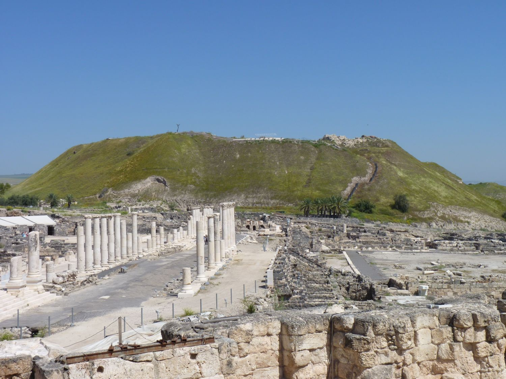

# Human-made Things in the Bible

## License Information

Human-made Things in the Bible © United Bible Societies, 2025. Adapted from: <cite>The Works of Their Hands: Man-made Things in the Bible</cite>, by Ray Pritz © 2009 United Bible Societies. This work is licensed under Creative Commons Attribution-ShareAlike 4.0 International (<a href="https://creativecommons.org/licenses/by-sa/4.0/">https://creativecommons.org/licenses/by-sa/4.0/</a>).

--------------------------------

## 標題：廢丘、土丘、土堆（tell, mound） (id: REALIA:3.13.9)

3\.13\.9 標題：廢丘、土丘、土堆（tell, mound）
=================================

經文出處
----

Hebrew 來： גַּל, נצה (音譯： gal (nitsim))

[2KI 19:25](https://ref.ly/2Kgs19:25), [JOB 15:28](https://ref.ly/Job15:28), [ISA 25:2](https://ref.ly/Isa25:2), [ISA 37:26](https://ref.ly/Isa37:26), [JER 9:10](https://ref.ly/Jer9:10), [JER 51:37](https://ref.ly/Jer51:37)

Hebrew 來： מְעִי, מַפָּלָה (音譯： m‘i mapalah)

[ISA 17:1](https://ref.ly/Isa17:1)

Hebrew 來： עִי (音譯： ‘i)

[PSA 79:1](https://ref.ly/Ps79:1), [JER 26:18](https://ref.ly/Jer26:18), [MIC 1:6](https://ref.ly/Mic1:6), [MIC 3:12](https://ref.ly/Mic3:12)

Hebrew 來： תֵּל (音譯： tel)

[DEU 13:17](https://ref.ly/Deut13:17), [JOS 8:28](https://ref.ly/Josh8:28), [JOS 11:13](https://ref.ly/Josh11:13), [JER 30:18](https://ref.ly/Jer30:18), [JER 49:2](https://ref.ly/Jer49:2)

描述
--

*廢丘（伯善） (© Grauesel, CC BY\-SA 3\.0, via Wikimedia Commons)*

廢丘是指某地建於多個不同時期的城鎮，由於多次被毀和重建而形成的一座小山。聖地有許多個廢丘，其中有很多已被挖掘出來，而且已被確認是聖經中提到的古代城鎮。

---

翻譯
--

古代的城鎮經常會被戰爭摧毀，或者在瘟疫、饑荒過後被遺棄；隨著時間的推移，城鎮中的建築也會倒塌。新城市往往直接建造在舊城市的廢墟上，並不完全清除舊城市的基礎和建設。這個在舊建築上面建造新建築的過程，逐漸形成了一座人工的山丘或土丘。在聖經的描述中，這些土丘代表著毀壞和衰敗。然而，建造在這些土丘上的城鎮地勢較高，因而更容易防禦。

除了[JOS 11:13](https://ref.ly/Josh11:13) 和[JER 30:18](https://ref.ly/Jer30:18) 可能是例外，上面列出的所有詞語都含有某種負面的意思，不是僅僅指上面建有城市的土丘，而是指毀滅性活動所導致的一堆廢墟。

[JER 49:2](https://ref.ly/Jer49:2) ：原文字面意為「它必成為一個荒廢的土丘」的分可以譯為：「它必成為一座由廢墟覆蓋的小山」（NCV (New Century Version) 直譯）。有些譯本沒有保留文中關於高度的元素，譯為「它必成為廢墟」（如GNT (Good News Translation (1992)) 、CEV (Contemporary English Version) ）。GECL (German Common Language Version (Gute Nachricht Bibel)) 提供了一個很值得借鑒的翻譯範例，譯為「拉巴必成為一堆瓦礫。」

* **Associated Passages:** 列王紀下 19:25; 約伯記 15:28; 以賽亞書 25:2; 以賽亞書 37:26; 耶利米書 9:10; 耶利米書 51:37; 以賽亞書 17:1; 詩篇 79:1; 耶利米書 26:18; 彌迦書 1:6; 彌迦書 3:12; 申命記 13:17; 約書亞記 8:28; 約書亞記 11:13; 耶利米書 30:18; 耶利米書 49:2

