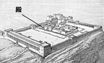
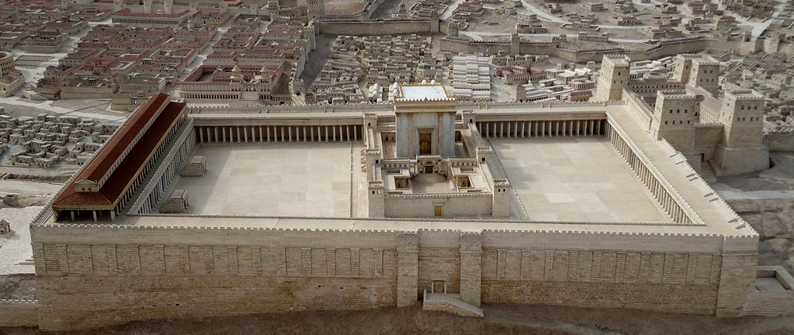
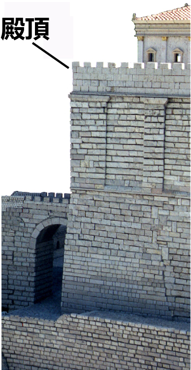
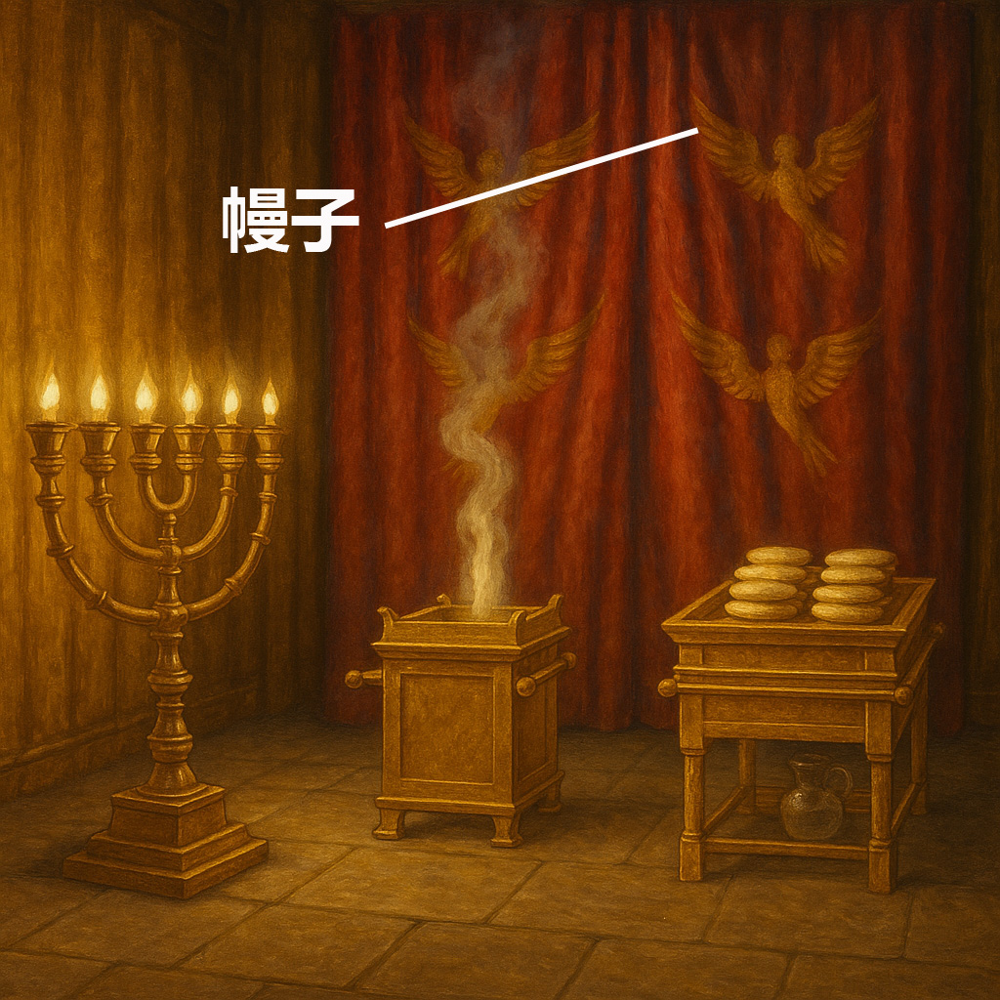

# Human-made Things in the Bible

## License Information

Human-made Things in the Bible © United Bible Societies, 2025. Adapted from: <cite>The Works of Their Hands: Man-made Things in the Bible</cite>, by Ray Pritz © 2009 United Bible Societies. This work is licensed under Creative Commons Attribution-ShareAlike 4.0 International (<a href="https://creativecommons.org/licenses/by-sa/4.0/">https://creativecommons.org/licenses/by-sa/4.0/</a>).

--------------------------------

## 標題：猶太人的聖殿（Jewish Temple） (id: REALIA:3.14.1)

3\.14\.1 標題：猶太人的聖殿（Jewish Temple）
=================================

經文出處
----

Hebrew 來： בַּיִת (音譯： bayith)

[2SA 7:5](https://ref.ly/2Sam7:5), [2SA 7:6](https://ref.ly/2Sam7:6), [2SA 7:7](https://ref.ly/2Sam7:7), [1KI 3:1](https://ref.ly/1Kgs3:1), [1KI 3:2](https://ref.ly/1Kgs3:2), [1KI 5:17](https://ref.ly/1Kgs5:17), [1KI 5:19](https://ref.ly/1Kgs5:19), [1KI 5:19](https://ref.ly/1Kgs5:19), [1KI 5:31](https://ref.ly/1Kgs5:31), [1KI 5:32](https://ref.ly/1Kgs5:32)

Hebrew 來： הֵיכָל (音譯： heykal)

[2SA 22:7](https://ref.ly/2Sam22:7), [1KI 6:3](https://ref.ly/1Kgs6:3), [1KI 6:5](https://ref.ly/1Kgs6:5), [1KI 7:21](https://ref.ly/1Kgs7:21), [2KI 18:16](https://ref.ly/2Kgs18:16), [2KI 23:4](https://ref.ly/2Kgs23:4), [2KI 24:13](https://ref.ly/2Kgs24:13), [2CH 3:17](https://ref.ly/2Chr3:17), [2CH 4:7](https://ref.ly/2Chr4:7), [2CH 4:8](https://ref.ly/2Chr4:8), [2CH 26:16](https://ref.ly/2Chr26:16), [2CH 27:2](https://ref.ly/2Chr27:2), [EZR 3:6](https://ref.ly/Ezra3:6), [EZR 3:10](https://ref.ly/Ezra3:10), [EZR 4:1](https://ref.ly/Ezra4:1), [PSA 27:4](https://ref.ly/Ps27:4), [PSA 29:9](https://ref.ly/Ps29:9), [PSA 48:10](https://ref.ly/Ps48:10), [PSA 65:5](https://ref.ly/Ps65:5), [PSA 68:30](https://ref.ly/Ps68:30), [PSA 79:1](https://ref.ly/Ps79:1), [ISA 44:28](https://ref.ly/Isa44:28), [ISA 66:6](https://ref.ly/Isa66:6), [JER 7:4](https://ref.ly/Jer7:4), [JER 7:4](https://ref.ly/Jer7:4), [JER 7:4](https://ref.ly/Jer7:4), [JER 24:1](https://ref.ly/Jer24:1), [JER 50:28](https://ref.ly/Jer50:28), [JER 51:11](https://ref.ly/Jer51:11), [AMO 8:3](https://ref.ly/Amos8:3), [HAG 2:15](https://ref.ly/Hag2:15), [HAG 2:18](https://ref.ly/Hag2:18), [ZEC 6:12](https://ref.ly/Zech6:12), [ZEC 6:13](https://ref.ly/Zech6:13), [ZEC 6:14](https://ref.ly/Zech6:14), [ZEC 6:15](https://ref.ly/Zech6:15), [ZEC 8:9](https://ref.ly/Zech8:9)

Aramaic 蘭：הֵיכַל (音譯： heykal)

[EZR 5:14](https://ref.ly/Ezra5:14), [EZR 5:14](https://ref.ly/Ezra5:14), [EZR 5:14](https://ref.ly/Ezra5:14), [EZR 5:15](https://ref.ly/Ezra5:15), [EZR 6:5](https://ref.ly/Ezra6:5), [EZR 6:5](https://ref.ly/Ezra6:5), [DAN 5:2](https://ref.ly/Dan5:2), [DAN 5:3](https://ref.ly/Dan5:3)

Hebrew 來： מוֹעֵד (音譯： mo‘ed)

[PSA 74:4](https://ref.ly/Ps74:4), [LAM 2:6](https://ref.ly/Lam2:6)

Hebrew 來： מִקְדָּשׁ (音譯： miqdash)

[1CH 22:19](https://ref.ly/1Chr22:19), [1CH 28:10](https://ref.ly/1Chr28:10), [2CH 20:8](https://ref.ly/2Chr20:8), [2CH 26:18](https://ref.ly/2Chr26:18), [2CH 29:21](https://ref.ly/2Chr29:21), [2CH 30:8](https://ref.ly/2Chr30:8), [2CH 36:17](https://ref.ly/2Chr36:17), [NEH 10:40](https://ref.ly/Neh10:40), [PSA 68:36](https://ref.ly/Ps68:36), [PSA 73:17](https://ref.ly/Ps73:17), [PSA 74:7](https://ref.ly/Ps74:7), [PSA 78:69](https://ref.ly/Ps78:69), [PSA 96:6](https://ref.ly/Ps96:6), [ISA 60:13](https://ref.ly/Isa60:13), [ISA 63:18](https://ref.ly/Isa63:18), [JER 17:12](https://ref.ly/Jer17:12), [JER 51:51](https://ref.ly/Jer51:51), [LAM 1:10](https://ref.ly/Lam1:10), [LAM 2:7](https://ref.ly/Lam2:7), [LAM 2:20](https://ref.ly/Lam2:20), [EZK 5:11](https://ref.ly/Ezek5:11), [EZK 8:6](https://ref.ly/Ezek8:6), [EZK 9:6](https://ref.ly/Ezek9:6), [EZK 23:38](https://ref.ly/Ezek23:38), [EZK 23:39](https://ref.ly/Ezek23:39), [EZK 24:21](https://ref.ly/Ezek24:21), [EZK 25:3](https://ref.ly/Ezek25:3), [EZK 37:26](https://ref.ly/Ezek37:26), [EZK 37:28](https://ref.ly/Ezek37:28), [EZK 43:21](https://ref.ly/Ezek43:21), [EZK 44:1](https://ref.ly/Ezek44:1), [EZK 44:5](https://ref.ly/Ezek44:5), [EZK 44:7](https://ref.ly/Ezek44:7), [EZK 44:8](https://ref.ly/Ezek44:8), [EZK 44:9](https://ref.ly/Ezek44:9), [EZK 44:11](https://ref.ly/Ezek44:11), [EZK 44:15](https://ref.ly/Ezek44:15), [EZK 44:16](https://ref.ly/Ezek44:16), [EZK 45:4](https://ref.ly/Ezek45:4), [EZK 45:4](https://ref.ly/Ezek45:4), [EZK 45:18](https://ref.ly/Ezek45:18), [EZK 47:12](https://ref.ly/Ezek47:12), [EZK 48:8](https://ref.ly/Ezek48:8), [EZK 48:10](https://ref.ly/Ezek48:10), [EZK 48:21](https://ref.ly/Ezek48:21), [DAN 8:11](https://ref.ly/Dan8:11), [DAN 9:17](https://ref.ly/Dan9:17), [DAN 11:31](https://ref.ly/Dan11:31)

Hebrew 來： קָדוֹשׁ (音譯： qadosh)

[ECC 8:10](https://ref.ly/Eccl8:10)

Hebrew 來： קֹדֶשׁ (音譯： qodesh)

[1CH 23:32](https://ref.ly/1Chr23:32), [1CH 24:5](https://ref.ly/1Chr24:5), [2CH 29:5](https://ref.ly/2Chr29:5), [2CH 29:7](https://ref.ly/2Chr29:7), [2CH 30:19](https://ref.ly/2Chr30:19), [PSA 20:3](https://ref.ly/Ps20:3), [PSA 24:3](https://ref.ly/Ps24:3), [PSA 63:3](https://ref.ly/Ps63:3), [PSA 68:18](https://ref.ly/Ps68:18), [PSA 68:25](https://ref.ly/Ps68:25), [PSA 74:3](https://ref.ly/Ps74:3), [PSA 134:2](https://ref.ly/Ps134:2), [PSA 150:1](https://ref.ly/Ps150:1), [ISA 43:28](https://ref.ly/Isa43:28), [EZK 44:27](https://ref.ly/Ezek44:27), [EZK 44:27](https://ref.ly/Ezek44:27), [EZK 45:3](https://ref.ly/Ezek45:3), [EZK 45:3](https://ref.ly/Ezek45:3), [EZK 45:3](https://ref.ly/Ezek45:3), [DAN 8:13](https://ref.ly/Dan8:13), [DAN 8:14](https://ref.ly/Dan8:14), [DAN 9:24](https://ref.ly/Dan9:24), [DAN 9:26](https://ref.ly/Dan9:26)

Hebrew 來： שֹׂךְ (音譯： sok)

[LAM 2:6](https://ref.ly/Lam2:6)

Greek 希： ἅγιος (音譯： hagios)

[JDT 4:12](https://ref.ly/Jdt4:12), [JDT 4:13](https://ref.ly/Jdt4:13), [JDT 8:21](https://ref.ly/Jdt8:21), [JDT 8:24](https://ref.ly/Jdt8:24), [JDT 9:8](https://ref.ly/Jdt9:8), [JDT 16:20](https://ref.ly/Jdt16:20), [1MA 2:12](https://ref.ly/1Macc2:12), [1MA 3:43](https://ref.ly/1Macc3:43), [1MA 3:51](https://ref.ly/1Macc3:51), [1MA 3:58](https://ref.ly/1Macc3:58), [1MA 3:59](https://ref.ly/1Macc3:59), [1MA 4:36](https://ref.ly/1Macc4:36), [1MA 4:41](https://ref.ly/1Macc4:41), [1MA 4:43](https://ref.ly/1Macc4:43), [1MA 4:48](https://ref.ly/1Macc4:48), [1MA 6:18](https://ref.ly/1Macc6:18), [1MA 6:54](https://ref.ly/1Macc6:54), [1MA 7:33](https://ref.ly/1Macc7:33), [1MA 7:42](https://ref.ly/1Macc7:42), [1MA 9:54](https://ref.ly/1Macc9:54), [1MA 10:42](https://ref.ly/1Macc10:42), [1MA 10:39](https://ref.ly/1Macc10:39), [1MA 10:39](https://ref.ly/1Macc10:39), [1MA 10:44](https://ref.ly/1Macc10:44), [1MA 13:3](https://ref.ly/1Macc13:3), [1MA 13:6](https://ref.ly/1Macc13:6), [1MA 14:15](https://ref.ly/1Macc14:15), [1MA 14:15](https://ref.ly/1Macc14:15), [1MA 14:29](https://ref.ly/1Macc14:29), [1MA 14:31](https://ref.ly/1Macc14:31), [1MA 14:36](https://ref.ly/1Macc14:36), [1MA 14:42](https://ref.ly/1Macc14:42), [1MA 14:48](https://ref.ly/1Macc14:48), [1MA 15:7](https://ref.ly/1Macc15:7), [2MA 15:17](https://ref.ly/2Macc15:17)

Greek 希： ἁγίασμα (音譯： hagiasma)

[JDT 5:19](https://ref.ly/Jdt5:19), [SIR 47:10](https://ref.ly/Sir47:10), [SIR 47:13](https://ref.ly/Sir47:13), [SIR 50:11](https://ref.ly/Sir50:11), [1MA 1:21](https://ref.ly/1Macc1:21), [1MA 1:36](https://ref.ly/1Macc1:36), [1MA 1:37](https://ref.ly/1Macc1:37), [1MA 1:37](https://ref.ly/1Macc1:37), [1MA 1:39](https://ref.ly/1Macc1:39), [1MA 1:45](https://ref.ly/1Macc1:45), [1MA 1:46](https://ref.ly/1Macc1:46), [1MA 2:7](https://ref.ly/1Macc2:7), [1MA 3:45](https://ref.ly/1Macc3:45), [1MA 4:38](https://ref.ly/1Macc4:38), [1MA 5:1](https://ref.ly/1Macc5:1), [1MA 6:7](https://ref.ly/1Macc6:7), [1MA 6:26](https://ref.ly/1Macc6:26), [1MA 6:51](https://ref.ly/1Macc6:51)

Greek 希： ἁγιασμός (音譯： hagiasmos)

[3MA 2:18](https://ref.ly/3Macc2:18)

Greek 希： ἱερός (音譯： hieros)

[MAT 4:5](https://ref.ly/Matt4:5), [MAT 12:5](https://ref.ly/Matt12:5), [MAT 12:6](https://ref.ly/Matt12:6), [MAT 21:12](https://ref.ly/Matt21:12), [MAT 21:12](https://ref.ly/Matt21:12), [MAT 21:14](https://ref.ly/Matt21:14), [MAT 21:15](https://ref.ly/Matt21:15), [MAT 21:23](https://ref.ly/Matt21:23), [MAT 24:1](https://ref.ly/Matt24:1), [MAT 24:1](https://ref.ly/Matt24:1), [MAT 26:55](https://ref.ly/Matt26:55), [MRK 11:11](https://ref.ly/Mark11:11), [MRK 11:15](https://ref.ly/Mark11:15), [MRK 11:15](https://ref.ly/Mark11:15), [MRK 11:16](https://ref.ly/Mark11:16), [MRK 11:27](https://ref.ly/Mark11:27), [MRK 12:35](https://ref.ly/Mark12:35), [MRK 13:1](https://ref.ly/Mark13:1), [MRK 13:3](https://ref.ly/Mark13:3), [MRK 14:49](https://ref.ly/Mark14:49), [LUK 2:27](https://ref.ly/Luke2:27), [LUK 2:37](https://ref.ly/Luke2:37), [LUK 2:46](https://ref.ly/Luke2:46), [LUK 4:9](https://ref.ly/Luke4:9), [LUK 18:10](https://ref.ly/Luke18:10), [LUK 19:45](https://ref.ly/Luke19:45), [LUK 19:47](https://ref.ly/Luke19:47), [LUK 20:1](https://ref.ly/Luke20:1), [LUK 21:5](https://ref.ly/Luke21:5), [LUK 21:37](https://ref.ly/Luke21:37), [LUK 21:38](https://ref.ly/Luke21:38), [LUK 22:52](https://ref.ly/Luke22:52), [LUK 22:53](https://ref.ly/Luke22:53), [LUK 24:53](https://ref.ly/Luke24:53), [JHN 2:14](https://ref.ly/John2:14), [JHN 2:15](https://ref.ly/John2:15), [JHN 5:14](https://ref.ly/John5:14), [JHN 7:14](https://ref.ly/John7:14), [JHN 7:28](https://ref.ly/John7:28), [JHN 8:2](https://ref.ly/John8:2), [JHN 8:20](https://ref.ly/John8:20), [JHN 8:59](https://ref.ly/John8:59), [JHN 10:23](https://ref.ly/John10:23), [JHN 11:56](https://ref.ly/John11:56), [JHN 18:20](https://ref.ly/John18:20), [ACT 2:46](https://ref.ly/Acts2:46), [ACT 3:1](https://ref.ly/Acts3:1), [ACT 3:2](https://ref.ly/Acts3:2), [ACT 3:2](https://ref.ly/Acts3:2), [ACT 3:3](https://ref.ly/Acts3:3), [ACT 3:8](https://ref.ly/Acts3:8), [ACT 3:10](https://ref.ly/Acts3:10), [ACT 4:1](https://ref.ly/Acts4:1), [ACT 5:20](https://ref.ly/Acts5:20), [ACT 5:21](https://ref.ly/Acts5:21), [ACT 5:24](https://ref.ly/Acts5:24), [ACT 5:25](https://ref.ly/Acts5:25), [ACT 5:42](https://ref.ly/Acts5:42), [ACT 19:27](https://ref.ly/Acts19:27), [ACT 21:26](https://ref.ly/Acts21:26), [ACT 21:27](https://ref.ly/Acts21:27), [ACT 21:28](https://ref.ly/Acts21:28), [ACT 21:29](https://ref.ly/Acts21:29), [ACT 21:30](https://ref.ly/Acts21:30), [ACT 22:17](https://ref.ly/Acts22:17), [ACT 24:6](https://ref.ly/Acts24:6), [ACT 24:12](https://ref.ly/Acts24:12), [ACT 24:18](https://ref.ly/Acts24:18), [ACT 25:8](https://ref.ly/Acts25:8), [ACT 26:21](https://ref.ly/Acts26:21), [1CO 9:13](https://ref.ly/1Cor9:13), [1CO 9:13](https://ref.ly/1Cor9:13)

Greek 希： ναός (音譯： naos)

[MAT 23:16](https://ref.ly/Matt23:16), [MAT 23:16](https://ref.ly/Matt23:16), [MAT 23:17](https://ref.ly/Matt23:17), [MAT 23:21](https://ref.ly/Matt23:21), [MAT 23:35](https://ref.ly/Matt23:35), [MAT 26:61](https://ref.ly/Matt26:61), [MAT 27:5](https://ref.ly/Matt27:5), [MAT 27:40](https://ref.ly/Matt27:40), [MAT 27:51](https://ref.ly/Matt27:51), [MRK 14:58](https://ref.ly/Mark14:58), [MRK 15:29](https://ref.ly/Mark15:29), [MRK 15:38](https://ref.ly/Mark15:38), [LUK 1:9](https://ref.ly/Luke1:9), [LUK 1:21](https://ref.ly/Luke1:21), [LUK 1:22](https://ref.ly/Luke1:22), [LUK 23:45](https://ref.ly/Luke23:45), [JHN 2:19](https://ref.ly/John2:19), [JHN 2:20](https://ref.ly/John2:20), [1CO 3:17](https://ref.ly/1Cor3:17), [1CO 3:17](https://ref.ly/1Cor3:17), [2CO 6:16](https://ref.ly/2Cor6:16), [EPH 2:21](https://ref.ly/Eph2:21), [2TH 2:4](https://ref.ly/2Thess2:4), [REV 3:12](https://ref.ly/Rev3:12), [REV 7:15](https://ref.ly/Rev7:15), [REV 11:1](https://ref.ly/Rev11:1), [REV 11:2](https://ref.ly/Rev11:2), [REV 11:19](https://ref.ly/Rev11:19), [REV 11:19](https://ref.ly/Rev11:19), [REV 14:15](https://ref.ly/Rev14:15), [REV 14:17](https://ref.ly/Rev14:17), [REV 15:5](https://ref.ly/Rev15:5), [REV 15:6](https://ref.ly/Rev15:6), [REV 15:8](https://ref.ly/Rev15:8), [REV 15:8](https://ref.ly/Rev15:8), [REV 16:1](https://ref.ly/Rev16:1), [REV 16:17](https://ref.ly/Rev16:17)

Greek 希： νεώς (音譯： neōs)

[2MA 4:14](https://ref.ly/2Macc4:14), [2MA 6:2](https://ref.ly/2Macc6:2), [2MA 9:16](https://ref.ly/2Macc9:16), [2MA 10:3](https://ref.ly/2Macc10:3), [2MA 10:5](https://ref.ly/2Macc10:5), [2MA 13:23](https://ref.ly/2Macc13:23), [2MA 14:33](https://ref.ly/2Macc14:33)

Greek 希： οἰκία, οἶκος (音譯： oikia, oikos)

[MAT 12:4](https://ref.ly/Matt12:4), [MAT 21:13](https://ref.ly/Matt21:13), [MAT 21:13](https://ref.ly/Matt21:13), [MRK 2:26](https://ref.ly/Mark2:26), [MRK 11:17](https://ref.ly/Mark11:17), [MRK 11:17](https://ref.ly/Mark11:17), [LUK 6:4](https://ref.ly/Luke6:4), [LUK 11:51](https://ref.ly/Luke11:51), [LUK 19:46](https://ref.ly/Luke19:46), [LUK 19:46](https://ref.ly/Luke19:46), [JHN 2:16](https://ref.ly/John2:16), [JHN 2:17](https://ref.ly/John2:17), [JHN 14:2](https://ref.ly/John14:2), [ACT 7:47](https://ref.ly/Acts7:47), [ACT 7:49](https://ref.ly/Acts7:49), [HEB 3:2](https://ref.ly/Heb3:2), [HEB 3:5](https://ref.ly/Heb3:5), [HEB 10:21](https://ref.ly/Heb10:21)

Greek 希： σκήνωμα (音譯： skēnōma)

[JDT 9:8](https://ref.ly/Jdt9:8)

Greek 希： τόπος, ἅγιος, ἁγίασμα (音譯： topos, hagios topos, topos hagios, topos tou hagiasmatos)

[MAT 24:15](https://ref.ly/Matt24:15), [JHN 11:48](https://ref.ly/John11:48), [ACT 6:13](https://ref.ly/Acts6:13), [ACT 21:28](https://ref.ly/Acts21:28), [2MA 2:18](https://ref.ly/2Macc2:18), [2MA 3:18](https://ref.ly/2Macc3:18), [2MA 5:17](https://ref.ly/2Macc5:17), [2MA 5:19](https://ref.ly/2Macc5:19), [2MA 5:19](https://ref.ly/2Macc5:19), [2MA 8:17](https://ref.ly/2Macc8:17), [2MA 10:7](https://ref.ly/2Macc10:7), [2MA 13:23](https://ref.ly/2Macc13:23), [3MA 1:9](https://ref.ly/3Macc1:9), [3MA 1:9](https://ref.ly/3Macc1:9), [3MA 1:23](https://ref.ly/3Macc1:23), [3MA 2:14](https://ref.ly/3Macc2:14), [4MA 4:9](https://ref.ly/4Macc4:9), [4MA 4:12](https://ref.ly/4Macc4:12), [1ES 8:75](https://ref.ly/1Esd8:75)

Latin 拉： sanctificatio

[2ES 7:108](https://ref.ly/2Esd7:108), [2ES 10:21](https://ref.ly/2Esd10:21), [2ES 12:48](https://ref.ly/2Esd12:48), [2ES 15:25](https://ref.ly/2Esd15:25)

Latin 拉： templum

[2ES 10:21](https://ref.ly/2Esd10:21)

描述和用途
-----

*希律聖殿示意圖 (© Public Domain \- Wikimedia Commons)*

聖殿是位於耶路撒冷的一座建築物，被視為上帝的居所，是百姓敬拜他的地方。自所羅門首次建殿以來，它就是猶太人敬拜的中心。在猶太人的歷史上，一共建造了三座聖殿，每一座都非常不同。所羅門建造的第一座聖殿於主前587或主前586年被毀。大約70年後，所羅巴伯建造了一座比較簡樸的新殿，該殿一直使用到差不多新約時期，那時大希律進行了大規模的重建。這第三座聖殿約在主後63年才建成，但是7年之後就被羅馬軍隊摧毀。

---

翻譯
--

*希律時代的聖殿山模型 (© Ray Pritz by United Bible Societies)*

實際上，聖經中提到四座猶太人的聖殿，分別是所羅門、所羅巴伯和大希律修建的聖殿，以及《以西結書》最後幾章中提到的、以西結在異象中見到的理想聖殿。翻譯者應使用同一個詞來表示這四座聖殿，同時提供附註或術語簡釋詞條來解釋它們之間的不同。一般情況下，不需要也不建議在譯文中說明它們之間的不同。

「聖殿」可譯為「上帝的殿」、「上帝的居所」或「上帝的房屋」。有些語言會說「聖潔的房屋」或「聖潔的地方」。其他譯法有「向上帝歌唱的大房屋」、「向上帝禱告的大房屋」等。

*藝術家構想的以西結聖殿 (© Deutsche Bibelgesellschaft, Stuttgart by United Bible Societies)*

希伯來文*mo‘ed* 的字面意思是約定的會面時間或地點。在上面提到的經文中，這個詞指的是聖殿，是人們前來度過神聖節期的地方。

*(Image generated by ChatGPT using OpenAI technology)*

有些語言有專門的詞語來表示「聖殿」，而且通常會與表示神明居住的祭祀中心所用的詞語區別開來。在新約中，希臘文*naos* 指的是一座建築，而*hieron* 指的是整個聖殿區域，包括建築、庭院和庫房。雖然在一些上下文中不需要區分*hieron* 和*naos* ，但在[MAT 21:12](https://ref.ly/Matt21:12) （以及平行經文[MRK 11:15](https://ref.ly/Mark11:15); [LUK 19:45](https://ref.ly/Luke19:45); [JHN 2:14](https://ref.ly/John2:14) ）中，翻譯者需要指出這個區別，以免讓人誤以為獻祭的動物是在中央聖所售賣的。翻譯者要避免使用同一個詞語來翻譯「聖殿」和新約中的「會堂」。

* **Associated Passages:** 撒母耳記下 7:5; 撒母耳記下 7:6; 撒母耳記下 7:7; 列王紀上 3:1; 列王紀上 3:2; 列王紀上 5:17; 列王紀上 5:19; 列王紀上 5:31; 列王紀上 5:32; 撒母耳記下 22:7; 列王紀上 6:3; 列王紀上 6:5; 列王紀上 7:21; 列王紀下 18:16; 列王紀下 23:4; 列王紀下 24:13; 歷代志下 3:17; 歷代志下 4:7; 歷代志下 4:8; 歷代志下 26:16; 歷代志下 27:2; 以斯拉記 3:6; 以斯拉記 3:10; 以斯拉記 4:1; 詩篇 27:4; 詩篇 29:9; 詩篇 48:10; 詩篇 65:5; 詩篇 68:30; 詩篇 79:1; 以賽亞書 44:28; 以賽亞書 66:6; 耶利米書 7:4; 耶利米書 24:1; 耶利米書 50:28; 耶利米書 51:11; 阿摩司書 8:3; 哈該書 2:15; 哈該書 2:18; 撒迦利亞書 6:12; 撒迦利亞書 6:13; 撒迦利亞書 6:14; 撒迦利亞書 6:15; 撒迦利亞書 8:9; 以斯拉記 5:14; 以斯拉記 5:15; 以斯拉記 6:5; 但以理書 5:2; 但以理書 5:3; 詩篇 74:4; 耶利米哀歌 2:6; 歷代志上 22:19; 歷代志上 28:10; 歷代志下 20:8; 歷代志下 26:18; 歷代志下 29:21; 歷代志下 30:8; 歷代志下 36:17; 尼希米記 10:40; 詩篇 68:36; 詩篇 73:17; 詩篇 74:7; 詩篇 78:69; 詩篇 96:6; 以賽亞書 60:13; 以賽亞書 63:18; 耶利米書 17:12; 耶利米書 51:51; 耶利米哀歌 1:10; 耶利米哀歌 2:7; 耶利米哀歌 2:20; 以西結書 5:11; 以西結書 8:6; 以西結書 9:6; 以西結書 23:38; 以西結書 23:39; 以西結書 24:21; 以西結書 25:3; 以西結書 37:26; 以西結書 37:28; 以西結書 43:21; 以西結書 44:1; 以西結書 44:5; 以西結書 44:7; 以西結書 44:8; 以西結書 44:9; 以西結書 44:11; 以西結書 44:15; 以西結書 44:16; 以西結書 45:4; 以西結書 45:18; 以西結書 47:12; 以西結書 48:8; 以西結書 48:10; 以西結書 48:21; 但以理書 8:11; 但以理書 9:17; 但以理書 11:31; 傳道書 8:10; 歷代志上 23:32; 歷代志上 24:5; 歷代志下 29:5; 歷代志下 29:7; 歷代志下 30:19; 詩篇 20:3; 詩篇 24:3; 詩篇 63:3; 詩篇 68:18; 詩篇 68:25; 詩篇 74:3; 詩篇 134:2; 詩篇 150:1; 以賽亞書 43:28; 以西結書 44:27; 以西結書 45:3; 但以理書 8:13; 但以理書 8:14; 但以理書 9:24; 但以理書 9:26; 友弟德傳 4:12; 友弟德傳 4:13; 友弟德傳 8:21; 友弟德傳 8:24; 友弟德傳 9:8; 友弟德傳 16:20; 瑪加伯上 2:12; 瑪加伯上 3:43; 瑪加伯上 3:51; 瑪加伯上 3:58; 瑪加伯上 3:59; 瑪加伯上 4:36; 瑪加伯上 4:41; 瑪加伯上 4:43; 瑪加伯上 4:48; 瑪加伯上 6:18; 瑪加伯上 6:54; 瑪加伯上 7:33; 瑪加伯上 7:42; 瑪加伯上 9:54; 瑪加伯上 10:42; 瑪加伯上 10:39; 瑪加伯上 10:44; 瑪加伯上 13:3; 瑪加伯上 13:6; 瑪加伯上 14:15; 瑪加伯上 14:29; 瑪加伯上 14:31; 瑪加伯上 14:36; 瑪加伯上 14:42; 瑪加伯上 14:48; 瑪加伯上 15:7; 瑪加伯下 15:17; 友弟德傳 5:19; 德訓篇 47:10; 德訓篇 47:13; 德訓篇 50:11; 瑪加伯上 1:21; 瑪加伯上 1:36; 瑪加伯上 1:37; 瑪加伯上 1:39; 瑪加伯上 1:45; 瑪加伯上 1:46; 瑪加伯上 2:7; 瑪加伯上 3:45; 瑪加伯上 4:38; 瑪加伯上 5:1; 瑪加伯上 6:7; 瑪加伯上 6:26; 瑪加伯上 6:51; 瑪加伯三書 2:18; 馬太福音 4:5; 馬太福音 12:5; 馬太福音 12:6; 馬太福音 21:12; 馬太福音 21:14; 馬太福音 21:15; 馬太福音 21:23; 馬太福音 24:1; 馬太福音 26:55; 馬可福音 11:11; 馬可福音 11:15; 馬可福音 11:16; 馬可福音 11:27; 馬可福音 12:35; 馬可福音 13:1; 馬可福音 13:3; 馬可福音 14:49; 路加福音 2:27; 路加福音 2:37; 路加福音 2:46; 路加福音 4:9; 路加福音 18:10; 路加福音 19:45; 路加福音 19:47; 路加福音 20:1; 路加福音 21:5; 路加福音 21:37; 路加福音 21:38; 路加福音 22:52; 路加福音 22:53; 路加福音 24:53; 約翰福音 2:14; 約翰福音 2:15; 約翰福音 5:14; 約翰福音 7:14; 約翰福音 7:28; 約翰福音 8:2; 約翰福音 8:20; 約翰福音 8:59; 約翰福音 10:23; 約翰福音 11:56; 約翰福音 18:20; 使徒行傳 2:46; 使徒行傳 3:1; 使徒行傳 3:2; 使徒行傳 3:3; 使徒行傳 3:8; 使徒行傳 3:10; 使徒行傳 4:1; 使徒行傳 5:20; 使徒行傳 5:21; 使徒行傳 5:24; 使徒行傳 5:25; 使徒行傳 5:42; 使徒行傳 19:27; 使徒行傳 21:26; 使徒行傳 21:27; 使徒行傳 21:28; 使徒行傳 21:29; 使徒行傳 21:30; 使徒行傳 22:17; 使徒行傳 24:6; 使徒行傳 24:12; 使徒行傳 24:18; 使徒行傳 25:8; 使徒行傳 26:21; 哥林多前書 9:13; 馬太福音 23:16; 馬太福音 23:17; 馬太福音 23:21; 馬太福音 23:35; 馬太福音 26:61; 馬太福音 27:5; 馬太福音 27:40; 馬太福音 27:51; 馬可福音 14:58; 馬可福音 15:29; 馬可福音 15:38; 路加福音 1:9; 路加福音 1:21; 路加福音 1:22; 路加福音 23:45; 約翰福音 2:19; 約翰福音 2:20; 哥林多前書 3:17; 哥林多後書 6:16; 以弗所書 2:21; 帖撒羅尼迦後書 2:4; 啟示錄 3:12; 啟示錄 7:15; 啟示錄 11:1; 啟示錄 11:2; 啟示錄 11:19; 啟示錄 14:15; 啟示錄 14:17; 啟示錄 15:5; 啟示錄 15:6; 啟示錄 15:8; 啟示錄 16:1; 啟示錄 16:17; 瑪加伯下 4:14; 瑪加伯下 6:2; 瑪加伯下 9:16; 瑪加伯下 10:3; 瑪加伯下 10:5; 瑪加伯下 13:23; 瑪加伯下 14:33; 馬太福音 12:4; 馬太福音 21:13; 馬可福音 2:26; 馬可福音 11:17; 路加福音 6:4; 路加福音 11:51; 路加福音 19:46; 約翰福音 2:16; 約翰福音 2:17; 約翰福音 14:2; 使徒行傳 7:47; 使徒行傳 7:49; 希伯來書 3:2; 希伯來書 3:5; 希伯來書 10:21; 馬太福音 24:15; 約翰福音 11:48; 使徒行傳 6:13; 瑪加伯下 2:18; 瑪加伯下 3:18; 瑪加伯下 5:17; 瑪加伯下 5:19; 瑪加伯下 8:17; 瑪加伯下 10:7; 瑪加伯三書 1:9; 瑪加伯三書 1:23; 瑪加伯三書 2:14; 瑪加伯四書 4:9; 瑪加伯四書 4:12; 厄斯德拉上 8:75; 厄斯德拉下 7:108; 厄斯德拉下 10:21; 厄斯德拉下 12:48; 厄斯德拉下 15:25

## 標題：門廳、門廊（entrance room, entrance hall） (id: REALIA:3.14.1.1)

3\.14\.1\.1 標題：門廳、門廊（entrance room, entrance hall）
==================================================

經文出處
----

Hebrew 來： אֵילָם, אוּלָם (音譯： ’eylam, ’elam, ’ulam)

[1KI 6:3](https://ref.ly/1Kgs6:3), [1KI 7:6](https://ref.ly/1Kgs7:6), [1KI 7:6](https://ref.ly/1Kgs7:6), [1KI 7:7](https://ref.ly/1Kgs7:7), [1KI 7:7](https://ref.ly/1Kgs7:7), [1KI 7:8](https://ref.ly/1Kgs7:8), [1KI 7:8](https://ref.ly/1Kgs7:8), [1KI 7:12](https://ref.ly/1Kgs7:12), [1KI 7:19](https://ref.ly/1Kgs7:19), [1KI 7:21](https://ref.ly/1Kgs7:21), [1CH 28:11](https://ref.ly/1Chr28:11), [2CH 3:4](https://ref.ly/2Chr3:4), [2CH 8:12](https://ref.ly/2Chr8:12), [2CH 15:8](https://ref.ly/2Chr15:8), [2CH 29:7](https://ref.ly/2Chr29:7), [2CH 29:17](https://ref.ly/2Chr29:17), [EZK 8:16](https://ref.ly/Ezek8:16), [EZK 40:7](https://ref.ly/Ezek40:7), [EZK 40:8](https://ref.ly/Ezek40:8), [EZK 40:9](https://ref.ly/Ezek40:9), [EZK 40:9](https://ref.ly/Ezek40:9), [EZK 40:15](https://ref.ly/Ezek40:15), [EZK 40:16](https://ref.ly/Ezek40:16), [EZK 40:21](https://ref.ly/Ezek40:21), [EZK 40:21](https://ref.ly/Ezek40:21), [EZK 40:22](https://ref.ly/Ezek40:22), [EZK 40:22](https://ref.ly/Ezek40:22), [EZK 40:22](https://ref.ly/Ezek40:22), [EZK 40:22](https://ref.ly/Ezek40:22), [EZK 40:24](https://ref.ly/Ezek40:24), [EZK 40:24](https://ref.ly/Ezek40:24), [EZK 40:25](https://ref.ly/Ezek40:25), [EZK 40:25](https://ref.ly/Ezek40:25), [EZK 40:26](https://ref.ly/Ezek40:26), [EZK 40:26](https://ref.ly/Ezek40:26), [EZK 40:29](https://ref.ly/Ezek40:29), [EZK 40:29](https://ref.ly/Ezek40:29), [EZK 40:29](https://ref.ly/Ezek40:29), [EZK 40:29](https://ref.ly/Ezek40:29), [EZK 40:30](https://ref.ly/Ezek40:30), [EZK 40:31](https://ref.ly/Ezek40:31), [EZK 40:33](https://ref.ly/Ezek40:33), [EZK 40:33](https://ref.ly/Ezek40:33), [EZK 40:33](https://ref.ly/Ezek40:33), [EZK 40:33](https://ref.ly/Ezek40:33), [EZK 40:34](https://ref.ly/Ezek40:34), [EZK 40:34](https://ref.ly/Ezek40:34), [EZK 40:36](https://ref.ly/Ezek40:36), [EZK 40:36](https://ref.ly/Ezek40:36), [EZK 40:39](https://ref.ly/Ezek40:39), [EZK 40:40](https://ref.ly/Ezek40:40), [EZK 40:48](https://ref.ly/Ezek40:48), [EZK 40:48](https://ref.ly/Ezek40:48), [EZK 40:49](https://ref.ly/Ezek40:49), [EZK 41:15](https://ref.ly/Ezek41:15), [EZK 41:25](https://ref.ly/Ezek41:25), [EZK 41:26](https://ref.ly/Ezek41:26), [EZK 44:3](https://ref.ly/Ezek44:3), [EZK 46:2](https://ref.ly/Ezek46:2), [EZK 46:8](https://ref.ly/Ezek46:8), [JOL 2:17](https://ref.ly/Joel2:17)

Hebrew 來： מִסְדְּרוֹן (音譯： misdron)

[JDG 3:23](https://ref.ly/Judg3:23)

描述和用途
-----

門廳是從大型建築的入口延伸出來的某種前廳。聖殿的門廳比殿的其餘部分要高，可能沒有屋頂。雖然聖經文本認為它是聖所內部空間的一部分，但它可能就像是個前院，是從外院過渡到建築物內部的構築物。上面列出的幾節經文並不是指聖殿的門廳。[JDG 3:23](https://ref.ly/Judg3:23) 和[1KI 7:6](https://ref.ly/1Kgs7:6); [1KI 7:7](https://ref.ly/1Kgs7:7); [1KI 7:8](https://ref.ly/1Kgs7:8) 指的是王宮的門廳，而《以西結書》中的一些經文（[EZK 40:7](https://ref.ly/Ezek40:7); [EZK 40:8](https://ref.ly/Ezek40:8); [EZK 40:9](https://ref.ly/Ezek40:9), [EZK 40:15](https://ref.ly/Ezek40:15); [EZK 40:16](https://ref.ly/Ezek40:16); [EZK 40:17](https://ref.ly/Ezek40:17); [EZK 40:18](https://ref.ly/Ezek40:18); [EZK 40:19](https://ref.ly/Ezek40:19); [EZK 40:20](https://ref.ly/Ezek40:20); [EZK 40:21](https://ref.ly/Ezek40:21); [EZK 40:22](https://ref.ly/Ezek40:22); [EZK 40:23](https://ref.ly/Ezek40:23); [EZK 40:24](https://ref.ly/Ezek40:24); [EZK 40:25](https://ref.ly/Ezek40:25); [EZK 40:26](https://ref.ly/Ezek40:26); [EZK 40:27](https://ref.ly/Ezek40:27); [EZK 40:28](https://ref.ly/Ezek40:28); [EZK 40:29](https://ref.ly/Ezek40:29); [EZK 40:30](https://ref.ly/Ezek40:30); [EZK 40:31](https://ref.ly/Ezek40:31); [EZK 40:32](https://ref.ly/Ezek40:32); [EZK 40:33](https://ref.ly/Ezek40:33); [EZK 40:34](https://ref.ly/Ezek40:34); [EZK 40:35](https://ref.ly/Ezek40:35); [EZK 40:36](https://ref.ly/Ezek40:36) ，[EZK 40:39](https://ref.ly/Ezek40:39); [EZK 40:40](https://ref.ly/Ezek40:40) ，[EZK 46:2](https://ref.ly/Ezek46:2) ，[EZK 46:8](https://ref.ly/Ezek46:8) ）指的是殿門的門廳。

---

翻譯
--

在許多語言中，希伯來文*’ulam* 唯一的近似對等詞可能是房屋入口裡面的小廳。但是，這可能會引起誤解，因為這個希伯來文詞語指的是一個非常大的廳，甚至比主建築還要寬。翻譯者可能要增加一個表示大小的修飾詞，如「很大的門廳」。

* **Associated Passages:** 列王紀上 6:3; 列王紀上 7:6; 列王紀上 7:7; 列王紀上 7:8; 列王紀上 7:12; 列王紀上 7:19; 列王紀上 7:21; 歷代志上 28:11; 歷代志下 3:4; 歷代志下 8:12; 歷代志下 15:8; 歷代志下 29:7; 歷代志下 29:17; 以西結書 8:16; 以西結書 40:7; 以西結書 40:8; 以西結書 40:9; 以西結書 40:15; 以西結書 40:16; 以西結書 40:21; 以西結書 40:22; 以西結書 40:24; 以西結書 40:25; 以西結書 40:26; 以西結書 40:29; 以西結書 40:30; 以西結書 40:31; 以西結書 40:33; 以西結書 40:34; 以西結書 40:36; 以西結書 40:39; 以西結書 40:40; 以西結書 40:48; 以西結書 40:49; 以西結書 41:15; 以西結書 41:25; 以西結書 41:26; 以西結書 44:3; 以西結書 46:2; 以西結書 46:8; 約珥書 2:17; 士師記 3:23; 以西結書 40:17; 以西結書 40:18; 以西結書 40:19; 以西結書 40:20; 以西結書 40:23; 以西結書 40:27; 以西結書 40:28; 以西結書 40:32; 以西結書 40:35

## 標題：柱廊、走廊、廊子、遊廊（colonnade, porch, covered walkway, stoa, portico） (id: REALIA:3.14.1.2)

3\.14\.1\.2 標題：柱廊、走廊、廊子、遊廊（colonnade, porch, covered walkway, stoa, portico）
============================================================================

經文出處
----

Greek 希： στοά (音譯： stoa)

[JHN 5:2](https://ref.ly/John5:2), [JHN 10:23](https://ref.ly/John10:23), [ACT 3:11](https://ref.ly/Acts3:11), [ACT 5:12](https://ref.ly/Acts5:12)

描述和用途
-----

*希律聖殿周圍的有蓋人行道模型 (© Ray Pritz by United Bible Societies)*

走廊是一個有頂蓋的柱廊，有一側通常是敞向戶外的，人們可以在走廊上或站、或坐、或走，而不受日曬雨淋。走廊由支撐著屋頂的兩排平行柱子組成。

---

翻譯
--

在世界上許多地方，與希臘文*stoa* 最相近的對等詞是一種遊廊（verandah），這是一種寬敞的走廊。這種走廊可譯為「很長的外部房間」或「柱子構成的開放式房間」。除[JHN 5:2](https://ref.ly/John5:2) 外，上面提到的經文都是指「所羅門廊」，這個走廊可能位於聖殿建築群中外邦人院的東側。

* **Associated Passages:** 約翰福音 5:2; 約翰福音 10:23; 使徒行傳 3:11; 使徒行傳 5:12

## 標題：煮祭肉的房間、廚房（rooms for boiling meat from sacrifices, kitchens） (id: REALIA:3.14.1.3)

3\.14\.1\.3 標題：煮祭肉的房間、廚房（rooms for boiling meat from sacrifices, kitchens）
==========================================================================

經文出處
----

Hebrew 來： בַּיִת, בשׁל (音譯： beyth mvashlim)

[EZK 46:24](https://ref.ly/Ezek46:24)

描述和用途
-----

在以西結對聖殿的描述中，外院的四角有幾個房間專門用來煮祭牲的肉。獻某些祭的百姓要吃分別為聖的祭肉，這些祭肉是由專門負責該項工作的僕役（可能是利未人）在這些房間裡面烹煮的。

---

翻譯
--

大部分譯本把[EZK 46:24](https://ref.ly/Ezek46:24) 中的*beyth mvashlim* 譯為「廚房」（如RSV (Revised Standard Version (1952)) 、CEV (Contemporary English Version) 、NIV (New International Version (1984)) ），也有譯為「烹煮的地方」（如NASB (New American Standard Bible) ）。GECL (German Common Language Version (Gute Nachricht Bibel)) 沒有出現房間的名稱，譯為「殿役會在這裡為百姓煮聖祭肉」。

* **Associated Passages:** 以西結書 46:24

## 標題：庫房、銀庫、寶庫（treasury, strongroom） (id: REALIA:3.14.1.4)

3\.14\.1\.4 標題：庫房、銀庫、寶庫（treasury, strongroom）
=============================================

經文出處
----

Hebrew 來： אֲרוֹן (音譯： ’aron)

[2KI 12:10](https://ref.ly/2Kgs12:10), [2KI 12:11](https://ref.ly/2Kgs12:11), [2CH 24:8](https://ref.ly/2Chr24:8), [2CH 24:10](https://ref.ly/2Chr24:10), [2CH 24:11](https://ref.ly/2Chr24:11), [2CH 24:11](https://ref.ly/2Chr24:11)

Hebrew 來： בַּיִת, אָסֹף (音譯： (beyth) ’asupim)

[1CH 26:15](https://ref.ly/1Chr26:15), [1CH 26:17](https://ref.ly/1Chr26:17)

Hebrew 來： בַּיִת, אוֹצָר (音譯： (beyth) ’otsar)

[DEU 28:12](https://ref.ly/Deut28:12), [DEU 32:34](https://ref.ly/Deut32:34), [JOS 6:19](https://ref.ly/Josh6:19), [JOS 6:24](https://ref.ly/Josh6:24), [1KI 7:51](https://ref.ly/1Kgs7:51), [1KI 15:18](https://ref.ly/1Kgs15:18), [1KI 15:18](https://ref.ly/1Kgs15:18), [2KI 12:19](https://ref.ly/2Kgs12:19), [2KI 14:14](https://ref.ly/2Kgs14:14), [2KI 16:8](https://ref.ly/2Kgs16:8), [2KI 18:15](https://ref.ly/2Kgs18:15), [2KI 20:13](https://ref.ly/2Kgs20:13), [2KI 20:15](https://ref.ly/2Kgs20:15), [2KI 24:13](https://ref.ly/2Kgs24:13), [2KI 24:13](https://ref.ly/2Kgs24:13), [1CH 9:26](https://ref.ly/1Chr9:26), [1CH 26:20](https://ref.ly/1Chr26:20), [1CH 26:20](https://ref.ly/1Chr26:20), [1CH 26:22](https://ref.ly/1Chr26:22), [1CH 26:24](https://ref.ly/1Chr26:24), [1CH 26:26](https://ref.ly/1Chr26:26), [1CH 27:25](https://ref.ly/1Chr27:25), [1CH 27:25](https://ref.ly/1Chr27:25), [1CH 28:12](https://ref.ly/1Chr28:12), [1CH 28:12](https://ref.ly/1Chr28:12), [1CH 29:8](https://ref.ly/1Chr29:8), [2CH 5:1](https://ref.ly/2Chr5:1), [2CH 8:15](https://ref.ly/2Chr8:15), [2CH 12:9](https://ref.ly/2Chr12:9), [2CH 12:9](https://ref.ly/2Chr12:9), [2CH 16:2](https://ref.ly/2Chr16:2), [2CH 25:24](https://ref.ly/2Chr25:24), [2CH 32:27](https://ref.ly/2Chr32:27), [EZR 2:69](https://ref.ly/Ezra2:69), [NEH 7:69](https://ref.ly/Neh7:69), [NEH 7:70](https://ref.ly/Neh7:70), [NEH 10:39](https://ref.ly/Neh10:39), [PRO 8:21](https://ref.ly/Prov8:21), [EZK 28:4](https://ref.ly/Ezek28:4), [DAN 1:2](https://ref.ly/Dan1:2), [HOS 13:15](https://ref.ly/Hos13:15), [MAL 3:10](https://ref.ly/Mal3:10)

Hebrew 來： בַּיִת, נְכֹאת (音譯： beth nkoth)

[2KI 20:13](https://ref.ly/2Kgs20:13), [ISA 39:2](https://ref.ly/Isa39:2)

Aramaic 蘭：גְּנַז (音譯： gnaz)

[EZR 7:20](https://ref.ly/Ezra7:20)

Hebrew 來： גֶּנֶז (音譯： genez)

[EST 3:9](https://ref.ly/Esth3:9), [EST 4:7](https://ref.ly/Esth4:7)

Hebrew 來： גַּנְזַךְ (音譯： ganzak)

[1CH 28:11](https://ref.ly/1Chr28:11)

Greek 希： γαζοφυλάκιον (音譯： gazofulakion)

[MRK 12:41](https://ref.ly/Mark12:41), [MRK 12:41](https://ref.ly/Mark12:41), [MRK 12:43](https://ref.ly/Mark12:43), [LUK 21:1](https://ref.ly/Luke21:1), [JHN 8:20](https://ref.ly/John8:20), [1MA 3:28](https://ref.ly/1Macc3:28), [1MA 14:49](https://ref.ly/1Macc14:49), [2MA 3:6](https://ref.ly/2Macc3:6), [2MA 3:24](https://ref.ly/2Macc3:24), [2MA 3:28](https://ref.ly/2Macc3:28), [2MA 3:40](https://ref.ly/2Macc3:40), [2MA 4:42](https://ref.ly/2Macc4:42), [2MA 5:18](https://ref.ly/2Macc5:18), [4MA 4:3](https://ref.ly/4Macc4:3), [4MA 4:6](https://ref.ly/4Macc4:6), [1ES 5:44](https://ref.ly/1Esd5:44), [1ES 8:18](https://ref.ly/1Esd8:18), [1ES 8:44](https://ref.ly/1Esd8:44)

Greek 希： θησαυρός (音譯： thēsauros)

[SIR 1:25](https://ref.ly/Sir1:25), [1MA 3:29](https://ref.ly/1Macc3:29)

Greek 希： κορβανᾶς (音譯： korbanas)

[MAT 27:6](https://ref.ly/Matt27:6)

Greek 希： ταμιεῖον (音譯： tamieion)

[SIR 29:12](https://ref.ly/Sir29:12)

Greek 希： θησαυρός (音譯： thesaurus)

[4MA 4:7](https://ref.ly/4Macc4:7), [2ES 6:40](https://ref.ly/2Esd6:40)

描述和用途
-----

*聖殿山的西南角 (© Ray Pritz by United Bible Societies)*

寶庫是用來存放君王或其他國家行政機構的貴重物品的地方。耶路撒冷聖殿有自己的庫房。庫房沒有標準的大小或結構。

---

翻譯
--

在[2KI 12:10](https://ref.ly/2Kgs12:10); [2KI 12:11](https://ref.ly/2Kgs12:11) 和（《和》12:9–10）[2CH 24:8](https://ref.ly/2Chr24:8); [2CH 24:10](https://ref.ly/2Chr24:10); [2CH 24:11](https://ref.ly/2Chr24:11) 中，希伯來文*’aron* 指的是一個很大的奉獻箱。根據[2KI 12:10](https://ref.ly/2Kgs12:10) （《和》12:9），這種箱子的「門」上開有一個洞。「門」指的是箱子的一個表面，可能是箱子的頂面。以色列人可以把他們的捐項（不是硬幣，因為當時還沒有發明出來），通過這個洞塞到箱子裡面。之後，打開或取下箱子的頂，就可以取出捐項。

在一些經文中，希伯來文*’otsar* 指的是寶物（treasure；如[2KI 24:13](https://ref.ly/2Kgs24:13); [2CH 12:9](https://ref.ly/2Chr12:9) ）；而在另一些經文中，這個詞指的是儲存寶物的地方，即庫房（treasury；如[2KI 20:13](https://ref.ly/2Kgs20:13); [2CH 32:27](https://ref.ly/2Chr32:27) ）。[1KI 15:18](https://ref.ly/1Kgs15:18) 前半節的原文字面意思是：「亞撒取了耶和華殿的\|u庫房\|u\*裡剩下的所有金銀，（他又取了）王宮中的\|u寶物\|u\*」。我們所查閱的譯本都沒有區分這兩層意思，有些譯本把兩個詞都譯為「寶物」（“treasures”；RSV (Revised Standard Version (1952)) ），還有譯本把它們都譯為「庫房」（“treasuries”；NJPSV (New Jewish Publication Society Version) ）。事實上，在提到*’otsar* 的許多經文中，很難確定它的意思是「寶物」還是「庫房」。在希伯來文中，只有三處經文明確提到「寶物間」（[NEH 10:39](https://ref.ly/Neh10:39); [DAN 1:2](https://ref.ly/Dan1:2); [MAL 3:10](https://ref.ly/Mal3:10) ）。

如果目標語言沒有表示「庫房」的詞語，則可以使用描述性短語，例如，「存放／看守王（或聖殿）的貴重物品的地方）」。[MAT 27:6](https://ref.ly/Matt27:6) 的後半節也可以譯成：「把它和聖殿的錢放在一起是違犯律法的，因為這是血錢。」

在新約中，希臘文*gazofulakion* 也指一種用來收奉獻的箱子。根據猶太傳統，聖殿中有13個這樣的奉獻箱，讓金錢滑到箱子裡面的開口是號角形或羊角形的。因此，錢幣掉進箱子裡的聲音非常響亮。在有些文化中，人們並不知道這種奉獻箱，或者最多只知道教堂裡傳來傳去收取奉獻的袋子。在[LUK 21:1](https://ref.ly/Luke21:1) 中，NCV (New Century Version) 將這個詞譯為“Temple money box”（「聖殿錢箱」），並加上了以下附註：「猶太人敬拜場所內一種特殊的盒子，人們把他們獻給上帝的禮物放到裡面。」PV 使用了一個較長的譯法，意為：「專門裝它們（禮物）的地方。」

* **Associated Passages:** 列王紀下 12:10; 列王紀下 12:11; 歷代志下 24:8; 歷代志下 24:10; 歷代志下 24:11; 歷代志上 26:15; 歷代志上 26:17; 申命記 28:12; 申命記 32:34; 約書亞記 6:19; 約書亞記 6:24; 列王紀上 7:51; 列王紀上 15:18; 列王紀下 12:19; 列王紀下 14:14; 列王紀下 16:8; 列王紀下 18:15; 列王紀下 20:13; 列王紀下 20:15; 列王紀下 24:13; 歷代志上 9:26; 歷代志上 26:20; 歷代志上 26:22; 歷代志上 26:24; 歷代志上 26:26; 歷代志上 27:25; 歷代志上 28:12; 歷代志上 29:8; 歷代志下 5:1; 歷代志下 8:15; 歷代志下 12:9; 歷代志下 16:2; 歷代志下 25:24; 歷代志下 32:27; 以斯拉記 2:69; 尼希米記 7:69; 尼希米記 7:70; 尼希米記 10:39; 箴言 8:21; 以西結書 28:4; 但以理書 1:2; 何西阿書 13:15; 瑪拉基書 3:10; 以賽亞書 39:2; 以斯拉記 7:20; 以斯帖記 3:9; 以斯帖記 4:7; 歷代志上 28:11; 馬可福音 12:41; 馬可福音 12:43; 路加福音 21:1; 約翰福音 8:20; 瑪加伯上 3:28; 瑪加伯上 14:49; 瑪加伯下 3:6; 瑪加伯下 3:24; 瑪加伯下 3:28; 瑪加伯下 3:40; 瑪加伯下 4:42; 瑪加伯下 5:18; 瑪加伯四書 4:3; 瑪加伯四書 4:6; 厄斯德拉上 5:44; 厄斯德拉上 8:18; 厄斯德拉上 8:44; 德訓篇 1:25; 瑪加伯上 3:29; 馬太福音 27:6; 德訓篇 29:12; 瑪加伯四書 4:7; 厄斯德拉下 6:40

## 標題：尖頂、殿頂、殿簷（pinnacle） (id: REALIA:3.14.1.5)

3\.14\.1\.5 標題：尖頂、殿頂、殿簷（pinnacle）
=================================

經文出處
----

Greek 希： πτερύγιον (音譯： pterugion)

[MAT 4:5](https://ref.ly/Matt4:5), [LUK 4:9](https://ref.ly/Luke4:9)

描述
--

尖頂是建築結構的頂端或最高點。在上面列出的經文中，它指的是聖殿的頂。

---

翻譯
--

希臘文*pterugion* 的確切含義不詳。有些學者提出，這個詞可能是指「門楣」或「聖殿門的上部結構」。在[MAT 4:5](https://ref.ly/Matt4:5) 和[LUK 4:9](https://ref.ly/Luke4:9) 中，譯為「殿」的希臘文詞語（*hieron* ）指的是聖殿所在的整個區域（參[3\.14\.1 猶太人的聖殿 (Jewish Temple)\<REALIA:3\.14\.1\>](#) ），頂點（字面意思「小翅膀」）可以指一個轉角或最突出的部位。因此，有些學者認為它指的是圍繞聖殿建築群的希律牆的西南角。這個詞不太可能是指聖殿建築本身的某個頂部轉角。通俗譯本經常將這個詞譯為「非常高的點」或「最高的部分」。

* **Associated Passages:** 馬太福音 4:5; 路加福音 4:9

## 標題：幔子、帷幔、帷帳（curtain, veil, drape） (id: REALIA:3.14.1.6)

3\.14\.1\.6 標題：幔子、帷幔、帷帳（curtain, veil, drape）
=============================================

經文出處
----

Hebrew 來： פָּרֹכֶת (音譯： paroketh)

[EXO 26:31](https://ref.ly/Exod26:31), [EXO 26:33](https://ref.ly/Exod26:33), [EXO 26:33](https://ref.ly/Exod26:33), [EXO 26:33](https://ref.ly/Exod26:33), [EXO 26:35](https://ref.ly/Exod26:35), [EXO 27:21](https://ref.ly/Exod27:21), [EXO 30:6](https://ref.ly/Exod30:6), [EXO 35:12](https://ref.ly/Exod35:12), [EXO 36:35](https://ref.ly/Exod36:35), [EXO 38:27](https://ref.ly/Exod38:27), [EXO 39:34](https://ref.ly/Exod39:34), [EXO 40:3](https://ref.ly/Exod40:3), [EXO 40:22](https://ref.ly/Exod40:22), [EXO 40:22](https://ref.ly/Exod40:22), [EXO 40:26](https://ref.ly/Exod40:26), [LEV 4:6](https://ref.ly/Lev4:6), [LEV 4:17](https://ref.ly/Lev4:17), [LEV 16:2](https://ref.ly/Lev16:2), [LEV 16:12](https://ref.ly/Lev16:12), [LEV 16:15](https://ref.ly/Lev16:15), [LEV 21:23](https://ref.ly/Lev21:23), [LEV 24:3](https://ref.ly/Lev24:3), [NUM 4:5](https://ref.ly/Num4:5), [NUM 18:7](https://ref.ly/Num18:7), [2CH 3:14](https://ref.ly/2Chr3:14)

Greek 希： καταπέτασμα (音譯： katapetasma)

[MAT 27:51](https://ref.ly/Matt27:51), [MRK 15:38](https://ref.ly/Mark15:38), [LUK 23:45](https://ref.ly/Luke23:45), [HEB 6:19](https://ref.ly/Heb6:19), [HEB 9:3](https://ref.ly/Heb9:3), [HEB 10:20](https://ref.ly/Heb10:20), [SIR 50:5](https://ref.ly/Sir50:5), [1MA 1:22](https://ref.ly/1Macc1:22), [1MA 4:51](https://ref.ly/1Macc4:51)

描述
--

*幔子 (Image generated by ChatGPT using OpenAI technology)*

幔子是一塊懸掛起來的布，用來遮住房間的入口或把房間分隔成兩部分。帳幕和聖殿中，有一塊幔子掛在至聖所前面，就在約櫃的正前方，把至聖所和聖所隔開。有些學者認為幔子並不是掛起來的，而是搭在約櫃放置地點四圍的頂部，形成一個類似帳棚的結構。幔子是用三種顏色的羊毛和一種細麻布織成的，上面裝飾著有翼生物的圖案。幔子的布很厚（在聖經成書之後的時期，猶太傳統認為它和人手的厚度差不多。）

---

用途
--

除了遮蔽至聖所以免讓人看見之外，幔子在人們抬約櫃的時候也起到同樣的作用。拆卸會幕時，幔子從前面（或上面）直接蓋在約櫃上，從而避免有人在移動約櫃時看見它。

---

翻譯
--

希伯來文*paroketh* 的字面意思是「隔牆」。在猶太傳統中，這是一種特殊的隔牆，把君王和百姓隔開。有些語言可能會用一個專門的詞語表示這種隔牆。

希伯來文*paroketh* 和希臘文*katapetasma* 與聖殿有關，英文傳統上譯為“veil”（「幕紗、面紗」，中文譯本作「幔子」），但在其他語言中，與「面紗」字面意思相對應的詞語可能會誤導讀者，因為它可能表示僅僅用來遮住臉的東西。甚至“curtain”（「帷幕、窗簾」）在其他語言中的對應詞也可能會誤導人，因為它可能指用來遮住窗戶的物品。翻譯者常常需要使用某些描述性的對等語，例如，「從天花板垂下來的一大塊布」，或「遮住入口的一大塊布」。

[EXO 26:31](https://ref.ly/Exod26:31) 描述了該物件。“Veil”（RSV (Revised Standard Version (1952)) ；希伯來文*paroketh* ）是一塊“curtain”（GNT (Good News Translation (1992)) ），但最好把它與帳幕入口處的“screen”（RSV (Revised Standard Version (1952)) ；希伯來文*masak* ，中譯「門簾」）區別開來，雖然那塊布料本身也是一塊“curtain”（參[EXO 26:36](https://ref.ly/Exod26:36) 和[3\.15\.2\.3\.8 門簾 (screen, entrance curtain)\<REALIA:3\.15\.2\.3\.8\>](#) ）。*Masak* 一詞的原意是遮住某物，甚至是隱藏某物；而*paroketh* 的原意是進行區分和將某物分開。有些譯本並沒有區分這兩個詞（GNT (Good News Translation (1992)) 、NIV (New International Version (1984)) ），還有些譯本分別譯為“curtain／screen”（NRSV (New Revised Standard Version (1989)) 、NJPSV (New Jewish Publication Society Version) 、NJB (New Jerusalem Bible (1985)) 、REB (Revised English Bible (1989)) ）、“veil／curtain”（NAB (New American Bible (1970)) ）、“Veil／Screen”（德拉姆）、“screen／covering”（TOT ），甚至是“curtain／veil”（Mft (Moffatt Translation (1926)) ）。然而，*paroketh* 的功能是隔開聖所和至聖所（參[EXO 26:33](https://ref.ly/Exod26:33) ）。因此，這個信息可以應用在這節經文中，表明它是用來隱藏至聖所內部物品的「門簾」或「幔子」。如果當地文化不知道這種「門簾」，翻譯者可譯為「聖布」或「避諱的布」。

[EXO 26:33](https://ref.ly/Exod26:33) ：「你要把幔子垂掛在鈎子上」（RSV (Revised Standard Version (1952)) 直譯），這句話的希伯來文本的字面意思是：「你要把幔子放在鈎子下面。」「鈎子」指的是26:6中提到的金鈎，這些鈎子把帳幕裡層的兩大塊細麻布連在一起。按照上帝的指示把裡層罩棚放在框架上之後，這排鈎子距離帳幕西端正好10肘（約4\.5米或15英呎）。NAB (New American Bible (1970)) 、NIV (New International Version (1984)) 、RSV (Revised Standard Version (1952)) 認為幔子是從這些鈎子上懸垂下來的，但NRSV (New Revised Standard Version (1989)) 將其改譯為「在鈎子下方」（“under the clasps”），意思是「在會幕頂部那排鈎子的下方」（“under the row of hooks in the roof of the Tent”；GNT (Good News Translation (1992)) ）。

* **Associated Passages:** 出埃及記 26:31; 出埃及記 26:33; 出埃及記 26:35; 出埃及記 27:21; 出埃及記 30:6; 出埃及記 35:12; 出埃及記 36:35; 出埃及記 38:27; 出埃及記 39:34; 出埃及記 40:3; 出埃及記 40:22; 出埃及記 40:26; 利未記 4:6; 利未記 4:17; 利未記 16:2; 利未記 16:12; 利未記 16:15; 利未記 21:23; 利未記 24:3; 民數記 4:5; 民數記 18:7; 歷代志下 3:14; 馬太福音 27:51; 馬可福音 15:38; 路加福音 23:45; 希伯來書 6:19; 希伯來書 9:3; 希伯來書 10:20; 德訓篇 50:5; 瑪加伯上 1:22; 瑪加伯上 4:51; 出埃及記 26:36

## 標題：聖殿其他物件和建築構件（additional Temple features） (id: REALIA:3.14.1.7)

3\.14\.1\.7 標題：聖殿其他物件和建築構件（additional Temple features）
======================================================

經文出處
----

Hebrew 來： אַתּוּק, אַתִּיק (音譯： ’atuq, ’atiq)

[EZK 41:15](https://ref.ly/Ezek41:15), [EZK 41:15](https://ref.ly/Ezek41:15), [EZK 41:16](https://ref.ly/Ezek41:16), [EZK 42:3](https://ref.ly/Ezek42:3), [EZK 42:3](https://ref.ly/Ezek42:3), [EZK 42:5](https://ref.ly/Ezek42:5)

Hebrew 來： עָב (音譯： ‘av)

[EZK 41:25](https://ref.ly/Ezek41:25), [EZK 41:26](https://ref.ly/Ezek41:26)

Hebrew 來： שְׂחִיף, עֵץ (音譯： schif ‘ets)

[EZK 41:16](https://ref.ly/Ezek41:16)

Hebrew 來： מִגְרַעַת (音譯： migra‘ah)

[1KI 6:6](https://ref.ly/1Kgs6:6)

描述 和翻譯
------

在[EZK 41:15](https://ref.ly/Ezek41:15); [EZK 41:16](https://ref.ly/Ezek41:16); [EZK 42:3](https://ref.ly/Ezek42:3); [EZK 42:5](https://ref.ly/Ezek42:5) 中，希伯來文*’atuq* ／*’atiq* 的意思不明。各譯本對這個詞語的譯法非常不同，包括：「牆」（“walls”；RSV (Revised Standard Version (1952)) ）、「側屋」（“side rooms”；CEV (Contemporary English Version) ）、「陳列室」（“galleries”；GNT (Good News Translation (1992)) 、NIV (New International Version (1984)) ）、「壁架」（“ledges”；NJPSV (New Jewish Publication Society Version) ）和「走廊」（“corridors”；REB (Revised English Bible (1989)) ）。

希伯來文*‘av* 在[EZK 41:25](https://ref.ly/Ezek41:25); [EZK 41:26](https://ref.ly/Ezek41:26) 中的意思也不詳。在[1KI 7:6](https://ref.ly/1Kgs7:6) 中，同一個詞語似乎是指建築的某種特徵，但是含義仍很模糊。我們發現不同譯本有以下多種譯法：「蓋」（“covering”；GNT (Good News Translation (1992)) 、CEV (Contemporary English Version) ）、「頂篷」（“canopy”；RSV (Revised Standard Version (1952)) ）、「屋簷」（“overhang”；NIV (New International Version (1984)) ）和「格柵」（“lattice”；NJPSV (New Jewish Publication Society Version) ）。

希伯來文形容詞*schif* 僅出現在[EZK 41:16](https://ref.ly/Ezek41:16) 中，意思不詳。根據[1KI 6:6](https://ref.ly/1Kgs6:6) 對所羅門聖殿的描述，我們知道許多物件都是先用木頭做好，然後貼上金箔。由於直接把金箔貼在石頭上非常困難，所以有時候人們先在石頭上貼一層薄薄的木鑲板，然後再把金箔貼在木板上。即使《以西結書》對於未來聖殿的描述沒有明確提到用金箔貼面，然而內部的石頭牆應該是包著木鑲板，並且在木鑲板上包著金。當然，如果經文沒有提到金子，翻譯者也不應該提及。短語*schif**‘ets* 可譯為「鑲著木板」（如RSV (Revised Standard Version (1952)) 、GNT (Good News Translation (1992)) ）、「用木板裝飾」（如CEV (Contemporary English Version) ）、「覆蓋著木板」（如NIV (New International Version (1984)) ）、「用木板框住」（如REB (Revised English Bible (1989)) ），以及「包著木板」（如NJPSV (New Jewish Publication Society Version) ）。

在[1KI 6:6](https://ref.ly/1Kgs6:6) 中，希伯來文*migra‘ah* 描述了所羅門聖殿中的一個結構性的裝置。在聖殿主建築的外牆上，建有較小的房間（參[3\.1\.6 房間 (room)\<REALIA:3\.1\.6\>](#) 下的*tsela‘* ）。這意味著聖殿主建築的外牆也是這些較小房間的一面牆。橫梁的一端（亞蘭文《他爾根》提到過，但《列王紀上》的經文沒有提到；參[3\.1\.5\.3 大梁、樑木、椽子 (crossbeam, rafter)\<REALIA:3\.1\.5\.3\>](#) ）插在小房間的外牆內，另一端則由聖殿的外牆提供支撐。聖殿的建築者沒有在殿牆上挖出一個洞，而是在安放橫梁末端的地方做了一個凹處或壁凹（或平窄的壁架）。這個支撐構件稱為*migra‘ah* ，譯法有「壁階」（“offsets”；RSV (Revised Standard Version (1952)) ）、「壁凹」（“recesses”；NJPSV (New Jewish Publication Society Version) ）、「壁架」（“ledges”；CEV (Contemporary English Version) ）或「階梯壁架」（“offset ledges”；NIV (New International Version (1984)) ）。

* **Associated Passages:** 以西結書 41:15; 以西結書 41:16; 以西結書 42:3; 以西結書 42:5; 以西結書 41:25; 以西結書 41:26; 列王紀上 6:6; 列王紀上 7:6

## 標題：在本章其他地方討論過的聖殿其他建築物和構件 (id: REALIA:3.14.1.8)

3\.14\.1\.8 標題：在本章其他地方討論過的聖殿其他建築物和構件
====================================

梁木 \- [3\.1\.5\.3 大梁、樑木、椽子 (crossbeam, rafter)\<REALIA:3\.1\.5\.3\>](#)
-----------------------------------------------------------------------

鏈子 \- [3\.21\.4 鎖鏈、鏈子 (chain)\<REALIA:3\.21\.4\>](#)

庭院 \- [3\.20 院子、院宇、宮廷 (courtyard, court)\<REALIA:3\.20\>](#)

門 \- [3\.1\.2 門、門口 (door, doorway)\<REALIA:3\.1\.2\>](#)

門柱 \- [3\.1\.2\.4 門柱 (doorpost)\<REALIA:3\.1\.2\.4\>](#)

堡壘 \- [3\.13\.3\.2 要塞、堡壘、城堡 (fortress, stronghold, castle, citadel, fort)\<REALIA:3\.13\.3\.2\>](#)

地基 \- [3\.1\.1 地基、根基、基礎 (foundation)\<REALIA:3\.1\.1\>](#)

大門／城門 \- [3\.13\.3\.5 城門 (city gate)\<REALIA:3\.13\.3\.5\>](#)

門口 \- [3\.1\.3 房屋或建築群的大門或大門入口 (gate or gateway to house or building complex)\<REALIA:3\.1\.3\>](#)

護衛室 \- [3\.13\.3\.5\.2 護衛室、守衛房 (guardroom)\<REALIA:3\.13\.3\.5\.2\>](#)

合頁、鉸鏈 \- [3\.1\.2\.3 合頁 (hinge)\<REALIA:3\.1\.2\.3\>](#)

聖所 \- [3\.15\.2\.1 聖所、聖潔的地方 (Holy Place)\<REALIA:3\.15\.2\.1\>](#)

門楣 \- [3\.1\.2\.5 門楣 (lintel)\<REALIA:3\.1\.2\.5\>](#)

至聖所 \- [3\.15\.2\.2 至聖所、最聖潔的地方 (Holy of Holies, Most Holy Place)\<REALIA:3\.15\.2\.2\>](#)

柱頂上的網 \- [3\.5 柱子、柱頂 (column, pillar, capital)\<REALIA:3\.5\>](#)

柱子 \- [3\.5 柱子、柱頂 (column, pillar, capital)\<REALIA:3\.5\>](#)

屋頂 \- [3\.1\.5 屋頂、房頂 (roof, housetop)\<REALIA:3\.1\.5\>](#)

樓梯、臺階、階梯 \- [3\.1\.7 樓梯、臺階、階梯 (stairs, steps)\<REALIA:3\.1\.7\>](#)

樓層 \- [3\.1\.6\.3 牆 (wall)\<REALIA:3\.1\.6\.3\>](#) 和[3\.1\.6\.4 樓上的房間、樓房、屋頂的房間 (upper room, roof chamber)\<REALIA:3\.1\.6\.4\>](#)

門檻 \- [3\.1\.2\.6 門檻 (threshold, doorsill)\<REALIA:3\.1\.2\.6\>](#)

窗戶 \- [3\.1\.4 窗戶 (window)\<REALIA:3\.1\.4\>](#)

牆 \- [3\.6 邊界牆、圍牆、圍欄、柵欄 (boundary wall, fence)\<REALIA:3\.6\>](#)

