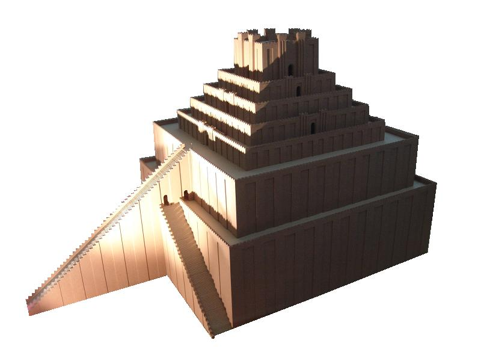

# Human-made Things in the Bible

## License Information

Human-made Things in the Bible © United Bible Societies, 2025. Adapted from: <cite>The Works of Their Hands: Man-made Things in the Bible</cite>, by Ray Pritz © 2009 United Bible Societies. This work is licensed under Creative Commons Attribution-ShareAlike 4.0 International (<a href="https://creativecommons.org/licenses/by-sa/4.0/">https://creativecommons.org/licenses/by-sa/4.0/</a>).

--------------------------------

## 標題：塔、金字形廟塔（tower, ziggurat） (id: REALIA:3.14.3)

3\.14\.3 標題：塔、金字形廟塔（tower, ziggurat）
====================================

經文出處
----

Hebrew 來： מִגְדָּל (音譯： migdal)

[GEN 11:4](https://ref.ly/Gen11:4), [GEN 11:5](https://ref.ly/Gen11:5)

描述和用途
-----

*巴比倫金字形神塔模型（埃特曼安吉模型（Model of Etemenanki），佩加蒙博物館（Pergamonmuseum），柏林） (O.Mustafin, CC0, via Wikimedia Commons)*

金字型廟塔是一座非常高的塔，為宗教或儀式的目的而建造。廟塔的外面有階梯，頂部有一個神龕。

---

翻譯
--

在美索不達米亞有很雄偉壯觀的巨大構築物的廢墟，形狀是階梯式的塔或金字塔，稱為金字形廟塔。其中最重要的是吾珥廟塔和巴比倫廟塔，其年代分別可追溯到主前第三個千年末期和主前第二個千年初期。吾珥的金字形廟塔是方形的，寬43\.3米（142英呎），長約62\.5米（205英呎）。目前還無法精確計算它原來的高度，但看上去有7級或7層。[GEN 11:1](https://ref.ly/Gen11:1); [GEN 11:2](https://ref.ly/Gen11:2); [GEN 11:3](https://ref.ly/Gen11:3); [GEN 11:4](https://ref.ly/Gen11:4); [GEN 11:5](https://ref.ly/Gen11:5); [GEN 11:6](https://ref.ly/Gen11:6); [GEN 11:7](https://ref.ly/Gen11:7); [GEN 11:8](https://ref.ly/Gen11:8); [GEN 11:9](https://ref.ly/Gen11:9) 的記載似乎提到了巴比倫的金字形廟塔，中心部分由泥磚建成，厚約15米（50英呎）。金字形廟塔底下的平臺長457米（1,500英呎），寬415米（1,360英呎），但廟塔本身的邊長只有91\.5米（300英呎）。和吾珥的金字形廟塔一樣，巴比倫金字形廟塔也有三段階梯，兩側的階梯高30\.5米（100英呎），中間的階梯高40米（132英呎）。根據附近的埃薩吉拉（Esagil）神廟廢墟中發現的石碑記載，塔的高度約有91\.5米（300英呎）。希臘歷史學家希羅多德（《歷史》第1卷，第181［185］頁）記述該廟塔為正方形，有8層或「塔」，一層疊一層。巴比倫廟塔和吾珥的金字形廟塔一樣，在差不多中心的位置也有一座神龕，其通道有一部分是臺階，有一部分是斜坡。

在大多數譯本中，將[GEN 11:4](https://ref.ly/Gen11:4); [GEN 11:5](https://ref.ly/Gen11:5) 中的希伯來文*migdal* 翻譯成「塔」就足夠了。如果目標語言中沒有合適的詞，翻譯者可以譯為「有很多層的高房子」，甚至是「非常高的梯子」。

* **Associated Passages:** 創世記 11:4; 創世記 11:5; 創世記 11:1; 創世記 11:2; 創世記 11:3; 創世記 11:6; 創世記 11:7; 創世記 11:8; 創世記 11:9

