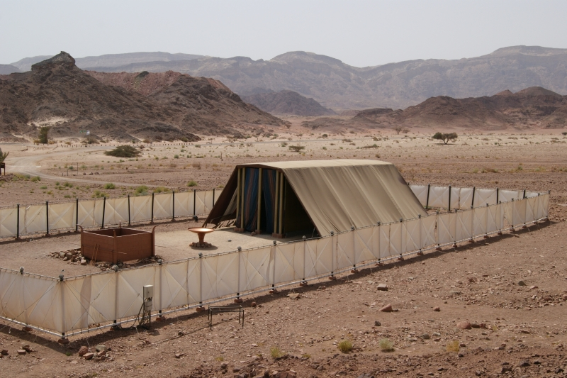
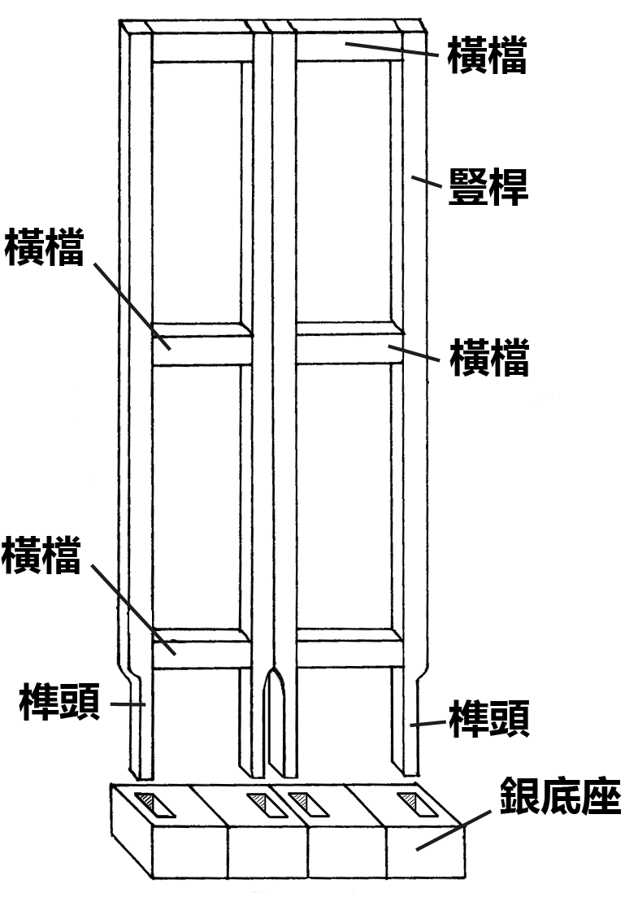
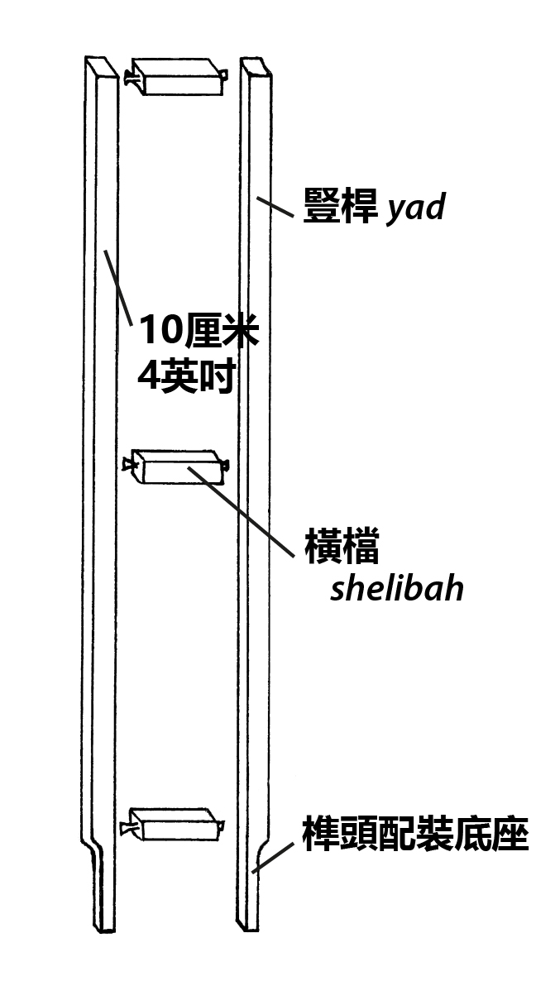
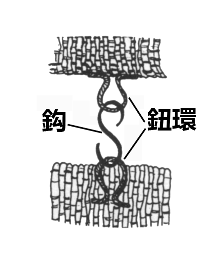
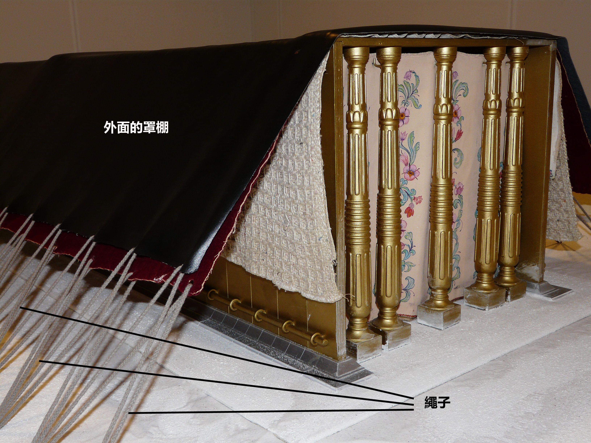
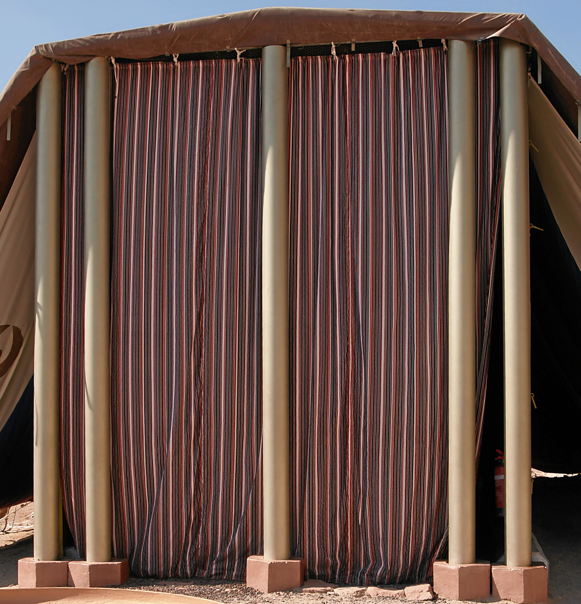
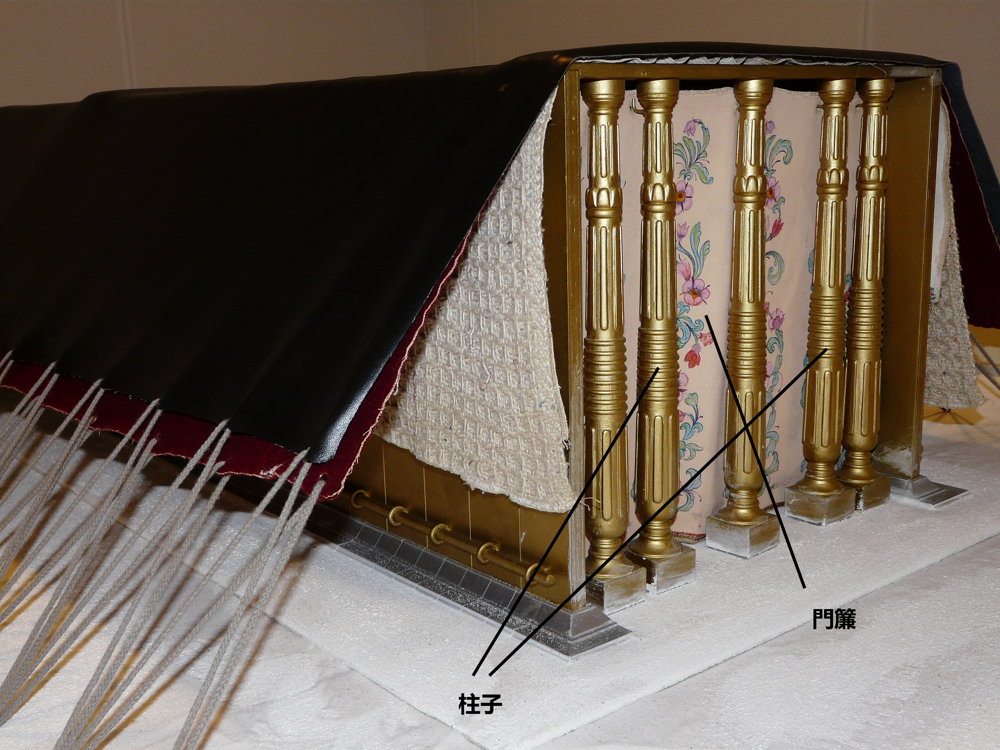
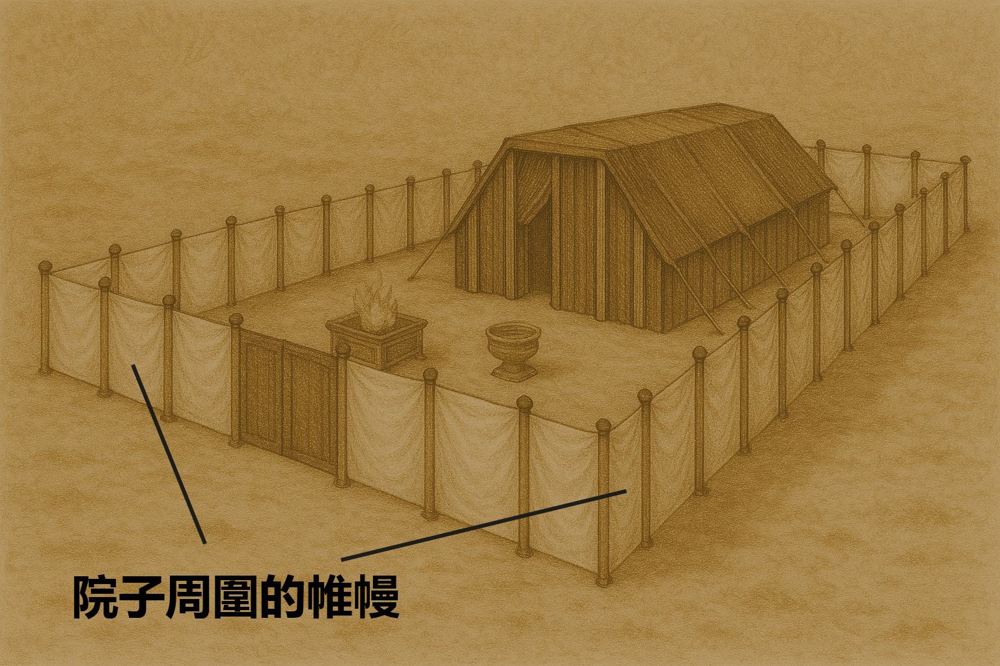

# Human-made Things in the Bible

## License Information

Human-made Things in the Bible © United Bible Societies, 2025. Adapted from: <cite>The Works of Their Hands: Man-made Things in the Bible</cite>, by Ray Pritz © 2009 United Bible Societies. This work is licensed under Creative Commons Attribution-ShareAlike 4.0 International (<a href="https://creativecommons.org/licenses/by-sa/4.0/">https://creativecommons.org/licenses/by-sa/4.0/</a>).

--------------------------------

## 標題：帳幕（Tabernacle） (id: REALIA:3.15.2)

3\.15\.2 標題：帳幕（Tabernacle）
==========================

經文出處
----

Hebrew 來： אֹהֶל, מוֹעֵד (音譯： ’ohel, ’ohel mo‘ed)

[EXO 26:7](https://ref.ly/Exod26:7), [EXO 26:9](https://ref.ly/Exod26:9), [EXO 26:11](https://ref.ly/Exod26:11), [EXO 26:12](https://ref.ly/Exod26:12), [EXO 26:13](https://ref.ly/Exod26:13), [EXO 26:14](https://ref.ly/Exod26:14), [EXO 26:36](https://ref.ly/Exod26:36), [EXO 27:21](https://ref.ly/Exod27:21), [EXO 28:43](https://ref.ly/Exod28:43), [EXO 29:4](https://ref.ly/Exod29:4), [EXO 29:10](https://ref.ly/Exod29:10), [EXO 29:11](https://ref.ly/Exod29:11), [EXO 29:30](https://ref.ly/Exod29:30), [EXO 29:32](https://ref.ly/Exod29:32), [EXO 29:42](https://ref.ly/Exod29:42), [EXO 29:44](https://ref.ly/Exod29:44), [EXO 30:16](https://ref.ly/Exod30:16), [EXO 30:18](https://ref.ly/Exod30:18), [EXO 30:20](https://ref.ly/Exod30:20), [EXO 30:26](https://ref.ly/Exod30:26), [EXO 30:36](https://ref.ly/Exod30:36), [EXO 31:7](https://ref.ly/Exod31:7), [EXO 31:7](https://ref.ly/Exod31:7), [EXO 33:7](https://ref.ly/Exod33:7), [EXO 33:7](https://ref.ly/Exod33:7), [EXO 33:7](https://ref.ly/Exod33:7), [EXO 33:8](https://ref.ly/Exod33:8), [EXO 33:8](https://ref.ly/Exod33:8), [EXO 33:9](https://ref.ly/Exod33:9), [EXO 33:9](https://ref.ly/Exod33:9), [EXO 33:10](https://ref.ly/Exod33:10), [EXO 33:11](https://ref.ly/Exod33:11), [EXO 35:11](https://ref.ly/Exod35:11), [EXO 35:21](https://ref.ly/Exod35:21), [EXO 36:14](https://ref.ly/Exod36:14), [EXO 36:18](https://ref.ly/Exod36:18), [EXO 36:19](https://ref.ly/Exod36:19), [EXO 36:37](https://ref.ly/Exod36:37), [EXO 38:8](https://ref.ly/Exod38:8), [EXO 38:30](https://ref.ly/Exod38:30), [EXO 39:32](https://ref.ly/Exod39:32), [EXO 39:33](https://ref.ly/Exod39:33), [EXO 39:38](https://ref.ly/Exod39:38), [EXO 39:40](https://ref.ly/Exod39:40), [EXO 40:2](https://ref.ly/Exod40:2), [EXO 40:6](https://ref.ly/Exod40:6), [EXO 40:7](https://ref.ly/Exod40:7), [EXO 40:12](https://ref.ly/Exod40:12), [EXO 40:19](https://ref.ly/Exod40:19), [EXO 40:19](https://ref.ly/Exod40:19), [EXO 40:22](https://ref.ly/Exod40:22), [EXO 40:24](https://ref.ly/Exod40:24), [EXO 40:26](https://ref.ly/Exod40:26), [EXO 40:29](https://ref.ly/Exod40:29), [EXO 40:30](https://ref.ly/Exod40:30), [EXO 40:32](https://ref.ly/Exod40:32), [EXO 40:34](https://ref.ly/Exod40:34), [EXO 40:35](https://ref.ly/Exod40:35), [LEV 1:1](https://ref.ly/Lev1:1), [LEV 1:3](https://ref.ly/Lev1:3), [LEV 1:5](https://ref.ly/Lev1:5), [LEV 3:2](https://ref.ly/Lev3:2), [LEV 3:8](https://ref.ly/Lev3:8), [LEV 3:13](https://ref.ly/Lev3:13), [LEV 4:4](https://ref.ly/Lev4:4), [LEV 4:5](https://ref.ly/Lev4:5), [LEV 4:7](https://ref.ly/Lev4:7), [LEV 4:7](https://ref.ly/Lev4:7), [LEV 4:14](https://ref.ly/Lev4:14), [LEV 4:16](https://ref.ly/Lev4:16), [LEV 4:18](https://ref.ly/Lev4:18), [LEV 4:18](https://ref.ly/Lev4:18), [LEV 6:9](https://ref.ly/Lev6:9), [LEV 6:19](https://ref.ly/Lev6:19), [LEV 6:23](https://ref.ly/Lev6:23), [LEV 8:3](https://ref.ly/Lev8:3), [LEV 8:4](https://ref.ly/Lev8:4), [LEV 8:31](https://ref.ly/Lev8:31), [LEV 8:33](https://ref.ly/Lev8:33), [LEV 8:35](https://ref.ly/Lev8:35), [LEV 9:5](https://ref.ly/Lev9:5), [LEV 9:23](https://ref.ly/Lev9:23), [LEV 10:7](https://ref.ly/Lev10:7), [LEV 10:9](https://ref.ly/Lev10:9), [LEV 12:6](https://ref.ly/Lev12:6), [LEV 14:11](https://ref.ly/Lev14:11), [LEV 14:23](https://ref.ly/Lev14:23), [LEV 15:14](https://ref.ly/Lev15:14), [LEV 15:29](https://ref.ly/Lev15:29), [LEV 16:7](https://ref.ly/Lev16:7), [LEV 16:16](https://ref.ly/Lev16:16), [LEV 16:17](https://ref.ly/Lev16:17), [LEV 16:20](https://ref.ly/Lev16:20), [LEV 16:23](https://ref.ly/Lev16:23), [LEV 16:33](https://ref.ly/Lev16:33), [LEV 17:4](https://ref.ly/Lev17:4), [LEV 17:5](https://ref.ly/Lev17:5), [LEV 17:6](https://ref.ly/Lev17:6), [LEV 17:9](https://ref.ly/Lev17:9), [LEV 19:21](https://ref.ly/Lev19:21), [LEV 24:3](https://ref.ly/Lev24:3), [NUM 1:1](https://ref.ly/Num1:1), [NUM 2:2](https://ref.ly/Num2:2), [NUM 2:17](https://ref.ly/Num2:17), [NUM 3:7](https://ref.ly/Num3:7), [NUM 3:8](https://ref.ly/Num3:8), [NUM 3:25](https://ref.ly/Num3:25), [NUM 3:25](https://ref.ly/Num3:25), [NUM 3:25](https://ref.ly/Num3:25), [NUM 3:38](https://ref.ly/Num3:38), [NUM 4:3](https://ref.ly/Num4:3), [NUM 4:4](https://ref.ly/Num4:4), [NUM 4:15](https://ref.ly/Num4:15), [NUM 4:23](https://ref.ly/Num4:23), [NUM 4:25](https://ref.ly/Num4:25), [NUM 4:25](https://ref.ly/Num4:25), [NUM 4:28](https://ref.ly/Num4:28), [NUM 4:30](https://ref.ly/Num4:30), [NUM 4:31](https://ref.ly/Num4:31), [NUM 4:33](https://ref.ly/Num4:33), [NUM 4:35](https://ref.ly/Num4:35), [NUM 4:37](https://ref.ly/Num4:37), [NUM 4:39](https://ref.ly/Num4:39), [NUM 4:41](https://ref.ly/Num4:41), [NUM 4:43](https://ref.ly/Num4:43), [NUM 4:47](https://ref.ly/Num4:47), [NUM 6:10](https://ref.ly/Num6:10), [NUM 6:13](https://ref.ly/Num6:13), [NUM 6:18](https://ref.ly/Num6:18), [NUM 7:5](https://ref.ly/Num7:5), [NUM 7:89](https://ref.ly/Num7:89), [NUM 8:9](https://ref.ly/Num8:9), [NUM 8:15](https://ref.ly/Num8:15), [NUM 8:19](https://ref.ly/Num8:19), [NUM 8:22](https://ref.ly/Num8:22), [NUM 8:24](https://ref.ly/Num8:24), [NUM 8:26](https://ref.ly/Num8:26), [NUM 9:15](https://ref.ly/Num9:15), [NUM 9:17](https://ref.ly/Num9:17), [NUM 10:3](https://ref.ly/Num10:3), [NUM 11:16](https://ref.ly/Num11:16), [NUM 11:24](https://ref.ly/Num11:24), [NUM 11:26](https://ref.ly/Num11:26), [NUM 12:4](https://ref.ly/Num12:4), [NUM 12:5](https://ref.ly/Num12:5), [NUM 12:10](https://ref.ly/Num12:10), [NUM 14:10](https://ref.ly/Num14:10), [NUM 16:18](https://ref.ly/Num16:18), [NUM 16:19](https://ref.ly/Num16:19), [NUM 17:7](https://ref.ly/Num17:7), [NUM 17:8](https://ref.ly/Num17:8), [NUM 17:15](https://ref.ly/Num17:15), [NUM 17:19](https://ref.ly/Num17:19), [NUM 17:22](https://ref.ly/Num17:22), [NUM 17:23](https://ref.ly/Num17:23), [NUM 18:2](https://ref.ly/Num18:2), [NUM 18:3](https://ref.ly/Num18:3), [NUM 18:4](https://ref.ly/Num18:4), [NUM 18:4](https://ref.ly/Num18:4), [NUM 18:6](https://ref.ly/Num18:6), [NUM 18:21](https://ref.ly/Num18:21), [NUM 18:22](https://ref.ly/Num18:22), [NUM 18:23](https://ref.ly/Num18:23), [NUM 18:31](https://ref.ly/Num18:31), [NUM 19:4](https://ref.ly/Num19:4), [NUM 20:6](https://ref.ly/Num20:6), [NUM 25:6](https://ref.ly/Num25:6), [NUM 27:2](https://ref.ly/Num27:2), [NUM 31:54](https://ref.ly/Num31:54), [DEU 31:14](https://ref.ly/Deut31:14), [DEU 31:14](https://ref.ly/Deut31:14), [DEU 31:15](https://ref.ly/Deut31:15), [DEU 31:15](https://ref.ly/Deut31:15), [JOS 18:1](https://ref.ly/Josh18:1), [JOS 19:51](https://ref.ly/Josh19:51), [1SA 2:22](https://ref.ly/1Sam2:22), [2SA 6:17](https://ref.ly/2Sam6:17), [2SA 7:6](https://ref.ly/2Sam7:6), [1KI 1:39](https://ref.ly/1Kgs1:39), [1KI 2:28](https://ref.ly/1Kgs2:28), [1KI 2:29](https://ref.ly/1Kgs2:29), [1KI 2:30](https://ref.ly/1Kgs2:30), [1KI 8:4](https://ref.ly/1Kgs8:4), [1KI 8:4](https://ref.ly/1Kgs8:4), [1CH 6:17](https://ref.ly/1Chr6:17), [1CH 9:19](https://ref.ly/1Chr9:19), [1CH 9:21](https://ref.ly/1Chr9:21), [1CH 9:23](https://ref.ly/1Chr9:23), [1CH 17:5](https://ref.ly/1Chr17:5), [1CH 17:5](https://ref.ly/1Chr17:5), [1CH 23:32](https://ref.ly/1Chr23:32), [2CH 1:3](https://ref.ly/2Chr1:3), [2CH 1:6](https://ref.ly/2Chr1:6), [2CH 1:13](https://ref.ly/2Chr1:13), [2CH 5:5](https://ref.ly/2Chr5:5), [2CH 5:5](https://ref.ly/2Chr5:5), [2CH 24:6](https://ref.ly/2Chr24:6), [PSA 27:6](https://ref.ly/Ps27:6), [PSA 78:60](https://ref.ly/Ps78:60)

Hebrew 來： הֵיכָל (音譯： heykal)

[1SA 1:9](https://ref.ly/1Sam1:9), [1SA 3:3](https://ref.ly/1Sam3:3)

Hebrew 來： מִשְׁכָּן (音譯： mishkan)

[EXO 25:9](https://ref.ly/Exod25:9), [EXO 26:1](https://ref.ly/Exod26:1), [EXO 26:6](https://ref.ly/Exod26:6), [EXO 26:7](https://ref.ly/Exod26:7), [EXO 26:12](https://ref.ly/Exod26:12), [EXO 26:13](https://ref.ly/Exod26:13), [EXO 26:15](https://ref.ly/Exod26:15), [EXO 26:17](https://ref.ly/Exod26:17), [EXO 26:18](https://ref.ly/Exod26:18), [EXO 26:20](https://ref.ly/Exod26:20), [EXO 26:22](https://ref.ly/Exod26:22), [EXO 26:23](https://ref.ly/Exod26:23), [EXO 26:26](https://ref.ly/Exod26:26), [EXO 26:27](https://ref.ly/Exod26:27), [EXO 26:27](https://ref.ly/Exod26:27), [EXO 26:30](https://ref.ly/Exod26:30), [EXO 26:35](https://ref.ly/Exod26:35), [EXO 27:9](https://ref.ly/Exod27:9), [EXO 27:19](https://ref.ly/Exod27:19), [EXO 35:11](https://ref.ly/Exod35:11), [EXO 35:15](https://ref.ly/Exod35:15), [EXO 35:18](https://ref.ly/Exod35:18), [EXO 36:8](https://ref.ly/Exod36:8), [EXO 36:13](https://ref.ly/Exod36:13), [EXO 36:14](https://ref.ly/Exod36:14), [EXO 36:20](https://ref.ly/Exod36:20), [EXO 36:22](https://ref.ly/Exod36:22), [EXO 36:23](https://ref.ly/Exod36:23), [EXO 36:25](https://ref.ly/Exod36:25), [EXO 36:27](https://ref.ly/Exod36:27), [EXO 36:28](https://ref.ly/Exod36:28), [EXO 36:31](https://ref.ly/Exod36:31), [EXO 36:32](https://ref.ly/Exod36:32), [EXO 36:32](https://ref.ly/Exod36:32), [EXO 38:20](https://ref.ly/Exod38:20), [EXO 38:21](https://ref.ly/Exod38:21), [EXO 38:21](https://ref.ly/Exod38:21), [EXO 38:31](https://ref.ly/Exod38:31), [EXO 39:32](https://ref.ly/Exod39:32), [EXO 39:33](https://ref.ly/Exod39:33), [EXO 39:40](https://ref.ly/Exod39:40), [EXO 40:2](https://ref.ly/Exod40:2), [EXO 40:5](https://ref.ly/Exod40:5), [EXO 40:6](https://ref.ly/Exod40:6), [EXO 40:9](https://ref.ly/Exod40:9), [EXO 40:17](https://ref.ly/Exod40:17), [EXO 40:18](https://ref.ly/Exod40:18), [EXO 40:19](https://ref.ly/Exod40:19), [EXO 40:21](https://ref.ly/Exod40:21), [EXO 40:22](https://ref.ly/Exod40:22), [EXO 40:24](https://ref.ly/Exod40:24), [EXO 40:28](https://ref.ly/Exod40:28), [EXO 40:29](https://ref.ly/Exod40:29), [EXO 40:33](https://ref.ly/Exod40:33), [EXO 40:34](https://ref.ly/Exod40:34), [EXO 40:35](https://ref.ly/Exod40:35), [EXO 40:36](https://ref.ly/Exod40:36), [EXO 40:38](https://ref.ly/Exod40:38), [LEV 8:10](https://ref.ly/Lev8:10), [LEV 15:31](https://ref.ly/Lev15:31), [LEV 17:4](https://ref.ly/Lev17:4), [NUM 1:50](https://ref.ly/Num1:50), [NUM 1:50](https://ref.ly/Num1:50), [NUM 1:50](https://ref.ly/Num1:50), [NUM 1:51](https://ref.ly/Num1:51), [NUM 1:51](https://ref.ly/Num1:51), [NUM 1:53](https://ref.ly/Num1:53), [NUM 1:53](https://ref.ly/Num1:53), [NUM 3:7](https://ref.ly/Num3:7), [NUM 3:8](https://ref.ly/Num3:8), [NUM 3:23](https://ref.ly/Num3:23), [NUM 3:25](https://ref.ly/Num3:25), [NUM 3:26](https://ref.ly/Num3:26), [NUM 3:29](https://ref.ly/Num3:29), [NUM 3:35](https://ref.ly/Num3:35), [NUM 3:36](https://ref.ly/Num3:36), [NUM 3:38](https://ref.ly/Num3:38), [NUM 4:16](https://ref.ly/Num4:16), [NUM 4:25](https://ref.ly/Num4:25), [NUM 4:26](https://ref.ly/Num4:26), [NUM 4:31](https://ref.ly/Num4:31), [NUM 5:17](https://ref.ly/Num5:17), [NUM 7:1](https://ref.ly/Num7:1), [NUM 7:3](https://ref.ly/Num7:3), [NUM 9:15](https://ref.ly/Num9:15), [NUM 9:15](https://ref.ly/Num9:15), [NUM 9:15](https://ref.ly/Num9:15), [NUM 9:18](https://ref.ly/Num9:18), [NUM 9:19](https://ref.ly/Num9:19), [NUM 9:20](https://ref.ly/Num9:20), [NUM 9:22](https://ref.ly/Num9:22), [NUM 10:11](https://ref.ly/Num10:11), [NUM 10:17](https://ref.ly/Num10:17), [NUM 10:17](https://ref.ly/Num10:17), [NUM 10:21](https://ref.ly/Num10:21), [NUM 16:9](https://ref.ly/Num16:9), [NUM 17:28](https://ref.ly/Num17:28), [NUM 19:13](https://ref.ly/Num19:13), [NUM 31:30](https://ref.ly/Num31:30), [NUM 31:47](https://ref.ly/Num31:47), [JOS 22:19](https://ref.ly/Josh22:19), [JOS 22:29](https://ref.ly/Josh22:29), [1CH 6:17](https://ref.ly/1Chr6:17), [1CH 6:33](https://ref.ly/1Chr6:33), [1CH 16:39](https://ref.ly/1Chr16:39), [1CH 21:29](https://ref.ly/1Chr21:29), [1CH 23:26](https://ref.ly/1Chr23:26), [2CH 1:5](https://ref.ly/2Chr1:5), [PSA 26:8](https://ref.ly/Ps26:8), [PSA 74:7](https://ref.ly/Ps74:7), [PSA 78:60](https://ref.ly/Ps78:60), [EZK 37:27](https://ref.ly/Ezek37:27)

Hebrew 來： מִקְדָּשׁ (音譯： miqdash)

[EXO 15:17](https://ref.ly/Exod15:17), [EXO 25:8](https://ref.ly/Exod25:8), [LEV 12:4](https://ref.ly/Lev12:4), [LEV 19:30](https://ref.ly/Lev19:30), [LEV 20:3](https://ref.ly/Lev20:3), [LEV 26:2](https://ref.ly/Lev26:2), [LEV 21:12](https://ref.ly/Lev21:12), [LEV 21:12](https://ref.ly/Lev21:12), [LEV 21:23](https://ref.ly/Lev21:23), [NUM 3:38](https://ref.ly/Num3:38), [NUM 10:21](https://ref.ly/Num10:21), [NUM 18:1](https://ref.ly/Num18:1), [NUM 18:29](https://ref.ly/Num18:29), [NUM 19:20](https://ref.ly/Num19:20), [JOS 24:26](https://ref.ly/Josh24:26)

Hebrew 來： קֹדֶשׁ (音譯： qodesh)

[EXO 36:1](https://ref.ly/Exod36:1), [EXO 36:4](https://ref.ly/Exod36:4), [EXO 36:6](https://ref.ly/Exod36:6), [EXO 38:24](https://ref.ly/Exod38:24), [EXO 38:24](https://ref.ly/Exod38:24), [EXO 38:27](https://ref.ly/Exod38:27), [LEV 10:4](https://ref.ly/Lev10:4), [NUM 3:28](https://ref.ly/Num3:28), [NUM 3:31](https://ref.ly/Num3:31), [NUM 3:32](https://ref.ly/Num3:32), [NUM 4:12](https://ref.ly/Num4:12), [NUM 4:15](https://ref.ly/Num4:15), [NUM 4:15](https://ref.ly/Num4:15), [NUM 4:15](https://ref.ly/Num4:15), [NUM 4:16](https://ref.ly/Num4:16), [NUM 8:19](https://ref.ly/Num8:19), [NUM 18:3](https://ref.ly/Num18:3), [NUM 18:5](https://ref.ly/Num18:5)

Greek 希： ἅγιος (音譯： hagia, hagion)

[HEB 8:2](https://ref.ly/Heb8:2), [HEB 9:1](https://ref.ly/Heb9:1), [HEB 9:8](https://ref.ly/Heb9:8)

Greek 希： σκηνή (音譯： skēnē)

[ACT 7:44](https://ref.ly/Acts7:44), [HEB 8:2](https://ref.ly/Heb8:2), [HEB 8:5](https://ref.ly/Heb8:5), [HEB 9:8](https://ref.ly/Heb9:8), [HEB 9:11](https://ref.ly/Heb9:11), [HEB 9:21](https://ref.ly/Heb9:21), [HEB 13:10](https://ref.ly/Heb13:10), [REV 15:5](https://ref.ly/Rev15:5), [WIS 9:8](https://ref.ly/Wis9:8), [SIR 24:10](https://ref.ly/Sir24:10), [SIR 24:15](https://ref.ly/Sir24:15), [2MA 2:4](https://ref.ly/2Macc2:4), [2MA 2:5](https://ref.ly/2Macc2:5)

描述和用途
-----

*在曠野漂流時使用的可移動會幕和它的外院（亭納公園（Timnah Park）模型） (© Ruk7, CC BY\-SA 3\.0, via Wikimedia Commons)*

帳幕是一個相對較大的帳棚，周圍有一個封閉的庭院；帳幕是聖殿建成之前，以色列人的敬拜中心。

---

翻譯
--

*可移動會幕的模型（亭納公園（Timnah Park）） (© Mboesch, CC BY\-SA 4\.0, via Wikimedia Commons)*

在不同的語境中，上面列出的希伯來文和希臘文詞語的含義也可能有所不同。翻譯者要特別注意語境，因為語境通常會表明詞語所要表達的意思。例如，希伯來文*mishkan* 既可以指整個帳幕（即帳幕和院子；[EXO 25:8](https://ref.ly/Exod25:8) ），也可以指帳幕本身，即位於院子裡面，包括了聖所和至聖所的帳幕（[EXO 26:1](https://ref.ly/Exod26:1) ）。同樣地，希伯來文*miqdash* 有時指聖所（[LEV 20:3](https://ref.ly/Lev20:3) ），有時是指至聖所（[LEV 16:33](https://ref.ly/Lev16:33) ），有時指的是帳幕加上院子的整體結構（[EXO 25:8](https://ref.ly/Exod25:8) ）。

希伯來文*’ohel* 的意思是「帳棚」（參[3\.2 帳棚 (tent)\<REALIA:3\.2\>](#) ），可以指帳幕本身（[EXO 26:36](https://ref.ly/Exod26:36) ），或者指會幕，如上文所述（參[3\.15 會幕和帳幕 (Tent of Meeting and Tabernacle)\<REALIA:3\.15\>](#) ）。

在有些語言中，「帳幕」可以譯為「上帝居住的最大的帳棚」、「用來敬拜上帝的大帳棚」，或「聖潔的帳棚」。在選擇合適的名稱時，重要的是要表明帳幕的功能在本質上與聖殿相同；兩者只有結構上的不同，並沒有用途或宗教意義上的不同。參[3\.14\.1 猶太人的聖殿 (Jewish Temple)\<REALIA:3\.14\.1\>](#) 中的討論。

關於「帳幕」的翻譯，奧斯本發表了以下評論：「最近的幾個譯本沒有採用『帳幕』的傳統譯法，而直接譯為『居所』。《翻譯者的〈舊約〉》（TOT ）使用了『神龕』一詞，這也許更適合用來表示耶和華在曠野的居所。當然，這兩個詞都可以指一塊圍地內的帳棚，也可以指包含帳棚在內的整個構築物。然而，兩個術語都含有某種成分，暗示著自身與相對固定的所羅門聖殿有所不同，並且該成分似乎影響了從祭司角度對帳幕的描述。」

[EXO 39:32](https://ref.ly/Exod39:32); [EXO 40:2](https://ref.ly/Exod40:2); [EXO 40:6](https://ref.ly/Exod40:6); [EXO 40:29](https://ref.ly/Exod40:29) ；[1CH 6:17](https://ref.ly/1Chr6:17) （《和》6:32）：這些經文中的希伯來文結合了*mishkan* 和*’ohel mo‘ed* 兩個詞語，RSV (Revised Standard Version (1952)) 譯為“the tabernacle of the tent of meeting”（「會幕的帳幕」）。[EXO 40:0](https://ref.ly/Exod40:0) 三次提到這個詞組，其中*mishkan* 可能是指院子裡面由支架（豎板）和四層罩棚組成的帳棚，而*’ohel mo‘ed* 則是指帳幕和院子的整體。在[EXO 39:32](https://ref.ly/Exod39:32) 中，這兩個詞語指的是同一個事物，其中第二個詞語解釋了第一個詞語。在這節經文中，GNT (Good News Translation (1992)) 只用了一個表達來翻譯兩個術語：“the Tent of the LORD’s presence”（「耶和華臨在的帳棚」）。NIV (New International Version (1984)) 的譯法更好，作“the tabernacle, the Tent of Meeting”（「帳幕，就是會幕」）。另一種表達方式是「神聖的帳棚，人們與上帝相會的地方」。

[HEB 8:2](https://ref.ly/Heb8:2); [HEB 9:11](https://ref.ly/Heb9:11); [REV 15:5](https://ref.ly/Rev15:5) ：這些經文都用同一個希臘文*skēnē* 來指稱神聖的帳棚，該詞指的是在曠野中的帳棚（如[HEB 8:5](https://ref.ly/Heb8:5) ）。然而，這幾處經文說的是屬天或屬靈意義上的帳幕（實際上，這才是地上實體帳幕的本物）。不管是指實體帳幕還是它屬天的對應物，翻譯者應盡可能使用同一個詞來翻譯*skēnē* 。

以下內容節選自《〈啟示錄〉手冊》（*A Handbook on The Revelation to John* ，第226—227頁）關於[REV 15:5](https://ref.ly/Rev15:5) 的註釋：關於「作證的帳棚的殿」（“the temple of the tent of witness”；RSV (Revised Standard Version (1952)) ／NRSV (New Revised Standard Version (1989)) ）這個復合屬格短語的含意，還有一些不太確定的地方。這個短語的字面意思相當模糊，一般的讀者可能會把它理解為：在作證的帳棚中有一個殿。這個短語有三種可能的意思：（1）「作證的帳棚」和「殿」指的是同一個事物，因此可以譯為「殿，即作證的帳棚」（如AT (American Translation (Goodspeed, 1935)) 、NJB (New Jerusalem Bible (1985)) 、SPCL (Spanish Common Language Version (Dios Habla Hoy)) 、NIV (New International Version (1984)) ）；（2）「殿中的作證帳棚」（如GNT (Good News Translation (1992)) 、FRCL (French Common Language Version (Bible en français courant)) 、巴西文通俗譯本）；（3）「作證帳棚中的聖所」（如TNT 、REB (Revised English Bible (1989)) 、巴克利、菲利普斯）。最後一種解釋（也是我們推薦的解釋）的支持理由是：譯作「殿」的希臘文*naos* 是一個專門詞語，特指聖殿內部的聖所，而不是聖殿內較大的敬拜區域（希臘文*hieron* ）。聖殿內部的聖所（存放約櫃的地方）與敬拜區域之間，有一塊厚重的幔子隔開；敬拜區域內有香壇和每天奉獻供餅給上帝的桌子。這也是帳幕的設計（參[EXO 40:1](https://ref.ly/Exod40:1) —[EXO 40:33](https://ref.ly/Exod40:33) ）。因此，在這裡最好譯為：「在作證的帳棚中的聖所（或至聖所）」，或「在帳幕中的聖所（或至聖所）」。在這裡和[ACT 7:44](https://ref.ly/Acts7:44) 中，應使用舊約中最常用來指稱帳幕的譯名。

* **Associated Passages:** 出埃及記 26:7; 出埃及記 26:9; 出埃及記 26:11; 出埃及記 26:12; 出埃及記 26:13; 出埃及記 26:14; 出埃及記 26:36; 出埃及記 27:21; 出埃及記 28:43; 出埃及記 29:4; 出埃及記 29:10; 出埃及記 29:11; 出埃及記 29:30; 出埃及記 29:32; 出埃及記 29:42; 出埃及記 29:44; 出埃及記 30:16; 出埃及記 30:18; 出埃及記 30:20; 出埃及記 30:26; 出埃及記 30:36; 出埃及記 31:7; 出埃及記 33:7; 出埃及記 33:8; 出埃及記 33:9; 出埃及記 33:10; 出埃及記 33:11; 出埃及記 35:11; 出埃及記 35:21; 出埃及記 36:14; 出埃及記 36:18; 出埃及記 36:19; 出埃及記 36:37; 出埃及記 38:8; 出埃及記 38:30; 出埃及記 39:32; 出埃及記 39:33; 出埃及記 39:38; 出埃及記 39:40; 出埃及記 40:2; 出埃及記 40:6; 出埃及記 40:7; 出埃及記 40:12; 出埃及記 40:19; 出埃及記 40:22; 出埃及記 40:24; 出埃及記 40:26; 出埃及記 40:29; 出埃及記 40:30; 出埃及記 40:32; 出埃及記 40:34; 出埃及記 40:35; 利未記 1:1; 利未記 1:3; 利未記 1:5; 利未記 3:2; 利未記 3:8; 利未記 3:13; 利未記 4:4; 利未記 4:5; 利未記 4:7; 利未記 4:14; 利未記 4:16; 利未記 4:18; 利未記 6:9; 利未記 6:19; 利未記 6:23; 利未記 8:3; 利未記 8:4; 利未記 8:31; 利未記 8:33; 利未記 8:35; 利未記 9:5; 利未記 9:23; 利未記 10:7; 利未記 10:9; 利未記 12:6; 利未記 14:11; 利未記 14:23; 利未記 15:14; 利未記 15:29; 利未記 16:7; 利未記 16:16; 利未記 16:17; 利未記 16:20; 利未記 16:23; 利未記 16:33; 利未記 17:4; 利未記 17:5; 利未記 17:6; 利未記 17:9; 利未記 19:21; 利未記 24:3; 民數記 1:1; 民數記 2:2; 民數記 2:17; 民數記 3:7; 民數記 3:8; 民數記 3:25; 民數記 3:38; 民數記 4:3; 民數記 4:4; 民數記 4:15; 民數記 4:23; 民數記 4:25; 民數記 4:28; 民數記 4:30; 民數記 4:31; 民數記 4:33; 民數記 4:35; 民數記 4:37; 民數記 4:39; 民數記 4:41; 民數記 4:43; 民數記 4:47; 民數記 6:10; 民數記 6:13; 民數記 6:18; 民數記 7:5; 民數記 7:89; 民數記 8:9; 民數記 8:15; 民數記 8:19; 民數記 8:22; 民數記 8:24; 民數記 8:26; 民數記 9:15; 民數記 9:17; 民數記 10:3; 民數記 11:16; 民數記 11:24; 民數記 11:26; 民數記 12:4; 民數記 12:5; 民數記 12:10; 民數記 14:10; 民數記 16:18; 民數記 16:19; 民數記 17:7; 民數記 17:8; 民數記 17:15; 民數記 17:19; 民數記 17:22; 民數記 17:23; 民數記 18:2; 民數記 18:3; 民數記 18:4; 民數記 18:6; 民數記 18:21; 民數記 18:22; 民數記 18:23; 民數記 18:31; 民數記 19:4; 民數記 20:6; 民數記 25:6; 民數記 27:2; 民數記 31:54; 申命記 31:14; 申命記 31:15; 約書亞記 18:1; 約書亞記 19:51; 撒母耳記上 2:22; 撒母耳記下 6:17; 撒母耳記下 7:6; 列王紀上 1:39; 列王紀上 2:28; 列王紀上 2:29; 列王紀上 2:30; 列王紀上 8:4; 歷代志上 6:17; 歷代志上 9:19; 歷代志上 9:21; 歷代志上 9:23; 歷代志上 17:5; 歷代志上 23:32; 歷代志下 1:3; 歷代志下 1:6; 歷代志下 1:13; 歷代志下 5:5; 歷代志下 24:6; 詩篇 27:6; 詩篇 78:60; 撒母耳記上 1:9; 撒母耳記上 3:3; 出埃及記 25:9; 出埃及記 26:1; 出埃及記 26:6; 出埃及記 26:15; 出埃及記 26:17; 出埃及記 26:18; 出埃及記 26:20; 出埃及記 26:22; 出埃及記 26:23; 出埃及記 26:26; 出埃及記 26:27; 出埃及記 26:30; 出埃及記 26:35; 出埃及記 27:9; 出埃及記 27:19; 出埃及記 35:15; 出埃及記 35:18; 出埃及記 36:8; 出埃及記 36:13; 出埃及記 36:20; 出埃及記 36:22; 出埃及記 36:23; 出埃及記 36:25; 出埃及記 36:27; 出埃及記 36:28; 出埃及記 36:31; 出埃及記 36:32; 出埃及記 38:20; 出埃及記 38:21; 出埃及記 38:31; 出埃及記 40:5; 出埃及記 40:9; 出埃及記 40:17; 出埃及記 40:18; 出埃及記 40:21; 出埃及記 40:28; 出埃及記 40:33; 出埃及記 40:36; 出埃及記 40:38; 利未記 8:10; 利未記 15:31; 民數記 1:50; 民數記 1:51; 民數記 1:53; 民數記 3:23; 民數記 3:26; 民數記 3:29; 民數記 3:35; 民數記 3:36; 民數記 4:16; 民數記 4:26; 民數記 5:17; 民數記 7:1; 民數記 7:3; 民數記 9:18; 民數記 9:19; 民數記 9:20; 民數記 9:22; 民數記 10:11; 民數記 10:17; 民數記 10:21; 民數記 16:9; 民數記 17:28; 民數記 19:13; 民數記 31:30; 民數記 31:47; 約書亞記 22:19; 約書亞記 22:29; 歷代志上 6:33; 歷代志上 16:39; 歷代志上 21:29; 歷代志上 23:26; 歷代志下 1:5; 詩篇 26:8; 詩篇 74:7; 以西結書 37:27; 出埃及記 15:17; 出埃及記 25:8; 利未記 12:4; 利未記 19:30; 利未記 20:3; 利未記 26:2; 利未記 21:12; 利未記 21:23; 民數記 18:1; 民數記 18:29; 民數記 19:20; 約書亞記 24:26; 出埃及記 36:1; 出埃及記 36:4; 出埃及記 36:6; 出埃及記 38:24; 出埃及記 38:27; 利未記 10:4; 民數記 3:28; 民數記 3:31; 民數記 3:32; 民數記 4:12; 民數記 18:5; 希伯來書 8:2; 希伯來書 9:1; 希伯來書 9:8; 使徒行傳 7:44; 希伯來書 8:5; 希伯來書 9:11; 希伯來書 9:21; 希伯來書 13:10; 啟示錄 15:5; 智慧篇 9:8; 德訓篇 24:10; 德訓篇 24:15; 瑪加伯下 2:4; 瑪加伯下 2:5; 出埃及記 40:0; 出埃及記 40:1

* **Associated ACAI Concepts:** Tabernacle (ID: `realia:Tabernacle`)

## 標題：聖所、聖潔的地方（Holy Place） (id: REALIA:3.15.2.1)

3\.15\.2\.1 標題：聖所、聖潔的地方（Holy Place）
===================================

經文出處
----

Hebrew 來： הֵיכָל (音譯： heykal)

[1KI 6:17](https://ref.ly/1Kgs6:17), [1KI 6:33](https://ref.ly/1Kgs6:33), [1KI 7:50](https://ref.ly/1Kgs7:50), [2CH 4:22](https://ref.ly/2Chr4:22), [2CH 29:16](https://ref.ly/2Chr29:16), [NEH 6:10](https://ref.ly/Neh6:10), [NEH 6:10](https://ref.ly/Neh6:10), [NEH 6:11](https://ref.ly/Neh6:11), [PSA 5:8](https://ref.ly/Ps5:8), [PSA 11:4](https://ref.ly/Ps11:4), [PSA 18:7](https://ref.ly/Ps18:7), [PSA 138:2](https://ref.ly/Ps138:2), [ISA 6:1](https://ref.ly/Isa6:1), [EZK 8:16](https://ref.ly/Ezek8:16), [EZK 8:16](https://ref.ly/Ezek8:16), [EZK 41:1](https://ref.ly/Ezek41:1), [EZK 41:4](https://ref.ly/Ezek41:4), [EZK 41:15](https://ref.ly/Ezek41:15), [EZK 41:20](https://ref.ly/Ezek41:20), [EZK 41:21](https://ref.ly/Ezek41:21), [EZK 41:23](https://ref.ly/Ezek41:23), [EZK 41:25](https://ref.ly/Ezek41:25), [EZK 42:8](https://ref.ly/Ezek42:8), [JON 2:5](https://ref.ly/Jonah2:5), [JON 2:8](https://ref.ly/Jonah2:8), [MIC 1:2](https://ref.ly/Mic1:2), [HAB 2:20](https://ref.ly/Hab2:20), [MAL 3:1](https://ref.ly/Mal3:1)

Hebrew 來： קֹדֶשׁ (音譯： qodesh)

[EXO 29:30](https://ref.ly/Exod29:30), [EXO 30:13](https://ref.ly/Exod30:13), [EXO 30:24](https://ref.ly/Exod30:24), [EXO 31:11](https://ref.ly/Exod31:11), [EXO 35:19](https://ref.ly/Exod35:19), [EXO 36:3](https://ref.ly/Exod36:3), [EXO 36:4](https://ref.ly/Exod36:4), [EXO 36:6](https://ref.ly/Exod36:6), [EXO 38:24](https://ref.ly/Exod38:24), [EXO 38:24](https://ref.ly/Exod38:24), [EXO 38:25](https://ref.ly/Exod38:25), [EXO 38:26](https://ref.ly/Exod38:26), [EXO 38:27](https://ref.ly/Exod38:27), [EXO 39:1](https://ref.ly/Exod39:1), [EXO 39:41](https://ref.ly/Exod39:41), [LEV 4:6](https://ref.ly/Lev4:6), [LEV 5:15](https://ref.ly/Lev5:15), [LEV 6:23](https://ref.ly/Lev6:23), [LEV 10:4](https://ref.ly/Lev10:4), [LEV 10:17](https://ref.ly/Lev10:17), [LEV 10:18](https://ref.ly/Lev10:18), [LEV 10:18](https://ref.ly/Lev10:18), [LEV 12:4](https://ref.ly/Lev12:4), [LEV 14:13](https://ref.ly/Lev14:13), [LEV 16:2](https://ref.ly/Lev16:2), [LEV 16:3](https://ref.ly/Lev16:3), [LEV 16:16](https://ref.ly/Lev16:16), [LEV 16:17](https://ref.ly/Lev16:17), [LEV 16:20](https://ref.ly/Lev16:20), [LEV 16:23](https://ref.ly/Lev16:23), [LEV 16:27](https://ref.ly/Lev16:27), [LEV 16:33](https://ref.ly/Lev16:33), [LEV 27:3](https://ref.ly/Lev27:3), [LEV 27:25](https://ref.ly/Lev27:25), [NUM 3:28](https://ref.ly/Num3:28), [NUM 3:31](https://ref.ly/Num3:31), [NUM 3:32](https://ref.ly/Num3:32), [NUM 3:47](https://ref.ly/Num3:47), [NUM 3:50](https://ref.ly/Num3:50), [NUM 4:12](https://ref.ly/Num4:12), [NUM 4:15](https://ref.ly/Num4:15), [NUM 4:15](https://ref.ly/Num4:15), [NUM 4:16](https://ref.ly/Num4:16), [NUM 7:13](https://ref.ly/Num7:13), [NUM 7:19](https://ref.ly/Num7:19), [NUM 7:25](https://ref.ly/Num7:25), [NUM 7:31](https://ref.ly/Num7:31), [NUM 7:37](https://ref.ly/Num7:37), [NUM 7:43](https://ref.ly/Num7:43), [NUM 7:49](https://ref.ly/Num7:49), [NUM 7:55](https://ref.ly/Num7:55), [NUM 7:61](https://ref.ly/Num7:61), [NUM 7:67](https://ref.ly/Num7:67), [NUM 7:73](https://ref.ly/Num7:73), [NUM 7:79](https://ref.ly/Num7:79), [NUM 7:85](https://ref.ly/Num7:85), [NUM 7:86](https://ref.ly/Num7:86), [NUM 8:19](https://ref.ly/Num8:19), [NUM 18:5](https://ref.ly/Num18:5), [NUM 18:16](https://ref.ly/Num18:16), [NUM 28:7](https://ref.ly/Num28:7), [1KI 8:8](https://ref.ly/1Kgs8:8), [1KI 8:10](https://ref.ly/1Kgs8:10), [1CH 23:32](https://ref.ly/1Chr23:32), [1CH 24:5](https://ref.ly/1Chr24:5), [2CH 5:11](https://ref.ly/2Chr5:11), [2CH 29:5](https://ref.ly/2Chr29:5), [2CH 29:7](https://ref.ly/2Chr29:7), [2CH 30:19](https://ref.ly/2Chr30:19), [2CH 35:5](https://ref.ly/2Chr35:5), [EZR 9:8](https://ref.ly/Ezra9:8), [PSA 60:8](https://ref.ly/Ps60:8), [PSA 63:3](https://ref.ly/Ps63:3), [PSA 68:18](https://ref.ly/Ps68:18), [PSA 68:25](https://ref.ly/Ps68:25), [PSA 74:3](https://ref.ly/Ps74:3), [PSA 108:8](https://ref.ly/Ps108:8), [PSA 134:2](https://ref.ly/Ps134:2), [PSA 150:1](https://ref.ly/Ps150:1), [ISA 43:28](https://ref.ly/Isa43:28), [ISA 62:9](https://ref.ly/Isa62:9), [EZK 41:21](https://ref.ly/Ezek41:21), [EZK 41:23](https://ref.ly/Ezek41:23), [EZK 42:14](https://ref.ly/Ezek42:14), [EZK 44:27](https://ref.ly/Ezek44:27), [EZK 44:27](https://ref.ly/Ezek44:27), [EZK 45:2](https://ref.ly/Ezek45:2), [DAN 8:13](https://ref.ly/Dan8:13), [DAN 8:14](https://ref.ly/Dan8:14), [DAN 9:26](https://ref.ly/Dan9:26), [MAL 2:11](https://ref.ly/Mal2:11)

Greek 希： ἅγιος (音譯： hagia)

[HEB 9:2](https://ref.ly/Heb9:2), [HEB 9:24](https://ref.ly/Heb9:24), [SIR 45:24](https://ref.ly/Sir45:24)

Greek 希： σκηνή (音譯： skēnē)

[HEB 9:2](https://ref.ly/Heb9:2), [HEB 9:6](https://ref.ly/Heb9:6)

描述
--

聖所（直譯：聖潔的地方）是耶路撒冷聖殿或早期帳幕的內部，分為兩個房間，一個外面的房間，一個裡面的房間。「聖所」可以指這兩個房間中的任何一個。通常，「聖所」指的是幔子外面較大的房間，這個房間西側的小房間則被稱為「至聖所」或「最聖潔的地方」（參[3\.15\.2\.2 至聖所、最聖潔的地方 (Holy of Holies, Most Holy Place)\<REALIA:3\.15\.2\.2\>](#) ）。帳幕內的聖所大小為10×20肘（約5×10米或16\.5×33英呎），而聖殿中的聖所大小為20×40肘（10×20米或33×66英呎）。

---

翻譯
--

在有些語言中，聖所靠外面的房間可以簡單譯為「帳幕／聖殿中的第一個房間」或「帳幕／聖殿中的第一間聖室」。「聖所／聖潔的地方」也可以譯為「避諱的地方（或房間）」，或「限制進入的場所」，意思是只有祭司才可以進入。

把聖所的第一部分稱為「聖潔的地方」，問題可能會比較複雜，因為在有些語言中，「地方」一詞僅僅是指一個地點，而不是封閉空間。因此，「聖潔的地方」在這些語言中必須譯為「聖潔的房間」。其他譯法有「上帝（臨在）的地方／房間」和「上帝的地方／房間」。在[LEV 20:3](https://ref.ly/Lev20:3) ，CEV (Contemporary English Version) 英文意為「敬拜我（耶和華）的地方」。

[LEV 21:23](https://ref.ly/Lev21:23) ：這裡的「我的聖所」（RSV (Revised Standard Version (1952)) 直譯）一詞是複數，學者們對此感到意外和困擾。有些學者認為，這說明在某個時期，以色列人敬拜上帝的聖所不只一個，但其他學者認為這是指「我的聖所和裡面的所有器物」（TOB (Traduction Oecuménique de la Bible (French, 1975)) ）。這種解釋在本質上正是NJB (New Jerusalem Bible (1985)) 、NAB (New American Bible (1970)) 和GNT (Good News Translation (1992)) 所採用的解釋，目標語言也應該採用。按字面翻譯「我的眾聖所」（複數）會誤導讀者，而單數的「我的聖所」（NIV (New International Version (1984)) 、LB (Living Bible (1971)) ）又不能準確地反映文本。

[HEB 9:1](https://ref.ly/Heb9:1); [HEB 9:2](https://ref.ly/Heb9:2) ：第1節中的「聖所」（“sanctuary”；RSV (Revised Standard Version (1952)) ）字面意思作「聖潔的地方」（希臘文*hagion* ），在這裡指的是整個敬拜的地方。它在[HEB 8:2](https://ref.ly/Heb8:2) 中也被稱為「帳棚」（“tent”；RSV (Revised Standard Version (1952)) ；希臘文*skēnē* ）。在9:2使用了另一個希臘文詞語（*hagia* ，字面意為「聖潔的各地方」）來指聖所，即聖所靠外的那個房間。然而，由於希臘文的「帳棚」一詞已被用來描述整個建築（8:2）、聖所（9:2）和至聖所（9:3），這就使文本變得很複雜。為了解決這個問題，GECL (German Common Language Version (Gute Nachricht Bibel)) 把9:2的開頭譯為「有一個包含兩個房間的帳棚」。NJB (New Jerusalem Bible (1985)) 的做法也類似，譯為「有一個由兩個隔間組成的帳棚」。《希伯來書》的作者無意詳細陳明任何特定聖所的情況，但他提供的那些細節，與一個大房間被幔子分成兩部分的基本情況是一致的。

* **Associated Passages:** 列王紀上 6:17; 列王紀上 6:33; 列王紀上 7:50; 歷代志下 4:22; 歷代志下 29:16; 尼希米記 6:10; 尼希米記 6:11; 詩篇 5:8; 詩篇 11:4; 詩篇 18:7; 詩篇 138:2; 以賽亞書 6:1; 以西結書 8:16; 以西結書 41:1; 以西結書 41:4; 以西結書 41:15; 以西結書 41:20; 以西結書 41:21; 以西結書 41:23; 以西結書 41:25; 以西結書 42:8; 約拿書 2:5; 約拿書 2:8; 彌迦書 1:2; 哈巴谷書 2:20; 瑪拉基書 3:1; 出埃及記 29:30; 出埃及記 30:13; 出埃及記 30:24; 出埃及記 31:11; 出埃及記 35:19; 出埃及記 36:3; 出埃及記 36:4; 出埃及記 36:6; 出埃及記 38:24; 出埃及記 38:25; 出埃及記 38:26; 出埃及記 38:27; 出埃及記 39:1; 出埃及記 39:41; 利未記 4:6; 利未記 5:15; 利未記 6:23; 利未記 10:4; 利未記 10:17; 利未記 10:18; 利未記 12:4; 利未記 14:13; 利未記 16:2; 利未記 16:3; 利未記 16:16; 利未記 16:17; 利未記 16:20; 利未記 16:23; 利未記 16:27; 利未記 16:33; 利未記 27:3; 利未記 27:25; 民數記 3:28; 民數記 3:31; 民數記 3:32; 民數記 3:47; 民數記 3:50; 民數記 4:12; 民數記 4:15; 民數記 4:16; 民數記 7:13; 民數記 7:19; 民數記 7:25; 民數記 7:31; 民數記 7:37; 民數記 7:43; 民數記 7:49; 民數記 7:55; 民數記 7:61; 民數記 7:67; 民數記 7:73; 民數記 7:79; 民數記 7:85; 民數記 7:86; 民數記 8:19; 民數記 18:5; 民數記 18:16; 民數記 28:7; 列王紀上 8:8; 列王紀上 8:10; 歷代志上 23:32; 歷代志上 24:5; 歷代志下 5:11; 歷代志下 29:5; 歷代志下 29:7; 歷代志下 30:19; 歷代志下 35:5; 以斯拉記 9:8; 詩篇 60:8; 詩篇 63:3; 詩篇 68:18; 詩篇 68:25; 詩篇 74:3; 詩篇 108:8; 詩篇 134:2; 詩篇 150:1; 以賽亞書 43:28; 以賽亞書 62:9; 以西結書 42:14; 以西結書 44:27; 以西結書 45:2; 但以理書 8:13; 但以理書 8:14; 但以理書 9:26; 瑪拉基書 2:11; 希伯來書 9:2; 希伯來書 9:24; 德訓篇 45:24; 希伯來書 9:6; 利未記 20:3; 利未記 21:23; 希伯來書 9:1; 希伯來書 8:2

* **Associated ACAI Concepts:** The Holy Place (ID: `realia:TheHolyPlace`); Holy Place (ID: `place:HolyPlace.2`); Holy (ID: `keyterm:Holy`)

## 標題：至聖所、最聖潔的地方（Holy of Holies, Most Holy Place） (id: REALIA:3.15.2.2)

3\.15\.2\.2 標題：至聖所、最聖潔的地方（Holy of Holies, Most Holy Place）
==========================================================

經文出處
----

Hebrew 來： בַּיִת, כַּפֹּרֶת (音譯： beyth hakaporeth)

[1CH 28:11](https://ref.ly/1Chr28:11)

Hebrew 來： דְּבִיר (音譯： dvir)

[JOS 10:3](https://ref.ly/Josh10:3), [JOS 10:38](https://ref.ly/Josh10:38), [JOS 10:39](https://ref.ly/Josh10:39), [JOS 11:21](https://ref.ly/Josh11:21), [JOS 12:13](https://ref.ly/Josh12:13), [JOS 15:7](https://ref.ly/Josh15:7), [JOS 15:15](https://ref.ly/Josh15:15), [JOS 15:15](https://ref.ly/Josh15:15), [JOS 15:49](https://ref.ly/Josh15:49), [JOS 21:15](https://ref.ly/Josh21:15), [JDG 1:11](https://ref.ly/Judg1:11), [JDG 1:11](https://ref.ly/Judg1:11), [1KI 6:5](https://ref.ly/1Kgs6:5), [1KI 6:16](https://ref.ly/1Kgs6:16), [1KI 6:19](https://ref.ly/1Kgs6:19), [1KI 6:20](https://ref.ly/1Kgs6:20), [1KI 6:21](https://ref.ly/1Kgs6:21), [1KI 6:22](https://ref.ly/1Kgs6:22), [1KI 6:23](https://ref.ly/1Kgs6:23), [1KI 6:31](https://ref.ly/1Kgs6:31), [1KI 7:49](https://ref.ly/1Kgs7:49), [1KI 8:6](https://ref.ly/1Kgs8:6), [1KI 8:8](https://ref.ly/1Kgs8:8), [1CH 6:34](https://ref.ly/1Chr6:34), [2CH 3:16](https://ref.ly/2Chr3:16), [2CH 4:20](https://ref.ly/2Chr4:20), [2CH 5:7](https://ref.ly/2Chr5:7), [2CH 5:9](https://ref.ly/2Chr5:9), [PSA 28:2](https://ref.ly/Ps28:2)

Hebrew 來： מִקְדָּשׁ (音譯： miqdash)

[LEV 16:33](https://ref.ly/Lev16:33), [EZK 45:3](https://ref.ly/Ezek45:3)

Hebrew 來： פְּנִימָה, פְּנִימִי (音譯： pnimah, pnimi)

[EZK 41:3](https://ref.ly/Ezek41:3), [EZK 41:17](https://ref.ly/Ezek41:17), [EZK 41:17](https://ref.ly/Ezek41:17)

Hebrew 來： קֹדֶשׁ (音譯： qodesh)

[LEV 16:3](https://ref.ly/Lev16:3), [LEV 16:17](https://ref.ly/Lev16:17), [LEV 16:20](https://ref.ly/Lev16:20), [LEV 16:23](https://ref.ly/Lev16:23), [LEV 16:27](https://ref.ly/Lev16:27), [LEV 16:33](https://ref.ly/Lev16:33), [EZK 41:21](https://ref.ly/Ezek41:21), [EZK 41:23](https://ref.ly/Ezek41:23)

Hebrew 來： קֹדֶשׁ (音譯： qodesh haqodashim)

[EXO 26:33](https://ref.ly/Exod26:33), [EXO 26:34](https://ref.ly/Exod26:34), [1KI 6:16](https://ref.ly/1Kgs6:16), [1KI 7:50](https://ref.ly/1Kgs7:50), [1KI 8:6](https://ref.ly/1Kgs8:6), [1CH 6:34](https://ref.ly/1Chr6:34), [2CH 3:8](https://ref.ly/2Chr3:8), [2CH 3:10](https://ref.ly/2Chr3:10), [2CH 4:22](https://ref.ly/2Chr4:22), [2CH 5:7](https://ref.ly/2Chr5:7), [EZK 41:4](https://ref.ly/Ezek41:4)

Greek 希： ἅγιος (音譯： hagia)

[HEB 9:8](https://ref.ly/Heb9:8), [HEB 9:12](https://ref.ly/Heb9:12), [HEB 9:25](https://ref.ly/Heb9:25), [HEB 10:19](https://ref.ly/Heb10:19), [HEB 13:11](https://ref.ly/Heb13:11)

Greek 希： ἅγιος (音譯： hagia hagiōn)

[HEB 9:3](https://ref.ly/Heb9:3)

Greek 希： ναός (音譯： naos)

[REV 15:5](https://ref.ly/Rev15:5), [3MA 1:10](https://ref.ly/3Macc1:10)

Greek 希： οἶκος, καταπέτασμα (音譯： oikos katapetasmatos)

[SIR 50:5](https://ref.ly/Sir50:5)

Greek 希： σκηνή (音譯： skēnē)

[HEB 9:3](https://ref.ly/Heb9:3)

描述
--

至聖所是一個正方體的房間，位於帳幕和聖殿主體建築的西側。帳幕中的至聖所在每一個方向上都是10肘（約5米或16\.5英呎）長，而聖殿至聖所沿每個方向的長度均加倍。

---

翻譯
--

「至聖所」在希伯來文中的字面意思是「所有聖潔之物中最聖潔者」。對於大多數讀者來說，這個字面上的意思是沒有意義的。該希伯來文短語可以譯為「至聖所」（“Most Holy Place”；GNT (Good News Translation (1992)) ）、「帳幕／聖殿中的第二間聖室」，或「帳幕／聖殿中的聖潔內室」。這裡的重點是聖潔的程度，而不是它在帳幕／聖殿中的實際位置。因此，許多翻譯者將其譯為「最神聖的地方」、「非常、非常神聖的地方」，或「極其神聖的地方／房間」。在這種語境中，「神聖的」一詞可以譯為「特別獻給上帝」或「分別為聖獻給上帝」，所以「至聖所」也可以譯成「最屬於上帝的房間」，或「在最大程度上獻給上帝的房間」。另一種可能的譯法是，「上帝臨在場所之內的地方／房間」。另參[3\.15\.2\.1 聖所、聖潔的地方 (Holy Place)\<REALIA:3\.15\.2\.1\>](#) 中的註解。

聖所的內室也可以稱為「幔子內（或後面）」（[LEV 16:2](https://ref.ly/Lev16:2); [LEV 16:12](https://ref.ly/Lev16:12); [LEV 16:15](https://ref.ly/Lev16:15); [NUM 18:7](https://ref.ly/Num18:7); [HEB 6:19](https://ref.ly/Heb6:19) ；參[3\.14\.1\.6 幔子、帷幔、帷帳 (curtain, veil, drape)\<REALIA:3\.14\.1\.6\>](#) ）。

* **Associated Passages:** 歷代志上 28:11; 約書亞記 10:3; 約書亞記 10:38; 約書亞記 10:39; 約書亞記 11:21; 約書亞記 12:13; 約書亞記 15:7; 約書亞記 15:15; 約書亞記 15:49; 約書亞記 21:15; 士師記 1:11; 列王紀上 6:5; 列王紀上 6:16; 列王紀上 6:19; 列王紀上 6:20; 列王紀上 6:21; 列王紀上 6:22; 列王紀上 6:23; 列王紀上 6:31; 列王紀上 7:49; 列王紀上 8:6; 列王紀上 8:8; 歷代志上 6:34; 歷代志下 3:16; 歷代志下 4:20; 歷代志下 5:7; 歷代志下 5:9; 詩篇 28:2; 利未記 16:33; 以西結書 45:3; 以西結書 41:3; 以西結書 41:17; 利未記 16:3; 利未記 16:17; 利未記 16:20; 利未記 16:23; 利未記 16:27; 以西結書 41:21; 以西結書 41:23; 出埃及記 26:33; 出埃及記 26:34; 列王紀上 7:50; 歷代志下 3:8; 歷代志下 3:10; 歷代志下 4:22; 以西結書 41:4; 希伯來書 9:8; 希伯來書 9:12; 希伯來書 9:25; 希伯來書 10:19; 希伯來書 13:11; 希伯來書 9:3; 啟示錄 15:5; 瑪加伯三書 1:10; 德訓篇 50:5; 利未記 16:2; 利未記 16:12; 利未記 16:15; 民數記 18:7; 希伯來書 6:19

## 標題：帳幕的結構（Tabernacle construction） (id: REALIA:3.15.2.3)

3\.15\.2\.3 標題：帳幕的結構（Tabernacle construction）
=============================================

人們對於帳幕結構的描述有很大的差異。和沙漠遊牧民族的住所一樣，帳幕是一個臨時的構築物，易於拆裝和運輸。要確定描述帳幕結構的許多詞語的確切含義，這是很困難的。下面的一般性描述反映了大多數學者的觀點，但應該足以幫助翻譯者完成翻譯工作。我們將分別描述帳幕的各個部分。

完整的帳幕由兩個主要構築物組成。帳幕有一道用柱子和帷幔做成的外圍牆，就是院子的邊界。通過外圍牆東面的一個開口，可以進到院子裡面。希伯來文*mishkan* 有時用來指各個部分所組成的整體。然而，這個詞通常指的是第二個構築物，即位於封閉式建築裡面的大帳棚。我們這裡所用的「帳幕」一詞指的就是這個構築物。

基本上，帳幕是一座帳棚，裡面有一個框架將其支撐起來。這個框架是由一系列支架（豎板）連接而成的。每個支架由五根金合歡木做成，即兩根較長的豎桿分別在頂部、中部和底部附近由橫檔連接在一起。豎桿的末端延伸到最下面的橫檔以下。豎桿突出來的這部分稱為榫，插入到一個很重的銀底座上面對應的卯眼裡；銀底座的寬度和支架的寬度相同。支架和底座並排放置，形成一面牆。然後，把橫木穿過支架上面的三排金環中，這樣支架牆就穩固了。帳幕有三面這樣的支架牆；帳幕的東面沒有牆，而是一個入口，用掛在柱子上的幔子垂下來遮住。

帳幕的頂面和三個側面覆蓋著四層用不同材料做成的罩棚。內層是由繡著基路伯的細麻布做成的幔子（參[1\.5\.3\.7 麻、亞麻、細麻布 (linen)\<REALIA:1\.5\.3\.7\>](#) 和[1\.5\.3\.11 繡花布、刺繡作品 (embroidered cloth, needlework)\<REALIA:1\.5\.3\.11\>](#) ），這層幔子構成帳幕內部的頂棚，另外通過支架的開孔也可以看到。這層幔子翻過支架牆的頂部，從一面牆搭到另一面牆。這樣，它就形成了帳幕的頂棚，並從側面的支架牆上垂下，距離地面約有50厘米（20英吋）。在這層幔子上面，還覆蓋有三層罩棚，以保護支架、細麻布幔子，以及帳幕內的物件。雖然外面幾層罩棚未經裝飾（除了有一塊染成紅色），看起來並不富麗堂皇，但選擇這幾種材料是因為它們能夠防水，儘管西奈地區的降雨並不多。帳幕頂部鋪著四層罩棚，形成了一個平坦、沒有斜度的頂棚，因此整個帳幕看上去就像是一個盒子。外面幾層罩棚比最裡面的細麻布幔子要長，一直垂到地上。帳幕的一個側面沒有蓋住，留作入口。

帳幕的許多物件都是根據相同的基本樣式做成的。例如，聖所頂部的罩棚是用鈎子和環把兩塊大幔子連在一起做成的。同樣，至聖所前面的幔子也是把環縫到幔子上，然後掛到頂棚的鈎子上懸垂下來；把院子圍起來的幔子（帷幔）和聖所入口的幔子（門簾）也是用同樣的方法掛起來的。另外，所有這些幔子都是用同樣的方法掛起來的，即立在沉重金屬底座上面的木柱子上。翻譯者一旦確定了環、鈎子、柱子、底座和幔子的用詞，就要始終使用相同的詞語，以保持一致。

帳幕中有幾樣物件是用金合歡木（希伯來文*shitah* ）做的。

即使目標語言翻譯帳幕的各個部分並不特別困難，我們仍然建議給讀者提供一些插圖或示意圖。

## 標題：支架、豎板、板（frames, boards） (id: REALIA:3.15.2.3.1)

3\.15\.2\.3\.1 標題：支架、豎板、板（frames, boards）
=========================================

經文出處
----

Hebrew 來： קֶרֶשׁ (音譯： qeresh)

[EXO 26:15](https://ref.ly/Exod26:15), [EXO 26:16](https://ref.ly/Exod26:16), [EXO 26:16](https://ref.ly/Exod26:16), [EXO 26:17](https://ref.ly/Exod26:17), [EXO 26:17](https://ref.ly/Exod26:17), [EXO 26:18](https://ref.ly/Exod26:18), [EXO 26:18](https://ref.ly/Exod26:18), [EXO 26:19](https://ref.ly/Exod26:19), [EXO 26:19](https://ref.ly/Exod26:19), [EXO 26:19](https://ref.ly/Exod26:19), [EXO 26:20](https://ref.ly/Exod26:20), [EXO 26:21](https://ref.ly/Exod26:21), [EXO 26:21](https://ref.ly/Exod26:21), [EXO 26:22](https://ref.ly/Exod26:22), [EXO 26:23](https://ref.ly/Exod26:23), [EXO 26:25](https://ref.ly/Exod26:25), [EXO 26:25](https://ref.ly/Exod26:25), [EXO 26:25](https://ref.ly/Exod26:25), [EXO 26:26](https://ref.ly/Exod26:26), [EXO 26:27](https://ref.ly/Exod26:27), [EXO 26:27](https://ref.ly/Exod26:27), [EXO 26:28](https://ref.ly/Exod26:28), [EXO 26:29](https://ref.ly/Exod26:29), [EXO 35:11](https://ref.ly/Exod35:11), [EXO 36:20](https://ref.ly/Exod36:20), [EXO 36:21](https://ref.ly/Exod36:21), [EXO 36:21](https://ref.ly/Exod36:21), [EXO 36:22](https://ref.ly/Exod36:22), [EXO 36:22](https://ref.ly/Exod36:22), [EXO 36:23](https://ref.ly/Exod36:23), [EXO 36:23](https://ref.ly/Exod36:23), [EXO 36:24](https://ref.ly/Exod36:24), [EXO 36:24](https://ref.ly/Exod36:24), [EXO 36:24](https://ref.ly/Exod36:24), [EXO 36:25](https://ref.ly/Exod36:25), [EXO 36:26](https://ref.ly/Exod36:26), [EXO 36:26](https://ref.ly/Exod36:26), [EXO 36:27](https://ref.ly/Exod36:27), [EXO 36:28](https://ref.ly/Exod36:28), [EXO 36:30](https://ref.ly/Exod36:30), [EXO 36:30](https://ref.ly/Exod36:30), [EXO 36:31](https://ref.ly/Exod36:31), [EXO 36:32](https://ref.ly/Exod36:32), [EXO 36:32](https://ref.ly/Exod36:32), [EXO 36:33](https://ref.ly/Exod36:33), [EXO 36:34](https://ref.ly/Exod36:34), [EXO 39:33](https://ref.ly/Exod39:33), [EXO 40:18](https://ref.ly/Exod40:18), [NUM 3:36](https://ref.ly/Num3:36), [NUM 4:31](https://ref.ly/Num4:31), [EZK 27:6](https://ref.ly/Ezek27:6)

描述
--

*帳幕的支架和底座 (Howard Hatton in The Bible Translator © United Bible Societies 1991; Ray Pritz)*

傳統上，人們認為帳幕的這些構件（「豎板」）是用實心的木料做的。然而，它們更有可能是上面所述的木製支架，這也是現今學者普遍接受的觀點。每個支架高5米（16\.5英呎），寬75厘米（30英吋）。帳幕的南北兩側各有20個這樣的支架；後面（西邊）有6個，加上轉角處的2個，這樣，後面一共有8個支架（[EXO 26:25](https://ref.ly/Exod26:25) ）。

---

翻譯
--

大多數仿建的帳幕都是用實心木材做牆。有些學者甚至認為這些牆有50厘米（20英吋）厚。然而，這似乎不太可能，因為：（1）很難找到這麼大的木材；（2）運輸這麼重的木材很困難。現在普遍接受的一種意見是：希伯來文*qeresh* 一詞指的是某種木製的「支架」。這些支架的外部尺寸如經文所述，但是比同樣尺寸的實心木材輕，並且使帳幕更涼快，同時還可以讓人從內部看到裡層帶刺繡的罩棚。大多數現代譯本的譯法都依循這種建議，這也是我們所推薦的。參哈頓（Hatton）題為《帳幕支架上的榫》（“The Projections on the Frames of the Tabernacle”）的文章。哈頓（第209頁）把[EXO 26:16](https://ref.ly/Exod26:16); [EXO 26:17](https://ref.ly/Exod26:17); [EXO 26:18](https://ref.ly/Exod26:18); [EXO 26:19](https://ref.ly/Exod26:19) 譯為：「16\~每個支架要高十五英呎，寬二十七英吋，17\~兩根配對的豎桿由橫檔連接在一起。所有支架都有這種豎桿。18\~要為南邊做二十個支架，19\~又要在支架下面做四十個銀底座，每個支架下面各有兩個底座來支撐兩根豎桿。」

* **Associated Passages:** 出埃及記 26:15; 出埃及記 26:16; 出埃及記 26:17; 出埃及記 26:18; 出埃及記 26:19; 出埃及記 26:20; 出埃及記 26:21; 出埃及記 26:22; 出埃及記 26:23; 出埃及記 26:25; 出埃及記 26:26; 出埃及記 26:27; 出埃及記 26:28; 出埃及記 26:29; 出埃及記 35:11; 出埃及記 36:20; 出埃及記 36:21; 出埃及記 36:22; 出埃及記 36:23; 出埃及記 36:24; 出埃及記 36:25; 出埃及記 36:26; 出埃及記 36:27; 出埃及記 36:28; 出埃及記 36:30; 出埃及記 36:31; 出埃及記 36:32; 出埃及記 36:33; 出埃及記 36:34; 出埃及記 39:33; 出埃及記 40:18; 民數記 3:36; 民數記 4:31; 以西結書 27:6

* **Associated ACAI Concepts:** Frame (ID: `realia:Frame`)

## 標題：底座、卯眼（base, stand, socket, mortise） (id: REALIA:3.15.2.3.2)

3\.15\.2\.3\.2 標題：底座、卯眼（base, stand, socket, mortise）
=====================================================

經文出處
----

Hebrew 來： אֶדֶן (音譯： ’eden)

[EXO 26:19](https://ref.ly/Exod26:19), [EXO 26:19](https://ref.ly/Exod26:19), [EXO 26:19](https://ref.ly/Exod26:19), [EXO 26:21](https://ref.ly/Exod26:21), [EXO 26:21](https://ref.ly/Exod26:21), [EXO 26:21](https://ref.ly/Exod26:21), [EXO 26:25](https://ref.ly/Exod26:25), [EXO 26:25](https://ref.ly/Exod26:25), [EXO 26:25](https://ref.ly/Exod26:25), [EXO 26:25](https://ref.ly/Exod26:25), [EXO 26:32](https://ref.ly/Exod26:32), [EXO 26:37](https://ref.ly/Exod26:37), [EXO 27:10](https://ref.ly/Exod27:10), [EXO 27:11](https://ref.ly/Exod27:11), [EXO 27:12](https://ref.ly/Exod27:12), [EXO 27:14](https://ref.ly/Exod27:14), [EXO 27:15](https://ref.ly/Exod27:15), [EXO 27:16](https://ref.ly/Exod27:16), [EXO 27:17](https://ref.ly/Exod27:17), [EXO 27:18](https://ref.ly/Exod27:18), [EXO 35:11](https://ref.ly/Exod35:11), [EXO 35:17](https://ref.ly/Exod35:17), [EXO 36:24](https://ref.ly/Exod36:24), [EXO 36:24](https://ref.ly/Exod36:24), [EXO 36:24](https://ref.ly/Exod36:24), [EXO 36:26](https://ref.ly/Exod36:26), [EXO 36:26](https://ref.ly/Exod36:26), [EXO 36:26](https://ref.ly/Exod36:26), [EXO 36:30](https://ref.ly/Exod36:30), [EXO 36:30](https://ref.ly/Exod36:30), [EXO 36:30](https://ref.ly/Exod36:30), [EXO 36:30](https://ref.ly/Exod36:30), [EXO 36:36](https://ref.ly/Exod36:36), [EXO 36:38](https://ref.ly/Exod36:38), [EXO 38:10](https://ref.ly/Exod38:10), [EXO 38:11](https://ref.ly/Exod38:11), [EXO 38:12](https://ref.ly/Exod38:12), [EXO 38:14](https://ref.ly/Exod38:14), [EXO 38:15](https://ref.ly/Exod38:15), [EXO 38:17](https://ref.ly/Exod38:17), [EXO 38:19](https://ref.ly/Exod38:19), [EXO 38:27](https://ref.ly/Exod38:27), [EXO 38:27](https://ref.ly/Exod38:27), [EXO 38:27](https://ref.ly/Exod38:27), [EXO 38:27](https://ref.ly/Exod38:27), [EXO 38:30](https://ref.ly/Exod38:30), [EXO 38:31](https://ref.ly/Exod38:31), [EXO 38:31](https://ref.ly/Exod38:31), [EXO 39:33](https://ref.ly/Exod39:33), [EXO 39:40](https://ref.ly/Exod39:40), [EXO 40:18](https://ref.ly/Exod40:18), [NUM 3:36](https://ref.ly/Num3:36), [NUM 3:37](https://ref.ly/Num3:37), [NUM 4:31](https://ref.ly/Num4:31), [NUM 4:32](https://ref.ly/Num4:32), [JOB 38:6](https://ref.ly/Job38:6), [SNG 5:15](https://ref.ly/Song5:15)

描述和用途
-----

構成帳幕牆的支架和院子四圍的柱子，都是立在有凹槽的金屬底座或卯眼上，這樣可以使支架和柱子穩固。帳幕支架的底座是銀子做的，院子立柱的底座是銅做的。

---

翻譯
--

帳幕的南北支架牆各有40個底座（[EXO 26:19](https://ref.ly/Exod26:19); [EXO 26:20](https://ref.ly/Exod26:20); [EXO 26:21](https://ref.ly/Exod26:21) ），這就意味著每個榫頭都插入一個卯座，或「每個支架下面有兩個底座承接它的兩個榫頭」（RSV (Revised Standard Version (1952)) 直譯）。短句「那個支架下面也有兩個底座承接它的兩個榫頭」（RSV (Revised Standard Version (1952)) 直譯）重複出現，意思是說，「每個支架下面都有兩個底座來固定支架的兩個突出的部分」（GNT (Good News Translation (1992)) 直譯）。

* **Associated Passages:** 出埃及記 26:19; 出埃及記 26:21; 出埃及記 26:25; 出埃及記 26:32; 出埃及記 26:37; 出埃及記 27:10; 出埃及記 27:11; 出埃及記 27:12; 出埃及記 27:14; 出埃及記 27:15; 出埃及記 27:16; 出埃及記 27:17; 出埃及記 27:18; 出埃及記 35:11; 出埃及記 35:17; 出埃及記 36:24; 出埃及記 36:26; 出埃及記 36:30; 出埃及記 36:36; 出埃及記 36:38; 出埃及記 38:10; 出埃及記 38:11; 出埃及記 38:12; 出埃及記 38:14; 出埃及記 38:15; 出埃及記 38:17; 出埃及記 38:19; 出埃及記 38:27; 出埃及記 38:30; 出埃及記 38:31; 出埃及記 39:33; 出埃及記 39:40; 出埃及記 40:18; 民數記 3:36; 民數記 3:37; 民數記 4:31; 民數記 4:32; 約伯記 38:6; 雅歌 5:15; 出埃及記 26:20

## 標題：豎桿、榫頭、橫檔（upright beam, tenon, crosspiece, rung） (id: REALIA:3.15.2.3.3)

3\.15\.2\.3\.3 標題：豎桿、榫頭、橫檔（upright beam, tenon, crosspiece, rung）
=================================================================

經文出處
----

### **豎桿** ：

Hebrew 來： יָד (音譯： yadoth)

[EXO 26:17](https://ref.ly/Exod26:17), [EXO 26:19](https://ref.ly/Exod26:19), [EXO 26:19](https://ref.ly/Exod26:19), [EXO 36:22](https://ref.ly/Exod36:22), [EXO 36:24](https://ref.ly/Exod36:24), [EXO 36:24](https://ref.ly/Exod36:24)

經文出處
----

### **橫檔** ：

Hebrew 來： שׁלב (音譯： mshulavoth)

[EXO 26:17](https://ref.ly/Exod26:17), [EXO 36:22](https://ref.ly/Exod36:22)

描述
--

每個支架都固定到很重的金屬底座上（參[3\.15\.2\.3\.2 底座、卯眼 (base, stand, socket, mortise)\<REALIA:3\.15\.2\.3\.2\>](#) ）。支架由兩根木製的豎桿組成，每根豎桿長5米（16\.5英呎）。這些豎桿的頂部、中部和底部附近都有木橫檔相互聯結。每根豎桿都有一小段延伸到最底下的橫檔以下，就像是支架的支腳。兩個支腳（稱為榫頭）插入金屬底座相應的卯眼內。

---

翻譯
--

希伯來文*yadoth* 的字面意思是「手」，傳統上，在上面列出的經文中，該詞被認為是指豎板（支架）側面的小凸出物，插入到相鄰豎板（支架）上的洞裡，從而使豎板（支架）牆連在一起並固定住。然而，這種解釋有許多困難。更合理的解釋是，*yadoth* 指的是較長的、直立的側板，支架就是用這些側板做成的。正如上面所述，這些側板通過橫桿或「橫檔」連接。這些橫桿在希伯來文中稱為*mshulavoth* 。《〈出埃及記〉手冊》（*A Handbook on Exodus* ，第620頁）建議[EXO 26:15](https://ref.ly/Exod26:15); [EXO 26:16](https://ref.ly/Exod26:16); [EXO 26:17](https://ref.ly/Exod26:17) 的譯文如下：「15\~你要用金合歡木做聖帳棚的豎立支架，16\~每個支架要高十五英呎，寬二十七英吋，17\~兩根配對的豎桿通過橫桿連在一起。所有的支架都有這些橫桿。」

* **Associated Passages:** 出埃及記 26:17; 出埃及記 26:19; 出埃及記 36:22; 出埃及記 36:24; 出埃及記 26:15; 出埃及記 26:16

## 標題：環（ring） (id: REALIA:3.15.2.3.4)

3\.15\.2\.3\.4 標題：環（ring）
=========================

經文出處
----

Hebrew 來： טַבַּעַת (音譯： taba‘ath)

[EXO 26:24](https://ref.ly/Exod26:24), [EXO 26:29](https://ref.ly/Exod26:29), [EXO 36:29](https://ref.ly/Exod36:29), [EXO 36:34](https://ref.ly/Exod36:34)

描述和用途
-----

*會幕牆壁上用圓環固定的柱桿 (© Mboesch, CC BY\-SA 4\.0, via Wikimedia Commons)*

帳幕的每個支架上都固定著幾個環，將幾根水平橫木貫穿各個支架上的這些環，就形成一面穩固的支架牆。這些環是用金子做成的。

---

翻譯
--

[EXO 26:24](https://ref.ly/Exod26:24) ：「在第一個環子處」（RSV (Revised Standard Version (1952)) 直譯）的字面意思是「直到一個（或譯：第一個）環子」。也可以譯為「到一個環裡面」（NIV (New International Version (1984)) 、REB (Revised English Bible (1989)) 直譯；德拉姆的譯法類似）。或譯「一個環子裡面」（NJPSV (New Jewish Publication Society Version) 直譯）。前面的經文並沒有提到框架結構上的環子，但是[EXO 26:29](https://ref.ly/Exod26:29) 提到了金環，這些金環顯然是固定在每個支架上面，用來套住橫木的。因此，「第一個環子」可能是位于「頂部」的那個環子。出於某些原因，GNT (Good News Translation (1992)) 和CEV (Contemporary English Version) 在第24節中沒有提到「環子」，可能是因為在這節經文中提到環子似乎沒有意義。然而，如果環子是用來套住橫木的（參第29節），那麼可以把26:24b譯為：「並且（或譯：但是）頂部連接在一起，靠近第一個用來套住橫木的金環。」

* **Associated Passages:** 出埃及記 26:24; 出埃及記 26:29; 出埃及記 36:29; 出埃及記 36:34

## 標題：橫木、槓（bar, pole） (id: REALIA:3.15.2.3.5)

3\.15\.2\.3\.5 標題：橫木、槓（bar, pole）
=================================

經文出處
----

Hebrew 來： בְּרִיחַ (音譯： briach)

[EXO 26:26](https://ref.ly/Exod26:26), [EXO 26:27](https://ref.ly/Exod26:27), [EXO 26:27](https://ref.ly/Exod26:27), [EXO 26:28](https://ref.ly/Exod26:28), [EXO 26:29](https://ref.ly/Exod26:29), [EXO 26:29](https://ref.ly/Exod26:29), [EXO 35:11](https://ref.ly/Exod35:11), [EXO 36:31](https://ref.ly/Exod36:31), [EXO 36:32](https://ref.ly/Exod36:32), [EXO 36:32](https://ref.ly/Exod36:32), [EXO 36:33](https://ref.ly/Exod36:33), [EXO 36:34](https://ref.ly/Exod36:34), [EXO 36:34](https://ref.ly/Exod36:34), [EXO 39:33](https://ref.ly/Exod39:33), [EXO 39:33](https://ref.ly/Exod39:33), [EXO 40:18](https://ref.ly/Exod40:18), [NUM 3:36](https://ref.ly/Num3:36), [NUM 4:31](https://ref.ly/Num4:31), [DEU 3:5](https://ref.ly/Deut3:5), [JDG 16:3](https://ref.ly/Judg16:3), [1SA 23:7](https://ref.ly/1Sam23:7), [1KI 4:13](https://ref.ly/1Kgs4:13), [2CH 8:5](https://ref.ly/2Chr8:5), [2CH 14:6](https://ref.ly/2Chr14:6), [NEH 3:3](https://ref.ly/Neh3:3), [NEH 3:6](https://ref.ly/Neh3:6), [NEH 3:13](https://ref.ly/Neh3:13), [NEH 3:14](https://ref.ly/Neh3:14), [NEH 3:15](https://ref.ly/Neh3:15), [JOB 38:10](https://ref.ly/Job38:10), [PSA 107:16](https://ref.ly/Ps107:16), [PSA 147:13](https://ref.ly/Ps147:13), [PRO 18:19](https://ref.ly/Prov18:19), [ISA 45:2](https://ref.ly/Isa45:2), [JER 49:31](https://ref.ly/Jer49:31), [JER 51:30](https://ref.ly/Jer51:30), [LAM 2:9](https://ref.ly/Lam2:9), [AMO 1:5](https://ref.ly/Amos1:5), [JON 2:7](https://ref.ly/Jonah2:7), [NAM 3:13](https://ref.ly/Nah3:13)

描述
--

用金合歡木做成的橫木或槓穿過固定在支架上的金環。[EXO 26:28](https://ref.ly/Exod26:28) 記載，中間的橫木要有帳幕的整面牆那麼長，即側牆30肘（15米或50英呎）和後牆10肘（5米或16\.5英呎），但是經文沒有提供這些橫木的尺寸。三面牆上各有5根這樣的橫木（參下面的討論），用金子包裹。參[3\.15\.2\.3\.4 環 (ring)\<REALIA:3\.15\.2\.3\.4\>](#) 中的插圖。

---

翻譯
--

[EXO 26:28](https://ref.ly/Exod26:28) 記載，中間的橫木或「中心橫木」（CEV (Contemporary English Version) 直譯）「從一頭到另一頭」（RSV (Revised Standard Version (1952)) 直譯）穿過所有環子。如上所述，這意味著該橫木有整面牆那麼長。經文沒有提到另外四根橫木的長度。人們普遍認為支架牆只有三排金環。如果真是這樣，那麼其他四根橫木的長度只有中間橫木長度的一半，也就是牆長度的一半。譯文可能不會反映這些信息，但建議把它放到腳註或插圖中。

* **Associated Passages:** 出埃及記 26:26; 出埃及記 26:27; 出埃及記 26:28; 出埃及記 26:29; 出埃及記 35:11; 出埃及記 36:31; 出埃及記 36:32; 出埃及記 36:33; 出埃及記 36:34; 出埃及記 39:33; 出埃及記 40:18; 民數記 3:36; 民數記 4:31; 申命記 3:5; 士師記 16:3; 撒母耳記上 23:7; 列王紀上 4:13; 歷代志下 8:5; 歷代志下 14:6; 尼希米記 3:3; 尼希米記 3:6; 尼希米記 3:13; 尼希米記 3:14; 尼希米記 3:15; 約伯記 38:10; 詩篇 107:16; 詩篇 147:13; 箴言 18:19; 以賽亞書 45:2; 耶利米書 49:31; 耶利米書 51:30; 耶利米哀歌 2:9; 阿摩司書 1:5; 約拿書 2:7; 那鴻書 3:13

## 標題：罩棚（coverings） (id: REALIA:3.15.2.3.6)

3\.15\.2\.3\.6 標題：罩棚（coverings）
===============================

*可移動的會幕上的多層覆蓋物 (© Deutsche Bibelgesellschaft, Stuttgart by United Bible Societies)*

## 標題：細麻布幔子（linen cloth strips） (id: REALIA:3.15.2.3.6.1)

3\.15\.2\.3\.6\.1 標題：細麻布幔子（linen cloth strips）
==============================================

經文出處
----

Hebrew 來： יְרִיעָה, שֵׁשׁ, שׁזר (音譯： yri‘ah (shesh mashzar))

[EXO 26:1](https://ref.ly/Exod26:1), [EXO 26:2](https://ref.ly/Exod26:2), [EXO 26:2](https://ref.ly/Exod26:2), [EXO 26:2](https://ref.ly/Exod26:2), [EXO 26:3](https://ref.ly/Exod26:3), [EXO 26:3](https://ref.ly/Exod26:3), [EXO 26:4](https://ref.ly/Exod26:4), [EXO 26:4](https://ref.ly/Exod26:4), [EXO 26:5](https://ref.ly/Exod26:5), [EXO 26:5](https://ref.ly/Exod26:5), [EXO 26:6](https://ref.ly/Exod26:6), [EXO 36:8](https://ref.ly/Exod36:8), [EXO 36:9](https://ref.ly/Exod36:9), [EXO 36:9](https://ref.ly/Exod36:9), [EXO 36:9](https://ref.ly/Exod36:9), [EXO 36:10](https://ref.ly/Exod36:10), [EXO 36:10](https://ref.ly/Exod36:10), [EXO 36:11](https://ref.ly/Exod36:11), [EXO 36:11](https://ref.ly/Exod36:11), [EXO 36:12](https://ref.ly/Exod36:12), [EXO 36:12](https://ref.ly/Exod36:12), [EXO 36:13](https://ref.ly/Exod36:13), [NUM 4:25](https://ref.ly/Num4:25), [2SA 7:2](https://ref.ly/2Sam7:2), [1CH 17:1](https://ref.ly/1Chr17:1)

描述和用途
-----

*可移動會幕的柱子和覆蓋會幕的亞麻布條特寫（亭納公園（Timnah Park）） (© Ori229, CC BY\-SA 3\.0, via Wikimedia Commons)*

以色列人把十幅寬布料連接在一起，形成一片很大的帳棚布或防水布，蓋住帳幕的頂、兩側和後側。上面列出的《出埃及記》經文提供了單幅幔子的尺寸。這些幔子是用細麻布織成的（參[1\.5\.3\.7 麻、亞麻、細麻布 (linen)\<REALIA:1\.5\.3\.7\>](#) ），上面繡著基路伯作裝飾（參[4\.1\.2 基路伯、有翅膀的受造物 (winged creatures, cherubim)\<REALIA:4\.1\.2\>](#) ）。把五塊這樣的幔子連在一起，就形成了一塊大布。然後，把兩塊這樣的大布通過一套鈎和環（或鈕扣和扣眼）在中間連起來，就成為一個完整的大罩棚。

把整塊罩棚分成兩半的原因可能是為了便於搬運。

---

翻譯
--

希伯來文*yri‘ah* 始終指的是製作帳棚所用的織物或材料。帳棚通常是用山羊毛做成的（參[3\.2 帳棚(tent)\<REALIA:3\.2\>](#) ），但是[EXO 26:1](https://ref.ly/Exod26:1) 記載，帳幕的第一層罩棚是用「搓的細麻」（RSV (Revised Standard Version (1952)) 直譯）做的，也有譯為「撚的細麻」（NRSV (New Revised Standard Version (1989)) 直譯），因為希伯來文中的「搓」指的是在紡紗時撚線。

[EXO 26:1](https://ref.ly/Exod26:1) 在描述如何裝飾這些幔子時，並沒有清楚說明基路伯的圖案是在織布時織上去的，還是後來繡在上面的。較早的猶太解經家認為，這些圖案是在織布時織出來的（NJPSV (New Jewish Publication Society Version) 英文意為「把基路伯的圖案設計織上去」，GW (God's Word Translation) 「有創造性地把天使的圖案織到布上」）。然而，大多數譯本在這裡更傾向於譯為「繡」（如GNT (Good News Translation (1992)) 、CEV (Contemporary English Version) 、GECL (German Common Language Version (Gute Nachricht Bibel)) ；參[1\.5\.3\.11 繡花布、刺繡作品 (embroidered cloth, needlework)\<REALIA:1\.5\.3\.11\>](#) ）。有些譯本的譯法既描述了布料上的裝飾，又沒有提到它是如何出現在布料上的；例如，ITCL (Italian Common Language Version) 譯為，「你要用基路伯的圖案來裝飾它們。」

* **Associated Passages:** 出埃及記 26:1; 出埃及記 26:2; 出埃及記 26:3; 出埃及記 26:4; 出埃及記 26:5; 出埃及記 26:6; 出埃及記 36:8; 出埃及記 36:9; 出埃及記 36:10; 出埃及記 36:11; 出埃及記 36:12; 出埃及記 36:13; 民數記 4:25; 撒母耳記下 7:2; 歷代志上 17:1

* **Associated ACAI Concepts:** Linen Strips (ID: `realia:LinenStrips`); Goat Hair Strips (ID: `realia:GoatHairStrips`)

## 標題：鈕環和鈎（loops and hooks） (id: REALIA:3.15.2.3.6.2)

3\.15\.2\.3\.6\.2 標題：鈕環和鈎（loops and hooks）
==========================================

經文出處
----

### **鈕環** ：

Hebrew 來： לוּלָאָה (音譯： lula’ot)

[EXO 26:4](https://ref.ly/Exod26:4), [EXO 26:5](https://ref.ly/Exod26:5), [EXO 26:5](https://ref.ly/Exod26:5), [EXO 26:5](https://ref.ly/Exod26:5), [EXO 26:10](https://ref.ly/Exod26:10), [EXO 26:10](https://ref.ly/Exod26:10), [EXO 26:11](https://ref.ly/Exod26:11), [EXO 36:11](https://ref.ly/Exod36:11), [EXO 36:12](https://ref.ly/Exod36:12), [EXO 36:12](https://ref.ly/Exod36:12), [EXO 36:12](https://ref.ly/Exod36:12), [EXO 36:17](https://ref.ly/Exod36:17), [EXO 36:17](https://ref.ly/Exod36:17)

經文出處
----

### **鈎** ：

Hebrew 來： קֶרֶס (音譯： qrasim)

[EXO 26:6](https://ref.ly/Exod26:6), [EXO 26:6](https://ref.ly/Exod26:6), [EXO 26:11](https://ref.ly/Exod26:11), [EXO 26:11](https://ref.ly/Exod26:11), [EXO 26:33](https://ref.ly/Exod26:33), [EXO 35:11](https://ref.ly/Exod35:11), [EXO 36:13](https://ref.ly/Exod36:13), [EXO 36:13](https://ref.ly/Exod36:13), [EXO 36:18](https://ref.ly/Exod36:18), [EXO 39:33](https://ref.ly/Exod39:33)

描述和用途
-----

組成帳幕罩棚的兩塊大布（參[3\.15\.2\.3\.6\.1 細麻布幔子 (linen cloth strips)\<REALIA:3\.15\.2\.3\.6\.1\>](#) 和[3\.15\.2\.3\.6\.3 山羊毛幔子 (goat hair cloth strips)\<REALIA:3\.15\.2\.3\.6\.3\>](#) ）是用環和鈎連接起來的。沿著一塊大布的一條邊，每隔一段距離縫上一個用繩子做的環。沿著另一塊大布的邊緣繫上金屬鈎，使鈎子的位置正好與第一塊布上的環相對應。把鈎穿到環裡，兩塊布就成了一塊更大的布。細麻布罩棚和山羊毛罩棚都是採用這種做法。

---

翻譯
--

「環」的希伯來文指的是用藍色線做成的U形配對物件，U形的兩個末端縫到細麻布幔子的邊緣上，留出一個剛好能讓金鈎穿過的洞。在一些語言中，有必要把[EXO 26:4](https://ref.ly/Exod26:4) 譯為「用藍色布做環，並把它們縫到每套幔子的最外面那幅上」，從而清楚指出「縫」的動作。在一些語言中，「環」應譯為「耳朵」或某個類似的物品。

「鈎」（“hooks”；GNT (Good News Translation (1992)) 、CEV (Contemporary English Version) ）的希伯來文也可以指「扣環」（“clasps”；RSV (Revised Standard Version (1952)) ）或「按扣」（“fasteners”；REB (Revised English Bible (1989)) ）。這個詞語源自意為「彎過來」的動詞，故鈎子可能是S形的。

* **Associated Passages:** 出埃及記 26:4; 出埃及記 26:5; 出埃及記 26:10; 出埃及記 26:11; 出埃及記 36:11; 出埃及記 36:12; 出埃及記 36:17; 出埃及記 26:6; 出埃及記 26:33; 出埃及記 35:11; 出埃及記 36:13; 出埃及記 36:18; 出埃及記 39:33

* **Associated ACAI Concepts:** Loop (ID: `realia:Loop`)

## 標題：山羊毛幔子（goat hair cloth strips） (id: REALIA:3.15.2.3.6.3)

3\.15\.2\.3\.6\.3 標題：山羊毛幔子（goat hair cloth strips）
==================================================

經文出處
----

Hebrew 來： יְרִיעָה, עֵז (音譯： yri‘ah (‘ez))

[EXO 26:7](https://ref.ly/Exod26:7), [EXO 26:7](https://ref.ly/Exod26:7), [EXO 26:8](https://ref.ly/Exod26:8), [EXO 26:8](https://ref.ly/Exod26:8), [EXO 26:8](https://ref.ly/Exod26:8), [EXO 26:9](https://ref.ly/Exod26:9), [EXO 26:9](https://ref.ly/Exod26:9), [EXO 26:9](https://ref.ly/Exod26:9), [EXO 26:10](https://ref.ly/Exod26:10), [EXO 26:10](https://ref.ly/Exod26:10), [EXO 26:12](https://ref.ly/Exod26:12), [EXO 26:12](https://ref.ly/Exod26:12), [EXO 26:13](https://ref.ly/Exod26:13), [EXO 36:14](https://ref.ly/Exod36:14), [EXO 36:14](https://ref.ly/Exod36:14), [EXO 36:15](https://ref.ly/Exod36:15), [EXO 36:15](https://ref.ly/Exod36:15), [EXO 36:15](https://ref.ly/Exod36:15), [EXO 36:16](https://ref.ly/Exod36:16), [EXO 36:16](https://ref.ly/Exod36:16), [EXO 36:17](https://ref.ly/Exod36:17), [EXO 36:17](https://ref.ly/Exod36:17)

描述
--

參[3\.15\.2\.3\.6\.1 細麻布幔子 (linen cloth strips)\<REALIA:3\.15\.2\.3\.6\.1\>](#) 中關於細麻布幔子的描述。在細麻布罩棚上面還蓋著一層用相同的方法做成的山羊毛罩棚。和細麻布罩棚一樣，山羊毛罩棚也是把幾幅幔子縫在一起做成的。山羊毛罩棚共有11幅幔子，而細麻布罩棚是10幅幔子。

---

翻譯
--

[EXO 26:7](https://ref.ly/Exod26:7) 把整個第二層罩棚稱為「帳棚」。有些譯本按字面譯為「帳幕上方的帳棚」（如RSV (Revised Standard Version (1952)) 、NIV (New International Version (1984)) 、REB (Revised English Bible (1989)) ）。這可能會讓人誤以為：帳幕的頂上立著一個帳棚。翻譯者最好參照GNT (Good News Translation (1992)) 來翻譯整節經文，比如：「用山羊毛織十一塊布做帳棚的覆蓋物。」NCV (New Century Version) 的譯法也很好，英文意為：「又要用山羊毛織成的十一幅幔子做一個帳棚，來遮蓋聖帳棚。」

山羊毛布是中東遊牧民族經常用來製作帳棚的材料（參[3\.2 帳棚 (tent)\<REALIA:3\.2\>](#) ）。山羊毛濕了之後會膨脹，布就變得密實，從而阻止水滴滲透。如果當地人們不知道山羊，可能需要譯為：「用一種叫做山羊的動物的毛做成的布」，或「用家畜的毛做成的布」。

許多英文譯本在上述經文中使用了“curtain”（「幕布、簾」）一詞，這有可能會誤導讀者，因為這些山羊毛幔子是用來遮蓋帳幕的頂面和三個側面的。

* **Associated Passages:** 出埃及記 26:7; 出埃及記 26:8; 出埃及記 26:9; 出埃及記 26:10; 出埃及記 26:12; 出埃及記 26:13; 出埃及記 36:14; 出埃及記 36:15; 出埃及記 36:16; 出埃及記 36:17

* **Associated ACAI Concepts:** Goat Hair Strips (ID: `realia:GoatHairStrips`); Linen Strips (ID: `realia:LinenStrips`)

## 標題：帳幕的罩棚（outer coverings for the Tabernacle） (id: REALIA:3.15.2.3.6.4)

3\.15\.2\.3\.6\.4 標題：帳幕的罩棚（outer coverings for the Tabernacle）
==============================================================

經文出處
----

Hebrew 來： מִכְסֶה (音譯： mikseh)

[EXO 26:14](https://ref.ly/Exod26:14), [EXO 26:14](https://ref.ly/Exod26:14), [EXO 35:11](https://ref.ly/Exod35:11), [EXO 36:19](https://ref.ly/Exod36:19), [EXO 36:19](https://ref.ly/Exod36:19), [EXO 39:34](https://ref.ly/Exod39:34), [EXO 39:34](https://ref.ly/Exod39:34), [EXO 40:19](https://ref.ly/Exod40:19), [NUM 3:25](https://ref.ly/Num3:25), [NUM 4:25](https://ref.ly/Num4:25), [NUM 4:25](https://ref.ly/Num4:25)

描述
--

*外面的罩棚和繩子 (Elbert Boot © United Bible Societies)*

在帳幕裡面兩層罩棚的上面還有兩層。經文只是簡單提到外面這兩層罩棚，並沒有詳加描述。我們不確定這兩層是僅僅覆蓋了帳幕的頂部，還是像山羊毛罩棚那樣從側面垂到地上。這兩層罩棚是用兩種不同的獸皮做的。第一層是用染紅的公羊皮（或鞣製的公羊皮；參[1\.13 皮革 (leather)\<REALIA:1\.13\>](#) ）。第二層是用一種海洋哺乳動物的皮做的。

---

翻譯
--

*儒艮（學名Dugong dugon），與海牛同類 (© Julien Willem, CC BY\-SA 3\.0, via Wikimedia Commons)*

[EXO 26:14](https://ref.ly/Exod26:14) ：製作最外層罩棚所用皮革究竟來自哪種哺乳動物，翻譯者意見不一。各種譯本的譯法包括「獾」（“badger”；KJV (King James Version (1611)) ）、「海豹」和「儒艮」（“dugong”；REB (Revised English Bible (1989)) ），或者是範圍比較寬泛的「海牛」（“sea cow”；NIV (New International Version (1984)) ）、「海豚」（“dolphin”；NJPSV (New Jewish Publication Society Version) ）、「鼠海豚」（“porpoise”；NEB (New English Bible (1970)) ）和「山羊」（“goat”；RSV (Revised Standard Version (1952)) ）。這些譯法大多表明這是一種相當罕見，因而非常特別的皮革。也許因為這個原因，最近的通俗譯本趨向於把希伯來文*tachash* 譯為「上好的皮革」（如GNT (Good News Translation (1992)) 、CEV (Contemporary English Version) 、NCV (New Century Version) 、NJB (New Jerusalem Bible (1985)) ），而不指明是哪種動物的皮。如果某種語言必須指明皮革來自哪種動物，那麼「海牛」或「鼠海豚」是最好的選擇。

* **Associated Passages:** 出埃及記 26:14; 出埃及記 35:11; 出埃及記 36:19; 出埃及記 39:34; 出埃及記 40:19; 民數記 3:25; 民數記 4:25

## 標題：帳幕裡面和院子周圍用來掛幔子的柱子（posts from which curtains were hung in and around the Tabernacle） (id: REALIA:3.15.2.3.7)

3\.15\.2\.3\.7 標題：帳幕裡面和院子周圍用來掛幔子的柱子（posts from which curtains were hung in and around the Tabernacle）
=====================================================================================================

經文出處
----

Hebrew 來： עַמּוּד (音譯： ‘amud)

[EXO 13:21](https://ref.ly/Exod13:21), [EXO 13:21](https://ref.ly/Exod13:21), [EXO 13:22](https://ref.ly/Exod13:22), [EXO 13:22](https://ref.ly/Exod13:22), [EXO 14:19](https://ref.ly/Exod14:19), [EXO 14:24](https://ref.ly/Exod14:24), [EXO 26:32](https://ref.ly/Exod26:32), [EXO 26:37](https://ref.ly/Exod26:37), [EXO 27:10](https://ref.ly/Exod27:10), [EXO 27:10](https://ref.ly/Exod27:10), [EXO 27:11](https://ref.ly/Exod27:11), [EXO 27:11](https://ref.ly/Exod27:11), [EXO 27:11](https://ref.ly/Exod27:11), [EXO 27:12](https://ref.ly/Exod27:12), [EXO 27:14](https://ref.ly/Exod27:14), [EXO 27:15](https://ref.ly/Exod27:15), [EXO 27:16](https://ref.ly/Exod27:16), [EXO 27:17](https://ref.ly/Exod27:17), [EXO 33:9](https://ref.ly/Exod33:9), [EXO 33:10](https://ref.ly/Exod33:10), [EXO 35:11](https://ref.ly/Exod35:11), [EXO 35:17](https://ref.ly/Exod35:17), [EXO 36:36](https://ref.ly/Exod36:36), [EXO 36:38](https://ref.ly/Exod36:38), [EXO 38:10](https://ref.ly/Exod38:10), [EXO 38:10](https://ref.ly/Exod38:10), [EXO 38:11](https://ref.ly/Exod38:11), [EXO 38:11](https://ref.ly/Exod38:11), [EXO 38:12](https://ref.ly/Exod38:12), [EXO 38:12](https://ref.ly/Exod38:12), [EXO 38:14](https://ref.ly/Exod38:14), [EXO 38:15](https://ref.ly/Exod38:15), [EXO 38:17](https://ref.ly/Exod38:17), [EXO 38:17](https://ref.ly/Exod38:17), [EXO 38:17](https://ref.ly/Exod38:17), [EXO 38:19](https://ref.ly/Exod38:19), [EXO 38:28](https://ref.ly/Exod38:28), [EXO 39:33](https://ref.ly/Exod39:33), [EXO 39:40](https://ref.ly/Exod39:40), [EXO 40:18](https://ref.ly/Exod40:18), [NUM 3:36](https://ref.ly/Num3:36), [NUM 3:37](https://ref.ly/Num3:37), [NUM 4:31](https://ref.ly/Num4:31), [NUM 4:32](https://ref.ly/Num4:32), [NUM 12:5](https://ref.ly/Num12:5), [NUM 14:14](https://ref.ly/Num14:14), [NUM 14:14](https://ref.ly/Num14:14), [DEU 31:15](https://ref.ly/Deut31:15), [DEU 31:15](https://ref.ly/Deut31:15), [JDG 16:25](https://ref.ly/Judg16:25), [JDG 16:26](https://ref.ly/Judg16:26), [JDG 16:29](https://ref.ly/Judg16:29), [JDG 20:40](https://ref.ly/Judg20:40), [1KI 7:2](https://ref.ly/1Kgs7:2), [1KI 7:2](https://ref.ly/1Kgs7:2), [1KI 7:3](https://ref.ly/1Kgs7:3), [1KI 7:6](https://ref.ly/1Kgs7:6), [1KI 7:2](https://ref.ly/1Kgs7:2), [1KI 7:15](https://ref.ly/1Kgs7:15), [1KI 7:15](https://ref.ly/1Kgs7:15), [1KI 7:15](https://ref.ly/1Kgs7:15), [1KI 7:16](https://ref.ly/1Kgs7:16), [1KI 7:17](https://ref.ly/1Kgs7:17), [1KI 7:18](https://ref.ly/1Kgs7:18), [1KI 7:19](https://ref.ly/1Kgs7:19), [1KI 7:20](https://ref.ly/1Kgs7:20), [1KI 7:21](https://ref.ly/1Kgs7:21), [1KI 7:21](https://ref.ly/1Kgs7:21), [1KI 7:21](https://ref.ly/1Kgs7:21), [1KI 7:22](https://ref.ly/1Kgs7:22), [1KI 7:22](https://ref.ly/1Kgs7:22), [1KI 7:41](https://ref.ly/1Kgs7:41), [1KI 7:41](https://ref.ly/1Kgs7:41), [1KI 7:41](https://ref.ly/1Kgs7:41), [1KI 7:42](https://ref.ly/1Kgs7:42), [2KI 11:14](https://ref.ly/2Kgs11:14), [2KI 23:3](https://ref.ly/2Kgs23:3), [2KI 25:13](https://ref.ly/2Kgs25:13), [2KI 25:16](https://ref.ly/2Kgs25:16), [2KI 25:17](https://ref.ly/2Kgs25:17), [2KI 25:17](https://ref.ly/2Kgs25:17), [1CH 18:8](https://ref.ly/1Chr18:8), [2CH 3:15](https://ref.ly/2Chr3:15), [2CH 3:16](https://ref.ly/2Chr3:16), [2CH 3:17](https://ref.ly/2Chr3:17), [2CH 4:12](https://ref.ly/2Chr4:12), [2CH 4:12](https://ref.ly/2Chr4:12), [2CH 4:12](https://ref.ly/2Chr4:12), [2CH 4:13](https://ref.ly/2Chr4:13), [2CH 23:13](https://ref.ly/2Chr23:13), [NEH 9:12](https://ref.ly/Neh9:12), [NEH 9:12](https://ref.ly/Neh9:12), [NEH 9:19](https://ref.ly/Neh9:19), [NEH 9:19](https://ref.ly/Neh9:19), [EST 1:6](https://ref.ly/Esth1:6), [JOB 9:6](https://ref.ly/Job9:6), [JOB 26:11](https://ref.ly/Job26:11), [PSA 75:4](https://ref.ly/Ps75:4), [PSA 99:7](https://ref.ly/Ps99:7), [PRO 9:1](https://ref.ly/Prov9:1), [SNG 3:10](https://ref.ly/Song3:10), [SNG 5:15](https://ref.ly/Song5:15), [JER 1:18](https://ref.ly/Jer1:18), [JER 27:19](https://ref.ly/Jer27:19), [JER 52:17](https://ref.ly/Jer52:17), [JER 52:20](https://ref.ly/Jer52:20), [JER 52:21](https://ref.ly/Jer52:21), [JER 52:21](https://ref.ly/Jer52:21), [JER 52:22](https://ref.ly/Jer52:22), [EZK 40:49](https://ref.ly/Ezek40:49), [EZK 42:6](https://ref.ly/Ezek42:6), [EZK 42:6](https://ref.ly/Ezek42:6)

描述和用途
-----

*會幕入口處的柱子（亭納公園（Timnah Park）） (© Mboesch, CC BY\-SA 4\.0, via Wikimedia Commons)*

聖所和至聖所之間有一塊垂著的幔子隔開（參[3\.14\.1\.6 幔子、帷幔、帷帳 (curtain, veil, drape)\<REALIA:3\.14\.1\.6\>](#) ）。幔子掛在四根直立的柱子或立杆上，柱子或立杆安在銀座上。在幔子的頂部有四個環或扣環。每根柱子的頂部都有一個鈎子，幔子上的環正好套在鈎子上，從而把幔子掛起來。這些柱子是用金子包裹的，鈎子也是用金子做的。

帳幕入口處的門簾以及院子外圍的帷幔，都是用同樣的方法懸掛起來的。

---

翻譯
--

掛幔子和門簾的柱子都是用金合歡木做的（[EXO 26:32](https://ref.ly/Exod26:32); [EXO 26:37](https://ref.ly/Exod26:37) ）。經文沒有說明院子周圍的柱子是用什麼材料做的，但可能也是用木頭做的。如果目標語言需要給出所用材料的名稱，可以添加此信息。

CEV (Contemporary English Version) 在[EXO 26:32](https://ref.ly/Exod26:32); [EXO 26:33](https://ref.ly/Exod26:33) 中的譯法呈現出一幅清晰的畫面，英文意為：「用金子包裹四根金合歡木柱子，並把它們分別安到一個銀座上。然後把金鈎固定在柱子上，好把幔子懸掛起來。」

[EXO 26:32](https://ref.ly/Exod26:32) 和[EXO 26:37](https://ref.ly/Exod26:37) 中相同物件的譯詞應該保持一致。

* **Associated Passages:** 出埃及記 13:21; 出埃及記 13:22; 出埃及記 14:19; 出埃及記 14:24; 出埃及記 26:32; 出埃及記 26:37; 出埃及記 27:10; 出埃及記 27:11; 出埃及記 27:12; 出埃及記 27:14; 出埃及記 27:15; 出埃及記 27:16; 出埃及記 27:17; 出埃及記 33:9; 出埃及記 33:10; 出埃及記 35:11; 出埃及記 35:17; 出埃及記 36:36; 出埃及記 36:38; 出埃及記 38:10; 出埃及記 38:11; 出埃及記 38:12; 出埃及記 38:14; 出埃及記 38:15; 出埃及記 38:17; 出埃及記 38:19; 出埃及記 38:28; 出埃及記 39:33; 出埃及記 39:40; 出埃及記 40:18; 民數記 3:36; 民數記 3:37; 民數記 4:31; 民數記 4:32; 民數記 12:5; 民數記 14:14; 申命記 31:15; 士師記 16:25; 士師記 16:26; 士師記 16:29; 士師記 20:40; 列王紀上 7:2; 列王紀上 7:3; 列王紀上 7:6; 列王紀上 7:15; 列王紀上 7:16; 列王紀上 7:17; 列王紀上 7:18; 列王紀上 7:19; 列王紀上 7:20; 列王紀上 7:21; 列王紀上 7:22; 列王紀上 7:41; 列王紀上 7:42; 列王紀下 11:14; 列王紀下 23:3; 列王紀下 25:13; 列王紀下 25:16; 列王紀下 25:17; 歷代志上 18:8; 歷代志下 3:15; 歷代志下 3:16; 歷代志下 3:17; 歷代志下 4:12; 歷代志下 4:13; 歷代志下 23:13; 尼希米記 9:12; 尼希米記 9:19; 以斯帖記 1:6; 約伯記 9:6; 約伯記 26:11; 詩篇 75:4; 詩篇 99:7; 箴言 9:1; 雅歌 3:10; 雅歌 5:15; 耶利米書 1:18; 耶利米書 27:19; 耶利米書 52:17; 耶利米書 52:20; 耶利米書 52:21; 耶利米書 52:22; 以西結書 40:49; 以西結書 42:6; 出埃及記 26:33

## 標題：門簾（screen, entrance curtain） (id: REALIA:3.15.2.3.8)

3\.15\.2\.3\.8 標題：門簾（screen, entrance curtain）
==============================================

經文出處
----

Hebrew 來： מָסָךְ (音譯： masak)

[EXO 26:36](https://ref.ly/Exod26:36), [EXO 26:37](https://ref.ly/Exod26:37), [EXO 27:16](https://ref.ly/Exod27:16), [EXO 35:15](https://ref.ly/Exod35:15), [EXO 35:17](https://ref.ly/Exod35:17), [EXO 36:37](https://ref.ly/Exod36:37), [EXO 38:18](https://ref.ly/Exod38:18), [EXO 39:38](https://ref.ly/Exod39:38), [EXO 39:40](https://ref.ly/Exod39:40), [EXO 40:5](https://ref.ly/Exod40:5), [EXO 40:8](https://ref.ly/Exod40:8), [EXO 40:28](https://ref.ly/Exod40:28), [EXO 40:33](https://ref.ly/Exod40:33), [NUM 3:25](https://ref.ly/Num3:25), [NUM 3:26](https://ref.ly/Num3:26), [NUM 4:25](https://ref.ly/Num4:25), [NUM 4:26](https://ref.ly/Num4:26)

描述和用途
-----

*柱子和門簾 (Elbert Boot © United Bible Societies)*

門簾是一幅大簾子，懸掛在帳幕入口處的五根柱子上，作為帳幕的門，和普通帳棚的門簾差不多。掛上門簾的目的是不讓百姓看到帳幕內進行的活動。參[3\.15\.2\.3\.7 帳幕裡面和院子周圍用來掛幔子的柱子 (posts from which curtains were hung in and around the Tabernacle)\<REALIA:3\.15\.2\.3\.7\>](#) 中的描述。

---

翻譯
--

希伯來文*masak* 既用來指聖所入口處的門簾，也指帳幕院子入口處掛著的門簾。

* **Associated Passages:** 出埃及記 26:36; 出埃及記 26:37; 出埃及記 27:16; 出埃及記 35:15; 出埃及記 35:17; 出埃及記 36:37; 出埃及記 38:18; 出埃及記 39:38; 出埃及記 39:40; 出埃及記 40:5; 出埃及記 40:8; 出埃及記 40:28; 出埃及記 40:33; 民數記 3:25; 民數記 3:26; 民數記 4:25; 民數記 4:26

* **Associated ACAI Concepts:** Screen (ID: `realia:Screen`)

## 標題：院子周圍的帷幔（hangings, perimeter curtain） (id: REALIA:3.15.2.3.9)

3\.15\.2\.3\.9 標題：院子周圍的帷幔（hangings, perimeter curtain）
======================================================

經文出處
----

Hebrew 來： קֶלַע (音譯： qela‘)

[EXO 27:9](https://ref.ly/Exod27:9), [EXO 27:11](https://ref.ly/Exod27:11), [EXO 27:12](https://ref.ly/Exod27:12), [EXO 27:14](https://ref.ly/Exod27:14), [EXO 27:15](https://ref.ly/Exod27:15), [EXO 35:17](https://ref.ly/Exod35:17), [EXO 38:9](https://ref.ly/Exod38:9), [EXO 38:12](https://ref.ly/Exod38:12), [EXO 38:14](https://ref.ly/Exod38:14), [EXO 38:15](https://ref.ly/Exod38:15), [EXO 38:16](https://ref.ly/Exod38:16), [EXO 38:18](https://ref.ly/Exod38:18), [EXO 39:40](https://ref.ly/Exod39:40), [NUM 3:26](https://ref.ly/Num3:26), [NUM 4:26](https://ref.ly/Num4:26), [1SA 17:40](https://ref.ly/1Sam17:40), [1SA 17:50](https://ref.ly/1Sam17:50), [1SA 25:29](https://ref.ly/1Sam25:29), [1KI 6:34](https://ref.ly/1Kgs6:34), [2CH 26:14](https://ref.ly/2Chr26:14), [JOB 41:20](https://ref.ly/Job41:20), [ZEC 9:15](https://ref.ly/Zech9:15)

描述
--

*院子周圍的帷幔 (Image generated by ChatGPT using OpenAI technology)*

帳幕院子周圍的帷幔也是通過立柱和頂部的環（如上文3\.15\.2\.3\.7所述）來懸掛起來的。這些帷幔是用細麻布做的（參[1\.5\.3\.7 麻、亞麻、細麻布 (linen)\<REALIA:1\.5\.3\.7\>](#) ）；尺寸見[EXO 27:9–EXO 27:19](https://ref.ly/Exod27:9-Exod27:19) 和[EXO 38:9–EXO 38:20](https://ref.ly/Exod38:9-Exod38:20) 。

---

翻譯
--

[EXO 27:9](https://ref.ly/Exod27:9) 中指稱「帷幔」的希伯來文與[EXO 26:1](https://ref.ly/Exod26:1) 中的「幔子」（參[3\.15\.2\.3\.6\.1 細麻布幔子 (linen cloth strips)\<REALIA:3\.15\.2\.3\.6\.1\>](#) ）不是同一個詞，這可能表明兩者的織法不同。許多英文譯本都將這個詞譯為“hangings”（「帷子」；RSV (Revised Standard Version (1952)) 、REB (Revised English Bible (1989)) ），有一個譯本譯為“draperies”（「帳簾」），GNT (Good News Translation (1992)) 和CEV (Contemporary English Version) 都譯為“curtains”（「簾子」）。在許多語言中，該詞可譯為「大塊（細麻）布」。

* **Associated Passages:** 出埃及記 27:9; 出埃及記 27:11; 出埃及記 27:12; 出埃及記 27:14; 出埃及記 27:15; 出埃及記 35:17; 出埃及記 38:9; 出埃及記 38:12; 出埃及記 38:14; 出埃及記 38:15; 出埃及記 38:16; 出埃及記 38:18; 出埃及記 39:40; 民數記 3:26; 民數記 4:26; 撒母耳記上 17:40; 撒母耳記上 17:50; 撒母耳記上 25:29; 列王紀上 6:34; 歷代志下 26:14; 約伯記 41:20; 撒迦利亞書 9:15; 出埃及記 27:19; 出埃及記 38:20; 出埃及記 26:1

* **Associated ACAI Concepts:** Perimiter Curtain (ID: `realia:PerimiterCurtain`)

## 標題：箍、環、杆（band, ring, rod） (id: REALIA:3.15.2.3.9.1)

3\.15\.2\.3\.9\.1 標題：箍、環、杆（band, ring, rod）
===========================================

經文出處
----

Hebrew 來： חשׁק, חָשׁוּק (音譯： chashaq（動詞）, chashuq)

[GEN 34:8](https://ref.ly/Gen34:8), [EXO 27:10](https://ref.ly/Exod27:10), [EXO 27:11](https://ref.ly/Exod27:11), [EXO 27:17](https://ref.ly/Exod27:17), [EXO 36:38](https://ref.ly/Exod36:38), [EXO 38:10](https://ref.ly/Exod38:10), [EXO 38:11](https://ref.ly/Exod38:11), [EXO 38:12](https://ref.ly/Exod38:12), [EXO 38:17](https://ref.ly/Exod38:17), [EXO 38:17](https://ref.ly/Exod38:17), [EXO 38:19](https://ref.ly/Exod38:19), [EXO 38:28](https://ref.ly/Exod38:28), [DEU 7:7](https://ref.ly/Deut7:7), [DEU 10:15](https://ref.ly/Deut10:15), [DEU 21:11](https://ref.ly/Deut21:11), [1KI 9:19](https://ref.ly/1Kgs9:19), [2CH 8:6](https://ref.ly/2Chr8:6), [PSA 91:14](https://ref.ly/Ps91:14), [ISA 38:17](https://ref.ly/Isa38:17)

描述和用途
-----

這些包銀的箍的確切作用不詳。事實上，經文並沒有說明院子外圍每根柱子上有多少個箍，也沒有說明箍的確切位置。這些箍可能只是裝飾，也可能是用來加固木柱子以防止開裂。也有人認為帷幔可能是固定在箍上的，以免被風吹得過於鼓脹。有位解經家認為，希伯來文*chashuq* 指的是從上到下纏繞柱子的一條繩索。

---

翻譯
--

建議翻譯者盡量選擇一個通用詞語來翻譯「箍」。

[EXO 27:17](https://ref.ly/Exod27:17) ：這節經文使用了第10節希伯來文名詞*chashuq* 的動詞形式，意思可能是「箍緊」（NRSV (New Revised Standard Version (1989)) 、NJPSV (New Jewish Publication Society Version) 直譯）或「相連」（GNT (Good News Translation (1992)) 、NJB (New Jerusalem Bible (1985)) 直譯）。「箍緊」是指每根柱子都有箍圍著柱頂。「連接」是指柱子之間由「銀杆」（GNT (Good News Translation (1992)) 直譯）連接在一起。這節經文的第一部分也可以表達為：「他們要用銀杆連接院子四圍所有的柱子。」

如果遵循GNT (Good News Translation (1992)) 和NJB (New Jerusalem Bible (1985)) 的解釋，則表明是用連接「杆」來支撐柱子，而帷幔也可能掛在這些杆上。然而，帳幕的幔子和門簾顯然是掛在帶鈎子的柱子上（參[EXO 26:32](https://ref.ly/Exod26:32) 、[EXO 26:37](https://ref.ly/Exod26:37) ）。因此，大多數譯本採納另一種解釋，認為這些物件是每根柱子頂部的「箍」（如NIV (New International Version (1984)) 、TOT ）。

帳棚橛、帳棚樁：參[3\.2\.2 帳棚橛、帳棚樁 (tent peg, stake)\<REALIA:3\.2\.2\>](#) 。

* **Associated Passages:** 創世記 34:8; 出埃及記 27:10; 出埃及記 27:11; 出埃及記 27:17; 出埃及記 36:38; 出埃及記 38:10; 出埃及記 38:11; 出埃及記 38:12; 出埃及記 38:17; 出埃及記 38:19; 出埃及記 38:28; 申命記 7:7; 申命記 10:15; 申命記 21:11; 列王紀上 9:19; 歷代志下 8:6; 詩篇 91:14; 以賽亞書 38:17; 出埃及記 26:32; 出埃及記 26:37

