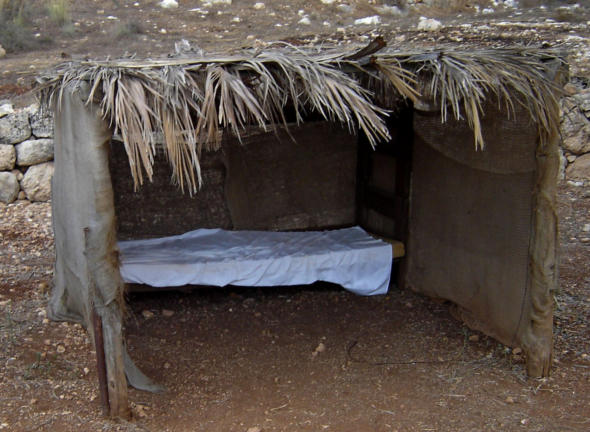
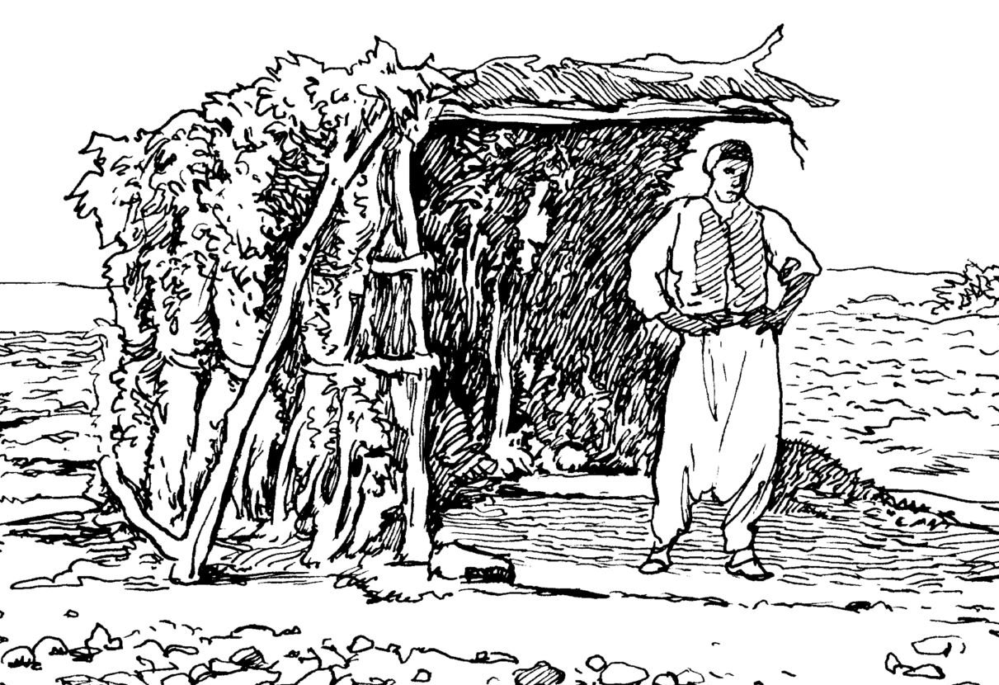

# Human-made Things in the Bible

## License Information

Human-made Things in the Bible © United Bible Societies, 2025. Adapted from: <cite>The Works of Their Hands: Man-made Things in the Bible</cite>, by Ray Pritz © 2009 United Bible Societies. This work is licensed under Creative Commons Attribution-ShareAlike 4.0 International (<a href="https://creativecommons.org/licenses/by-sa/4.0/">https://creativecommons.org/licenses/by-sa/4.0/</a>).

--------------------------------

## 標題：棚（booth, tabernacle） (id: REALIA:3.16)

3\.16 標題：棚（booth, tabernacle）
=============================

經文出處
----

Hebrew 來： סֹךְ, סֻכָּה (音譯： sok, sukah)

[GEN 33:17](https://ref.ly/Gen33:17), [LEV 23:34](https://ref.ly/Lev23:34), [LEV 23:42](https://ref.ly/Lev23:42), [LEV 23:42](https://ref.ly/Lev23:42), [LEV 23:43](https://ref.ly/Lev23:43), [DEU 16:13](https://ref.ly/Deut16:13), [DEU 16:16](https://ref.ly/Deut16:16), [DEU 31:10](https://ref.ly/Deut31:10), [2SA 11:11](https://ref.ly/2Sam11:11), [2SA 22:12](https://ref.ly/2Sam22:12), [1KI 20:12](https://ref.ly/1Kgs20:12), [1KI 20:16](https://ref.ly/1Kgs20:16), [2CH 8:13](https://ref.ly/2Chr8:13), [EZR 3:4](https://ref.ly/Ezra3:4), [NEH 8:14](https://ref.ly/Neh8:14), [NEH 8:15](https://ref.ly/Neh8:15), [NEH 8:16](https://ref.ly/Neh8:16), [NEH 8:17](https://ref.ly/Neh8:17), [NEH 8:17](https://ref.ly/Neh8:17), [JOB 27:18](https://ref.ly/Job27:18), [JOB 36:29](https://ref.ly/Job36:29), [JOB 38:40](https://ref.ly/Job38:40), [PSA 10:9](https://ref.ly/Ps10:9), [PSA 18:12](https://ref.ly/Ps18:12), [PSA 27:5](https://ref.ly/Ps27:5), [PSA 31:21](https://ref.ly/Ps31:21), [PSA 76:3](https://ref.ly/Ps76:3), [ISA 1:8](https://ref.ly/Isa1:8), [ISA 4:6](https://ref.ly/Isa4:6), [JER 25:38](https://ref.ly/Jer25:38), [AMO 9:11](https://ref.ly/Amos9:11), [JON 4:5](https://ref.ly/Jonah4:5), [ZEC 14:16](https://ref.ly/Zech14:16), [ZEC 14:18](https://ref.ly/Zech14:18), [ZEC 14:19](https://ref.ly/Zech14:19)

Greek 希： σκηνή (音譯： skēnē)

[MAT 17:4](https://ref.ly/Matt17:4), [MRK 9:5](https://ref.ly/Mark9:5), [LUK 9:33](https://ref.ly/Luke9:33), [ACT 15:16](https://ref.ly/Acts15:16), [2MA 10:6](https://ref.ly/2Macc10:6)

Greek 希： σκήνωμα (音譯： skēnōma)

[2MA 10:6](https://ref.ly/2Macc10:6)

Greek 希： σκηνοπηγία (音譯： skēnopēgia)

[JHN 7:2](https://ref.ly/John7:2), [1MA 10:21](https://ref.ly/1Macc10:21), [2MA 1:9](https://ref.ly/2Macc1:9), [2MA 1:18](https://ref.ly/2Macc1:18), [1ES 5:50](https://ref.ly/1Esd5:50)

描述和用途
-----

*臨時住所（聖帳篷） (© Ori229, CC BY\-SA 3\.0, via Wikimedia Commons)*

棚是一種較小的臨時住所，通常用天然材料建成，例如多葉的樹枝、蘆葦或草。棚沒有固定的大小或形狀，可能只夠一個家庭的人睡在裡面。

---

翻譯
--

許多語言都沒有表示這種臨時住所的常用詞語。在英文中，較早的譯本使用“tabernacle”、“booth”（「棚」）等詞，但這些詞語在今天可能會被誤解。通俗譯本譯為“shelter”（「遮風擋雨的地方」），充分保留了該詞的意思。

*守望人的遮蔽處 (© Deutsche Bibelgesellschaft, Stuttgart by United Bible Societies)*

另一方面，許多語言都有這樣一個詞語，表示與希伯來文*sukah* 所指幾乎完全相同的一種構築物，不過這種構築物通常指的是普通的居所，而不是臨時或可移動的居所。這裡，翻譯者需要找到一個表示臨時或可移動住所的詞。然而，翻譯者應該盡量避免使用「帳棚」一詞，因為帳棚雖然可以移動，卻是許多聖經人物的固定住所（參[3\.2 帳棚 (tent)\<REALIA:3\.2\>](#) ）。很多時候，農夫也會使用這些臨時住所，比如在白天遮蔭，以及在田裡過夜以保護農作物不受猴子或其他野獸的破壞。還有，牧民在四處遷徙牧放畜群時，可能也會使用這種構築物。

如果目標語言沒有合適的對等詞，可使用描述性的短語，如「臨時小屋」或「臨時住所」。

*仿建的拿撒勒猶太會堂內部 (© Ray Pritz by United Bible Societies)*

在[2SA 22:12](https://ref.ly/2Sam22:12) 、[JOB 36:29](https://ref.ly/Job36:29) 、[PSA 18:12](https://ref.ly/Ps18:12) （《和》18:11）、[PSA 27:5](https://ref.ly/Ps27:5) 和[PSA 31:21](https://ref.ly/Ps31:21) （《和》31:20）中，希伯來文*sukah* 一詞象徵上帝的居所。

[AMO 9:11](https://ref.ly/Amos9:11) ：希伯來文*sukah* 一詞在這裡與大衛王國作比較。可以肯定的是，它們之間的相似之處就在「倒塌」（“fallen”；RSV (Revised Standard Version (1952)) ）一詞中。大衛王國在當時已被毀滅、倒塌，就如一座已經傾倒的老舊建築。「大衛的王國」（GNT (Good News Translation (1992)) 直譯）指的是處於政治和軍事力量巔峰的以色列人。在英文中，這裡的*sukah* 譯為「房屋」會更自然；例如，NEB (New English Bible (1970)) 英文意為，「在那日，我必重建大衛倒塌的房屋……。」GNT (Good News Translation (1992)) 的譯法則在各個方面都清楚說明了該比較，這也是大多數譯本都應該做到的：英文意為：「耶和華說，『日子將到，那時我必復興大衛的王國，它好像一座倒塌、變成廢墟的房屋。我必修造它的城牆，使它復原。我必重建這王國，使它像從前那樣。』」

[JHN 7:2](https://ref.ly/John7:2) 中的希臘文*skēnopēgia* 是一個節期名稱，通常稱為「住棚節」。上帝吩咐以色列人在這節期要住在棚屋裡。節期的名稱應與[LEV 23:34](https://ref.ly/Lev23:34) 中的譯名一致。

* **Associated Passages:** 創世記 33:17; 利未記 23:34; 利未記 23:42; 利未記 23:43; 申命記 16:13; 申命記 16:16; 申命記 31:10; 撒母耳記下 11:11; 撒母耳記下 22:12; 列王紀上 20:12; 列王紀上 20:16; 歷代志下 8:13; 以斯拉記 3:4; 尼希米記 8:14; 尼希米記 8:15; 尼希米記 8:16; 尼希米記 8:17; 約伯記 27:18; 約伯記 36:29; 約伯記 38:40; 詩篇 10:9; 詩篇 18:12; 詩篇 27:5; 詩篇 31:21; 詩篇 76:3; 以賽亞書 1:8; 以賽亞書 4:6; 耶利米書 25:38; 阿摩司書 9:11; 約拿書 4:5; 撒迦利亞書 14:16; 撒迦利亞書 14:18; 撒迦利亞書 14:19; 馬太福音 17:4; 馬可福音 9:5; 路加福音 9:33; 使徒行傳 15:16; 瑪加伯下 10:6; 約翰福音 7:2; 瑪加伯上 10:21; 瑪加伯下 1:9; 瑪加伯下 1:18; 厄斯德拉上 5:50

