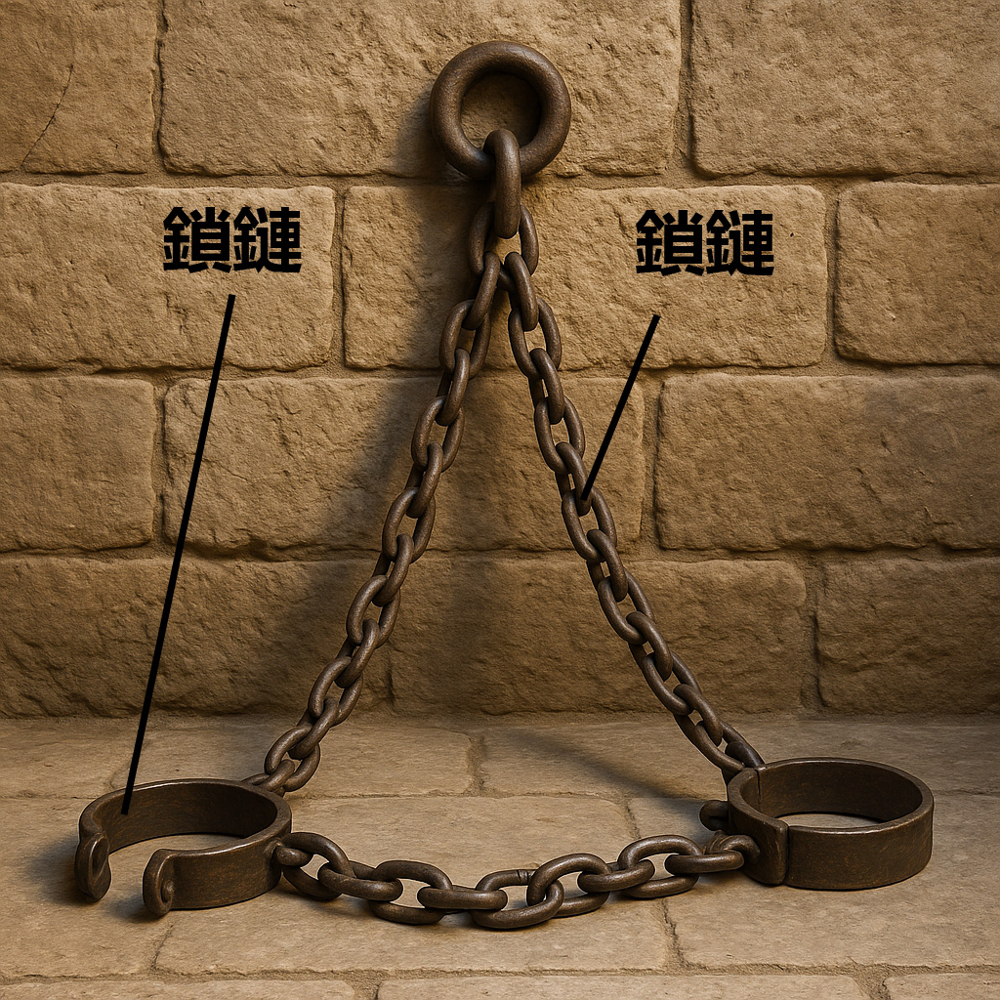
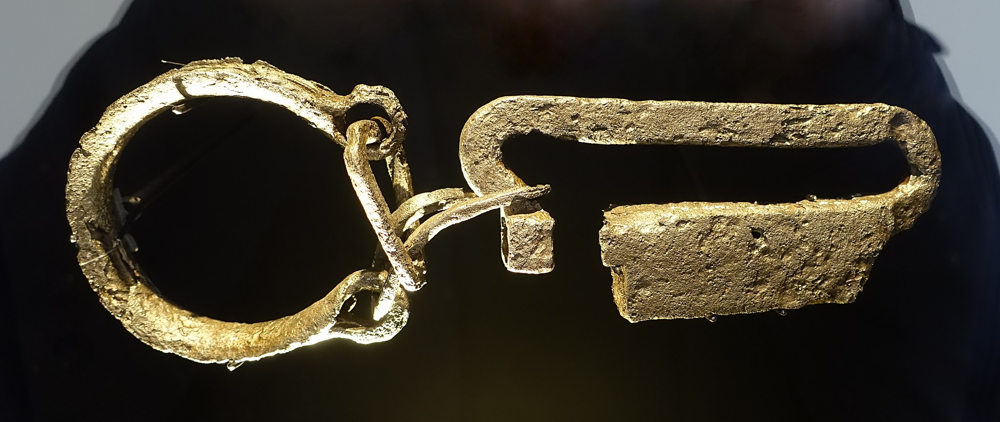

# Human-made Things in the Bible

## License Information

Human-made Things in the Bible © United Bible Societies, 2025. Adapted from: <cite>The Works of Their Hands: Man-made Things in the Bible</cite>, by Ray Pritz © 2009 United Bible Societies. This work is licensed under Creative Commons Attribution-ShareAlike 4.0 International (<a href="https://creativecommons.org/licenses/by-sa/4.0/">https://creativecommons.org/licenses/by-sa/4.0/</a>).

--------------------------------

## 標題：監獄及刑罰（prison and penal activity） (id: REALIA:3.21)

3\.21 標題：監獄及刑罰（prison and penal activity）
=========================================

## 標題：監獄、監牢、地牢（prison, dungeon） (id: REALIA:3.21.1)

3\.21\.1 標題：監獄、監牢、地牢（prison, dungeon）
=====================================

經文出處
----

Hebrew 來： בַּיִת, אסר, אָסִיר, אֵסוּר (音譯： beyth ’esur, beyth ’asurim, beyth hasurim)

[JDG 16:21](https://ref.ly/Judg16:21), [JDG 16:21](https://ref.ly/Judg16:21), [JDG 16:21](https://ref.ly/Judg16:21), [JDG 16:25](https://ref.ly/Judg16:25), [JDG 16:25](https://ref.ly/Judg16:25), [ECC 4:14](https://ref.ly/Eccl4:14), [JER 37:15](https://ref.ly/Jer37:15)

Hebrew 來： בַּיִת, בּוֹר (音譯： (beyth) bor)

[GEN 40:15](https://ref.ly/Gen40:15), [GEN 41:14](https://ref.ly/Gen41:14), [EXO 12:29](https://ref.ly/Exod12:29), [ISA 24:22](https://ref.ly/Isa24:22), [JER 37:16](https://ref.ly/Jer37:16), [JER 38:6](https://ref.ly/Jer38:6), [JER 38:7](https://ref.ly/Jer38:7), [JER 38:9](https://ref.ly/Jer38:9), [JER 38:10](https://ref.ly/Jer38:10), [JER 38:11](https://ref.ly/Jer38:11), [JER 38:13](https://ref.ly/Jer38:13)

Hebrew 來： בַּיִת, כֶּלֶא, כְּלִיא (音譯： (beyth) kele’, beyth kelu’)

[1KI 22:27](https://ref.ly/1Kgs22:27), [2KI 17:4](https://ref.ly/2Kgs17:4), [2KI 25:27](https://ref.ly/2Kgs25:27), [2KI 25:29](https://ref.ly/2Kgs25:29), [2CH 18:26](https://ref.ly/2Chr18:26), [ISA 42:7](https://ref.ly/Isa42:7), [ISA 42:22](https://ref.ly/Isa42:22), [JER 37:4](https://ref.ly/Jer37:4), [JER 37:15](https://ref.ly/Jer37:15), [JER 37:18](https://ref.ly/Jer37:18), [JER 52:31](https://ref.ly/Jer52:31), [JER 52:33](https://ref.ly/Jer52:33)

Hebrew 來： בַּיִת, מִשְׁמָר (音譯： beyth mishmar)

[GEN 42:19](https://ref.ly/Gen42:19)

Hebrew 來： בַּיִת, פְּקֻדָּה (音譯： beyth pqudoth)

[JER 52:11](https://ref.ly/Jer52:11)

Hebrew 來： בַּיִת, סֹהַר (音譯： beyth sohar)

[GEN 39:20](https://ref.ly/Gen39:20), [GEN 39:20](https://ref.ly/Gen39:20), [GEN 39:21](https://ref.ly/Gen39:21), [GEN 39:22](https://ref.ly/Gen39:22), [GEN 39:22](https://ref.ly/Gen39:22), [GEN 39:23](https://ref.ly/Gen39:23), [GEN 40:3](https://ref.ly/Gen40:3), [GEN 40:3](https://ref.ly/Gen40:3)

Aramaic 蘭：גֹּב (音譯： gov)

[DAN 6:8](https://ref.ly/Dan6:8), [DAN 6:13](https://ref.ly/Dan6:13), [DAN 6:17](https://ref.ly/Dan6:17), [DAN 6:18](https://ref.ly/Dan6:18), [DAN 6:20](https://ref.ly/Dan6:20), [DAN 6:21](https://ref.ly/Dan6:21), [DAN 6:24](https://ref.ly/Dan6:24), [DAN 6:24](https://ref.ly/Dan6:24), [DAN 6:25](https://ref.ly/Dan6:25), [DAN 6:25](https://ref.ly/Dan6:25)

Hebrew 來： מַטָּרָה (音譯： matarah)

[NEH 3:25](https://ref.ly/Neh3:25), [NEH 12:39](https://ref.ly/Neh12:39), [JER 32:2](https://ref.ly/Jer32:2), [JER 32:8](https://ref.ly/Jer32:8), [JER 32:12](https://ref.ly/Jer32:12), [JER 33:1](https://ref.ly/Jer33:1), [JER 37:21](https://ref.ly/Jer37:21), [JER 37:21](https://ref.ly/Jer37:21), [JER 38:6](https://ref.ly/Jer38:6), [JER 38:13](https://ref.ly/Jer38:13), [JER 38:28](https://ref.ly/Jer38:28), [JER 39:14](https://ref.ly/Jer39:14), [JER 39:15](https://ref.ly/Jer39:15)

Hebrew 來： מַסְגֵּר (音譯： masger)

[PSA 142:8](https://ref.ly/Ps142:8), [ISA 24:22](https://ref.ly/Isa24:22), [ISA 42:7](https://ref.ly/Isa42:7)

Hebrew 來： עֹצֶר (音譯： ‘otser)

[ISA 53:8](https://ref.ly/Isa53:8)

Greek 希： δεσμωτήριον (音譯： desmōtērion)

[MAT 11:2](https://ref.ly/Matt11:2), [ACT 5:21](https://ref.ly/Acts5:21), [ACT 5:23](https://ref.ly/Acts5:23), [ACT 16:26](https://ref.ly/Acts16:26)

Greek 希： εἱρκτή (音譯： heirktē)

[WIS 17:15](https://ref.ly/Wis17:15)

Greek 希： λάκκος (音譯： lakkos)

[WIS 10:14](https://ref.ly/Wis10:14), [BEL 1:31](https://ref.ly/Bel1:31), [BEL 1:32](https://ref.ly/Bel1:32), [BEL 1:34](https://ref.ly/Bel1:34), [BEL 1:35](https://ref.ly/Bel1:35), [BEL 1:36](https://ref.ly/Bel1:36), [BEL 1:40](https://ref.ly/Bel1:40), [BEL 1:42](https://ref.ly/Bel1:42), [4MA 18:13](https://ref.ly/4Macc18:13)

Greek 希： τήρησις (音譯： tērēsis)

[ACT 4:3](https://ref.ly/Acts4:3), [ACT 5:18](https://ref.ly/Acts5:18)

Greek 希： φυλακή (音譯： fulakē)

[MAT 5:25](https://ref.ly/Matt5:25), [MAT 14:3](https://ref.ly/Matt14:3), [MAT 14:10](https://ref.ly/Matt14:10), [MAT 18:30](https://ref.ly/Matt18:30), [MAT 25:36](https://ref.ly/Matt25:36), [MAT 25:39](https://ref.ly/Matt25:39), [MAT 25:43](https://ref.ly/Matt25:43), [MAT 25:44](https://ref.ly/Matt25:44), [MRK 6:17](https://ref.ly/Mark6:17), [MRK 6:27](https://ref.ly/Mark6:27), [LUK 3:20](https://ref.ly/Luke3:20), [LUK 12:58](https://ref.ly/Luke12:58), [LUK 21:12](https://ref.ly/Luke21:12), [LUK 22:33](https://ref.ly/Luke22:33), [LUK 23:19](https://ref.ly/Luke23:19), [LUK 23:25](https://ref.ly/Luke23:25), [JHN 3:24](https://ref.ly/John3:24), [ACT 5:19](https://ref.ly/Acts5:19), [ACT 5:22](https://ref.ly/Acts5:22), [ACT 5:25](https://ref.ly/Acts5:25), [ACT 8:3](https://ref.ly/Acts8:3), [ACT 12:4](https://ref.ly/Acts12:4), [ACT 12:5](https://ref.ly/Acts12:5), [ACT 12:6](https://ref.ly/Acts12:6), [ACT 12:17](https://ref.ly/Acts12:17), [ACT 16:23](https://ref.ly/Acts16:23), [ACT 16:24](https://ref.ly/Acts16:24), [ACT 16:27](https://ref.ly/Acts16:27), [ACT 16:37](https://ref.ly/Acts16:37), [ACT 16:40](https://ref.ly/Acts16:40), [ACT 22:4](https://ref.ly/Acts22:4), [ACT 26:10](https://ref.ly/Acts26:10), [2CO 6:5](https://ref.ly/2Cor6:5), [2CO 11:23](https://ref.ly/2Cor11:23), [HEB 11:36](https://ref.ly/Heb11:36), [1PE 3:19](https://ref.ly/1Pet3:19), [REV 2:10](https://ref.ly/Rev2:10), [REV 20:7](https://ref.ly/Rev20:7), [4MA 18:11](https://ref.ly/4Macc18:11)

描述和用途
-----

*(Image generated by ChatGPT using OpenAI technology)*

監獄是關押罪犯或其他囚犯的地方。監獄或監牢沒有標準的大小或建築結構。

---

翻譯
--

幾乎所有語言都有表示監獄或監牢的詞語，但在某些情況下，可能要使用描述性短語，例如「把人綁起來的地方」或「人被鏈子鎖起來的地方」。在有些語言中，人們會使用一些慣用語，例如「吃鐵的地方」或「與老鼠呆在一起的房間」。譯文要傳遞出這樣的意思：這是一個違背某人的意志、強行約束他的地方。

希伯來文*bor* 、亞蘭文*gov* 和希臘文*lakkos* 都是指地上的洞或凹坑。在[JER 38:0](https://ref.ly/Jer38:0) 中，耶利米被下到*bor* ，這可能是一個蓄水池（參[3\.9 蓄水池(cistern)\<REALIA:3\.9\>](#) ）。在出現這三個詞語的其他經文中，並不確知這些洞或坑是天然形成的還是人造的。

* **Associated Passages:** 士師記 16:21; 士師記 16:25; 傳道書 4:14; 耶利米書 37:15; 創世記 40:15; 創世記 41:14; 出埃及記 12:29; 以賽亞書 24:22; 耶利米書 37:16; 耶利米書 38:6; 耶利米書 38:7; 耶利米書 38:9; 耶利米書 38:10; 耶利米書 38:11; 耶利米書 38:13; 列王紀上 22:27; 列王紀下 17:4; 列王紀下 25:27; 列王紀下 25:29; 歷代志下 18:26; 以賽亞書 42:7; 以賽亞書 42:22; 耶利米書 37:4; 耶利米書 37:18; 耶利米書 52:31; 耶利米書 52:33; 創世記 42:19; 耶利米書 52:11; 創世記 39:20; 創世記 39:21; 創世記 39:22; 創世記 39:23; 創世記 40:3; 但以理書 6:8; 但以理書 6:13; 但以理書 6:17; 但以理書 6:18; 但以理書 6:20; 但以理書 6:21; 但以理書 6:24; 但以理書 6:25; 尼希米記 3:25; 尼希米記 12:39; 耶利米書 32:2; 耶利米書 32:8; 耶利米書 32:12; 耶利米書 33:1; 耶利米書 37:21; 耶利米書 38:28; 耶利米書 39:14; 耶利米書 39:15; 詩篇 142:8; 以賽亞書 53:8; 馬太福音 11:2; 使徒行傳 5:21; 使徒行傳 5:23; 使徒行傳 16:26; 智慧篇 17:15; 智慧篇 10:14; 彼勒與大龍 1:31; 彼勒與大龍 1:32; 彼勒與大龍 1:34; 彼勒與大龍 1:35; 彼勒與大龍 1:36; 彼勒與大龍 1:40; 彼勒與大龍 1:42; 瑪加伯四書 18:13; 使徒行傳 4:3; 使徒行傳 5:18; 馬太福音 5:25; 馬太福音 14:3; 馬太福音 14:10; 馬太福音 18:30; 馬太福音 25:36; 馬太福音 25:39; 馬太福音 25:43; 馬太福音 25:44; 馬可福音 6:17; 馬可福音 6:27; 路加福音 3:20; 路加福音 12:58; 路加福音 21:12; 路加福音 22:33; 路加福音 23:19; 路加福音 23:25; 約翰福音 3:24; 使徒行傳 5:19; 使徒行傳 5:22; 使徒行傳 5:25; 使徒行傳 8:3; 使徒行傳 12:4; 使徒行傳 12:5; 使徒行傳 12:6; 使徒行傳 12:17; 使徒行傳 16:23; 使徒行傳 16:24; 使徒行傳 16:27; 使徒行傳 16:37; 使徒行傳 16:40; 使徒行傳 22:4; 使徒行傳 26:10; 哥林多後書 6:5; 哥林多後書 11:23; 希伯來書 11:36; 彼得前書 3:19; 啟示錄 2:10; 啟示錄 20:7; 瑪加伯四書 18:11; 耶利米書 38:0

* **Associated ACAI Concepts:** Prison (ID: `realia:Prison`)

## 標題：木枷、枷鎖、木狗、木架（stocks） (id: REALIA:3.21.2)

3\.21\.2 標題：木枷、枷鎖、木狗、木架（stocks）
===============================

經文出處
----

Hebrew 來： מַהְפֶּכֶת (音譯： mahpeketh)

[2CH 16:10](https://ref.ly/2Chr16:10), [JER 20:2](https://ref.ly/Jer20:2), [JER 20:3](https://ref.ly/Jer20:3), [JER 29:26](https://ref.ly/Jer29:26)

Hebrew 來： סַד (音譯： sad)

[JOB 13:27](https://ref.ly/Job13:27), [JOB 33:11](https://ref.ly/Job33:11)

Greek 希： ξύλον (音譯： xulon)

[ACT 16:24](https://ref.ly/Acts16:24)

描述和用途
-----

*木製腳鎖 (© Connorisda1 \- Wikimedia Commons)*

木枷是一種由木頭構件組裝而成的裝置，把犯人的腿、臂和／或頭放在木枷中間，然後牢牢地固定住。兩塊木頭構件上各有幾個半圓形的洞，把它們合到一起，就形成幾個圓形的孔，固定住犯人的四肢或頭。然後，把兩塊木板鎖在一起，這樣囚犯就無法動彈了。木枷既是一種監禁的工具，也是一種刑罰手段。

---

翻譯
--

*(Image generated by ChatGPT using OpenAI technology)*

許多譯本都需要用一個描述性短語來表示「木枷」，才能準確表達出它的意思。比較NCV (New Century Version) 中的[JER 20:2](https://ref.ly/Jer20:2) ，英文意為：「他把耶利米的手和腳都鎖到大木塊中間。」

[JOB 13:27](https://ref.ly/Job13:27) ：在這節經文中，約伯把自己描繪成上帝的囚犯，行動受到嚴重的限制。第一行經文中的「木枷」指的是用來鎖住囚犯雙腳的木塊，但根據第二行經文，約伯也許還可以略微活動。有譯本把第一行譯為：「你在我腳上綁上鎖鏈」（GNT (Good News Translation (1992)) 直譯）。這行也可以譯為：「你把我的腳綁在一起」，或「你綁住了我的腳，讓我無法行走」。

[ACT 16:24](https://ref.ly/Acts16:24) ：對於「在木枷中」（RSV (Revised Standard Version (1952)) 直譯）這個短語，GNT (Good News Translation (1992)) 英文意為「在很重的木塊之間」。GNT (Good News Translation (1992)) 沒有使用「木枷」一詞有兩個原因：（1）翻譯者認為目標讀者難以理解該詞的含義；（2）羅馬人使用的木枷與其他已知的木枷種類不同。羅馬人用木枷作為一種刑具，上面有多對固定腿的孔，從而可以把囚犯的雙腿分得很開，造成極大的疼痛。

* **Associated Passages:** 歷代志下 16:10; 耶利米書 20:2; 耶利米書 20:3; 耶利米書 29:26; 約伯記 13:27; 約伯記 33:11; 使徒行傳 16:24

## 標題：十架、十字架（cross） (id: REALIA:3.21.3)

3\.21\.3 標題：十架、十字架（cross）
=========================

經文出處
----

Greek 希： ἀνασταυρόω (音譯： anastauroō（動詞）)

[HEB 6:6](https://ref.ly/Heb6:6)

Greek 希： ξύλον (音譯： xulon)

[ACT 5:30](https://ref.ly/Acts5:30), [ACT 10:39](https://ref.ly/Acts10:39), [ACT 13:29](https://ref.ly/Acts13:29), [1PE 2:24](https://ref.ly/1Pet2:24)

Greek 希： σταυρός, σταυρόω (音譯： stauros, stauroō（動詞）)

[MAT 10:38](https://ref.ly/Matt10:38), [MAT 16:24](https://ref.ly/Matt16:24), [MAT 20:19](https://ref.ly/Matt20:19), [MAT 23:34](https://ref.ly/Matt23:34), [MAT 26:2](https://ref.ly/Matt26:2), [MAT 27:22](https://ref.ly/Matt27:22), [MAT 27:23](https://ref.ly/Matt27:23), [MAT 27:26](https://ref.ly/Matt27:26), [MAT 27:31](https://ref.ly/Matt27:31), [MAT 27:32](https://ref.ly/Matt27:32), [MAT 27:35](https://ref.ly/Matt27:35), [MAT 27:38](https://ref.ly/Matt27:38), [MAT 27:40](https://ref.ly/Matt27:40), [MAT 27:42](https://ref.ly/Matt27:42), [MAT 28:5](https://ref.ly/Matt28:5), [MRK 8:34](https://ref.ly/Mark8:34), [MRK 15:13](https://ref.ly/Mark15:13), [MRK 15:14](https://ref.ly/Mark15:14), [MRK 15:15](https://ref.ly/Mark15:15), [MRK 15:20](https://ref.ly/Mark15:20), [MRK 15:21](https://ref.ly/Mark15:21), [MRK 15:24](https://ref.ly/Mark15:24), [MRK 15:25](https://ref.ly/Mark15:25), [MRK 15:27](https://ref.ly/Mark15:27), [MRK 15:30](https://ref.ly/Mark15:30), [MRK 15:32](https://ref.ly/Mark15:32), [MRK 16:6](https://ref.ly/Mark16:6), [LUK 9:23](https://ref.ly/Luke9:23), [LUK 14:27](https://ref.ly/Luke14:27), [LUK 23:21](https://ref.ly/Luke23:21), [LUK 23:21](https://ref.ly/Luke23:21), [LUK 23:23](https://ref.ly/Luke23:23), [LUK 23:26](https://ref.ly/Luke23:26), [LUK 23:33](https://ref.ly/Luke23:33), [LUK 24:7](https://ref.ly/Luke24:7), [LUK 24:20](https://ref.ly/Luke24:20), [JHN 19:6](https://ref.ly/John19:6), [JHN 19:6](https://ref.ly/John19:6), [JHN 19:6](https://ref.ly/John19:6), [JHN 19:10](https://ref.ly/John19:10), [JHN 19:15](https://ref.ly/John19:15), [JHN 19:15](https://ref.ly/John19:15), [JHN 19:16](https://ref.ly/John19:16), [JHN 19:17](https://ref.ly/John19:17), [JHN 19:18](https://ref.ly/John19:18), [JHN 19:19](https://ref.ly/John19:19), [JHN 19:20](https://ref.ly/John19:20), [JHN 19:23](https://ref.ly/John19:23), [JHN 19:25](https://ref.ly/John19:25), [JHN 19:31](https://ref.ly/John19:31), [JHN 19:41](https://ref.ly/John19:41), [ACT 2:36](https://ref.ly/Acts2:36), [ACT 4:10](https://ref.ly/Acts4:10), [1CO 1:13](https://ref.ly/1Cor1:13), [1CO 1:17](https://ref.ly/1Cor1:17), [1CO 1:18](https://ref.ly/1Cor1:18), [1CO 1:23](https://ref.ly/1Cor1:23), [1CO 2:2](https://ref.ly/1Cor2:2), [1CO 2:8](https://ref.ly/1Cor2:8), [2CO 13:4](https://ref.ly/2Cor13:4), [GAL 3:1](https://ref.ly/Gal3:1), [GAL 5:11](https://ref.ly/Gal5:11), [GAL 5:24](https://ref.ly/Gal5:24), [GAL 6:12](https://ref.ly/Gal6:12), [GAL 6:14](https://ref.ly/Gal6:14), [GAL 6:14](https://ref.ly/Gal6:14), [EPH 2:16](https://ref.ly/Eph2:16), [PHP 2:8](https://ref.ly/Phil2:8), [PHP 3:18](https://ref.ly/Phil3:18), [COL 1:20](https://ref.ly/Col1:20), [COL 2:14](https://ref.ly/Col2:14), [HEB 12:2](https://ref.ly/Heb12:2), [REV 11:8](https://ref.ly/Rev11:8)

Greek 希： συσταυρόω (音譯： sustauroō（動詞）)

[MAT 27:44](https://ref.ly/Matt27:44), [MRK 15:32](https://ref.ly/Mark15:32), [JHN 19:32](https://ref.ly/John19:32), [ROM 6:6](https://ref.ly/Rom6:6), [GAL 2:19](https://ref.ly/Gal2:19)

描述
--

*木製現代十字架 (Aaron Burden aaronburden, CC0, via Wikimedia Commons)*

十字架是把一根木柱子直立插在地上，上半部分固定著一根橫木，形狀就像字母**T** 或**†** 符號。此外，還有一種由兩根木條做成的**X** 形十字架，不過這種十字架可能不太常見。耶穌頭部上方有一塊寫著字的罪狀牌，這表明釘他的十字架可能是**†** 形狀。

---

用途
--

被判刑的人通常要把十字架的橫木背到行刑的地方，而木柱子（甚或是砍斷的樹幹）已經豎立在那裡了。釘十字架時，行刑者把罪人的兩隻手釘在橫木上（穿過手掌下面的手腕），然後把人和橫木抬起來，綁到豎立著的木柱子上。有時，犯人的臀部會坐靠在木柱子上面的一個小突起上。然後，把犯人的雙腳釘在木柱子上，用一根大釘子從腳的側面釘穿兩腳的腳踝。被釘十字架的人會慢慢死去，經常需要幾天的時間。

---

翻譯
--

由於十字架具有象徵含義，因此所有語言的新約譯本都保留了十字架這個詞語。十字架不僅是死刑的手段，還有一個特定的樣式，即直立的柱子加一根橫木。在一些目標語言中，表示十字架的詞語就是「橫木」。在其他一些語言中，可以採用一個意為「交叉杆」的短語。

如果可能的話，翻譯者應該採用一個具有引申義的詞語或短語，因為在許多上下文中，「十字架」一語不僅指基督被釘死的刑具，還指他被釘死這件事情本身。另外，十字架還是赦罪及和好的象徵。因為十字架有許多引申義，所以需要盡量選擇能夠表達這些附加意思的方式。

希臘文*xulon* 的字面意思是「木頭」。在新約之外，*xulon* 通常指絞刑架；在新約關於死刑的語境中，這個詞指的是耶穌被釘的十字架。在[GAL 3:13](https://ref.ly/Gal3:13) ，沒有必要使用一個表示活樹的詞語來翻譯*xulon* 。這個希臘文詞語在這節經文中可能只是指「柱子」，因此使用一個也可以表示十字架的詞語可能更加合適。如果採用只能表示活樹的詞語，可能會導致不必要的不一致。雖然這節經文中的短語在一定程度上是引自[DEU 21:23](https://ref.ly/Deut21:23) ，但翻譯者不要試圖協調這兩段經文。因為《申命記》中的誡命是要把罪人處死，然後把屍體掛在樹上。這種懸掛與釘十字架不同，它不是處死的方式，可能只是某種公開的警告。

* **Associated Passages:** 希伯來書 6:6; 使徒行傳 5:30; 使徒行傳 10:39; 使徒行傳 13:29; 彼得前書 2:24; 馬太福音 10:38; 馬太福音 16:24; 馬太福音 20:19; 馬太福音 23:34; 馬太福音 26:2; 馬太福音 27:22; 馬太福音 27:23; 馬太福音 27:26; 馬太福音 27:31; 馬太福音 27:32; 馬太福音 27:35; 馬太福音 27:38; 馬太福音 27:40; 馬太福音 27:42; 馬太福音 28:5; 馬可福音 8:34; 馬可福音 15:13; 馬可福音 15:14; 馬可福音 15:15; 馬可福音 15:20; 馬可福音 15:21; 馬可福音 15:24; 馬可福音 15:25; 馬可福音 15:27; 馬可福音 15:30; 馬可福音 15:32; 馬可福音 16:6; 路加福音 9:23; 路加福音 14:27; 路加福音 23:21; 路加福音 23:23; 路加福音 23:26; 路加福音 23:33; 路加福音 24:7; 路加福音 24:20; 約翰福音 19:6; 約翰福音 19:10; 約翰福音 19:15; 約翰福音 19:16; 約翰福音 19:17; 約翰福音 19:18; 約翰福音 19:19; 約翰福音 19:20; 約翰福音 19:23; 約翰福音 19:25; 約翰福音 19:31; 約翰福音 19:41; 使徒行傳 2:36; 使徒行傳 4:10; 哥林多前書 1:13; 哥林多前書 1:17; 哥林多前書 1:18; 哥林多前書 1:23; 哥林多前書 2:2; 哥林多前書 2:8; 哥林多後書 13:4; 加拉太書 3:1; 加拉太書 5:11; 加拉太書 5:24; 加拉太書 6:12; 加拉太書 6:14; 以弗所書 2:16; 腓立比書 2:8; 腓立比書 3:18; 歌羅西書 1:20; 歌羅西書 2:14; 希伯來書 12:2; 啟示錄 11:8; 馬太福音 27:44; 約翰福音 19:32; 羅馬書 6:6; 加拉太書 2:19; 加拉太書 3:13; 申命記 21:23

* **Associated ACAI Concepts:** Cross (ID: `realia:Cross`)

## 標題：鎖鏈、鏈子（chain） (id: REALIA:3.21.4)

3\.21\.4 標題：鎖鏈、鏈子（chain）
========================

經文出處
----

Hebrew 來： אֲזִקִּים (音譯： ’aziqim（’azeq的複數）)

[JER 40:1](https://ref.ly/Jer40:1), [JER 40:4](https://ref.ly/Jer40:4)

Hebrew 來： זֵק (音譯： ziqim（zeq的複數）)

[JOB 36:8](https://ref.ly/Job36:8), [PSA 149:8](https://ref.ly/Ps149:8), [ISA 45:14](https://ref.ly/Isa45:14), [NAM 3:10](https://ref.ly/Nah3:10)

Hebrew 來： מַעֲדַנּוֹת (音譯： ma‘adanoth)

[JOB 38:31](https://ref.ly/Job38:31)

Hebrew 來： מֹשְׁכוֹת (音譯： moshkoth)

[JOB 38:31](https://ref.ly/Job38:31)

Hebrew 來： רַתּוּקָה (音譯： ratuqah)

[1KI 6:21](https://ref.ly/1Kgs6:21)

Greek 希： ἅλυσις (音譯： halusis)

[MRK 5:3](https://ref.ly/Mark5:3), [MRK 5:4](https://ref.ly/Mark5:4), [MRK 5:4](https://ref.ly/Mark5:4), [LUK 8:29](https://ref.ly/Luke8:29), [ACT 12:6](https://ref.ly/Acts12:6), [ACT 12:7](https://ref.ly/Acts12:7), [ACT 21:33](https://ref.ly/Acts21:33), [ACT 28:20](https://ref.ly/Acts28:20), [EPH 6:20](https://ref.ly/Eph6:20), [2TI 1:16](https://ref.ly/2Tim1:16), [REV 20:1](https://ref.ly/Rev20:1), [WIS 17:16](https://ref.ly/Wis17:16)

Greek 希： δέσμιος, δεσμός (音譯： desmios, desmos)

[LUK 8:29](https://ref.ly/Luke8:29), [LUK 13:16](https://ref.ly/Luke13:16), [ACT 16:26](https://ref.ly/Acts16:26), [ACT 20:23](https://ref.ly/Acts20:23), [ACT 23:29](https://ref.ly/Acts23:29), [ACT 26:29](https://ref.ly/Acts26:29), [ACT 26:31](https://ref.ly/Acts26:31), [PHP 1:7](https://ref.ly/Phil1:7), [PHP 1:14](https://ref.ly/Phil1:14), [PHP 1:17](https://ref.ly/Phil1:17), [COL 4:18](https://ref.ly/Col4:18), [2TI 2:9](https://ref.ly/2Tim2:9), [PHM 1:10](https://ref.ly/Phlm1:10), [PHM 1:13](https://ref.ly/Phlm1:13), [HEB 11:36](https://ref.ly/Heb11:36), [JUD 1:6](https://ref.ly/Jude1:6), [WIS 10:14](https://ref.ly/Wis10:14), [SIR 6:25](https://ref.ly/Sir6:25), [SIR 6:30](https://ref.ly/Sir6:30), [SIR 13:12](https://ref.ly/Sir13:12), [SIR 28:20](https://ref.ly/Sir28:20), [SIR 28:20](https://ref.ly/Sir28:20), [SIR 28:20](https://ref.ly/Sir28:20), [3MA 3:25](https://ref.ly/3Macc3:25), [3MA 4:7](https://ref.ly/3Macc4:7), [3MA 5:6](https://ref.ly/3Macc5:6), [3MA 6:27](https://ref.ly/3Macc6:27), [4MA 12:2](https://ref.ly/4Macc12:2), [1ES 1:38](https://ref.ly/1Esd1:38)

Greek 希： σειρά (音譯： seira)

[2PE 2:4](https://ref.ly/2Pet2:4)

描述
--

*鎖鏈和腳鐐 (Image generated by ChatGPT using OpenAI technology)*

鎖鏈是一串鏈環連在一起，通常由金屬做成。

---

用途
--

鎖鏈通常用於限制物體，或把幾個物體固定在一起。它尤其與限制囚犯的行動有關。另參[10\.5\.4 項鏈、鏈、帶子 (necklace, chain, cord)\<REALIA:10\.5\.4\>](#) 。

---

翻譯
--

在許多語言中，「鎖鏈」的表達方式就是「金屬繩」。還有一些語言可以譯為「一節節的繩子」，而不是「扭絞的繩子」，後者是指用某種纖維編成的繩子。有些語言用不同的詞語表示捆綁人的鎖鏈與工農業生產所用的鏈條。

在上面列出的一些經文中，「鎖鏈」象徵監禁。在類似[PHP 1:7](https://ref.ly/Phil1:7) 的經文中，許多譯本都會遵循GNT (Good News Translation (1992)) 的譯法。在這節經文的中間部分，希臘文本的字面意思是「在我被鎖鏈捆綁的境地中」，但GNT (Good News Translation (1992)) 英文意為「現在我在獄中的情況下」。

所羅門放在至聖所前的鏈子是用金子做的（[1KI 6:21](https://ref.ly/1Kgs6:21) ），主要用來裝飾，但它們也提醒在聖所供職的人不要靠近至聖所。

在[JOB 38:31](https://ref.ly/Job38:31) 中，有兩個希伯來文詞語需要特別注意。*ma‘adanoth* （也出現在[1SA 15:32](https://ref.ly/1Sam15:32) ，意思卻完全不同）與一個意為「繫、綁」的動詞一起出現。*ma‘adanoth* 的意思不確定，但似乎是由於「環」一詞中的兩個希伯來文字母調換了順序所導致的，所以*ma‘adanoth* 的意思是一串相互連接的環，即「鏈子」（RSV (Revised Standard Version (1952)) 直譯）。有些譯本傾向於將動詞和名詞合譯為「繫在一起」（GNT (Good News Translation (1992)) 、GECL (German Common Language Version (Gute Nachricht Bibel)) 直譯），而不提捆綁所用的物件。第二個希伯來文詞語*moshkoth* 在整本聖經中僅出現在此處。該詞來自一個意為「拉、拖」的動詞。在現代希伯來文中，*moshkoth* 的意思是「韁繩」（用來駕馭馬的皮繩），NJPSV (New Jewish Publication Society Version) 的譯法就反映出這一層意思，這節經文的第二行英文意為「或解開獵戶座的韁繩」。其他譯本認為*moshkoth* 指的是獵戶座的「腰帶」（如NEB (New English Bible (1970)) 、REB (Revised English Bible (1989)) 、GECL (German Common Language Version (Gute Nachricht Bibel)) ），這是排成一行的三顆星。

[PSA 149:8](https://ref.ly/Ps149:8) ：RSV (Revised Standard Version (1952)) 在這節經文的英文意為，「用鏈子捆綁他們的君王，用鐵腳鐐鎖住他們的貴族。」「他們的貴族」與「他們的君王」平行，指軍事領袖。在一些語言中，使用「鏈子」和「鐵腳鐐」容易讓人以為捆綁君王的鏈子不是用鐵做成的。然而，詩歌中的平行表明它們是同義詞。在一些語言中，這節經文可譯為：「俘虜他們的君王和領袖，並把他們綁起來。」

[REV 20:1](https://ref.ly/Rev20:1) ：「一條大鎖鏈」（RSV (Revised Standard Version (1952)) 直譯）可以譯為「一條沉重的鎖鏈」（GNT (Good News Translation (1992)) 直譯）或「一條粗鎖鏈」。我們假定這條鏈子是金屬做成的，目的顯然是捆綁撒但。在金屬鎖鏈不為人所知的文化中，翻譯者可以說「一根粗繩子」，或者也可以使用其他用來綁人的材料。

* **Associated Passages:** 耶利米書 40:1; 耶利米書 40:4; 約伯記 36:8; 詩篇 149:8; 以賽亞書 45:14; 那鴻書 3:10; 約伯記 38:31; 列王紀上 6:21; 馬可福音 5:3; 馬可福音 5:4; 路加福音 8:29; 使徒行傳 12:6; 使徒行傳 12:7; 使徒行傳 21:33; 使徒行傳 28:20; 以弗所書 6:20; 提摩太後書 1:16; 啟示錄 20:1; 智慧篇 17:16; 路加福音 13:16; 使徒行傳 16:26; 使徒行傳 20:23; 使徒行傳 23:29; 使徒行傳 26:29; 使徒行傳 26:31; 腓立比書 1:7; 腓立比書 1:14; 腓立比書 1:17; 歌羅西書 4:18; 提摩太後書 2:9; 腓利門書 1:10; 腓利門書 1:13; 希伯來書 11:36; 猶大書 1:6; 智慧篇 10:14; 德訓篇 6:25; 德訓篇 6:30; 德訓篇 13:12; 德訓篇 28:20; 瑪加伯三書 3:25; 瑪加伯三書 4:7; 瑪加伯三書 5:6; 瑪加伯三書 6:27; 瑪加伯四書 12:2; 厄斯德拉上 1:38; 彼得後書 2:4; 撒母耳記上 15:32

* **Associated ACAI Concepts:** Chain (ID: `realia:Chain`)

## 標題：腳鐐（shackle, fetter, manacle） (id: REALIA:3.21.5)

3\.21\.5 標題：腳鐐（shackle, fetter, manacle）
========================================

經文出處
----

Hebrew 來： כֶּבֶל (音譯： kevel)

[PSA 105:18](https://ref.ly/Ps105:18), [PSA 149:8](https://ref.ly/Ps149:8)

Hebrew 來： נְחֹשֶׁת (音譯： nchosheth)

[JDG 16:21](https://ref.ly/Judg16:21), [2SA 3:34](https://ref.ly/2Sam3:34), [2KI 25:7](https://ref.ly/2Kgs25:7), [2CH 33:11](https://ref.ly/2Chr33:11), [2CH 36:6](https://ref.ly/2Chr36:6), [JER 39:7](https://ref.ly/Jer39:7), [JER 52:11](https://ref.ly/Jer52:11), [LAM 3:7](https://ref.ly/Lam3:7)

Greek 希： πέδη (音譯： pedē)

[MRK 5:4](https://ref.ly/Mark5:4), [MRK 5:4](https://ref.ly/Mark5:4), [LUK 8:29](https://ref.ly/Luke8:29), [SIR 6:24](https://ref.ly/Sir6:24), [SIR 6:29](https://ref.ly/Sir6:29), [SIR 21:19](https://ref.ly/Sir21:19), [SIR 33:29](https://ref.ly/Sir33:29), [1MA 3:41](https://ref.ly/1Macc3:41), [3MA 4:9](https://ref.ly/3Macc4:9), [3MA 6:19](https://ref.ly/3Macc6:19)

Greek 希： χειροπέδη (音譯： cheiropedē)

[SIR 21:19](https://ref.ly/Sir21:19)

描述和用途
-----

*腳踝上的鐐銬，用來限制囚犯的活動 (Daderot, Public domain or CC0, via Wikimedia Commons)*

腳鐐是一種金屬鎖鏈，上面有專門的環，用來套住腳踝。腳鐐的作用是限制危險分子或囚犯的行動。本條目與上一個條目「鎖鏈、鏈子」有很多重疊之處。另參上節的插圖。

---

翻譯
--

在有些語言中，「腳鐐」的對等詞就是「腳上的鎖鏈」。[MRK 5:4](https://ref.ly/Mark5:4) 和[LUK 8:29](https://ref.ly/Luke8:29) 都提到鎖鏈和腳鐐。腳鐐用來綁住腿和腳，而鎖鏈用來綁住手和手臂。如果目標語言中沒有具體指「腳鐐」的詞語，可把字面意思為「被鎖鏈和腳鐐捆綁」的短語譯為：「給他的手腳套上鎖鏈」。

舊約文本通常會指明製作腳鐐和鎖鏈所用的材料。希伯來文*nchosheth* 指的是黃銅或青銅，而在《詩篇》中出現兩次的*kevel* 指的是鐵做的器具。

* **Associated Passages:** 詩篇 105:18; 詩篇 149:8; 士師記 16:21; 撒母耳記下 3:34; 列王紀下 25:7; 歷代志下 33:11; 歷代志下 36:6; 耶利米書 39:7; 耶利米書 52:11; 耶利米哀歌 3:7; 馬可福音 5:4; 路加福音 8:29; 德訓篇 6:24; 德訓篇 6:29; 德訓篇 21:19; 德訓篇 33:29; 瑪加伯上 3:41; 瑪加伯三書 4:9; 瑪加伯三書 6:19

## 標題：刑架和其他刑具（rack and other instruments of torture） (id: REALIA:3.21.6)

3\.21\.6 標題：刑架和其他刑具（rack and other instruments of torture）
==========================================================

經文出處
----

Greek 希： ἄξων (音譯： axōn)

[4MA 9:20](https://ref.ly/4Macc9:20)

Greek 希： καταπέλτης (音譯： katapeltēs)

[4MA 11:26](https://ref.ly/4Macc11:26), [4MA 8:13](https://ref.ly/4Macc8:13), [4MA 9:26](https://ref.ly/4Macc9:26), [4MA 11:9](https://ref.ly/4Macc11:9), [4MA 18:20](https://ref.ly/4Macc18:20)

Greek 希： στρέβλη (音譯： streblē)

[SIR 33:27](https://ref.ly/Sir33:27), [4MA 7:4](https://ref.ly/4Macc7:4), [4MA 7:14](https://ref.ly/4Macc7:14), [4MA 8:11](https://ref.ly/4Macc8:11), [4MA 8:24](https://ref.ly/4Macc8:24), [4MA 9:22](https://ref.ly/4Macc9:22), [4MA 14:12](https://ref.ly/4Macc14:12), [4MA 15:24](https://ref.ly/4Macc15:24), [4MA 15:25](https://ref.ly/4Macc15:25)

Greek 希： στρεβλωτήριον (音譯： streblōtērion)

[4MA 8:13](https://ref.ly/4Macc8:13)

Greek 希： τροχός (音譯： trochos)

[4MA 5:32](https://ref.ly/4Macc5:32), [4MA 8:13](https://ref.ly/4Macc8:13), [4MA 9:12](https://ref.ly/4Macc9:12), [4MA 9:17](https://ref.ly/4Macc9:17), [4MA 9:19](https://ref.ly/4Macc9:19), [4MA 9:20](https://ref.ly/4Macc9:20), [4MA 10:8](https://ref.ly/4Macc10:8), [4MA 11:10](https://ref.ly/4Macc11:10), [4MA 11:17](https://ref.ly/4Macc11:17), [4MA 15:22](https://ref.ly/4Macc15:22)

Greek 希： τύμπανον (音譯： tumpanon)

[2MA 6:19](https://ref.ly/2Macc6:19), [2MA 6:28](https://ref.ly/2Macc6:28)

描述和用途
-----

刑架是一個拷問的刑具。受刑者的雙手伸過頭頂，四肢伸展躺在桌子上。手和腳分別綁在桌子兩端的輪子或其他裝置上，這些裝置把四肢拉得越來越開，給人造成巨大的痛苦。受刑者被這樣扯拽的同時，可能還會遭受鞭打或其他方式的身體虐待。

---

翻譯
--

大多數文化都不知道這種刑具。翻譯者最好依循GNT (Good News Translation (1992)) 的譯法，不要追求準確地描述刑架；例如，在[2MA 6:19](https://ref.ly/2Macc6:19) 中，GNT (Good News Translation (1992)) 英文意為「嚴刑拷打的地方」。

希臘文*trochos* 的字面意思是「輪子」。在[4MA 5:32](https://ref.ly/4Macc5:32) 中，RSV (Revised Standard Version (1952)) 英文意為「拷問人的輪子」。在《次經‧馬加比四書》的大多數情況下，「輪子」和刑架相似，都是用來扯拽受刑者的，並且輪子似乎與火一起使用，受刑者在被扯拽的同時，還被火烤灼著。

同樣，[4MA 8:13](https://ref.ly/4Macc8:13) 中的希臘文*katapeltēs* 似乎是指一種拉扯四肢、使關節脫臼的刑具。RSV (Revised Standard Version (1952)) 把它譯為“catapults”（「彈弓」），但CEV (Contemporary English Version) 譯為“pounding machines”（「投石車」）。但這似乎不符合[4MA 11:9](https://ref.ly/4Macc11:9); [4MA 11:10](https://ref.ly/4Macc11:10) 中描述的酷刑，CEV (Contemporary English Version) 英文意為「他將要受刑的地方」。

《次經‧馬加比四書》所列的部分刑具可能是更大刑具的構件；例如，[4MA 11:10](https://ref.ly/4Macc11:10) 中的「楔子」（“wedge”；RSV (Revised Standard Version (1952)) ，希臘文*sfēn* ）、「鐵夾子」（*podagra sidērous* ）和「輪子」（*trochiaios* ）在施行*katapeltēs* 酷刑時都會用到。

希臘文*axōn* 通常指的是輪子的軸（參[8\.3 輪、車輪 (wheel)\<REALIA:8\.3\>](#) ）。然而，在[4MA 9:20](https://ref.ly/4Macc9:20) 中，它不是指車輪的一個部件，而是指靜止不動的刑訊機器的一個部分。輪子是其運轉機構的一部分，這些輪子就像馬車上的輪子一樣，圍著一個中心軸轉動。

《次經‧馬加比四書》還提到了其他一些刑具。這些刑具的結構大多不明確。我們在這裡列出它們的名稱以及翻譯建議。主要有：

*arthrembolon*[4MA 8:13](https://ref.ly/4Macc8:13) 「關節脫臼器」（“joint\-dislocator”；RSV (Revised Standard Version (1952)) ）、「牽拉架」（“stretching frame”；CEV (Contemporary English Version) ）

*daktulēthra*[4MA 8:13](https://ref.ly/4Macc8:13) 「拇指夾」（“thumbscrew”；RSV (Revised Standard Version (1952)) ）、「鐵鉗」（“iron clamps”；CEV (Contemporary English Version) ）

*daktulēthra*[4MA 8:13](https://ref.ly/4Macc8:13) 「骨頭軋碎器」（“bone\-crusher”，可能與輪子有關）

*cheir sidēra*[4MA 8:13](https://ref.ly/4Macc8:13); [4MA 11:10](https://ref.ly/4Macc11:10) 「帶尖鈎的鐵手套」（“iron gauntlets having sharp hooks”；RSV (Revised Standard Version (1952)) ）、「末端有尖鈎的重鐵棒」（“heavy iron club with sharp hooks on its end”；CEV (Contemporary English Version) ）

* **Associated Passages:** 瑪加伯四書 9:20; 瑪加伯四書 11:26; 瑪加伯四書 8:13; 瑪加伯四書 9:26; 瑪加伯四書 11:9; 瑪加伯四書 18:20; 德訓篇 33:27; 瑪加伯四書 7:4; 瑪加伯四書 7:14; 瑪加伯四書 8:11; 瑪加伯四書 8:24; 瑪加伯四書 9:22; 瑪加伯四書 14:12; 瑪加伯四書 15:24; 瑪加伯四書 15:25; 瑪加伯四書 5:32; 瑪加伯四書 9:12; 瑪加伯四書 9:17; 瑪加伯四書 9:19; 瑪加伯四書 10:8; 瑪加伯四書 11:10; 瑪加伯四書 11:17; 瑪加伯四書 15:22; 瑪加伯下 6:19; 瑪加伯下 6:28

