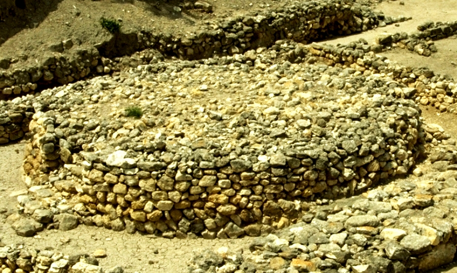
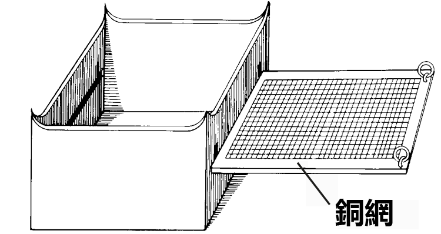
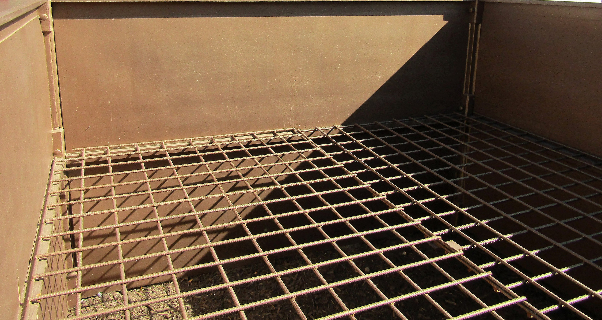
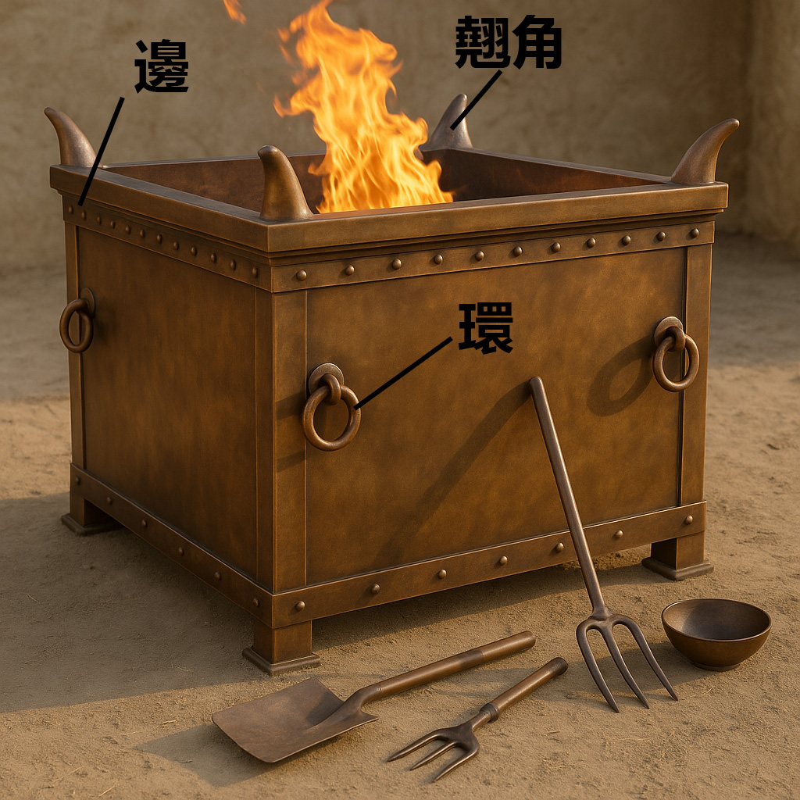

# Human-made Things in the Bible

## License Information

Human-made Things in the Bible © United Bible Societies, 2025. Adapted from: <cite>The Works of Their Hands: Man-made Things in the Bible</cite>, by Ray Pritz © 2009 United Bible Societies. This work is licensed under Creative Commons Attribution-ShareAlike 4.0 International (<a href="https://creativecommons.org/licenses/by-sa/4.0/">https://creativecommons.org/licenses/by-sa/4.0/</a>).

--------------------------------

## 標題：壇、祭壇、燔祭壇（altars） (id: REALIA:4.2)

4\.2 標題：壇、祭壇、燔祭壇（altars）
========================

*(Image generated by ChatGPT using OpenAI technology)*

祭壇是一種桌子或平臺，用來向上帝獻上祭牲或其他祭物。聖經提到幾種祭壇：

1\. 用於獻祭的以色列人祭壇

（a）建在戶外露天地方的石頭祭壇，如《創世記》和其他舊約書卷中提到的祭壇。

（b）在帳幕和耶路撒冷聖殿中用來獻祭的祭壇

2\. 作獻祭以外用途的以色列人祭壇

（a）帳幕或聖殿中的香壇，包括《啟示錄》中提到的供人獻上禱告和焚香的壇

3\. 異教祭壇

下面的條目描述了不同的壇。然而在許多經文中，我們並不確定所指的究竟是哪種壇，尤其是在帳幕或聖殿的禮儀中，所指的可能是祭壇，也可能是香壇。很多語言都有一個統稱，用來指具有多種用途的祭壇或禮臺。如果目標語言沒有術語表示獻祭的地方，翻譯者可能需要使用描述性的短語或者借用術語。更多討論參[4\.2\.1 石壇 (stone altar)\<REALIA:4\.2\.1\>](#) 。

## 標題：石壇（stone altar） (id: REALIA:4.2.1)

4\.2\.1 標題：石壇（stone altar）
==========================

經文出處
----

Hebrew 來： מִזְבֵּחַ (音譯： mizbeach)

[GEN 8:20](https://ref.ly/Gen8:20), [GEN 8:20](https://ref.ly/Gen8:20), [GEN 12:7](https://ref.ly/Gen12:7), [GEN 12:8](https://ref.ly/Gen12:8), [GEN 13:4](https://ref.ly/Gen13:4), [GEN 13:18](https://ref.ly/Gen13:18), [GEN 22:9](https://ref.ly/Gen22:9), [GEN 22:9](https://ref.ly/Gen22:9), [GEN 26:25](https://ref.ly/Gen26:25), [GEN 33:20](https://ref.ly/Gen33:20), [GEN 35:1](https://ref.ly/Gen35:1), [GEN 35:3](https://ref.ly/Gen35:3), [GEN 35:7](https://ref.ly/Gen35:7), [EXO 17:15](https://ref.ly/Exod17:15), [EXO 20:24](https://ref.ly/Exod20:24), [EXO 20:25](https://ref.ly/Exod20:25), [EXO 20:26](https://ref.ly/Exod20:26), [EXO 21:14](https://ref.ly/Exod21:14), [EXO 24:4](https://ref.ly/Exod24:4), [EXO 24:6](https://ref.ly/Exod24:6), [EXO 32:5](https://ref.ly/Exod32:5), [EXO 34:13](https://ref.ly/Exod34:13), [NUM 23:1](https://ref.ly/Num23:1), [NUM 23:2](https://ref.ly/Num23:2), [NUM 23:4](https://ref.ly/Num23:4), [NUM 23:4](https://ref.ly/Num23:4), [NUM 23:14](https://ref.ly/Num23:14), [NUM 23:14](https://ref.ly/Num23:14), [NUM 23:29](https://ref.ly/Num23:29), [NUM 23:30](https://ref.ly/Num23:30), [DEU 7:5](https://ref.ly/Deut7:5), [DEU 12:3](https://ref.ly/Deut12:3), [DEU 27:5](https://ref.ly/Deut27:5), [DEU 27:5](https://ref.ly/Deut27:5), [DEU 27:6](https://ref.ly/Deut27:6), [DEU 33:10](https://ref.ly/Deut33:10), [JOS 8:30](https://ref.ly/Josh8:30), [JOS 8:31](https://ref.ly/Josh8:31), [JOS 9:27](https://ref.ly/Josh9:27), [JOS 22:10](https://ref.ly/Josh22:10), [JOS 22:10](https://ref.ly/Josh22:10), [JOS 22:11](https://ref.ly/Josh22:11), [JOS 22:16](https://ref.ly/Josh22:16), [JOS 22:19](https://ref.ly/Josh22:19), [JOS 22:19](https://ref.ly/Josh22:19), [JOS 22:23](https://ref.ly/Josh22:23), [JOS 22:26](https://ref.ly/Josh22:26), [JOS 22:28](https://ref.ly/Josh22:28), [JOS 22:29](https://ref.ly/Josh22:29), [JOS 22:34](https://ref.ly/Josh22:34), [JDG 2:2](https://ref.ly/Judg2:2), [JDG 6:24](https://ref.ly/Judg6:24), [JDG 6:25](https://ref.ly/Judg6:25), [JDG 6:26](https://ref.ly/Judg6:26), [JDG 6:28](https://ref.ly/Judg6:28), [JDG 6:28](https://ref.ly/Judg6:28), [JDG 6:30](https://ref.ly/Judg6:30), [JDG 6:31](https://ref.ly/Judg6:31), [JDG 6:32](https://ref.ly/Judg6:32), [JDG 13:20](https://ref.ly/Judg13:20), [JDG 13:20](https://ref.ly/Judg13:20), [JDG 21:4](https://ref.ly/Judg21:4), [1SA 7:17](https://ref.ly/1Sam7:17), [1SA 14:35](https://ref.ly/1Sam14:35), [1SA 14:35](https://ref.ly/1Sam14:35), [2SA 24:18](https://ref.ly/2Sam24:18), [2SA 24:21](https://ref.ly/2Sam24:21), [2SA 24:25](https://ref.ly/2Sam24:25), [1KI 3:4](https://ref.ly/1Kgs3:4), [1KI 12:32](https://ref.ly/1Kgs12:32), [1KI 12:33](https://ref.ly/1Kgs12:33), [1KI 12:33](https://ref.ly/1Kgs12:33), [1KI 13:1](https://ref.ly/1Kgs13:1), [1KI 13:2](https://ref.ly/1Kgs13:2), [1KI 13:2](https://ref.ly/1Kgs13:2), [1KI 13:2](https://ref.ly/1Kgs13:2), [1KI 13:3](https://ref.ly/1Kgs13:3), [1KI 13:4](https://ref.ly/1Kgs13:4), [1KI 13:4](https://ref.ly/1Kgs13:4), [1KI 13:5](https://ref.ly/1Kgs13:5), [1KI 13:5](https://ref.ly/1Kgs13:5), [1KI 13:32](https://ref.ly/1Kgs13:32), [1KI 16:32](https://ref.ly/1Kgs16:32), [1KI 18:26](https://ref.ly/1Kgs18:26), [1KI 18:30](https://ref.ly/1Kgs18:30), [1KI 18:32](https://ref.ly/1Kgs18:32), [1KI 18:32](https://ref.ly/1Kgs18:32), [1KI 18:35](https://ref.ly/1Kgs18:35), [1KI 19:10](https://ref.ly/1Kgs19:10), [1KI 19:14](https://ref.ly/1Kgs19:14), [2KI 11:18](https://ref.ly/2Kgs11:18), [2KI 11:18](https://ref.ly/2Kgs11:18), [2KI 11:18](https://ref.ly/2Kgs11:18), [2KI 16:10](https://ref.ly/2Kgs16:10), [2KI 16:10](https://ref.ly/2Kgs16:10), [2KI 18:22](https://ref.ly/2Kgs18:22), [2KI 21:3](https://ref.ly/2Kgs21:3), [2KI 23:12](https://ref.ly/2Kgs23:12), [2KI 23:12](https://ref.ly/2Kgs23:12), [2KI 23:15](https://ref.ly/2Kgs23:15), [2KI 23:15](https://ref.ly/2Kgs23:15), [2KI 23:16](https://ref.ly/2Kgs23:16), [2KI 23:17](https://ref.ly/2Kgs23:17), [2KI 23:20](https://ref.ly/2Kgs23:20), [1CH 21:18](https://ref.ly/1Chr21:18), [1CH 21:22](https://ref.ly/1Chr21:22), [1CH 21:26](https://ref.ly/1Chr21:26), [1CH 21:26](https://ref.ly/1Chr21:26), [2CH 14:2](https://ref.ly/2Chr14:2), [2CH 23:17](https://ref.ly/2Chr23:17), [2CH 23:17](https://ref.ly/2Chr23:17), [2CH 28:24](https://ref.ly/2Chr28:24), [2CH 30:14](https://ref.ly/2Chr30:14), [2CH 31:1](https://ref.ly/2Chr31:1), [2CH 32:12](https://ref.ly/2Chr32:12), [2CH 33:3](https://ref.ly/2Chr33:3), [2CH 33:15](https://ref.ly/2Chr33:15), [2CH 34:4](https://ref.ly/2Chr34:4), [2CH 34:5](https://ref.ly/2Chr34:5), [2CH 34:5](https://ref.ly/2Chr34:5), [2CH 34:7](https://ref.ly/2Chr34:7), [ISA 17:8](https://ref.ly/Isa17:8), [ISA 19:19](https://ref.ly/Isa19:19), [ISA 27:9](https://ref.ly/Isa27:9), [ISA 36:7](https://ref.ly/Isa36:7), [JER 11:13](https://ref.ly/Jer11:13), [JER 11:13](https://ref.ly/Jer11:13), [JER 17:1](https://ref.ly/Jer17:1), [JER 17:2](https://ref.ly/Jer17:2), [EZK 6:4](https://ref.ly/Ezek6:4), [EZK 6:5](https://ref.ly/Ezek6:5), [EZK 6:6](https://ref.ly/Ezek6:6), [EZK 6:13](https://ref.ly/Ezek6:13), [HOS 8:11](https://ref.ly/Hos8:11), [HOS 8:11](https://ref.ly/Hos8:11), [HOS 10:1](https://ref.ly/Hos10:1), [HOS 10:2](https://ref.ly/Hos10:2), [HOS 10:8](https://ref.ly/Hos10:8), [HOS 12:12](https://ref.ly/Hos12:12), [AMO 2:8](https://ref.ly/Amos2:8), [AMO 3:14](https://ref.ly/Amos3:14), [AMO 3:14](https://ref.ly/Amos3:14)

Greek 希： βωμός (音譯： bomōs)

[ACT 17:23](https://ref.ly/Acts17:23), [1MA 1:47](https://ref.ly/1Macc1:47), [1MA 1:54](https://ref.ly/1Macc1:54), [1MA 2:23](https://ref.ly/1Macc2:23), [1MA 2:24](https://ref.ly/1Macc2:24), [1MA 2:25](https://ref.ly/1Macc2:25), [1MA 2:45](https://ref.ly/1Macc2:45), [1MA 5:68](https://ref.ly/1Macc5:68), [2MA 10:2](https://ref.ly/2Macc10:2)

Greek 希： θυσιαστήριον (音譯： thusiastērion)

[ROM 11:3](https://ref.ly/Rom11:3), [JAS 2:21](https://ref.ly/Jas2:21)

描述和用途
-----

*(© Ray Pritz by United Bible Societies)*

在舊約時期，特別是在帳幕或聖殿建成之前，人們在戶外築石壇獻祭。壇是由大塊的石頭堆砌而成的一個平臺。祭物是綿羊或山羊，或者穀物。以色列人用來築壇的石頭不能經過鐵器的打鑿或塑形（[EXO 20:25](https://ref.ly/Exod20:25) ；[DEU 27:5](https://ref.ly/Deut27:5) ）。

---

翻譯
--

*在米吉多發現的圓形迦南祭壇 (© Ray Pritz by United Bible Societies)*

有些語言可能會用不同的詞語來表示天然的石頭與打鑿成型的石塊。當提到築壇的石頭時，翻譯者應該選用一個表示天然石頭的詞語。

如果目標語言的文化中也有獻動物為祭的做法，翻譯者就要考慮是否有表示祭壇的對等詞。許多現代文化都有用來獻動物祭或供奉神明的較高構築物，有時是一個石製或木製的平臺或桌子。譯文一定要清楚表明，祭物是獻給上帝的。

在有些語言中，「祭壇」的對等描述是「向上帝獻禮物的地方」，也可以譯成「供人獻祭的地方／平臺／灶臺」、「用來（宰殺和）獻上祭物的床／平臺」，或「獻祭所用的（灶臺）石頭」。在一些經文中，翻譯者可能需要添加一個短語，如「將祭物焚燒以獻給上帝的地方」，或「焚燒聖香以尊榮上帝的地方」。還可譯作「放置（神聖）祭物的東西」和「獻祭的地方」。在大多數經文中，祭壇的實際形式並不是重點；重要的是，這是一個祭祀的地方。

注意：一些南美語言可能會有「壇」的音譯詞（或其西班牙文或葡萄牙文的對等詞）。這個詞通常是「借來的」，具有限定的意思，有時指某個聖人的神龕，有時指教堂的前部，有時指紀念愛國者的神龕。當目標語言中有這類外來詞語時，翻譯者一定要仔細查考這個詞對目標讀者來說是什麼意思，以判斷是否適合用在聖經譯文中。

同樣地，翻譯者可能會傾向於使用「壇」的音譯，因為那是當地的羅馬天主教、聖公會或其他教會所使用的譯法。與「祭司」一詞的處理方法一樣，我們建議不要把這個基督教術語用作翻譯舊約的基礎，因為它具有十分不同的神學意義。另參[4\.7 丘壇 (cult place, high place)\<REALIA:4\.7\>](#) 。

* **Associated Passages:** 創世記 8:20; 創世記 12:7; 創世記 12:8; 創世記 13:4; 創世記 13:18; 創世記 22:9; 創世記 26:25; 創世記 33:20; 創世記 35:1; 創世記 35:3; 創世記 35:7; 出埃及記 17:15; 出埃及記 20:24; 出埃及記 20:25; 出埃及記 20:26; 出埃及記 21:14; 出埃及記 24:4; 出埃及記 24:6; 出埃及記 32:5; 出埃及記 34:13; 民數記 23:1; 民數記 23:2; 民數記 23:4; 民數記 23:14; 民數記 23:29; 民數記 23:30; 申命記 7:5; 申命記 12:3; 申命記 27:5; 申命記 27:6; 申命記 33:10; 約書亞記 8:30; 約書亞記 8:31; 約書亞記 9:27; 約書亞記 22:10; 約書亞記 22:11; 約書亞記 22:16; 約書亞記 22:19; 約書亞記 22:23; 約書亞記 22:26; 約書亞記 22:28; 約書亞記 22:29; 約書亞記 22:34; 士師記 2:2; 士師記 6:24; 士師記 6:25; 士師記 6:26; 士師記 6:28; 士師記 6:30; 士師記 6:31; 士師記 6:32; 士師記 13:20; 士師記 21:4; 撒母耳記上 7:17; 撒母耳記上 14:35; 撒母耳記下 24:18; 撒母耳記下 24:21; 撒母耳記下 24:25; 列王紀上 3:4; 列王紀上 12:32; 列王紀上 12:33; 列王紀上 13:1; 列王紀上 13:2; 列王紀上 13:3; 列王紀上 13:4; 列王紀上 13:5; 列王紀上 13:32; 列王紀上 16:32; 列王紀上 18:26; 列王紀上 18:30; 列王紀上 18:32; 列王紀上 18:35; 列王紀上 19:10; 列王紀上 19:14; 列王紀下 11:18; 列王紀下 16:10; 列王紀下 18:22; 列王紀下 21:3; 列王紀下 23:12; 列王紀下 23:15; 列王紀下 23:16; 列王紀下 23:17; 列王紀下 23:20; 歷代志上 21:18; 歷代志上 21:22; 歷代志上 21:26; 歷代志下 14:2; 歷代志下 23:17; 歷代志下 28:24; 歷代志下 30:14; 歷代志下 31:1; 歷代志下 32:12; 歷代志下 33:3; 歷代志下 33:15; 歷代志下 34:4; 歷代志下 34:5; 歷代志下 34:7; 以賽亞書 17:8; 以賽亞書 19:19; 以賽亞書 27:9; 以賽亞書 36:7; 耶利米書 11:13; 耶利米書 17:1; 耶利米書 17:2; 以西結書 6:4; 以西結書 6:5; 以西結書 6:6; 以西結書 6:13; 何西阿書 8:11; 何西阿書 10:1; 何西阿書 10:2; 何西阿書 10:8; 何西阿書 12:12; 阿摩司書 2:8; 阿摩司書 3:14; 使徒行傳 17:23; 瑪加伯上 1:47; 瑪加伯上 1:54; 瑪加伯上 2:23; 瑪加伯上 2:24; 瑪加伯上 2:25; 瑪加伯上 2:45; 瑪加伯上 5:68; 瑪加伯下 10:2; 羅馬書 11:3; 雅各書 2:21

* **Associated ACAI Concepts:** Stone Altar (ID: `realia:StoneAltar`); Temple Altar (ID: `realia:TempleAltar`); Altar (ID: `realia:Altar`); Tabernacle Altar (ID: `realia:TabernacleAltar`)

## 標題：祭壇的翹角（horns of the altar） (id: REALIA:4.2.1.1)

4\.2\.1\.1 標題：祭壇的翹角（horns of the altar）
=======================================

經文出處
----

Hebrew 來： קֶרֶן (音譯： qarnoth（qeren的複數形式）)

[EXO 27:2](https://ref.ly/Exod27:2), [EXO 27:2](https://ref.ly/Exod27:2), [EXO 29:12](https://ref.ly/Exod29:12), [EXO 30:2](https://ref.ly/Exod30:2), [EXO 30:3](https://ref.ly/Exod30:3), [EXO 30:10](https://ref.ly/Exod30:10), [EXO 37:25](https://ref.ly/Exod37:25), [EXO 37:26](https://ref.ly/Exod37:26), [EXO 38:2](https://ref.ly/Exod38:2), [EXO 38:2](https://ref.ly/Exod38:2), [LEV 4:7](https://ref.ly/Lev4:7), [LEV 4:18](https://ref.ly/Lev4:18), [LEV 4:25](https://ref.ly/Lev4:25), [LEV 4:30](https://ref.ly/Lev4:30), [LEV 4:34](https://ref.ly/Lev4:34), [LEV 8:15](https://ref.ly/Lev8:15), [LEV 9:9](https://ref.ly/Lev9:9), [LEV 16:18](https://ref.ly/Lev16:18), [1KI 1:50](https://ref.ly/1Kgs1:50), [1KI 1:51](https://ref.ly/1Kgs1:51), [1KI 2:28](https://ref.ly/1Kgs2:28), [PSA 118:27](https://ref.ly/Ps118:27), [JER 17:1](https://ref.ly/Jer17:1), [EZK 43:15](https://ref.ly/Ezek43:15), [EZK 43:20](https://ref.ly/Ezek43:20), [AMO 3:14](https://ref.ly/Amos3:14)

Greek 希： κέρας (音譯： keras)

[JDT 9:8](https://ref.ly/Jdt9:8)

描述和用途
-----

*(Image generated by ChatGPT using OpenAI technology)*

壇角是壇頂部四個拐角的突出部分，形狀像祭牲的角。有些學者認為這些翹角代表祭牲，還有一些學者認為翹角最初是用來懸掛烹飪器具的。在以色列的律法中，壇角也是一個避難的地方，在那裡，誤殺人者可以免受被殺者親人的報復。

---

翻譯
--

*有角香壇（石灰石，米吉多，公元前8世紀） (Gary Todd, Israel Museum, CC0, via Wikimedia Commons)*

希伯來文*qeren* 和希臘文*keras* 意思相同，都指動物（如牛）的角，但是沒有必要在譯文中保留這個描述性的表達。「角」在有些語言中可能很自然，但在另一些語言中，譯成「突出物」（“projections”；GNT (Good News Translation (1992)) ）、「把手」（“knobs”；Mft (Moffatt Translation (1926)) ），或「突出的角」之類可能更合適。有些翻譯者會擴展「角」的譯文；例如，CEV (Contemporary English Version) 在[EXO 27:2](https://ref.ly/Exod27:2) 的英文意為，「使頂部的四個拐角像公牛的角一樣豎起來。」

字面意為「祭壇的翹角」的希伯來文短語可以翻譯為「角狀突出物，位於獻祭的地方（或譯：放祭物的地方）的四角」，但如此冗長而複雜的譯文是沒有必要的；經文的重點通常不是形狀。因此，在[AMO 3:14](https://ref.ly/Amos3:14) ，GNT (Good News Translation (1992)) 英文意為「每個祭壇的拐角」，清楚說明翹角的位置而非形狀，這在許多語言中都是一個很好的做法。

[PSA 118:27](https://ref.ly/Ps118:27) ：這節經文的後兩行包含祭牲在聖殿裡行進的指示，但希伯來文本的意思有些不確定，似乎是說「用枝子把祭牲拴在壇角那裡」。HOTTP (Hebrew Old Testament Text Project (UBS)) 指出，這裡的希伯來文本有兩種理解方式：「用繩子把祭牲拴在壇角」，或「在壇角那裡用繩子把節期（朝聖者）排好」，意即敬拜者被圈在繩子裡面，分別出來作為聖民。HOTTP (Hebrew Old Testament Text Project (UBS)) 依循NJPSV (New Jewish Publication Society Version) ，譯為「繩子」（“ropes”）而非「樹枝」。NJPSV (New Jewish Publication Society Version) 英文意為：「用繩子把祭牲拴在壇的角上。」NJB (New Jerusalem Bible (1985)) 意為：「排起隊列，手拿樹枝，直到壇角那裡」，並在腳註中解釋說：「*lulab* 禮儀，使用桃金娘枝或棕櫚枝，在隊列環繞祭壇時揮舞。」然而，這些解釋似乎相當可疑。我們認為GNT (Good News Translation (1992)) 合理地表達了原來文本的含義，因此推薦這種譯法：「手拿樹枝，開始節期的慶祝，繞著祭壇行進。」SPCL (Spanish Common Language Version (Dios Habla Hoy)) 意為：「開始節期的慶祝，拿著樹枝走到祭壇的角那裡。」AT (American Translation (Goodspeed, 1935)) 意為：「用枝子編排節日的舞蹈，直到祭壇的角那裡。」

* **Associated Passages:** 出埃及記 27:2; 出埃及記 29:12; 出埃及記 30:2; 出埃及記 30:3; 出埃及記 30:10; 出埃及記 37:25; 出埃及記 37:26; 出埃及記 38:2; 利未記 4:7; 利未記 4:18; 利未記 4:25; 利未記 4:30; 利未記 4:34; 利未記 8:15; 利未記 9:9; 利未記 16:18; 列王紀上 1:50; 列王紀上 1:51; 列王紀上 2:28; 詩篇 118:27; 耶利米書 17:1; 以西結書 43:15; 以西結書 43:20; 阿摩司書 3:14; 友弟德傳 9:8

* **Associated ACAI Concepts:** Horns of Altar (ID: `realia:HornsOfAltar`)

## 標題：帳幕中的祭壇（Tabernacle altar） (id: REALIA:4.2.2)

4\.2\.2 標題：帳幕中的祭壇（Tabernacle altar）
===================================

經文出處
----

Hebrew 來： מִזְבֵּחַ (音譯： mizbeach)

[EXO 27:1](https://ref.ly/Exod27:1), [EXO 27:1](https://ref.ly/Exod27:1), [EXO 27:5](https://ref.ly/Exod27:5), [EXO 27:5](https://ref.ly/Exod27:5), [EXO 27:6](https://ref.ly/Exod27:6), [EXO 27:7](https://ref.ly/Exod27:7), [EXO 28:43](https://ref.ly/Exod28:43), [EXO 29:12](https://ref.ly/Exod29:12), [EXO 29:12](https://ref.ly/Exod29:12), [EXO 29:13](https://ref.ly/Exod29:13), [EXO 29:16](https://ref.ly/Exod29:16), [EXO 29:18](https://ref.ly/Exod29:18), [EXO 29:20](https://ref.ly/Exod29:20), [EXO 29:21](https://ref.ly/Exod29:21), [EXO 29:25](https://ref.ly/Exod29:25), [EXO 29:36](https://ref.ly/Exod29:36), [EXO 29:37](https://ref.ly/Exod29:37), [EXO 29:37](https://ref.ly/Exod29:37), [EXO 29:37](https://ref.ly/Exod29:37), [EXO 29:38](https://ref.ly/Exod29:38), [EXO 29:44](https://ref.ly/Exod29:44), [EXO 30:18](https://ref.ly/Exod30:18), [EXO 30:20](https://ref.ly/Exod30:20), [EXO 30:28](https://ref.ly/Exod30:28), [EXO 31:9](https://ref.ly/Exod31:9), [EXO 35:16](https://ref.ly/Exod35:16), [EXO 38:1](https://ref.ly/Exod38:1), [EXO 38:3](https://ref.ly/Exod38:3), [EXO 38:4](https://ref.ly/Exod38:4), [EXO 38:7](https://ref.ly/Exod38:7), [EXO 38:30](https://ref.ly/Exod38:30), [EXO 38:30](https://ref.ly/Exod38:30), [EXO 39:39](https://ref.ly/Exod39:39), [EXO 40:6](https://ref.ly/Exod40:6), [EXO 40:7](https://ref.ly/Exod40:7), [EXO 40:10](https://ref.ly/Exod40:10), [EXO 40:10](https://ref.ly/Exod40:10), [EXO 40:10](https://ref.ly/Exod40:10), [EXO 40:29](https://ref.ly/Exod40:29), [EXO 40:30](https://ref.ly/Exod40:30), [EXO 40:32](https://ref.ly/Exod40:32), [EXO 40:33](https://ref.ly/Exod40:33), [LEV 1:5](https://ref.ly/Lev1:5), [LEV 1:7](https://ref.ly/Lev1:7), [LEV 1:8](https://ref.ly/Lev1:8), [LEV 1:9](https://ref.ly/Lev1:9), [LEV 1:11](https://ref.ly/Lev1:11), [LEV 1:11](https://ref.ly/Lev1:11), [LEV 1:12](https://ref.ly/Lev1:12), [LEV 1:13](https://ref.ly/Lev1:13), [LEV 1:15](https://ref.ly/Lev1:15), [LEV 1:15](https://ref.ly/Lev1:15), [LEV 1:15](https://ref.ly/Lev1:15), [LEV 1:16](https://ref.ly/Lev1:16), [LEV 1:17](https://ref.ly/Lev1:17), [LEV 2:2](https://ref.ly/Lev2:2), [LEV 2:8](https://ref.ly/Lev2:8), [LEV 2:9](https://ref.ly/Lev2:9), [LEV 2:12](https://ref.ly/Lev2:12), [LEV 3:2](https://ref.ly/Lev3:2), [LEV 3:5](https://ref.ly/Lev3:5), [LEV 3:8](https://ref.ly/Lev3:8), [LEV 3:11](https://ref.ly/Lev3:11), [LEV 3:13](https://ref.ly/Lev3:13), [LEV 3:16](https://ref.ly/Lev3:16), [LEV 4:7](https://ref.ly/Lev4:7), [LEV 4:10](https://ref.ly/Lev4:10), [LEV 4:18](https://ref.ly/Lev4:18), [LEV 4:18](https://ref.ly/Lev4:18), [LEV 4:19](https://ref.ly/Lev4:19), [LEV 4:25](https://ref.ly/Lev4:25), [LEV 4:25](https://ref.ly/Lev4:25), [LEV 4:26](https://ref.ly/Lev4:26), [LEV 4:30](https://ref.ly/Lev4:30), [LEV 4:30](https://ref.ly/Lev4:30), [LEV 4:31](https://ref.ly/Lev4:31), [LEV 4:34](https://ref.ly/Lev4:34), [LEV 4:34](https://ref.ly/Lev4:34), [LEV 4:35](https://ref.ly/Lev4:35), [LEV 5:9](https://ref.ly/Lev5:9), [LEV 5:9](https://ref.ly/Lev5:9), [LEV 5:12](https://ref.ly/Lev5:12), [LEV 6:2](https://ref.ly/Lev6:2), [LEV 6:2](https://ref.ly/Lev6:2), [LEV 6:3](https://ref.ly/Lev6:3), [LEV 6:3](https://ref.ly/Lev6:3), [LEV 6:5](https://ref.ly/Lev6:5), [LEV 6:6](https://ref.ly/Lev6:6), [LEV 6:7](https://ref.ly/Lev6:7), [LEV 6:8](https://ref.ly/Lev6:8), [LEV 7:2](https://ref.ly/Lev7:2), [LEV 7:5](https://ref.ly/Lev7:5), [LEV 7:31](https://ref.ly/Lev7:31), [LEV 8:11](https://ref.ly/Lev8:11), [LEV 8:11](https://ref.ly/Lev8:11), [LEV 8:15](https://ref.ly/Lev8:15), [LEV 8:15](https://ref.ly/Lev8:15), [LEV 8:15](https://ref.ly/Lev8:15), [LEV 8:16](https://ref.ly/Lev8:16), [LEV 8:19](https://ref.ly/Lev8:19), [LEV 8:21](https://ref.ly/Lev8:21), [LEV 8:24](https://ref.ly/Lev8:24), [LEV 8:28](https://ref.ly/Lev8:28), [LEV 8:30](https://ref.ly/Lev8:30), [LEV 9:7](https://ref.ly/Lev9:7), [LEV 9:8](https://ref.ly/Lev9:8), [LEV 9:9](https://ref.ly/Lev9:9), [LEV 9:9](https://ref.ly/Lev9:9), [LEV 9:10](https://ref.ly/Lev9:10), [LEV 9:12](https://ref.ly/Lev9:12), [LEV 9:13](https://ref.ly/Lev9:13), [LEV 9:14](https://ref.ly/Lev9:14), [LEV 9:17](https://ref.ly/Lev9:17), [LEV 9:18](https://ref.ly/Lev9:18), [LEV 9:20](https://ref.ly/Lev9:20), [LEV 9:24](https://ref.ly/Lev9:24), [LEV 10:12](https://ref.ly/Lev10:12), [LEV 14:20](https://ref.ly/Lev14:20), [LEV 16:12](https://ref.ly/Lev16:12), [LEV 16:18](https://ref.ly/Lev16:18), [LEV 16:18](https://ref.ly/Lev16:18), [LEV 16:20](https://ref.ly/Lev16:20), [LEV 16:25](https://ref.ly/Lev16:25), [LEV 16:33](https://ref.ly/Lev16:33), [LEV 17:6](https://ref.ly/Lev17:6), [LEV 17:11](https://ref.ly/Lev17:11), [LEV 21:23](https://ref.ly/Lev21:23), [LEV 22:22](https://ref.ly/Lev22:22), [NUM 3:26](https://ref.ly/Num3:26), [NUM 3:31](https://ref.ly/Num3:31), [NUM 4:13](https://ref.ly/Num4:13), [NUM 4:14](https://ref.ly/Num4:14), [NUM 4:26](https://ref.ly/Num4:26), [NUM 5:25](https://ref.ly/Num5:25), [NUM 5:26](https://ref.ly/Num5:26), [NUM 7:1](https://ref.ly/Num7:1), [NUM 7:10](https://ref.ly/Num7:10), [NUM 7:10](https://ref.ly/Num7:10), [NUM 7:11](https://ref.ly/Num7:11), [NUM 7:84](https://ref.ly/Num7:84), [NUM 7:88](https://ref.ly/Num7:88), [NUM 17:3](https://ref.ly/Num17:3), [NUM 17:4](https://ref.ly/Num17:4), [NUM 17:11](https://ref.ly/Num17:11), [NUM 18:3](https://ref.ly/Num18:3), [NUM 18:5](https://ref.ly/Num18:5), [NUM 18:7](https://ref.ly/Num18:7), [NUM 18:17](https://ref.ly/Num18:17), [DEU 12:27](https://ref.ly/Deut12:27), [DEU 12:27](https://ref.ly/Deut12:27), [DEU 16:21](https://ref.ly/Deut16:21), [DEU 26:4](https://ref.ly/Deut26:4), [JOS 22:29](https://ref.ly/Josh22:29), [1SA 2:28](https://ref.ly/1Sam2:28), [1SA 2:33](https://ref.ly/1Sam2:33), [1KI 1:50](https://ref.ly/1Kgs1:50), [1KI 1:51](https://ref.ly/1Kgs1:51), [1KI 1:53](https://ref.ly/1Kgs1:53), [1KI 2:28](https://ref.ly/1Kgs2:28), [1KI 2:29](https://ref.ly/1Kgs2:29), [1CH 21:29](https://ref.ly/1Chr21:29), [2CH 1:5](https://ref.ly/2Chr1:5), [2CH 1:6](https://ref.ly/2Chr1:6)

經文出處
----

### **邊、臺** ：

Hebrew 來： כַּרְכֹּב (音譯： karkov)

[EXO 27:5](https://ref.ly/Exod27:5), [EXO 38:4](https://ref.ly/Exod38:4)

描述
--

*可移動會幕的祭壇（亭納公園（Timnah Park）） (© Ori229, CC BY\-SA 3\.0, via Wikimedia Commons)*

帳幕中的祭壇用金合歡木製成，裡外都包著銅，邊長5肘（2\.5米或8\.3英呎），高3肘（1\.5米或5英呎）。壇是中空的，頂部四圍有臺或邊（希伯來文*karkov* ），經文沒有具體說明祭壇的用途。

---

翻譯
--

參上文[4\.2 壇、祭壇、燔祭壇 (altars)\<REALIA:4\.2\>](#) 和[4\.2\.1 石壇 (stone altar)\<REALIA:4\.2\.1\>](#) 。

**邊、臺** ：希伯來文*karkov* 只出現在[EXO 27:5](https://ref.ly/Exod27:5) 和[EXO 38:4](https://ref.ly/Exod38:4) ，意思不明。有些學者認為這是壇四圍的飾「邊」（“rim”；GNT (Good News Translation (1992)) ），當利未人通過銅網上的環抬起祭壇時，飾邊還可以承受壇的一部分重量（[EXO 27:4](https://ref.ly/Exod27:4) ；參[4\.2\.3 聖殿中的祭壇 (Temple altar)\<REALIA:4\.2\.3\>](#) 插圖所示的邊）。還有學者認為這可能是一個「臺」（“ledge”；RSV (Revised Standard Version (1952)) ），寬到可以讓供職的祭司站在上面，但這不大可能，因為壇本身只有1\.5米（5英呎）高。

經文沒有明確指出這道邊是位於壇的頂部、中間，還是底部，也沒有說明是在壇的裡面還是外面。NAB (New American Bible (1970)) 將*karkov* 簡單地譯作“around”（「四圍」），因為這個詞的詞根意思可能是環繞或圍繞。在[EXO 27:5](https://ref.ly/Exod27:5) a，NAB (New American Bible (1970)) 英文意為，「將銅網沿著壇的四周放下，放到地上。」

注意，[EXO 27:5](https://ref.ly/Exod27:5) 的希伯來文本同時使用了「在下面」（“under”）和「在下面」（“below”）兩個詞，這可能是為了強調或澄清。NJPSV (New Jewish Publication Society Version) 英文意為「把網放在下面，在壇的臺下面」，NJB (New Jerusalem Bible (1985)) 意為「要放在壇的臺下面，在下方」。由於這些術語的含義存在很大的不確定性，翻譯者必須從「臺」和「邊」之中選擇其一。我們猜測，這可能是圍繞壇頂的一個結構邊。

* **Associated Passages:** 出埃及記 27:1; 出埃及記 27:5; 出埃及記 27:6; 出埃及記 27:7; 出埃及記 28:43; 出埃及記 29:12; 出埃及記 29:13; 出埃及記 29:16; 出埃及記 29:18; 出埃及記 29:20; 出埃及記 29:21; 出埃及記 29:25; 出埃及記 29:36; 出埃及記 29:37; 出埃及記 29:38; 出埃及記 29:44; 出埃及記 30:18; 出埃及記 30:20; 出埃及記 30:28; 出埃及記 31:9; 出埃及記 35:16; 出埃及記 38:1; 出埃及記 38:3; 出埃及記 38:4; 出埃及記 38:7; 出埃及記 38:30; 出埃及記 39:39; 出埃及記 40:6; 出埃及記 40:7; 出埃及記 40:10; 出埃及記 40:29; 出埃及記 40:30; 出埃及記 40:32; 出埃及記 40:33; 利未記 1:5; 利未記 1:7; 利未記 1:8; 利未記 1:9; 利未記 1:11; 利未記 1:12; 利未記 1:13; 利未記 1:15; 利未記 1:16; 利未記 1:17; 利未記 2:2; 利未記 2:8; 利未記 2:9; 利未記 2:12; 利未記 3:2; 利未記 3:5; 利未記 3:8; 利未記 3:11; 利未記 3:13; 利未記 3:16; 利未記 4:7; 利未記 4:10; 利未記 4:18; 利未記 4:19; 利未記 4:25; 利未記 4:26; 利未記 4:30; 利未記 4:31; 利未記 4:34; 利未記 4:35; 利未記 5:9; 利未記 5:12; 利未記 6:2; 利未記 6:3; 利未記 6:5; 利未記 6:6; 利未記 6:7; 利未記 6:8; 利未記 7:2; 利未記 7:5; 利未記 7:31; 利未記 8:11; 利未記 8:15; 利未記 8:16; 利未記 8:19; 利未記 8:21; 利未記 8:24; 利未記 8:28; 利未記 8:30; 利未記 9:7; 利未記 9:8; 利未記 9:9; 利未記 9:10; 利未記 9:12; 利未記 9:13; 利未記 9:14; 利未記 9:17; 利未記 9:18; 利未記 9:20; 利未記 9:24; 利未記 10:12; 利未記 14:20; 利未記 16:12; 利未記 16:18; 利未記 16:20; 利未記 16:25; 利未記 16:33; 利未記 17:6; 利未記 17:11; 利未記 21:23; 利未記 22:22; 民數記 3:26; 民數記 3:31; 民數記 4:13; 民數記 4:14; 民數記 4:26; 民數記 5:25; 民數記 5:26; 民數記 7:1; 民數記 7:10; 民數記 7:11; 民數記 7:84; 民數記 7:88; 民數記 17:3; 民數記 17:4; 民數記 17:11; 民數記 18:3; 民數記 18:5; 民數記 18:7; 民數記 18:17; 申命記 12:27; 申命記 16:21; 申命記 26:4; 約書亞記 22:29; 撒母耳記上 2:28; 撒母耳記上 2:33; 列王紀上 1:50; 列王紀上 1:51; 列王紀上 1:53; 列王紀上 2:28; 列王紀上 2:29; 歷代志上 21:29; 歷代志下 1:5; 歷代志下 1:6; 出埃及記 27:4

* **Associated ACAI Concepts:** Tabernacle Altar (ID: `realia:TabernacleAltar`); Temple Altar (ID: `realia:TempleAltar`); Stone Altar (ID: `realia:StoneAltar`); Altar (ID: `realia:Altar`)

## 標題：網、銅網（grating, mesh） (id: REALIA:4.2.2.1)

4\.2\.2\.1 標題：網、銅網（grating, mesh）
=================================

經文出處
----

Hebrew 來： מִכְבָּר (音譯： mikbar)

[EXO 27:4](https://ref.ly/Exod27:4), [EXO 35:16](https://ref.ly/Exod35:16), [EXO 38:5](https://ref.ly/Exod38:5), [EXO 38:5](https://ref.ly/Exod38:5), [EXO 38:30](https://ref.ly/Exod38:30), [EXO 39:39](https://ref.ly/Exod39:39)

經文出處
----

### **環** ：

Hebrew 來： טַבַּעַת (音譯： taba‘ath)

[EXO 27:4](https://ref.ly/Exod27:4), [EXO 27:7](https://ref.ly/Exod27:7), [EXO 38:5](https://ref.ly/Exod38:5), [EXO 38:7](https://ref.ly/Exod38:7)

經文出處
----

### **槓** ：

Hebrew 來： בַּד (音譯： bad)

[EXO 27:6](https://ref.ly/Exod27:6), [EXO 27:6](https://ref.ly/Exod27:6), [EXO 27:7](https://ref.ly/Exod27:7), [EXO 27:7](https://ref.ly/Exod27:7), [EXO 38:5](https://ref.ly/Exod38:5), [EXO 38:6](https://ref.ly/Exod38:6), [EXO 38:7](https://ref.ly/Exod38:7)

描述和用途
-----

帳幕祭壇的網是用青銅製成的，形狀與蜘蛛網相似，具有比較細密的網狀結構。銅網的用途沒有說明，可能是用來放置木炭、讓灰燼和油脂漏到地面上，以及使空氣從下面流過銅網，來維持火炭的燃燒。這些都是保持火勢旺盛所必需的。銅網上面的四個角帶有銅環。把槓穿過這些銅環，就可以搬運祭壇。

---

翻譯
--

*祭壇內的銅網（BYU模型） (© Ben P L, CC BY 2\.0, via Wikimedia Commons)*

網的希伯來文（*mikbar* ）與[AMO 9:9](https://ref.ly/Amos9:9) 中的「篩子」一詞有關聯。[EXO 27:4](https://ref.ly/Exod27:4) 的希伯來文本用了短語*ma‘aseh resheth* （字面意為「網狀物」）來描述這個物件。學者對於網的確切位置和功能有不同看法。有些學者認為，網只是圍繞祭壇下半部分的裝飾物，也可能是為了加固壇的木製框架；例如，在[EXO 27:4](https://ref.ly/Exod27:4) a，CEV (Contemporary English Version) 英文意為，「用一個裝飾性的銅網蓋住壇的下半部分。」然而，大多數學者都同意前文關於銅網的描述。網在壇上或壇內的位置，與圍繞壇頂的邊或臺有某種關係（參[4\.2\.2 帳幕中的祭壇 (Tabernacle altar)\<REALIA:4\.2\.2\>](#) ）。

[EXO 27:5](https://ref.ly/Exod27:5) b的希伯來文本字面意為「網直到壇的一半」，RSV (Revised Standard Version (1952)) 英文意為「使網下垂到壇的半腰」。然而，希伯來文本並沒有指明網是向下垂到壇的半腰，還是「向上達到壇的半腰」（GNT (Good News Translation (1992)) 直譯）。大多數譯本作「向上達到半腰」，顯示網是放在壇的下半部分。但是，RSV (Revised Standard Version (1952)) 和NRSV (New Revised Standard Version (1989)) 暗示網靠近頂部；建議翻譯者採納這個解釋。

總結各譯本可見，翻譯者在翻譯[EXO 38:4](https://ref.ly/Exod38:4); [EXO 38:5](https://ref.ly/Exod38:5) 和平行經文[EXO 27:4](https://ref.ly/Exod27:4); [EXO 27:7](https://ref.ly/Exod27:7) 時，可以不必清楚說明網、邊和祭壇之間的位置關係。雖然邊和網的作用存在爭議，但是清楚地描述其中一種可能的情況，好過對讀者而言毫無意義的譯法。下文所示範例出自《〈出埃及記〉手冊》（*A Handbook on Exodus* ，第635頁）：

4\~要為壇做一個銅網，像是一個濾網，在網的四角各固定一個銅環。5\~然後，把網安在壇四圍的邊的下面，使網在壇內垂到半腰。

另一個譯法：

5\~要在靠近壇頂端的四圍做一道邊，上面懸掛一個銅網，這銅網在壇內一直垂到半腰。在網的四角各固定一個銅環。

**環和槓** ：[EXO 27:4](https://ref.ly/Exod27:4) 記載，銅環要安在網的「角」或「邊」上。第7節說，槓要穿過「環子，從而槓靠在壇的兩側」（RSV (Revised Standard Version (1952)) 直譯）。希伯來文本似乎表明，環子只有一套，即固定在網上的那些銅環，並且整個祭壇就是通過這套環子來抬運的。環的位置取決於翻譯者如何理解上文討論的網。如果將網理解為壇外面一圈的網格，那麼環就是固定在網格上。另一方面，如果認為「網」是水平放在壇的裡面，那麼環就是穿過壇的四角伸到外面，從而可以穿上木槓。

利未人把槓穿過銅環，然後抬起祭壇，搬運到目的地；把壇放好之後，可能會把槓抽出來。如果目標語言用不同的詞語表示永久性的安裝和臨時安裝某個物件，這裡需要採用後者。這可能意味著翻譯者要在[EXO 27:7](https://ref.ly/Exod27:7) 中使用一個與[EXO 25:14](https://ref.ly/Exod25:14) 所用不同的動詞（參[4\.1 約櫃 (Covenant Box, Ark of the Covenant)\<REALIA:4\.1\>](#) 中的討論）。

* **Associated Passages:** 出埃及記 27:4; 出埃及記 35:16; 出埃及記 38:5; 出埃及記 38:30; 出埃及記 39:39; 出埃及記 27:7; 出埃及記 38:7; 出埃及記 27:6; 出埃及記 38:6; 阿摩司書 9:9; 出埃及記 27:5; 出埃及記 38:4; 出埃及記 25:14

* **Associated ACAI Concepts:** Grating (ID: `realia:Grating`)

## 標題：聖殿中的祭壇（Temple altar） (id: REALIA:4.2.3)

4\.2\.3 標題：聖殿中的祭壇（Temple altar）
===============================

經文出處
----

Aramaic 蘭：מַדְבַּח (音譯： madbach)

[EZR 7:17](https://ref.ly/Ezra7:17)

Hebrew 來： מִזְבֵּחַ (音譯： mizbeach)

[1KI 8:22](https://ref.ly/1Kgs8:22), [1KI 8:31](https://ref.ly/1Kgs8:31), [1KI 8:54](https://ref.ly/1Kgs8:54), [1KI 8:64](https://ref.ly/1Kgs8:64), [1KI 9:25](https://ref.ly/1Kgs9:25), [2KI 11:11](https://ref.ly/2Kgs11:11), [2KI 12:10](https://ref.ly/2Kgs12:10), [2KI 16:11](https://ref.ly/2Kgs16:11), [2KI 16:12](https://ref.ly/2Kgs16:12), [2KI 16:12](https://ref.ly/2Kgs16:12), [2KI 16:13](https://ref.ly/2Kgs16:13), [2KI 16:14](https://ref.ly/2Kgs16:14), [2KI 16:14](https://ref.ly/2Kgs16:14), [2KI 16:14](https://ref.ly/2Kgs16:14), [2KI 16:15](https://ref.ly/2Kgs16:15), [2KI 16:15](https://ref.ly/2Kgs16:15), [2KI 18:22](https://ref.ly/2Kgs18:22), [2KI 21:4](https://ref.ly/2Kgs21:4), [2KI 21:5](https://ref.ly/2Kgs21:5), [2KI 23:9](https://ref.ly/2Kgs23:9), [1CH 6:34](https://ref.ly/1Chr6:34), [1CH 16:40](https://ref.ly/1Chr16:40), [1CH 22:1](https://ref.ly/1Chr22:1), [2CH 4:1](https://ref.ly/2Chr4:1), [2CH 5:12](https://ref.ly/2Chr5:12), [2CH 6:12](https://ref.ly/2Chr6:12), [2CH 6:22](https://ref.ly/2Chr6:22), [2CH 7:7](https://ref.ly/2Chr7:7), [2CH 7:9](https://ref.ly/2Chr7:9), [2CH 8:12](https://ref.ly/2Chr8:12), [2CH 15:8](https://ref.ly/2Chr15:8), [2CH 23:10](https://ref.ly/2Chr23:10), [2CH 29:18](https://ref.ly/2Chr29:18), [2CH 29:19](https://ref.ly/2Chr29:19), [2CH 29:21](https://ref.ly/2Chr29:21), [2CH 29:22](https://ref.ly/2Chr29:22), [2CH 29:22](https://ref.ly/2Chr29:22), [2CH 29:22](https://ref.ly/2Chr29:22), [2CH 29:24](https://ref.ly/2Chr29:24), [2CH 29:27](https://ref.ly/2Chr29:27), [2CH 32:12](https://ref.ly/2Chr32:12), [2CH 33:4](https://ref.ly/2Chr33:4), [2CH 33:5](https://ref.ly/2Chr33:5), [2CH 33:16](https://ref.ly/2Chr33:16), [2CH 35:16](https://ref.ly/2Chr35:16), [EZR 3:2](https://ref.ly/Ezra3:2), [EZR 3:3](https://ref.ly/Ezra3:3), [NEH 10:35](https://ref.ly/Neh10:35), [PSA 26:6](https://ref.ly/Ps26:6), [PSA 43:4](https://ref.ly/Ps43:4), [PSA 51:21](https://ref.ly/Ps51:21), [PSA 84:4](https://ref.ly/Ps84:4), [PSA 118:27](https://ref.ly/Ps118:27), [ISA 6:6](https://ref.ly/Isa6:6), [ISA 36:7](https://ref.ly/Isa36:7), [ISA 56:7](https://ref.ly/Isa56:7), [ISA 60:7](https://ref.ly/Isa60:7), [LAM 2:7](https://ref.ly/Lam2:7), [EZK 8:5](https://ref.ly/Ezek8:5), [EZK 8:16](https://ref.ly/Ezek8:16), [EZK 9:2](https://ref.ly/Ezek9:2), [EZK 40:46](https://ref.ly/Ezek40:46), [EZK 40:47](https://ref.ly/Ezek40:47), [EZK 43:13](https://ref.ly/Ezek43:13), [EZK 43:13](https://ref.ly/Ezek43:13), [EZK 43:18](https://ref.ly/Ezek43:18), [EZK 43:22](https://ref.ly/Ezek43:22), [EZK 43:26](https://ref.ly/Ezek43:26), [EZK 43:27](https://ref.ly/Ezek43:27), [EZK 45:19](https://ref.ly/Ezek45:19), [EZK 47:1](https://ref.ly/Ezek47:1), [JOL 1:13](https://ref.ly/Joel1:13), [JOL 2:17](https://ref.ly/Joel2:17), [AMO 9:1](https://ref.ly/Amos9:1), [ZEC 9:15](https://ref.ly/Zech9:15), [ZEC 14:20](https://ref.ly/Zech14:20), [MAL 1:7](https://ref.ly/Mal1:7), [MAL 1:10](https://ref.ly/Mal1:10), [MAL 2:13](https://ref.ly/Mal2:13)

Hebrew 來： שֻׁלְחָן (音譯： shulchan)

[MAL 1:7](https://ref.ly/Mal1:7), [MAL 1:12](https://ref.ly/Mal1:12)

Greek 希： βωμός (音譯： bōmos)

[SIR 50:12](https://ref.ly/Sir50:12), [SIR 50:14](https://ref.ly/Sir50:14), [1MA 1:59](https://ref.ly/1Macc1:59), [2MA 2:19](https://ref.ly/2Macc2:19), [2MA 13:8](https://ref.ly/2Macc13:8)

Greek 希： θυσιαστήριον (音譯： thusiastērion)

[MAT 5:23](https://ref.ly/Matt5:23), [MAT 5:24](https://ref.ly/Matt5:24), [MAT 23:20](https://ref.ly/Matt23:20), [MAT 23:35](https://ref.ly/Matt23:35), [LUK 11:51](https://ref.ly/Luke11:51), [1CO 9:13](https://ref.ly/1Cor9:13), [1CO 9:13](https://ref.ly/1Cor9:13), [1CO 10:18](https://ref.ly/1Cor10:18), [HEB 7:13](https://ref.ly/Heb7:13), [HEB 13:10](https://ref.ly/Heb13:10), [REV 11:1](https://ref.ly/Rev11:1)

Latin 拉： altare

[2ES 10:21](https://ref.ly/2Esd10:21)

描述和用途
-----

*聖殿中的祭壇 (Image generated by ChatGPT using OpenAI technology)*

在耶路撒冷聖殿的院內，有一個大型的祭壇放在聖所的前面，這祭壇是銅製的箱狀物件，裡面有一個網或柵格。祭司使壇上的火常常燒著，以焚燒百姓帶來獻給上帝的祭牲。[2CH 4:1](https://ref.ly/2Chr4:1) 記載，這座祭壇由所羅門建造，每邊長10米（33英呎），高5米（16\.5英呎）。實際上，祭司是站在這座大祭壇的頂部，在那裡一直燃燒著的火堆旁工作的。祭司通過一條很大的坡道上下祭壇（比下圖所示的坡道更大）。

這座祭壇可能有幾個臺階或平臺。[EZK 43:13–EZK 43:17](https://ref.ly/Ezek43:13-Ezek43:17) 描述了這種三層結構的祭壇。基座的尺寸與上文給出的尺寸相同，總高度是5米，但每一層的高度不詳。

---

翻譯
--

參上文[4\.2 壇、祭壇、燔祭壇 (altars)\<REALIA:4\.2\>](#) 和[4\.2\.1 石壇 (stone altar)\<REALIA:4\.2\.1\>](#) 中的討論。

* **Associated Passages:** 以斯拉記 7:17; 列王紀上 8:22; 列王紀上 8:31; 列王紀上 8:54; 列王紀上 8:64; 列王紀上 9:25; 列王紀下 11:11; 列王紀下 12:10; 列王紀下 16:11; 列王紀下 16:12; 列王紀下 16:13; 列王紀下 16:14; 列王紀下 16:15; 列王紀下 18:22; 列王紀下 21:4; 列王紀下 21:5; 列王紀下 23:9; 歷代志上 6:34; 歷代志上 16:40; 歷代志上 22:1; 歷代志下 4:1; 歷代志下 5:12; 歷代志下 6:12; 歷代志下 6:22; 歷代志下 7:7; 歷代志下 7:9; 歷代志下 8:12; 歷代志下 15:8; 歷代志下 23:10; 歷代志下 29:18; 歷代志下 29:19; 歷代志下 29:21; 歷代志下 29:22; 歷代志下 29:24; 歷代志下 29:27; 歷代志下 32:12; 歷代志下 33:4; 歷代志下 33:5; 歷代志下 33:16; 歷代志下 35:16; 以斯拉記 3:2; 以斯拉記 3:3; 尼希米記 10:35; 詩篇 26:6; 詩篇 43:4; 詩篇 51:21; 詩篇 84:4; 詩篇 118:27; 以賽亞書 6:6; 以賽亞書 36:7; 以賽亞書 56:7; 以賽亞書 60:7; 耶利米哀歌 2:7; 以西結書 8:5; 以西結書 8:16; 以西結書 9:2; 以西結書 40:46; 以西結書 40:47; 以西結書 43:13; 以西結書 43:18; 以西結書 43:22; 以西結書 43:26; 以西結書 43:27; 以西結書 45:19; 以西結書 47:1; 約珥書 1:13; 約珥書 2:17; 阿摩司書 9:1; 撒迦利亞書 9:15; 撒迦利亞書 14:20; 瑪拉基書 1:7; 瑪拉基書 1:10; 瑪拉基書 2:13; 瑪拉基書 1:12; 德訓篇 50:12; 德訓篇 50:14; 瑪加伯上 1:59; 瑪加伯下 2:19; 瑪加伯下 13:8; 馬太福音 5:23; 馬太福音 5:24; 馬太福音 23:20; 馬太福音 23:35; 路加福音 11:51; 哥林多前書 9:13; 哥林多前書 10:18; 希伯來書 7:13; 希伯來書 13:10; 啟示錄 11:1; 厄斯德拉下 10:21; 以西結書 43:17

* **Associated ACAI Concepts:** Temple Altar (ID: `realia:TempleAltar`); Tabernacle Altar (ID: `realia:TabernacleAltar`); Stone Altar (ID: `realia:StoneAltar`); Altar (ID: `realia:Altar`)

## 標題：香壇（incense altar） (id: REALIA:4.2.4)

4\.2\.4 標題：香壇（incense altar）
============================

經文出處
----

Hebrew 來： מִזְבֵּחַ, מִקְטָר, קְטֹרֶת (音譯： mizbeach (miqtar qetoreth))

[EXO 30:1](https://ref.ly/Exod30:1), [EXO 30:27](https://ref.ly/Exod30:27), [EXO 31:8](https://ref.ly/Exod31:8), [EXO 35:15](https://ref.ly/Exod35:15), [EXO 37:25](https://ref.ly/Exod37:25), [EXO 39:38](https://ref.ly/Exod39:38), [EXO 40:5](https://ref.ly/Exod40:5), [EXO 40:26](https://ref.ly/Exod40:26), [LEV 4:7](https://ref.ly/Lev4:7), [NUM 4:11](https://ref.ly/Num4:11), [1KI 6:20](https://ref.ly/1Kgs6:20), [1KI 6:22](https://ref.ly/1Kgs6:22), [1KI 7:48](https://ref.ly/1Kgs7:48), [1CH 6:34](https://ref.ly/1Chr6:34), [1CH 28:18](https://ref.ly/1Chr28:18), [2CH 4:19](https://ref.ly/2Chr4:19), [2CH 26:16](https://ref.ly/2Chr26:16), [2CH 26:19](https://ref.ly/2Chr26:19), [EZK 41:22](https://ref.ly/Ezek41:22)

Hebrew 來： מְקַטֶּרֶת (音譯： meqatereth)

[2CH 30:14](https://ref.ly/2Chr30:14)

Hebrew 來： לְבֵנָה (音譯： lvenah)

[ISA 65:3](https://ref.ly/Isa65:3)

Hebrew 來： שֻׁלְחָן (音譯： shulchan)

[EZK 41:22](https://ref.ly/Ezek41:22), [EZK 44:16](https://ref.ly/Ezek44:16)

Greek 希： θυμιατήριον (音譯： thumiatērion)

[HEB 9:4](https://ref.ly/Heb9:4)

Greek 希： θυσιαστήριον, θυμίαμα (音譯： thusiastērion (tou thumiamatos), thumiama)

[LUK 1:11](https://ref.ly/Luke1:11), [REV 6:9](https://ref.ly/Rev6:9), [REV 8:3](https://ref.ly/Rev8:3), [REV 8:3](https://ref.ly/Rev8:3), [REV 8:3](https://ref.ly/Rev8:3), [REV 8:5](https://ref.ly/Rev8:5), [REV 9:13](https://ref.ly/Rev9:13), [REV 14:18](https://ref.ly/Rev14:18), [REV 16:7](https://ref.ly/Rev16:7), [1MA 1:21](https://ref.ly/1Macc1:21), [1MA 4:49](https://ref.ly/1Macc4:49), [1MA 4:50](https://ref.ly/1Macc4:50), [2MA 2:5](https://ref.ly/2Macc2:5)

描述和用途
-----

*香壇 (© Ori229, CC BY\-SA 3\.0, via Wikimedia Commons)*

香壇是一個木製的桌櫃，全部用錘出來的金子包著。香壇比祭壇小，高約1米（40英吋），每邊長50厘米（20英吋）。根據[EXO 30:10](https://ref.ly/Exod30:10) 的描述，這個壇也有「翹角」（參[4\.2\.1\.1 祭壇的翹角 (horns of the altar)\<REALIA:4\.2\.1\.1\>](#) ）。香壇放在帳幕和耶路撒冷聖殿的聖所內，祭司每日在香壇上燒香（參[4\.4\.7\.1 香、乳香 (incense, frankincense)\<REALIA:4\.4\.7\.1\>](#) ）和祈禱。

---

翻譯
--

*大祭司在聖殿中的香壇前 (© Ray Pritz by United Bible Societies)*

在有些語言中，「香壇」可譯作「焚香敬拜上帝的地方」。翻譯者必須避免譯文暗示壇是用香做成的。另外也可以譯作：「百姓焚香獻給上帝的桌子／地方／火盆／灶臺」，或「百姓焚燒膏油並且上帝以之為馨香的桌子／地方／火盆／灶臺」。

如果目標語言文化中有任何用於儀式的類似桌子或炭爐，那麼這可能是一個合適的譯詞。

香壇和祭司的香爐（參[4\.4\.7 香爐 (censer)\<REALIA:4\.4\.7\>](#) ）之間的關係可能會讓人迷惑不解。努德西伊（Noordtzij，第144頁）的註解會有助於我們了解：「因為這裡（[NUM 16:6](https://ref.ly/Num16:6) ，[NUM 16:17](https://ref.ly/Num16:17) ）的香爐用於燒香，有些學者推斷作者不明白[EXO 30:1–EXO 30:10](https://ref.ly/Exod30:1-Exod30:10) ；[EXO 37:25–EXO 37:29](https://ref.ly/Exod37:25-Exod37:29) 所記的金香壇，但這是基於一個誤解。香壇供每日燒香之用，香的煙霧可以說是隔開了聖所和至聖所，這樣，供職的祭司就不致因為接近臨在約櫃上面的上帝而有危險。但是，香爐只有在祭司（在以色列只有大祭司）靠近約櫃時才用到（[LEV 16:12](https://ref.ly/Lev16:12); [LEV 16:13](https://ref.ly/Lev16:13) ）」。另參[4\.4\.5 小鏟子、火盆 (small shovel, firepan)\<REALIA:4\.4\.5\>](#) 中的註解。

把槓穿過香壇兩側的環，就可以將其抬起來（[EXO 30:4](https://ref.ly/Exod30:4); [EXO 30:5](https://ref.ly/Exod30:5) ，[EXO 37:27](https://ref.ly/Exod37:27); [EXO 37:28](https://ref.ly/Exod37:28) ）。參上文[4\.1 約櫃 (Covenant Box, Ark of the Covenant)\<REALIA:4\.1\>](#) 的討論。與抬約櫃的槓不同，抬香壇等物的槓在物件安放在指定位置後要抽出來。

[ISA 65:3](https://ref.ly/Isa65:3) ：字面意為「他們在磚上燒香」這個分句的確切意思不詳，然而先知顯然是在譴責以色列人隨從某種異教習俗。翻譯者可以參照NIV (New International Version (1984)) 、NCV (New Century Version) 和SPCL (Spanish Common Language Version (Dios Habla Hoy)) ，將「磚」譯為「磚築的壇」（REB (Revised English Bible (1989)) 類似）。GNT (Good News Translation (1992)) 非常明確地譯為「異教的祭壇」（“pagan altars”）。先知預言的重點是：以色列人在聖殿香壇以外的地點燒香，這是上帝所禁止的。

[REV 6:9](https://ref.ly/Rev6:9); [REV 8:3](https://ref.ly/Rev8:3); [REV 8:5](https://ref.ly/Rev8:5); [REV 9:13](https://ref.ly/Rev9:13); [REV 11:1](https://ref.ly/Rev11:1); [REV 14:18](https://ref.ly/Rev14:18); [REV 16:7](https://ref.ly/Rev16:7) ：《啟示錄》八次提到壇，但是對於約翰每次說的是不是同一個壇，以及在每節經文中他指的是哪種壇，解經家意見不一。芒思（Mounce，第157頁）對[REV 6:9](https://ref.ly/Rev6:9) 的註解饒有意味：「猜測壇是祭壇還是香壇可能並不重要。獻祭的主題暗示前者，而上升的禱告（第10節）似乎暗示後者。在約翰的異象中，這兩者沒有理由不合在一起。」但是，如果翻譯者找不到一個涵蓋這兩種壇的統稱來保留《啟示錄》經文的模糊性，那麼這種區分就很重要了。如果翻譯者必須在「祭壇」（焚燒祭牲的壇）和「香壇」（用來燒香的壇）之間做出選擇，那麼基本上有兩種做法：（1）從兩個詞中選定一個，並在全書中統一使用這個詞；（2）根據上下文來選擇用詞。

在《啟示錄》中，提到壇的第一處經文是[REV 6:9](https://ref.ly/Rev6:9) ；經文似乎表明這種壇及其位置已經眾所周知，或者作者預設讀者知道這是在類似聖殿的背景中。這種參照應予以保留，即使譯本的讀者可能對此還不熟悉。翻譯者選用的詞語應清楚表明，這種壇是獻給上帝的。

* **Associated Passages:** 出埃及記 30:1; 出埃及記 30:27; 出埃及記 31:8; 出埃及記 35:15; 出埃及記 37:25; 出埃及記 39:38; 出埃及記 40:5; 出埃及記 40:26; 利未記 4:7; 民數記 4:11; 列王紀上 6:20; 列王紀上 6:22; 列王紀上 7:48; 歷代志上 6:34; 歷代志上 28:18; 歷代志下 4:19; 歷代志下 26:16; 歷代志下 26:19; 以西結書 41:22; 歷代志下 30:14; 以賽亞書 65:3; 以西結書 44:16; 希伯來書 9:4; 路加福音 1:11; 啟示錄 6:9; 啟示錄 8:3; 啟示錄 8:5; 啟示錄 9:13; 啟示錄 14:18; 啟示錄 16:7; 瑪加伯上 1:21; 瑪加伯上 4:49; 瑪加伯上 4:50; 瑪加伯下 2:5; 出埃及記 30:10; 民數記 16:6; 民數記 16:17; 出埃及記 37:29; 利未記 16:12; 利未記 16:13; 出埃及記 30:4; 出埃及記 30:5; 出埃及記 37:27; 出埃及記 37:28; 啟示錄 11:1

* **Associated ACAI Concepts:** Altar (ID: `realia:Altar`); Horns of Altar (ID: `realia:HornsOfAltar`); Tabernacle Altar (ID: `realia:TabernacleAltar`)
