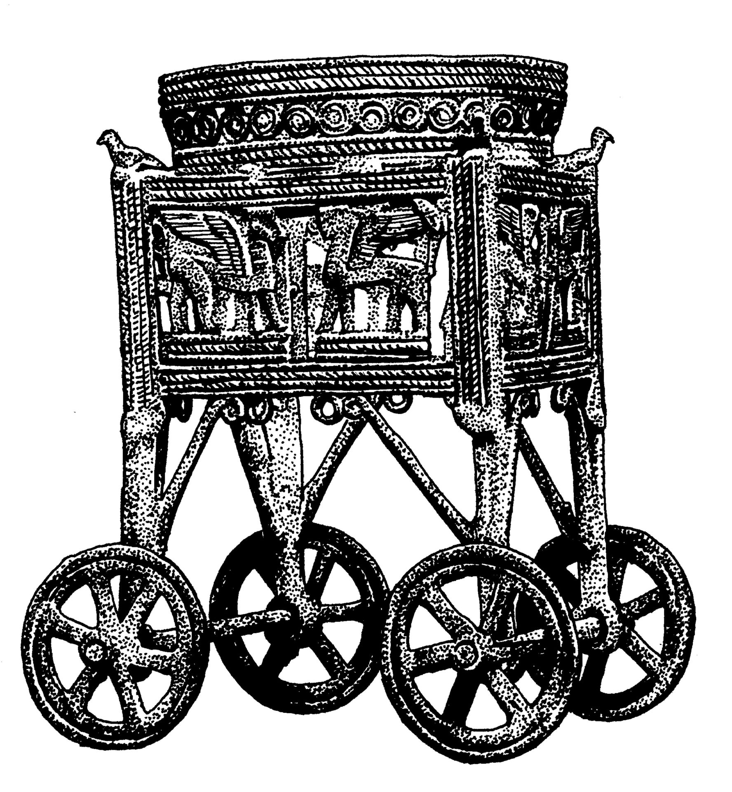

# Human-made Things in the Bible

## License Information

Human-made Things in the Bible © United Bible Societies, 2025. Adapted from: <cite>The Works of Their Hands: Man-made Things in the Bible</cite>, by Ray Pritz © 2009 United Bible Societies. This work is licensed under Creative Commons Attribution-ShareAlike 4.0 International (<a href="https://creativecommons.org/licenses/by-sa/4.0/">https://creativecommons.org/licenses/by-sa/4.0/</a>).

--------------------------------

## 標題：聖殿：可移動的座、盆座（Temple: movable stand, cart, stand, base） (id: REALIA:4.3.3)

4\.3\.3 標題：聖殿：可移動的座、盆座（Temple: movable stand, cart, stand, base）
================================================================

經文出處
----

### **帶輪子的箱子** ：

Hebrew 來： מְכוֹנָה (音譯： mkonah)

[1KI 7:38](https://ref.ly/1Kgs7:38), [1KI 7:39](https://ref.ly/1Kgs7:39), [1KI 7:43](https://ref.ly/1Kgs7:43), [1KI 7:43](https://ref.ly/1Kgs7:43), [2KI 16:17](https://ref.ly/2Kgs16:17), [2KI 25:13](https://ref.ly/2Kgs25:13), [2CH 4:14](https://ref.ly/2Chr4:14), [2CH 4:14](https://ref.ly/2Chr4:14), [JER 27:19](https://ref.ly/Jer27:19), [JER 52:17](https://ref.ly/Jer52:17), [JER 52:20](https://ref.ly/Jer52:20)

經文出處
----

### **盛水的容器** ：

Hebrew 來： כִּיּוֹר (音譯： kiyor)

[1KI 7:30](https://ref.ly/1Kgs7:30), [1KI 7:38](https://ref.ly/1Kgs7:38), [1KI 7:38](https://ref.ly/1Kgs7:38), [1KI 7:38](https://ref.ly/1Kgs7:38), [1KI 7:38](https://ref.ly/1Kgs7:38), [1KI 7:40](https://ref.ly/1Kgs7:40), [1KI 7:43](https://ref.ly/1Kgs7:43), [2KI 16:17](https://ref.ly/2Kgs16:17), [2CH 4:6](https://ref.ly/2Chr4:6), [2CH 4:14](https://ref.ly/2Chr4:14)

描述和用途
-----

*洗濯盆的活動支架 (© Deutsche Bibelgesellschaft, Stuttgart by United Bible Societies)*

[1KI 7:27–1KI 7:39](https://ref.ly/1Kgs7:27-1Kgs7:39) 詳細描述了可移動的盆座。這是一個長約2米（6\.5英呎），寬2米（6\.5英呎），深1\.5米（5英呎）的箱子。側面是銅板，裝飾著各種動物的圖案。箱子放在四個輪子上，箱的四角與輪軸相連。輪子的直徑約65厘米（25英吋）。箱子頂部的角是四個把手，因此這是一種帶裝飾的大推車。

箱子的頂部是敞開的，內側的上部襯有一個圓形的長條或襯套，裡面放著一個圓形的銅製容器。這個容器的形狀可能像碗或盆，或者更有可能像一個逐漸變細變尖的圓錐。根據[2CH 4:6](https://ref.ly/2Chr4:6) 的描述，容器中盛有水，用來清洗將被焚燒為祭的祭牲（參[LEV 1:9](https://ref.ly/Lev1:9) ，[LEV 1:13](https://ref.ly/Lev1:13) ）。考慮到這輛推車的大小，青銅材質，而且裡面裝有大量的水（約800升或200加侖），即使有輪子也會很難移動。估計每個盆座在裝滿水的時候有2—3噸重。

---

翻譯
--

**帶輪子的箱子** ：對於希伯來文*mkonah* ，有些譯本將其譯作一個通常靜止不動的物件（KJV (King James Version (1611)) 和SPCL (Spanish Common Language Version (Dios Habla Hoy)) 譯作“base”「座」；RSV (Revised Standard Version (1952)) 譯作“stand”「架子」），還有些譯本將其譯作一個通常移動的物件（GNT (Good News Translation (1992)) 和FRCL (French Common Language Version (Bible en français courant)) 譯作“cart”「小車」；REB (Revised English Bible (1989)) 譯作“trolley”「手推車」）。也許NIV (New International Version (1984)) 和CEV (Contemporary English Version) 的“movable stand”（「可移動支架」）比上述詞語都更加合適，這個短語表示物件通常放在一個固定位置，但設計成在必要時可以移動。[1KI 7:39](https://ref.ly/1Kgs7:39) 可能表示十個架子或小車的位置是固定的。

**盛水的容器** ：在上文所列的經文中，我們查閱的大多數譯本都將希伯來文*kiyor* 譯作「盆」（“basin”；如GNT (Good News Translation (1992)) 、NIV (New International Version (1984)) ）。或許更好的譯法是「大桶」或「大缸」（“vat”；TOB (Traduction Oecuménique de la Bible (French, 1975)) ）。雖然*kiyor* 一詞也用來指帳幕中的洗濯盆，但在聖殿裡，這個詞所指的物件的結構卻大不相同。

如上所述，[1KI 7:27–1KI 7:39](https://ref.ly/1Kgs7:27-1Kgs7:39) 詳細地描述了可移動盆座的結構，還提到其他幾個配件。這些配件包括構成箱壁的長方形或正方形鑲板（希伯來文*misgaroth* ），固定鑲板的框架（*shlabim* ），帶輻條的輪子（*’ofanim* ；參[8\.3 輪、車輪 (wheel)\<REALIA:8\.3\>](#) ），輪軸（*sarnim* 或*yadoth* ），以及水盆四角的支撐物（*yadoth* 或*kthefoth*)。盆座頂部的圓形開口（*‘agol* ）裝飾著「雕刻的圖案」（“carvings”，GNT (Good News Translation (1992)) ；NASB (New American Standard Bible) 譯作“engravings”「雕刻」；*miqla‘oth* ），底部飾有或刻有狀似「花環」的東西（“wreaths”，*loyoth* ；GNT (Good News Translation (1992)) 譯作“spiral figures”「螺旋圖案」）。盛水的容器放在一個襯環（*kothereth* ，字面意為「王冠」）裡。參《〈列王紀上下〉手冊》（*A Handbook on 1–2 Kings* ）關於這些經文的討論。

* **Associated Passages:** 列王紀上 7:38; 列王紀上 7:39; 列王紀上 7:43; 列王紀下 16:17; 列王紀下 25:13; 歷代志下 4:14; 耶利米書 27:19; 耶利米書 52:17; 耶利米書 52:20; 列王紀上 7:30; 列王紀上 7:40; 歷代志下 4:6; 列王紀上 7:27; 利未記 1:9; 利未記 1:13

