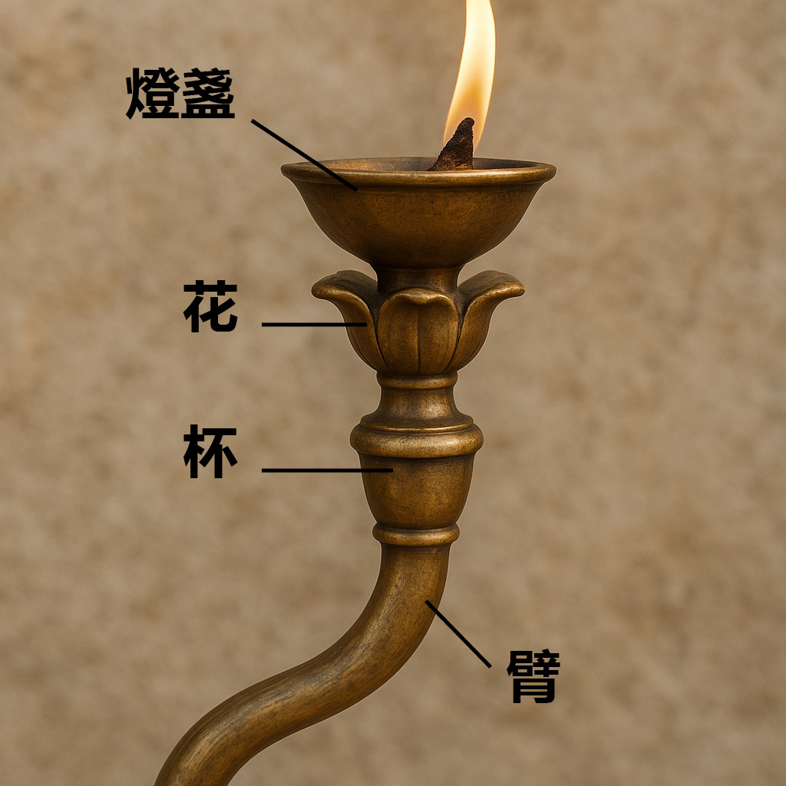

# Human-made Things in the Bible

## License Information

Human-made Things in the Bible © United Bible Societies, 2025. Adapted from: <cite>The Works of Their Hands: Man-made Things in the Bible</cite>, by Ray Pritz © 2009 United Bible Societies. This work is licensed under Creative Commons Attribution-ShareAlike 4.0 International (<a href="https://creativecommons.org/licenses/by-sa/4.0/">https://creativecommons.org/licenses/by-sa/4.0/</a>).

--------------------------------

## 標題：燈臺（lampstand, menorah） (id: REALIA:4.3.4)

4\.3\.4 標題：燈臺（lampstand, menorah）
=================================

經文出處
----

Hebrew 來： מְנוֹרָה (音譯： mnorah)

[EXO 25:31](https://ref.ly/Exod25:31), [EXO 25:31](https://ref.ly/Exod25:31), [EXO 25:32](https://ref.ly/Exod25:32), [EXO 25:32](https://ref.ly/Exod25:32), [EXO 25:33](https://ref.ly/Exod25:33), [EXO 25:34](https://ref.ly/Exod25:34), [EXO 25:35](https://ref.ly/Exod25:35), [EXO 26:35](https://ref.ly/Exod26:35), [EXO 30:27](https://ref.ly/Exod30:27), [EXO 31:8](https://ref.ly/Exod31:8), [EXO 35:14](https://ref.ly/Exod35:14), [EXO 37:17](https://ref.ly/Exod37:17), [EXO 37:17](https://ref.ly/Exod37:17), [EXO 37:18](https://ref.ly/Exod37:18), [EXO 37:18](https://ref.ly/Exod37:18), [EXO 37:19](https://ref.ly/Exod37:19), [EXO 37:20](https://ref.ly/Exod37:20), [EXO 39:37](https://ref.ly/Exod39:37), [EXO 40:4](https://ref.ly/Exod40:4), [EXO 40:24](https://ref.ly/Exod40:24), [LEV 24:4](https://ref.ly/Lev24:4), [NUM 3:31](https://ref.ly/Num3:31), [NUM 4:9](https://ref.ly/Num4:9), [NUM 8:2](https://ref.ly/Num8:2), [NUM 8:3](https://ref.ly/Num8:3), [NUM 8:4](https://ref.ly/Num8:4), [NUM 8:4](https://ref.ly/Num8:4), [1KI 7:49](https://ref.ly/1Kgs7:49), [2KI 4:10](https://ref.ly/2Kgs4:10), [1CH 28:15](https://ref.ly/1Chr28:15), [1CH 28:15](https://ref.ly/1Chr28:15), [1CH 28:15](https://ref.ly/1Chr28:15), [1CH 28:15](https://ref.ly/1Chr28:15), [1CH 28:15](https://ref.ly/1Chr28:15), [1CH 28:15](https://ref.ly/1Chr28:15), [1CH 28:15](https://ref.ly/1Chr28:15), [2CH 4:7](https://ref.ly/2Chr4:7), [2CH 4:20](https://ref.ly/2Chr4:20), [2CH 13:11](https://ref.ly/2Chr13:11), [JER 52:19](https://ref.ly/Jer52:19), [ZEC 4:2](https://ref.ly/Zech4:2), [ZEC 4:11](https://ref.ly/Zech4:11)

Greek 希： λυχνία (音譯： luchnia)

[HEB 9:2](https://ref.ly/Heb9:2), [SIR 26:17](https://ref.ly/Sir26:17), [1MA 1:21](https://ref.ly/1Macc1:21), [1MA 4:49](https://ref.ly/1Macc4:49), [1MA 4:50](https://ref.ly/1Macc4:50)

Latin 拉： candelabrum

[2ES 10:22](https://ref.ly/2Esd10:22)

描述
--

*燈臺的枝子 (Image generated by ChatGPT using OpenAI technology)*

關於帳幕內燈臺的構造，見[EXO 25:31–EXO 25:40](https://ref.ly/Exod25:31-Exod25:40); [EXO 37:17–EXO 37:24](https://ref.ly/Exod37:17-Exod37:24) ；[LEV 24:1–LEV 24:4](https://ref.ly/Lev24:1-Lev24:4) 。燈臺是用一塊純金錘出來的，由五個部分組成：座、幹（或花梗），以及帶有花萼和花瓣的（花）杯。燈臺中心有一個幹，立在座上，從幹兩旁伸出六個枝子，共為七枝。每個枝子頂部都有一盞油燈。

按照上帝的指示，帳幕裡面只有一個燈臺。然而，在所羅門建造和裝飾聖殿時，經文（ [1KI 7:49](https://ref.ly/1Kgs7:49) ；[2CH 4:7](https://ref.ly/2Chr4:7) ）說他設立了十個燈臺。文中沒有解釋為什麼燈臺增加到十個。所羅門又造了十張桌子和十個盆放在殿內，而在帳幕裡這些物品都只有一件。根據一個猶太傳統的說法，十個燈臺是在那個指定的燈臺之外另加的，而「在右邊」和「在左邊」是指擺在唯一神聖燈臺的右邊和左邊。經文沒有說明所羅門時期的燈臺樣式發生任何變化，他所做的十個燈臺可能看起來和帳幕裡的那個燈臺是一樣的。

關於油燈的基本使用方式，參[5\.1 油燈和燈心 (Oil lamp and wick)\<REALIA:5\.1\>](#) 和[5\.2 燈臺 (lampstand)\<REALIA:5\.2\>](#) 。

---

翻譯
--

由於許多文化中沒有專門表示「燈臺」的詞語，因此「燈臺」可能要翻譯成「燈座」或「放燈的東西」。應該強調的是，這個物件上面放置的不是蠟燭而是油燈（參[5\.1 油燈和燈心 (Oil lamp and wick)\<REALIA:5\.1\>](#) ）。

燈臺（希伯來文*mnorah* ）大體上是用花的結構來描述的。翻譯者了解這一點，就能找出合適的術語來翻譯燈臺的各部分。似花的部分包括「幹」（「花梗」）、「花蕾」或「花萼」，以及類似開放的花朵的「杯」。ITCL (Italian Common Language Version) 提供了以下腳註：「希伯來文本使用的術語很難解釋，學者認為燈臺的裝飾式樣取自植物和花卉。」

*利未人在聖殿中點燃七枝燈臺 (Image generated by ChatGPT using OpenAI technology)*

[EXO 25:31](https://ref.ly/Exod25:31) 列出了燈臺的各部分，但CEV (Contemporary English Version) 只概括性地翻譯，英文意為：「整個燈臺，包括裝飾的花，要用一塊金子錘出來。」GECL (German Common Language Version (Gute Nachricht Bibel)) 的翻譯更加凝練，意為：「燈臺所有的部分都要由一塊［金子］做成。」對於這節經文，有些譯本可能會採用這種譯法，不過在後面的經文中，燈臺的各個部分仍然需要翻譯出來。

[LEV 24:4](https://ref.ly/Lev24:4) ：這節經文的希伯來文本字面意思是「純淨的燈臺」（NJB (New Jerusalem Bible (1985)) 、NJPSV (New Jewish Publication Society Version) 同），這可能是指燈臺的神聖或禮儀上的潔淨，而不是指燈臺是用金子製成。例如，NEB (New English Bible (1970)) 英文意為「禮儀上潔淨的燈臺」。但大多數版本（如NIV (New International Version (1984)) ）都將其解作「純金的燈臺」。如果遵循「純金」的解釋，這裡「純淨」的概念可能要表達為「不含其他物質」或「純粹由金子做成」。有些語言可能需要借用表示「金子」的詞語，如果是這樣，翻譯者應在術語簡釋中作出解釋。

燈臺的各個部分由下到上依次是：

\|*Yarek* （[EXO 25:31](https://ref.ly/Exod25:31) ，[EXO 37:17](https://ref.ly/Exod37:17) ；[NUM 8:4](https://ref.ly/Num8:4) ）：這個希伯來文詞語指承載整個燈臺的「座」或「腳」。在[NUM 8:4](https://ref.ly/Num8:4) ，字面意為「從座到花」（RSV (Revised Standard Version (1952)) 同）的希伯來文短語可譯作「從頂到底」（如GNT (Good News Translation (1992)) ）。

*Qaneh* （[EXO 25:0](https://ref.ly/Exod25:0) ，12次；[EXO 37:0](https://ref.ly/Exod37:0) ，12次）：這個希伯來文詞語的字面意為「蘆葦」，在[EXO 25:0](https://ref.ly/Exod25:0) 和[EXO 37:0](https://ref.ly/Exod37:0) ，它表示長而直的花梗。從燈臺中心的梗伸出六支這樣的梗，每邊三支對稱，因此共為七支。GECL (German Common Language Version (Gute Nachricht Bibel)) 捨棄了花的比喻，稱其為「臂」。在多枝燭臺為人所知的地方，這種譯法是很自然的，但是如果人們不知道這種物件，「臂」聽起來可能會很奇怪。

*Gavi‘a* （[EXO 25:31](https://ref.ly/Exod25:31) ，[EXO 25:33](https://ref.ly/Exod25:33); [EXO 25:34](https://ref.ly/Exod25:34) ，[EXO 37:17](https://ref.ly/Exod37:17) ，[EXO 37:19](https://ref.ly/Exod37:19); [EXO 37:20](https://ref.ly/Exod37:20) ）：這個希伯來文詞語指燈臺七個枝子頂端的杯。這七個杯裡放著橄欖油和燈心，點燃後可以發光。杯的形狀顯然像是開放的花朵。NCV (New Century Version) 譯作“flower\-like cups”（「花狀的杯」；NIV (New International Version (1984)) 類似）。REB (Revised English Bible (1989)) 僅譯作“cups”（「杯」），而GNT (Good News Translation (1992)) 譯作“decorative flowers”（「裝飾性的花朵」）。

*Kaftor* （[EXO 25:0](https://ref.ly/Exod25:0) ，8次；[EXO 37:0](https://ref.ly/Exod37:0) ，8次）：這個希伯文詞語也用來指柱子的「柱頂」（“capital”；如RSV (Revised Standard Version (1952)) 在[AMO 9:1](https://ref.ly/Amos9:1) 的譯文；參[3\.5 柱子、柱頂 (column, pillar, capital)\<REALIA:3\.5\>](#) ）。在這裡，這個詞似乎表示一種球狀疙瘩，一種球形或蛋形的鼓起，位於三對枝子的連接處，以及花朵與幹的連接處。大多數譯本保留了花的比喻，將其譯作「花蕾」（“buds”；GNT (Good News Translation (1992)) 、NIV (New International Version (1984)) ）或「花萼」（“calyxes”；NRSV (New Revised Standard Version (1989)) 、NJPSV (New Jewish Publication Society Version) ）。

*Perach* （[EXO 25:0](https://ref.ly/Exod25:0) ，4次；[EXO 37:0](https://ref.ly/Exod37:0) ，4次；[NUM 8:4](https://ref.ly/Num8:4) ；[1KI 7:49](https://ref.ly/1Kgs7:49) ；[2CH 4:21](https://ref.ly/2Chr4:21) ）：這個希伯來文詞語意為「花」，或者更確切地說，是由開放的花瓣形成的「花頭」。燈臺的花形成了杯。雖然大多數譯本都保留了這個詞語的比喻性表達「花」，但表達方式各不相同。有些譯本作「花瓣」（“petals”；GNT (Good News Translation (1992)) 、NJPSV (New Jewish Publication Society Version) ），有些譯作「花」（“flowers”；RSV (Revised Standard Version (1952)) ）。

* **Associated Passages:** 出埃及記 25:31; 出埃及記 25:32; 出埃及記 25:33; 出埃及記 25:34; 出埃及記 25:35; 出埃及記 26:35; 出埃及記 30:27; 出埃及記 31:8; 出埃及記 35:14; 出埃及記 37:17; 出埃及記 37:18; 出埃及記 37:19; 出埃及記 37:20; 出埃及記 39:37; 出埃及記 40:4; 出埃及記 40:24; 利未記 24:4; 民數記 3:31; 民數記 4:9; 民數記 8:2; 民數記 8:3; 民數記 8:4; 列王紀上 7:49; 列王紀下 4:10; 歷代志上 28:15; 歷代志下 4:7; 歷代志下 4:20; 歷代志下 13:11; 耶利米書 52:19; 撒迦利亞書 4:2; 撒迦利亞書 4:11; 希伯來書 9:2; 德訓篇 26:17; 瑪加伯上 1:21; 瑪加伯上 4:49; 瑪加伯上 4:50; 厄斯德拉下 10:22; 出埃及記 25:40; 出埃及記 37:24; 利未記 24:1; 出埃及記 25:0; 出埃及記 37:0; 阿摩司書 9:1; 歷代志下 4:21

