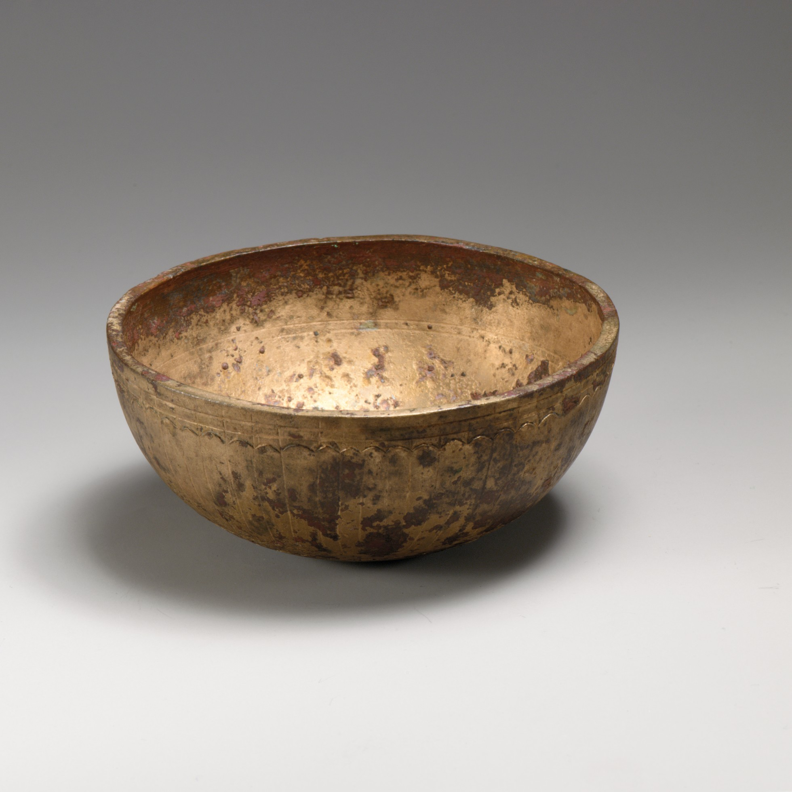

# Human-made Things in the Bible

## License Information

Human-made Things in the Bible © United Bible Societies, 2025. Adapted from: <cite>The Works of Their Hands: Man-made Things in the Bible</cite>, by Ray Pritz © 2009 United Bible Societies. This work is licensed under Creative Commons Attribution-ShareAlike 4.0 International (<a href="https://creativecommons.org/licenses/by-sa/4.0/">https://creativecommons.org/licenses/by-sa/4.0/</a>).

--------------------------------

## 標題：盆、碗（basin, bowl） (id: REALIA:4.4.4)

4\.4\.4 標題：盆、碗（basin, bowl）
===========================

經文出處
----

Hebrew 來： אַגָּן (音譯： ’agan)

[EXO 24:6](https://ref.ly/Exod24:6)

Hebrew 來： אֲגַרְטָל (音譯： ’agartal)

[EZR 1:9](https://ref.ly/Ezra1:9), [EZR 1:9](https://ref.ly/Ezra1:9)

Hebrew 來： כְּפוֹר (音譯： kfor)

[1CH 28:17](https://ref.ly/1Chr28:17), [1CH 28:17](https://ref.ly/1Chr28:17), [1CH 28:17](https://ref.ly/1Chr28:17), [1CH 28:17](https://ref.ly/1Chr28:17), [1CH 28:17](https://ref.ly/1Chr28:17), [1CH 28:17](https://ref.ly/1Chr28:17), [EZR 1:10](https://ref.ly/Ezra1:10), [EZR 1:10](https://ref.ly/Ezra1:10), [EZR 8:27](https://ref.ly/Ezra8:27)

Hebrew 來： מִזְרָק (音譯： mizraq)

[EXO 27:3](https://ref.ly/Exod27:3), [EXO 38:3](https://ref.ly/Exod38:3), [NUM 4:14](https://ref.ly/Num4:14), [NUM 7:13](https://ref.ly/Num7:13), [NUM 7:19](https://ref.ly/Num7:19), [NUM 7:25](https://ref.ly/Num7:25), [NUM 7:31](https://ref.ly/Num7:31), [NUM 7:37](https://ref.ly/Num7:37), [NUM 7:43](https://ref.ly/Num7:43), [NUM 7:49](https://ref.ly/Num7:49), [NUM 7:55](https://ref.ly/Num7:55), [NUM 7:61](https://ref.ly/Num7:61), [NUM 7:67](https://ref.ly/Num7:67), [NUM 7:73](https://ref.ly/Num7:73), [NUM 7:79](https://ref.ly/Num7:79), [NUM 7:84](https://ref.ly/Num7:84), [NUM 7:85](https://ref.ly/Num7:85), [1KI 7:40](https://ref.ly/1Kgs7:40), [1KI 7:45](https://ref.ly/1Kgs7:45), [1KI 7:50](https://ref.ly/1Kgs7:50), [2KI 12:14](https://ref.ly/2Kgs12:14), [2KI 25:15](https://ref.ly/2Kgs25:15), [1CH 28:17](https://ref.ly/1Chr28:17), [2CH 4:8](https://ref.ly/2Chr4:8), [2CH 4:11](https://ref.ly/2Chr4:11), [2CH 4:22](https://ref.ly/2Chr4:22), [NEH 7:69](https://ref.ly/Neh7:69), [JER 52:18](https://ref.ly/Jer52:18), [JER 52:19](https://ref.ly/Jer52:19), [AMO 6:6](https://ref.ly/Amos6:6), [ZEC 9:15](https://ref.ly/Zech9:15), [ZEC 14:20](https://ref.ly/Zech14:20)

Hebrew 來： מַחֲלָף (音譯： machalaf)

[EZR 1:9](https://ref.ly/Ezra1:9)

Hebrew 來： סַף (音譯： saf)

[1KI 7:50](https://ref.ly/1Kgs7:50), [2KI 12:14](https://ref.ly/2Kgs12:14), [JER 52:19](https://ref.ly/Jer52:19)

Greek 希： φιάλη (音譯： fialē)

[1MA 1:22](https://ref.ly/1Macc1:22), [1ES 2:10](https://ref.ly/1Esd2:10)

Greek 希： χρύσωμα (音譯： chrusōma)

[2MA 4:32](https://ref.ly/2Macc4:32), [2MA 4:39](https://ref.ly/2Macc4:39), [1ES 8:56](https://ref.ly/1Esd8:56)

描述和用途
-----

*青銅碗（希臘，公元前2–1世紀） (Metropolitan Museum of Art, CC0, via Wikimedia Commons)*

盆是一種凹面盤子，在以色列人的崇拜中有多種用途，如盛放用來彈灑的血或祭牲的某部分。形狀大概像一個大碗，或者帶把手的平底鍋或大罐子。聖經中提到的盆大多是金或銀做的，但也有些日常用的盆是銅做的（參[EXO 27:3](https://ref.ly/Exod27:3) 和[EXO 38:3](https://ref.ly/Exod38:3) ）。

---

翻譯
--

*祭司奉獻碗裡的血 (Image generated by ChatGPT using OpenAI technology)*

這種盆的用途是盛放液體，可以用來接祭牲的血，也可盛水洗掉祭壇上的血。盛放液體的器具眾所周知，因此翻譯者不難找到對等詞，但要注意所選的容器不應過大或過小。

希伯來文*’agartal* 只出現在[EZR 1:9](https://ref.ly/Ezra1:9) ，這個詞所指盤子的確切形狀不是重點，重點是這些盤子很大，而且很貴重。CEV (Contemporary English Version) 譯作“large ... dishes”（「大盤子」）；還有譯本譯作“basins”（「盆」；RSV (Revised Standard Version (1952)) ）或“bowls”（「碗」；GNT (Good News Translation (1992)) ）。在聖經中，同一節經文中的希伯來文*machalaf* 僅在這裡出現一次，意思不確定。各譯本將其譯成多種不同的工具，包括“knives”（「刀」；NRSV (New Revised Standard Version (1989)) ）、“bowls”（「碗」；GNT (Good News Translation (1992)) ）和“pans”（「鍋」；NIV (New International Version (1984)) ）。這個希伯來文詞語的詞根意為「變化」，很可能*machalaf* （可能元音不同）的意思僅僅是「其他容器」。建議採用類似REB (Revised English Bible (1989)) 的譯法，即「各種器皿」。

希伯來文詞語*saf* 和*mizraq* 同列在[1KI 7:50](https://ref.ly/1Kgs7:50) 中，兩者之間的區別不詳。比較一些譯本的譯法，即可看到這種不確定性：「杯……盆」（如RSV (Revised Standard Version (1952)) ）、「盆……灑血的碗」（如NJPSV (New Jewish Publication Society Version) 、NIV (New International Version (1984)) ）、「杯……灑血的小碗」（如CEV (Contemporary English Version) ）。《〈列王紀上下〉手冊》（*A Handbook on 1–2 Kings* ）指出，*saf* 比*mizraq* 更淺。然而，凱爾（Keil，第115頁）認為*saf* 是一種比較深的碗，而*mizraq* 是帶嘴的碗或罐。翻譯者應該選用兩個詞語，一個表示淺盤子，另一個表示深盤子。

* **Associated Passages:** 出埃及記 24:6; 以斯拉記 1:9; 歷代志上 28:17; 以斯拉記 1:10; 以斯拉記 8:27; 出埃及記 27:3; 出埃及記 38:3; 民數記 4:14; 民數記 7:13; 民數記 7:19; 民數記 7:25; 民數記 7:31; 民數記 7:37; 民數記 7:43; 民數記 7:49; 民數記 7:55; 民數記 7:61; 民數記 7:67; 民數記 7:73; 民數記 7:79; 民數記 7:84; 民數記 7:85; 列王紀上 7:40; 列王紀上 7:45; 列王紀上 7:50; 列王紀下 12:14; 列王紀下 25:15; 歷代志下 4:8; 歷代志下 4:11; 歷代志下 4:22; 尼希米記 7:69; 耶利米書 52:18; 耶利米書 52:19; 阿摩司書 6:6; 撒迦利亞書 9:15; 撒迦利亞書 14:20; 瑪加伯上 1:22; 厄斯德拉上 2:10; 瑪加伯下 4:32; 瑪加伯下 4:39; 厄斯德拉上 8:56

