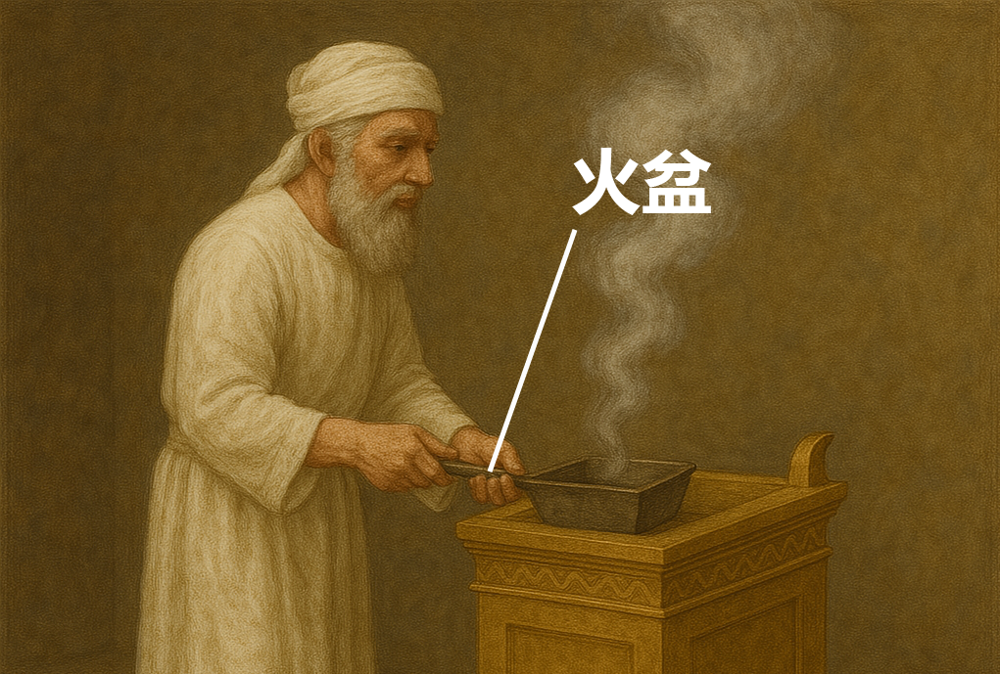

# Human-made Things in the Bible

## License Information

Human-made Things in the Bible © United Bible Societies, 2025. Adapted from: <cite>The Works of Their Hands: Man-made Things in the Bible</cite>, by Ray Pritz © 2009 United Bible Societies. This work is licensed under Creative Commons Attribution-ShareAlike 4.0 International (<a href="https://creativecommons.org/licenses/by-sa/4.0/">https://creativecommons.org/licenses/by-sa/4.0/</a>).

--------------------------------

## 標題：小鏟子、火盆（small shovel, firepan） (id: REALIA:4.4.5)

4\.4\.5 標題：小鏟子、火盆（small shovel, firepan）
========================================

經文出處
----

Hebrew 來： מַחְתָּה (音譯： machtah)

[EXO 25:38](https://ref.ly/Exod25:38), [EXO 27:3](https://ref.ly/Exod27:3), [EXO 37:23](https://ref.ly/Exod37:23), [EXO 38:3](https://ref.ly/Exod38:3), [LEV 10:1](https://ref.ly/Lev10:1), [LEV 16:12](https://ref.ly/Lev16:12), [NUM 4:9](https://ref.ly/Num4:9), [NUM 4:14](https://ref.ly/Num4:14), [NUM 16:6](https://ref.ly/Num16:6), [NUM 16:17](https://ref.ly/Num16:17), [NUM 16:17](https://ref.ly/Num16:17), [NUM 16:17](https://ref.ly/Num16:17), [NUM 16:17](https://ref.ly/Num16:17), [NUM 16:18](https://ref.ly/Num16:18), [NUM 17:4](https://ref.ly/Num17:4), [NUM 17:11](https://ref.ly/Num17:11), [1KI 7:50](https://ref.ly/1Kgs7:50), [2KI 25:15](https://ref.ly/2Kgs25:15), [2CH 4:22](https://ref.ly/2Chr4:22), [JER 52:19](https://ref.ly/Jer52:19)

描述和用途
-----

*使用火盆 (Image generated by ChatGPT using OpenAI technology)*

火盆用來移動或翻動祭壇上的火炭，以及把火炭移到香壇上作其他用途（參[4\.2\.4 香壇 (incense altar)\<REALIA:4\.2\.4\>](#) ）。

---

翻譯
--

有學者提出，希伯來文*machtah* 也指一種特殊的容器，在清潔祭壇或搬运帳幕時用來盛聖火。因此，這是一種「貯火器」，翻譯者也可將其表述為「帶走或裝著餘燼的容器」。

在上文所列的一些參考經文中，*machtah* 一詞與燒香相關聯（[NUM 16:17](https://ref.ly/Num16:17); [NUM 16:18](https://ref.ly/Num16:18) ）。如果目標語言有表示「香爐」的特定詞語，這個詞就可以用在這些經文裡，但要注意避免讓人想到現代的香爐。另外，翻譯者也可以使用一個意指「火盆」的比較寬泛的詞語，因為在上文所列的大多數參考經文中，*machtah* 似乎指一種器具，用來把炭火移到另一個地方，並且有時會把香放在炭火上面。另參[4\.2\.4 香壇 (incense altar)\<REALIA:4\.2\.4\>](#) 和[4\.4\.7 香爐(censer)\<REALIA:4\.4\.7\>](#) 。

*青銅火盆或香鏟（羅馬，公元1世紀晚期至2世紀早期） (Metropolitan Museum of Art, CC0, MMA)*

在[EXO 25:38](https://ref.ly/Exod25:38); [EXO 37:23](https://ref.ly/Exod37:23) 和[NUM 4:9](https://ref.ly/Num4:9) 中，*machtah* 與燈臺相關聯（參[4\.3\.4 燈臺 (lampstand, menorah)\<REALIA:4\.3\.4\>](#) ），有些譯本仍然將其譯作「火盆」（“firepans”；REB (Revised English Bible (1989)) 、NJPSV (New Jewish Publication Society Version) ），然而也有譯本譯作「托盤」（“trays”；RSV (Revised Standard Version (1952)) 、GNT (Good News Translation (1992)) 、NIV (New International Version (1984)) ）。無論哪種譯法，*machtah* 對於燈臺有何用處並不清楚。這裡描述和繪出的物品可能有多種用途。

* **Associated Passages:** 出埃及記 25:38; 出埃及記 27:3; 出埃及記 37:23; 出埃及記 38:3; 利未記 10:1; 利未記 16:12; 民數記 4:9; 民數記 4:14; 民數記 16:6; 民數記 16:17; 民數記 16:18; 民數記 17:4; 民數記 17:11; 列王紀上 7:50; 列王紀下 25:15; 歷代志下 4:22; 耶利米書 52:19

