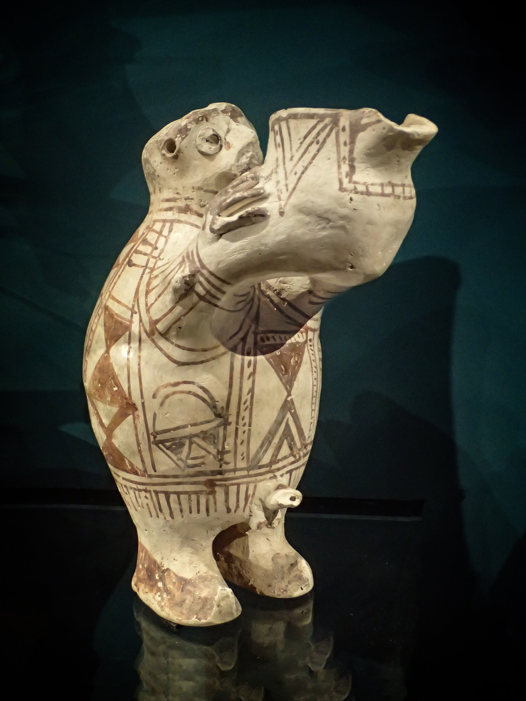

# Human-made Things in the Bible

## License Information

Human-made Things in the Bible © United Bible Societies, 2025. Adapted from: <cite>The Works of Their Hands: Man-made Things in the Bible</cite>, by Ray Pritz © 2009 United Bible Societies. This work is licensed under Creative Commons Attribution-ShareAlike 4.0 International (<a href="https://creativecommons.org/licenses/by-sa/4.0/">https://creativecommons.org/licenses/by-sa/4.0/</a>).

--------------------------------

## 標題：澆酒祭的壺（jar for the wine offering, libation vessel） (id: REALIA:4.4.10)

4\.4\.10 標題：澆酒祭的壺（jar for the wine offering, libation vessel）
=============================================================

經文出處
----

Hebrew 來： מְנַקִּית (音譯： mnaqith)

[EXO 25:29](https://ref.ly/Exod25:29), [EXO 37:16](https://ref.ly/Exod37:16), [NUM 4:7](https://ref.ly/Num4:7), [JER 52:19](https://ref.ly/Jer52:19)

Hebrew 來： קַשְׂוָה (音譯： qaswah)

[EXO 25:29](https://ref.ly/Exod25:29), [EXO 37:16](https://ref.ly/Exod37:16), [NUM 4:7](https://ref.ly/Num4:7), [1CH 28:17](https://ref.ly/1Chr28:17)

描述和用途
-----

*捧著奠酒瓶的陶瓷像 (© Mary Harrsch from Springfield, Oregon, USA, CC BY 2\.0, via Wikimedia Commons)*

在帳幕和聖殿裡獻上的澆酒祭，是把酒倒出來作為供物獻給上帝。澆酒祭要用到兩個容器，酒從一個容器倒進另一個容器。兩個容器都放在擺設供餅的桌子上（參[4\.3\.5 擺放供餅的桌子 (table for consecrated bread)\<REALIA:4\.3\.5\>](#) ），而且總是與這張桌子一同提到。第一個容器是一種壺或罐子（希伯來文*qaswah* ），第二個容器是一個小碗（希伯來文*mnaqith* ）。這兩件器具都是金子做的。

---

翻譯
--

[EXO 25:29](https://ref.ly/Exod25:29); [EXO 37:16](https://ref.ly/Exod37:16); [NUM 4:7](https://ref.ly/Num4:7) ：在這些經文中，希伯來文*mnaqith* 和*qaswah* 與一個動詞同時出現，這個動詞通常是「倒出來作為澆酒祭」的意思。根據猶太人的傳統，這個動詞還有另一種意思；按照這種意思，*mnaqith* 和*qaswah* 被解釋為遮蓋和保護供餅所用框架的一部分。在[EXO 25:29](https://ref.ly/Exod25:29) b中，RSV (Revised Standard Version (1952)) 英文意為「用來澆酒的壺和碗」，然而按照上述第二種意思，這句話也可以譯成「用來遮蓋它們的杆和邊框」；但是，我們查閱的所有譯本（包括NJPSV (New Jewish Publication Society Version) ）都沒有採納這種譯法。

* **Associated Passages:** 出埃及記 25:29; 出埃及記 37:16; 民數記 4:7; 耶利米書 52:19; 歷代志上 28:17

