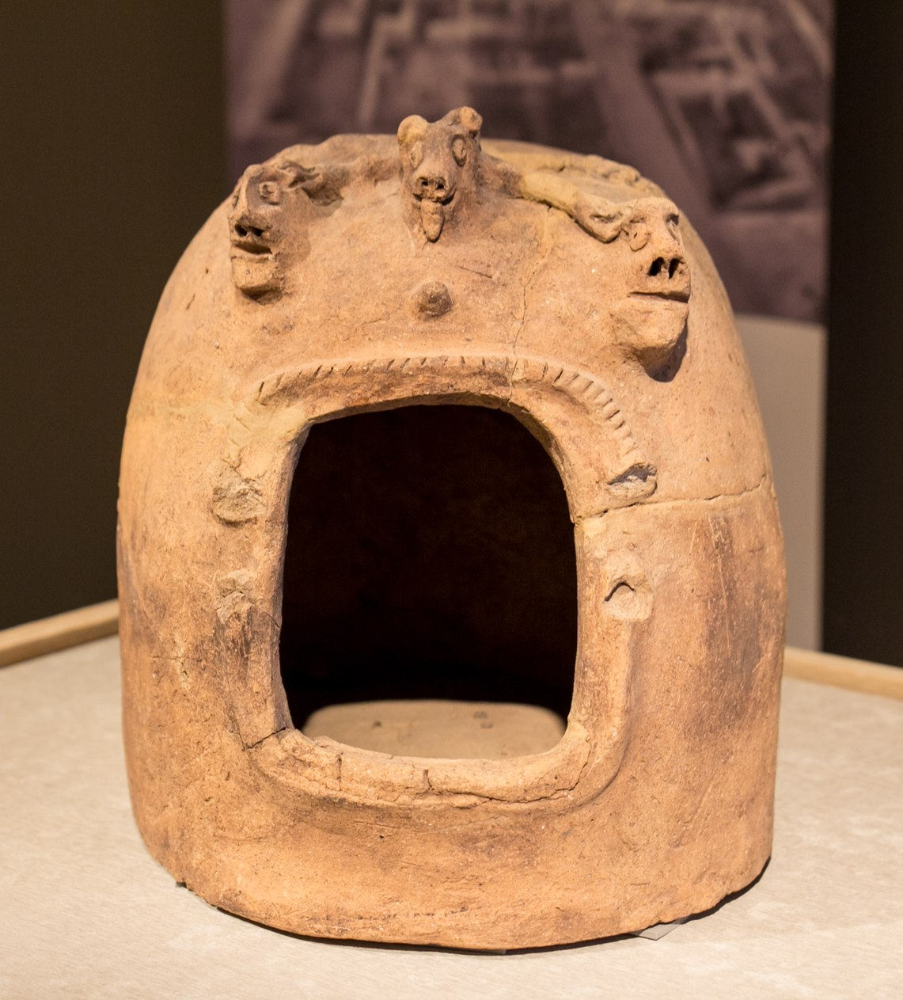

# Human-made Things in the Bible

## License Information

Human-made Things in the Bible © United Bible Societies, 2025. Adapted from: <cite>The Works of Their Hands: Man-made Things in the Bible</cite>, by Ray Pritz © 2009 United Bible Societies. This work is licensed under Creative Commons Attribution-ShareAlike 4.0 International (<a href="https://creativecommons.org/licenses/by-sa/4.0/">https://creativecommons.org/licenses/by-sa/4.0/</a>).

--------------------------------

## 標題：神龕（shrine model） (id: REALIA:4.6.7)

4\.6\.7 標題：神龕（shrine model）
===========================

經文出處
----

Greek 希： ναός (音譯： naos)

[ACT 19:24](https://ref.ly/Acts19:24)

描述
--

*黏土神龕模型 (© Oren Rozen, CC BY\-SA 4\.0, via Wikimedia Commons)*

神龕是廟宇或神殿的小型複製品或模型。有些人可能對神龕懷有特殊的崇敬之情，但《使徒行傳》中提到的神龕主要是紀念品。

---

翻譯
--

有些語言將[ACT 19:24](https://ref.ly/Acts19:24) 中的希臘文*naos* 譯作「微型神廟」或「神廟紀念品」。這類經文通常是使用描述性短語的好地方。希伯來文短語的字面意為「銀製亞底米神廟」，GNT (Good News Translation (1992)) 和CEV (Contemporary English Version) 的英文意為「亞底米女神廟宇的銀製模型」，NCV (New Century Version) 意為「外形像亞底米女神廟宇的銀製小模型」，SPCL (Spanish Common Language Version (Dios Habla Hoy)) 意為「代表亞底米神廟的小銀像……」。

* **Associated Passages:** 使徒行傳 19:24

