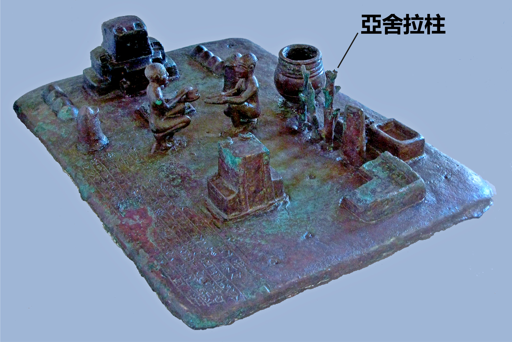

# Human-made Things in the Bible

## License Information

Human-made Things in the Bible © United Bible Societies, 2025. Adapted from: <cite>The Works of Their Hands: Man-made Things in the Bible</cite>, by Ray Pritz © 2009 United Bible Societies. This work is licensed under Creative Commons Attribution-ShareAlike 4.0 International (<a href="https://creativecommons.org/licenses/by-sa/4.0/">https://creativecommons.org/licenses/by-sa/4.0/</a>).

--------------------------------

## 標題：偶像（idols） (id: REALIA:4.6)

4\.6 標題：偶像（idols）
=================

經文出處
----

Hebrew 來： אֱלִיל (音譯： ’elil)

[LEV 19:4](https://ref.ly/Lev19:4), [LEV 26:1](https://ref.ly/Lev26:1), [1CH 16:26](https://ref.ly/1Chr16:26), [PSA 96:5](https://ref.ly/Ps96:5), [PSA 97:7](https://ref.ly/Ps97:7), [ISA 2:8](https://ref.ly/Isa2:8), [ISA 2:18](https://ref.ly/Isa2:18), [ISA 2:20](https://ref.ly/Isa2:20), [ISA 2:20](https://ref.ly/Isa2:20), [ISA 10:10](https://ref.ly/Isa10:10), [ISA 10:11](https://ref.ly/Isa10:11), [ISA 19:1](https://ref.ly/Isa19:1), [ISA 19:3](https://ref.ly/Isa19:3), [ISA 31:7](https://ref.ly/Isa31:7), [ISA 31:7](https://ref.ly/Isa31:7), [EZK 30:13](https://ref.ly/Ezek30:13), [HAB 2:18](https://ref.ly/Hab2:18)

Hebrew 來： גִּלּוּל (音譯： gilul)

[LEV 26:30](https://ref.ly/Lev26:30), [DEU 29:16](https://ref.ly/Deut29:16), [1KI 15:12](https://ref.ly/1Kgs15:12), [1KI 21:26](https://ref.ly/1Kgs21:26), [2KI 17:12](https://ref.ly/2Kgs17:12), [2KI 21:11](https://ref.ly/2Kgs21:11), [2KI 21:21](https://ref.ly/2Kgs21:21), [2KI 23:24](https://ref.ly/2Kgs23:24), [JER 50:2](https://ref.ly/Jer50:2), [EZK 6:4](https://ref.ly/Ezek6:4), [EZK 6:5](https://ref.ly/Ezek6:5), [EZK 6:6](https://ref.ly/Ezek6:6), [EZK 6:9](https://ref.ly/Ezek6:9), [EZK 6:13](https://ref.ly/Ezek6:13), [EZK 6:13](https://ref.ly/Ezek6:13), [EZK 8:10](https://ref.ly/Ezek8:10), [EZK 14:3](https://ref.ly/Ezek14:3), [EZK 14:4](https://ref.ly/Ezek14:4), [EZK 14:4](https://ref.ly/Ezek14:4), [EZK 14:5](https://ref.ly/Ezek14:5), [EZK 14:6](https://ref.ly/Ezek14:6), [EZK 14:7](https://ref.ly/Ezek14:7), [EZK 16:36](https://ref.ly/Ezek16:36), [EZK 18:6](https://ref.ly/Ezek18:6), [EZK 18:12](https://ref.ly/Ezek18:12), [EZK 18:15](https://ref.ly/Ezek18:15), [EZK 20:7](https://ref.ly/Ezek20:7), [EZK 20:8](https://ref.ly/Ezek20:8), [EZK 20:16](https://ref.ly/Ezek20:16), [EZK 20:18](https://ref.ly/Ezek20:18), [EZK 20:24](https://ref.ly/Ezek20:24), [EZK 20:31](https://ref.ly/Ezek20:31), [EZK 20:39](https://ref.ly/Ezek20:39), [EZK 20:39](https://ref.ly/Ezek20:39), [EZK 22:3](https://ref.ly/Ezek22:3), [EZK 22:4](https://ref.ly/Ezek22:4), [EZK 23:7](https://ref.ly/Ezek23:7), [EZK 23:30](https://ref.ly/Ezek23:30), [EZK 23:37](https://ref.ly/Ezek23:37), [EZK 23:39](https://ref.ly/Ezek23:39), [EZK 23:49](https://ref.ly/Ezek23:49), [EZK 30:13](https://ref.ly/Ezek30:13), [EZK 33:25](https://ref.ly/Ezek33:25), [EZK 36:18](https://ref.ly/Ezek36:18), [EZK 36:25](https://ref.ly/Ezek36:25), [EZK 37:23](https://ref.ly/Ezek37:23), [EZK 44:10](https://ref.ly/Ezek44:10), [EZK 44:12](https://ref.ly/Ezek44:12)

Hebrew 來： חַמָּן (音譯： chaman)

[LEV 26:30](https://ref.ly/Lev26:30), [2CH 14:4](https://ref.ly/2Chr14:4), [2CH 34:4](https://ref.ly/2Chr34:4), [2CH 34:7](https://ref.ly/2Chr34:7), [ISA 17:8](https://ref.ly/Isa17:8), [ISA 27:9](https://ref.ly/Isa27:9), [EZK 6:4](https://ref.ly/Ezek6:4), [EZK 6:6](https://ref.ly/Ezek6:6)

Hebrew 來： סֶמֶל (音譯： semel)

[2CH 33:7](https://ref.ly/2Chr33:7), [2CH 33:15](https://ref.ly/2Chr33:15), [EZK 8:3](https://ref.ly/Ezek8:3), [EZK 8:5](https://ref.ly/Ezek8:5)

Hebrew 來： צִיר (音譯： tsir)

[ISA 45:16](https://ref.ly/Isa45:16)

Hebrew 來： צֶלֶם (音譯： tselem)

[NUM 33:52](https://ref.ly/Num33:52), [2KI 11:18](https://ref.ly/2Kgs11:18), [2CH 23:17](https://ref.ly/2Chr23:17), [EZK 7:20](https://ref.ly/Ezek7:20), [EZK 16:17](https://ref.ly/Ezek16:17), [EZK 23:14](https://ref.ly/Ezek23:14), [AMO 5:26](https://ref.ly/Amos5:26)

Hebrew 來： תַבְנִית (音譯： tavnith)

[PSA 106:20](https://ref.ly/Ps106:20)

Greek 希： ἄγαλμα (音譯： agalma)

[2MA 2:2](https://ref.ly/2Macc2:2)

Greek 希： εἴδωλον (音譯： eidōlon)

[GEN 31:19](https://ref.ly/Gen31:19), [GEN 31:34](https://ref.ly/Gen31:34), [GEN 31:35](https://ref.ly/Gen31:35), [EXO 20:4](https://ref.ly/Exod20:4), [LEV 19:4](https://ref.ly/Lev19:4), [LEV 26:30](https://ref.ly/Lev26:30), [NUM 25:2](https://ref.ly/Num25:2), [NUM 25:2](https://ref.ly/Num25:2), [NUM 33:52](https://ref.ly/Num33:52), [DEU 5:8](https://ref.ly/Deut5:8), [DEU 29:16](https://ref.ly/Deut29:16), [DEU 32:21](https://ref.ly/Deut32:21), [1SA 31:9](https://ref.ly/1Sam31:9), [1KI 11:2](https://ref.ly/1Kgs11:2), [1KI 11:5](https://ref.ly/1Kgs11:5), [1KI 11:5](https://ref.ly/1Kgs11:5), [1KI 11:7](https://ref.ly/1Kgs11:7), [1KI 11:33](https://ref.ly/1Kgs11:33), [2KI 17:12](https://ref.ly/2Kgs17:12), [2KI 21:11](https://ref.ly/2Kgs21:11), [2KI 21:21](https://ref.ly/2Kgs21:21), [2KI 23:24](https://ref.ly/2Kgs23:24), [1CH 10:9](https://ref.ly/1Chr10:9), [1CH 16:26](https://ref.ly/1Chr16:26), [2CH 11:15](https://ref.ly/2Chr11:15), [2CH 14:4](https://ref.ly/2Chr14:4), [2CH 15:16](https://ref.ly/2Chr15:16), [2CH 17:3](https://ref.ly/2Chr17:3), [2CH 23:17](https://ref.ly/2Chr23:17), [2CH 24:18](https://ref.ly/2Chr24:18), [2CH 28:2](https://ref.ly/2Chr28:2), [2CH 33:22](https://ref.ly/2Chr33:22), [2CH 34:7](https://ref.ly/2Chr34:7), [2CH 35:19](https://ref.ly/2Chr35:19), [PSA 96:7](https://ref.ly/Ps96:7), [PSA 113:12](https://ref.ly/Ps113:12), [PSA 134:15](https://ref.ly/Ps134:15), [PSA 151:6](https://ref.ly/Ps151:6), [ISA 1:29](https://ref.ly/Isa1:29), [ISA 10:11](https://ref.ly/Isa10:11), [ISA 27:9](https://ref.ly/Isa27:9), [ISA 30:22](https://ref.ly/Isa30:22), [ISA 37:19](https://ref.ly/Isa37:19), [ISA 41:28](https://ref.ly/Isa41:28), [ISA 48:5](https://ref.ly/Isa48:5), [ISA 57:5](https://ref.ly/Isa57:5), [JER 9:13](https://ref.ly/Jer9:13), [JER 14:22](https://ref.ly/Jer14:22), [JER 16:19](https://ref.ly/Jer16:19), [EZK 6:4](https://ref.ly/Ezek6:4), [EZK 6:6](https://ref.ly/Ezek6:6), [EZK 6:13](https://ref.ly/Ezek6:13), [EZK 6:13](https://ref.ly/Ezek6:13), [EZK 8:10](https://ref.ly/Ezek8:10), [EZK 16:16](https://ref.ly/Ezek16:16), [EZK 18:12](https://ref.ly/Ezek18:12), [EZK 23:39](https://ref.ly/Ezek23:39), [EZK 36:17](https://ref.ly/Ezek36:17), [EZK 36:25](https://ref.ly/Ezek36:25), [EZK 37:23](https://ref.ly/Ezek37:23), [EZK 44:12](https://ref.ly/Ezek44:12), [HOS 4:17](https://ref.ly/Hos4:17), [HOS 8:4](https://ref.ly/Hos8:4), [HOS 13:2](https://ref.ly/Hos13:2), [HOS 14:9](https://ref.ly/Hos14:9), [MIC 1:7](https://ref.ly/Mic1:7), [HAB 2:18](https://ref.ly/Hab2:18), [ZEC 13:2](https://ref.ly/Zech13:2), [ACT 7:41](https://ref.ly/Acts7:41), [ACT 15:20](https://ref.ly/Acts15:20), [ROM 2:22](https://ref.ly/Rom2:22), [1CO 8:4](https://ref.ly/1Cor8:4), [1CO 8:7](https://ref.ly/1Cor8:7), [1CO 10:19](https://ref.ly/1Cor10:19), [1CO 12:2](https://ref.ly/1Cor12:2), [2CO 6:16](https://ref.ly/2Cor6:16), [1TH 1:9](https://ref.ly/1Thess1:9), [1JN 5:21](https://ref.ly/1John5:21), [REV 9:20](https://ref.ly/Rev9:20), [TOB 14:6](https://ref.ly/Tob14:6), [ESG 4:17](https://ref.ly/EsthGr4:17), [WIS 14:11](https://ref.ly/Wis14:11), [WIS 14:12](https://ref.ly/Wis14:12), [WIS 14:27](https://ref.ly/Wis14:27), [WIS 14:29](https://ref.ly/Wis14:29), [WIS 14:30](https://ref.ly/Wis14:30), [WIS 15:15](https://ref.ly/Wis15:15), [SIR 30:19](https://ref.ly/Sir30:19), [LJE 1:72](https://ref.ly/EpJer1:72), [BEL 1:3](https://ref.ly/Bel1:3), [BEL 1:5](https://ref.ly/Bel1:5), [1MA 1:43](https://ref.ly/1Macc1:43), [1MA 3:48](https://ref.ly/1Macc3:48), [1MA 13:47](https://ref.ly/1Macc13:47), [2MA 12:40](https://ref.ly/2Macc12:40), [3MA 4:16](https://ref.ly/3Macc4:16), [ODA 2:21](https://ref.ly/Odes2:21)

Greek 希： εἰκών (音譯： eikōn)

[ROM 1:23](https://ref.ly/Rom1:23), [REV 13:14](https://ref.ly/Rev13:14), [REV 13:15](https://ref.ly/Rev13:15), [REV 13:15](https://ref.ly/Rev13:15), [REV 13:15](https://ref.ly/Rev13:15), [REV 14:9](https://ref.ly/Rev14:9), [REV 14:11](https://ref.ly/Rev14:11), [REV 15:2](https://ref.ly/Rev15:2), [REV 16:2](https://ref.ly/Rev16:2), [REV 19:20](https://ref.ly/Rev19:20), [REV 20:4](https://ref.ly/Rev20:4), [WIS 13:13](https://ref.ly/Wis13:13), [WIS 13:16](https://ref.ly/Wis13:16), [WIS 14:15](https://ref.ly/Wis14:15), [WIS 14:17](https://ref.ly/Wis14:17), [WIS 15:5](https://ref.ly/Wis15:5)

Greek 希： κατείδωλος (音譯： kateidōlos)

[ACT 17:16](https://ref.ly/Acts17:16)

Greek 希： τύπος (音譯： tupos)

[ACT 7:43](https://ref.ly/Acts7:43)

Greek 希： χάραγμα (音譯： charagma)

[ACT 17:29](https://ref.ly/Acts17:29)

Latin 拉： idolum

[2ES 16:69](https://ref.ly/2Esd16:69)

經文出處
----

### **雕像、像** ：

Aramaic 蘭：צְלֵם (音譯： tselem)

[DAN 2:31](https://ref.ly/Dan2:31), [DAN 2:31](https://ref.ly/Dan2:31), [DAN 2:32](https://ref.ly/Dan2:32), [DAN 2:34](https://ref.ly/Dan2:34), [DAN 2:35](https://ref.ly/Dan2:35), [DAN 3:1](https://ref.ly/Dan3:1), [DAN 3:2](https://ref.ly/Dan3:2), [DAN 3:3](https://ref.ly/Dan3:3), [DAN 3:3](https://ref.ly/Dan3:3), [DAN 3:5](https://ref.ly/Dan3:5), [DAN 3:7](https://ref.ly/Dan3:7), [DAN 3:10](https://ref.ly/Dan3:10), [DAN 3:12](https://ref.ly/Dan3:12), [DAN 3:14](https://ref.ly/Dan3:14), [DAN 3:15](https://ref.ly/Dan3:15), [DAN 3:18](https://ref.ly/Dan3:18), [DAN 3:19](https://ref.ly/Dan3:19)

描述和用途
-----

*泥塑女神像 (Gary Todd, Israel Museum, CC0, via Wikimedia Commons)*

偶像是人手所造之物，用來代表神明，供人膜拜。偶像的形式多樣，大小各異，小的不如手指長，大的高達數米。偶像通常被塑造成人的形狀，但也往往被造成某種動物或鳥類的樣子，甚至人與動物結合的形式。

---

翻譯
--

Hebrew 來： אָוֶן (音譯： ’awen（意為「麻煩、邪惡」）)

[ISA 66:3](https://ref.ly/Isa66:3)

Hebrew 來： גִּלּוּל (音譯： gilul（「無生命的（滾動的）物、糞」）)

[LEV 26:30](https://ref.ly/Lev26:30), [DEU 29:16](https://ref.ly/Deut29:16), [1KI 15:12](https://ref.ly/1Kgs15:12), [1KI 21:26](https://ref.ly/1Kgs21:26), [2KI 17:12](https://ref.ly/2Kgs17:12), [2KI 21:11](https://ref.ly/2Kgs21:11), [2KI 21:21](https://ref.ly/2Kgs21:21), [2KI 23:24](https://ref.ly/2Kgs23:24), [JER 50:2](https://ref.ly/Jer50:2), [EZK 6:4](https://ref.ly/Ezek6:4), [EZK 6:5](https://ref.ly/Ezek6:5), [EZK 6:6](https://ref.ly/Ezek6:6), [EZK 6:9](https://ref.ly/Ezek6:9), [EZK 6:13](https://ref.ly/Ezek6:13), [EZK 6:13](https://ref.ly/Ezek6:13), [EZK 8:10](https://ref.ly/Ezek8:10), [EZK 14:3](https://ref.ly/Ezek14:3), [EZK 14:4](https://ref.ly/Ezek14:4), [EZK 14:4](https://ref.ly/Ezek14:4), [EZK 14:5](https://ref.ly/Ezek14:5), [EZK 14:6](https://ref.ly/Ezek14:6), [EZK 14:7](https://ref.ly/Ezek14:7), [EZK 16:36](https://ref.ly/Ezek16:36), [EZK 18:6](https://ref.ly/Ezek18:6), [EZK 18:12](https://ref.ly/Ezek18:12), [EZK 18:15](https://ref.ly/Ezek18:15), [EZK 20:7](https://ref.ly/Ezek20:7), [EZK 20:8](https://ref.ly/Ezek20:8), [EZK 20:16](https://ref.ly/Ezek20:16), [EZK 20:18](https://ref.ly/Ezek20:18), [EZK 20:24](https://ref.ly/Ezek20:24), [EZK 20:31](https://ref.ly/Ezek20:31), [EZK 20:39](https://ref.ly/Ezek20:39), [EZK 20:39](https://ref.ly/Ezek20:39), [EZK 22:3](https://ref.ly/Ezek22:3), [EZK 22:4](https://ref.ly/Ezek22:4), [EZK 23:7](https://ref.ly/Ezek23:7), [EZK 23:30](https://ref.ly/Ezek23:30), [EZK 23:37](https://ref.ly/Ezek23:37), [EZK 23:39](https://ref.ly/Ezek23:39), [EZK 23:49](https://ref.ly/Ezek23:49), [EZK 30:13](https://ref.ly/Ezek30:13), [EZK 33:25](https://ref.ly/Ezek33:25), [EZK 36:18](https://ref.ly/Ezek36:18), [EZK 36:25](https://ref.ly/Ezek36:25), [EZK 37:23](https://ref.ly/Ezek37:23), [EZK 44:10](https://ref.ly/Ezek44:10), [EZK 44:12](https://ref.ly/Ezek44:12)

Hebrew 來： הֶבֶל (音譯： hevel（「無用、虛妄的物」）)

[DEU 32:21](https://ref.ly/Deut32:21), [1KI 16:13](https://ref.ly/1Kgs16:13), [1KI 16:26](https://ref.ly/1Kgs16:26), [2KI 17:15](https://ref.ly/2Kgs17:15), [PSA 31:7](https://ref.ly/Ps31:7), [JER 8:19](https://ref.ly/Jer8:19), [JER 10:8](https://ref.ly/Jer10:8), [JON 2:9](https://ref.ly/Jonah2:9)

Hebrew 來： מִפְלֶצֶת (音譯： mifletseth（「可怕的、令人討厭的物」）)

[1KI 15:13](https://ref.ly/1Kgs15:13), [1KI 15:13](https://ref.ly/1Kgs15:13), [2CH 15:16](https://ref.ly/2Chr15:16), [2CH 15:16](https://ref.ly/2Chr15:16)

Hebrew 來： עָצָב, עצב (音譯： ‘atsav（「悲傷、痛苦」；名詞或動詞）)

[1SA 31:9](https://ref.ly/1Sam31:9), [2SA 5:21](https://ref.ly/2Sam5:21), [1CH 10:9](https://ref.ly/1Chr10:9), [2CH 24:18](https://ref.ly/2Chr24:18), [PSA 106:36](https://ref.ly/Ps106:36), [PSA 106:38](https://ref.ly/Ps106:38), [PSA 115:4](https://ref.ly/Ps115:4), [PSA 135:15](https://ref.ly/Ps135:15), [ISA 10:11](https://ref.ly/Isa10:11), [ISA 46:1](https://ref.ly/Isa46:1), [JER 44:19](https://ref.ly/Jer44:19), [JER 50:2](https://ref.ly/Jer50:2), [HOS 4:17](https://ref.ly/Hos4:17), [HOS 8:4](https://ref.ly/Hos8:4), [HOS 13:2](https://ref.ly/Hos13:2), [HOS 14:9](https://ref.ly/Hos14:9), [MIC 1:7](https://ref.ly/Mic1:7), [ZEC 13:2](https://ref.ly/Zech13:2)

Hebrew 來： עֹצֶב (音譯： ‘otsev（「悲傷、痛苦」）)

[ISA 48:5](https://ref.ly/Isa48:5)

Hebrew 來： עֵצָה (音譯： ‘etsah（「不順服、悖逆」）)

[HOS 10:6](https://ref.ly/Hos10:6)

Hebrew 來： שִׁקּוּץ (音譯： shiquts（「可憎的物」）)

[DEU 29:16](https://ref.ly/Deut29:16), [1KI 11:5](https://ref.ly/1Kgs11:5), [1KI 11:7](https://ref.ly/1Kgs11:7), [1KI 11:7](https://ref.ly/1Kgs11:7), [2KI 23:13](https://ref.ly/2Kgs23:13), [2KI 23:13](https://ref.ly/2Kgs23:13), [2CH 15:8](https://ref.ly/2Chr15:8), [JER 4:1](https://ref.ly/Jer4:1), [JER 7:30](https://ref.ly/Jer7:30), [JER 13:27](https://ref.ly/Jer13:27), [JER 16:18](https://ref.ly/Jer16:18), [JER 32:34](https://ref.ly/Jer32:34), [EZK 5:11](https://ref.ly/Ezek5:11), [EZK 7:20](https://ref.ly/Ezek7:20), [EZK 11:18](https://ref.ly/Ezek11:18), [EZK 11:21](https://ref.ly/Ezek11:21), [EZK 20:8](https://ref.ly/Ezek20:8), [EZK 20:30](https://ref.ly/Ezek20:30)

*扛著偶像的人 (© Deutsche Bibelgesellschaft, Stuttgart by United Bible Societies)*

雖然偶像普遍存在，也有相關的術語，但也並不是盡人皆知的。因此，有些語言可能有必要對「偶像」進行意義對等的描述，例如，「看似神明的人工製品」或「代表神明的雕像」。

在有些語言中，可能有必要說明偶像的製作材料。聖經中提到的偶像由多種材料製成，包括石頭、黏土、金屬和木頭等。

在舊約中，偶像很多時候不稱作偶像，而是用多種多樣的貶義詞來指代，如「罪孽」、「驚恐」、「悲傷」和「驚駭」等詞。大多數譯本都會將這些詞譯成「偶像」，雖然「偶像」只是隱含的意思。例如，[JER 50:38](https://ref.ly/Jer50:38) 使用的希伯來文 *’eymim* 意為「驚恐」，所以這節經文的後半部分字面意為：「因為這是偶像之地，人因驚恐而癲狂。」NRSV (New Revised Standard Version (1989)) 這裡的英文意為，「因為這是偶像之地，人因偶像而癲狂。」GNT (Good News Translation (1992)) 意為，「巴比倫充滿令人恐懼的偶像，這些偶像愚弄人。」其他用來貶稱偶像的希伯來文詞語有：

雖然這些詞語大部分都可以簡單地譯作「偶像」，但是為了更好地表達希伯來文本中的貶義，最好添加一個適當的修飾詞，如「令人厭惡的」、「可憎的」或「污穢的」等等。

希伯來文*chaman* （總是以複數形式*chamanim* 出現）的確切含義不詳。這個詞的詞形與希伯來文中的「太陽」一詞相似，所以有些譯本將其解作獻給太陽神的偶像或柱像（Mft (Moffatt Translation (1926)) 譯作“sun\-pillars”「太陽柱像」；參[4\.6\.6 聖柱、聖石、紀念石 (sacred pillar, sacred stone, memorial stone)\<REALIA:4\.6\.6\>](#) ）。大多數譯本將這個詞譯為“incense altars”（「香壇」；RSV (Revised Standard Version (1952)) 、GNT (Good News Translation (1992)) 、NIV (New International Version (1984)) ）或“incense stands”（「香臺」；NJPSV (New Jewish Publication Society Version) ）。

希臘文*eikōn* 、*tupos* 和*charagma* 主要指相像或相似之物，所以在[MAT 22:20](https://ref.ly/Matt22:20) ，CEV (Contemporary English Version) 將*eikōn* 譯作“picture”（「圖畫」）。當這些詞指某個神明的像時（如[ACT 7:43](https://ref.ly/Acts7:43) ；[ROM 1:23](https://ref.ly/Rom1:23) ），可以按照希臘文*eidōlon* （意為「偶像」）的譯法來翻譯。

雕像或像與偶像的根本區別在於：雕像可能僅僅代表一個超自然的存在，而偶像不僅代表這樣的存在，還被認為具有某種內在的超自然力量。當人們認為雕像本身具有這樣的力量，而不僅僅是某種超自然存在的代表時，雕像往往就變成為偶像。例如，如果某個超自然存在的各種像被認為具有不同的醫治能力，那麼，最初僅僅作為某種超自然力量的像或代表的事物就變成了偶像，因為不同的像自身已經獲得了特殊的能力。換句話說，當人們把「像」當作神明時，「像」就變成了「偶像」。

以下關於[LEV 26:1](https://ref.ly/Lev26:1) 的討論摘自《〈利未記〉手冊》（*A Handbook on Leviticus* ，第401–402頁），可能有助於區分不同種類的偶像：

這節經文中有四個詞語或表述均指假神（或試圖用物質形式來代表的神明），並且上帝禁止以色列人製造和敬拜這些假神。在有些語言中，可能很難找到四個同義詞，但翻譯者總要盡力尋找：

（1）**\|u偶像\|u\*** ：「偶像」一詞譯自希伯來文*’elil* ，詞根意為「無用的、不足的、不夠的」。NAB (New American Bible (1970)) 將其譯作“false gods”（「假神」），Mft (Moffatt Translation (1926)) 譯作“unreal gods”（「不真實的神明」）。在有些語言中，最好譯作「（供人膜拜的）無用的（或無價值的）東西」。

（2）**\|u雕像\|u\*** ：這個詞譯自希伯來文*pesel* （參[4\.6\.2 雕刻的（石）像（graven \[stone] image）\<REALIA:4\.6\.2\>](#) ），指被塑造成某個物體、動物或人的形狀的東西，可以由石頭、黏土、木頭或金屬製成。根據這裡的上下文，製造這種偶像是為了給人提供一個膜拜的對象。這個詞可以譯作「像某物的雕刻品」，或者「像某種活物的人造物品」等類似的表達。

（3）**\|u柱像\|u\*** ：這個詞譯自希伯來文*matsevah* （參[4\.6\.6 聖柱、聖石、紀念石 (sacred pillar, sacred stone, memorial stone)\<REALIA:4\.6\.6\>](#) ），很可能指一塊柱形的石頭，被人豎立起來作為膜拜的對象。[GEN 28:18](https://ref.ly/Gen28:18) 和[EXO 24:4](https://ref.ly/Exod24:4) 使用的是同一個詞，這些物品在當時的希伯來崇拜中顯然是可以接受的。NEB (New English Bible (1970)) 把這個詞譯作“sacred pillars”（「神聖的柱像」），JB (Jerusalem Bible (1966)) 譯作“standing\-stone”（「豎立的石頭」），但NJB (New Jerusalem Bible (1985)) 將其改為“cultic stones”（「供祭祀的石頭」）。

（4）**\|u石像\|u\*** ：比較[NUM 33:52](https://ref.ly/Num33:52) 。這個詞譯自希伯來文*’even maskith* ，具體指什麼並不確定。詞根與動詞「看」有關，因此有些解經家將其解作某種受人瞻仰的、引人注目的石頭或馬賽克。然而，大多數英文譯本將其解作被人雕刻或塑造成膜拜對象的石頭。

[DAN 3:1–DAN 3:18](https://ref.ly/Dan3:1-Dan3:18) ：有些解經家認為，這段經文提到的「像」或「雕像」的比例表明，這可能是一種象徵性的柱子，而不是某個人或神明的形象的精確描繪，或許柱上的雕刻描繪了人或神明的特徵。但也有人認為，這裡的像必定具有人的特徵。古代教會的教父們認為，這可能是一個被視為神明的君王的像，而有些現代解經家認為這可能是一個巴比倫神明的像；但是，第12、14和18節提供的信息使我們無法做出判斷。如果目標語言中有詞語表示象徵性的像，而不是與本來事物完全相同的像，那麼這個詞就可以用在這裡。

[2MA 2:2](https://ref.ly/2Macc2:2) ：希臘文*agalma* 的字面意為「像」（“image”）或「雕像」（“statue”），有些譯本就是這樣翻譯的（NRSV (New Revised Standard Version (1989)) 、NJB (New Jerusalem Bible (1985)) ）。其他譯本（GNT (Good News Translation (1992)) 、NAB (New American Bible (1970)) 、ITCL (Italian Common Language Version) ）將這個詞譯為“idol”（「偶像」），這似乎更符合上下文。

* **Associated Passages:** 利未記 19:4; 利未記 26:1; 歷代志上 16:26; 詩篇 96:5; 詩篇 97:7; 以賽亞書 2:8; 以賽亞書 2:18; 以賽亞書 2:20; 以賽亞書 10:10; 以賽亞書 10:11; 以賽亞書 19:1; 以賽亞書 19:3; 以賽亞書 31:7; 以西結書 30:13; 哈巴谷書 2:18; 利未記 26:30; 申命記 29:16; 列王紀上 15:12; 列王紀上 21:26; 列王紀下 17:12; 列王紀下 21:11; 列王紀下 21:21; 列王紀下 23:24; 耶利米書 50:2; 以西結書 6:4; 以西結書 6:5; 以西結書 6:6; 以西結書 6:9; 以西結書 6:13; 以西結書 8:10; 以西結書 14:3; 以西結書 14:4; 以西結書 14:5; 以西結書 14:6; 以西結書 14:7; 以西結書 16:36; 以西結書 18:6; 以西結書 18:12; 以西結書 18:15; 以西結書 20:7; 以西結書 20:8; 以西結書 20:16; 以西結書 20:18; 以西結書 20:24; 以西結書 20:31; 以西結書 20:39; 以西結書 22:3; 以西結書 22:4; 以西結書 23:7; 以西結書 23:30; 以西結書 23:37; 以西結書 23:39; 以西結書 23:49; 以西結書 33:25; 以西結書 36:18; 以西結書 36:25; 以西結書 37:23; 以西結書 44:10; 以西結書 44:12; 歷代志下 14:4; 歷代志下 34:4; 歷代志下 34:7; 以賽亞書 17:8; 以賽亞書 27:9; 歷代志下 33:7; 歷代志下 33:15; 以西結書 8:3; 以西結書 8:5; 以賽亞書 45:16; 民數記 33:52; 列王紀下 11:18; 歷代志下 23:17; 以西結書 7:20; 以西結書 16:17; 以西結書 23:14; 阿摩司書 5:26; 詩篇 106:20; 瑪加伯下 2:2; 創世記 31:19; 創世記 31:34; 創世記 31:35; 出埃及記 20:4; 民數記 25:2; 申命記 5:8; 申命記 32:21; 撒母耳記上 31:9; 列王紀上 11:2; 列王紀上 11:5; 列王紀上 11:7; 列王紀上 11:33; 歷代志上 10:9; 歷代志下 11:15; 歷代志下 15:16; 歷代志下 17:3; 歷代志下 24:18; 歷代志下 28:2; 歷代志下 33:22; 歷代志下 35:19; 詩篇 96:7; 詩篇 113:12; 詩篇 134:15; 詩篇 151:6; 以賽亞書 1:29; 以賽亞書 30:22; 以賽亞書 37:19; 以賽亞書 41:28; 以賽亞書 48:5; 以賽亞書 57:5; 耶利米書 9:13; 耶利米書 14:22; 耶利米書 16:19; 以西結書 16:16; 以西結書 36:17; 何西阿書 4:17; 何西阿書 8:4; 何西阿書 13:2; 何西阿書 14:9; 彌迦書 1:7; 撒迦利亞書 13:2; 使徒行傳 7:41; 使徒行傳 15:20; 羅馬書 2:22; 哥林多前書 8:4; 哥林多前書 8:7; 哥林多前書 10:19; 哥林多前書 12:2; 哥林多後書 6:16; 帖撒羅尼迦前書 1:9; 約翰一書 5:21; 啟示錄 9:20; 多俾亞傳 14:6; 以斯帖記補篇 4:17; 智慧篇 14:11; 智慧篇 14:12; 智慧篇 14:27; 智慧篇 14:29; 智慧篇 14:30; 智慧篇 15:15; 德訓篇 30:19; 耶利米書信 1:72; 彼勒與大龍 1:3; 彼勒與大龍 1:5; 瑪加伯上 1:43; 瑪加伯上 3:48; 瑪加伯上 13:47; 瑪加伯下 12:40; 瑪加伯三書 4:16; 頌歌 2:21; 羅馬書 1:23; 啟示錄 13:14; 啟示錄 13:15; 啟示錄 14:9; 啟示錄 14:11; 啟示錄 15:2; 啟示錄 16:2; 啟示錄 19:20; 啟示錄 20:4; 智慧篇 13:13; 智慧篇 13:16; 智慧篇 14:15; 智慧篇 14:17; 智慧篇 15:5; 使徒行傳 17:16; 使徒行傳 7:43; 使徒行傳 17:29; 厄斯德拉下 16:69; 但以理書 2:31; 但以理書 2:32; 但以理書 2:34; 但以理書 2:35; 但以理書 3:1; 但以理書 3:2; 但以理書 3:3; 但以理書 3:5; 但以理書 3:7; 但以理書 3:10; 但以理書 3:12; 但以理書 3:14; 但以理書 3:15; 但以理書 3:18; 但以理書 3:19; 以賽亞書 66:3; 列王紀上 16:13; 列王紀上 16:26; 列王紀下 17:15; 詩篇 31:7; 耶利米書 8:19; 耶利米書 10:8; 約拿書 2:9; 列王紀上 15:13; 撒母耳記下 5:21; 詩篇 106:36; 詩篇 106:38; 詩篇 115:4; 詩篇 135:15; 以賽亞書 46:1; 耶利米書 44:19; 何西阿書 10:6; 列王紀下 23:13; 歷代志下 15:8; 耶利米書 4:1; 耶利米書 7:30; 耶利米書 13:27; 耶利米書 16:18; 耶利米書 32:34; 以西結書 5:11; 以西結書 11:18; 以西結書 11:21; 以西結書 20:30; 耶利米書 50:38; 馬太福音 22:20; 創世記 28:18; 出埃及記 24:4

* **Associated ACAI Concepts:** Image (ID: `realia:Image`); Detested Thing (ID: `keyterm:DetestedThing`); Idol (ID: `keyterm:Idol`)

## 標題：家中的神像、家神的像（teraphim, household idol） (id: REALIA:4.6.1)

4\.6\.1 標題：家中的神像、家神的像（teraphim, household idol）
===============================================

經文出處
----

Hebrew 來： תְּרָפִים (音譯： trafim)

[GEN 31:19](https://ref.ly/Gen31:19), [GEN 31:34](https://ref.ly/Gen31:34), [GEN 31:35](https://ref.ly/Gen31:35), [JDG 17:5](https://ref.ly/Judg17:5), [JDG 18:14](https://ref.ly/Judg18:14), [JDG 18:18](https://ref.ly/Judg18:18), [JDG 18:20](https://ref.ly/Judg18:20), [1SA 15:23](https://ref.ly/1Sam15:23), [1SA 19:13](https://ref.ly/1Sam19:13), [1SA 19:16](https://ref.ly/1Sam19:16), [2KI 23:24](https://ref.ly/2Kgs23:24), [EZK 21:26](https://ref.ly/Ezek21:26), [HOS 3:4](https://ref.ly/Hos3:4), [ZEC 10:2](https://ref.ly/Zech10:2)

描述
--

*小神像和它的模具 (Gary Todd, Israel Museum, CC0, via Wikimedia Commons)*

家中的神像是代表某個神明的雕像或鑄像。這種神像的大小不一，可以很小，也可以像人那麼大。

---

翻譯
--

家中的神像可用於占卜。擁有家神像的人通常被認為是一家之主，並擁有一家之主所有的權利。全家人對家中的偶像表現出適當的崇敬，以期它們賞賜興旺、健康、充足的食物和其他家居必需品。

有些文化會有類似的當地神明的偶像或象徵，翻譯者可以使用表示這種偶像或象徵的詞。

希伯來文*trafim* 顯然是皇家複數，用來指多個偶像，但也可表示一個偶像。

[GEN 31:19](https://ref.ly/Gen31:19) ：各譯本使用了不同的術語來翻譯這節經文中的*trafim* 一詞；例如，「家神」（“household gods”；RSV (Revised Standard Version (1952)) 、GNT (Good News Translation (1992)) 、NIV (New International Version (1984)) ）、「家庭的偶像」（“family idols”；SPCL (Spanish Common Language Version (Dios Habla Hoy)) ），以及「小偶像」（“small idols”；GECL (German Common Language Version (Gute Nachricht Bibel)) 第一版）。有些譯本選擇直接使用統稱「偶像」（“idols”；NCV (New Century Version) 、ITCL (Italian Common Language Version) 、《七十士譯本》），很多譯本在上文列出的大多數參考經文中都採用了這種譯法。CEV (Contemporary English Version) 附加了以下腳註：「家中的偶像：這些偶像被認為可以保護整個家庭免受危險。另外，擁有這些偶像的人也可能會繼承家庭的財產。」

[1SA 15:23](https://ref.ly/1Sam15:23) ：有些譯本選擇音譯這裡的*trafim* 一詞；例如，這節經文的第二行可譯作「頑梗，與拜家中神像的罪孽相同」（NJPSV (New Jewish Publication Society Version) 直譯）。然而，大多數譯本將*trafim* 理解為一般意義上的偶像崇拜。NIV (New International Version (1984)) 英文意為「狂傲如同拜偶像的罪惡」，NCV (New Century Version) 意為「驕傲與拜偶像的罪同等惡劣」。

[1SA 19:13](https://ref.ly/1Sam19:13) ：雖然這裡的故事似乎只涉及一個偶像，但這節經文中的希伯來文*trafim* 仍然是複數，而且*trafim* 在聖經中都是以複數形式出現的。這個故事中提到的偶像非常大，因此米甲認為足以騙過掃羅的僕人，使他們以為它是一個成年人。因此，CEV (Contemporary English Version) 將其譯作“statue”（「雕像」）。不過，我們查閱的大多數譯本所選用的詞語都顯示這是一個涉及異教崇拜的東西。ITCL (Italian Common Language Version) 將兩種元素結合，譯文意為「一個偶像的雕像」，而GECL (German Common Language Version (Gute Nachricht Bibel)) 意為「家神的雕像」。

* **Associated Passages:** 創世記 31:19; 創世記 31:34; 創世記 31:35; 士師記 17:5; 士師記 18:14; 士師記 18:18; 士師記 18:20; 撒母耳記上 15:23; 撒母耳記上 19:13; 撒母耳記上 19:16; 列王紀下 23:24; 以西結書 21:26; 何西阿書 3:4; 撒迦利亞書 10:2

* **Associated ACAI Concepts:** Household Idols (ID: `realia:HouseholdIdols`); Teraphim (ID: `deity:Teraphim`)

## 標題：雕刻的（石）像（graven [stone] image） (id: REALIA:4.6.2)

4\.6\.2 標題：雕刻的（石）像（graven \[stone] image）
=========================================

經文出處
----

Hebrew 來： אֶבֶן, מַשְׂכִּית (音譯： ’even maskith)

[LEV 26:1](https://ref.ly/Lev26:1), [NUM 33:52](https://ref.ly/Num33:52)

Hebrew 來： פָּסִיל (音譯： pasil)

[DEU 7:5](https://ref.ly/Deut7:5), [DEU 7:25](https://ref.ly/Deut7:25), [DEU 12:3](https://ref.ly/Deut12:3), [JDG 3:19](https://ref.ly/Judg3:19), [JDG 3:26](https://ref.ly/Judg3:26), [2KI 17:41](https://ref.ly/2Kgs17:41), [2CH 33:19](https://ref.ly/2Chr33:19), [2CH 33:22](https://ref.ly/2Chr33:22), [2CH 34:4](https://ref.ly/2Chr34:4), [2CH 34:7](https://ref.ly/2Chr34:7), [PSA 78:58](https://ref.ly/Ps78:58), [ISA 10:10](https://ref.ly/Isa10:10), [ISA 21:9](https://ref.ly/Isa21:9), [ISA 30:22](https://ref.ly/Isa30:22), [ISA 42:8](https://ref.ly/Isa42:8), [JER 8:19](https://ref.ly/Jer8:19), [JER 50:38](https://ref.ly/Jer50:38), [JER 51:47](https://ref.ly/Jer51:47), [JER 51:52](https://ref.ly/Jer51:52), [HOS 11:2](https://ref.ly/Hos11:2), [MIC 1:7](https://ref.ly/Mic1:7), [MIC 5:12](https://ref.ly/Mic5:12)

Hebrew 來： פֶּסֶל (音譯： pesel)

[EXO 20:4](https://ref.ly/Exod20:4), [LEV 26:1](https://ref.ly/Lev26:1), [DEU 4:16](https://ref.ly/Deut4:16), [DEU 4:23](https://ref.ly/Deut4:23), [DEU 4:25](https://ref.ly/Deut4:25), [DEU 5:8](https://ref.ly/Deut5:8), [DEU 27:15](https://ref.ly/Deut27:15), [JDG 17:3](https://ref.ly/Judg17:3), [JDG 17:4](https://ref.ly/Judg17:4), [JDG 18:14](https://ref.ly/Judg18:14), [JDG 18:17](https://ref.ly/Judg18:17), [JDG 18:18](https://ref.ly/Judg18:18), [JDG 18:20](https://ref.ly/Judg18:20), [JDG 18:30](https://ref.ly/Judg18:30), [JDG 18:31](https://ref.ly/Judg18:31), [2KI 21:7](https://ref.ly/2Kgs21:7), [2CH 33:7](https://ref.ly/2Chr33:7), [PSA 97:7](https://ref.ly/Ps97:7), [ISA 40:19](https://ref.ly/Isa40:19), [ISA 40:20](https://ref.ly/Isa40:20), [ISA 42:17](https://ref.ly/Isa42:17), [ISA 44:9](https://ref.ly/Isa44:9), [ISA 44:10](https://ref.ly/Isa44:10), [ISA 44:15](https://ref.ly/Isa44:15), [ISA 44:17](https://ref.ly/Isa44:17), [ISA 45:20](https://ref.ly/Isa45:20), [ISA 48:5](https://ref.ly/Isa48:5), [JER 10:14](https://ref.ly/Jer10:14), [JER 51:17](https://ref.ly/Jer51:17), [NAM 1:14](https://ref.ly/Nah1:14), [HAB 2:18](https://ref.ly/Hab2:18)

Greek 希： γλυπτός (音譯： gluptos)

[WIS 14:17](https://ref.ly/Wis14:17), [WIS 15:13](https://ref.ly/Wis15:13), [1MA 5:68](https://ref.ly/1Macc5:68)

描述
--

*亞捫人神靈的頭像（公元前8世紀晚期） (Gary Todd, Israel Museum, CC0, via Wikimedia Commons)*

雕刻的像是用木頭或石頭雕刻而成的偶像，這些像的大小和形狀有很大差別。

---

翻譯
--

這些像是雕刻或塑形而成的。關於翻譯的其他注意事項，參[4\.6\.3 鑄像 (molten image)\<REALIA:4\.6\.3\>](#) 。

* **Associated Passages:** 利未記 26:1; 民數記 33:52; 申命記 7:5; 申命記 7:25; 申命記 12:3; 士師記 3:19; 士師記 3:26; 列王紀下 17:41; 歷代志下 33:19; 歷代志下 33:22; 歷代志下 34:4; 歷代志下 34:7; 詩篇 78:58; 以賽亞書 10:10; 以賽亞書 21:9; 以賽亞書 30:22; 以賽亞書 42:8; 耶利米書 8:19; 耶利米書 50:38; 耶利米書 51:47; 耶利米書 51:52; 何西阿書 11:2; 彌迦書 1:7; 彌迦書 5:12; 出埃及記 20:4; 申命記 4:16; 申命記 4:23; 申命記 4:25; 申命記 5:8; 申命記 27:15; 士師記 17:3; 士師記 17:4; 士師記 18:14; 士師記 18:17; 士師記 18:18; 士師記 18:20; 士師記 18:30; 士師記 18:31; 列王紀下 21:7; 歷代志下 33:7; 詩篇 97:7; 以賽亞書 40:19; 以賽亞書 40:20; 以賽亞書 42:17; 以賽亞書 44:9; 以賽亞書 44:10; 以賽亞書 44:15; 以賽亞書 44:17; 以賽亞書 45:20; 以賽亞書 48:5; 耶利米書 10:14; 耶利米書 51:17; 那鴻書 1:14; 哈巴谷書 2:18; 智慧篇 14:17; 智慧篇 15:13; 瑪加伯上 5:68

* **Associated ACAI Concepts:** Graven Image (ID: `realia:GravenImage`)

## 標題：鑄像（molten image） (id: REALIA:4.6.3)

4\.6\.3 標題：鑄像（molten image）
===========================

經文出處
----

Hebrew 來： מַסֵּכָה (音譯： masekah)

[EXO 32:4](https://ref.ly/Exod32:4), [EXO 32:8](https://ref.ly/Exod32:8), [EXO 34:17](https://ref.ly/Exod34:17), [LEV 19:4](https://ref.ly/Lev19:4), [NUM 33:52](https://ref.ly/Num33:52), [DEU 9:12](https://ref.ly/Deut9:12), [DEU 9:16](https://ref.ly/Deut9:16), [DEU 27:15](https://ref.ly/Deut27:15), [JDG 17:3](https://ref.ly/Judg17:3), [JDG 17:4](https://ref.ly/Judg17:4), [JDG 18:14](https://ref.ly/Judg18:14), [JDG 18:17](https://ref.ly/Judg18:17), [JDG 18:18](https://ref.ly/Judg18:18), [1KI 14:9](https://ref.ly/1Kgs14:9), [2KI 17:16](https://ref.ly/2Kgs17:16), [2CH 28:2](https://ref.ly/2Chr28:2), [2CH 34:3](https://ref.ly/2Chr34:3), [2CH 34:4](https://ref.ly/2Chr34:4), [NEH 9:18](https://ref.ly/Neh9:18), [PSA 106:19](https://ref.ly/Ps106:19), [ISA 30:22](https://ref.ly/Isa30:22), [ISA 42:17](https://ref.ly/Isa42:17), [HOS 13:2](https://ref.ly/Hos13:2), [NAM 1:14](https://ref.ly/Nah1:14), [HAB 2:18](https://ref.ly/Hab2:18)

Hebrew 來： נָסִיךְ (音譯： nasik)

[DAN 11:8](https://ref.ly/Dan11:8)

Hebrew 來： נֶסֶךְ (音譯： nesek)

[ISA 41:29](https://ref.ly/Isa41:29), [ISA 48:5](https://ref.ly/Isa48:5), [JER 10:14](https://ref.ly/Jer10:14), [JER 51:17](https://ref.ly/Jer51:17)

描述
--

鑄像是把熔融的金屬倒進模具來製成的偶像，這些像的大小和形狀可能相差很大。參上文[4\.6\.1 家中的神像、家神的像 (teraphim, household idol)\<REALIA:4\.6\.1\>](#) 插圖所示的像及其模具。

---

翻譯
--

上文列出的希伯來文詞語表示「倒」的動作，事實上，*nesek* 一詞更多是指倒出來的澆酒祭或奠祭（參[9\.1 酒、葡萄酒 (wine)\<REALIA:9\.1\>](#) ）。有些譯本嘗試用「澆鑄的」或「鑄造的」等修飾語來反映這一點。在大多數經文中，使用「偶像」的統稱就足夠了。

[NAM 1:14](https://ref.ly/Nah1:14) ：這節經文和其他經文提到了兩種神像。\|u雕刻的偶像\|u\*是用石頭或（更普遍地）用木頭雕刻而成的。\|u鑄造的偶像\|u\*是把熔融的金屬倒入模具鑄成的。現今的語言很少有專門的詞語分別指這兩種不同的像。REB (Revised English Bible (1989)) 使用了兩個詞，即“image and idol”（「像和偶像」），但這樣做不是特別必要。在希伯來文中，這兩個詞一起使用是指所有種類的神像（比較[DEU 27:15](https://ref.ly/Deut27:15) ；[ISA 48:5](https://ref.ly/Isa48:5) ；[JER 10:14](https://ref.ly/Jer10:14) ；[HAB 2:18](https://ref.ly/Hab2:18) ），翻譯者選用這些神像的一個統稱就夠了（其製造方式沒有任何屬靈意義）。GNT (Good News Translation (1992)) 只使用了一個詞“idols”（「偶像」）。有些譯本用簡單的言語就表達出這兩個不同的對象；例如，「雕刻的像和鑄造的偶像」（NIV (New International Version (1984)) 直譯），「木頭和金屬［製成」的偶像」（ITCL (Italian Common Language Version) 直譯）。

* **Associated Passages:** 出埃及記 32:4; 出埃及記 32:8; 出埃及記 34:17; 利未記 19:4; 民數記 33:52; 申命記 9:12; 申命記 9:16; 申命記 27:15; 士師記 17:3; 士師記 17:4; 士師記 18:14; 士師記 18:17; 士師記 18:18; 列王紀上 14:9; 列王紀下 17:16; 歷代志下 28:2; 歷代志下 34:3; 歷代志下 34:4; 尼希米記 9:18; 詩篇 106:19; 以賽亞書 30:22; 以賽亞書 42:17; 何西阿書 13:2; 那鴻書 1:14; 哈巴谷書 2:18; 但以理書 11:8; 以賽亞書 41:29; 以賽亞書 48:5; 耶利米書 10:14; 耶利米書 51:17

* **Associated ACAI Concepts:** Molten Image (ID: `realia:MoltenImage`)

## 標題：亞舍拉（Asherah） (id: REALIA:4.6.4)

4\.6\.4 標題：亞舍拉（Asherah）
=======================

經文出處
----

Hebrew 來： אֲשֵׁרָה (音譯： ’asherah)

[EXO 34:13](https://ref.ly/Exod34:13), [DEU 7:5](https://ref.ly/Deut7:5), [DEU 12:3](https://ref.ly/Deut12:3), [DEU 16:21](https://ref.ly/Deut16:21), [JDG 6:25](https://ref.ly/Judg6:25), [JDG 6:26](https://ref.ly/Judg6:26), [JDG 6:28](https://ref.ly/Judg6:28), [JDG 6:30](https://ref.ly/Judg6:30), [1KI 14:15](https://ref.ly/1Kgs14:15), [1KI 14:23](https://ref.ly/1Kgs14:23), [1KI 16:33](https://ref.ly/1Kgs16:33), [2KI 13:6](https://ref.ly/2Kgs13:6), [2KI 17:10](https://ref.ly/2Kgs17:10), [2KI 17:16](https://ref.ly/2Kgs17:16), [2KI 18:4](https://ref.ly/2Kgs18:4), [2KI 21:3](https://ref.ly/2Kgs21:3), [2KI 23:6](https://ref.ly/2Kgs23:6), [2KI 23:14](https://ref.ly/2Kgs23:14), [2KI 23:15](https://ref.ly/2Kgs23:15), [2CH 14:2](https://ref.ly/2Chr14:2), [2CH 17:6](https://ref.ly/2Chr17:6), [2CH 19:3](https://ref.ly/2Chr19:3), [2CH 24:18](https://ref.ly/2Chr24:18), [2CH 31:1](https://ref.ly/2Chr31:1), [2CH 33:3](https://ref.ly/2Chr33:3), [2CH 33:19](https://ref.ly/2Chr33:19), [2CH 34:4](https://ref.ly/2Chr34:4), [2CH 34:7](https://ref.ly/2Chr34:7), [ISA 17:8](https://ref.ly/Isa17:8), [ISA 27:9](https://ref.ly/Isa27:9), [JER 17:2](https://ref.ly/Jer17:2), [MIC 5:13](https://ref.ly/Mic5:13)

描述和用途
-----

*以攔出土的青銅模型，含亞舍拉柱 (© Louvre Museum, CC BY\-SA 2\.0, via Wikimedia Commons)*

亞舍拉是一根木頭柱子，用來崇拜女神明亞舍拉。

---

翻譯
--

亞舍拉被人當作眾神之首的配偶（妻子）受到崇拜。它被視為眾神之母，是豐饒的象徵。

在舊約中，希伯來文*’asherah* 有時指女神明亞舍拉，有時指象徵它的木柱。指亞舍拉的經文包括[JDG 3:7](https://ref.ly/Judg3:7); [1KI 15:13](https://ref.ly/1Kgs15:13); [1KI 18:19](https://ref.ly/1Kgs18:19); [2KI 21:7](https://ref.ly/2Kgs21:7); [2KI 23:4](https://ref.ly/2Kgs23:4); [2KI 23:7](https://ref.ly/2Kgs23:7); [2CH 15:16](https://ref.ly/2Chr15:16) 。在[1KI 15:13](https://ref.ly/1Kgs15:13) ，GNT (Good News Translation (1992)) 將「亞舍拉」擴展譯為「豐饒女神亞舍拉」。當*’asherah* 一詞指崇拜亞舍拉所用的木柱時，可以將其擴展譯為「亞舍拉女神的像／偶像」。CEV (Contemporary English Version) 在[1KI 14:15](https://ref.ly/1Kgs14:15) 採用的擴展譯法也是一個很好的範例，英文意為「用來崇拜亞舍拉女神的聖柱」。CEV (Contemporary English Version) 還附加了以下註釋：「聖柱：或『木頭』，用來象徵豐饒女神亞舍拉。」學者現在認為，亞舍拉並不是這個女神明的塑像或雕像，而是一根象徵它的特別的木柱。因此，GNT (Good News Translation (1992)) 的英文意為「亞舍拉女神的象徵」（參[EXO 34:13](https://ref.ly/Exod34:13); [DEU 16:21](https://ref.ly/Deut16:21) ）。

* **Associated Passages:** 出埃及記 34:13; 申命記 7:5; 申命記 12:3; 申命記 16:21; 士師記 6:25; 士師記 6:26; 士師記 6:28; 士師記 6:30; 列王紀上 14:15; 列王紀上 14:23; 列王紀上 16:33; 列王紀下 13:6; 列王紀下 17:10; 列王紀下 17:16; 列王紀下 18:4; 列王紀下 21:3; 列王紀下 23:6; 列王紀下 23:14; 列王紀下 23:15; 歷代志下 14:2; 歷代志下 17:6; 歷代志下 19:3; 歷代志下 24:18; 歷代志下 31:1; 歷代志下 33:3; 歷代志下 33:19; 歷代志下 34:4; 歷代志下 34:7; 以賽亞書 17:8; 以賽亞書 27:9; 耶利米書 17:2; 彌迦書 5:13; 士師記 3:7; 列王紀上 15:13; 列王紀上 18:19; 列王紀下 21:7; 列王紀下 23:4; 列王紀下 23:7; 歷代志下 15:16

* **Associated ACAI Concepts:** Asherah (ID: `deity:Asherah`); Sacred Pole (ID: `realia:SacredPole`)

## 標題：聖餅（sacred cakes） (id: REALIA:4.6.5)

4\.6\.5 標題：聖餅（sacred cakes）
===========================

經文出處
----

Hebrew 來： כַּוָּן (音譯： kawan)

[JER 7:18](https://ref.ly/Jer7:18), [JER 44:19](https://ref.ly/Jer44:19)

描述和用途
-----

聖餅是一種用麵做成的特殊烘焙物，作為異教崇拜的一部分，用來供奉代表男女神明的偶像。

---

翻譯
--

學者普遍認為，[JER 7:18](https://ref.ly/Jer7:18) 和[JER 44:19](https://ref.ly/Jer44:19) 所述用聖餅供奉的「天后」是金星，象徵符號是一顆八角星。為天后做的餅，形狀可能就是它的像或星星的形狀。對於[JER 44:19](https://ref.ly/Jer44:19) 中的「聖餅」，CEV (Contemporary English Version) 使用的描述性短語很恰當，可作為翻譯範例，英文意為「形狀像它（天后）的特製的餅」。

* **Associated Passages:** 耶利米書 7:18; 耶利米書 44:19

* **Associated ACAI Concepts:** Sacred Cakes (ID: `realia:SacredCakes`)

## 標題：聖柱、聖石、紀念石（sacred pillar, sacred stone, memorial stone） (id: REALIA:4.6.6)

4\.6\.6 標題：聖柱、聖石、紀念石（sacred pillar, sacred stone, memorial stone）
=================================================================

經文出處
----

Hebrew 來： מַצֵּבָה, מַצֶּבֶת (音譯： matsevah, matseveth)

[GEN 28:18](https://ref.ly/Gen28:18), [GEN 28:22](https://ref.ly/Gen28:22), [GEN 31:13](https://ref.ly/Gen31:13), [GEN 31:45](https://ref.ly/Gen31:45), [GEN 31:51](https://ref.ly/Gen31:51), [GEN 31:52](https://ref.ly/Gen31:52), [GEN 31:52](https://ref.ly/Gen31:52), [GEN 35:14](https://ref.ly/Gen35:14), [GEN 35:14](https://ref.ly/Gen35:14), [GEN 35:20](https://ref.ly/Gen35:20), [GEN 35:20](https://ref.ly/Gen35:20), [EXO 23:24](https://ref.ly/Exod23:24), [EXO 24:4](https://ref.ly/Exod24:4), [EXO 34:13](https://ref.ly/Exod34:13), [LEV 26:1](https://ref.ly/Lev26:1), [DEU 7:5](https://ref.ly/Deut7:5), [DEU 12:3](https://ref.ly/Deut12:3), [DEU 16:22](https://ref.ly/Deut16:22), [2SA 18:18](https://ref.ly/2Sam18:18), [2SA 18:18](https://ref.ly/2Sam18:18), [1KI 14:23](https://ref.ly/1Kgs14:23), [2KI 3:2](https://ref.ly/2Kgs3:2), [2KI 10:26](https://ref.ly/2Kgs10:26), [2KI 10:27](https://ref.ly/2Kgs10:27), [2KI 17:10](https://ref.ly/2Kgs17:10), [2KI 18:4](https://ref.ly/2Kgs18:4), [2KI 23:14](https://ref.ly/2Kgs23:14), [2CH 14:2](https://ref.ly/2Chr14:2), [2CH 31:1](https://ref.ly/2Chr31:1), [ISA 19:19](https://ref.ly/Isa19:19), [JER 43:13](https://ref.ly/Jer43:13), [EZK 26:11](https://ref.ly/Ezek26:11), [HOS 3:4](https://ref.ly/Hos3:4), [HOS 10:1](https://ref.ly/Hos10:1), [HOS 10:2](https://ref.ly/Hos10:2), [MIC 5:12](https://ref.ly/Mic5:12)

Greek 希： στήλη (音譯： stēlē)

[1MA 14:26](https://ref.ly/1Macc14:26), [3MA 2:27](https://ref.ly/3Macc2:27), [3MA 7:20](https://ref.ly/3Macc7:20)

描述
--

*神聖的柱子 (Gary Todd, Israel Museum, CC0, via Wikimedia Commons)*

聖柱是一根柱子，通常由一整塊石頭做成，上面有時會刻著銘文，紀念石頭豎立的地方發生的某個事件。這樣的紀念碑可以是一塊大石頭或一堆石頭。

---

翻譯
--

在聖經文化中，為特殊的神聖目的豎立碑石是常見的做法。立碑是為了紀念重要的事件，例如神明顯靈或軍事勝利，或者表示莊嚴地起誓或立約，或者永久紀念某位祖先或其他名人。

希伯來文*matsevah* 和*matseveth* 用來表示兩種不同的事物。一方面，這兩個詞都可以表示符合律法的立碑行為，甚至是為上帝而立，如[ISA 19:19](https://ref.ly/Isa19:19) 所述的情況。另一方面，這種紀念石也可能是拜偶像的人為尊崇他們的神明所立的。後一種情況受到聖經強烈的譴責，聖經甚至吩咐以色列人要打碎他們的柱像（如[EXO 23:24](https://ref.ly/Exod23:24); [DEU 7:5](https://ref.ly/Deut7:5) ）。有些語言會用不同的詞語或修飾語來區分這兩者；例如，在[GEN 35:14](https://ref.ly/Gen35:14) ，GNT (Good News Translation (1992)) 將希伯來文*matsevah* 譯為“memorial stone”（「紀念石」），而在[EXO 23:24](https://ref.ly/Exod23:24) ，同一個詞被譯為“sacred stone pillars”（「神聖的石柱」）。有些翻譯者會用描述性的短語對「紀念石」進行擴展翻譯，如「很大的石頭，好叫他記住那裡曾經發生的事情」（CEV (Contemporary English Version) 直譯）。

紀念石（通常被稱為見證）出現在[GEN 28:18](https://ref.ly/Gen28:18) ，[GEN 28:22](https://ref.ly/Gen28:22) ，[GEN 31:13](https://ref.ly/Gen31:13) ，[GEN 31:45](https://ref.ly/Gen31:45) ，[GEN 31:51](https://ref.ly/Gen31:51); [GEN 31:52](https://ref.ly/Gen31:52) ，[GEN 35:14](https://ref.ly/Gen35:14) ，[GEN 35:20](https://ref.ly/Gen35:20) ；[EXO 24:4](https://ref.ly/Exod24:4) ；[2SA 18:18](https://ref.ly/2Sam18:18) ；[ISA 19:19](https://ref.ly/Isa19:19) 。

聖石出現在[EXO 23:24](https://ref.ly/Exod23:24) ，[EXO 34:13](https://ref.ly/Exod34:13) ；[LEV 26:1](https://ref.ly/Lev26:1) ；[DEU 7:5](https://ref.ly/Deut7:5) ，[DEU 12:3](https://ref.ly/Deut12:3) ，[DEU 16:22](https://ref.ly/Deut16:22) ；[1KI 14:23](https://ref.ly/1Kgs14:23) ；[2KI 3:2](https://ref.ly/2Kgs3:2) ，[2KI 10:26](https://ref.ly/2Kgs10:26); [2KI 10:27](https://ref.ly/2Kgs10:27) ，[2KI 17:10](https://ref.ly/2Kgs17:10) ，[2KI 18:4](https://ref.ly/2Kgs18:4) ，[2KI 23:14](https://ref.ly/2Kgs23:14) ；[2CH 14:2](https://ref.ly/2Chr14:2) （《和》14:3），[2CH 31:1](https://ref.ly/2Chr31:1) ；[JER 43:13](https://ref.ly/Jer43:13) ；[EZK 26:11](https://ref.ly/Ezek26:11) ；[HOS 3:4](https://ref.ly/Hos3:4) ，[HOS 10:1](https://ref.ly/Hos10:1); [HOS 10:2](https://ref.ly/Hos10:2) ；[MIC 5:12](https://ref.ly/Mic5:12) （《和》5:13）。

* **Associated Passages:** 創世記 28:18; 創世記 28:22; 創世記 31:13; 創世記 31:45; 創世記 31:51; 創世記 31:52; 創世記 35:14; 創世記 35:20; 出埃及記 23:24; 出埃及記 24:4; 出埃及記 34:13; 利未記 26:1; 申命記 7:5; 申命記 12:3; 申命記 16:22; 撒母耳記下 18:18; 列王紀上 14:23; 列王紀下 3:2; 列王紀下 10:26; 列王紀下 10:27; 列王紀下 17:10; 列王紀下 18:4; 列王紀下 23:14; 歷代志下 14:2; 歷代志下 31:1; 以賽亞書 19:19; 耶利米書 43:13; 以西結書 26:11; 何西阿書 3:4; 何西阿書 10:1; 何西阿書 10:2; 彌迦書 5:12; 瑪加伯上 14:26; 瑪加伯三書 2:27; 瑪加伯三書 7:20

* **Associated ACAI Concepts:** Sacred Pillar (ID: `realia:SacredPillar`)

## 標題：神龕（shrine model） (id: REALIA:4.6.7)

4\.6\.7 標題：神龕（shrine model）
===========================

經文出處
----

Greek 希： ναός (音譯： naos)

[ACT 19:24](https://ref.ly/Acts19:24)

描述
--

*黏土神龕模型 (© Oren Rozen, CC BY\-SA 4\.0, via Wikimedia Commons)*

神龕是廟宇或神殿的小型複製品或模型。有些人可能對神龕懷有特殊的崇敬之情，但《使徒行傳》中提到的神龕主要是紀念品。

---

翻譯
--

有些語言將[ACT 19:24](https://ref.ly/Acts19:24) 中的希臘文*naos* 譯作「微型神廟」或「神廟紀念品」。這類經文通常是使用描述性短語的好地方。希伯來文短語的字面意為「銀製亞底米神廟」，GNT (Good News Translation (1992)) 和CEV (Contemporary English Version) 的英文意為「亞底米女神廟宇的銀製模型」，NCV (New Century Version) 意為「外形像亞底米女神廟宇的銀製小模型」，SPCL (Spanish Common Language Version (Dios Habla Hoy)) 意為「代表亞底米神廟的小銀像……」。

* **Associated Passages:** 使徒行傳 19:24

* **Associated ACAI Concepts:** Replica Temple (ID: `realia:ReplicaTemple`)
