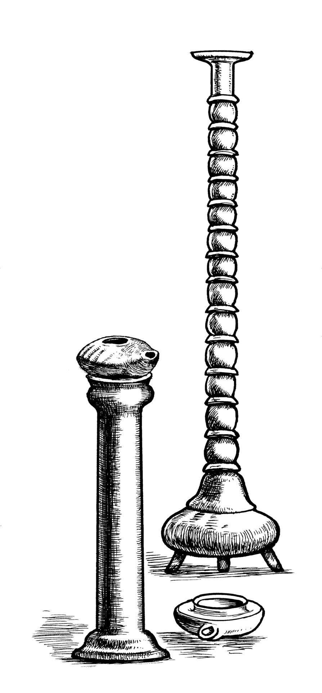
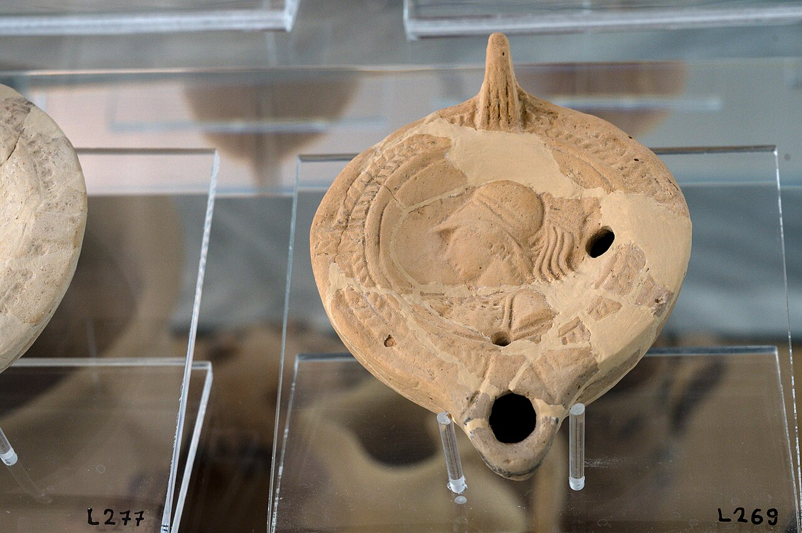

# Human-made Things in the Bible

## License Information

Human-made Things in the Bible © United Bible Societies, 2025. Adapted from: <cite>The Works of Their Hands: Man-made Things in the Bible</cite>, by Ray Pritz © 2009 United Bible Societies. This work is licensed under Creative Commons Attribution-ShareAlike 4.0 International (<a href="https://creativecommons.org/licenses/by-sa/4.0/">https://creativecommons.org/licenses/by-sa/4.0/</a>).

--------------------------------

## 標題：燈臺（lampstand） (id: REALIA:5.2)

5\.2 標題：燈臺（lampstand）
=====================

經文出處
----

Hebrew 來： מְנוֹרָה (音譯： mnorah)

[2KI 4:10](https://ref.ly/2Kgs4:10), [ZEC 4:2](https://ref.ly/Zech4:2), [ZEC 4:11](https://ref.ly/Zech4:11)

Aramaic 蘭：נֶבְרְשָׁה (音譯： nevrshah)

[DAN 5:5](https://ref.ly/Dan5:5)

Greek 希： λυχνία (音譯： luchnia)

[MAT 5:15](https://ref.ly/Matt5:15), [MRK 4:21](https://ref.ly/Mark4:21), [LUK 8:16](https://ref.ly/Luke8:16), [LUK 11:33](https://ref.ly/Luke11:33), [REV 1:13](https://ref.ly/Rev1:13), [REV 1:20](https://ref.ly/Rev1:20), [REV 1:20](https://ref.ly/Rev1:20), [REV 2:1](https://ref.ly/Rev2:1), [REV 2:5](https://ref.ly/Rev2:5), [REV 11:4](https://ref.ly/Rev11:4)

描述和用途
-----

*燈臺 (© Deutsche Bibelgesellschaft, Stuttgart by United Bible Societies)*

燈臺是用來托住一盞燈或一組燈的支架，可用多種材料做成，形狀和大小也非常多樣。使用燈臺的目的是使燈盞高於地板或桌子，增大照明面積。關於帳幕中的燈臺，參[4\.3\.4 燈臺 (lampstand, menorah)\<REALIA:4\.3\.4\>](#) 。

---

翻譯
--

*燈臺上的油燈 (© Zde Wikimedia Commons)*

許多文化沒有專指「燈臺」的詞語，因此這個詞可能要譯為「燈座」、「用來放燈的東西」或「放燈的地方」。如果翻譯者將油燈譯為「蠟燭」，那麽可以使用一個表示燭臺的詞語。

[DAN 5:5](https://ref.ly/Dan5:5) ：這節經文提到牆上的字是在「燈臺對面」（如RSV (Revised Standard Version (1952)) ）。這是整個宴會廳中最亮的地方。在大多數語言中，翻譯者可能都要清楚說明這一點，可譯為「燈光最明亮的地方」（如GNT (Good News Translation (1992)) ）、「燈光最強的地方」，或「人們看得非常清楚的地方」。

* **Associated Passages:** 列王紀下 4:10; 撒迦利亞書 4:2; 撒迦利亞書 4:11; 但以理書 5:5; 馬太福音 5:15; 馬可福音 4:21; 路加福音 8:16; 路加福音 11:33; 啟示錄 1:13; 啟示錄 1:20; 啟示錄 2:1; 啟示錄 2:5; 啟示錄 11:4

