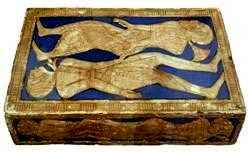

# Human-made Things in the Bible

## License Information

Human-made Things in the Bible © United Bible Societies, 2025. Adapted from: <cite>The Works of Their Hands: Man-made Things in the Bible</cite>, by Ray Pritz © 2009 United Bible Societies. This work is licensed under Creative Commons Attribution-ShareAlike 4.0 International (<a href="https://creativecommons.org/licenses/by-sa/4.0/">https://creativecommons.org/licenses/by-sa/4.0/</a>).

--------------------------------

## 標題：腳凳（footstool） (id: REALIA:5.8)

5\.8 標題：腳凳（footstool）
=====================

經文出處
----

Hebrew 來： הֲדֹם, רֶגֶל (音譯： hadom regel)

[1CH 28:2](https://ref.ly/1Chr28:2), [PSA 99:5](https://ref.ly/Ps99:5), [PSA 110:1](https://ref.ly/Ps110:1), [PSA 132:7](https://ref.ly/Ps132:7), [ISA 66:1](https://ref.ly/Isa66:1), [LAM 2:1](https://ref.ly/Lam2:1)

Hebrew 來： כֶּבֶשׁ (音譯： kevesh)

[2CH 9:18](https://ref.ly/2Chr9:18)

Greek 希： ὑποπόδιον (音譯： hupopodion)

[MAT 5:35](https://ref.ly/Matt5:35), [LUK 20:43](https://ref.ly/Luke20:43), [ACT 2:35](https://ref.ly/Acts2:35), [ACT 7:49](https://ref.ly/Acts7:49), [HEB 1:13](https://ref.ly/Heb1:13), [HEB 10:13](https://ref.ly/Heb10:13), [JAS 2:3](https://ref.ly/Jas2:3)

Latin 拉： scabillum

[2ES 6:4](https://ref.ly/2Esd6:4)

描述和用途
-----

*國王腳踏腳凳而坐（拉吉浮雕） (© Zunkir, CC BY\-SA 4\.0, via Wikimedia Commons)*

腳凳是一種供人放腳的家具，形狀像一張矮凳，人可以把雙腳放在上面，使腳離開地面。埃及人的腳凳描繪的是埃及王擊敗的敵人，如插圖所示。

---

翻譯
--

*這個皇家腳凳上有國王敵人的圖像，他可以把腳放在上面 (© Ray Pritz by United Bible Societies)*

腳凳在世界許多地方都是一種常見的人文現象，因此有時不必使用描述性的短語。然而，翻譯者可以採用「用來放腳的東西」等類表達。在有些語言中，「腳凳」的功能對等詞是「腳棍」；腳棍是一種架高的擱腳棍子，免得雙腳直接踩在普通房子或棚屋裡面相對潮濕的泥地上。

除了[JAS 2:3](https://ref.ly/Jas2:3) 以外，希臘文*hupopodion* 在新約中僅作為比喻出現。這個詞出現在新約對舊約經文的直接或間接引用中。我們查閱的大多數譯本都是按照字面意思來翻譯這個詞的；例如，在[LUK 20:43](https://ref.ly/Luke20:43) 中，GNT (Good News Translation (1992)) 英文意為，「等我把你的仇敵作為腳凳放在你的腳下。」NCV (New Century Version) 沒有譯成比喻，英文意為「等我把你的仇敵置於你的控制之下」。同樣地，在[MAT 3:35](https://ref.ly/Matt3:35) 中，NCV (New Century Version) 並沒有按照原文字面翻譯成「也不可指著地起誓，因為地是他的腳凳」（如RSV (Revised Standard Version (1952)) ），英文的意思是，「使用地的名稱，因為地屬於上帝。」在[JAS 2:3](https://ref.ly/Jas2:3) 中，主人侮辱窮人，讓他「坐在我腳凳下」，這裡的*hupopodion* 一詞指的是真正的腳凳。REB (Revised English Bible (1989)) 在譯文中保留了「腳凳」一詞，英文意為「坐在我腳凳旁邊的地上」。然而，大多數譯本都省略了腳凳，採用了類似NIV (New International Version (1984)) 的譯法，「坐在我腳邊的地上」。

* **Associated Passages:** 歷代志上 28:2; 詩篇 99:5; 詩篇 110:1; 詩篇 132:7; 以賽亞書 66:1; 耶利米哀歌 2:1; 歷代志下 9:18; 馬太福音 5:35; 路加福音 20:43; 使徒行傳 2:35; 使徒行傳 7:49; 希伯來書 1:13; 希伯來書 10:13; 雅各書 2:3; 厄斯德拉下 6:4; 馬太福音 3:35

