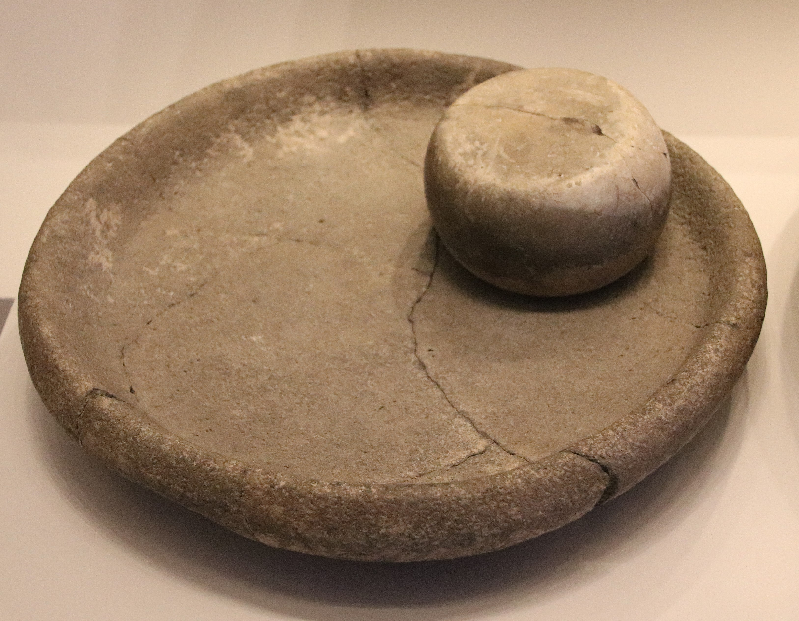

# Human-made Things in the Bible

## License Information

Human-made Things in the Bible © United Bible Societies, 2025. Adapted from: <cite>The Works of Their Hands: Man-made Things in the Bible</cite>, by Ray Pritz © 2009 United Bible Societies. This work is licensed under Creative Commons Attribution-ShareAlike 4.0 International (<a href="https://creativecommons.org/licenses/by-sa/4.0/">https://creativecommons.org/licenses/by-sa/4.0/</a>).

--------------------------------

## 標題：磨、磨石、磨盤（millstones, mill） (id: REALIA:5.10)

5\.10 標題：磨、磨石、磨盤（millstones, mill）
==================================

經文出處
----

Hebrew 來： פֶּלַח (音譯： pelach)

[JDG 9:53](https://ref.ly/Judg9:53), [2SA 11:21](https://ref.ly/2Sam11:21), [JOB 41:16](https://ref.ly/Job41:16)

Hebrew 來： רֵחַיִם (音譯： rechayim)

[EXO 11:5](https://ref.ly/Exod11:5), [NUM 11:8](https://ref.ly/Num11:8), [DEU 24:6](https://ref.ly/Deut24:6), [ISA 47:2](https://ref.ly/Isa47:2), [JER 25:10](https://ref.ly/Jer25:10)

Hebrew 來： רֶכֶב (音譯： rekev)

[DEU 24:6](https://ref.ly/Deut24:6), [JDG 9:53](https://ref.ly/Judg9:53), [2SA 11:21](https://ref.ly/2Sam11:21)

Greek 希： μυλικός (音譯： mulikos)

[LUK 17:2](https://ref.ly/Luke17:2)

Greek 希： μύλινος (音譯： mulinos)

[REV 18:21](https://ref.ly/Rev18:21)

Greek 希： μύλος (音譯： mulos)

[MAT 18:6](https://ref.ly/Matt18:6), [MAT 24:41](https://ref.ly/Matt24:41), [MRK 9:42](https://ref.ly/Mark9:42), [REV 18:22](https://ref.ly/Rev18:22)

描述和用途
-----

*手動碾磨器 (Gary Todd, Israel Museum, CC0, via Wikimedia Commons)*

*手動碾磨器 (Matson Collection, Library of Congress, Public domain, via Wikimedia Commons)*

磨由兩塊扁平的石塊組成，兩塊石板摩擦便可將麥子磨成麵粉。在舊約時期，石磨一般相對較小，由人工操作。把麥子放在固定的下磨石上，然後用上磨石來回碾壓麥子，就可將其磨成麵粉。磨麵粉通常是婦女的工作，她們要在清晨天亮前完成。這是一項辛苦的工作，要花很多時間。據估計，要為一個五口之家磨出足夠的麵粉做餅，一個婦女需要每天磨三個小時以上。油燈在清晨閃亮，磨麵的聲音陣陣傳來，這是安居樂業的象徵。在[JER 25:10](https://ref.ly/Jer25:10) ，先知耶利米描述將要臨到百姓的災難時，他引用上帝的話說：「我又要使……推磨的聲音和燈的亮光，從他們中間止息。」

*婦女使用手動碾磨器 (© Marcus Cyron, CC BY 3\.0, via Wikimedia Commons)*

在新約時期，人們仍然使用同類型的石磨，但也開始使用圓磨。圓磨的上磨盤和下磨盤基本一樣大，磨麵時，上磨盤相對於下磨盤轉動。麥子通過上磨盤中間的一個洞倒入磨石中，麵粉則從兩塊磨盤的摩擦面中流出來。有些圓磨相對較小，由手工操作。但有的圓磨很大，要套上牲口來拉動上磨盤。

在世界上的許多地方，人們都會用某種方式來把麥子磨成粉。通常情況下，石磨的結構和古代所用的石磨基本相同，就是使用兩塊相對較大、扁平的磨盤石，把其中一塊放到另一塊上面，在兩塊磨盤之間碾麥子。在世界上的一些地方，人們會使用一種研缽和研杵來磨碎或搗碎麥子。

---

翻譯
--

*一種較後期的手動碾磨器的磨石 (Matson Collection, Library of Congress, Public domain, via Wikimedia Commons)*

「石磨」通常可譯為「用來碾穀物的石頭」。在其他情況下，甚至可以使用更加寬泛的表達，例如「大石塊」。大多數情況下，經文的重點或者是磨石的大小，或者是碾麥子的功能，而未必是石磨的具體形式。然而，[MAT 18:6](https://ref.ly/Matt18:6) 、[MRK 9:42](https://ref.ly/Mark9:42) 和[LUK 17:2](https://ref.ly/Luke17:2) 提到把磨石拴在人的脖子上，然後丟到海裡，這裡重要的是說明較大的石塊會使人立刻往下沉。對於這種情形，使用表示「研缽」（尤其是木製的）的詞語是不合適的，因為研缽通常會浮在水面上。

*婦女使用手動碾磨器 (© Marcus Cyron, CC BY 3\.0, via Wikimedia Commons)*

希伯來文*pelach* 一詞指的是舊約時期手磨的磨石。在[JDG 9:53](https://ref.ly/Judg9:53) 和[2SA 11:21](https://ref.ly/2Sam11:21) 中，這個詞指上磨石（希伯來文*pelach rekev* ），而在[JOB 41:16](https://ref.ly/Job41:16) （《和》41:24）中，指下磨石（*pelach tachtith* ）。

* **Associated Passages:** 士師記 9:53; 撒母耳記下 11:21; 約伯記 41:16; 出埃及記 11:5; 民數記 11:8; 申命記 24:6; 以賽亞書 47:2; 耶利米書 25:10; 路加福音 17:2; 啟示錄 18:21; 馬太福音 18:6; 馬太福音 24:41; 馬可福音 9:42; 啟示錄 18:22

* **Associated ACAI Concepts:** Hand-Mill (ID: `realia:Hand-mill`)
