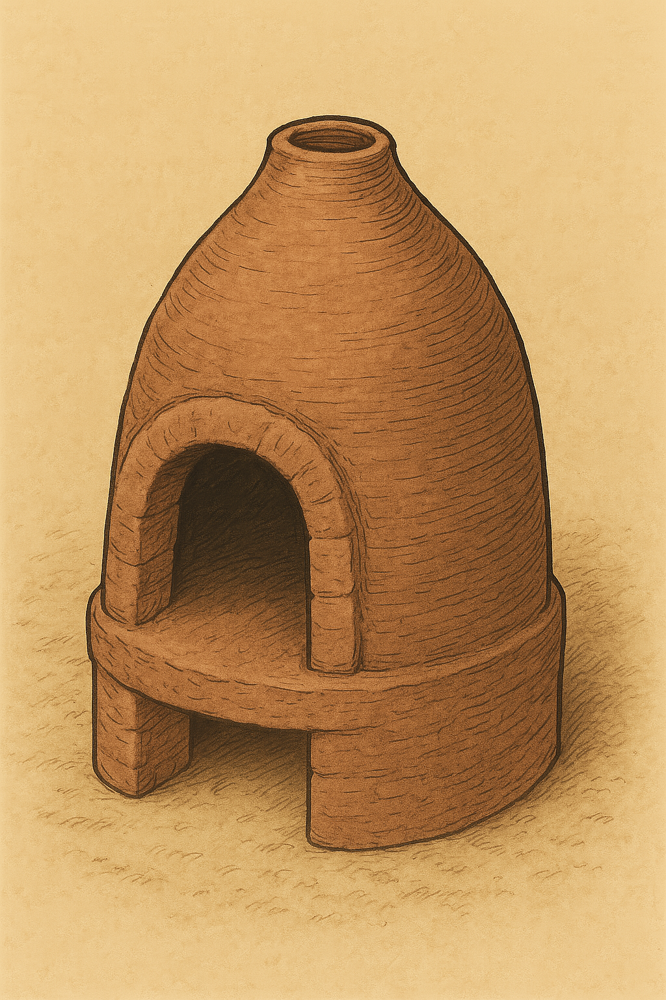

# Human-made Things in the Bible

## License Information

Human-made Things in the Bible © United Bible Societies, 2025. Adapted from: <cite>The Works of Their Hands: Man-made Things in the Bible</cite>, by Ray Pritz © 2009 United Bible Societies. This work is licensed under Creative Commons Attribution-ShareAlike 4.0 International (<a href="https://creativecommons.org/licenses/by-sa/4.0/">https://creativecommons.org/licenses/by-sa/4.0/</a>).

--------------------------------

## 標題：爐、火爐、爐灶（oven） (id: REALIA:5.11)

5\.11 標題：爐、火爐、爐灶（oven）
======================

經文出處
----

Hebrew 來： תַּנּוּר (音譯： tanur)

[GEN 15:17](https://ref.ly/Gen15:17), [EXO 7:28](https://ref.ly/Exod7:28), [LEV 2:4](https://ref.ly/Lev2:4), [LEV 7:9](https://ref.ly/Lev7:9), [LEV 11:35](https://ref.ly/Lev11:35), [LEV 26:26](https://ref.ly/Lev26:26), [NEH 3:11](https://ref.ly/Neh3:11), [NEH 12:38](https://ref.ly/Neh12:38), [PSA 21:10](https://ref.ly/Ps21:10), [ISA 31:9](https://ref.ly/Isa31:9), [LAM 5:10](https://ref.ly/Lam5:10), [HOS 7:4](https://ref.ly/Hos7:4), [HOS 7:6](https://ref.ly/Hos7:6), [HOS 7:7](https://ref.ly/Hos7:7), [MAL 3:19](https://ref.ly/Mal3:19)

Greek 希： κλίβανος (音譯： klibanos)

[MAT 6:30](https://ref.ly/Matt6:30), [LUK 12:28](https://ref.ly/Luke12:28)

描述
--

火爐是用來烹煮食物的工具，由硬化的黏土或磚製成，大小和形狀各異。普通家庭的火爐直徑大約為50厘米（20英吋）。冬天，火爐還能夠為一間小房子供暖。另參[1\.11\.1 窰、爐 (smelting furnace, kiln)\<REALIA:1\.11\.1\>](#) 。

---

翻譯
--

所有文化都知道烹煮食物的工具。「火爐」一詞可譯為「烘烤麵包的地方」或「加熱食物的地方」。有些情況下，在術語簡釋中提供比較詳細的描述會對讀者有所幫助。不過，這也不是必要的，因為火爐的功能遠比它的形式重要。火爐和火窰（參[1\.11\.1 窰、爐 (smelting furnace, kiln)\<REALIA:1\.11\.1\>](#) ）的區別主要在於大小，基本設計是相同的。

在[GEN 15:17](https://ref.ly/Gen15:17) 中，希伯來文*tanur* 似乎指的是一種便攜式火爐或火罐，一種裡面裝著炭的圓形陶碗。

[MAT 6:30](https://ref.ly/Matt6:30); [LUK 12:28](https://ref.ly/Luke12:28) ：這兩節經文的主旨是：上帝甚至看顧野草等用來燒火的東西，那麼豈不更加看顧他的百姓嗎？因此，翻譯者可以不必提及燒草的地方；例如，NIV (New International Version (1984)) 沒有說「丟在爐裡」（如RSV (Revised Standard Version (1952)) ），英文意為「丟到火裡」，而GECL (German Common Language Version (Gute Nachricht Bibel)) 則為「燒盡了」。這樣的翻譯尤其適合那些不用火爐燒草的文化。另外，翻譯[MAL 3:19](https://ref.ly/Mal3:19) （《和》4:1）時也應考慮上述註解。

* **Associated Passages:** 創世記 15:17; 出埃及記 7:28; 利未記 2:4; 利未記 7:9; 利未記 11:35; 利未記 26:26; 尼希米記 3:11; 尼希米記 12:38; 詩篇 21:10; 以賽亞書 31:9; 耶利米哀歌 5:10; 何西阿書 7:4; 何西阿書 7:6; 何西阿書 7:7; 瑪拉基書 3:19; 馬太福音 6:30; 路加福音 12:28

* **Associated ACAI Concepts:** Oven (ID: `realia:Oven`)
