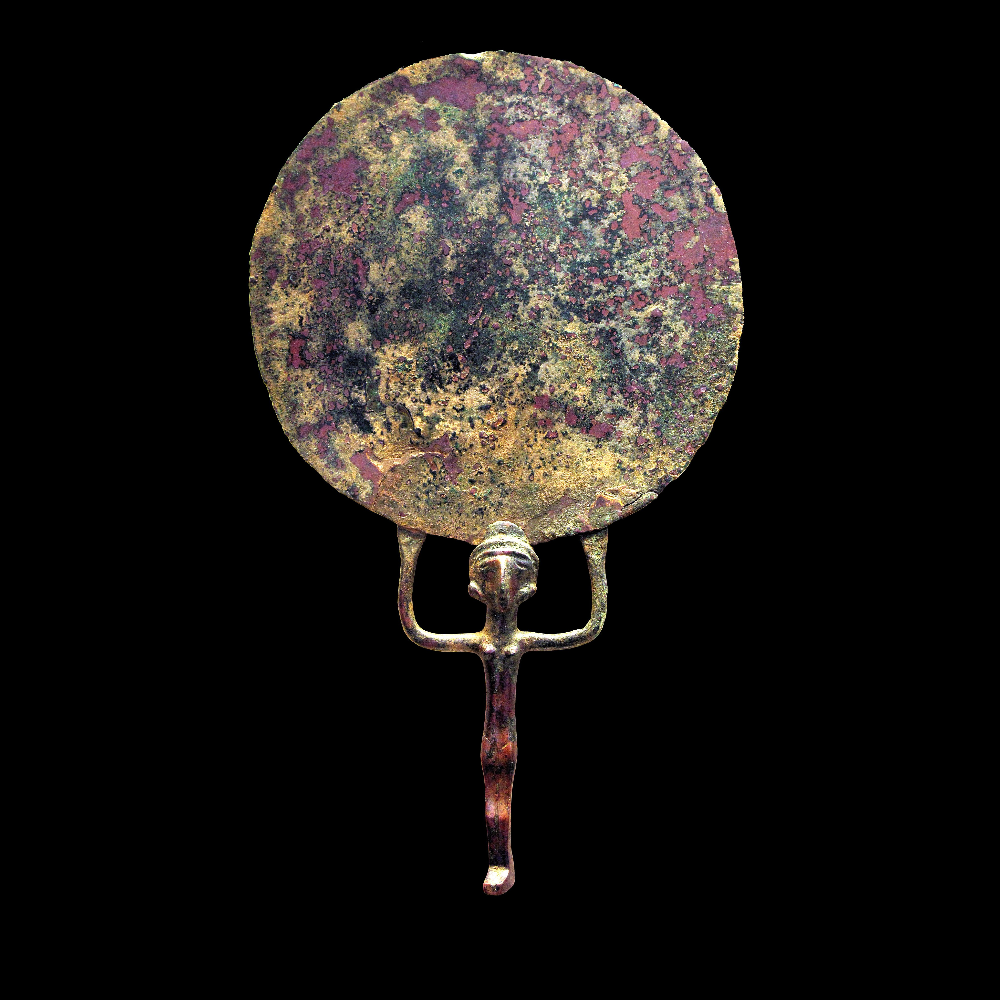

# Human-made Things in the Bible

## License Information

Human-made Things in the Bible © United Bible Societies, 2025. Adapted from: <cite>The Works of Their Hands: Man-made Things in the Bible</cite>, by Ray Pritz © 2009 United Bible Societies. This work is licensed under Creative Commons Attribution-ShareAlike 4.0 International (<a href="https://creativecommons.org/licenses/by-sa/4.0/">https://creativecommons.org/licenses/by-sa/4.0/</a>).

--------------------------------

## 標題：鏡子（mirror） (id: REALIA:5.14)

5\.14 標題：鏡子（mirror）
===================

經文出處
----

Hebrew 來： מַרְאָה (音譯： mar’ah)

[EXO 38:8](https://ref.ly/Exod38:8)

Hebrew 來： רְאִי (音譯： r’i)

[JOB 37:18](https://ref.ly/Job37:18)

Greek 希： ἔσοπτρον (音譯： esoptron)

[1CO 13:12](https://ref.ly/1Cor13:12), [JAS 1:23](https://ref.ly/Jas1:23), [WIS 7:26](https://ref.ly/Wis7:26), [SIR 12:11](https://ref.ly/Sir12:11)

描述和用途
-----

*手持鏡 (© Louvre Museum, CC BY\-SA 2\.0 FR, via Wikimedia Commons)*

古代的鏡子是一塊研磨得非常光滑的金屬片，用來映照影像。鏡子通常由紅銅、青銅或黃銅製成，有時用銀子來做。

---

翻譯
--

雖然古代沒有玻璃做的鏡子，但在[1CO 13:12](https://ref.ly/1Cor13:12) 和[JAS 1:23](https://ref.ly/Jas1:23) 中，鏡子反射影像的功能比它的製作材料更重要。然而，在[EXO 38:8](https://ref.ly/Exod38:8) 中，翻譯者採用的表述必須表明所提到的鏡子是由金屬製成的（或增加腳註）。

在[JOB 37:18](https://ref.ly/Job37:18) 中，重點是鏡子的堅硬和光亮。如果不做大幅擴展，要同時傳達硬度和光澤這兩重意思是很難的，各譯本往往只強調了其中一個方面；例如，「像鏡子般光亮」（ITCL (Italian Common Language Version) 直譯），「像鑄銅的鏡子般堅硬」（NIV (New International Version (1984)) 直譯）。試圖在譯文中將兩者結合起來而又不做很多的擴展，可能會給讀者留下一些疑問；例如，GNT (Good News Translation (1992)) 譯為“as hard as polished metal”（「像拋光的金屬般堅硬」），但拋光的金屬比沒有拋光的金屬更堅硬嗎？整節經文可以擴展譯為：「你豈能與上帝一同鋪張穹蒼，使其看起來像鑄銅的明鏡那樣堅硬嗎？」

* **Associated Passages:** 出埃及記 38:8; 約伯記 37:18; 哥林多前書 13:12; 雅各書 1:23; 智慧篇 7:26; 德訓篇 12:11

* **Associated ACAI Concepts:** Mirror (ID: `realia:Mirror`)
