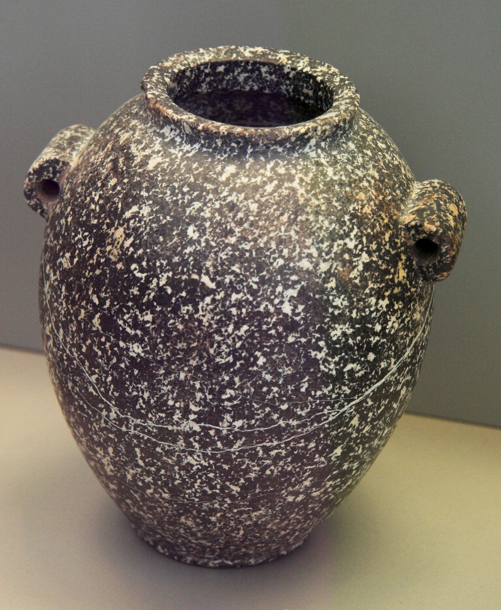
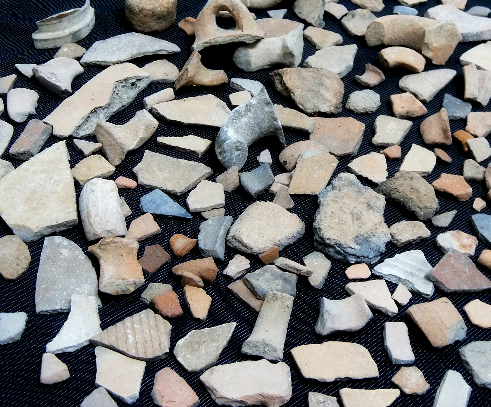
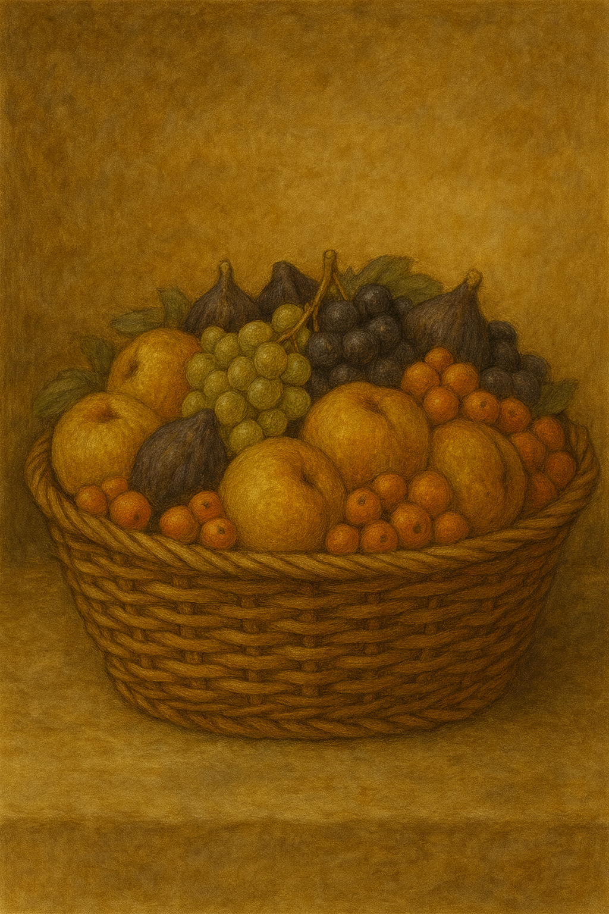

# Human-made Things in the Bible

## License Information

Human-made Things in the Bible © United Bible Societies, 2025. Adapted from: <cite>The Works of Their Hands: Man-made Things in the Bible</cite>, by Ray Pritz © 2009 United Bible Societies. This work is licensed under Creative Commons Attribution-ShareAlike 4.0 International (<a href="https://creativecommons.org/licenses/by-sa/4.0/">https://creativecommons.org/licenses/by-sa/4.0/</a>).

--------------------------------

## 標題：容器、器皿（containers, vessels） (id: REALIA:5.18)

5\.18 標題：容器、器皿（containers, vessels）
===================================

經文出處
----

Hebrew 來： אָסוּךְ (音譯： ’asuk)

[2KI 4:2](https://ref.ly/2Kgs4:2)

Hebrew 來： בַּקְבֻּק (音譯： baqbuq)

[1KI 14:3](https://ref.ly/1Kgs14:3), [JER 19:1](https://ref.ly/Jer19:1), [JER 19:10](https://ref.ly/Jer19:10)

Hebrew 來： חֶרֶשׂ (音譯： cheres)

[PRO 26:23](https://ref.ly/Prov26:23)

Hebrew 來： כְּלִי (音譯： kli)

[GEN 42:25](https://ref.ly/Gen42:25), [GEN 43:11](https://ref.ly/Gen43:11), [GEN 45:20](https://ref.ly/Gen45:20), [EXO 37:16](https://ref.ly/Exod37:16), [LEV 6:21](https://ref.ly/Lev6:21), [LEV 6:21](https://ref.ly/Lev6:21), [LEV 11:32](https://ref.ly/Lev11:32), [LEV 11:33](https://ref.ly/Lev11:33), [LEV 11:34](https://ref.ly/Lev11:34), [LEV 14:5](https://ref.ly/Lev14:5), [LEV 14:50](https://ref.ly/Lev14:50), [LEV 15:12](https://ref.ly/Lev15:12), [LEV 15:12](https://ref.ly/Lev15:12), [NUM 4:9](https://ref.ly/Num4:9), [NUM 5:17](https://ref.ly/Num5:17), [NUM 19:15](https://ref.ly/Num19:15), [NUM 19:17](https://ref.ly/Num19:17), [DEU 23:25](https://ref.ly/Deut23:25), [RUT 2:9](https://ref.ly/Ruth2:9), [1SA 9:7](https://ref.ly/1Sam9:7), [2SA 17:28](https://ref.ly/2Sam17:28), [1KI 10:21](https://ref.ly/1Kgs10:21), [1KI 17:10](https://ref.ly/1Kgs17:10), [2KI 4:3](https://ref.ly/2Kgs4:3), [2KI 4:3](https://ref.ly/2Kgs4:3), [2KI 4:4](https://ref.ly/2Kgs4:4), [2KI 4:6](https://ref.ly/2Kgs4:6), [2KI 4:6](https://ref.ly/2Kgs4:6), [2KI 4:6](https://ref.ly/2Kgs4:6), [2CH 9:20](https://ref.ly/2Chr9:20), [EST 1:7](https://ref.ly/Esth1:7), [EST 1:7](https://ref.ly/Esth1:7), [EST 1:7](https://ref.ly/Esth1:7), [JOB 28:17](https://ref.ly/Job28:17), [PSA 2:9](https://ref.ly/Ps2:9), [ISA 22:24](https://ref.ly/Isa22:24), [ISA 22:24](https://ref.ly/Isa22:24), [ISA 22:24](https://ref.ly/Isa22:24), [ISA 65:4](https://ref.ly/Isa65:4), [ISA 66:20](https://ref.ly/Isa66:20), [JER 14:3](https://ref.ly/Jer14:3), [JER 18:4](https://ref.ly/Jer18:4), [JER 18:4](https://ref.ly/Jer18:4), [JER 19:11](https://ref.ly/Jer19:11), [JER 22:28](https://ref.ly/Jer22:28), [JER 32:14](https://ref.ly/Jer32:14), [JER 40:10](https://ref.ly/Jer40:10), [JER 48:11](https://ref.ly/Jer48:11), [JER 48:11](https://ref.ly/Jer48:11), [JER 48:12](https://ref.ly/Jer48:12), [JER 48:38](https://ref.ly/Jer48:38), [JER 51:34](https://ref.ly/Jer51:34), [EZK 4:9](https://ref.ly/Ezek4:9)

Hebrew 來： עֶצֶב (音譯： ‘etsev)

[JER 22:28](https://ref.ly/Jer22:28)

Greek 希： ἀγγεῖον (音譯： aggeion)

[MAT 25:4](https://ref.ly/Matt25:4), [JDT 7:20](https://ref.ly/Jdt7:20), [JDT 10:5](https://ref.ly/Jdt10:5), [SIR 21:14](https://ref.ly/Sir21:14), [1MA 6:53](https://ref.ly/1Macc6:53)

Greek 希： ἄγγος (音譯： aggos)

[MAT 13:48](https://ref.ly/Matt13:48)

Greek 希： ἄντλημα (音譯： antlēma)

[JHN 4:11](https://ref.ly/John4:11)

Greek 希： κάλπη (音譯： kalpē)

[4MA 3:12](https://ref.ly/4Macc3:12)

Greek 希： καψάκης (音譯： kapsakēs)

[JDT 10:5](https://ref.ly/Jdt10:5)

Greek 希： σκεῦος (音譯： skeuos)

[LUK 8:16](https://ref.ly/Luke8:16), [JHN 19:29](https://ref.ly/John19:29), [ROM 9:21](https://ref.ly/Rom9:21), [REV 2:27](https://ref.ly/Rev2:27), [LJE 1:15](https://ref.ly/EpJer1:15)

Latin 拉： vas

[2ES 6:56](https://ref.ly/2Esd6:56), [2ES 9:34](https://ref.ly/2Esd9:34)

描述和用途
-----

*(Image generated by ChatGPT using OpenAI technology)*

容器是用來裝東西的堅固物品。容器有陶製的、金屬製的，也有木製的，大小和形狀差別很大。

---

翻譯
--

*瓶 (Metropolitan Museum of Art, CC0, MMA)*

大多數語言都有表示容器的統稱。希伯來文*kli* 一詞的含義非常籠統，用法與英文“implement”（「用具」）、“instrument”（「工具」）、甚至是“object”（「物體」）或“thing”（「東西」）類似。翻譯者應根據語境選擇相應的譯詞。例如，在[RUT 2:9](https://ref.ly/Ruth2:9) 中，該詞明顯是指人們用來喝水的容器，翻譯者可能要指出這一點；例如，GNT (Good News Translation (1992)) 、NIV (New International Version (1984)) 和CEV (Contemporary English Version) 譯為“water jars”（「水罐」），NCV (New Century Version) 譯為“water jugs”（「水壺」）。在大多數經文中，翻譯者都可以選擇一個一般性詞語，但應避免譯作由塑料、橡膠、錫或其他聖經時期沒有的材料製成的容器。

在[2KI 4:2](https://ref.ly/2Kgs4:2) 中，希伯來文*’asuk* 指的是某種罐子或長頸瓶，可能是陶製的。大多數譯本都在譯詞前面添加了修飾詞「小」（如GNT (Good News Translation (1992)) 、CEV (Contemporary English Version) ）。

希伯來文*baqbuq* 一詞指的是一種細頸小瓶。在現代希伯來文中，這個詞表示「瓶子」。

在[PRO 26:23](https://ref.ly/Prov26:23) 中，希伯來文*cheres* 指的是一種由廉價而普通的材料製成的器皿。

[JOB 28:17](https://ref.ly/Job28:17) ：這節經文末尾的希伯來文字面意思是「精金的器皿」。雖然大多數譯本都採取了「精金的珠寶」（“jewels of fine gold”，RSV (Revised Standard Version (1952)) ）等類譯法，但GNT (Good News Translation (1992)) 和其他譯本認為「器皿」（希伯來文*kli* ）指的是「金瓶子」，這可能比「珠寶」更準確。在一些語言中，「精金的器皿」可以譯為「用精金做的罐子」。因為經文的要旨是智慧極其可貴，而不是把它與任何物品作比較；翻譯者可以借鑒CEV (Contemporary English Version) 來翻譯整節經文，「沒有任何東西與它等價——不論是金子還是貴重的玻璃。」

[MAT 25:4](https://ref.ly/Matt25:4) 中提到的器皿應該比較小，容量不超過1升（約1夸脫）。

[MAT 13:48](https://ref.ly/Matt13:48) 提到的容器應該很大，容量可能有15—19升（4—5加侖）。

[JHN 4:11](https://ref.ly/John4:11) ：撒瑪利亞婦人看見耶穌「沒有打水的器具」。希臘文*antlēma* （[JHN 4:11](https://ref.ly/John4:11) ）源自一個意為「打水」的動詞，並沒有提示器具的形狀和材料。許多譯本譯為「桶」。但是，這種譯法可能會暗示這是一種用金屬、塑料甚或橡膠做的器具，而這些都是不合適的。即便是木桶，也不太可能出現在新約時期。這裡比較可能是一個皮製的容器。在許多語言中，最好的解決辦法是不指明具體的器具。翻譯者可以用婦女的話來開始該節經文：「先生，井很深，但你沒有打水的東西。」GW (God's Word Translation) 、NCV (New Century Version) 、NIV (New International Version (1984)) 、SPCL (Spanish Common Language Version (Dios Habla Hoy)) 、PV 和其他一些譯本採用了類似的譯法。

[JHN 19:29](https://ref.ly/John19:29) ：RSV (Revised Standard Version (1952)) 和GNT (Good News Translation (1992)) 將希臘文*skeuos* 一詞譯為“bowl”（「碗」），還有譯本譯為“jar”（「罐子」；CEV (Contemporary English Version) 、NIV (New International Version (1984)) 、NLT (New Living Translation) 、REB (Revised English Bible (1989)) ）。這裡最好使用一個統稱，如「器皿」或「容器」（GECL (German Common Language Version (Gute Nachricht Bibel)) ）。*skeuos* 一詞在新約中通常是指廣義的「東西、物件、物品」（參[MAT 12:29](https://ref.ly/Matt12:29); [MRK 3:27](https://ref.ly/Mark3:27); [MRK 11:16](https://ref.ly/Mark11:16); [LUK 17:31](https://ref.ly/Luke17:31); [ACT 10:11](https://ref.ly/Acts10:11); [ACT 10:16](https://ref.ly/Acts10:16); [ACT 11:5](https://ref.ly/Acts11:5); [ACT 27:17](https://ref.ly/Acts27:17); [2TI 2:20](https://ref.ly/2Tim2:20); [2TI 2:21](https://ref.ly/2Tim2:21); [HEB 9:21](https://ref.ly/Heb9:21); [REV 18:12](https://ref.ly/Rev18:12); [REV 18:12](https://ref.ly/Rev18:12) ）。

* **Associated Passages:** 列王紀下 4:2; 列王紀上 14:3; 耶利米書 19:1; 耶利米書 19:10; 箴言 26:23; 創世記 42:25; 創世記 43:11; 創世記 45:20; 出埃及記 37:16; 利未記 6:21; 利未記 11:32; 利未記 11:33; 利未記 11:34; 利未記 14:5; 利未記 14:50; 利未記 15:12; 民數記 4:9; 民數記 5:17; 民數記 19:15; 民數記 19:17; 申命記 23:25; 路得記 2:9; 撒母耳記上 9:7; 撒母耳記下 17:28; 列王紀上 10:21; 列王紀上 17:10; 列王紀下 4:3; 列王紀下 4:4; 列王紀下 4:6; 歷代志下 9:20; 以斯帖記 1:7; 約伯記 28:17; 詩篇 2:9; 以賽亞書 22:24; 以賽亞書 65:4; 以賽亞書 66:20; 耶利米書 14:3; 耶利米書 18:4; 耶利米書 19:11; 耶利米書 22:28; 耶利米書 32:14; 耶利米書 40:10; 耶利米書 48:11; 耶利米書 48:12; 耶利米書 48:38; 耶利米書 51:34; 以西結書 4:9; 馬太福音 25:4; 友弟德傳 7:20; 友弟德傳 10:5; 德訓篇 21:14; 瑪加伯上 6:53; 馬太福音 13:48; 約翰福音 4:11; 瑪加伯四書 3:12; 路加福音 8:16; 約翰福音 19:29; 羅馬書 9:21; 啟示錄 2:27; 耶利米書信 1:15; 厄斯德拉下 6:56; 厄斯德拉下 9:34; 馬太福音 12:29; 馬可福音 3:27; 馬可福音 11:16; 路加福音 17:31; 使徒行傳 10:11; 使徒行傳 10:16; 使徒行傳 11:5; 使徒行傳 27:17; 提摩太後書 2:20; 提摩太後書 2:21; 希伯來書 9:21; 啟示錄 18:12

## 標題：儲存容器（containers for storage） (id: REALIA:5.18.1)

5\.18\.1 標題：儲存容器（containers for storage）
========================================

儲物罐用來儲存水、油等液體，或存放穀物等糧食，大小不一。這些容器通常是用比較軟的石頭鑿成，或者是用黏土製成，基本上是圓柱形，頂部開口。開口可以用蓋子蓋上（參[5\.18\.1\.2\.1 蓋子 (lid, cover)\<REALIA:5\.18\.1\.2\.1\>](#) ）。

## 標題：石缸（stone jar） (id: REALIA:5.18.1.1)

5\.18\.1\.1 標題：石缸（stone jar）
============================

經文出處
----

Greek 希： λίθινος, ὑδρία (音譯： (lithinos) hudria)

[JHN 2:6](https://ref.ly/John2:6), [JHN 2:6](https://ref.ly/John2:6), [JHN 2:7](https://ref.ly/John2:7)

描述和用途
-----

*美錫尼（Mycenean）石製儲物罐，青銅時代晚期，公元前1570–1200年 (© Zde, CC BY\-SA 3\.0, via Wikimedia Commons)*

石缸是用來盛水的容器。在聖經中，只有一個地方提到了這種盛水的容器，並且描述得非常詳細。石缸的容量為「二十至三十加侖」（GNT (Good News Translation (1992)) 直譯；約80—120升），是用石頭做成的。聖經時期的石缸是由比較軟的石頭製成的，可用錘子和鑿子進行雕刻，再用多種工具打磨光滑；也可以用車床加工，就像木匠旋削木頭那樣。

---

翻譯
--

*(Image generated by ChatGPT using OpenAI technology)*

關於[RUT 2:9](https://ref.ly/Ruth2:9) 記敘的水缸，參[5\.18 容器、器皿 (containers, vessels)\<REALIA:5\.18\>](#) 中的討論。

[JHN 2:6](https://ref.ly/John2:6) ：這裡的水缸是用石頭做成，而不是陶製的，這一點很重要。根據猶太律法，如果陶缸沾染了不潔，就必須打碎；但是被污染的石缸只要清洗乾淨就可以再次使用。希臘文*hudria* 表明這些石缸是用來盛水的。在一些語言中，短語「六口石缸」中每個詞之間的關係必須明確，例如，「六口用來盛水的大石缸」。

* **Associated Passages:** 約翰福音 2:6; 約翰福音 2:7; 路得記 2:9

* **Associated ACAI Concepts:** Stone Jar (ID: `realia:StoneJar`); Clay Jar (ID: `realia:ClayJar`)

## 標題：陶罐（clay jar） (id: REALIA:5.18.1.2)

5\.18\.1\.2 標題：陶罐（clay jar）
===========================

經文出處
----

Hebrew 來： כַּד (音譯： kad)

[GEN 24:14](https://ref.ly/Gen24:14), [GEN 24:15](https://ref.ly/Gen24:15), [GEN 24:16](https://ref.ly/Gen24:16), [GEN 24:17](https://ref.ly/Gen24:17), [GEN 24:18](https://ref.ly/Gen24:18), [GEN 24:20](https://ref.ly/Gen24:20), [GEN 24:43](https://ref.ly/Gen24:43), [GEN 24:45](https://ref.ly/Gen24:45), [GEN 24:46](https://ref.ly/Gen24:46), [JDG 7:16](https://ref.ly/Judg7:16), [JDG 7:16](https://ref.ly/Judg7:16), [JDG 7:19](https://ref.ly/Judg7:19), [JDG 7:20](https://ref.ly/Judg7:20), [1KI 17:12](https://ref.ly/1Kgs17:12), [1KI 17:14](https://ref.ly/1Kgs17:14), [1KI 17:16](https://ref.ly/1Kgs17:16), [1KI 18:34](https://ref.ly/1Kgs18:34), [ECC 12:6](https://ref.ly/Eccl12:6)

Hebrew 來： נֵבֶל (音譯： nevel)

[ISA 30:14](https://ref.ly/Isa30:14), [LAM 4:2](https://ref.ly/Lam4:2)

Hebrew 來： צַפַּחַת (音譯： tsapachath)

[1SA 26:12](https://ref.ly/1Sam26:12), [1SA 26:16](https://ref.ly/1Sam26:16), [1KI 17:12](https://ref.ly/1Kgs17:12), [1KI 17:14](https://ref.ly/1Kgs17:14), [1KI 17:16](https://ref.ly/1Kgs17:16), [1KI 19:6](https://ref.ly/1Kgs19:6)

Greek 希： κεράμιον (音譯： keramion)

[MRK 14:13](https://ref.ly/Mark14:13), [LUK 22:10](https://ref.ly/Luke22:10)

Greek 希： ὑδρία (音譯： hudria)

[JHN 4:28](https://ref.ly/John4:28)

描述和用途
-----

*(Image generated by ChatGPT using OpenAI technology)*

陶罐是一種陶製器皿，用來儲存葡萄酒和橄欖油等液體（另參[5\.18\.1 儲存容器 (containers for storage)\<REALIA:5\.18\.1\>](#) ）。陶罐也可以用來裝水或其他液體。

---

翻譯
--

石缸（參[5\.18\.1\.1 石缸 (stone jar)\<REALIA:5\.18\.1\.1\>](#) ）只是用來儲水。陶罐與石缸不同，裝滿水後必須要足夠輕，以便婦女能夠拿著走路；在當時的社會，打水工作通常由婦女來做。在[JHN 2:6](https://ref.ly/John2:6) 和[JHN 4:28](https://ref.ly/John4:28) 中，約翰使用了同一個意為「罐」的希臘文詞語（《和修》2:6譯作「缸」，[JHN 4:28](https://ref.ly/John4:28) 「水罐」），但從上下文可以清楚地看出，這個詞指的是兩種不同的容器。[JHN 4:28](https://ref.ly/John4:28) 提到的婦女不可能提著一口沉重的石缸。大多數譯本都譯為「水罐」（“water jar”；RSV (Revised Standard Version (1952)) 、GNT (Good News Translation (1992)) ）。目標語言如果使用不同的詞語來分別表示打水或提水的器皿與喝水的器皿，就應使用表示前者的詞語。

* **Associated Passages:** 創世記 24:14; 創世記 24:15; 創世記 24:16; 創世記 24:17; 創世記 24:18; 創世記 24:20; 創世記 24:43; 創世記 24:45; 創世記 24:46; 士師記 7:16; 士師記 7:19; 士師記 7:20; 列王紀上 17:12; 列王紀上 17:14; 列王紀上 17:16; 列王紀上 18:34; 傳道書 12:6; 以賽亞書 30:14; 耶利米哀歌 4:2; 撒母耳記上 26:12; 撒母耳記上 26:16; 列王紀上 19:6; 馬可福音 14:13; 路加福音 22:10; 約翰福音 4:28; 約翰福音 2:6

* **Associated ACAI Concepts:** Clay Jar (ID: `realia:ClayJar`)

## 標題：蓋子（lid, cover） (id: REALIA:5.18.1.2.1)

5\.18\.1\.2\.1 標題：蓋子（lid, cover）
================================

經文出處
----

Hebrew 來： צָמִיד (音譯： tsamid)

[NUM 19:15](https://ref.ly/Num19:15)

描述
--

*有蓋儲藏罐 (Metropolitan Museum of Art, CC0, MMA)*

蓋子是用來嚴密地蓋住罐口或缸口的東西。在某些情況下，蓋子會用繩子繫在容器上。

---

翻譯
--

希伯來文*tsamid* 通常指一種作為珠寶佩戴的手鐲（參[10\.5\.2 手鐲、臂鐲、腳鐲 (bracelet, armlet, anklet)\<REALIA:10\.5\.2\>](#) ）。然而在[NUM 19:15](https://ref.ly/Num19:15) 中，這個詞指的是蓋住器皿的方式。這節經文的重點是器皿沒有封住或蓋住，因此異物可能會掉進去，譯文要傳遞出這個意思。GNT (Good News Translation (1992)) 英文意為，「帳棚中凡沒有蓋子的罐和缸也都不潔淨」；NCV (New Century Version) 意為，「凡沒有蓋子、敞口的罐和缸都不潔淨」；這兩種翻譯都可作為參考。在這節經文中，希伯來文*pathil* 描述的是蓋子相對於器皿的情況，一些譯本譯為「綁住」（“tied”；NASB (New American Standard Bible) 、REB (Revised English Bible (1989)) 、路德、ITCL (Italian Common Language Version) ）。還有譯本則選擇了一個比較寬泛的詞語，如「固定住」（“fastened”；RSV (Revised Standard Version (1952)) 、NRSV (New Revised Standard Version (1989)) 、NIV (New International Version (1984)) ）。整節經文的另一種參考譯法是：「凡沒有封嚴的罐和缸，就為不潔淨。」

* **Associated Passages:** 民數記 19:15

* **Associated ACAI Concepts:** Thread (ID: `realia:Thread`); Measuring Reed (ID: `realia:MeasuringReed`)

## 標題：瓦片（potsherd） (id: REALIA:5.18.1.2.2)

5\.18\.1\.2\.2 標題：瓦片（potsherd）
==============================

經文出處
----

Hebrew 來： חֶרֶשׂ (音譯： cheres)

[JOB 2:8](https://ref.ly/Job2:8), [JOB 41:22](https://ref.ly/Job41:22), [PSA 22:16](https://ref.ly/Ps22:16), [ISA 30:14](https://ref.ly/Isa30:14), [EZK 23:34](https://ref.ly/Ezek23:34)

Greek 希： ὄστρακον (音譯： ostrakon)

[SIR 22:9](https://ref.ly/Sir22:9)

描述
--

*陶器碎片 (© Davidbena, CC BY\-SA 4\.0, via Wikimedia Commons)*

瓦片是陶器的碎片，沒有規則的形狀。瓦片通常不太大，比手掌小，邊緣可能很鋒利。

---

翻譯
--

在聖經時期，人們吃飯、喝水、烹飪所用的大多數家用器皿都是用黏土製成，可能是曬乾或燒製的。這樣的器皿很容易破碎，並且破碎後通常也不會修補。這種器皿的碎片極其常見。大多數譯本把「瓦片」譯為「陶器的碎片」（“piece of broken pottery”；GNT (Good News Translation (1992)) 、NIV (New International Version (1984)) 、NCV (New Century Version) ）或類似的表達。

* **Associated Passages:** 約伯記 2:8; 約伯記 41:22; 詩篇 22:16; 以賽亞書 30:14; 以西結書 23:34; 德訓篇 22:9

## 標題：玉瓶、雪花石膏瓶（alabaster jar, alabaster flask） (id: REALIA:5.18.1.3)

5\.18\.1\.3 標題：玉瓶、雪花石膏瓶（alabaster jar, alabaster flask）
=======================================================

經文出處
----

Greek 希： ἀλάβαστρον, ἀλάβαστρος (音譯： alabastron, alabastros)

[MAT 26:7](https://ref.ly/Matt26:7), [MRK 14:3](https://ref.ly/Mark14:3), [MRK 14:3](https://ref.ly/Mark14:3), [LUK 7:37](https://ref.ly/Luke7:37)

描述和用途
-----

*放油膏的雪花石膏瓶（埃及，公元前2000–100年） (© Wellcome Images, UK, CC BY 4\.0, via Wikimedia Commons)*

玉瓶（雪花石膏瓶）是用方解石製成的瓶子。這種瓶子的瓶頸通常很長，因此必須把瓶子打碎才能使用裡面裝著的東西。這種瓶子一般都很小，主要用來裝香水等貴重物品。

---

翻譯
--

考古學和文學證據表明，在希臘化時期，裝香水的玉瓶（最初用雪花石膏製成）被玻璃瓶所取代。但是，這些瓶子仍然被稱為「玉瓶」。玉瓶買來的時候是密封的，要打碎才能開封。因此，[MRK 14:3](https://ref.ly/Mark14:3) 記載那個婦女打碎了瓶子；《馬太福音》中的平行經文沒有記錄這個細節。雖然玻璃沒有雪花石膏那麼昂貴，但也不是很常見，因此也很貴重。

在翻譯「玉瓶」（雪花石膏瓶）時，許多翻譯者使用了一個表示「瓶」或「長頸瓶」的詞語，並用一個修飾語進行描述，例如「用雪花石膏做的」、「用貴重的石頭做的」，或「用稱爲雪花石膏的貴重石頭做的」。由於雪花石膏在現今並不廣為人知，有些譯本省略了這一信息；例如，[MRK 14:3](https://ref.ly/Mark14:3) 有一個短語字面意為「一個裝著純哪噠香膏的雪花石膏瓶，非常昂貴」，RSV (Revised Standard Version (1952)) 採用了直譯；然而，CEV (Contemporary English Version) 英文意為，「非常昂貴的一瓶子的芬芳香膏」，這可能會讓英文讀者產生疑問：究竟是瓶子昂貴，還是裡面的東西昂貴（實際上是裡面的東西昂貴）。GECL (German Common Language Version (Gute Nachricht Bibel)) 和希伯來文通俗譯本作，「一個裝著昂貴的純哪噠油的小瓶子」，這種譯法更好一些。

* **Associated Passages:** 馬太福音 26:7; 馬可福音 14:3; 路加福音 7:37

* **Associated ACAI Concepts:** Alabaster Jar (ID: `realia:AlabasterJar`)

## 標題：錢囊、錢箱、寶盒（money box, treasure box） (id: REALIA:5.18.1.4)

5\.18\.1\.4 標題：錢囊、錢箱、寶盒（money box, treasure box）
================================================

經文出處
----

Greek 希： γλωσσόκομον (音譯： glōssokomon)

[JHN 12:6](https://ref.ly/John12:6), [JHN 13:29](https://ref.ly/John13:29)

Greek 希： θησαυρός (音譯： thēsauros)

[MAT 2:11](https://ref.ly/Matt2:11), [MAT 12:35](https://ref.ly/Matt12:35), [MAT 12:35](https://ref.ly/Matt12:35), [MAT 13:52](https://ref.ly/Matt13:52), [LUK 6:45](https://ref.ly/Luke6:45)

Greek 希： κιβωτός (音譯： kibōtos)

[1ES 1:51](https://ref.ly/1Esd1:51)

描述和用途
-----

*(Image generated by ChatGPT using OpenAI technology)*

錢箱是一種箱子，可能是木頭做的，裡面放著錢或其他貴重的小物品。這種箱子可能很小，可以輕鬆地單手拿著或夾在腋下。

---

翻譯
--

「寶盒」可以譯為：「裝著貴重物品的盒子」，或「裝著值一大筆錢的物品的盒子。」

[JHN 13:29](https://ref.ly/John13:29) 的重點並不是錢箱這件東西，而是猶大所承擔的職責。因此，對於字面意為「猶大帶著錢箱」的短句，可以簡單地譯為「猶大是管錢的」（CEV (Contemporary English Version) 直譯），或「猶大是他們的財務」。這裡的希臘文表達可以理解為慣用語。

[MAT 2:11](https://ref.ly/Matt2:11) ：RSV (Revised Standard Version (1952)) 把這裡的希臘文*thēsaurus* 譯為“treasures”（「寶物」），該詞既可以指存放起來的貴重物品，也可能指儲存貴重物品的地方或物件。對於該節經文中的這個詞語，各譯本分別譯為「寶物」或「寶箱」；但即便是依循第二種解釋，解經家對箱子的性質也沒有達成共識。例如，有些人建議譯為「寶盒」，而另一些人則不認同，主張譯為「袋子」。鑒於*thēsaurus* 有許多譯法，但又沒有一種特別有說服力，因此最好按照目標語言中最自然且不與聖經文化衝突的方式來翻譯。與聖經文化矛盾的翻譯包括「手提箱」、「旅行箱」、「保險箱」等。翻譯者要避免使用這些詞語。許多翻譯者都使用了「行李」和「用來裝貴重物品的袋子（或箱子）」之類的一般性表達。

* **Associated Passages:** 約翰福音 12:6; 約翰福音 13:29; 馬太福音 2:11; 馬太福音 12:35; 馬太福音 13:52; 路加福音 6:45; 厄斯德拉上 1:51

* **Associated ACAI Concepts:** Money Box (ID: `realia:MoneyBox`); Storeroom (ID: `realia:Storeroom`)

## 標題：筐子、籃子、伊法（basket） (id: REALIA:5.18.2)

5\.18\.2 標題：筐子、籃子、伊法（basket）
============================

經文出處
----

Hebrew 來： אֵיפָה (音譯： ’eyfah)

[EXO 16:36](https://ref.ly/Exod16:36), [LEV 5:11](https://ref.ly/Lev5:11), [LEV 6:13](https://ref.ly/Lev6:13), [LEV 19:36](https://ref.ly/Lev19:36), [NUM 5:15](https://ref.ly/Num5:15), [NUM 28:5](https://ref.ly/Num28:5), [DEU 25:14](https://ref.ly/Deut25:14), [DEU 25:14](https://ref.ly/Deut25:14), [DEU 25:15](https://ref.ly/Deut25:15), [JDG 6:19](https://ref.ly/Judg6:19), [RUT 2:17](https://ref.ly/Ruth2:17), [1SA 1:24](https://ref.ly/1Sam1:24), [1SA 17:17](https://ref.ly/1Sam17:17), [PRO 20:10](https://ref.ly/Prov20:10), [PRO 20:10](https://ref.ly/Prov20:10), [ISA 5:10](https://ref.ly/Isa5:10), [EZK 45:10](https://ref.ly/Ezek45:10), [EZK 45:11](https://ref.ly/Ezek45:11), [EZK 45:11](https://ref.ly/Ezek45:11), [EZK 45:13](https://ref.ly/Ezek45:13), [EZK 45:13](https://ref.ly/Ezek45:13), [EZK 45:24](https://ref.ly/Ezek45:24), [EZK 45:24](https://ref.ly/Ezek45:24), [EZK 45:24](https://ref.ly/Ezek45:24), [EZK 46:5](https://ref.ly/Ezek46:5), [EZK 46:5](https://ref.ly/Ezek46:5), [EZK 46:7](https://ref.ly/Ezek46:7), [EZK 46:7](https://ref.ly/Ezek46:7), [EZK 46:7](https://ref.ly/Ezek46:7), [EZK 46:11](https://ref.ly/Ezek46:11), [EZK 46:11](https://ref.ly/Ezek46:11), [EZK 46:11](https://ref.ly/Ezek46:11), [EZK 46:14](https://ref.ly/Ezek46:14), [AMO 8:5](https://ref.ly/Amos8:5), [MIC 6:10](https://ref.ly/Mic6:10), [ZEC 5:6](https://ref.ly/Zech5:6), [ZEC 5:7](https://ref.ly/Zech5:7), [ZEC 5:8](https://ref.ly/Zech5:8), [ZEC 5:9](https://ref.ly/Zech5:9), [ZEC 5:10](https://ref.ly/Zech5:10)

Hebrew 來： דּוּד (音譯： dud, dudai)

[2KI 10:7](https://ref.ly/2Kgs10:7), [PSA 81:7](https://ref.ly/Ps81:7), [JER 24:1](https://ref.ly/Jer24:1), [JER 24:2](https://ref.ly/Jer24:2), [JER 24:2](https://ref.ly/Jer24:2)

Hebrew 來： טֶנֶא (音譯： tene’)

[DEU 26:2](https://ref.ly/Deut26:2), [DEU 26:4](https://ref.ly/Deut26:4), [DEU 28:5](https://ref.ly/Deut28:5), [DEU 28:17](https://ref.ly/Deut28:17)

Hebrew 來： כְּלוּב (音譯： kluv)

[JER 5:27](https://ref.ly/Jer5:27), [AMO 8:1](https://ref.ly/Amos8:1), [AMO 8:2](https://ref.ly/Amos8:2)

Hebrew 來： סַל (音譯： sal, salsiloth)

[GEN 40:16](https://ref.ly/Gen40:16), [GEN 40:17](https://ref.ly/Gen40:17), [GEN 40:17](https://ref.ly/Gen40:17), [GEN 40:18](https://ref.ly/Gen40:18), [EXO 29:3](https://ref.ly/Exod29:3), [EXO 29:3](https://ref.ly/Exod29:3), [EXO 29:23](https://ref.ly/Exod29:23), [EXO 29:32](https://ref.ly/Exod29:32), [LEV 8:2](https://ref.ly/Lev8:2), [LEV 8:26](https://ref.ly/Lev8:26), [LEV 8:31](https://ref.ly/Lev8:31), [NUM 6:15](https://ref.ly/Num6:15), [NUM 6:17](https://ref.ly/Num6:17), [NUM 6:19](https://ref.ly/Num6:19), [JDG 6:19](https://ref.ly/Judg6:19)

Hebrew 來： תֵּבָה (音譯： tevah)

[EXO 2:3](https://ref.ly/Exod2:3), [EXO 2:5](https://ref.ly/Exod2:5)

Greek 希： κόφινος (音譯： kofinos)

[MAT 14:20](https://ref.ly/Matt14:20), [MAT 16:9](https://ref.ly/Matt16:9), [MRK 6:43](https://ref.ly/Mark6:43), [MRK 8:19](https://ref.ly/Mark8:19), [LUK 9:17](https://ref.ly/Luke9:17), [JHN 6:13](https://ref.ly/John6:13)

Greek 希： σαργάνη (音譯： sarganē)

[2CO 11:33](https://ref.ly/2Cor11:33)

Greek 希： σπυρίς (音譯： spuris)

[MAT 15:37](https://ref.ly/Matt15:37), [MAT 16:10](https://ref.ly/Matt16:10), [MRK 8:8](https://ref.ly/Mark8:8), [MRK 8:20](https://ref.ly/Mark8:20), [ACT 9:25](https://ref.ly/Acts9:25)

描述和用途
-----

*用於儲存和運輸貨物的大型編織籃 (© Habib M’henni, CC BY\-SA 3\.0, via Wikimedia Commons)*

籃子是用草或蘆葦等編織材料做成的一種容器。根據用途的不同，籃子的大小也有很大的不同。籃子可以盛裝各種各樣的東西，包括食物和農產品，甚至可以用來搬運泥土。

---

翻譯
--

希伯來文*’eyfah* 有時指一個體積單位（伊法），有時指具有該容量的籃子。翻譯者要特別注意語境。

[ZEC 5:7](https://ref.ly/Zech5:7) 提到一種用來蓋籃子（希伯來文*kikar* ）的東西。經文記載這個物品是用鉛做的，並且籃子通常沒有它。大多數譯本將這個詞譯為「鉛做的蓋子」（“lid made of lead”；GNT (Good News Translation (1992)) ）或「鉛蓋」（“lead cover”；CEV (Contemporary English Version) 、GW (God's Word Translation) ）。

*(Image generated by ChatGPT using OpenAI technology)*

在[JER 5:27](https://ref.ly/Jer5:27) 中，希伯來文*kluv* 似乎指的是一種非常特別的籃子；實際上，這是一種用來裝鳥的籠子。RSV (Revised Standard Version (1952)) 把這節經文的開頭譯為“Like a basket full of birds”（「像裝滿鳥的籃子」），這暗示鳥已經死了。然而，大多數其他譯本並沒有譯為「籃子」，而是譯成「籠子」，似乎更好地保留了前一節經文的比喻。另一方面，在[AMO 8:1](https://ref.ly/Amos8:1); [AMO 8:2](https://ref.ly/Amos8:2) 中，*kluv* 一詞毫無疑問是「容器」的統稱，譯文應該盡量使用一般性的詞語，該詞語所表示的物品應該適合用來在市場售賣、攜帶或存放水果。如果目標語言沒有適合的籃子，那麼可以譯作任何作此用途的容器。

對於上文所列三個在新約中表示籃子的詞語，我們無法準確說明它們的意思有什麼區別。希臘文*sarganē* 一詞僅出現在[2CO 11:33](https://ref.ly/2Cor11:33) ，這顯然是一個相當大的籃子，因為保羅就是坐在裡面從大馬士革的城牆縋下來的。在[ACT 9:25](https://ref.ly/Acts9:25) 中，希臘文*spuris* 也指同一種籃子。

對於希臘文*spuris* 和*kofinos* ，翻譯者通常很難找到令人滿意的對等詞，因為在不同的目標語言中，特定類型的籃子有非常具體的名稱；籃子的結構和大小不同，名稱也不同。遺憾的是，我們無法從希臘文本中準確地知道籃子的大小或類型。翻譯者要注意，選定的詞語不能表示由塑料或橡膠等現代材料製成的容器。

* **Associated Passages:** 出埃及記 16:36; 利未記 5:11; 利未記 6:13; 利未記 19:36; 民數記 5:15; 民數記 28:5; 申命記 25:14; 申命記 25:15; 士師記 6:19; 路得記 2:17; 撒母耳記上 1:24; 撒母耳記上 17:17; 箴言 20:10; 以賽亞書 5:10; 以西結書 45:10; 以西結書 45:11; 以西結書 45:13; 以西結書 45:24; 以西結書 46:5; 以西結書 46:7; 以西結書 46:11; 以西結書 46:14; 阿摩司書 8:5; 彌迦書 6:10; 撒迦利亞書 5:6; 撒迦利亞書 5:7; 撒迦利亞書 5:8; 撒迦利亞書 5:9; 撒迦利亞書 5:10; 列王紀下 10:7; 詩篇 81:7; 耶利米書 24:1; 耶利米書 24:2; 申命記 26:2; 申命記 26:4; 申命記 28:5; 申命記 28:17; 耶利米書 5:27; 阿摩司書 8:1; 阿摩司書 8:2; 創世記 40:16; 創世記 40:17; 創世記 40:18; 出埃及記 29:3; 出埃及記 29:23; 出埃及記 29:32; 利未記 8:2; 利未記 8:26; 利未記 8:31; 民數記 6:15; 民數記 6:17; 民數記 6:19; 出埃及記 2:3; 出埃及記 2:5; 馬太福音 14:20; 馬太福音 16:9; 馬可福音 6:43; 馬可福音 8:19; 路加福音 9:17; 約翰福音 6:13; 哥林多後書 11:33; 馬太福音 15:37; 馬太福音 16:10; 馬可福音 8:8; 馬可福音 8:20; 使徒行傳 9:25

* **Associated ACAI Concepts:** Basket (ID: `realia:Basket`)
