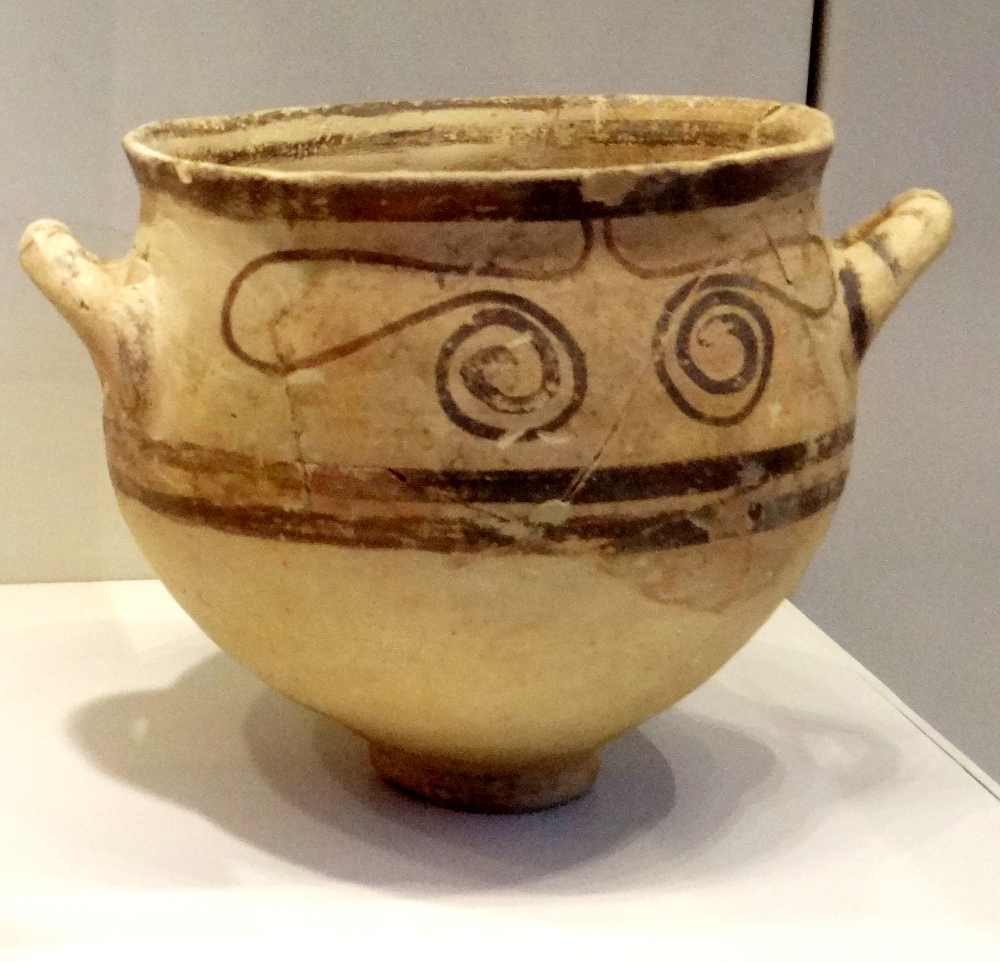

# Human-made Things in the Bible

## License Information

Human-made Things in the Bible © United Bible Societies, 2025. Adapted from: <cite>The Works of Their Hands: Man-made Things in the Bible</cite>, by Ray Pritz © 2009 United Bible Societies. This work is licensed under Creative Commons Attribution-ShareAlike 4.0 International (<a href="https://creativecommons.org/licenses/by-sa/4.0/">https://creativecommons.org/licenses/by-sa/4.0/</a>).

--------------------------------

## 標題：餐具（eating utensils） (id: REALIA:5.20)

5\.20 標題：餐具（eating utensils）
============================

在聖經時期，人們用盤和碗來盛食物吃，與今天的大多數文化相同；但他們似乎不用筷子、叉子或調羹等餐具從盤子中夾取食物，而是直接用手抓著吃。
-------------------------------------------------------------------

## 標題：碗（bowl） (id: REALIA:5.20.1)

5\.20\.1 標題：碗（bowl）
===================

經文出處
----

Hebrew 來： אַגָּן (音譯： ’agan)

[SNG 7:3](https://ref.ly/Song7:3), [ISA 22:24](https://ref.ly/Isa22:24)

Hebrew 來： גֻּלָּה (音譯： gulah)

[ECC 12:6](https://ref.ly/Eccl12:6), [ZEC 4:2](https://ref.ly/Zech4:2), [ZEC 4:3](https://ref.ly/Zech4:3)

Hebrew 來： מִזְרָק (音譯： mizraq)

[AMO 6:6](https://ref.ly/Amos6:6)

Hebrew 來： מִשְׁאֶרֶת (音譯： mish’ereth)

[EXO 7:28](https://ref.ly/Exod7:28), [EXO 12:34](https://ref.ly/Exod12:34), [DEU 28:5](https://ref.ly/Deut28:5), [DEU 28:17](https://ref.ly/Deut28:17)

Hebrew 來： צְלֹחִית (音譯： tslochith)

[2KI 2:20](https://ref.ly/2Kgs2:20)

Greek 希： ἀργύρωμα (音譯： argurōma)

[JDT 12:1](https://ref.ly/Jdt12:1), [JDT 15:11](https://ref.ly/Jdt15:11), [1MA 15:32](https://ref.ly/1Macc15:32)

Greek 希： ὁλκεῖον (音譯： holkeion)

[JDT 15:11](https://ref.ly/Jdt15:11)

Greek 希： σκάφη (音譯： skafē)

[BEL 1:33](https://ref.ly/Bel1:33)

Greek 希： τρύβλιον (音譯： trublion)

[MAT 26:23](https://ref.ly/Matt26:23), [MRK 14:20](https://ref.ly/Mark14:20), [SIR 31:14](https://ref.ly/Sir31:14)

Greek 希： φιάλη (音譯： fialē)

[REV 5:8](https://ref.ly/Rev5:8), [REV 15:7](https://ref.ly/Rev15:7), [REV 16:1](https://ref.ly/Rev16:1), [REV 16:2](https://ref.ly/Rev16:2), [REV 16:3](https://ref.ly/Rev16:3), [REV 16:4](https://ref.ly/Rev16:4), [REV 16:8](https://ref.ly/Rev16:8), [REV 16:10](https://ref.ly/Rev16:10), [REV 16:12](https://ref.ly/Rev16:12), [REV 16:17](https://ref.ly/Rev16:17), [REV 17:1](https://ref.ly/Rev17:1), [REV 21:9](https://ref.ly/Rev21:9), [EXO 27:3](https://ref.ly/Exod27:3), [EXO 38:23](https://ref.ly/Exod38:23), [NUM 4:14](https://ref.ly/Num4:14), [NUM 7:13](https://ref.ly/Num7:13), [NUM 7:19](https://ref.ly/Num7:19), [NUM 7:25](https://ref.ly/Num7:25), [NUM 7:31](https://ref.ly/Num7:31), [NUM 7:37](https://ref.ly/Num7:37), [NUM 7:43](https://ref.ly/Num7:43), [NUM 7:49](https://ref.ly/Num7:49), [NUM 7:55](https://ref.ly/Num7:55), [NUM 7:61](https://ref.ly/Num7:61), [NUM 7:67](https://ref.ly/Num7:67), [NUM 7:73](https://ref.ly/Num7:73), [NUM 7:79](https://ref.ly/Num7:79), [NUM 7:84](https://ref.ly/Num7:84), [NUM 7:85](https://ref.ly/Num7:85), [1KI 7:26](https://ref.ly/1Kgs7:26), [1KI 7:31](https://ref.ly/1Kgs7:31), [1KI 7:36](https://ref.ly/1Kgs7:36), [2KI 12:14](https://ref.ly/2Kgs12:14), [2KI 25:14](https://ref.ly/2Kgs25:14), [2KI 25:15](https://ref.ly/2Kgs25:15), [1CH 28:17](https://ref.ly/1Chr28:17), [2CH 4:8](https://ref.ly/2Chr4:8), [2CH 4:21](https://ref.ly/2Chr4:21), [PRO 23:31](https://ref.ly/Prov23:31), [SNG 5:13](https://ref.ly/Song5:13), [SNG 6:2](https://ref.ly/Song6:2), [JER 52:18](https://ref.ly/Jer52:18), [ZEC 9:15](https://ref.ly/Zech9:15), [ZEC 14:20](https://ref.ly/Zech14:20), [1MA 1:22](https://ref.ly/1Macc1:22), [1ES 2:10](https://ref.ly/1Esd2:10)

Greek 希： χρύσωμα (音譯： chrusōma)

[1MA 15:32](https://ref.ly/1Macc15:32)

描述和用途
-----

碗是一種凹形餐具，用來盛放、烹煮食物或液體，直徑和深度差別很大。碗通常是用燒製的黏土做成的，但[REV 5:8](https://ref.ly/Rev5:8) 特別提到金子做的碗。由於碗的大小和深度頗不相同，而杯子又通常沒有把手，所以較小的碗和杯子看起來基本上沒有什麼區別。[5\.20\.3 杯子 (cup)\<REALIA:5\.20\.3\>](#) 下的第一個插圖也繪出了碗。

---

翻譯
--

在[ZEC 4:2](https://ref.ly/Zech4:2) 中，讀者可能不會立時明白碗（希伯來文*gulah* ；《和修》「燈座」）的用途。我們建議翻譯者借鑒GNT (Good News Translation (1992)) ，譯為「頂上有用來裝油的碗」。

[AMO 6:6](https://ref.ly/Amos6:6) 中提到的碗是專門用來喝酒的（參[5\.20\.3 杯子 (cup)\<REALIA:5\.20\.3\>](#) ）。翻譯這節經文時，可能要根據當地文化做出適當的調整。例如，在一些文化中，可以使用表示某種大葫蘆的詞語，或者使用葫蘆的統稱，並用「大」和「滿」等詞語加以修飾。

希伯來文*mish’ereth* 指的是一種大碗，用來揉麵和發酵，然後進行烘烤。大多數譯本譯為「揉麵碗」（“kneading bowls”；RSV (Revised Standard Version (1952)) 、NJPSV (New Jewish Publication Society Version) ）或「揉麵槽」（“kneading troughs”；NIV (New International Version (1984)) 、REB (Revised English Bible (1989)) ）。GNT (Good News Translation (1992)) 的“baking pans”（「烤盤」）可能會誤導讀者。如果沒有表示這種碗的專門詞語，或者這種碗不為人所熟知，翻譯者可以遵循CEV (Contemporary English Version) 的範例，譯為“bowls of bread dough”（「麵團碗」）。

在[MAT 26:23](https://ref.ly/Matt26:23) 和[MRK 14:20](https://ref.ly/Mark14:20) 中，希臘文*trublion* 可以理解為一句慣用語的一部分，這個慣用語的字面意思是，「和某人一起把手伸進碗裡」。大多數譯本基本上是按照字面來翻譯這個慣用語的，但這可能會讓讀者產生誤解，以為人是把手指放到碗裡，而不是用手拿著食物在碗裡蘸一下。如果翻譯者想要在某種程度上直譯這個慣用語，最好譯成「和某人一起把食物在碗裡蘸一下」，或「一起把食物在醬汁裡蘸一下」。我們建議把這個慣用語譯為：「和某人分享餐食」，或「和某人一起吃飯」。[MRK 14:20](https://ref.ly/Mark14:20) 的後半節可譯為，「一個正和我一起在這個盤子裡吃飯的人」（如CEV (Contemporary English Version) ），或「正和我一起吃飯的一個人」（如NLT (New Living Translation) ）。

[1MA 15:32](https://ref.ly/1Macc15:32) ：希臘文*chrusōma* 的字面意思是「黃金物件」。然而，該詞在這裡指的是金或鍍金的餐具。GNT (Good News Translation (1992)) 和NRSV (New Revised Standard Version (1989)) 譯為“gold\[en] bowls”（「金碗」）。

* **Associated Passages:** 雅歌 7:3; 以賽亞書 22:24; 傳道書 12:6; 撒迦利亞書 4:2; 撒迦利亞書 4:3; 阿摩司書 6:6; 出埃及記 7:28; 出埃及記 12:34; 申命記 28:5; 申命記 28:17; 列王紀下 2:20; 友弟德傳 12:1; 友弟德傳 15:11; 瑪加伯上 15:32; 彼勒與大龍 1:33; 馬太福音 26:23; 馬可福音 14:20; 德訓篇 31:14; 啟示錄 5:8; 啟示錄 15:7; 啟示錄 16:1; 啟示錄 16:2; 啟示錄 16:3; 啟示錄 16:4; 啟示錄 16:8; 啟示錄 16:10; 啟示錄 16:12; 啟示錄 16:17; 啟示錄 17:1; 啟示錄 21:9; 出埃及記 27:3; 出埃及記 38:23; 民數記 4:14; 民數記 7:13; 民數記 7:19; 民數記 7:25; 民數記 7:31; 民數記 7:37; 民數記 7:43; 民數記 7:49; 民數記 7:55; 民數記 7:61; 民數記 7:67; 民數記 7:73; 民數記 7:79; 民數記 7:84; 民數記 7:85; 列王紀上 7:26; 列王紀上 7:31; 列王紀上 7:36; 列王紀下 12:14; 列王紀下 25:14; 列王紀下 25:15; 歷代志上 28:17; 歷代志下 4:8; 歷代志下 4:21; 箴言 23:31; 雅歌 5:13; 雅歌 6:2; 耶利米書 52:18; 撒迦利亞書 9:15; 撒迦利亞書 14:20; 瑪加伯上 1:22; 厄斯德拉上 2:10

* **Associated ACAI Concepts:** Bowl (ID: `realia:Bowl.2`)

## 標題：盤子（plate, platter） (id: REALIA:5.20.2)

5\.20\.2 標題：盤子（plate, platter）
==============================

經文出處
----

Hebrew 來： צַלַּחַת (音譯： tsalachath)

[2KI 21:13](https://ref.ly/2Kgs21:13), [PRO 19:24](https://ref.ly/Prov19:24), [PRO 26:15](https://ref.ly/Prov26:15)

Greek 希： παροψίς (音譯： paropsis)

[MAT 23:25](https://ref.ly/Matt23:25)

Greek 希： πίναξ (音譯： pinax)

[MAT 14:8](https://ref.ly/Matt14:8), [MAT 14:11](https://ref.ly/Matt14:11), [MRK 6:25](https://ref.ly/Mark6:25), [MRK 6:28](https://ref.ly/Mark6:28), [LUK 11:39](https://ref.ly/Luke11:39)

描述和用途
-----

*大盤子 (Gary Todd, Israel Museum, CC0, via Wikimedia Commons)*

盤子是一種扁平的餐具，人們用來吃飯或盛食物。盤子通常是由黏土燒製而成，但王室和富人的餐具可能是用貴重金屬做成的。

---

翻譯
--

[PRO 19:24](https://ref.ly/Prov19:24); [PRO 26:15](https://ref.ly/Prov26:15) ：這兩節經文描述懶惰人把手放在盤子裡，但卻不舉到嘴邊。在許多文化中，這句話可能會被讀者誤以為他懶得去拿叉子，而是直接用手來抓食物。然而，這不是該則箴言的重點。在當時，用手拿東西吃是正常的。這個人的懶惰在於他甚至不願抬起手把食物送到嘴裡！翻譯者要把重點放在這個人懶惰的真正含義上。GNT (Good News Translation (1992)) 和CEV (Contemporary English Version) 為[PRO 19:24](https://ref.ly/Prov19:24) 提供了兩個很好的翻譯範例：GNT (Good News Translation (1992)) 英文意為「有些人甚至懶得把食物放到嘴裡」，CEV (Contemporary English Version) 則作「有些人甚至懶得伸手吃飯」。

[MAT 14:8](https://ref.ly/Matt14:8) ：希臘文*pinax* 可以泛指任何扁平的盤子；該詞最初的意思是「板」或「厚板」。如果目標語言的文化通常不使用盤子，那麽可以譯作「碗」或其他通常用來盛食物的器皿。

* **Associated Passages:** 列王紀下 21:13; 箴言 19:24; 箴言 26:15; 馬太福音 23:25; 馬太福音 14:8; 馬太福音 14:11; 馬可福音 6:25; 馬可福音 6:28; 路加福音 11:39

* **Associated ACAI Concepts:** Plate (ID: `realia:Plate.2`)

## 標題：杯子（cup） (id: REALIA:5.20.3)

5\.20\.3 標題：杯子（cup）
===================

經文出處
----

Hebrew 來： גָּבִיעַ (音譯： gavi‘a)

[GEN 44:2](https://ref.ly/Gen44:2), [GEN 44:2](https://ref.ly/Gen44:2), [GEN 44:12](https://ref.ly/Gen44:12), [GEN 44:16](https://ref.ly/Gen44:16), [GEN 44:17](https://ref.ly/Gen44:17), [EXO 25:31](https://ref.ly/Exod25:31), [EXO 25:33](https://ref.ly/Exod25:33), [EXO 25:33](https://ref.ly/Exod25:33), [EXO 25:34](https://ref.ly/Exod25:34), [EXO 37:17](https://ref.ly/Exod37:17), [EXO 37:19](https://ref.ly/Exod37:19), [EXO 37:19](https://ref.ly/Exod37:19), [EXO 37:20](https://ref.ly/Exod37:20), [JER 35:5](https://ref.ly/Jer35:5)

Hebrew 來： כּוֹס (音譯： kos)

[GEN 40:11](https://ref.ly/Gen40:11), [GEN 40:11](https://ref.ly/Gen40:11), [GEN 40:11](https://ref.ly/Gen40:11), [GEN 40:13](https://ref.ly/Gen40:13), [GEN 40:21](https://ref.ly/Gen40:21), [2SA 12:3](https://ref.ly/2Sam12:3), [1KI 7:26](https://ref.ly/1Kgs7:26), [2CH 4:5](https://ref.ly/2Chr4:5), [PSA 11:6](https://ref.ly/Ps11:6), [PSA 16:5](https://ref.ly/Ps16:5), [PSA 23:5](https://ref.ly/Ps23:5), [PSA 75:9](https://ref.ly/Ps75:9), [PSA 116:13](https://ref.ly/Ps116:13), [PRO 23:31](https://ref.ly/Prov23:31), [ISA 51:17](https://ref.ly/Isa51:17), [ISA 51:17](https://ref.ly/Isa51:17), [ISA 51:22](https://ref.ly/Isa51:22), [ISA 51:22](https://ref.ly/Isa51:22), [JER 16:7](https://ref.ly/Jer16:7), [JER 25:15](https://ref.ly/Jer25:15), [JER 25:17](https://ref.ly/Jer25:17), [JER 25:28](https://ref.ly/Jer25:28), [JER 35:5](https://ref.ly/Jer35:5), [JER 49:12](https://ref.ly/Jer49:12), [JER 51:7](https://ref.ly/Jer51:7), [LAM 4:21](https://ref.ly/Lam4:21), [EZK 23:31](https://ref.ly/Ezek23:31), [EZK 23:32](https://ref.ly/Ezek23:32), [EZK 23:33](https://ref.ly/Ezek23:33), [EZK 23:33](https://ref.ly/Ezek23:33), [HAB 2:16](https://ref.ly/Hab2:16)

Hebrew 來： סַף (音譯： saf)

[ZEC 12:2](https://ref.ly/Zech12:2)

Hebrew 來： סֵפֶל (音譯： sefel)

[JDG 5:25](https://ref.ly/Judg5:25), [JDG 6:38](https://ref.ly/Judg6:38)

Greek 希： ποτήριον (音譯： potērion)

[GEN 40:11](https://ref.ly/Gen40:11), [GEN 40:11](https://ref.ly/Gen40:11), [GEN 40:11](https://ref.ly/Gen40:11), [GEN 40:13](https://ref.ly/Gen40:13), [GEN 40:21](https://ref.ly/Gen40:21), [2SA 12:3](https://ref.ly/2Sam12:3), [1KI 7:12](https://ref.ly/1Kgs7:12), [2CH 4:5](https://ref.ly/2Chr4:5), [PSA 10:6](https://ref.ly/Ps10:6), [PSA 15:5](https://ref.ly/Ps15:5), [PSA 22:5](https://ref.ly/Ps22:5), [PSA 74:9](https://ref.ly/Ps74:9), [PSA 115:4](https://ref.ly/Ps115:4), [PRO 23:31](https://ref.ly/Prov23:31), [ISA 51:17](https://ref.ly/Isa51:17), [ISA 51:17](https://ref.ly/Isa51:17), [ISA 51:22](https://ref.ly/Isa51:22), [JER 16:7](https://ref.ly/Jer16:7), [JER 28:7](https://ref.ly/Jer28:7), [JER 30:6](https://ref.ly/Jer30:6), [JER 32:15](https://ref.ly/Jer32:15), [JER 32:17](https://ref.ly/Jer32:17), [JER 32:28](https://ref.ly/Jer32:28), [JER 42:5](https://ref.ly/Jer42:5), [LAM 2:13](https://ref.ly/Lam2:13), [LAM 4:21](https://ref.ly/Lam4:21), [EZK 23:31](https://ref.ly/Ezek23:31), [EZK 23:32](https://ref.ly/Ezek23:32), [EZK 23:33](https://ref.ly/Ezek23:33), [EZK 23:33](https://ref.ly/Ezek23:33), [HAB 2:16](https://ref.ly/Hab2:16), [MAT 10:42](https://ref.ly/Matt10:42), [MAT 20:22](https://ref.ly/Matt20:22), [MAT 20:23](https://ref.ly/Matt20:23), [MAT 23:25](https://ref.ly/Matt23:25), [MAT 23:26](https://ref.ly/Matt23:26), [MAT 26:27](https://ref.ly/Matt26:27), [MAT 26:39](https://ref.ly/Matt26:39), [MRK 7:4](https://ref.ly/Mark7:4), [MRK 9:41](https://ref.ly/Mark9:41), [MRK 10:38](https://ref.ly/Mark10:38), [MRK 10:39](https://ref.ly/Mark10:39), [MRK 14:23](https://ref.ly/Mark14:23), [MRK 14:36](https://ref.ly/Mark14:36), [LUK 11:39](https://ref.ly/Luke11:39), [LUK 22:17](https://ref.ly/Luke22:17), [LUK 22:20](https://ref.ly/Luke22:20), [LUK 22:20](https://ref.ly/Luke22:20), [LUK 22:42](https://ref.ly/Luke22:42), [JHN 18:11](https://ref.ly/John18:11), [1CO 10:16](https://ref.ly/1Cor10:16), [1CO 10:21](https://ref.ly/1Cor10:21), [1CO 10:21](https://ref.ly/1Cor10:21), [1CO 11:25](https://ref.ly/1Cor11:25), [1CO 11:25](https://ref.ly/1Cor11:25), [1CO 11:26](https://ref.ly/1Cor11:26), [1CO 11:27](https://ref.ly/1Cor11:27), [1CO 11:28](https://ref.ly/1Cor11:28), [REV 14:10](https://ref.ly/Rev14:10), [REV 16:19](https://ref.ly/Rev16:19), [REV 17:4](https://ref.ly/Rev17:4), [REV 18:6](https://ref.ly/Rev18:6), [ESG 1:7](https://ref.ly/EsthGr1:7), [PSS 8:14](https://ref.ly/PssSol8:14)

Greek 希： σπονδεῖον (音譯： spondeion)

[SIR 50:15](https://ref.ly/Sir50:15), [1MA 1:22](https://ref.ly/1Macc1:22), [1ES 2:9](https://ref.ly/1Esd2:9), [1ES 2:9](https://ref.ly/1Esd2:9)

Greek 希： χρύσωμα (音譯： chrusōma)

[1MA 11:58](https://ref.ly/1Macc11:58), [1MA 11:58](https://ref.ly/1Macc11:58), [1ES 3:6](https://ref.ly/1Esd3:6)

Latin 拉： calix

[2ES 14:39](https://ref.ly/2Esd14:39)

描述和用途
-----

杯子是用來喝東西的器皿。普通的杯子是用陶土做的，有些會進行燒製並上釉。到了新約時期，玻璃杯子已經很常見了。富人經常使用銅、銀或金製成的杯子。杯子有圓柱形的，類似於現代的杯子；也有碗狀的半球形。不管是哪種形狀，杯子都可能有一個或兩個把手，或沒有把手。

---

翻譯
--

*飲用容器 (© Deutsche Bibelgesellschaft, Stuttgart by United Bible Societies)*

考古學家已經發現了許多類似現代飲料杯的物品，然而在古代，人們通常用類似小碗的器具來喝東西。從歷史發展的角度來看，最開始用來喝東西的器皿可能是碗。希伯來文*sefel* 指的是在碗之後出現的一種器皿。這種器皿的高度和直徑差不多，還帶有把手。

上面列出的幾個詞語都可以譯為「杯子」或「碗」，各譯本也體現出這一點。有些譯本譯為「喝東西用的碗」（“drinking bowl”）。然而，在大多數語言中，「杯子」的統稱已經是足夠貼近的對等詞了。

在[GEN 44:0](https://ref.ly/Gen44:0) 中，希伯來文*gavi‘a* 指的是一種特殊的杯子，經文明確說這是一種銀製的杯子。翻譯者要避免譯作用其他材料做成的飲器，例如葫蘆，也不要譯成用木頭或黏土做成的杯子。

[MAT 10:42](https://ref.ly/Matt10:42); [MRK 9:41](https://ref.ly/Mark9:41) ：在[MRK 9:41](https://ref.ly/Mark9:41) 中，有些語言將字面意為「一杯水」（“cup of water”）的短語譯成「杯中的水」；原文中的「杯」不僅表示容器，還表示水量。但是，這裡「一杯水」的對等詞更有可能是「一口水」（“drink of water”；GNT (Good News Translation (1992)) ）。在有些地方，「一杯水」是一種很奇怪、外來味道很濃的表達方式，因此有些翻譯者可能會發現，像「一瓢水」這樣的表達不僅更自然，而且在語義上也與「一口水」更相近。

[1MA 11:58](https://ref.ly/1Macc11:58) 和[1ES 3:6](https://ref.ly/1Esd3:6) 的原文字面作「用金的喝」，意思顯然是「用金杯喝」或「用金的器皿喝」。

* **Associated Passages:** 創世記 44:2; 創世記 44:12; 創世記 44:16; 創世記 44:17; 出埃及記 25:31; 出埃及記 25:33; 出埃及記 25:34; 出埃及記 37:17; 出埃及記 37:19; 出埃及記 37:20; 耶利米書 35:5; 創世記 40:11; 創世記 40:13; 創世記 40:21; 撒母耳記下 12:3; 列王紀上 7:26; 歷代志下 4:5; 詩篇 11:6; 詩篇 16:5; 詩篇 23:5; 詩篇 75:9; 詩篇 116:13; 箴言 23:31; 以賽亞書 51:17; 以賽亞書 51:22; 耶利米書 16:7; 耶利米書 25:15; 耶利米書 25:17; 耶利米書 25:28; 耶利米書 49:12; 耶利米書 51:7; 耶利米哀歌 4:21; 以西結書 23:31; 以西結書 23:32; 以西結書 23:33; 哈巴谷書 2:16; 撒迦利亞書 12:2; 士師記 5:25; 士師記 6:38; 列王紀上 7:12; 詩篇 10:6; 詩篇 15:5; 詩篇 22:5; 詩篇 74:9; 詩篇 115:4; 耶利米書 28:7; 耶利米書 30:6; 耶利米書 32:15; 耶利米書 32:17; 耶利米書 32:28; 耶利米書 42:5; 耶利米哀歌 2:13; 馬太福音 10:42; 馬太福音 20:22; 馬太福音 20:23; 馬太福音 23:25; 馬太福音 23:26; 馬太福音 26:27; 馬太福音 26:39; 馬可福音 7:4; 馬可福音 9:41; 馬可福音 10:38; 馬可福音 10:39; 馬可福音 14:23; 馬可福音 14:36; 路加福音 11:39; 路加福音 22:17; 路加福音 22:20; 路加福音 22:42; 約翰福音 18:11; 哥林多前書 10:16; 哥林多前書 10:21; 哥林多前書 11:25; 哥林多前書 11:26; 哥林多前書 11:27; 哥林多前書 11:28; 啟示錄 14:10; 啟示錄 16:19; 啟示錄 17:4; 啟示錄 18:6; 以斯帖記補篇 1:7; 所羅門詩篇 8:14; 德訓篇 50:15; 瑪加伯上 1:22; 厄斯德拉上 2:9; 瑪加伯上 11:58; 厄斯德拉上 3:6; 厄斯德拉下 14:39; 創世記 44:0

* **Associated ACAI Concepts:** Cup (ID: `realia:Cup`)

## 標題：刀（knife） (id: REALIA:5.20.4)

5\.20\.4 標題：刀（knife）
====================

經文出處
----

Hebrew 來： חֶרֶב, צוּר (音譯： cherev tsur)

[JOS 5:2](https://ref.ly/Josh5:2), [JOS 5:3](https://ref.ly/Josh5:3)

Hebrew 來： מַאֲכֶלֶת (音譯： ma’akeleth)

[GEN 22:6](https://ref.ly/Gen22:6), [GEN 22:10](https://ref.ly/Gen22:10), [JDG 19:29](https://ref.ly/Judg19:29), [PRO 30:14](https://ref.ly/Prov30:14)

Hebrew 來： שַׂכִּין (音譯： sakin)

[PRO 23:2](https://ref.ly/Prov23:2)

描述和用途
-----

*鐵製和木製刀，字母洞穴（Cave of the Letters），哈爾赫貝耳（Nahal Hever）（公元132–135年），以色列博物館 (© Chamberi, CC BY\-SA 3\.0, via Wikimedia Commons)*

刀是帶柄的小刀片，用來切肉和其他食物。

---

翻譯
--

上面列出的希伯來文詞語指的是一種鋒利的刀，可能帶尖。翻譯者應避免使用僅指較鈍的刀的詞語，例如用來把果醬等物塗到麵包上面的那種刀。

[JOS 5:2](https://ref.ly/Josh5:2); [JOS 5:3](https://ref.ly/Josh5:3) ：希伯來文*cherev* 通常指劍（參[2\.3 刀劍 (sword)\<REALIA:2\.3\>](#) ）。這裡的語境是施行精密的割禮手術，所以顯然是一把較小的刀具。希伯來文修飾語*tsur* 表明這種刀是用一種非常堅硬的石英石（燧石）製成的。從遠古時代起，人們就使用由燧石製成的工具和武器，通過剝片獲得鋒利的邊緣。

* **Associated Passages:** 約書亞記 5:2; 約書亞記 5:3; 創世記 22:6; 創世記 22:10; 士師記 19:29; 箴言 30:14; 箴言 23:2

* **Associated ACAI Concepts:** Knife (ID: `realia:Knife`)
