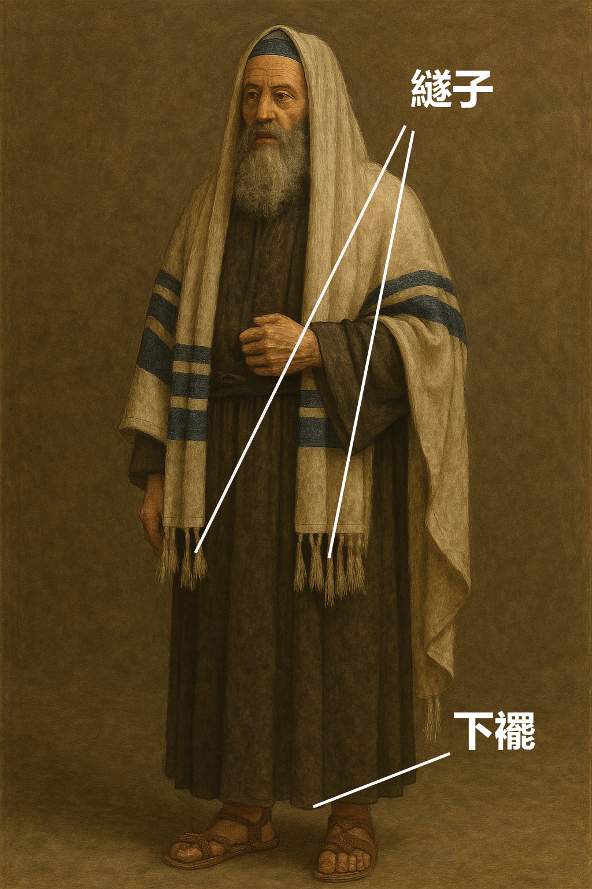

# Human-made Things in the Bible

## License Information

Human-made Things in the Bible © United Bible Societies, 2025. Adapted from: <cite>The Works of Their Hands: Man-made Things in the Bible</cite>, by Ray Pritz © 2009 United Bible Societies. This work is licensed under Creative Commons Attribution-ShareAlike 4.0 International (<a href="https://creativecommons.org/licenses/by-sa/4.0/">https://creativecommons.org/licenses/by-sa/4.0/</a>).

--------------------------------

## 標題：外衣、外袍、披風、長袍（outer garment, cloak, mantle, robe） (id: REALIA:6.2)

6\.2 標題：外衣、外袍、披風、長袍（outer garment, cloak, mantle, robe）
=======================================================

經文出處
----

Hebrew 來： כְּסוּת (音譯： ksuth)

[DEU 22:12](https://ref.ly/Deut22:12)

Hebrew 來： מַחֲלָצוֹת (音譯： machalatsah)

[ISA 3:22](https://ref.ly/Isa3:22), [ZEC 3:4](https://ref.ly/Zech3:4)

Hebrew 來： מִטְפַּחַת (音譯： mitpachath)

[RUT 3:15](https://ref.ly/Ruth3:15), [ISA 3:22](https://ref.ly/Isa3:22)

Hebrew 來： מְעִיל (音譯： m‘il)

[1SA 2:19](https://ref.ly/1Sam2:19), [1SA 15:27](https://ref.ly/1Sam15:27), [1SA 18:4](https://ref.ly/1Sam18:4), [1SA 24:5](https://ref.ly/1Sam24:5), [1SA 24:12](https://ref.ly/1Sam24:12), [1SA 24:12](https://ref.ly/1Sam24:12), [1SA 28:14](https://ref.ly/1Sam28:14), [2SA 13:18](https://ref.ly/2Sam13:18), [1CH 15:27](https://ref.ly/1Chr15:27), [EZR 9:3](https://ref.ly/Ezra9:3), [EZR 9:5](https://ref.ly/Ezra9:5), [JOB 1:20](https://ref.ly/Job1:20), [JOB 2:12](https://ref.ly/Job2:12), [JOB 29:14](https://ref.ly/Job29:14), [PSA 109:29](https://ref.ly/Ps109:29), [ISA 59:17](https://ref.ly/Isa59:17), [ISA 61:10](https://ref.ly/Isa61:10), [EZK 26:16](https://ref.ly/Ezek26:16)

Hebrew 來： מַעֲטֶפֶת (音譯： ma‘atefeth)

[ISA 3:22](https://ref.ly/Isa3:22)

Hebrew 來： שַׂלְמָה (音譯： salmah)

[EXO 22:8](https://ref.ly/Exod22:8), [EXO 22:25](https://ref.ly/Exod22:25), [DEU 24:13](https://ref.ly/Deut24:13), [DEU 29:4](https://ref.ly/Deut29:4), [JOS 9:5](https://ref.ly/Josh9:5), [JOS 9:13](https://ref.ly/Josh9:13), [JOS 22:8](https://ref.ly/Josh22:8), [1KI 10:25](https://ref.ly/1Kgs10:25), [1KI 11:29](https://ref.ly/1Kgs11:29), [1KI 11:30](https://ref.ly/1Kgs11:30), [2CH 9:24](https://ref.ly/2Chr9:24), [NEH 9:21](https://ref.ly/Neh9:21), [JOB 9:31](https://ref.ly/Job9:31), [PSA 104:2](https://ref.ly/Ps104:2), [SNG 4:11](https://ref.ly/Song4:11), [MIC 2:8](https://ref.ly/Mic2:8)

Hebrew 來： שִׂמְלָה (音譯： simlah)

[GEN 9:23](https://ref.ly/Gen9:23), [GEN 35:2](https://ref.ly/Gen35:2), [GEN 37:34](https://ref.ly/Gen37:34), [GEN 41:14](https://ref.ly/Gen41:14), [GEN 44:13](https://ref.ly/Gen44:13), [GEN 45:22](https://ref.ly/Gen45:22), [GEN 45:22](https://ref.ly/Gen45:22), [EXO 3:22](https://ref.ly/Exod3:22), [EXO 12:34](https://ref.ly/Exod12:34), [EXO 12:35](https://ref.ly/Exod12:35), [EXO 19:10](https://ref.ly/Exod19:10), [EXO 19:14](https://ref.ly/Exod19:14), [EXO 22:26](https://ref.ly/Exod22:26), [DEU 8:4](https://ref.ly/Deut8:4), [DEU 10:18](https://ref.ly/Deut10:18), [DEU 21:13](https://ref.ly/Deut21:13), [DEU 22:3](https://ref.ly/Deut22:3), [DEU 22:5](https://ref.ly/Deut22:5), [JOS 7:6](https://ref.ly/Josh7:6), [JDG 8:25](https://ref.ly/Judg8:25), [RUT 3:3](https://ref.ly/Ruth3:3), [RUT 3:3](https://ref.ly/Ruth3:3), [2SA 12:20](https://ref.ly/2Sam12:20), [2SA 12:20](https://ref.ly/2Sam12:20), [PRO 30:4](https://ref.ly/Prov30:4), [ISA 3:6](https://ref.ly/Isa3:6), [ISA 3:7](https://ref.ly/Isa3:7), [ISA 4:1](https://ref.ly/Isa4:1), [ISA 9:4](https://ref.ly/Isa9:4)

Aramaic 蘭：סַרְבָּל (音譯： sarbal)

[DAN 3:21](https://ref.ly/Dan3:21), [DAN 3:27](https://ref.ly/Dan3:27)

Greek 希： διπλοΐς (音譯： diplois)

[BAR 5:2](https://ref.ly/Bar5:2)

Greek 希： ἐπενδύτης (音譯： ependutēs)

[JHN 21:7](https://ref.ly/John21:7)

Greek 希： ἱμάτιον (音譯： himation)

[MAT 5:40](https://ref.ly/Matt5:40), [MAT 9:16](https://ref.ly/Matt9:16), [MAT 9:16](https://ref.ly/Matt9:16), [MAT 9:20](https://ref.ly/Matt9:20), [MAT 9:21](https://ref.ly/Matt9:21), [MAT 14:36](https://ref.ly/Matt14:36), [MAT 17:2](https://ref.ly/Matt17:2), [MAT 21:7](https://ref.ly/Matt21:7), [MAT 21:8](https://ref.ly/Matt21:8), [MAT 24:18](https://ref.ly/Matt24:18), [MAT 27:31](https://ref.ly/Matt27:31), [MAT 27:35](https://ref.ly/Matt27:35), [MRK 2:21](https://ref.ly/Mark2:21), [MRK 5:27](https://ref.ly/Mark5:27), [MRK 5:28](https://ref.ly/Mark5:28), [MRK 5:30](https://ref.ly/Mark5:30), [MRK 6:56](https://ref.ly/Mark6:56), [MRK 9:3](https://ref.ly/Mark9:3), [MRK 10:50](https://ref.ly/Mark10:50), [MRK 11:7](https://ref.ly/Mark11:7), [MRK 11:8](https://ref.ly/Mark11:8), [MRK 13:16](https://ref.ly/Mark13:16), [MRK 15:20](https://ref.ly/Mark15:20), [MRK 15:24](https://ref.ly/Mark15:24), [LUK 5:36](https://ref.ly/Luke5:36), [LUK 5:36](https://ref.ly/Luke5:36), [LUK 6:29](https://ref.ly/Luke6:29), [LUK 7:25](https://ref.ly/Luke7:25), [LUK 8:27](https://ref.ly/Luke8:27), [LUK 8:44](https://ref.ly/Luke8:44), [LUK 19:35](https://ref.ly/Luke19:35), [LUK 19:36](https://ref.ly/Luke19:36), [LUK 22:36](https://ref.ly/Luke22:36), [LUK 23:34](https://ref.ly/Luke23:34), [JHN 13:4](https://ref.ly/John13:4), [JHN 13:12](https://ref.ly/John13:12), [JHN 19:2](https://ref.ly/John19:2), [JHN 19:5](https://ref.ly/John19:5), [JHN 19:23](https://ref.ly/John19:23), [JHN 19:24](https://ref.ly/John19:24), [ACT 7:58](https://ref.ly/Acts7:58), [ACT 9:39](https://ref.ly/Acts9:39), [ACT 12:8](https://ref.ly/Acts12:8), [ACT 14:14](https://ref.ly/Acts14:14), [ACT 16:22](https://ref.ly/Acts16:22), [ACT 18:6](https://ref.ly/Acts18:6), [ACT 22:20](https://ref.ly/Acts22:20), [ACT 22:23](https://ref.ly/Acts22:23), [HEB 1:11](https://ref.ly/Heb1:11), [HEB 1:12](https://ref.ly/Heb1:12), [JAS 5:2](https://ref.ly/Jas5:2), [1PE 3:3](https://ref.ly/1Pet3:3), [REV 3:4](https://ref.ly/Rev3:4), [REV 3:5](https://ref.ly/Rev3:5), [REV 3:18](https://ref.ly/Rev3:18), [REV 4:4](https://ref.ly/Rev4:4), [REV 16:15](https://ref.ly/Rev16:15), [REV 19:13](https://ref.ly/Rev19:13), [REV 19:16](https://ref.ly/Rev19:16), [TOB 1:17](https://ref.ly/Tob1:17), [TOB 4:16](https://ref.ly/Tob4:16), [JDT 8:5](https://ref.ly/Jdt8:5), [JDT 10:3](https://ref.ly/Jdt10:3), [JDT 10:3](https://ref.ly/Jdt10:3), [JDT 14:16](https://ref.ly/Jdt14:16), [ESG 4:1](https://ref.ly/EsthGr4:1), [ESG 4:17](https://ref.ly/EsthGr4:17), [ESG 4:17](https://ref.ly/EsthGr4:17), [ESG 5:1](https://ref.ly/EsthGr5:1), [SIR 11:4](https://ref.ly/Sir11:4), [SIR 14:17](https://ref.ly/Sir14:17), [SIR 29:21](https://ref.ly/Sir29:21), [SIR 39:26](https://ref.ly/Sir39:26), [SIR 42:13](https://ref.ly/Sir42:13), [1MA 2:14](https://ref.ly/1Macc2:14), [1MA 3:47](https://ref.ly/1Macc3:47), [1MA 3:49](https://ref.ly/1Macc3:49), [1MA 4:39](https://ref.ly/1Macc4:39), [1MA 5:14](https://ref.ly/1Macc5:14), [1MA 10:62](https://ref.ly/1Macc10:62), [1MA 11:71](https://ref.ly/1Macc11:71), [1MA 13:45](https://ref.ly/1Macc13:45), [1ES 8:68](https://ref.ly/1Esd8:68), [1ES 8:70](https://ref.ly/1Esd8:70)

Greek 希： ἱματισμός (音譯： himatismos)

[LUK 7:25](https://ref.ly/Luke7:25), [LUK 9:29](https://ref.ly/Luke9:29), [JHN 19:24](https://ref.ly/John19:24), [ACT 20:33](https://ref.ly/Acts20:33), [1TI 2:9](https://ref.ly/1Tim2:9), [PSS 11:7](https://ref.ly/PssSol11:7), [JDT 12:15](https://ref.ly/Jdt12:15), [LJE 1:11](https://ref.ly/EpJer1:11), [LJE 1:19](https://ref.ly/EpJer1:19), [LJE 1:32](https://ref.ly/EpJer1:32), [LJE 1:57](https://ref.ly/EpJer1:57), [1MA 11:24](https://ref.ly/1Macc11:24)

Greek 希： περιβόλαιον (音譯： peribolaion)

[1CO 11:15](https://ref.ly/1Cor11:15), [HEB 1:12](https://ref.ly/Heb1:12)

Greek 希： ποδήρης (音譯： podērēs)

[REV 1:13](https://ref.ly/Rev1:13), [SIR 27:8](https://ref.ly/Sir27:8)

Greek 希： στολή (音譯： stolē)

[MRK 12:38](https://ref.ly/Mark12:38), [MRK 16:5](https://ref.ly/Mark16:5), [LUK 15:22](https://ref.ly/Luke15:22), [LUK 20:46](https://ref.ly/Luke20:46), [REV 6:11](https://ref.ly/Rev6:11), [REV 7:9](https://ref.ly/Rev7:9), [REV 7:13](https://ref.ly/Rev7:13), [REV 7:14](https://ref.ly/Rev7:14), [REV 22:14](https://ref.ly/Rev22:14), [JDT 10:7](https://ref.ly/Jdt10:7), [JDT 16:7](https://ref.ly/Jdt16:7), [JDT 16:8](https://ref.ly/Jdt16:8), [ESG 5:1](https://ref.ly/EsthGr5:1), [ESG 6:8](https://ref.ly/EsthGr6:8), [ESG 6:11](https://ref.ly/EsthGr6:11), [ESG 8:15](https://ref.ly/EsthGr8:15), [SIR 6:29](https://ref.ly/Sir6:29), [SIR 6:31](https://ref.ly/Sir6:31), [SIR 45:10](https://ref.ly/Sir45:10), [SIR 50:11](https://ref.ly/Sir50:11), [BAR 4:20](https://ref.ly/Bar4:20), [BAR 5:1](https://ref.ly/Bar5:1), [1MA 6:15](https://ref.ly/1Macc6:15), [1MA 10:21](https://ref.ly/1Macc10:21), [1MA 14:9](https://ref.ly/1Macc14:9), [2MA 3:15](https://ref.ly/2Macc3:15), [2MA 5:2](https://ref.ly/2Macc5:2), [1ES 4:17](https://ref.ly/1Esd4:17), [1ES 4:54](https://ref.ly/1Esd4:54), [1ES 5:44](https://ref.ly/1Esd5:44), [PSS 11:7](https://ref.ly/PssSol11:7)

Greek 希： φαιλόνης (音譯： failonēs)

[2TI 4:13](https://ref.ly/2Tim4:13)

Greek 希： χλαμύς (音譯： chlamus)

[MAT 27:28](https://ref.ly/Matt27:28), [MAT 27:31](https://ref.ly/Matt27:31), [2MA 12:35](https://ref.ly/2Macc12:35)

描述和用途
-----

*(Image generated by ChatGPT using OpenAI technology)*

外袍是一件長度一直到腳的下垂外衣，通常很寬鬆，能夠覆蓋住全身，在中間用腰帶（參[6\.6 腰帶、皮帶 (waistband, sash, belt)\<REALIA:6\.6\>](#) ）束緊，或用別針、鈕扣等物來固定。各個社會階層的人都會穿著外袍，包括祭司和其他宗教領袖。外袍不僅僅是一件外面的衣服，它還有更多的用途。婦女有時會用外袍的大褶邊來攜帶碗、其他器皿、穀物等（參[EXO 22:26](https://ref.ly/Exod22:26) ）。對窮人來說，外袍還可當作睡覺時蓋的毯子。因此，猶太律法規定，如果拿人的外袍作抵押，則必須在日落前歸還（[EXO 22:25](https://ref.ly/Exod22:25) ［《和》22:26］）。

關於大祭司穿著的長袍，參[4\.5\.3 外袍 (robe)\<REALIA:4\.5\.3\>](#) 。

---

翻譯
--

有幾個希伯來文和希臘文詞語都是指外衣，並且不容易區分。翻譯者需要仔細斟酌具體的上下文，以及候選譯詞在目標語言中的用法，來選擇一個最合適的譯詞。最常見的對等譯詞是意為「大衣」的詞語。在有些經文中，長袍具有重要的文化意義，表示較高的社會地位和高尚的職業或活動。

有些經文提到人們出於悲痛而撕裂衣服（參[GEN 37:34](https://ref.ly/Gen37:34); [JOS 7:6](https://ref.ly/Josh7:6); [2SA 1:11](https://ref.ly/2Sam1:11); [2SA 3:31](https://ref.ly/2Sam3:31); [2SA 13:31](https://ref.ly/2Sam13:31); [2KI 5:7](https://ref.ly/2Kgs5:7); [EZR 9:3](https://ref.ly/Ezra9:3); [EZR 9:5](https://ref.ly/Ezra9:5); [EST 4:1](https://ref.ly/Esth4:1); [JOB 1:20](https://ref.ly/Job1:20); [JOB 2:12](https://ref.ly/Job2:12) ）。翻譯者可以擴展翻譯「撕裂衣服」一語；例如，在[JOB 1:20](https://ref.ly/Job1:20) a，GNT (Good News Translation (1992)) 譯作“Then Job got up and tore his clothes in grief”（英文直譯：「約伯便起來，由於悲痛而撕裂了自己的衣服」），這裡補充的「由於悲痛」清楚說明了動作的目的。另外，翻譯者也可以不提到這個動作，只譯出動作的含意；例如，「約伯非常悲痛地站起身來」，或「約伯站起身來，心都碎了」。如果當地文化有表達悲傷的習俗，也可以在經文中保留聖經習俗，然後添加腳註來與當地風俗進行比較，以幫助讀者理解；例如，可以在腳註中指出，「這個動作相當於在臉上塗繪，表示悲傷。」

[RUT 3:15](https://ref.ly/Ruth3:15) ：希伯來文*mitpachath* 通常指一種「紗」（“veil”，KJV (King James Version (1611)) ；比較[ISA 3:22](https://ref.ly/Isa3:22) ）。然而，在這裡的上下文中，一層薄紗顯然不足以承受大麥的重量。較早的譯本將其理解為一種「帶帽子的披風」（“mantle”，RSV (Revised Standard Version (1952)) ），現代的譯本則更傾向於譯為「斗篷」（“cloak”，GNT (Good News Translation (1992)) 、REB (Revised English Bible (1989)) ）。還有譯本使用比較現代的對應詞，如「披肩」（“cape”，CEV (Contemporary English Version) ）或「披巾」（“shawl”，NJPSV (New Jewish Publication Society Version) 、NCV (New Century Version) ）。

[ISA 3:22](https://ref.ly/Isa3:22) ：謝費爾（Sheffer）建議把這節經文中的希伯來文*machalatsoth* （*machalatsah* 的複數）翻譯為「纏腰布」；不過，譯作「斗篷」或「披巾」可能更好。

[1TI 2:9](https://ref.ly/1Tim2:9) ：這節經文中的希臘文*himatismos* 是服飾的通稱，但既然是指女性穿的衣服，那麼譯作「裙子」（“dresses”，GNT (Good News Translation (1992)) ）可能更適合這一語境，前提是「裙子」在當地文化中是女性的日常服飾。然而，在女性日常穿著其他類型服裝的文化中，翻譯者應該使用意思比較寬泛的詞，就像這裡的希臘文那樣。

* **Associated Passages:** 申命記 22:12; 以賽亞書 3:22; 撒迦利亞書 3:4; 路得記 3:15; 撒母耳記上 2:19; 撒母耳記上 15:27; 撒母耳記上 18:4; 撒母耳記上 24:5; 撒母耳記上 24:12; 撒母耳記上 28:14; 撒母耳記下 13:18; 歷代志上 15:27; 以斯拉記 9:3; 以斯拉記 9:5; 約伯記 1:20; 約伯記 2:12; 約伯記 29:14; 詩篇 109:29; 以賽亞書 59:17; 以賽亞書 61:10; 以西結書 26:16; 出埃及記 22:8; 出埃及記 22:25; 申命記 24:13; 申命記 29:4; 約書亞記 9:5; 約書亞記 9:13; 約書亞記 22:8; 列王紀上 10:25; 列王紀上 11:29; 列王紀上 11:30; 歷代志下 9:24; 尼希米記 9:21; 約伯記 9:31; 詩篇 104:2; 雅歌 4:11; 彌迦書 2:8; 創世記 9:23; 創世記 35:2; 創世記 37:34; 創世記 41:14; 創世記 44:13; 創世記 45:22; 出埃及記 3:22; 出埃及記 12:34; 出埃及記 12:35; 出埃及記 19:10; 出埃及記 19:14; 出埃及記 22:26; 申命記 8:4; 申命記 10:18; 申命記 21:13; 申命記 22:3; 申命記 22:5; 約書亞記 7:6; 士師記 8:25; 路得記 3:3; 撒母耳記下 12:20; 箴言 30:4; 以賽亞書 3:6; 以賽亞書 3:7; 以賽亞書 4:1; 以賽亞書 9:4; 但以理書 3:21; 但以理書 3:27; 巴路克 5:2; 約翰福音 21:7; 馬太福音 5:40; 馬太福音 9:16; 馬太福音 9:20; 馬太福音 9:21; 馬太福音 14:36; 馬太福音 17:2; 馬太福音 21:7; 馬太福音 21:8; 馬太福音 24:18; 馬太福音 27:31; 馬太福音 27:35; 馬可福音 2:21; 馬可福音 5:27; 馬可福音 5:28; 馬可福音 5:30; 馬可福音 6:56; 馬可福音 9:3; 馬可福音 10:50; 馬可福音 11:7; 馬可福音 11:8; 馬可福音 13:16; 馬可福音 15:20; 馬可福音 15:24; 路加福音 5:36; 路加福音 6:29; 路加福音 7:25; 路加福音 8:27; 路加福音 8:44; 路加福音 19:35; 路加福音 19:36; 路加福音 22:36; 路加福音 23:34; 約翰福音 13:4; 約翰福音 13:12; 約翰福音 19:2; 約翰福音 19:5; 約翰福音 19:23; 約翰福音 19:24; 使徒行傳 7:58; 使徒行傳 9:39; 使徒行傳 12:8; 使徒行傳 14:14; 使徒行傳 16:22; 使徒行傳 18:6; 使徒行傳 22:20; 使徒行傳 22:23; 希伯來書 1:11; 希伯來書 1:12; 雅各書 5:2; 彼得前書 3:3; 啟示錄 3:4; 啟示錄 3:5; 啟示錄 3:18; 啟示錄 4:4; 啟示錄 16:15; 啟示錄 19:13; 啟示錄 19:16; 多俾亞傳 1:17; 多俾亞傳 4:16; 友弟德傳 8:5; 友弟德傳 10:3; 友弟德傳 14:16; 以斯帖記補篇 4:1; 以斯帖記補篇 4:17; 以斯帖記補篇 5:1; 德訓篇 11:4; 德訓篇 14:17; 德訓篇 29:21; 德訓篇 39:26; 德訓篇 42:13; 瑪加伯上 2:14; 瑪加伯上 3:47; 瑪加伯上 3:49; 瑪加伯上 4:39; 瑪加伯上 5:14; 瑪加伯上 10:62; 瑪加伯上 11:71; 瑪加伯上 13:45; 厄斯德拉上 8:68; 厄斯德拉上 8:70; 路加福音 9:29; 使徒行傳 20:33; 提摩太前書 2:9; 所羅門詩篇 11:7; 友弟德傳 12:15; 耶利米書信 1:11; 耶利米書信 1:19; 耶利米書信 1:32; 耶利米書信 1:57; 瑪加伯上 11:24; 哥林多前書 11:15; 啟示錄 1:13; 德訓篇 27:8; 馬可福音 12:38; 馬可福音 16:5; 路加福音 15:22; 路加福音 20:46; 啟示錄 6:11; 啟示錄 7:9; 啟示錄 7:13; 啟示錄 7:14; 啟示錄 22:14; 友弟德傳 10:7; 友弟德傳 16:7; 友弟德傳 16:8; 以斯帖記補篇 6:8; 以斯帖記補篇 6:11; 以斯帖記補篇 8:15; 德訓篇 6:29; 德訓篇 6:31; 德訓篇 45:10; 德訓篇 50:11; 巴路克 4:20; 巴路克 5:1; 瑪加伯上 6:15; 瑪加伯上 10:21; 瑪加伯上 14:9; 瑪加伯下 3:15; 瑪加伯下 5:2; 厄斯德拉上 4:17; 厄斯德拉上 4:54; 厄斯德拉上 5:44; 提摩太後書 4:13; 馬太福音 27:28; 瑪加伯下 12:35; 撒母耳記下 1:11; 撒母耳記下 3:31; 撒母耳記下 13:31; 列王紀下 5:7; 以斯帖記 4:1

## 標題：下襬、衣角（hem, corner of a garment） (id: REALIA:6.2.1)

6\.2\.1 標題：下襬、衣角（hem, corner of a garment）
==========================================

經文出處
----

Hebrew 來： כָּנָף (音譯： kanaf)

[NUM 15:38](https://ref.ly/Num15:38), [NUM 15:38](https://ref.ly/Num15:38), [DEU 22:12](https://ref.ly/Deut22:12), [DEU 23:1](https://ref.ly/Deut23:1), [DEU 27:20](https://ref.ly/Deut27:20), [RUT 3:9](https://ref.ly/Ruth3:9), [1SA 15:27](https://ref.ly/1Sam15:27), [1SA 24:6](https://ref.ly/1Sam24:6), [1SA 24:12](https://ref.ly/1Sam24:12), [1SA 24:12](https://ref.ly/1Sam24:12), [JER 2:34](https://ref.ly/Jer2:34), [EZK 5:3](https://ref.ly/Ezek5:3), [EZK 16:8](https://ref.ly/Ezek16:8), [HAG 2:12](https://ref.ly/Hag2:12), [HAG 2:12](https://ref.ly/Hag2:12), [ZEC 8:23](https://ref.ly/Zech8:23)

描述
--

*流蘇和下襬 (Image generated by ChatGPT using OpenAI technology)*

下襬是外衣最下面的褶邊（參[6\.2 外衣、外袍、披風、長袍 (outer garment, cloak, mantle, robe)\<REALIA:6\.2\>](#) ）。

---

用途
--

大多數譯本將[NUM 15:38](https://ref.ly/Num15:38) 和[DEU 22:12](https://ref.ly/Deut22:12) 中的希伯來文*kanaf* 翻譯為「衣角」（“corners”，RSV (Revised Standard Version (1952)) 、GNT (Good News Translation (1992)) ）。CEV (Contemporary English Version) 在[NUM 15:38](https://ref.ly/Num15:38) 將這個詞翻譯為“bottom edge”（「下襬」），也可以作為參考。

[ZEC 8:23](https://ref.ly/Zech8:23) ：希伯來文*kanaf* 表示衣服的下襬，有時也用來指整件衣服（比較[JER 2:34](https://ref.ly/Jer2:34); [EZK 16:8](https://ref.ly/Ezek16:8) ）。在這些經文中，翻譯者可以選擇一個表示外衣的詞。[ZEC 8:23](https://ref.ly/Zech8:23) 的第一個部分可以譯作：「在那些日子，十個來自不同語言的國家的人會抓住一個猶太人的衣服」（“When this happens, ten people from nations with different languages will grab a Jew by his clothes”，CEV (Contemporary English Version) ），或「那時，來自不同國家的十個人會來抓住一個猶太人的外衣」（“At that time, ten men from different countries will come and take hold of a Judean by his coat”，NCV (New Century Version) ）；另外也可以譯成：「在那些日子裡，十個外國人要來找一個猶太人」（“In those days ten foreigners will come to one Jew”，GNT (Good News Translation (1992)) ），不過這就喪失了抓住外衣所表達出來的緊迫感。

* **Associated Passages:** 民數記 15:38; 申命記 22:12; 申命記 23:1; 申命記 27:20; 路得記 3:9; 撒母耳記上 15:27; 撒母耳記上 24:6; 撒母耳記上 24:12; 耶利米書 2:34; 以西結書 5:3; 以西結書 16:8; 哈該書 2:12; 撒迦利亞書 8:23

## 標題：繸子、流蘇（fringe, tassel） (id: REALIA:6.2.1.1)

6\.2\.1\.1 標題：繸子、流蘇（fringe, tassel）
===================================

經文出處
----

Hebrew 來： צִיצִת (音譯： tsitsith)

[NUM 15:38](https://ref.ly/Num15:38), [NUM 15:38](https://ref.ly/Num15:38), [NUM 15:39](https://ref.ly/Num15:39)

Hebrew 來： גָּדִל (音譯： gadil)

[DEU 22:12](https://ref.ly/Deut22:12)

Greek 希： κράσπεδον (音譯： kraspedon)

[MAT 9:20](https://ref.ly/Matt9:20), [MAT 14:36](https://ref.ly/Matt14:36), [MAT 23:5](https://ref.ly/Matt23:5), [MRK 6:56](https://ref.ly/Mark6:56), [LUK 8:44](https://ref.ly/Luke8:44)

描述
--

*流蘇和下擺 (DRosenbach, Public domain, via Wikimedia Commons)*

以色列人會在長外袍的底邊加上裝飾性的流蘇，特別是在長袍四角的其中一個角上。

---

用途
--

根據[NUM 15:37–NUM 15:41](https://ref.ly/Num15:37-Num15:41) 和[DEU 22:12](https://ref.ly/Deut22:12) 的規定，以色列人需要在外衣的四個角釘上繸子（參[6\.1 服飾（統稱）（clothing \[generic]）\<REALIA:6\.1\>](#) ）。這些繸子提醒他們有義務遵守摩西律法的誡命。

---

翻譯
--

[MAT 23:5](https://ref.ly/Matt23:5) 中的希臘文*kraspedon* 是指外衣四個角上的繸子。另外，在*kraspedon* 用來指耶穌所穿衣服的所有經文中（[MAT 9:20](https://ref.ly/Matt9:20); [MAT 14:36](https://ref.ly/Matt14:36); [MRK 6:56](https://ref.ly/Mark6:56); [LUK 8:44](https://ref.ly/Luke8:44) ），這個詞可能特指繸子，而不是僅僅指衣服的邊緣。這些經文的具體解釋取決於耶穌如何理解和遵行摩西律法，以及作者如何理解*kraspedon* 的意思。

在[NUM 15:38](https://ref.ly/Num15:38) 中，對於字面意思是「衣角上的繸子」（“tassels on the corners”，RSV (Revised Standard Version (1952)) ）的希伯來文短語，有些語言可以翻譯為「帶裝飾的衣角」或者「衣角處的絲帶」。如果目標語言沒有「繸子」一詞，或者這個詞含義模糊，翻譯者可以採用描述性的短語；例如，NCV (New Century Version) 將這節經文的第二句譯為，“Tie several pieces of thread together and attach them to the corners of your clothes”（英文直譯：「將幾根線綁在一起，然後繫在衣角上」）。

* **Associated Passages:** 民數記 15:38; 民數記 15:39; 申命記 22:12; 馬太福音 9:20; 馬太福音 14:36; 馬太福音 23:5; 馬可福音 6:56; 路加福音 8:44; 民數記 15:37; 民數記 15:41

* **Associated ACAI Concepts:** Tassel (ID: `realia:Tassel`)

## 標題：拖裾、裙裾（train） (id: REALIA:6.2.2)

6\.2\.2 標題：拖裾、裙裾（train）
=======================

經文出處
----

Hebrew 來： שׁוּל (音譯： shulayim（shul的複數）)

[EXO 28:33](https://ref.ly/Exod28:33), [EXO 28:33](https://ref.ly/Exod28:33), [EXO 28:34](https://ref.ly/Exod28:34), [EXO 39:24](https://ref.ly/Exod39:24), [EXO 39:25](https://ref.ly/Exod39:25), [EXO 39:26](https://ref.ly/Exod39:26), [ISA 6:1](https://ref.ly/Isa6:1), [JER 13:22](https://ref.ly/Jer13:22), [JER 13:26](https://ref.ly/Jer13:26), [LAM 1:9](https://ref.ly/Lam1:9), [NAM 3:5](https://ref.ly/Nah3:5)

Greek 希： ἔνδυσις (音譯： endusis)

[ESG 5:1](https://ref.ly/EsthGr5:1)

描述
--

拖裾是一塊從長袍或長裙底端延伸出來的長布，人走路時拖在身後。有時會有一個僕人跟在身後提起拖裾，這樣就不會墜到地上弄髒。

---

翻譯
--

[ISA 6:1](https://ref.ly/Isa6:1) ：各英文譯本對於希伯來文*shulayim* 的翻譯有著不同的精確度。KJV (King James Version (1611)) 翻譯為“his train”（「他的拖裾」），雖然意思準確，但是現代的讀者卻無法很好地理解。REB (Revised English Bible (1989)) 譯為“skirt of his robe”（「長袍的裾部」），NRSV (New Revised Standard Version (1989)) 譯為“hem of his robe”（「長袍的下襬」），重點在長袍的底邊（參[6\.2\.1 下襬、衣角 (hem, corner of a garment)\<REALIA:6\.2\.1\>](#) ）。英文通俗譯本傾向於指稱整件外衣，譯為“his robe”（「他的長袍」；GNT (Good News Translation (1992)) 、CEV (Contemporary English Version) ）。NCV (New Century Version) 恰當地強調衣服很長的特點，譯為“His long robe”（「他很長的袍子」）。

一般來說，把[ESG 5:1](https://ref.ly/EsthGr5:1) 譯作「有人在她身後為她提著長袍延伸出來的那部分」，這樣就足夠了。如果當地的人不知道「拖裾」，那麼翻譯者表達的重點必須是那布在以斯帖的身後拖得很長，切勿讓人以為僕人是提起了她裙子的底邊。

* **Associated Passages:** 出埃及記 28:33; 出埃及記 28:34; 出埃及記 39:24; 出埃及記 39:25; 出埃及記 39:26; 以賽亞書 6:1; 耶利米書 13:22; 耶利米書 13:26; 耶利米哀歌 1:9; 那鴻書 3:5; 以斯帖記補篇 5:1

* **Associated ACAI Concepts:** Train (ID: `realia:Train`)

## 標題：扣針、胸針、扣環（buckle, brooch, clasp） (id: REALIA:6.2.3)

6\.2\.3 標題：扣針、胸針、扣環（buckle, brooch, clasp）
==========================================

經文出處
----

Hebrew 來： חָח (音譯： chach)

[EXO 35:22](https://ref.ly/Exod35:22)

Greek 希： πόρπη (音譯： porpē)

[1MA 10:89](https://ref.ly/1Macc10:89), [1MA 11:58](https://ref.ly/1Macc11:58), [1MA 14:44](https://ref.ly/1Macc14:44)

描述和用途
-----

*長袍別針（扣針） (© Marcus Cyron, CC BY\-SA 3\.0, via Wikimedia Commons)*

扣針是一種扣環或飾針，用來把披風或長袍固定在肩部。這種扣針是尊貴地位的象徵，有特權的人才能佩戴。

---

翻譯
--

在有些文化中，擁有特權或榮譽的人會佩戴一種特殊的記號，可能是衣服上面的一件珠寶、項鏈、特別的帽子，或其他物件。翻譯者可以使用這種物品來翻譯所有三處經文中的希臘文*porpē* 。

在[EXO 35:22](https://ref.ly/Exod35:22) 中，希伯來文*chach* 指的是某種珠寶飾物，可能是胸針，甚至可能是戒指（參[10\.5\.1 耳環、鼻環 (earring, nose ring)\<REALIA:10\.5\.1\>](#) ）。在其他上下文中，這個詞指的是穿在囚犯鼻子上的一件東西，從而強迫囚犯任人牽來牽去（參[1\.3\.3 魚叉 (fishing spear, harpoon)\<REALIA:1\.3\.3\>](#) ）。

* **Associated Passages:** 出埃及記 35:22; 瑪加伯上 10:89; 瑪加伯上 11:58; 瑪加伯上 14:44

