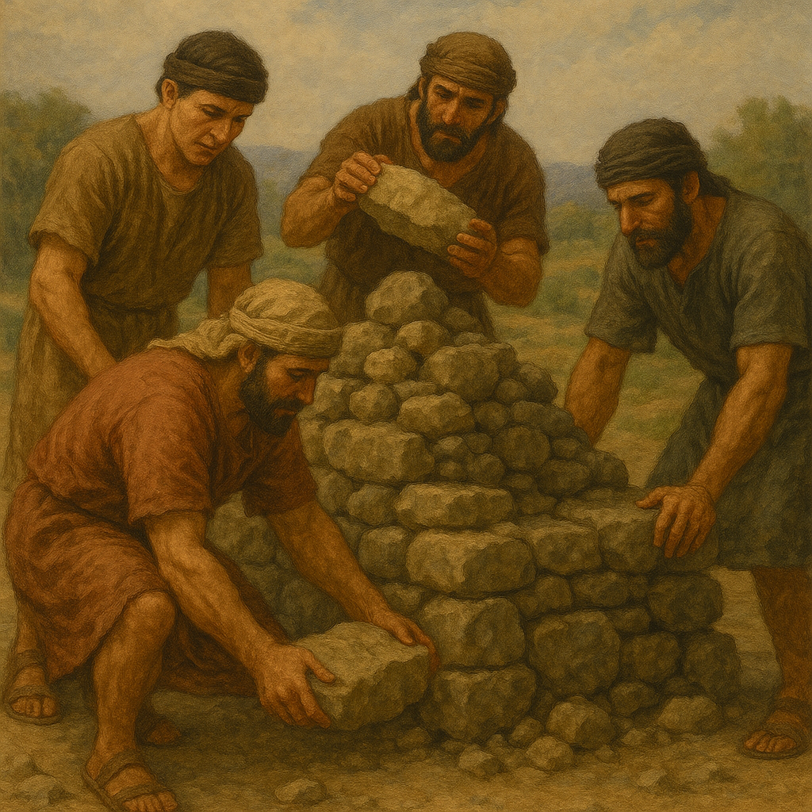

# Human-made Things in the Bible

## License Information

Human-made Things in the Bible © United Bible Societies, 2025. Adapted from: <cite>The Works of Their Hands: Man-made Things in the Bible</cite>, by Ray Pritz © 2009 United Bible Societies. This work is licensed under Creative Commons Attribution-ShareAlike 4.0 International (<a href="https://creativecommons.org/licenses/by-sa/4.0/">https://creativecommons.org/licenses/by-sa/4.0/</a>).

--------------------------------

## 標題：襯衫、束腰長襯衫（shirt, tunic） (id: REALIA:6.3)

6\.3 標題：襯衫、束腰長襯衫（shirt, tunic）
==============================

經文出處
----

Hebrew 來： כֻּתֹּנֶת (音譯： kutoneth)

[GEN 3:21](https://ref.ly/Gen3:21), [GEN 37:3](https://ref.ly/Gen37:3), [GEN 37:23](https://ref.ly/Gen37:23), [GEN 37:23](https://ref.ly/Gen37:23), [GEN 37:31](https://ref.ly/Gen37:31), [GEN 37:31](https://ref.ly/Gen37:31), [GEN 37:32](https://ref.ly/Gen37:32), [GEN 37:32](https://ref.ly/Gen37:32), [GEN 37:33](https://ref.ly/Gen37:33), [EXO 28:4](https://ref.ly/Exod28:4), [EXO 28:39](https://ref.ly/Exod28:39), [EXO 28:40](https://ref.ly/Exod28:40), [EXO 29:5](https://ref.ly/Exod29:5), [EXO 29:8](https://ref.ly/Exod29:8), [EXO 39:27](https://ref.ly/Exod39:27), [EXO 40:14](https://ref.ly/Exod40:14), [LEV 8:7](https://ref.ly/Lev8:7), [LEV 8:13](https://ref.ly/Lev8:13), [LEV 10:5](https://ref.ly/Lev10:5), [LEV 16:4](https://ref.ly/Lev16:4), [2SA 13:18](https://ref.ly/2Sam13:18), [2SA 13:19](https://ref.ly/2Sam13:19), [2SA 15:32](https://ref.ly/2Sam15:32), [EZR 2:69](https://ref.ly/Ezra2:69), [NEH 7:69](https://ref.ly/Neh7:69), [NEH 7:71](https://ref.ly/Neh7:71), [JOB 30:18](https://ref.ly/Job30:18), [SNG 5:3](https://ref.ly/Song5:3), [ISA 22:21](https://ref.ly/Isa22:21)

Hebrew 來： סָדִין (音譯： sadin)

[JDG 14:12](https://ref.ly/Judg14:12), [JDG 14:13](https://ref.ly/Judg14:13), [PRO 31:24](https://ref.ly/Prov31:24), [ISA 3:23](https://ref.ly/Isa3:23)

Aramaic 蘭：פטישׁ (音譯： ptash)

[DAN 3:21](https://ref.ly/Dan3:21)

Greek 希： χιτών (音譯： chitōn)

[MAT 5:40](https://ref.ly/Matt5:40), [MAT 10:10](https://ref.ly/Matt10:10), [MRK 6:9](https://ref.ly/Mark6:9), [LUK 3:11](https://ref.ly/Luke3:11), [LUK 6:29](https://ref.ly/Luke6:29), [LUK 9:3](https://ref.ly/Luke9:3), [JHN 19:23](https://ref.ly/John19:23), [JHN 19:23](https://ref.ly/John19:23), [ACT 9:39](https://ref.ly/Acts9:39), [JUD 1:23](https://ref.ly/Jude1:23), [JDT 14:19](https://ref.ly/Jdt14:19), [LJE 1:30](https://ref.ly/EpJer1:30), [2MA 4:38](https://ref.ly/2Macc4:38), [2MA 12:40](https://ref.ly/2Macc12:40), [4MA 9:11](https://ref.ly/4Macc9:11)

描述
--

*(Image generated by ChatGPT using OpenAI technology)*

束腰長襯衫是一件比較長、比較緊身的衣服，貼身穿著，外面套上外套或外衣，通常用羊毛做成，也可以是亞麻布等其他衣料。束腰長襯衫通常有袖子，設計也很簡單，就是前面和後面兩片縫在一起，並在頭頸和胳膊處留出洞來以便穿著（另參[4\.5\.2 內袍、束腰長襯衫、襯衫 (tunic, shirt)\<REALIA:4\.5\.2\>](#) ）。

---

用途
--

以色列人不論男女都會穿束腰長襯衫，裡面通常會穿纏腰布或短褲（參[6\.4 纏腰布、短褲 (loincloth)\<REALIA:6\.4\>](#) ），外面套上外袍。做體力勞動時，也可以不穿外袍，只穿束腰長襯衫（類似於現代西方文化的T恤衫）。

---

翻譯
--

對於[GEN 3:21](https://ref.ly/Gen3:21) 中的希伯來文*kutoneth* ，法文《新版耶路撒冷聖經》（*Nouvelle Bible de Jérusalem* ）譯為「束腰長襯衫」。但是，大多數英文譯本都沒有表述的這麼具體，只是把這件動物皮做的衣服翻譯為“garments”（「外套」；RSV (Revised Standard Version (1952)) 、NIV (New International Version (1984)) 、NJPSV (New Jewish Publication Society Version) ）或“clothes”（「衣服」；GNT (Good News Translation (1992)) 、CEV (Contemporary English Version) 、FRCL (French Common Language Version (Bible en français courant)) 、GECL (German Common Language Version (Gute Nachricht Bibel)) ）。

在[GEN 37:0](https://ref.ly/Gen37:0) 和[2SA 13:18](https://ref.ly/2Sam13:18); [2SA 13:19](https://ref.ly/2Sam13:19) ，希伯來原文的字面意思是「有袖子的長袍」（“a long robe with sleeves”，RSV (Revised Standard Version (1952)) ）。然而在原文中，「有袖子的」一語也可以譯為「多種顏色的」。英文譯本的翻譯各有不同。在[GEN 37:3](https://ref.ly/Gen37:3) 中，GNT (Good News Translation (1992)) 將其翻譯為“a long robe with full sleeves”（「帶長袖的長袍」），並添加了腳註，“*or* decorated robe”（「或譯：帶裝飾的長袍」）。這個故事的重點是，雅各愛約瑟超過愛他的哥哥們，所以給他做了一件特別的衣服。CEV (Contemporary English Version) 譯為“a fancy coat”（「一件華麗的外套」），並且在腳註中給出了以下兩個選擇：“Or ‘a coat of many colors’ or ‘a coat with long sleeves’”（「或譯：『一件彩色的衣服』或『一件長袖外套』」）。

有些解經家和譯本將希伯來文*sadin* 解作一塊亞麻布；例如，在[JDG 14:12](https://ref.ly/Judg14:12); [JDG 14:13](https://ref.ly/Judg14:13) ，GNT (Good News Translation (1992)) 譯為“a piece of fine linen”（「一塊細亞麻布」）。然而，大多數解經家和譯本將其理解為一件細麻布做成的衣服（參[1\.5\.3\.7 麻、亞麻、細麻布 (linen)\<REALIA:1\.5\.3\.7\>](#) 和[1\.5\.3\.13 細麻布、大布 (linen cloth, sheet)\<REALIA:1\.5\.3\.13\>](#) ）。這裡提到的衣服類型在不同的英文譯本中也很不相同，從“linen wraps”（「亞麻布圍巾」；NASB (New American Standard Bible) ）到“linen shirts”（「亞麻布襯衫」；NCV (New Century Version) ）都有。在大多數情況下，翻譯者可以使用「亞麻布衣服」或「亞麻布襯衫」等一般性的表達。

[DAN 3:21](https://ref.ly/Dan3:21) ：在這節經文中，作者用了四個術語來指明被扔進烈火窰中的三個人所穿的衣服。這些衣服究竟是什麼並不確定，也不是特別重要；作者把這些衣服羅列出來，就像他在其他地方使用清單那樣，是為了獲得修辭效果。在翻譯時，重點是要突出這些人穿戴整齊，並且他們的服飾要包含內衣、外衣和帽子。CEV (Contemporary English Version) 對這些衣服的譯法值得借鑒，“with all of their clothes still on, including their turbans”（英文直譯：「他們身上所有的衣服都還在，包括頭巾」）。

在[MAT 5:40](https://ref.ly/Matt5:40) 和[LUK 6:29](https://ref.ly/Luke6:29) 中，希臘文*chitōn* 指的是一件基本的衣服；因此，翻譯者應注意不要把這個詞譯為當地視為奢侈品的服裝。有些語言很難在這些經文中區分這件衣服與外衣（參[6\.2 外衣、外袍、披風、長袍 (outer garment, cloak, mantle, robe)\<REALIA:6\.2\>](#) ）。如果目標語言有分別表示外衣和內衣的詞語，那麼通常可以使用這些詞語；例如，GNT (Good News Translation (1992)) 譯作“coat”（「外套」）和“shirt”（「襯衣」）。否則，翻譯者可能需要使用描述性的短語；例如，*chitōn* 可以譯為「穿在外衣裡面的衣服」、「貼身穿的衣服」，或「用外套蓋住的衣服」。耶穌當時的聽眾馬上就能明白這兩件衣服的價值差異，然而為了幫助現在的讀者意識到這一點，翻譯者可能需要擴展譯文進行解釋，比如，「比較不值錢的內衣」和「比較貴重的外衣」。

[JHN 19:23](https://ref.ly/John19:23) ：這節經文提到耶穌的裡衣是一件整片織成的、沒有接縫的衣服。我們雖然不確知古代這種縫紉技術的細節，但也並不表示這件衣服很獨特或特別昂貴。

* **Associated Passages:** 創世記 3:21; 創世記 37:3; 創世記 37:23; 創世記 37:31; 創世記 37:32; 創世記 37:33; 出埃及記 28:4; 出埃及記 28:39; 出埃及記 28:40; 出埃及記 29:5; 出埃及記 29:8; 出埃及記 39:27; 出埃及記 40:14; 利未記 8:7; 利未記 8:13; 利未記 10:5; 利未記 16:4; 撒母耳記下 13:18; 撒母耳記下 13:19; 撒母耳記下 15:32; 以斯拉記 2:69; 尼希米記 7:69; 尼希米記 7:71; 約伯記 30:18; 雅歌 5:3; 以賽亞書 22:21; 士師記 14:12; 士師記 14:13; 箴言 31:24; 以賽亞書 3:23; 但以理書 3:21; 馬太福音 5:40; 馬太福音 10:10; 馬可福音 6:9; 路加福音 3:11; 路加福音 6:29; 路加福音 9:3; 約翰福音 19:23; 使徒行傳 9:39; 猶大書 1:23; 友弟德傳 14:19; 耶利米書信 1:30; 瑪加伯下 4:38; 瑪加伯下 12:40; 瑪加伯四書 9:11; 創世記 37:0

