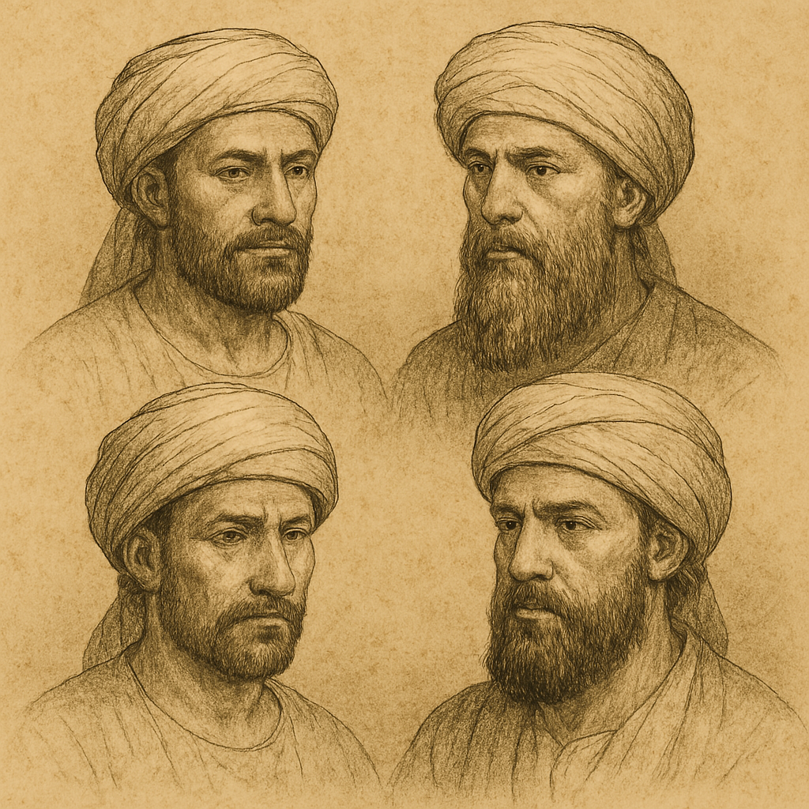

# Human-made Things in the Bible

## License Information

Human-made Things in the Bible © United Bible Societies, 2025. Adapted from: <cite>The Works of Their Hands: Man-made Things in the Bible</cite>, by Ray Pritz © 2009 United Bible Societies. This work is licensed under Creative Commons Attribution-ShareAlike 4.0 International (<a href="https://creativecommons.org/licenses/by-sa/4.0/">https://creativecommons.org/licenses/by-sa/4.0/</a>).

--------------------------------

## 標題：頭飾、裹頭巾、頭巾、帽子（headdress, turban, hat） (id: REALIA:6.7)

6\.7 標題：頭飾、裹頭巾、頭巾、帽子（headdress, turban, hat）
============================================

經文出處
----

Hebrew 來： טְבוּל (音譯： tvul)

[EZK 23:15](https://ref.ly/Ezek23:15)

Aramaic 蘭：כַּרְבְּלָה (音譯： karbla’)

[DAN 3:21](https://ref.ly/Dan3:21)

Hebrew 來： מִצְנֶפֶת (音譯： mitsnefeth)

[EZK 21:31](https://ref.ly/Ezek21:31)

Hebrew 來： פְּאֵר (音譯： p’er)

[ISA 3:20](https://ref.ly/Isa3:20), [EZK 24:17](https://ref.ly/Ezek24:17), [EZK 24:23](https://ref.ly/Ezek24:23)

Hebrew 來： צָנִיף (音譯： tsanif)

[JOB 29:14](https://ref.ly/Job29:14), [ISA 3:23](https://ref.ly/Isa3:23), [ISA 62:3](https://ref.ly/Isa62:3)

Greek 希： κίδαρις (音譯： kidaris)

[1ES 3:6](https://ref.ly/1Esd3:6)

Greek 希： πέτασος (音譯： petasos)

[2MA 4:12](https://ref.ly/2Macc4:12)

描述
--

*(Image generated by ChatGPT using OpenAI technology)*

頭巾是纏裹在頭頂的一塊布。

---

用途
--

頭巾的纏法是：將布在頭頂上繞幾圈，然後把末端掖到頭巾裡面。頭巾纏好後可以一直保持形狀，像帽子那樣戴上摘下。另參[4\.5\.8 頭巾、頭飾 (turban, headdress)\<REALIA:4\.5\.8\>](#) 。

---

翻譯
--

有些語言會有一個非常一般性的詞語來表示任何戴在頭上的東西；如果沒有專門指「頭巾」的詞語，那麼可以用這個一般性的詞語來翻譯上面列出的大多數經文。有些語言可以採用描述性的短語，例如「用布做成的、包在頭上的覆蓋物」。

有些譯本譯作「帽子」（“hat”，CEV (Contemporary English Version) ；[JOB 29:14](https://ref.ly/Job29:14) ），或「便帽」（“cap”，GNT (Good News Translation (1992)) ；[DAN 3:21](https://ref.ly/Dan3:21) ），但這些中文和英文詞語都是指比較西化的物品，與聖經人物所戴的不同。「頭巾」或「頭飾」等詞會更加合適，因為這明顯是一些不那麼西化的物品。但是，有些目標語言只有一個詞語表示任何戴在頭上的物品，此時就很難反映出這種區別。在這種情況下，或許可以將「頭巾」譯作「特別的頭部覆蓋物」。

關於亞蘭文*karbla’* 在[DAN 3:21](https://ref.ly/Dan3:21) 中的翻譯，參[6\.3 襯衫、束腰長襯衫 (shirt, tunic)\<REALIA:6\.3\>](#) 中的註解。

[2MA 4:12](https://ref.ly/2Macc4:12) 的原文字面意思是「他勸誘地位最尊貴的年輕人佩戴希臘帽子」（“he induced the noblest of the young men to wear the Greek hat”，RSV (Revised Standard Version (1952)) ）。這裡所說的帽子是希臘運動員戴的，象徵希臘神明赫爾墨斯。現代讀者一般不知道這一點，因此REB (Revised English Bible (1989)) 將這句經文擴展譯為，“he made the most outstanding of the young men adopt the hat worn by Greek athletes”（英文直譯：「他使最傑出的年輕人戴上希臘運動員所戴的帽子」）。有些譯本省略了帽子，把注意力集中在核心問題上，即猶太青年受到引誘，和外邦人一起參加被猶太律法禁止的希臘活動；例如，GNT (Good News Translation (1992)) 譯為，“\[he] led our finest young men to adopt the Greek custom of participating in athletic events”（「（他）引我們最優秀的年輕人沾染希臘風俗，參加體育賽事」）。

* **Associated Passages:** 以西結書 23:15; 但以理書 3:21; 以西結書 21:31; 以賽亞書 3:20; 以西結書 24:17; 以西結書 24:23; 約伯記 29:14; 以賽亞書 3:23; 以賽亞書 62:3; 厄斯德拉上 3:6; 瑪加伯下 4:12

