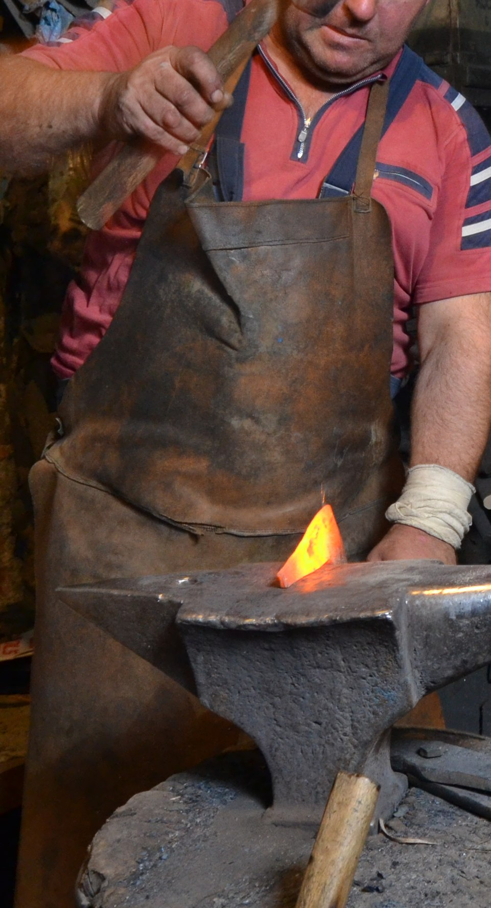

# Human-made Things in the Bible

## License Information

Human-made Things in the Bible © United Bible Societies, 2025. Adapted from: <cite>The Works of Their Hands: Man-made Things in the Bible</cite>, by Ray Pritz © 2009 United Bible Societies. This work is licensed under Creative Commons Attribution-ShareAlike 4.0 International (<a href="https://creativecommons.org/licenses/by-sa/4.0/">https://creativecommons.org/licenses/by-sa/4.0/</a>).

--------------------------------

## 標題：圍裙（apron） (id: REALIA:6.10)

6\.10 標題：圍裙（apron）
==================

經文出處
----

Greek 希： σιμικίνθιον (音譯： simikinthion)

[ACT 19:12](https://ref.ly/Acts19:12)

描述和用途
-----

*皮革圍裙 (© MikiNikoloski, CC BY\-SA 3\.0, via Wikimedia Commons)*

圍裙是工匠圍在腰部或胸部的一塊布或皮革，保護衣服不被弄髒。

---

翻譯
--

在有些語言中，「圍裙」可以譯為「工人穿的布」或「工人為保護衣服而穿的布」。

關於「以弗得」指一種工作時穿的圍裙，參[4\.5\.4 以弗得 (ephod)\<REALIA:4\.5\.4\>](#) 。

* **Associated Passages:** 使徒行傳 19:12

