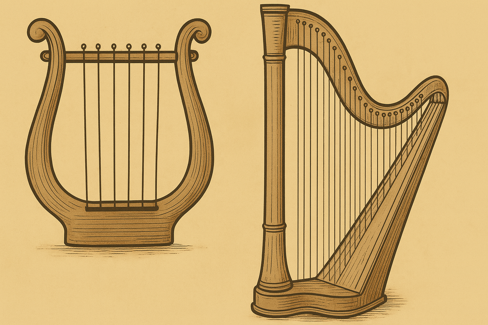

# Human-made Things in the Bible

## License Information

Human-made Things in the Bible © United Bible Societies, 2025. Adapted from: <cite>The Works of Their Hands: Man-made Things in the Bible</cite>, by Ray Pritz © 2009 United Bible Societies. This work is licensed under Creative Commons Attribution-ShareAlike 4.0 International (<a href="https://creativecommons.org/licenses/by-sa/4.0/">https://creativecommons.org/licenses/by-sa/4.0/</a>).

--------------------------------

## 標題：弦樂器、絲弦的樂器（stringed instruments） (id: REALIA:7.2)

7\.2 標題：弦樂器、絲弦的樂器（stringed instruments）
=======================================

*(Image generated by ChatGPT using OpenAI technology)*

許多樂器是把弦繃緊在共鳴箱上方，或連接到共鳴箱上，然後撥動弦使其振動，樂器便發出聲音。

*(Image generated by ChatGPT using OpenAI technology)*

聖經中提到的各種弦樂器的辨識存在相當大的不確定性。另外，希伯來文*nevel* 和*kinor* 經常互換使用或平行出現（參[1SA 10:5](https://ref.ly/1Sam10:5) ；[2SA 6:5](https://ref.ly/2Sam6:5) ；[PSA 33:2](https://ref.ly/Ps33:2) ，[PSA 57:9](https://ref.ly/Ps57:9) ［《和》57:8］，[PSA 71:22](https://ref.ly/Ps71:22) ，[PSA 81:3](https://ref.ly/Ps81:3) ［《和》81:2］，[PSA 92:4](https://ref.ly/Ps92:4) ［《和》92:3］，[PSA 108:3](https://ref.ly/Ps108:3) ［《和》108:2］，[PSA 150:3](https://ref.ly/Ps150:3) 等），進一步增加了確認的難度。這兩種樂器可能都是指里拉琴，只是大小不同，*kinor* 較小。我們很難明確區分*nevel* 和*kinor* ，兩者主要的區別可能是共鳴箱的厚度，*nevel* 可能更厚一些。有關這些弦樂器的進一步討論，參閱布朗（Braun）、拉威爾格倫（Lawergren，第55頁）和奧康奈爾（O’Connell）的著作。

* **Associated Passages:** 撒母耳記上 10:5; 撒母耳記下 6:5; 詩篇 33:2; 詩篇 57:9; 詩篇 71:22; 詩篇 81:3; 詩篇 92:4; 詩篇 108:3; 詩篇 150:3

