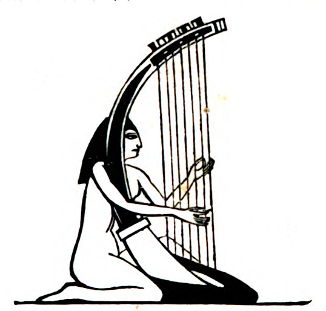

# Human-made Things in the Bible

## License Information

Human-made Things in the Bible © United Bible Societies, 2025. Adapted from: <cite>The Works of Their Hands: Man-made Things in the Bible</cite>, by Ray Pritz © 2009 United Bible Societies. This work is licensed under Creative Commons Attribution-ShareAlike 4.0 International (<a href="https://creativecommons.org/licenses/by-sa/4.0/">https://creativecommons.org/licenses/by-sa/4.0/</a>).

--------------------------------

## 標題： (id: REALIA:7.2.1)

7\.2\.1 標題：
===========

經文出處
----

Hebrew 來： נֵבֶל (音譯： nevel)

[1SA 10:5](https://ref.ly/1Sam10:5), [2SA 6:5](https://ref.ly/2Sam6:5), [1KI 10:12](https://ref.ly/1Kgs10:12), [1CH 13:8](https://ref.ly/1Chr13:8), [1CH 15:16](https://ref.ly/1Chr15:16), [1CH 15:20](https://ref.ly/1Chr15:20), [1CH 15:28](https://ref.ly/1Chr15:28), [1CH 16:5](https://ref.ly/1Chr16:5), [1CH 25:1](https://ref.ly/1Chr25:1), [1CH 25:6](https://ref.ly/1Chr25:6), [2CH 5:12](https://ref.ly/2Chr5:12), [2CH 9:11](https://ref.ly/2Chr9:11), [2CH 20:28](https://ref.ly/2Chr20:28), [2CH 29:25](https://ref.ly/2Chr29:25), [NEH 12:27](https://ref.ly/Neh12:27), [PSA 33:2](https://ref.ly/Ps33:2), [PSA 57:9](https://ref.ly/Ps57:9), [PSA 71:22](https://ref.ly/Ps71:22), [PSA 81:3](https://ref.ly/Ps81:3), [PSA 92:4](https://ref.ly/Ps92:4), [PSA 108:3](https://ref.ly/Ps108:3), [PSA 144:9](https://ref.ly/Ps144:9), [PSA 150:3](https://ref.ly/Ps150:3), [ISA 5:12](https://ref.ly/Isa5:12), [ISA 14:11](https://ref.ly/Isa14:11), [AMO 5:23](https://ref.ly/Amos5:23), [AMO 6:5](https://ref.ly/Amos6:5)

Aramaic 蘭：קַתְרוֹס (音譯： qathros)

[DAN 3:5](https://ref.ly/Dan3:5), [DAN 3:5](https://ref.ly/Dan3:5), [DAN 3:7](https://ref.ly/Dan3:7), [DAN 3:7](https://ref.ly/Dan3:7), [DAN 3:10](https://ref.ly/Dan3:10), [DAN 3:10](https://ref.ly/Dan3:10), [DAN 3:15](https://ref.ly/Dan3:15), [DAN 3:15](https://ref.ly/Dan3:15)

Greek 希： κιθάρα (音譯： kithara)

[1CO 14:7](https://ref.ly/1Cor14:7), [REV 5:8](https://ref.ly/Rev5:8), [REV 14:2](https://ref.ly/Rev14:2), [REV 15:2](https://ref.ly/Rev15:2), [1MA 4:54](https://ref.ly/1Macc4:54)

Greek 希： κιθαρίζω (音譯： kitharizō)

[1CO 14:7](https://ref.ly/1Cor14:7), [REV 14:2](https://ref.ly/Rev14:2)

Greek 希： κιθαρῳδός (音譯： kitharōidos)

[REV 14:2](https://ref.ly/Rev14:2), [REV 18:22](https://ref.ly/Rev18:22)

Greek 希： νάβλα (音譯： nabla)

[1MA 13:51](https://ref.ly/1Macc13:51)

Greek 希： ψαλτήριον (音譯： psaltērion)

[WIS 19:18](https://ref.ly/Wis19:18), [SIR 40:21](https://ref.ly/Sir40:21)

Aramaic 蘭：פְּסַנְתֵּרִין (音譯： psanterin)

[DAN 3:5](https://ref.ly/Dan3:5), [DAN 3:7](https://ref.ly/Dan3:7), [DAN 3:10](https://ref.ly/Dan3:10), [DAN 3:15](https://ref.ly/Dan3:15)

Latin 拉： psalterium

[2ES 10:22](https://ref.ly/2Esd10:22)

描述
--

*埃及拱形豎琴 (© Public domain \- Wikimedia Commons)*

我們很難確定希伯來文*nevel* 具體是指什麼。有些人認為是一種豎琴。這種豎琴從共鳴箱處突出來一個琴頸。琴弦從琴頸的一端開始拉伸，一直拉到共鳴箱裡面。豎琴的琴體是木製的，琴弦由動物的腸子（可能是綿羊腸）製成，弦的數目不一。

還有些人將*nevel* 歸到里拉琴這個類別；該類別樂器的弦在共鳴箱上方張緊，並且與共鳴箱平行（參[7\.2\.2 Kinor、小里拉琴、琵琶 (Kinor, small lyre, lute)\<REALIA:7\.2\.2\>](#) ）。雖然我們也傾向於採納這種解釋，但還是把它歸到豎琴這個樂器類型來討論，因為要確定這種樂器很困難，並且許多譯本都將*nevel* 譯為「豎琴」。

---

用途
--

演奏者用手指、薄象牙片或金屬片撥動琴弦，以發出共鳴聲。*nevel* 的音域可能比*kinor* 的音域低。

---

翻譯
--

在幾篇詩篇中（[PSA 33:2](https://ref.ly/Ps33:2) ，[PSA 92:4](https://ref.ly/Ps92:4) ［《和》92:3］，[PSA 144:9](https://ref.ly/Ps144:9) ），*nevel* 都與希伯來文*‘asor* 有關，這可能表明*nevel* 有「十根弦」。

翻譯這些弦樂器時，必須要根據當地文化進行一定程度的改寫，因為在不同文化中，弦樂器的形狀、弦的數目和樂器的功能都不同。翻譯者要在目標語言中選擇一個對等的樂器。在大多數經文中，*nevel* 最準確的譯法是「吉他」或是其他中等大小的類似弦樂器，這種樂器的弦必須張緊在共鳴箱上方，並通過撥動琴弦發出聲音。

在同時出現*nevel* 和*kinor* 的經文中，我們建議翻譯者選擇一種具有不同尺寸的樂器，然後把這兩個希伯來文詞語譯為「大X和小X」，例如「大吉他和小吉他」。或者也可以選擇兩種構造相似、大小不同的弦樂器，例如「吉他和琵琶」。還可以譯為「大弦樂器和小弦樂器」，或者把兩種樂器合起來譯為「弦樂器」。

[PSA 33:2](https://ref.ly/Ps33:2) ：「要用琴稱頌耶和華」（RSV (Revised Standard Version (1952)) 直譯）一句有兩個重要的翻譯問題。第一個問題是，在許多語言中，「用琴」必須改寫成動詞短語或分句；例如，整行詩可譯為，「要在琴上彈奏音樂來稱頌耶和華」，或「用琴彈奏音樂，稱頌耶和華」。第二個問題還涉及詩句的第二行，就是用什麼詞語來表示這兩種樂器。如果目標語言有多種弦樂器，翻譯者可以用較小的一種來表示*kinor* （如「里拉琴」），用較大的一種來表示*nevel* （如RSV (Revised Standard Version (1952)) ，“harp”「豎琴」）。如果目標語言可供選擇的樂器極少或沒有選擇，翻譯者應使用當地人熟悉的弦樂器來表示*kinor* ，並用比較一般性的用詞來表示*nevel* 。如果當地人完全不知道弦樂器，通常需要用「帶弦的小型樂器」來翻譯*kinor* ，用「帶弦的大型樂器」來翻譯*nevel* 。

* **Associated Passages:** 撒母耳記上 10:5; 撒母耳記下 6:5; 列王紀上 10:12; 歷代志上 13:8; 歷代志上 15:16; 歷代志上 15:20; 歷代志上 15:28; 歷代志上 16:5; 歷代志上 25:1; 歷代志上 25:6; 歷代志下 5:12; 歷代志下 9:11; 歷代志下 20:28; 歷代志下 29:25; 尼希米記 12:27; 詩篇 33:2; 詩篇 57:9; 詩篇 71:22; 詩篇 81:3; 詩篇 92:4; 詩篇 108:3; 詩篇 144:9; 詩篇 150:3; 以賽亞書 5:12; 以賽亞書 14:11; 阿摩司書 5:23; 阿摩司書 6:5; 但以理書 3:5; 但以理書 3:7; 但以理書 3:10; 但以理書 3:15; 哥林多前書 14:7; 啟示錄 5:8; 啟示錄 14:2; 啟示錄 15:2; 瑪加伯上 4:54; 啟示錄 18:22; 瑪加伯上 13:51; 智慧篇 19:18; 德訓篇 40:21; 厄斯德拉下 10:22

