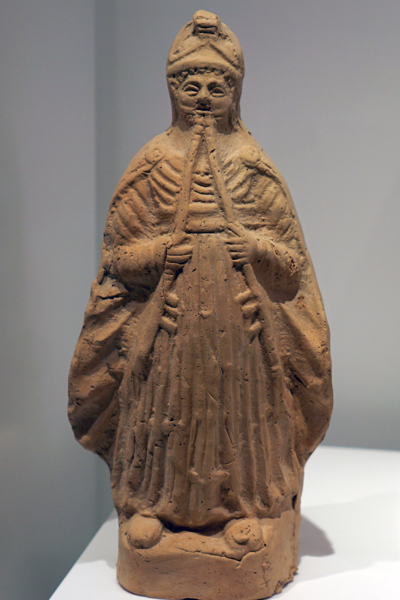

# Human-made Things in the Bible

## License Information

Human-made Things in the Bible © United Bible Societies, 2025. Adapted from: <cite>The Works of Their Hands: Man-made Things in the Bible</cite>, by Ray Pritz © 2009 United Bible Societies. This work is licensed under Creative Commons Attribution-ShareAlike 4.0 International (<a href="https://creativecommons.org/licenses/by-sa/4.0/">https://creativecommons.org/licenses/by-sa/4.0/</a>).

--------------------------------

## 標題：笛、簫（flute, pipe） (id: REALIA:7.3.3)

7\.3\.3 標題：笛、簫（flute, pipe）
===========================

經文出處
----

Hebrew 來： חָלִיל (音譯： chalil)

[1SA 10:5](https://ref.ly/1Sam10:5), [1KI 1:40](https://ref.ly/1Kgs1:40), [ISA 5:12](https://ref.ly/Isa5:12), [ISA 30:29](https://ref.ly/Isa30:29), [JER 48:36](https://ref.ly/Jer48:36), [JER 48:36](https://ref.ly/Jer48:36)

Aramaic 蘭：מַשְׁרוֹקִי (音譯： mashroqi)

[DAN 3:5](https://ref.ly/Dan3:5), [DAN 3:7](https://ref.ly/Dan3:7), [DAN 3:10](https://ref.ly/Dan3:10), [DAN 3:15](https://ref.ly/Dan3:15)

Hebrew 來： נְחִילוֹת (音譯： nchiloth)

[PSA 5:1](https://ref.ly/Ps5:1)

Hebrew 來： עוּגָב (音譯： ‘ugav)

[GEN 4:21](https://ref.ly/Gen4:21), [JOB 21:12](https://ref.ly/Job21:12), [JOB 30:31](https://ref.ly/Job30:31), [PSA 150:4](https://ref.ly/Ps150:4)

Greek 希： αὐλέω, αὐλητής, αὐλός (音譯： auleō（動詞）, aulētēs, aulos)

[MAT 9:23](https://ref.ly/Matt9:23), [MAT 11:17](https://ref.ly/Matt11:17), [LUK 7:32](https://ref.ly/Luke7:32), [1CO 14:7](https://ref.ly/1Cor14:7), [1CO 14:7](https://ref.ly/1Cor14:7), [REV 18:22](https://ref.ly/Rev18:22), [SIR 40:21](https://ref.ly/Sir40:21), [1MA 3:45](https://ref.ly/1Macc3:45), [1ES 5:2](https://ref.ly/1Esd5:2)

描述
--

*骨制長笛，約公元前2500年（音樂博物館（Musée de la musique），巴黎） (Vassil, CC0, via Wikimedia Commons)*

笛是一種管樂器，在笛管上面有一系列用來改變音調的指孔。有些笛子是用蘆葦製成的，有多種形式：笛管是圓柱形，也可能略呈圓錐形。有些笛子只有一根笛管，還有一些則由兩根管並排而成。古代雙管笛或雙管簫的兩根蘆葦通常成V型。其中一根管有數個孔，而另一根只有一個孔，提供一個不變的低音，以配合第一根管發出的曲調。有些笛或簫是用木頭、象牙、骨頭或金屬等材料製成的。

---

用途
--

*雙笛 (© Arjuno3 \- Wikimedia Commons)*

樂器內部在整個長度上都是空心的，在開口的上方吹氣，氣流灌入貫穿整個樂器的共鳴腔筒，笛便發出聲音；有些樂器的開口是在末端，還有一些樂器的開口是在靠近樂器端部的側面。對於用另一種方法引起振動的簧管來說，演奏者需在簧片上方吹氣使其振動，然後笛身裡面的空氣柱也隨之振動而發出聲音。

---

翻譯
--

*吹笛的男人 (© Zde \- Wikimedia Commons)*

如果沒有可以用來翻譯「笛」的管樂器，翻譯者可以使用其他管樂器的名稱。

希伯來文*‘ugav* 通常是指一種管樂器；例如，在[GEN 4:21](https://ref.ly/Gen4:21) 中，RSV (Revised Standard Version (1952)) 譯成“pipe”（「簫」），GNT (Good News Translation (1992)) 譯為“flute”（「笛」）。然而，這個詞有可能是「樂器」的統稱，甚至可能是指某一種弦樂器。在[JOB 21:12](https://ref.ly/Job21:12) 和[JOB 30:31](https://ref.ly/Job30:31) 中，這是一種用來表達喜悅和滿足的樂器。

[PSA 5:1](https://ref.ly/Ps5:1) （標題）：希伯來文*nchiloth* 在舊約中僅出現在此處，意思不確定。這個詞可能是「管樂器」的統稱，或特別指「笛」。聖經以外的證據表明，它可能是一種吹奏哀歌的樂器。

[MAT 9:23](https://ref.ly/Matt9:23) ：RSV (Revised Standard Version (1952)) 這裡譯成“flute players”（「吹笛手」），GNT (Good News Translation (1992)) 作“musicians”（「音樂家」）。根據猶太傳統，即使是最窮的人的葬禮，也要有兩個吹笛的人和一個哀哭的女子。為了具體說明吹笛手的角色，GNT (Good News Translation (1992)) 增加了修飾語「葬禮上的」。這個背景知識對於熟悉葬禮習俗的猶太讀者來說非常清楚，但對其他讀者來說就不是那麼明顯。許多文化都熟悉木管笛子或其他木管樂器。如果沒有這樣的樂器，翻譯者可以譯為，「那些為葬禮演奏樂器的人」，或者「在葬禮上演奏的人」（GNT (Good News Translation (1992)) 直譯）、「葬禮演奏者」（NCV (New Century Version) 直譯）等。

有關亞蘭文*mashroqi* 一詞的翻譯，參本章開頭關於[DAN 3:0](https://ref.ly/Dan3:0) 的討論。

* **Associated Passages:** 撒母耳記上 10:5; 列王紀上 1:40; 以賽亞書 5:12; 以賽亞書 30:29; 耶利米書 48:36; 但以理書 3:5; 但以理書 3:7; 但以理書 3:10; 但以理書 3:15; 詩篇 5:1; 創世記 4:21; 約伯記 21:12; 約伯記 30:31; 詩篇 150:4; 馬太福音 9:23; 馬太福音 11:17; 路加福音 7:32; 哥林多前書 14:7; 啟示錄 18:22; 德訓篇 40:21; 瑪加伯上 3:45; 厄斯德拉上 5:2; 但以理書 3:0

