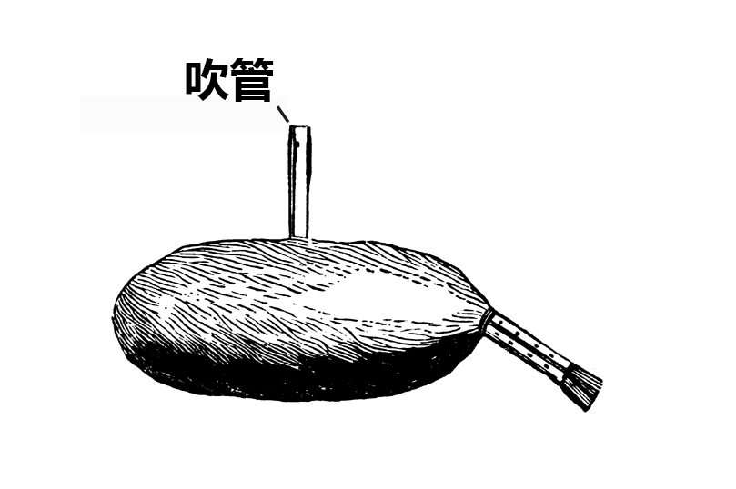

# Human-made Things in the Bible

## License Information

Human-made Things in the Bible © United Bible Societies, 2025. Adapted from: <cite>The Works of Their Hands: Man-made Things in the Bible</cite>, by Ray Pritz © 2009 United Bible Societies. This work is licensed under Creative Commons Attribution-ShareAlike 4.0 International (<a href="https://creativecommons.org/licenses/by-sa/4.0/">https://creativecommons.org/licenses/by-sa/4.0/</a>).

--------------------------------

## 標題：風笛（定音鼓、大鼓）（bagpipe [kettledrum, large drum]） (id: REALIA:7.3.4)

7\.3\.4 標題：風笛（定音鼓、大鼓）（bagpipe \[kettledrum, large drum]）
========================================================

經文出處
----

Aramaic 蘭：סוּמְפֹּנְיָה (音譯： sumponyah)

[DAN 3:5](https://ref.ly/Dan3:5), [DAN 3:10](https://ref.ly/Dan3:10), [DAN 3:10](https://ref.ly/Dan3:10), [DAN 3:15](https://ref.ly/Dan3:15)

描述
--

風笛由一個風袋和連在上面的兩支音管組成，另外還有一支吹管。演奏者通過吹管向風袋吹氣，袋中的空氣從兩支音管出去。音管上有孔洞，用手指控制開合，就可發出一系列的樂音。

定音鼓是一種較大的鼓，構造類似[7\.4\.6 鼓、手鼓、框鼓 (drum, hand drum, frame drum)\<REALIA:7\.4\.6\>](#) 所討論的鼓。然而，定音鼓不需要手持，而是立在地上。

---

翻譯
--

關於[DAN 3:0](https://ref.ly/Dan3:0) 中亞蘭文*sumponyah* 是什麼樂器，學者提出了幾個可能性，包括雙笛、鼓和風笛（如上圖所示）。各譯本的譯法包括「笛」（“pipes”；NIV (New International Version (1984)) 、NCV (New Century Version) ）、「風笛」（“bagpipe”；RSV (Revised Standard Version (1952)) 、NJB (New Jerusalem Bible (1985)) ）、「鼓」（“drum”；NRSV (New Revised Standard Version (1989)) ）和「揚琴」（“dulcimer”；KJV (King James Version (1611)) 、REB (Revised English Bible (1989)) ）。有學者基於下述假設，認為*sumponyah* 是一種大鼓：這個亞蘭文詞語音譯自希臘文*tumpanon* 的方言形式。

許多學者認為，*sumponyah* 一詞實際上並不是某種樂器的名稱，而是指同時奏響前面提到的所有樂器；因此，GNT (Good News Translation (1992)) 的英譯文意思是：「然後所有其他樂器都加入演奏。」這種解釋可能是由於把*sumponyah* 解作「伴奏」。NEB (New English Bible (1970)) 遵循了這一解釋，使用了一般性的“music”（「音樂」）。

* **Associated Passages:** 但以理書 3:5; 但以理書 3:10; 但以理書 3:15; 但以理書 3:0

* **Associated ACAI Concepts:** Bagpipe (ID: `realia:Bagpipe`)
