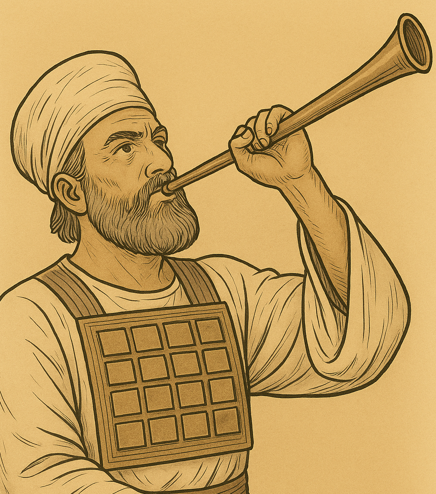

# Human-made Things in the Bible

## License Information

Human-made Things in the Bible © United Bible Societies, 2025. Adapted from: <cite>The Works of Their Hands: Man-made Things in the Bible</cite>, by Ray Pritz © 2009 United Bible Societies. This work is licensed under Creative Commons Attribution-ShareAlike 4.0 International (<a href="https://creativecommons.org/licenses/by-sa/4.0/">https://creativecommons.org/licenses/by-sa/4.0/</a>).

--------------------------------

## 標題：管樂器、吹奏樂器（wind instruments） (id: REALIA:7.3)

7\.3 標題：管樂器、吹奏樂器（wind instruments）
==================================

管樂器通過振動樂器裡面的空氣、穿過樂器的空氣或樂器周圍的空氣來發出聲音。這個類別包括兩種類型的樂器：（1）演奏者用嘴唇使樂器裡面的空氣產生振動（[7\.3\.1 角、羊角、羊角號 (horn, ram’s horn)\<REALIA:7\.3\.1\>](#) 和[7\.3\.2 號、號筒（trumpet, horn）\<REALIA:7\.3\.2\>](#) ）；（2）在樂器的入口處使空氣產生振動（[7\.3\.3 笛、簫 (flute, pipe)\<REALIA:7\.3\.3\>](#) 和[7\.3\.4 風笛（定音鼓、大鼓）（bagpipe \[kettledrum, large drum]）\<REALIA:7\.3\.4\>](#) ）。

## 標題：角、羊角、羊角號（horn, ram’s horn） (id: REALIA:7.3.1)

7\.3\.1 標題：角、羊角、羊角號（horn, ram’s horn）
=====================================

經文出處
----

Hebrew 來： יוֹבֵל (音譯： yovel)

[EXO 19:13](https://ref.ly/Exod19:13), [JOS 6:4](https://ref.ly/Josh6:4), [JOS 6:5](https://ref.ly/Josh6:5), [JOS 6:6](https://ref.ly/Josh6:6), [JOS 6:8](https://ref.ly/Josh6:8), [JOS 6:13](https://ref.ly/Josh6:13)

Hebrew 來： קֶרֶן (音譯： qeren)

[JOS 6:5](https://ref.ly/Josh6:5), [DAN 3:5](https://ref.ly/Dan3:5), [DAN 3:7](https://ref.ly/Dan3:7), [DAN 3:10](https://ref.ly/Dan3:10), [DAN 3:15](https://ref.ly/Dan3:15)

Hebrew 來： שׁוֹפָר (音譯： shofar)

[EXO 19:16](https://ref.ly/Exod19:16), [EXO 19:19](https://ref.ly/Exod19:19), [EXO 20:18](https://ref.ly/Exod20:18), [LEV 25:9](https://ref.ly/Lev25:9), [LEV 25:9](https://ref.ly/Lev25:9), [JOS 6:4](https://ref.ly/Josh6:4), [JOS 6:4](https://ref.ly/Josh6:4), [JOS 6:5](https://ref.ly/Josh6:5), [JOS 6:6](https://ref.ly/Josh6:6), [JOS 6:8](https://ref.ly/Josh6:8), [JOS 6:8](https://ref.ly/Josh6:8), [JOS 6:9](https://ref.ly/Josh6:9), [JOS 6:9](https://ref.ly/Josh6:9), [JOS 6:13](https://ref.ly/Josh6:13), [JOS 6:13](https://ref.ly/Josh6:13), [JOS 6:13](https://ref.ly/Josh6:13), [JOS 6:16](https://ref.ly/Josh6:16), [JOS 6:20](https://ref.ly/Josh6:20), [JOS 6:20](https://ref.ly/Josh6:20), [JDG 3:27](https://ref.ly/Judg3:27), [JDG 6:34](https://ref.ly/Judg6:34), [JDG 7:8](https://ref.ly/Judg7:8), [JDG 7:16](https://ref.ly/Judg7:16), [JDG 7:18](https://ref.ly/Judg7:18), [JDG 7:18](https://ref.ly/Judg7:18), [JDG 7:19](https://ref.ly/Judg7:19), [JDG 7:20](https://ref.ly/Judg7:20), [JDG 7:20](https://ref.ly/Judg7:20), [JDG 7:22](https://ref.ly/Judg7:22), [1SA 13:3](https://ref.ly/1Sam13:3), [2SA 2:28](https://ref.ly/2Sam2:28), [2SA 6:15](https://ref.ly/2Sam6:15), [2SA 15:10](https://ref.ly/2Sam15:10), [2SA 18:16](https://ref.ly/2Sam18:16), [2SA 20:1](https://ref.ly/2Sam20:1), [2SA 20:22](https://ref.ly/2Sam20:22), [1KI 1:34](https://ref.ly/1Kgs1:34), [1KI 1:39](https://ref.ly/1Kgs1:39), [1KI 1:41](https://ref.ly/1Kgs1:41), [2KI 9:13](https://ref.ly/2Kgs9:13), [1CH 15:28](https://ref.ly/1Chr15:28), [2CH 15:14](https://ref.ly/2Chr15:14), [NEH 4:12](https://ref.ly/Neh4:12), [NEH 4:14](https://ref.ly/Neh4:14), [JOB 39:24](https://ref.ly/Job39:24), [JOB 39:25](https://ref.ly/Job39:25), [PSA 47:6](https://ref.ly/Ps47:6), [PSA 81:4](https://ref.ly/Ps81:4), [PSA 98:6](https://ref.ly/Ps98:6), [PSA 150:3](https://ref.ly/Ps150:3), [ISA 18:3](https://ref.ly/Isa18:3), [ISA 27:13](https://ref.ly/Isa27:13), [ISA 58:1](https://ref.ly/Isa58:1), [JER 4:5](https://ref.ly/Jer4:5), [JER 4:19](https://ref.ly/Jer4:19), [JER 4:21](https://ref.ly/Jer4:21), [JER 6:1](https://ref.ly/Jer6:1), [JER 6:17](https://ref.ly/Jer6:17), [JER 42:14](https://ref.ly/Jer42:14), [JER 51:27](https://ref.ly/Jer51:27), [EZK 33:3](https://ref.ly/Ezek33:3), [EZK 33:4](https://ref.ly/Ezek33:4), [EZK 33:5](https://ref.ly/Ezek33:5), [EZK 33:6](https://ref.ly/Ezek33:6), [HOS 5:8](https://ref.ly/Hos5:8), [HOS 8:1](https://ref.ly/Hos8:1), [JOL 2:1](https://ref.ly/Joel2:1), [JOL 2:15](https://ref.ly/Joel2:15), [AMO 2:2](https://ref.ly/Amos2:2), [AMO 3:6](https://ref.ly/Amos3:6), [ZEP 1:16](https://ref.ly/Zeph1:16), [ZEC 9:14](https://ref.ly/Zech9:14)

Hebrew 來： תָּקוֹעַ (音譯： taqo‘a)

[EZK 7:14](https://ref.ly/Ezek7:14)

Greek 希： σάλπιγξ (音譯： salpigx)

[MAT 24:31](https://ref.ly/Matt24:31), [1CO 14:8](https://ref.ly/1Cor14:8), [1CO 15:52](https://ref.ly/1Cor15:52), [1TH 4:16](https://ref.ly/1Thess4:16), [HEB 12:19](https://ref.ly/Heb12:19), [REV 1:10](https://ref.ly/Rev1:10), [REV 4:1](https://ref.ly/Rev4:1), [REV 8:2](https://ref.ly/Rev8:2), [REV 8:6](https://ref.ly/Rev8:6), [REV 8:13](https://ref.ly/Rev8:13), [REV 9:14](https://ref.ly/Rev9:14)

描述
--

*(Image generated by ChatGPT using OpenAI technology)*

角是一種吹奏樂器，由動物的角製成，通常用的是公綿羊的角。

---

用途
--

製作羊角號時，先把動物的角軟化，使其可以塑造成形。切下羊角的尖端，留下一個小口供吹角者吹氣，吹角者的嘴唇吹氣振動，使角發出聲音。

*用公羊角製成的樂器 (© Pixabay)*

羊角號有兩種用途：

1\. 某些宗教場合會吹響羊角號，不是作為敬拜的音樂伴奏，而是作為重要事件的信號。這些場合包括西奈山頒布律法、贖罪日、把約櫃抬進耶路撒冷、君王加冕儀式等。

2\. 敵人臨近時，人們也會吹響羊角號作為信號或警報。在先知書中，當先知呼籲百姓悔改時，經常提到吹角（[HOS 5:8](https://ref.ly/Hos5:8); [HOS 8:1](https://ref.ly/Hos8:1); [JOL 2:1](https://ref.ly/Joel2:1); [JOL 2:15](https://ref.ly/Joel2:15); [AMO 3:6](https://ref.ly/Amos3:6) ）。

---

翻譯
--

*用公羊角製成的小羊角號 (© Olve Utne, CC BY\-SA 2\.5, via Wikimedia Commons)*

在許多經文中，吹羊角號（希伯來文*shofar* ）的目的是發出警報。在有些文化中，用動物角製成的號是向一大群人發出信號的樂器，這時很容易表達出用羊角號發出警報的目的。其他文化也許可以找到用於相同目的的其他樂器。例如，有些文化用鐘或鼓等樂器作為打仗的警告。有些譯本對*shofar* 一詞進行了音譯。如果這種樂器不是眾所周知的，那麼音譯應附有腳註或收錄在術語簡釋中。

在[EXO 19:13](https://ref.ly/Exod19:13) 和[JOS 6:0](https://ref.ly/Josh6:0) 中，希伯來文*yovel* 和*qeren* （意為「動物的角」）與*shofar* 平行，可以把它們作為*shofar* 的對等詞。有些學者認為，[EZK 7:14](https://ref.ly/Ezek7:14) 中的希伯來文*taqo‘a* （意為「吹」）不是指一種樂器，而是指提哥亞鎮（比較[JER 6:1](https://ref.ly/Jer6:1) ）。然而，這個詞更有可能是指發出警報的東西，即羊角號。

在一些段落中，翻譯者有必要擴展譯文，以表明吹響羊角號並不僅僅是為了演奏音樂；例如，在[EZK 7:14](https://ref.ly/Ezek7:14) 中，CEV (Contemporary English Version) 英文意為「號角已發出信號」，而GECL (German Common Language Version (Gute Nachricht Bibel)) 譯為「警報已吹響」。

對於[LEV 25:9](https://ref.ly/Lev25:9) 中「公羊的角」一語，翻譯者可以依循NCV (New Century Version) ，採用描述性的短語「公綿羊的角」。

[ZEP 1:16](https://ref.ly/Zeph1:16) 可譯作「戰爭號角的響聲」（如GNT (Good News Translation (1992)) ），強調的是羊角號的功能；也可以不提到樂器，而是將其譯為「警報」（“alarms”；NCV (New Century Version) ）。

* **Associated Passages:** 出埃及記 19:13; 約書亞記 6:4; 約書亞記 6:5; 約書亞記 6:6; 約書亞記 6:8; 約書亞記 6:13; 但以理書 3:5; 但以理書 3:7; 但以理書 3:10; 但以理書 3:15; 出埃及記 19:16; 出埃及記 19:19; 出埃及記 20:18; 利未記 25:9; 約書亞記 6:9; 約書亞記 6:16; 約書亞記 6:20; 士師記 3:27; 士師記 6:34; 士師記 7:8; 士師記 7:16; 士師記 7:18; 士師記 7:19; 士師記 7:20; 士師記 7:22; 撒母耳記上 13:3; 撒母耳記下 2:28; 撒母耳記下 6:15; 撒母耳記下 15:10; 撒母耳記下 18:16; 撒母耳記下 20:1; 撒母耳記下 20:22; 列王紀上 1:34; 列王紀上 1:39; 列王紀上 1:41; 列王紀下 9:13; 歷代志上 15:28; 歷代志下 15:14; 尼希米記 4:12; 尼希米記 4:14; 約伯記 39:24; 約伯記 39:25; 詩篇 47:6; 詩篇 81:4; 詩篇 98:6; 詩篇 150:3; 以賽亞書 18:3; 以賽亞書 27:13; 以賽亞書 58:1; 耶利米書 4:5; 耶利米書 4:19; 耶利米書 4:21; 耶利米書 6:1; 耶利米書 6:17; 耶利米書 42:14; 耶利米書 51:27; 以西結書 33:3; 以西結書 33:4; 以西結書 33:5; 以西結書 33:6; 何西阿書 5:8; 何西阿書 8:1; 約珥書 2:1; 約珥書 2:15; 阿摩司書 2:2; 阿摩司書 3:6; 西番雅書 1:16; 撒迦利亞書 9:14; 以西結書 7:14; 馬太福音 24:31; 哥林多前書 14:8; 哥林多前書 15:52; 帖撒羅尼迦前書 4:16; 希伯來書 12:19; 啟示錄 1:10; 啟示錄 4:1; 啟示錄 8:2; 啟示錄 8:6; 啟示錄 8:13; 啟示錄 9:14; 約書亞記 6:0

* **Associated ACAI Concepts:** Rams Horn (ID: `realia:RamsHorn`)

## 標題：號、號筒（trumpet, horn） (id: REALIA:7.3.2)

7\.3\.2 標題：號、號筒（trumpet, horn）
==============================

經文出處
----

Hebrew 來： חצצר, חֲצֹצְרָה (音譯： chatsotsrah, chatsar（動詞）)

[NUM 10:2](https://ref.ly/Num10:2), [NUM 10:8](https://ref.ly/Num10:8), [NUM 10:9](https://ref.ly/Num10:9), [NUM 10:10](https://ref.ly/Num10:10), [NUM 31:6](https://ref.ly/Num31:6), [2KI 11:14](https://ref.ly/2Kgs11:14), [2KI 11:14](https://ref.ly/2Kgs11:14), [2KI 12:14](https://ref.ly/2Kgs12:14), [1CH 13:8](https://ref.ly/1Chr13:8), [1CH 15:24](https://ref.ly/1Chr15:24), [1CH 15:28](https://ref.ly/1Chr15:28), [1CH 16:6](https://ref.ly/1Chr16:6), [1CH 16:42](https://ref.ly/1Chr16:42), [2CH 5:12](https://ref.ly/2Chr5:12), [2CH 5:13](https://ref.ly/2Chr5:13), [2CH 7:6](https://ref.ly/2Chr7:6), [2CH 7:6](https://ref.ly/2Chr7:6), [2CH 13:12](https://ref.ly/2Chr13:12), [2CH 13:14](https://ref.ly/2Chr13:14), [2CH 15:14](https://ref.ly/2Chr15:14), [2CH 20:28](https://ref.ly/2Chr20:28), [2CH 23:13](https://ref.ly/2Chr23:13), [2CH 23:13](https://ref.ly/2Chr23:13), [2CH 29:26](https://ref.ly/2Chr29:26), [2CH 29:27](https://ref.ly/2Chr29:27), [2CH 29:28](https://ref.ly/2Chr29:28), [EZR 3:10](https://ref.ly/Ezra3:10), [NEH 12:35](https://ref.ly/Neh12:35), [NEH 12:41](https://ref.ly/Neh12:41), [PSA 98:6](https://ref.ly/Ps98:6), [HOS 5:8](https://ref.ly/Hos5:8)

Hebrew 來： קֶרֶן (音譯： qeren)

[DAN 3:5](https://ref.ly/Dan3:5), [DAN 3:7](https://ref.ly/Dan3:7), [DAN 3:10](https://ref.ly/Dan3:10), [DAN 3:15](https://ref.ly/Dan3:15)

Greek 希： σάλπιγξ, σαλπίζω, σαλπιστής (音譯： salpigx, salpizō（動詞）, salpistēs)

[MAT 6:2](https://ref.ly/Matt6:2), [MAT 24:31](https://ref.ly/Matt24:31), [1CO 14:8](https://ref.ly/1Cor14:8), [1CO 15:52](https://ref.ly/1Cor15:52), [1CO 15:52](https://ref.ly/1Cor15:52), [1TH 4:16](https://ref.ly/1Thess4:16), [HEB 12:19](https://ref.ly/Heb12:19), [REV 1:10](https://ref.ly/Rev1:10), [REV 4:1](https://ref.ly/Rev4:1), [REV 8:2](https://ref.ly/Rev8:2), [REV 8:6](https://ref.ly/Rev8:6), [REV 8:6](https://ref.ly/Rev8:6), [REV 8:7](https://ref.ly/Rev8:7), [REV 8:8](https://ref.ly/Rev8:8), [REV 8:10](https://ref.ly/Rev8:10), [REV 8:12](https://ref.ly/Rev8:12), [REV 8:13](https://ref.ly/Rev8:13), [REV 8:13](https://ref.ly/Rev8:13), [REV 9:1](https://ref.ly/Rev9:1), [REV 9:13](https://ref.ly/Rev9:13), [REV 9:14](https://ref.ly/Rev9:14), [REV 10:7](https://ref.ly/Rev10:7), [REV 11:15](https://ref.ly/Rev11:15), [REV 18:22](https://ref.ly/Rev18:22), [SIR 39:15](https://ref.ly/Sir39:15), [1MA 3:45](https://ref.ly/1Macc3:45), [1MA 4:54](https://ref.ly/1Macc4:54), [1MA 4:13](https://ref.ly/1Macc4:13), [1MA 4:40](https://ref.ly/1Macc4:40), [1MA 4:40](https://ref.ly/1Macc4:40), [1MA 5:31](https://ref.ly/1Macc5:31), [1MA 5:33](https://ref.ly/1Macc5:33), [1MA 5:33](https://ref.ly/1Macc5:33), [1MA 6:33](https://ref.ly/1Macc6:33), [1MA 6:33](https://ref.ly/1Macc6:33), [1MA 7:45](https://ref.ly/1Macc7:45), [1MA 7:45](https://ref.ly/1Macc7:45), [1MA 9:12](https://ref.ly/1Macc9:12), [1MA 9:12](https://ref.ly/1Macc9:12), [1MA 9:12](https://ref.ly/1Macc9:12), [1MA 16:8](https://ref.ly/1Macc16:8), [1MA 16:8](https://ref.ly/1Macc16:8), [2MA 15:25](https://ref.ly/2Macc15:25), [1ES 5:57](https://ref.ly/1Esd5:57), [1ES 5:59](https://ref.ly/1Esd5:59), [1ES 5:61](https://ref.ly/1Esd5:61), [1ES 5:62](https://ref.ly/1Esd5:62), [1ES 5:62](https://ref.ly/1Esd5:62), [1ES 5:63](https://ref.ly/1Esd5:63)

Latin 拉： tuba

[2ES 6:23](https://ref.ly/2Esd6:23)

描述
--

*號、樂器 (© Public Domain Harry Burton \- Wikimedia Commons)*

號筒是一種管樂器，常用於發出信號，尤其是與戰爭有關的信號。號筒由金屬製成，是一根狹長的直管，長約40—45厘米（16—18英吋），一端有吹嘴，另一端逐漸張開成喇叭的形狀；[NUM 10:0](https://ref.ly/Num10:0) 中提到的號筒是銀製的。

---

用途
--

*(Image generated by ChatGPT using OpenAI technology)*

吹奏號筒的人振動雙唇向號嘴吹氣，號筒就發出聲音來。空氣束經過逐漸變寬的筒身時，其振動會逐漸增強。

在以色列，號筒的主要目的是發出信號。[DAN 3:5](https://ref.ly/Dan3:5); [DAN 3:7](https://ref.ly/Dan3:7); [DAN 3:10](https://ref.ly/Dan3:10); [DAN 3:15](https://ref.ly/Dan3:15); [1CO 15:52](https://ref.ly/1Cor15:52); [1SA 10:5](https://ref.ly/1Sam10:5); [1KI 1:40](https://ref.ly/1Kgs1:40); [ISA 5:12](https://ref.ly/Isa5:12); [ISA 30:29](https://ref.ly/Isa30:29); [JER 48:36](https://ref.ly/Jer48:36) 羅列了多種需要吹號的場合，包括拔營起行、召集全會眾、召集眾領袖、在戰鬥開始前發出警報，以及在特定節期作為禮儀的一部分。需要注意，吹號筒的工作是由祭司執行的。

---

翻譯
--

一般來說，翻譯者可以把希伯來文*chatsotsrah* 譯為「號筒」或「軍號」，而把*shofar* 譯為更加一般性的「號角」或「羊角號」，以此來區分*chatsotsrah* 和*shofar* （參[7\.3\.1 角、羊角、羊角號 (horn, ram’s horn)\<REALIA:7\.3\.1\>](#) ）。請注意《〈詩篇〉手冊》（*A Handbook on Psalms* ，第846頁）中關於[JER 48:36](https://ref.ly/Jer48:36) 的註解：「有些語言無法區分這兩個分別譯為**\|u號筒\|u\*** 和**\|u號角\|u\*** 的希伯來文詞語。在這些情況下，翻譯者應使用意為『號角、喇叭』的當地詞語。希臘文舊約只使用了一個術語來翻譯這兩個詞。」

在[DAN 3:5](https://ref.ly/Dan3:5); [DAN 3:7](https://ref.ly/Dan3:7); [DAN 3:10](https://ref.ly/Dan3:10); [DAN 3:15](https://ref.ly/Dan3:15) 中，亞蘭文*qeren* 的確切意思存在爭議。這個詞可能是指一種銅管樂器，最好譯為「號角」。

希臘文*salpigx* 的現代對等詞是「軍號」。軍號一般比號筒小，通常用來發出軍事信號。

[PSA 5:1](https://ref.ly/Ps5:1) ：在翻譯字面意為「在末次號筒的時候」一語時，可能需要引入一個行為主體；例如，「在某人最後一次吹響號筒的時候。」RSV (Revised Standard Version (1952)) 採用了字面直譯。另外，也可以譯為「在某人最後一次使號筒發出響聲的時候」；然而，表示「響聲」的詞語應該暗示這是一種有意義的聲音。

* **Associated Passages:** 民數記 10:2; 民數記 10:8; 民數記 10:9; 民數記 10:10; 民數記 31:6; 列王紀下 11:14; 列王紀下 12:14; 歷代志上 13:8; 歷代志上 15:24; 歷代志上 15:28; 歷代志上 16:6; 歷代志上 16:42; 歷代志下 5:12; 歷代志下 5:13; 歷代志下 7:6; 歷代志下 13:12; 歷代志下 13:14; 歷代志下 15:14; 歷代志下 20:28; 歷代志下 23:13; 歷代志下 29:26; 歷代志下 29:27; 歷代志下 29:28; 以斯拉記 3:10; 尼希米記 12:35; 尼希米記 12:41; 詩篇 98:6; 何西阿書 5:8; 但以理書 3:5; 但以理書 3:7; 但以理書 3:10; 但以理書 3:15; 馬太福音 6:2; 馬太福音 24:31; 哥林多前書 14:8; 哥林多前書 15:52; 帖撒羅尼迦前書 4:16; 希伯來書 12:19; 啟示錄 1:10; 啟示錄 4:1; 啟示錄 8:2; 啟示錄 8:6; 啟示錄 8:7; 啟示錄 8:8; 啟示錄 8:10; 啟示錄 8:12; 啟示錄 8:13; 啟示錄 9:1; 啟示錄 9:13; 啟示錄 9:14; 啟示錄 10:7; 啟示錄 11:15; 啟示錄 18:22; 德訓篇 39:15; 瑪加伯上 3:45; 瑪加伯上 4:54; 瑪加伯上 4:13; 瑪加伯上 4:40; 瑪加伯上 5:31; 瑪加伯上 5:33; 瑪加伯上 6:33; 瑪加伯上 7:45; 瑪加伯上 9:12; 瑪加伯上 16:8; 瑪加伯下 15:25; 厄斯德拉上 5:57; 厄斯德拉上 5:59; 厄斯德拉上 5:61; 厄斯德拉上 5:62; 厄斯德拉上 5:63; 厄斯德拉下 6:23; 民數記 10:0; 撒母耳記上 10:5; 列王紀上 1:40; 以賽亞書 5:12; 以賽亞書 30:29; 耶利米書 48:36; 詩篇 5:1

* **Associated ACAI Concepts:** Trumpet (ID: `realia:Trumpet`)

## 標題：笛、簫（flute, pipe） (id: REALIA:7.3.3)

7\.3\.3 標題：笛、簫（flute, pipe）
===========================

經文出處
----

Hebrew 來： חָלִיל (音譯： chalil)

[1SA 10:5](https://ref.ly/1Sam10:5), [1KI 1:40](https://ref.ly/1Kgs1:40), [ISA 5:12](https://ref.ly/Isa5:12), [ISA 30:29](https://ref.ly/Isa30:29), [JER 48:36](https://ref.ly/Jer48:36), [JER 48:36](https://ref.ly/Jer48:36)

Aramaic 蘭：מַשְׁרוֹקִי (音譯： mashroqi)

[DAN 3:5](https://ref.ly/Dan3:5), [DAN 3:7](https://ref.ly/Dan3:7), [DAN 3:10](https://ref.ly/Dan3:10), [DAN 3:15](https://ref.ly/Dan3:15)

Hebrew 來： נְחִילוֹת (音譯： nchiloth)

[PSA 5:1](https://ref.ly/Ps5:1)

Hebrew 來： עוּגָב (音譯： ‘ugav)

[GEN 4:21](https://ref.ly/Gen4:21), [JOB 21:12](https://ref.ly/Job21:12), [JOB 30:31](https://ref.ly/Job30:31), [PSA 150:4](https://ref.ly/Ps150:4)

Greek 希： αὐλέω, αὐλητής, αὐλός (音譯： auleō（動詞）, aulētēs, aulos)

[MAT 9:23](https://ref.ly/Matt9:23), [MAT 11:17](https://ref.ly/Matt11:17), [LUK 7:32](https://ref.ly/Luke7:32), [1CO 14:7](https://ref.ly/1Cor14:7), [1CO 14:7](https://ref.ly/1Cor14:7), [REV 18:22](https://ref.ly/Rev18:22), [SIR 40:21](https://ref.ly/Sir40:21), [1MA 3:45](https://ref.ly/1Macc3:45), [1ES 5:2](https://ref.ly/1Esd5:2)

描述
--

*骨制長笛，約公元前2500年（音樂博物館（Musée de la musique），巴黎） (Vassil, CC0, via Wikimedia Commons)*

笛是一種管樂器，在笛管上面有一系列用來改變音調的指孔。有些笛子是用蘆葦製成的，有多種形式：笛管是圓柱形，也可能略呈圓錐形。有些笛子只有一根笛管，還有一些則由兩根管並排而成。古代雙管笛或雙管簫的兩根蘆葦通常成V型。其中一根管有數個孔，而另一根只有一個孔，提供一個不變的低音，以配合第一根管發出的曲調。有些笛或簫是用木頭、象牙、骨頭或金屬等材料製成的。

---

用途
--

*雙笛 (© Arjuno3 \- Wikimedia Commons)*

樂器內部在整個長度上都是空心的，在開口的上方吹氣，氣流灌入貫穿整個樂器的共鳴腔筒，笛便發出聲音；有些樂器的開口是在末端，還有一些樂器的開口是在靠近樂器端部的側面。對於用另一種方法引起振動的簧管來說，演奏者需在簧片上方吹氣使其振動，然後笛身裡面的空氣柱也隨之振動而發出聲音。

---

翻譯
--

*吹笛的男人 (© Zde \- Wikimedia Commons)*

如果沒有可以用來翻譯「笛」的管樂器，翻譯者可以使用其他管樂器的名稱。

希伯來文*‘ugav* 通常是指一種管樂器；例如，在[GEN 4:21](https://ref.ly/Gen4:21) 中，RSV (Revised Standard Version (1952)) 譯成“pipe”（「簫」），GNT (Good News Translation (1992)) 譯為“flute”（「笛」）。然而，這個詞有可能是「樂器」的統稱，甚至可能是指某一種弦樂器。在[JOB 21:12](https://ref.ly/Job21:12) 和[JOB 30:31](https://ref.ly/Job30:31) 中，這是一種用來表達喜悅和滿足的樂器。

[PSA 5:1](https://ref.ly/Ps5:1) （標題）：希伯來文*nchiloth* 在舊約中僅出現在此處，意思不確定。這個詞可能是「管樂器」的統稱，或特別指「笛」。聖經以外的證據表明，它可能是一種吹奏哀歌的樂器。

[MAT 9:23](https://ref.ly/Matt9:23) ：RSV (Revised Standard Version (1952)) 這裡譯成“flute players”（「吹笛手」），GNT (Good News Translation (1992)) 作“musicians”（「音樂家」）。根據猶太傳統，即使是最窮的人的葬禮，也要有兩個吹笛的人和一個哀哭的女子。為了具體說明吹笛手的角色，GNT (Good News Translation (1992)) 增加了修飾語「葬禮上的」。這個背景知識對於熟悉葬禮習俗的猶太讀者來說非常清楚，但對其他讀者來說就不是那麼明顯。許多文化都熟悉木管笛子或其他木管樂器。如果沒有這樣的樂器，翻譯者可以譯為，「那些為葬禮演奏樂器的人」，或者「在葬禮上演奏的人」（GNT (Good News Translation (1992)) 直譯）、「葬禮演奏者」（NCV (New Century Version) 直譯）等。

有關亞蘭文*mashroqi* 一詞的翻譯，參本章開頭關於[DAN 3:0](https://ref.ly/Dan3:0) 的討論。

* **Associated Passages:** 撒母耳記上 10:5; 列王紀上 1:40; 以賽亞書 5:12; 以賽亞書 30:29; 耶利米書 48:36; 但以理書 3:5; 但以理書 3:7; 但以理書 3:10; 但以理書 3:15; 詩篇 5:1; 創世記 4:21; 約伯記 21:12; 約伯記 30:31; 詩篇 150:4; 馬太福音 9:23; 馬太福音 11:17; 路加福音 7:32; 哥林多前書 14:7; 啟示錄 18:22; 德訓篇 40:21; 瑪加伯上 3:45; 厄斯德拉上 5:2; 但以理書 3:0

* **Associated ACAI Concepts:** Flute (ID: `realia:Flute`); Lute (ID: `realia:Lute`)

## 標題：風笛（定音鼓、大鼓）（bagpipe [kettledrum, large drum]） (id: REALIA:7.3.4)

7\.3\.4 標題：風笛（定音鼓、大鼓）（bagpipe \[kettledrum, large drum]）
========================================================

經文出處
----

Aramaic 蘭：סוּמְפֹּנְיָה (音譯： sumponyah)

[DAN 3:5](https://ref.ly/Dan3:5), [DAN 3:10](https://ref.ly/Dan3:10), [DAN 3:10](https://ref.ly/Dan3:10), [DAN 3:15](https://ref.ly/Dan3:15)

描述
--

風笛由一個風袋和連在上面的兩支音管組成，另外還有一支吹管。演奏者通過吹管向風袋吹氣，袋中的空氣從兩支音管出去。音管上有孔洞，用手指控制開合，就可發出一系列的樂音。

定音鼓是一種較大的鼓，構造類似[7\.4\.6 鼓、手鼓、框鼓 (drum, hand drum, frame drum)\<REALIA:7\.4\.6\>](#) 所討論的鼓。然而，定音鼓不需要手持，而是立在地上。

---

翻譯
--

關於[DAN 3:0](https://ref.ly/Dan3:0) 中亞蘭文*sumponyah* 是什麼樂器，學者提出了幾個可能性，包括雙笛、鼓和風笛（如上圖所示）。各譯本的譯法包括「笛」（“pipes”；NIV (New International Version (1984)) 、NCV (New Century Version) ）、「風笛」（“bagpipe”；RSV (Revised Standard Version (1952)) 、NJB (New Jerusalem Bible (1985)) ）、「鼓」（“drum”；NRSV (New Revised Standard Version (1989)) ）和「揚琴」（“dulcimer”；KJV (King James Version (1611)) 、REB (Revised English Bible (1989)) ）。有學者基於下述假設，認為*sumponyah* 是一種大鼓：這個亞蘭文詞語音譯自希臘文*tumpanon* 的方言形式。

許多學者認為，*sumponyah* 一詞實際上並不是某種樂器的名稱，而是指同時奏響前面提到的所有樂器；因此，GNT (Good News Translation (1992)) 的英譯文意思是：「然後所有其他樂器都加入演奏。」這種解釋可能是由於把*sumponyah* 解作「伴奏」。NEB (New English Bible (1970)) 遵循了這一解釋，使用了一般性的“music”（「音樂」）。

* **Associated Passages:** 但以理書 3:5; 但以理書 3:10; 但以理書 3:15; 但以理書 3:0

* **Associated ACAI Concepts:** Bagpipe (ID: `realia:Bagpipe`)
