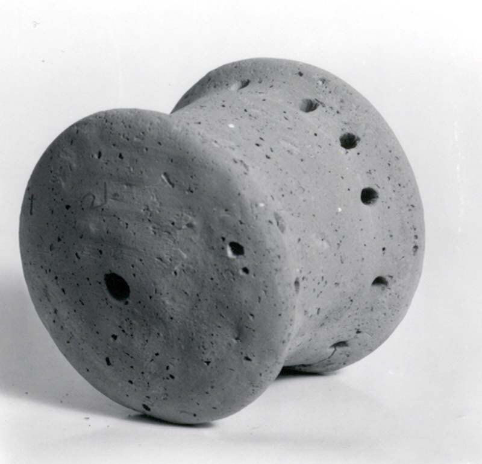

# Human-made Things in the Bible

## License Information

Human-made Things in the Bible © United Bible Societies, 2025. Adapted from: <cite>The Works of Their Hands: Man-made Things in the Bible</cite>, by Ray Pritz © 2009 United Bible Societies. This work is licensed under Creative Commons Attribution-ShareAlike 4.0 International (<a href="https://creativecommons.org/licenses/by-sa/4.0/">https://creativecommons.org/licenses/by-sa/4.0/</a>).

--------------------------------

## 標題：打擊樂器（percussion instruments） (id: REALIA:7.4)

7\.4 標題：打擊樂器（percussion instruments）
====================================

打擊樂器是由可共振的材料製成的，演奏者敲擊或搖動這些樂器使其發聲。這個類別包括從[7\.4\.1 叉鈴 (sistrum)\<REALIA:7\.4\.1\>](#) 一直到[7\.4\.5 木拍板 (wooden clappers)\<REALIA:7\.4\.5\>](#) 的所有條目。為了方便起見，我們也包含了鼓——[7\.4\.6 鼓、手鼓、框鼓 (drum, hand drum, frame drum)\<REALIA:7\.4\.6\>](#) 中的詞條（另參[7\.3\.4 風笛（定音鼓、大鼓）（bagpipe \[kettledrum, large drum]）\<REALIA:7\.3\.4\>](#) ）。鼓聲是通過打擊鼓面一張繃緊的膜而發出來的，這塊膜通常是動物的皮。

## 標題：叉鈴（sistrum） (id: REALIA:7.4.1)

7\.4\.1 標題：叉鈴（sistrum）
======================

經文出處
----

Hebrew 來： שָׁלִישׁ (音譯： shalish)

[1SA 18:6](https://ref.ly/1Sam18:6)

描述
--

*撥浪鼓，一種叉鈴樂器 (© Lalupa \- Wikimedia Commons)*

叉鈴的框架上有一些較短的金屬線，金屬線上穿有一些小金屬環。

---

用途
--

搖動叉鈴時，會發出一種嘎嘎或叮鈴叮鈴的聲音。這種樂器用來為歌舞伴奏。

---

翻譯
--

希伯來文*shalish* 意指「叉鈴」，僅出現在[1SA 18:6](https://ref.ly/1Sam18:6) ，確切含義不明。其他可能的意思有「三角鐵」、「三弦魯特琴」、「三角豎琴」或「三角手鼓」。

* **Associated Passages:** 撒母耳記上 18:6

## 標題：鈸、鐃鈸（cymbals） (id: REALIA:7.4.2)

7\.4\.2 標題：鈸、鐃鈸（cymbals）
========================

經文出處
----

Hebrew 來： מְצִלְתַּיִם (音譯： mtsiltayim)

[1CH 13:8](https://ref.ly/1Chr13:8), [1CH 15:16](https://ref.ly/1Chr15:16), [1CH 15:19](https://ref.ly/1Chr15:19), [1CH 15:28](https://ref.ly/1Chr15:28), [1CH 16:5](https://ref.ly/1Chr16:5), [1CH 16:42](https://ref.ly/1Chr16:42), [1CH 25:1](https://ref.ly/1Chr25:1), [1CH 25:6](https://ref.ly/1Chr25:6), [2CH 5:12](https://ref.ly/2Chr5:12), [2CH 5:13](https://ref.ly/2Chr5:13), [2CH 29:25](https://ref.ly/2Chr29:25), [EZR 3:10](https://ref.ly/Ezra3:10), [NEH 12:27](https://ref.ly/Neh12:27)

Hebrew 來： צֶלְצְלִים (音譯： tseltselim)

[2SA 6:5](https://ref.ly/2Sam6:5), [PSA 150:5](https://ref.ly/Ps150:5), [PSA 150:5](https://ref.ly/Ps150:5)

Greek 希： κύμβαλον (音譯： kumbalon)

[1CO 13:1](https://ref.ly/1Cor13:1), [JDT 16:1](https://ref.ly/Jdt16:1), [1MA 4:54](https://ref.ly/1Macc4:54), [1MA 13:51](https://ref.ly/1Macc13:51), [1ES 5:57](https://ref.ly/1Esd5:57)

描述
--

*鈸 (© Finoskov, CC BY\-SA 4\.0, via Wikimedia Commons)*

鈸是一種打擊樂器，由兩塊金屬圓盤組成，圓盤互相撞擊，發出尖銳、刺耳的聲音。鈸有兩種類型：（1）兩個扁平金屬薄片互相撞擊；（2）兩個圓錐形金屬片，將其中一片的敞開側從上往下碰擊另一片的敞開側。

---

翻譯
--

在許多語言中，「鈸」的對等譯法是「響亮的金屬」之類短語。

[PSA 150:5](https://ref.ly/Ps150:5) 提到了兩種鈸，字面意思分別是「聽鈸」和「喊鈸」。這可能是指「小鈸……大鈸」，也可能是比較詩意的表達方式，實際意思為「響鈸……撞鈸」。

在[1CO 13:1](https://ref.ly/1Cor13:1) 中，GNT (Good News Translation (1992)) 把希臘文*kumbalon* 譯為「鐘」（“bell”）而不是「鈸」，因為鐘更為人所熟知。

* **Associated Passages:** 歷代志上 13:8; 歷代志上 15:16; 歷代志上 15:19; 歷代志上 15:28; 歷代志上 16:5; 歷代志上 16:42; 歷代志上 25:1; 歷代志上 25:6; 歷代志下 5:12; 歷代志下 5:13; 歷代志下 29:25; 以斯拉記 3:10; 尼希米記 12:27; 撒母耳記下 6:5; 詩篇 150:5; 哥林多前書 13:1; 友弟德傳 16:1; 瑪加伯上 4:54; 瑪加伯上 13:51; 厄斯德拉上 5:57

* **Associated ACAI Concepts:** Cymbals (ID: `realia:Cymbals`)

## 標題：鑼（gong） (id: REALIA:7.4.3)

7\.4\.3 標題：鑼（gong）
==================

經文出處
----

Greek 希： χαλκός (音譯： chalkos)

[1CO 13:1](https://ref.ly/1Cor13:1)

描述
--

鑼是一塊中央略凸的圓形金屬片，敲擊時會發出悠長響亮的聲音。

---

翻譯
--

在許多語言中，「鑼」的對等譯詞是「響亮的金屬」、「餘音悠長的金屬」或「回音金屬」；不過，翻譯者通常可以採用短語「響亮的鐘」。

希臘文*chalkos* 可以指紅銅或青銅等金屬，或者指硬幣等由金屬製成的東西（參[1\.6\.3 金錢、錢幣 (money, coins)\<REALIA:1\.6\.3\>](#) ），或者指盔甲。在[1CO 13:1](https://ref.ly/1Cor13:1) 中，這個詞後面緊接著出現了「鈸」，表明*chalkos* 是一種樂器，例如本手冊主張的「鑼」。如[7\.4\.2 鈸、鐃鈸 (cymbals)\<REALIA:7\.4\.2\>](#) 所述，古代的鈸是一種金屬盆子，和現代的鈸一樣成對使用，聲音悅耳。如果目標語言中沒有鑼或鈸，翻譯者必須衡量在他們的文化中，有什麼樂器具有相同的含義。在新約時期，鑼和鈸有時會在異教的儀式中使用，保羅在寫這節經文的時候可能想到了這一點。近期的學術研究認定，這節經文中的希臘文短語*chalkos ēchōn* （字面意為「隆隆作響的黃銅」），可能是指希臘圓形競技場上的一種習俗。人們在競技場後面幾個地方放置一種能產生回音的銅瓶，用來放大舞臺上的歌手或演員的聲音。這是一種擴音器（布朗，第44頁）。

* **Associated Passages:** 哥林多前書 13:1

## 標題：沙鈴、撥浪鼓（shaker, rattle） (id: REALIA:7.4.4)

7\.4\.4 標題：沙鈴、撥浪鼓（shaker, rattle）
=================================

經文出處
----

Hebrew 來： מְנַעַנְעִים (音譯： mna‘an‘im)

[2SA 6:5](https://ref.ly/2Sam6:5)

描述和用途
-----

*振動器（撥浪鼓） (Metropolitan Museum of Art, CC0, via Wikimedia Commons)*

沙鈴是一種封閉的小陶罐，裡面裝著咯咯作響的小顆粒。搖動沙鈴擊打節奏，以助人起舞。

---

翻譯
--

希伯來文*mna‘an‘im* 的確切含義不明，各譯本的譯法也不同，有「拍板」（“castanets”；RSV (Revised Standard Version (1952)) 、JB (Jerusalem Bible (1966)) 、REB (Revised English Bible (1989)) ）、「叉鈴」（“sistrums”；NIV (New International Version (1984)) 、TOB (Traduction Oecuménique de la Bible (French, 1975)) ）和「撥浪鼓」（“rattles”；GNT (Good News Translation (1992)) 、NCV (New Century Version) ）。「拍板」的譯法是把這個詞解作一種打擊樂器，通過碰擊兩片扁平的木頭來發出聲音。另外，「拍板」也暗示與「沙鈴」的手指動作不同，發出的聲音也不相同。GNT (Good News Translation (1992)) 譯為“rattles”（「撥浪鼓」），這種譯法可能會誤導讀者將其與嬰兒玩具聯繫在一起，還有一個不足是撥浪鼓通常與舞蹈無關，並且它在上下文中無法表達出希伯來文詞語的半韻。最好的譯法或許還是採用表示某種沙鈴或撥浪鼓的詞語來翻譯*mna‘an‘im* 。

* **Associated Passages:** 撒母耳記下 6:5

* **Associated ACAI Concepts:** Shaker (ID: `realia:Shaker`); LORD (ID: `deity:Lord`); Lute (ID: `realia:Lute`); Israel (ID: `person:Israel`)

## 標題：木拍板（wooden clappers） (id: REALIA:7.4.5)

7\.4\.5 標題：木拍板（wooden clappers）
===============================

經文出處
----

Hebrew 來： עֵץ, בְּרוֹשׁ (音譯： ‘atsey broshim)

[2SA 6:5](https://ref.ly/2Sam6:5)

描述和用途
-----

拍板的形狀有扁平狀、長圓形、長方形或弧形，可以由木頭、象牙或骨頭製成。所有板子的一端繫在一起，從而能夠互相碰擊，發出清脆、短促的拍打聲。

---

翻譯
--

許多文化都知道與「木拍板」類似的打擊樂器，演奏方法和外觀與拍板類似。

學者對[2SA 6:5](https://ref.ly/2Sam6:5) 中的希伯來文短語*‘atseybroshim* 有幾種解釋。這個短語的字面意思是「柏樹」或「柏木片」，因此有些學者認為它不是指樂器，而是指人們揮舞柏樹枝來表達喜悅之情。還有一些學者將其解作「柏木做的多種樂器」（ITCL (Italian Common Language Version) 直譯），暗示它是經文所列多種樂器中的一個單獨的條目。這個短語也可能是製作列表中後續各種樂器所用的材料；這節經文的後半句可譯為：「他們演奏各樣木製的樂器：琴、瑟、鼓、撥浪鼓和鑼」（NCV (New Century Version) 直譯）。

* **Associated Passages:** 撒母耳記下 6:5

* **Associated ACAI Concepts:** LORD (ID: `deity:Lord`); Phoenician Juniper (ID: `flora:JuniperTree`)

## 標題：鼓、手鼓、框鼓（drum, hand drum, frame drum） (id: REALIA:7.4.6)

7\.4\.6 標題：鼓、手鼓、框鼓（drum, hand drum, frame drum）
===============================================

經文出處
----

Hebrew 來： תֹּף, תפף (音譯： tof, tafaf（動詞）)

[GEN 31:27](https://ref.ly/Gen31:27), [EXO 15:20](https://ref.ly/Exod15:20), [EXO 15:20](https://ref.ly/Exod15:20), [JDG 11:34](https://ref.ly/Judg11:34), [1SA 10:5](https://ref.ly/1Sam10:5), [1SA 18:6](https://ref.ly/1Sam18:6), [2SA 6:5](https://ref.ly/2Sam6:5), [1CH 13:8](https://ref.ly/1Chr13:8), [JOB 21:12](https://ref.ly/Job21:12), [PSA 68:26](https://ref.ly/Ps68:26), [PSA 81:3](https://ref.ly/Ps81:3), [PSA 149:3](https://ref.ly/Ps149:3), [PSA 150:4](https://ref.ly/Ps150:4), [ISA 5:12](https://ref.ly/Isa5:12), [ISA 24:8](https://ref.ly/Isa24:8), [ISA 30:32](https://ref.ly/Isa30:32), [JER 31:4](https://ref.ly/Jer31:4)

Greek 希： τύμπανον (音譯： tumpanon)

[JDT 3:7](https://ref.ly/Jdt3:7), [JDT 16:1](https://ref.ly/Jdt16:1), [1MA 9:39](https://ref.ly/1Macc9:39), [1ES 5:2](https://ref.ly/1Esd5:2)

描述
--

*手鼓（樂器） (© Public Domain \- Wikimedia Commons)*

鼓由一塊膜和一個扁圓形、三角形或方形的框架組成；膜通常由動物皮做成，在框架上張緊固定。

---

用途
--

根據放置鼓的位置，擊鼓者可以用一隻或兩隻手來擊打。擊鼓者可以左手持鼓，把鼓放在左臂下，或者靠在胸前，然後用右手擊打；也可以把鼓放在膝蓋上或地上，然後用一隻或兩隻手擊打。用右手手掌擊鼓時，可以用左手手指來加緊或放鬆鼓面上的張力。

---

翻譯
--

*敲打手鼓的婦女 (Gary Todd, Israel Museum, CC0, via Wikimedia Commons)*

希伯來文*tof* 的出現場合通常與歌唱、遊行或節期有關。考古證據表明，框架上帶金屬圓箍的鼓（「鈴鼓」或「小手鼓」）在聖經時期並不為人所知。一般來說，這個詞最好譯成「手鼓」或「鼓」。

* **Associated Passages:** 創世記 31:27; 出埃及記 15:20; 士師記 11:34; 撒母耳記上 10:5; 撒母耳記上 18:6; 撒母耳記下 6:5; 歷代志上 13:8; 約伯記 21:12; 詩篇 68:26; 詩篇 81:3; 詩篇 149:3; 詩篇 150:4; 以賽亞書 5:12; 以賽亞書 24:8; 以賽亞書 30:32; 耶利米書 31:4; 友弟德傳 3:7; 友弟德傳 16:1; 瑪加伯上 9:39; 厄斯德拉上 5:2

* **Associated ACAI Concepts:** Drum (ID: `realia:Drum`)
