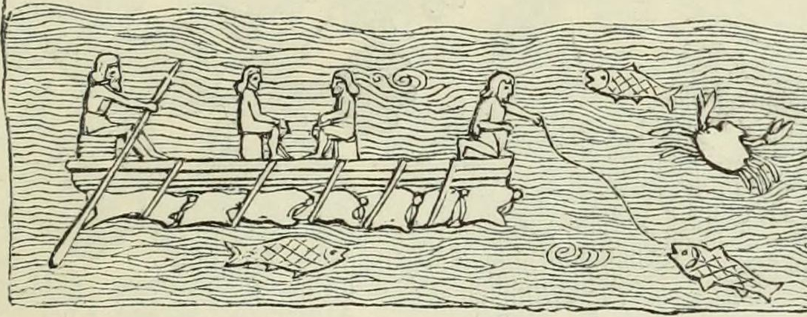

# Human-made Things in the Bible

## License Information

Human-made Things in the Bible © United Bible Societies, 2025. Adapted from: <cite>The Works of Their Hands: Man-made Things in the Bible</cite>, by Ray Pritz © 2009 United Bible Societies. This work is licensed under Creative Commons Attribution-ShareAlike 4.0 International (<a href="https://creativecommons.org/licenses/by-sa/4.0/">https://creativecommons.org/licenses/by-sa/4.0/</a>).

--------------------------------

## 標題：筏子（raft, float） (id: REALIA:8.1.2)

8\.1\.2 標題：筏子（raft, float）
==========================

經文出處
----

Hebrew 來： דֹּבְרוֹת (音譯： dovroth)

[1KI 5:23](https://ref.ly/1Kgs5:23)

Greek 希： σχεδία (音譯： schedia)

[WIS 14:5](https://ref.ly/Wis14:5), [WIS 14:6](https://ref.ly/Wis14:6), [1ES 5:53](https://ref.ly/1Esd5:53)

描述和用途
-----

*一名男子在獸皮製成的充氣木筏上捕魚 (Austen Henry Layard, Nineveh and Babylon: a narrative of a second expedition to Assyria during the years 1849, 1850, and 1851, Public domain, via archive.org)*

筏子是一種漂浮在水上的交通工具，將原木或木板並排綁在一起製成，也可以用充氣的動物皮來製作，如下面的插圖所示。筏子可以用來運輸人或貨物。

---

翻譯
--

雖然許多語言都有專門詞語表示綁在一起做成筏子的原木，但翻譯者應該避免使用專用術語。[1KI 5:23](https://ref.ly/1Kgs5:23) （《和》5:9）的中間部分可譯為：「他們把原木扎在一起，讓它們沿著海岸漂流」（CEV (Contemporary English Version) 直譯）。這裡和[1ES 5:53](https://ref.ly/1Esd5:53) 提到的筏子都不是運輸工具，而是把原木從一個地方運送到另一個地方的方法。

在[WIS 14:5](https://ref.ly/Wis14:5); [WIS 14:6](https://ref.ly/Wis14:6) 中，希臘文*schedia* 一詞有兩種含義。第5節講的是，人只需要一小塊漂浮的木頭，就能在大海上航行。第6節是回憶挪亞和他的家人（以及從他們而來的全人類）藉以得救的方舟。有些譯本在兩節經文中都使用了「筏子」（RSV (Revised Standard Version (1952)) 、NAB (New American Bible (1970)) 、NJB (New Jerusalem Bible (1985)) 直譯）一詞，因此對方舟的提指就比較模糊。NJB (New Jerusalem Bible (1985)) 在第6節添加了一個腳註，表明該處是指挪亞方舟。GNT (Good News Translation (1992)) 的譯法更好一點，在兩節經文中都採用了“boat”（「船」）。GNT (Good News Translation (1992)) 在[WIS 14:1–WIS 14:11](https://ref.ly/Wis14:1-Wis14:11) 的段落標題是「比較木頭偶像與挪亞木船」，這就表明整段經文都與挪亞方舟有關。

* **Associated Passages:** 列王紀上 5:23; 智慧篇 14:5; 智慧篇 14:6; 厄斯德拉上 5:53; 智慧篇 14:1; 智慧篇 14:11

