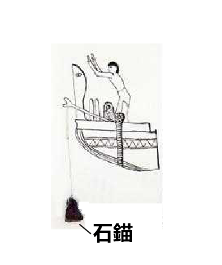
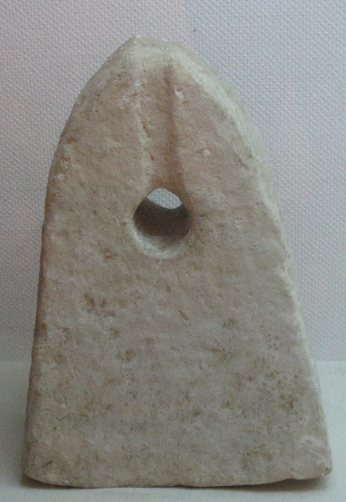

# Human-made Things in the Bible

## License Information

Human-made Things in the Bible © United Bible Societies, 2025. Adapted from: <cite>The Works of Their Hands: Man-made Things in the Bible</cite>, by Ray Pritz © 2009 United Bible Societies. This work is licensed under Creative Commons Attribution-ShareAlike 4.0 International (<a href="https://creativecommons.org/licenses/by-sa/4.0/">https://creativecommons.org/licenses/by-sa/4.0/</a>).

--------------------------------

## 標題：錨（anchor） (id: REALIA:8.1.6)

8\.1\.6 標題：錨（anchor）
====================

經文出處
----

Greek 希： ἄγκυρα (音譯： agkura)

[ACT 27:29](https://ref.ly/Acts27:29), [ACT 27:30](https://ref.ly/Acts27:30), [ACT 27:40](https://ref.ly/Acts27:40), [HEB 6:19](https://ref.ly/Heb6:19)

描述和用途
-----

*鐵錨 (© Bukvoed, CC BY 3\.0, via Wikimedia Commons)*

錨是一個沉重的物件，用繩子或鏈條與船連接在一起，並沉入水底以防止或限制船隻移動。古代的錨通常是用石頭做的，有時是用金屬做的。

---

翻譯
--

*石錨 (© Ray Pritz by United Bible Societies)*

對於住在離海岸很遠的人來說，他們的語言中可能很難找到、甚至很難構想出一個表示「錨」的表達方式。在有些語言中，「錨」被譯為「繫在繩子上的重物，用來防止船移動」，甚或是「把船固定在一個地方的重物」。然而，如果目標讀者對錨毫無所知，那就有必要用旁註來說明錨具體是什麼，然後在經文中使用較簡略的表達方式來翻譯該詞。

*有繩孔的石錨 (© Deror avi, CC BY\-SA 3\.0, via Wikimedia Commons)*

關於[HEB 6:19](https://ref.ly/Heb6:19) 中「錨」的比喻用法，參《〈希伯來書〉手冊》（*A Handbook on The Letter to the Hebrews* ，第130—131頁）中的詳細註解。

* **Associated Passages:** 使徒行傳 27:29; 使徒行傳 27:30; 使徒行傳 27:40; 希伯來書 6:19

