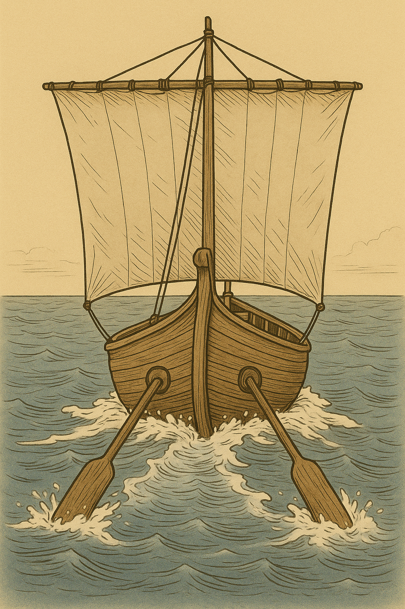

# Human-made Things in the Bible

## License Information

Human-made Things in the Bible © United Bible Societies, 2025. Adapted from: <cite>The Works of Their Hands: Man-made Things in the Bible</cite>, by Ray Pritz © 2009 United Bible Societies. This work is licensed under Creative Commons Attribution-ShareAlike 4.0 International (<a href="https://creativecommons.org/licenses/by-sa/4.0/">https://creativecommons.org/licenses/by-sa/4.0/</a>).

--------------------------------

## 標題：槳、船槳（oar） (id: REALIA:8.1.7)

8\.1\.7 標題：槳、船槳（oar）
====================

經文出處
----

Hebrew 來： מָשׁוֹט (音譯： mashot)

[EZK 27:6](https://ref.ly/Ezek27:6), [EZK 27:29](https://ref.ly/Ezek27:29)

Hebrew 來： שַׁיִט (音譯： shot)

[ISA 33:21](https://ref.ly/Isa33:21)

描述和用途
-----

*(Image generated by ChatGPT using OpenAI technology)*

當風力不足或者必須在一個狹窄的空間內操縱船隻時，可以使用槳來推動船隻。槳是一根長桿，其中一端有較寬的扁平面。在水中推動這個扁平面時會產生水的阻力，從而使船舶向前或向後移動。通常，槳桿中段的某個位置會與船連接在一起。對於較大的船隻，通常是把槳桿穿過船身上的一個開口。參[8\.1\.8 舵槳、船舵 (steering oar, rudder)\<REALIA:8\.1\.8\>](#) 中的插圖。

* **Associated Passages:** 以西結書 27:6; 以西結書 27:29; 以賽亞書 33:21

