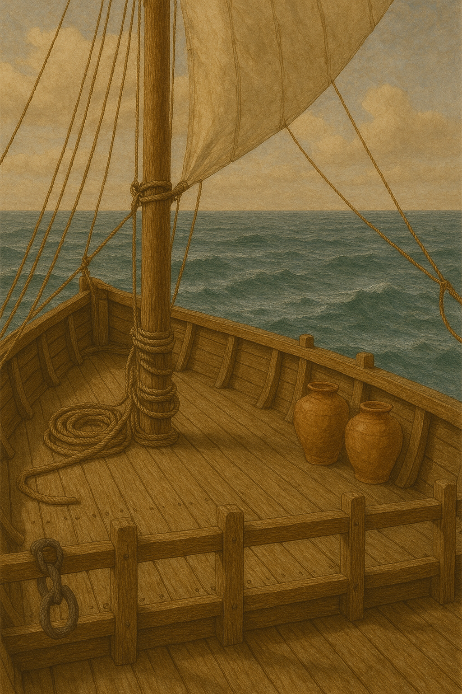

# Human-made Things in the Bible

## License Information

Human-made Things in the Bible © United Bible Societies, 2025. Adapted from: <cite>The Works of Their Hands: Man-made Things in the Bible</cite>, by Ray Pritz © 2009 United Bible Societies. This work is licensed under Creative Commons Attribution-ShareAlike 4.0 International (<a href="https://creativecommons.org/licenses/by-sa/4.0/">https://creativecommons.org/licenses/by-sa/4.0/</a>).

--------------------------------

## 標題：甲板、艙板（deck） (id: REALIA:8.1.11)

8\.1\.11 標題：甲板、艙板（deck）
=======================

經文出處
----

Hebrew 來： תַּחְתִּי (音譯： tachti)

[GEN 6:16](https://ref.ly/Gen6:16)

Hebrew 來： קֶרֶשׁ (音譯： qeresh)

[EZK 27:6](https://ref.ly/Ezek27:6)

Greek 希： σανίδωμα (音譯： sanidōma)

[3MA 4:10](https://ref.ly/3Macc4:10)

描述
--

*(Image generated by ChatGPT using OpenAI technology)*

甲板是從船的一邊延伸到另一邊的平臺。較大的船隻可能有多層甲板。[GEN 6:0](https://ref.ly/Gen6:0) 描述的方舟有三層甲板。

---

翻譯
--

船的「甲板」相當於建築物的「樓層」，有些譯本在[GEN 6:16](https://ref.ly/Gen6:16) 中使用了「樓層」（“stories”；CEV (Contemporary English Version) ）一詞。GECL (German Common Language Version (Gute Nachricht Bibel)) 將這節經文的最後一個分擴展譯為：「要在裡面佈置兩層中間甲板，這樣，它有三層高。」挪亞建造的那艘大船的三層甲板顯然都在船的內部，因為方舟和一般的古代船隻不同，它的整體結構是有頂的。

戰車：參[2\.15 車、馬車、戰車、車輦 (chariot)\<REALIA:2\.15\>](#) 。

* **Associated Passages:** 創世記 6:16; 以西結書 27:6; 瑪加伯三書 4:10; 創世記 6:0

