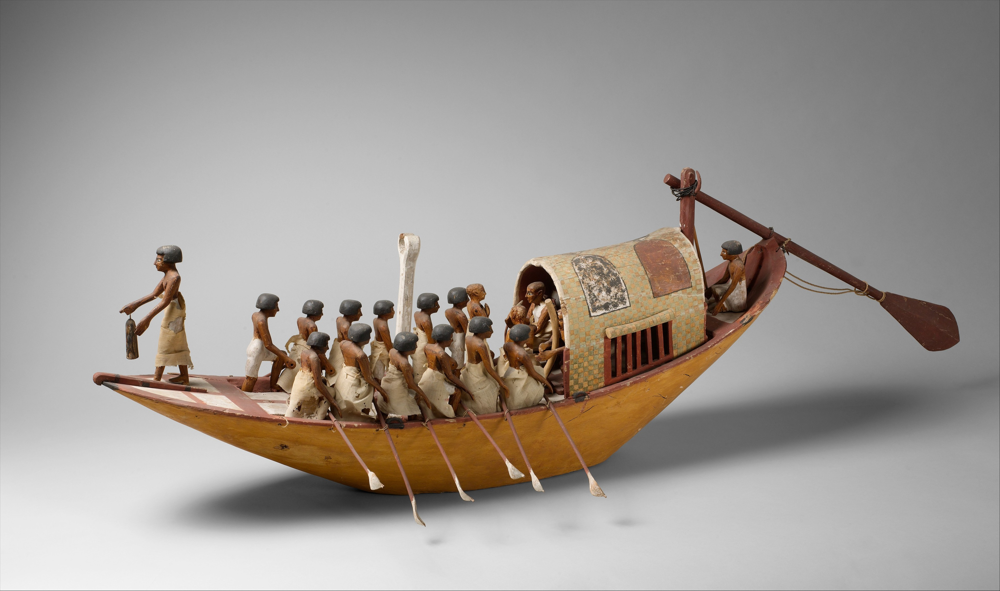
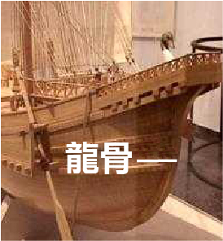
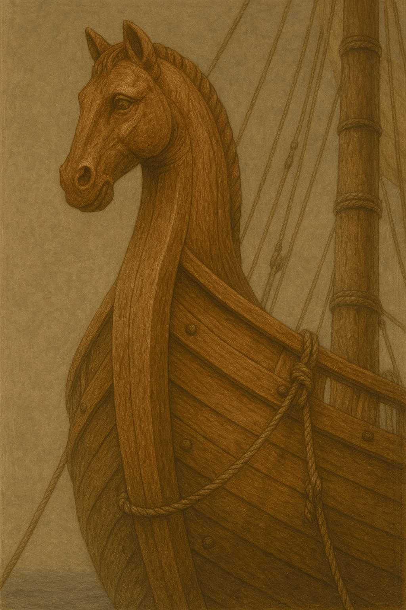

# Human-made Things in the Bible

## License Information

Human-made Things in the Bible © United Bible Societies, 2025. Adapted from: <cite>The Works of Their Hands: Man-made Things in the Bible</cite>, by Ray Pritz © 2009 United Bible Societies. This work is licensed under Creative Commons Attribution-ShareAlike 4.0 International (<a href="https://creativecommons.org/licenses/by-sa/4.0/">https://creativecommons.org/licenses/by-sa/4.0/</a>).

--------------------------------

## 標題：小船、大船（boat, ship） (id: REALIA:8.1)

8\.1 標題：小船、大船（boat, ship）
=========================

經文出處
----

Hebrew 來： אֳנִי (音譯： ’oni)

[1KI 9:26](https://ref.ly/1Kgs9:26), [1KI 9:27](https://ref.ly/1Kgs9:27), [1KI 10:11](https://ref.ly/1Kgs10:11), [1KI 10:22](https://ref.ly/1Kgs10:22), [1KI 10:22](https://ref.ly/1Kgs10:22), [1KI 10:22](https://ref.ly/1Kgs10:22), [ISA 33:21](https://ref.ly/Isa33:21)

Hebrew 來： אֳנִיָּה (音譯： ’oniyah)

[GEN 49:13](https://ref.ly/Gen49:13), [DEU 28:68](https://ref.ly/Deut28:68), [JDG 5:17](https://ref.ly/Judg5:17), [1KI 9:27](https://ref.ly/1Kgs9:27), [1KI 22:49](https://ref.ly/1Kgs22:49), [1KI 22:49](https://ref.ly/1Kgs22:49), [1KI 22:50](https://ref.ly/1Kgs22:50), [2CH 8:18](https://ref.ly/2Chr8:18), [2CH 8:18](https://ref.ly/2Chr8:18), [2CH 9:21](https://ref.ly/2Chr9:21), [2CH 9:21](https://ref.ly/2Chr9:21), [2CH 20:36](https://ref.ly/2Chr20:36), [2CH 20:36](https://ref.ly/2Chr20:36), [2CH 20:37](https://ref.ly/2Chr20:37), [JOB 9:26](https://ref.ly/Job9:26), [PSA 48:8](https://ref.ly/Ps48:8), [PSA 104:26](https://ref.ly/Ps104:26), [PSA 107:23](https://ref.ly/Ps107:23), [PRO 30:19](https://ref.ly/Prov30:19), [PRO 31:14](https://ref.ly/Prov31:14), [ISA 2:16](https://ref.ly/Isa2:16), [ISA 23:1](https://ref.ly/Isa23:1), [ISA 23:14](https://ref.ly/Isa23:14), [ISA 60:9](https://ref.ly/Isa60:9), [EZK 27:9](https://ref.ly/Ezek27:9), [EZK 27:25](https://ref.ly/Ezek27:25), [EZK 27:29](https://ref.ly/Ezek27:29), [DAN 11:40](https://ref.ly/Dan11:40), [JON 1:3](https://ref.ly/Jonah1:3), [JON 1:4](https://ref.ly/Jonah1:4), [JON 1:5](https://ref.ly/Jonah1:5)

Hebrew 來： כְּלִי, גֹּמֶא (音譯： kle gome’)

[ISA 18:2](https://ref.ly/Isa18:2)

Hebrew 來： סְפִינָה (音譯： sfinah)

[JON 1:5](https://ref.ly/Jonah1:5)

Hebrew 來： צִי (音譯： tsi)

[NUM 24:24](https://ref.ly/Num24:24), [ISA 33:21](https://ref.ly/Isa33:21), [EZK 30:9](https://ref.ly/Ezek30:9), [DAN 11:30](https://ref.ly/Dan11:30)

Greek 希： ναυαγέω (音譯： nauageō（動詞）)

[2CO 11:25](https://ref.ly/2Cor11:25), [1TI 1:19](https://ref.ly/1Tim1:19)

Greek 希： ναύκληρος (音譯： nauklēros)

[ACT 27:11](https://ref.ly/Acts27:11)

Greek 希： ναῦς (音譯： naus)

[ACT 27:41](https://ref.ly/Acts27:41), [WIS 5:10](https://ref.ly/Wis5:10), [4MA 7:1](https://ref.ly/4Macc7:1)

Greek 希： πλοιάριον (音譯： ploiarion)

[MRK 3:9](https://ref.ly/Mark3:9), [JHN 6:22](https://ref.ly/John6:22), [JHN 6:23](https://ref.ly/John6:23), [JHN 6:24](https://ref.ly/John6:24), [JHN 21:8](https://ref.ly/John21:8)

Greek 希： πλοῖον (音譯： ploion)

[MAT 4:21](https://ref.ly/Matt4:21), [MAT 4:22](https://ref.ly/Matt4:22), [MAT 8:23](https://ref.ly/Matt8:23), [MAT 8:24](https://ref.ly/Matt8:24), [MAT 9:1](https://ref.ly/Matt9:1), [MAT 13:2](https://ref.ly/Matt13:2), [MAT 14:13](https://ref.ly/Matt14:13), [MAT 14:22](https://ref.ly/Matt14:22), [MAT 14:24](https://ref.ly/Matt14:24), [MAT 14:29](https://ref.ly/Matt14:29), [MAT 14:32](https://ref.ly/Matt14:32), [MAT 14:33](https://ref.ly/Matt14:33), [MAT 15:39](https://ref.ly/Matt15:39), [MRK 1:19](https://ref.ly/Mark1:19), [MRK 1:20](https://ref.ly/Mark1:20), [MRK 4:1](https://ref.ly/Mark4:1), [MRK 4:36](https://ref.ly/Mark4:36), [MRK 4:36](https://ref.ly/Mark4:36), [MRK 4:37](https://ref.ly/Mark4:37), [MRK 4:37](https://ref.ly/Mark4:37), [MRK 5:2](https://ref.ly/Mark5:2), [MRK 5:18](https://ref.ly/Mark5:18), [MRK 5:21](https://ref.ly/Mark5:21), [MRK 6:32](https://ref.ly/Mark6:32), [MRK 6:45](https://ref.ly/Mark6:45), [MRK 6:47](https://ref.ly/Mark6:47), [MRK 6:51](https://ref.ly/Mark6:51), [MRK 6:54](https://ref.ly/Mark6:54), [MRK 8:10](https://ref.ly/Mark8:10), [MRK 8:14](https://ref.ly/Mark8:14), [LUK 5:2](https://ref.ly/Luke5:2), [LUK 5:3](https://ref.ly/Luke5:3), [LUK 5:3](https://ref.ly/Luke5:3), [LUK 5:7](https://ref.ly/Luke5:7), [LUK 5:7](https://ref.ly/Luke5:7), [LUK 5:11](https://ref.ly/Luke5:11), [LUK 8:22](https://ref.ly/Luke8:22), [LUK 8:37](https://ref.ly/Luke8:37), [JHN 6:17](https://ref.ly/John6:17), [JHN 6:19](https://ref.ly/John6:19), [JHN 6:21](https://ref.ly/John6:21), [JHN 6:21](https://ref.ly/John6:21), [JHN 6:22](https://ref.ly/John6:22), [JHN 6:23](https://ref.ly/John6:23), [JHN 21:3](https://ref.ly/John21:3), [JHN 21:6](https://ref.ly/John21:6), [ACT 20:13](https://ref.ly/Acts20:13), [ACT 20:38](https://ref.ly/Acts20:38), [ACT 21:2](https://ref.ly/Acts21:2), [ACT 21:3](https://ref.ly/Acts21:3), [ACT 21:6](https://ref.ly/Acts21:6), [ACT 27:2](https://ref.ly/Acts27:2), [ACT 27:6](https://ref.ly/Acts27:6), [ACT 27:10](https://ref.ly/Acts27:10), [ACT 27:15](https://ref.ly/Acts27:15), [ACT 27:17](https://ref.ly/Acts27:17), [ACT 27:19](https://ref.ly/Acts27:19), [ACT 27:22](https://ref.ly/Acts27:22), [ACT 27:30](https://ref.ly/Acts27:30), [ACT 27:31](https://ref.ly/Acts27:31), [ACT 27:37](https://ref.ly/Acts27:37), [ACT 27:38](https://ref.ly/Acts27:38), [ACT 27:39](https://ref.ly/Acts27:39), [ACT 27:44](https://ref.ly/Acts27:44), [ACT 28:11](https://ref.ly/Acts28:11), [JAS 3:4](https://ref.ly/Jas3:4), [REV 8:9](https://ref.ly/Rev8:9), [REV 18:19](https://ref.ly/Rev18:19), [WIS 14:1](https://ref.ly/Wis14:1), [SIR 33:2](https://ref.ly/Sir33:2), [1MA 8:26](https://ref.ly/1Macc8:26), [1MA 8:28](https://ref.ly/1Macc8:28), [1MA 11:1](https://ref.ly/1Macc11:1), [1MA 13:29](https://ref.ly/1Macc13:29), [1MA 15:3](https://ref.ly/1Macc15:3), [1MA 15:14](https://ref.ly/1Macc15:14), [1MA 15:37](https://ref.ly/1Macc15:37), [3MA 4:7](https://ref.ly/3Macc4:7), [3MA 4:9](https://ref.ly/3Macc4:9)

Greek 希： σκάφη, σκάφος (音譯： skafē)

[ACT 27:16](https://ref.ly/Acts27:16), [ACT 27:30](https://ref.ly/Acts27:30), [ACT 27:32](https://ref.ly/Acts27:32), [BEL 1:33](https://ref.ly/Bel1:33), [2MA 12:3](https://ref.ly/2Macc12:3), [2MA 12:6](https://ref.ly/2Macc12:6)

Greek 希： στόλος (音譯： stolos)

[1MA 1:17](https://ref.ly/1Macc1:17), [2MA 12:9](https://ref.ly/2Macc12:9), [2MA 14:1](https://ref.ly/2Macc14:1), [3MA 7:17](https://ref.ly/3Macc7:17)

Greek 希： τριήρης (音譯： triērēs)

[2MA 4:20](https://ref.ly/2Macc4:20)

Latin 拉： navis

[2ES 9:34](https://ref.ly/2Esd9:34), [2ES 12:42](https://ref.ly/2Esd12:42)

描述和用途
-----

*帆船 (© Free Bible Images © David Padfield)*

船是用於水上航行和運輸的工具，大小不一，小至僅容得下三四個人的小船，大到能運載很多人和大量貨物的遠洋船舶。船隻通常是木製的，不過，埃及人也用蘆葦來做小船的一些零部件。船的推進方式有幾種：在桅杆上掛上風帆，借助風力推動船隻；較小的船隻（也有一些較大的船隻）使用船槳划動；在水淺的地方，可以用一根長杆推動船沿著河床或河岸移動。

---

翻譯
--

*漁夫在捲起了帆的船上 (© Free Bible Images © David Padfield)*

有些時候，翻譯者必須清楚區分小型漁船和大型船隻。在許多文化中，人們根據有沒有甲板來區分小船和大船（參[8\.1\.11 甲板、艙板 (deck)\<REALIA:8\.1\.11\>](#) ）。加利利海上的漁船可能沒有甲板，然而地中海上的遠航船隻肯定有甲板。

翻譯者要避免使用指現代遠洋蒸汽動力船舶的詞語；聖經中提到的所有較大的船隻都是由帆或槳提供動力的；方舟除外，方舟沒有推進系統。在只知道小型漁船的內陸文明中，需要將「大船」譯為「在海上航行的大船」或「在海上靠帆推進的大船」。

[JOB 9:26](https://ref.ly/Job9:26) ：「蒲草船」（“Skiffs of reed”；RSV (Revised Standard Version (1952)) ）或紙莎草船是尼羅河上的船隻，船舷是用紙莎草做成的，以速度快而聞名。這節經文的第一行可以譯為：「我的日子過得飛快，如快速行駛的帆船。」在帆船不為人知的地區，可以使用任何航行快速的水上交通工具來進行比較；例如，「我的日子過得飛快，如同一條飛快的獨木舟。」而在根本不知道船的地方，可能需要放棄船的比喻，譯為「我的生命很快就結束了」，或「我生命的日子很快就結束了。」

*希臘多槳戰船 (© Deutsches Museum, Munich, Germany, via Wikimedia Commons)*

[ISA 18:2](https://ref.ly/Isa18:2) ：希伯來文短語*kle gome’* 很罕見，在這裡的意思是「紙莎草船」（“vessels of papyrus”；RSV (Revised Standard Version (1952)) ）或「紙莎草蘆葦做成的小船」，相當於[JOB 9:26](https://ref.ly/Job9:26) 中的希伯來文短語*’oniyoth ’eveh* 。CEV (Contemporary English Version) 提供了一個腳註，「在古埃及，生長在尼羅河三角洲的紙莎草蘆葦非常有名」；但是，它的譯法“ships made of reeds”（「蘆葦做成的大船」）會讓讀者覺得這是一艘很大的船。GNT (Good News Translation (1992)) 和NCV (New Century Version) 的譯法“boats made of reeds”（「蘆葦做成的小船」）更好；比較NJB (New Jerusalem Bible (1985)) 的“little reed\-boats”（「小蘆葦船」）。

在[JON 1:5](https://ref.ly/Jonah1:5) 中，希伯來文*sfinah* 指一艘有篷和甲板的船，相當於*’oniyah* 。那麼，約拿是在哪裡睡覺呢？若說是在「船艙」（GNT (Good News Translation (1992)) 直譯）裡面，那麼有可能把這艘船的構造描述的比實際情況更加複雜；該希伯來文在這裡是指任何凹處或角落，就好像在洞穴（[1SA 24:4](https://ref.ly/1Sam24:4) ［《和》24:3］）或房屋（[AMO 6:10](https://ref.ly/Amos6:10) ）裡面似的。約拿只是在找一個最偏僻、最舒服的地方安靜地睡覺，這樣他就不會被打擾。建議譯作「甲板下面」（如CEV (Contemporary English Version) ），或「船底」（如FRCL (French Common Language Version (Bible en français courant)) ）。

在福音書中，希臘文*ploion* 和*ploiarion* 並沒有真正的區別，雖然*ploiarion* 可以指「較小的」*ploion* 。這兩個詞都是指一種漁船，長約8\.5米（28英呎），寬約2\.5米（8英呎），可容納12至15人。在《使徒行傳》、[JAS 3:4](https://ref.ly/Jas3:4) 和[REV 18:17](https://ref.ly/Rev18:17); [REV 18:19](https://ref.ly/Rev18:19) 中，*ploion* 指的是一種較大、能夠在廣闊的大海上航行的船舶。這個詞在[REV 18:17](https://ref.ly/Rev18:17); [REV 18:19](https://ref.ly/Rev18:19) 也是指這種大船，在[REV 8:9](https://ref.ly/Rev8:9) 中可能指多種不同大小的船隻。

[ACT 27:16](https://ref.ly/Acts27:16); [ACT 27:30](https://ref.ly/Acts27:30); [ACT 27:32](https://ref.ly/Acts27:32) ：在這些經文中，希臘文*skafē* 指的是一種小船，通常放在一艘比較大的船隻上面，供水手下錨、修理船隻時使用，或者在遇到風暴時用來逃生。在一些語言中，*skafē* 相當於「划艇」或「救生船」。

在上面列出的一些經文中（如[2MA 4:20](https://ref.ly/2Macc4:20) ），該詞指的是「戰船」，上下文通常會表明這一點。如果目標語言有專門用詞表示為戰爭而建造的船隻，翻譯者可以使用這些專門用詞。但是翻譯者需要注意，不要使用與時代不符、表示現代特種戰艦的詞語，如巡洋艦、戰列艦、航空母艦等。

希伯來文*’oni* 和*tsi* 、希臘文*stolos* 指的是一大隊船舶，即「船隊」。

* **Associated Passages:** 列王紀上 9:26; 列王紀上 9:27; 列王紀上 10:11; 列王紀上 10:22; 以賽亞書 33:21; 創世記 49:13; 申命記 28:68; 士師記 5:17; 列王紀上 22:49; 列王紀上 22:50; 歷代志下 8:18; 歷代志下 9:21; 歷代志下 20:36; 歷代志下 20:37; 約伯記 9:26; 詩篇 48:8; 詩篇 104:26; 詩篇 107:23; 箴言 30:19; 箴言 31:14; 以賽亞書 2:16; 以賽亞書 23:1; 以賽亞書 23:14; 以賽亞書 60:9; 以西結書 27:9; 以西結書 27:25; 以西結書 27:29; 但以理書 11:40; 約拿書 1:3; 約拿書 1:4; 約拿書 1:5; 以賽亞書 18:2; 民數記 24:24; 以西結書 30:9; 但以理書 11:30; 哥林多後書 11:25; 提摩太前書 1:19; 使徒行傳 27:11; 使徒行傳 27:41; 智慧篇 5:10; 瑪加伯四書 7:1; 馬可福音 3:9; 約翰福音 6:22; 約翰福音 6:23; 約翰福音 6:24; 約翰福音 21:8; 馬太福音 4:21; 馬太福音 4:22; 馬太福音 8:23; 馬太福音 8:24; 馬太福音 9:1; 馬太福音 13:2; 馬太福音 14:13; 馬太福音 14:22; 馬太福音 14:24; 馬太福音 14:29; 馬太福音 14:32; 馬太福音 14:33; 馬太福音 15:39; 馬可福音 1:19; 馬可福音 1:20; 馬可福音 4:1; 馬可福音 4:36; 馬可福音 4:37; 馬可福音 5:2; 馬可福音 5:18; 馬可福音 5:21; 馬可福音 6:32; 馬可福音 6:45; 馬可福音 6:47; 馬可福音 6:51; 馬可福音 6:54; 馬可福音 8:10; 馬可福音 8:14; 路加福音 5:2; 路加福音 5:3; 路加福音 5:7; 路加福音 5:11; 路加福音 8:22; 路加福音 8:37; 約翰福音 6:17; 約翰福音 6:19; 約翰福音 6:21; 約翰福音 21:3; 約翰福音 21:6; 使徒行傳 20:13; 使徒行傳 20:38; 使徒行傳 21:2; 使徒行傳 21:3; 使徒行傳 21:6; 使徒行傳 27:2; 使徒行傳 27:6; 使徒行傳 27:10; 使徒行傳 27:15; 使徒行傳 27:17; 使徒行傳 27:19; 使徒行傳 27:22; 使徒行傳 27:30; 使徒行傳 27:31; 使徒行傳 27:37; 使徒行傳 27:38; 使徒行傳 27:39; 使徒行傳 27:44; 使徒行傳 28:11; 雅各書 3:4; 啟示錄 8:9; 啟示錄 18:19; 智慧篇 14:1; 德訓篇 33:2; 瑪加伯上 8:26; 瑪加伯上 8:28; 瑪加伯上 11:1; 瑪加伯上 13:29; 瑪加伯上 15:3; 瑪加伯上 15:14; 瑪加伯上 15:37; 瑪加伯三書 4:7; 瑪加伯三書 4:9; 使徒行傳 27:16; 使徒行傳 27:32; 彼勒與大龍 1:33; 瑪加伯下 12:3; 瑪加伯下 12:6; 瑪加伯上 1:17; 瑪加伯下 12:9; 瑪加伯下 14:1; 瑪加伯三書 7:17; 瑪加伯下 4:20; 厄斯德拉下 9:34; 厄斯德拉下 12:42; 撒母耳記上 24:4; 阿摩司書 6:10; 啟示錄 18:17

* **Associated ACAI Concepts:** Ship (ID: `realia:Ship`)

## 標題：箱、小舟（basket, small boat） (id: REALIA:8.1.1)

8\.1\.1 標題：箱、小舟（basket, small boat）
===================================

經文出處
----

Hebrew 來： תֵּבָה (音譯： tevah)

[EXO 2:3](https://ref.ly/Exod2:3), [EXO 2:5](https://ref.ly/Exod2:5)

描述
--

*蘆葦籃 (Don Ellens, The Tabernacle of Israel, Harris, Jones 1888, Public domain)*

[EXO 2:3](https://ref.ly/Exod2:3) 提到的籃子是用蒲草做的小舟。經文沒有給出確切大小，但應該足以容納一個新生的嬰兒。籃子用焦油（柏油）和樹脂做了防水處理，應該是抹在籃子的外面。

---

翻譯
--

較早的一些英文譯本將[EXO 2:3](https://ref.ly/Exod2:3); [EXO 2:5](https://ref.ly/Exod2:5) 中的希伯來文*tevah* 譯為“ark”（KJV (King James Version (1611)) ，與「方舟」同），容易使讀者感到迷惑。雖然經文用這個希伯來文詞語（字面意為「箱子」）同時指這個小船和挪亞的大船（參[8\.1\.3 方舟、大船 (ark, ship)\<REALIA:8\.1\.3\>](#) ），但翻譯者不應該用同一個詞來表示這兩者。

* **Associated Passages:** 出埃及記 2:3; 出埃及記 2:5

* **Associated ACAI Concepts:** Ship (ID: `realia:Ship`); Cattails (ID: `flora:Cattails`)

## 標題：筏子（raft, float） (id: REALIA:8.1.2)

8\.1\.2 標題：筏子（raft, float）
==========================

經文出處
----

Hebrew 來： דֹּבְרוֹת (音譯： dovroth)

[1KI 5:23](https://ref.ly/1Kgs5:23)

Greek 希： σχεδία (音譯： schedia)

[WIS 14:5](https://ref.ly/Wis14:5), [WIS 14:6](https://ref.ly/Wis14:6), [1ES 5:53](https://ref.ly/1Esd5:53)

描述和用途
-----

*一名男子在獸皮製成的充氣木筏上捕魚 (Austen Henry Layard, Nineveh and Babylon: a narrative of a second expedition to Assyria during the years 1849, 1850, and 1851, Public domain, via archive.org)*

筏子是一種漂浮在水上的交通工具，將原木或木板並排綁在一起製成，也可以用充氣的動物皮來製作，如下面的插圖所示。筏子可以用來運輸人或貨物。

---

翻譯
--

雖然許多語言都有專門詞語表示綁在一起做成筏子的原木，但翻譯者應該避免使用專用術語。[1KI 5:23](https://ref.ly/1Kgs5:23) （《和》5:9）的中間部分可譯為：「他們把原木扎在一起，讓它們沿著海岸漂流」（CEV (Contemporary English Version) 直譯）。這裡和[1ES 5:53](https://ref.ly/1Esd5:53) 提到的筏子都不是運輸工具，而是把原木從一個地方運送到另一個地方的方法。

在[WIS 14:5](https://ref.ly/Wis14:5); [WIS 14:6](https://ref.ly/Wis14:6) 中，希臘文*schedia* 一詞有兩種含義。第5節講的是，人只需要一小塊漂浮的木頭，就能在大海上航行。第6節是回憶挪亞和他的家人（以及從他們而來的全人類）藉以得救的方舟。有些譯本在兩節經文中都使用了「筏子」（RSV (Revised Standard Version (1952)) 、NAB (New American Bible (1970)) 、NJB (New Jerusalem Bible (1985)) 直譯）一詞，因此對方舟的提指就比較模糊。NJB (New Jerusalem Bible (1985)) 在第6節添加了一個腳註，表明該處是指挪亞方舟。GNT (Good News Translation (1992)) 的譯法更好一點，在兩節經文中都採用了“boat”（「船」）。GNT (Good News Translation (1992)) 在[WIS 14:1–WIS 14:11](https://ref.ly/Wis14:1-Wis14:11) 的段落標題是「比較木頭偶像與挪亞木船」，這就表明整段經文都與挪亞方舟有關。

* **Associated Passages:** 列王紀上 5:23; 智慧篇 14:5; 智慧篇 14:6; 厄斯德拉上 5:53; 智慧篇 14:1; 智慧篇 14:11

## 標題：方舟、大船（ark, ship） (id: REALIA:8.1.3)

8\.1\.3 標題：方舟、大船（ark, ship）
===========================

經文出處
----

Hebrew 來： תֵּבָה (音譯： tevah)

[GEN 6:14](https://ref.ly/Gen6:14), [GEN 6:14](https://ref.ly/Gen6:14), [GEN 6:15](https://ref.ly/Gen6:15), [GEN 6:16](https://ref.ly/Gen6:16), [GEN 6:16](https://ref.ly/Gen6:16), [GEN 6:18](https://ref.ly/Gen6:18), [GEN 6:19](https://ref.ly/Gen6:19), [GEN 7:1](https://ref.ly/Gen7:1), [GEN 7:7](https://ref.ly/Gen7:7), [GEN 7:9](https://ref.ly/Gen7:9), [GEN 7:13](https://ref.ly/Gen7:13), [GEN 7:15](https://ref.ly/Gen7:15), [GEN 7:17](https://ref.ly/Gen7:17), [GEN 7:18](https://ref.ly/Gen7:18), [GEN 7:23](https://ref.ly/Gen7:23), [GEN 8:1](https://ref.ly/Gen8:1), [GEN 8:4](https://ref.ly/Gen8:4), [GEN 8:6](https://ref.ly/Gen8:6), [GEN 8:9](https://ref.ly/Gen8:9), [GEN 8:9](https://ref.ly/Gen8:9), [GEN 8:10](https://ref.ly/Gen8:10), [GEN 8:13](https://ref.ly/Gen8:13), [GEN 8:16](https://ref.ly/Gen8:16), [GEN 8:19](https://ref.ly/Gen8:19), [GEN 9:10](https://ref.ly/Gen9:10), [GEN 9:18](https://ref.ly/Gen9:18)

Greek 希： κιβωτός (音譯： kibōtos)

[MAT 24:38](https://ref.ly/Matt24:38), [LUK 17:27](https://ref.ly/Luke17:27), [HEB 11:7](https://ref.ly/Heb11:7), [1PE 3:20](https://ref.ly/1Pet3:20), [4MA 15:31](https://ref.ly/4Macc15:31)

描述
--

*藝術家筆下的挪亞方舟 (Don Ellens, The Tabernacle of Israel, Harris, Jones 1888, Public domain)*

方舟是挪亞建造的一艘大船。[GEN 6:14](https://ref.ly/Gen6:14); [GEN 6:15](https://ref.ly/Gen6:15); [GEN 6:16](https://ref.ly/Gen6:16) 描述了方舟的尺寸和材料：長135—150米（443—492英呎），寬22\.5—25米（74—82英呎），高13\.5—15米（44—49英呎）；方舟為木製，有三層甲板和一個頂。每層甲板都被分成許多房間或隔間。除了側面有一扇門和一扇窗（大小不詳）之外，方舟四圍都是封閉的，看起來像是一個大木箱。

---

翻譯
--

希伯來文*tevah* 和希臘文*kibōtos* 的主要意思是「盒子」或「胸膛」。顯然，這兩個詞用來指稱挪亞方舟，是因為方舟的構造為方形，並且更像是駁船而不是海船。然而，在大多數語言中，考慮到挪亞方舟的大小，將其稱為「船」可能是最合適的。

翻譯[GEN 6:15](https://ref.ly/Gen6:15); [GEN 6:16](https://ref.ly/Gen6:16) 中給出的挪亞方舟的尺寸時，最好使用讀者能夠理解的現代度量單位。GNT (Good News Translation (1992)) 的美國版使用了英呎和英吋，而其他現代語言譯本（如SPCL (Spanish Common Language Version (Dios Habla Hoy)) 、FRCL (French Common Language Version (Bible en français courant)) ）則使用了公制單位。雖然[GEN 6:0](https://ref.ly/Gen6:0) 所用希伯來單位的確切長度不確定，但方舟的尺寸表明，它顯然是20世紀初期之前人類所建造的最大的船。在可能的情況下，譯本應反映出這是一艘非常大的船舶。例如，在英文中，“ship”（「大船」）就比“boat”（「小船」）更加合適。

* **Associated Passages:** 創世記 6:14; 創世記 6:15; 創世記 6:16; 創世記 6:18; 創世記 6:19; 創世記 7:1; 創世記 7:7; 創世記 7:9; 創世記 7:13; 創世記 7:15; 創世記 7:17; 創世記 7:18; 創世記 7:23; 創世記 8:1; 創世記 8:4; 創世記 8:6; 創世記 8:9; 創世記 8:10; 創世記 8:13; 創世記 8:16; 創世記 8:19; 創世記 9:10; 創世記 9:18; 馬太福音 24:38; 路加福音 17:27; 希伯來書 11:7; 彼得前書 3:20; 瑪加伯四書 15:31; 創世記 6:0

* **Associated ACAI Concepts:** Ship (ID: `realia:Ship`)

## 標題：桅杆（mast） (id: REALIA:8.1.4)

8\.1\.4 標題：桅杆（mast）
===================

經文出處
----

Hebrew 來： חִבֵּל (音譯： chibel)

[PRO 23:34](https://ref.ly/Prov23:34)

Hebrew 來： תֹּרֶן (音譯： toren)

[ISA 33:23](https://ref.ly/Isa33:23), [EZK 27:5](https://ref.ly/Ezek27:5)

描述
--

桅杆是一根堅固的木杆，上面繫著船帆（參[8\.1\.5 帆 (sail)\<REALIA:8\.1\.5\>](#) ）。這根杆子垂直立在船上，並且固定到船的底部。桅杆的高度和直徑根據船的大小而不同。

---

翻譯
--

在[PRO 23:34](https://ref.ly/Prov23:34) 中，有些譯本把希伯來文*chibel* 譯為「索具」（“rigging”；REB (Revised English Bible (1989)) 、HOTTP (Hebrew Old Testament Text Project (UBS)) ）。然而，在無法表達「桅杆」的語言中，可能也同樣難以表達「索具」。在很難表達船的桅杆和索具的文化中，翻譯者可以借鑒CEV (Contemporary English Version) 的做法，把整節經文譯為：「你必感到顛簸，如同人在暴風雨吹襲的船上入睡。」

* **Associated Passages:** 箴言 23:34; 以賽亞書 33:23; 以西結書 27:5

* **Associated ACAI Concepts:** Mast (ID: `realia:Mast`)

## 標題：帆（sail） (id: REALIA:8.1.5)

8\.1\.5 標題：帆（sail）
==================

經文出處
----

Hebrew 來： נֵס (音譯： nes)

[ISA 33:23](https://ref.ly/Isa33:23)

Hebrew 來： מִפְרָשׂ (音譯： mifras)

[EZK 27:7](https://ref.ly/Ezek27:7)

Greek 希： ἀρτέμων (音譯： artemōn)

[ACT 27:40](https://ref.ly/Acts27:40)

描述和用途
-----

帆是繫在船隻上方的一塊布，用來兜住風，從而使船在水中行進。

---

翻譯
--

在有些語言中，帆可以譯為「使船移動的一塊布」或「船上用來兜住風的布」。在[ACT 27:40](https://ref.ly/Acts27:40) 中，希臘文*artemōn* 可能指前帆，即一塊相對較小、靠近船頭的帆。

* **Associated Passages:** 以賽亞書 33:23; 以西結書 27:7; 使徒行傳 27:40

* **Associated ACAI Concepts:** Sail (ID: `realia:Sail`)

## 標題：錨（anchor） (id: REALIA:8.1.6)

8\.1\.6 標題：錨（anchor）
====================

經文出處
----

Greek 希： ἄγκυρα (音譯： agkura)

[ACT 27:29](https://ref.ly/Acts27:29), [ACT 27:30](https://ref.ly/Acts27:30), [ACT 27:40](https://ref.ly/Acts27:40), [HEB 6:19](https://ref.ly/Heb6:19)

描述和用途
-----

*鐵錨 (© Bukvoed, CC BY 3\.0, via Wikimedia Commons)*

錨是一個沉重的物件，用繩子或鏈條與船連接在一起，並沉入水底以防止或限制船隻移動。古代的錨通常是用石頭做的，有時是用金屬做的。

---

翻譯
--

*石錨 (© Ray Pritz by United Bible Societies)*

對於住在離海岸很遠的人來說，他們的語言中可能很難找到、甚至很難構想出一個表示「錨」的表達方式。在有些語言中，「錨」被譯為「繫在繩子上的重物，用來防止船移動」，甚或是「把船固定在一個地方的重物」。然而，如果目標讀者對錨毫無所知，那就有必要用旁註來說明錨具體是什麼，然後在經文中使用較簡略的表達方式來翻譯該詞。

*有繩孔的石錨 (© Deror avi, CC BY\-SA 3\.0, via Wikimedia Commons)*

關於[HEB 6:19](https://ref.ly/Heb6:19) 中「錨」的比喻用法，參《〈希伯來書〉手冊》（*A Handbook on The Letter to the Hebrews* ，第130—131頁）中的詳細註解。

* **Associated Passages:** 使徒行傳 27:29; 使徒行傳 27:30; 使徒行傳 27:40; 希伯來書 6:19

* **Associated ACAI Concepts:** Anchor (ID: `realia:Anchor`)

## 標題：槳、船槳（oar） (id: REALIA:8.1.7)

8\.1\.7 標題：槳、船槳（oar）
====================

經文出處
----

Hebrew 來： מָשׁוֹט (音譯： mashot)

[EZK 27:6](https://ref.ly/Ezek27:6), [EZK 27:29](https://ref.ly/Ezek27:29)

Hebrew 來： שַׁיִט (音譯： shot)

[ISA 33:21](https://ref.ly/Isa33:21)

描述和用途
-----

*(Image generated by ChatGPT using OpenAI technology)*

當風力不足或者必須在一個狹窄的空間內操縱船隻時，可以使用槳來推動船隻。槳是一根長桿，其中一端有較寬的扁平面。在水中推動這個扁平面時會產生水的阻力，從而使船舶向前或向後移動。通常，槳桿中段的某個位置會與船連接在一起。對於較大的船隻，通常是把槳桿穿過船身上的一個開口。參[8\.1\.8 舵槳、船舵 (steering oar, rudder)\<REALIA:8\.1\.8\>](#) 中的插圖。

* **Associated Passages:** 以西結書 27:6; 以西結書 27:29; 以賽亞書 33:21

* **Associated ACAI Concepts:** Oar (ID: `realia:Oar`)

## 標題：舵槳、船舵（steering oar, rudder） (id: REALIA:8.1.8)

8\.1\.8 標題：舵槳、船舵（steering oar, rudder）
======================================

經文出處
----

Greek 希： οἴαξ (音譯： oiax)

[4MA 7:3](https://ref.ly/4Macc7:3)

Greek 希： πηδάλιον (音譯： pēdalion)

[ACT 27:40](https://ref.ly/Acts27:40), [JAS 3:4](https://ref.ly/Jas3:4)

描述和用途
-----

*用槳推動和駕駛的船（埃及，約公元前1981–1975年） (Metropolitan Museum of Art, Public domain, MMA)*

方向舵是船尾處的一塊大木板，用來控制船的航向。舵也可以是兩根長槳，在船尾或船頭的兩側各有一根。船上的人左右扳動船舵或舵槳，就能控制船的航向。

---

翻譯
--

古代的船隻裝有「舵槳」，在船頭或船尾的兩側各有一根。在有些語言中，「舵槳」可以譯為「船舵」或「充當舵的槳」。在其他語言中，翻譯者必須使用描述性短語來表示舵槳，例如「掌舵用的大船槳」。在沒有專用術語來表示「槳」或「船舵」的語言中，翻譯者甚至可以譯成「位於船尾、用來控制船隻航向的大木塊」。另外，也可以譯成「控制船隻航向的裝置」，或「使船朝著期望方向航行的裝置」。

雖然船舵可能是一塊很大的木板，但與整艘船相比還是很小的。這就是[JAS 3:4](https://ref.ly/Jas3:4) 的重點：一塊相對較小的木板便可以改變一艘大船的方向。

* **Associated Passages:** 瑪加伯四書 7:3; 使徒行傳 27:40; 雅各書 3:4

* **Associated ACAI Concepts:** Rudder (ID: `realia:Rudder`)

## 標題：龍骨（keel） (id: REALIA:8.1.9)

8\.1\.9 標題：龍骨（keel）
===================

經文出處
----

Greek 希： τρόπις (音譯： tropis)

[WIS 5:10](https://ref.ly/Wis5:10)

描述和用途
-----

*龍骨 (© United Bible Societies, 2001\)*

龍骨是位於船體底部中央的縱向構件，通常略微延伸突出到船底以下，以增加船的穩定性。

---

翻譯
--

即使在船為人所知的地方，一般讀者也可能並不熟悉龍骨。因此，最好避免在[WIS 5:10](https://ref.ly/Wis5:10) 中使用專業術語。RSV (Revised Standard Version (1952)) 在這裡的譯法比較貼近字面意思，英文意為：「它駛過之後，無跡可尋，波濤裡也沒有龍骨的蹤跡」）；然而，GNT (Good News Translation (1992)) 沒有使用龍骨一詞，英文意為：「它離開之後沒有留下任何蹤跡，甚至看不出來它曾經從那裡駛過。」

* **Associated Passages:** 智慧篇 5:10

## 標題：船頭飾像（figurehead） (id: REALIA:8.1.10)

8\.1\.10 標題：船頭飾像（figurehead）
============================

經文出處
----

Greek 希： παράσημος (音譯： parasēmos)

[ACT 28:11](https://ref.ly/Acts28:11)

描述和用途
-----

船頭飾像是安裝在船頭的一種標識記號，通常是一個用木頭雕刻的像。

---

翻譯
--

[ACT 28:11](https://ref.ly/Acts28:11) 中有個短語，字面意思為「雙子神的船頭飾像」，然而可以譯成「雙子神的雕刻頭像」，或「雙子神的雕像」。

* **Associated Passages:** 使徒行傳 28:11

* **Associated ACAI Concepts:** Emblem (ID: `realia:Emblem`)

## 標題：甲板、艙板（deck） (id: REALIA:8.1.11)

8\.1\.11 標題：甲板、艙板（deck）
=======================

經文出處
----

Hebrew 來： תַּחְתִּי (音譯： tachti)

[GEN 6:16](https://ref.ly/Gen6:16)

Hebrew 來： קֶרֶשׁ (音譯： qeresh)

[EZK 27:6](https://ref.ly/Ezek27:6)

Greek 希： σανίδωμα (音譯： sanidōma)

[3MA 4:10](https://ref.ly/3Macc4:10)

描述
--

*(Image generated by ChatGPT using OpenAI technology)*

甲板是從船的一邊延伸到另一邊的平臺。較大的船隻可能有多層甲板。[GEN 6:0](https://ref.ly/Gen6:0) 描述的方舟有三層甲板。

---

翻譯
--

船的「甲板」相當於建築物的「樓層」，有些譯本在[GEN 6:16](https://ref.ly/Gen6:16) 中使用了「樓層」（“stories”；CEV (Contemporary English Version) ）一詞。GECL (German Common Language Version (Gute Nachricht Bibel)) 將這節經文的最後一個分擴展譯為：「要在裡面佈置兩層中間甲板，這樣，它有三層高。」挪亞建造的那艘大船的三層甲板顯然都在船的內部，因為方舟和一般的古代船隻不同，它的整體結構是有頂的。

戰車：參[2\.15 車、馬車、戰車、車輦 (chariot)\<REALIA:2\.15\>](#) 。

* **Associated Passages:** 創世記 6:16; 以西結書 27:6; 瑪加伯三書 4:10; 創世記 6:0

* **Associated ACAI Concepts:** Deck (ID: `realia:Deck`)
