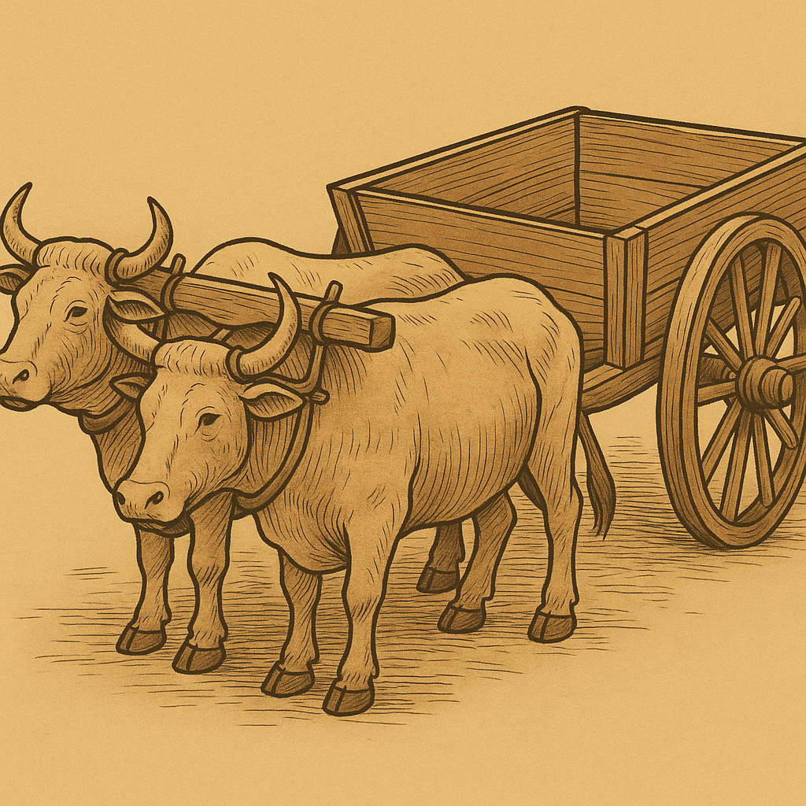

# Human-made Things in the Bible

## License Information

Human-made Things in the Bible © United Bible Societies, 2025. Adapted from: <cite>The Works of Their Hands: Man-made Things in the Bible</cite>, by Ray Pritz © 2009 United Bible Societies. This work is licensed under Creative Commons Attribution-ShareAlike 4.0 International (<a href="https://creativecommons.org/licenses/by-sa/4.0/">https://creativecommons.org/licenses/by-sa/4.0/</a>).

--------------------------------

## 標題：車輛、車（cart, wagon） (id: REALIA:8.2)

8\.2 標題：車輛、車（cart, wagon）
=========================

經文出處
----

Hebrew 來： גַּלְגַּל (音譯： galgal)

[EZK 23:24](https://ref.ly/Ezek23:24), [EZK 26:10](https://ref.ly/Ezek26:10)

Hebrew 來： עֲגָלָה (音譯： ‘agalah)

[GEN 45:19](https://ref.ly/Gen45:19), [GEN 45:21](https://ref.ly/Gen45:21), [GEN 45:27](https://ref.ly/Gen45:27), [GEN 46:5](https://ref.ly/Gen46:5), [NUM 7:3](https://ref.ly/Num7:3), [NUM 7:3](https://ref.ly/Num7:3), [NUM 7:6](https://ref.ly/Num7:6), [NUM 7:7](https://ref.ly/Num7:7), [NUM 7:8](https://ref.ly/Num7:8), [1SA 6:7](https://ref.ly/1Sam6:7), [1SA 6:7](https://ref.ly/1Sam6:7), [1SA 6:8](https://ref.ly/1Sam6:8), [1SA 6:10](https://ref.ly/1Sam6:10), [1SA 6:11](https://ref.ly/1Sam6:11), [1SA 6:14](https://ref.ly/1Sam6:14), [1SA 6:14](https://ref.ly/1Sam6:14), [2SA 6:3](https://ref.ly/2Sam6:3), [2SA 6:3](https://ref.ly/2Sam6:3), [1CH 13:7](https://ref.ly/1Chr13:7), [1CH 13:7](https://ref.ly/1Chr13:7), [PSA 46:10](https://ref.ly/Ps46:10), [ISA 5:18](https://ref.ly/Isa5:18), [ISA 28:27](https://ref.ly/Isa28:27), [ISA 28:28](https://ref.ly/Isa28:28), [AMO 2:13](https://ref.ly/Amos2:13)

Hebrew 來： צָב, עֲגָלָה (音譯： tsav, ‘egloth tsav)

[NUM 7:3](https://ref.ly/Num7:3), [NUM 7:3](https://ref.ly/Num7:3), [ISA 66:20](https://ref.ly/Isa66:20)

Greek 希： ἅμαξα (音譯： hamaxa)

[JDT 15:11](https://ref.ly/Jdt15:11), [SIR 33:5](https://ref.ly/Sir33:5)

Greek 希： καρρον (音譯： karron)

[1ES 5:53](https://ref.ly/1Esd5:53)

Greek 希： ῥέδη (音譯： rhedē)

[REV 18:13](https://ref.ly/Rev18:13)

描述和用途
-----

*馬車模型 (© Deutsche Bibelgesellschaft, Stuttgart by United Bible Societies)*

車輛是一種用於旅行或運輸貨物的兩輪或四輪車。這種交通工具通常是木製的，由牛、驢或馬等役畜牽拉。這些役畜與一根長杆連在一起，然後這根長杆固定到車的前部。車輛的上部通常會用木條交叉做成籠子的形狀。

---

翻譯
--

聖經中的車輛都是由役畜牽拉的，翻譯者應避免使用任何由發動機驅動的車輛名稱來翻譯「車」。

*(Image generated by ChatGPT using OpenAI technology)*

[NUM 7:3](https://ref.ly/Num7:3) ：希伯來文短語*‘eglothtsav* 在這裡的意思不確定。大多數翻譯者和解經家都認為這是一種類似「篷車」（“covered wagons”；RSV (Revised Standard Version (1952)) 、REB (Revised English Bible (1989)) ）的東西。篷車的樣式和上面描述的車輛相似，但是有一塊布蓋住車輛裡面的物品。這種車輛的形狀可能很像陸龜或海龜，而希伯來文*tsav* 正是指這種動物。

[EZK 23:24](https://ref.ly/Ezek23:24); [EZK 26:10](https://ref.ly/Ezek26:10) ：希伯來文*galgal* 的字面意思是「輪子」。在這兩節經文的語境中，這個詞顯然是換喻，指有輪子的車。

[1ES 5:53](https://ref.ly/1Esd5:53) ：在這節經文中，有些希臘文抄本作*chara* （「喜樂」），這是不合理的。有一份抄本作*karron* ，意指前文提到的「車輛」。

* **Associated Passages:** 以西結書 23:24; 以西結書 26:10; 創世記 45:19; 創世記 45:21; 創世記 45:27; 創世記 46:5; 民數記 7:3; 民數記 7:6; 民數記 7:7; 民數記 7:8; 撒母耳記上 6:7; 撒母耳記上 6:8; 撒母耳記上 6:10; 撒母耳記上 6:11; 撒母耳記上 6:14; 撒母耳記下 6:3; 歷代志上 13:7; 詩篇 46:10; 以賽亞書 5:18; 以賽亞書 28:27; 以賽亞書 28:28; 阿摩司書 2:13; 以賽亞書 66:20; 友弟德傳 15:11; 德訓篇 33:5; 厄斯德拉上 5:53; 啟示錄 18:13

