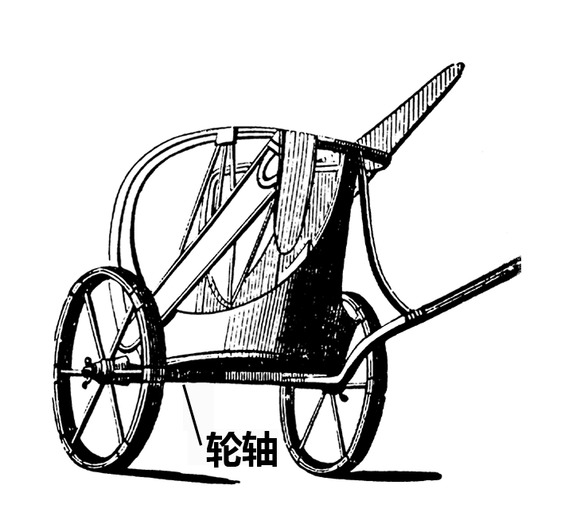

# Human-made Things in the Bible

## License Information

Human-made Things in the Bible © United Bible Societies, 2025. Adapted from: <cite>The Works of Their Hands: Man-made Things in the Bible</cite>, by Ray Pritz © 2009 United Bible Societies. This work is licensed under Creative Commons Attribution-ShareAlike 4.0 International (<a href="https://creativecommons.org/licenses/by-sa/4.0/">https://creativecommons.org/licenses/by-sa/4.0/</a>).

--------------------------------

## 標題：輪、車輪（wheel） (id: REALIA:8.3)

8\.3 標題：輪、車輪（wheel）
===================

經文出處
----

Hebrew 來： אוֹפַן (音譯： ’ofan)

[EXO 14:25](https://ref.ly/Exod14:25), [1KI 7:30](https://ref.ly/1Kgs7:30), [1KI 7:32](https://ref.ly/1Kgs7:32), [1KI 7:32](https://ref.ly/1Kgs7:32), [1KI 7:32](https://ref.ly/1Kgs7:32), [1KI 7:33](https://ref.ly/1Kgs7:33), [1KI 7:33](https://ref.ly/1Kgs7:33), [PRO 20:26](https://ref.ly/Prov20:26), [ISA 28:27](https://ref.ly/Isa28:27), [EZK 1:15](https://ref.ly/Ezek1:15), [EZK 1:16](https://ref.ly/Ezek1:16), [EZK 1:16](https://ref.ly/Ezek1:16), [EZK 1:16](https://ref.ly/Ezek1:16), [EZK 1:19](https://ref.ly/Ezek1:19), [EZK 1:19](https://ref.ly/Ezek1:19), [EZK 1:20](https://ref.ly/Ezek1:20), [EZK 1:20](https://ref.ly/Ezek1:20), [EZK 1:21](https://ref.ly/Ezek1:21), [EZK 1:21](https://ref.ly/Ezek1:21), [EZK 3:13](https://ref.ly/Ezek3:13), [EZK 10:6](https://ref.ly/Ezek10:6), [EZK 10:9](https://ref.ly/Ezek10:9), [EZK 10:9](https://ref.ly/Ezek10:9), [EZK 10:9](https://ref.ly/Ezek10:9), [EZK 10:9](https://ref.ly/Ezek10:9), [EZK 10:10](https://ref.ly/Ezek10:10), [EZK 10:10](https://ref.ly/Ezek10:10), [EZK 10:12](https://ref.ly/Ezek10:12), [EZK 10:12](https://ref.ly/Ezek10:12), [EZK 10:13](https://ref.ly/Ezek10:13), [EZK 10:16](https://ref.ly/Ezek10:16), [EZK 10:16](https://ref.ly/Ezek10:16), [EZK 10:19](https://ref.ly/Ezek10:19), [EZK 11:22](https://ref.ly/Ezek11:22), [NAM 3:2](https://ref.ly/Nah3:2)

Hebrew 來： גַּלְגַּל (音譯： galgal)

[ISA 5:28](https://ref.ly/Isa5:28), [JER 47:3](https://ref.ly/Jer47:3), [EZK 10:2](https://ref.ly/Ezek10:2), [EZK 10:6](https://ref.ly/Ezek10:6), [EZK 10:13](https://ref.ly/Ezek10:13), [DAN 7:9](https://ref.ly/Dan7:9)

Hebrew 來： גִּלְגָּל (音譯： gilgal)

[ISA 28:28](https://ref.ly/Isa28:28)

Greek 希： τροχός (音譯： trochos)

[SIR 33:5](https://ref.ly/Sir33:5)

經文出處
----

### **輪軸** ：

Hebrew 來： יָד (音譯： yad)

[1KI 7:32](https://ref.ly/1Kgs7:32), [1KI 7:33](https://ref.ly/1Kgs7:33)

Hebrew 來： סֶרֶן (音譯： seren)

[1KI 7:30](https://ref.ly/1Kgs7:30)

Greek 希： ἄξων (音譯： axōn)

[SIR 33:5](https://ref.ly/Sir33:5)

經文出處
----

### **輪轂** ：

Hebrew 來： חִשּׁוּר (音譯： chishur)

[1KI 7:33](https://ref.ly/1Kgs7:33)

經文出處
----

### **輪輻** ：

Hebrew 來： חִשּׁוּק (音譯： chishuq)

[1KI 7:33](https://ref.ly/1Kgs7:33)

經文出處
----

### **輪輞** ：

Hebrew 來： גַּב (音譯： gav)

[1KI 7:33](https://ref.ly/1Kgs7:33), [EZK 1:18](https://ref.ly/Ezek1:18), [EZK 1:18](https://ref.ly/Ezek1:18)

描述
--

*輪轂、輪輞、輪輻 (Gary Todd, Public domain, Flickr)*

輪子是一個環或圓形的盤，有一根桿（軸）穿過輪子的中心或輪轂。輪子是木頭做的，有時某些部分是金屬做的。輪子可以是一塊實心的木頭（參[8\.2 車輛、車 (cart, wagon)\<REALIA:8\.2\>](#) 插圖），也可以是用幾根輻條連接輪轂與輪輞而成。輪軸通常從車輛的一側通到另一側，軸的兩端各固定一個輪子。

---

翻譯
--

[EZK 1:15](https://ref.ly/Ezek1:15); [EZK 1:16](https://ref.ly/Ezek1:16); [EZK 1:17](https://ref.ly/Ezek1:17); [EZK 1:18](https://ref.ly/Ezek1:18); [EZK 1:19](https://ref.ly/Ezek1:19); [EZK 1:20](https://ref.ly/Ezek1:20); [EZK 1:21](https://ref.ly/Ezek1:21) 和[EZK 10:6](https://ref.ly/Ezek10:6); [EZK 10:7](https://ref.ly/Ezek10:7); [EZK 10:8](https://ref.ly/Ezek10:8); [EZK 10:9](https://ref.ly/Ezek10:9); [EZK 10:10](https://ref.ly/Ezek10:10); [EZK 10:11](https://ref.ly/Ezek10:11); [EZK 10:12](https://ref.ly/Ezek10:12); [EZK 10:13](https://ref.ly/Ezek10:13); [EZK 10:14](https://ref.ly/Ezek10:14); [EZK 10:15](https://ref.ly/Ezek10:15); [EZK 10:16](https://ref.ly/Ezek10:16); [EZK 10:17](https://ref.ly/Ezek10:17); [EZK 10:18](https://ref.ly/Ezek10:18); [EZK 10:19](https://ref.ly/Ezek10:19) 中提到的「輪子」可能不是使車輛向前移動的裝置。這些「輪子」可以理解為某種轉動的圓盤，有些語言可能有表示這種圓盤的專門用詞。猶太傳統把這個意象解作上帝坐著的一輛車，而這些是車的輪子。

大多數語言都有表示「軸」的詞語，NAB (New American Bible (1970)) 在沒有提到輪軸的情況下，準確地譯出了[SIR 33:5](https://ref.ly/Sir33:5) 的意思，英文意為：「愚昧人的心好像車輪；他的思念在不停轉動。」

* **Associated Passages:** 出埃及記 14:25; 列王紀上 7:30; 列王紀上 7:32; 列王紀上 7:33; 箴言 20:26; 以賽亞書 28:27; 以西結書 1:15; 以西結書 1:16; 以西結書 1:19; 以西結書 1:20; 以西結書 1:21; 以西結書 3:13; 以西結書 10:6; 以西結書 10:9; 以西結書 10:10; 以西結書 10:12; 以西結書 10:13; 以西結書 10:16; 以西結書 10:19; 以西結書 11:22; 那鴻書 3:2; 以賽亞書 5:28; 耶利米書 47:3; 以西結書 10:2; 但以理書 7:9; 以賽亞書 28:28; 德訓篇 33:5; 以西結書 1:18; 以西結書 1:17; 以西結書 10:7; 以西結書 10:8; 以西結書 10:11; 以西結書 10:14; 以西結書 10:15; 以西結書 10:17; 以西結書 10:18

* **Associated ACAI Concepts:** Wagon (ID: `realia:Wagon`); Wheel (ID: `realia:Wheel`)
