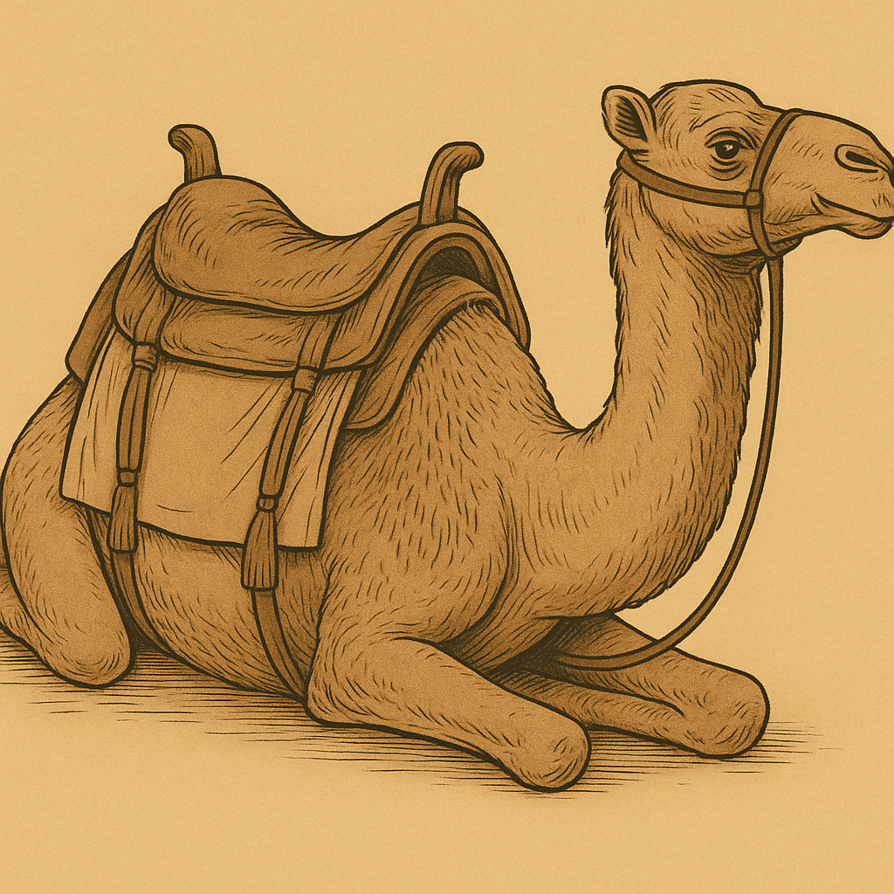
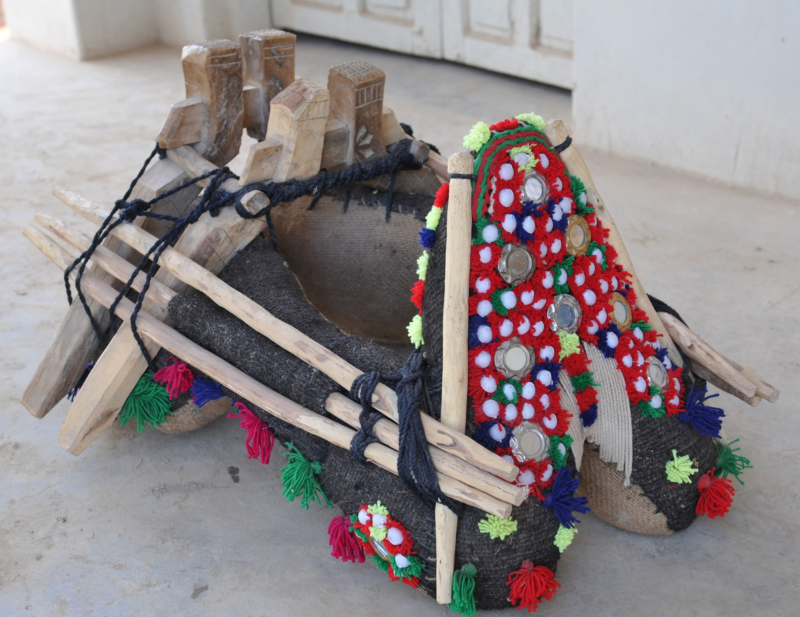

# Human-made Things in the Bible

## License Information

Human-made Things in the Bible © United Bible Societies, 2025. Adapted from: <cite>The Works of Their Hands: Man-made Things in the Bible</cite>, by Ray Pritz © 2009 United Bible Societies. This work is licensed under Creative Commons Attribution-ShareAlike 4.0 International (<a href="https://creativecommons.org/licenses/by-sa/4.0/">https://creativecommons.org/licenses/by-sa/4.0/</a>).

--------------------------------

## 標題：鞍、鞍墊（saddle, saddle cloth） (id: REALIA:8.4)

8\.4 標題：鞍、鞍墊（saddle, saddle cloth）
==================================

經文出處
----

Hebrew 來： בֶּגֶד, חֹפֶשׁ, רִכְבָּה (音譯： bigde chofesh lrikbah)

[EZK 27:20](https://ref.ly/Ezek27:20)

Hebrew 來： חבשׁ (音譯： chavash（動詞）)

[GEN 22:3](https://ref.ly/Gen22:3), [NUM 22:21](https://ref.ly/Num22:21), [JDG 19:10](https://ref.ly/Judg19:10), [2SA 16:1](https://ref.ly/2Sam16:1), [2SA 17:23](https://ref.ly/2Sam17:23), [2SA 19:27](https://ref.ly/2Sam19:27), [1KI 2:40](https://ref.ly/1Kgs2:40), [1KI 13:13](https://ref.ly/1Kgs13:13), [1KI 13:13](https://ref.ly/1Kgs13:13), [1KI 13:23](https://ref.ly/1Kgs13:23), [1KI 13:27](https://ref.ly/1Kgs13:27), [1KI 13:27](https://ref.ly/1Kgs13:27), [2KI 4:24](https://ref.ly/2Kgs4:24)

Hebrew 來： כַּר (音譯： kar)

[GEN 31:34](https://ref.ly/Gen31:34)

Hebrew 來： מַד (音譯： mad)

[JDG 5:10](https://ref.ly/Judg5:10)

Hebrew 來： מֶרְכָּב (音譯： merkav)

[LEV 15:9](https://ref.ly/Lev15:9)

描述和用途
-----

*(Image generated by ChatGPT using OpenAI technology)*

鞍子是放在動物的背上，以便人騎乘的座位，也可以作為運送行李的架子。鞍子可以有多種形式，既可能是一塊形狀特殊的木頭，也可能就是一塊布。

---

翻譯
--

希伯來文動詞*chavash* 出現的語境，通常與已經預備好或正在預備讓人騎乘的動物有關。如果目標語言沒有「鞍」的專門用詞，[GEN 22:3](https://ref.ly/Gen22:3) 中的第二句可以譯為「他備好騎乘的驢」。

*(Image generated by ChatGPT using OpenAI technology)*

[GEN 31:34](https://ref.ly/Gen31:34) ：希伯來文*kar* 僅出現在此處，確切含義不明。它的譯法有很多種，包括「鞍」（“saddle”；RSV (Revised Standard Version (1952)) 、NIV (New International Version (1984)) ）、「鞍袋」（“saddlebag”；GNT (Good News Translation (1992)) ）、「她用作鞍的墊子」（“the cushion she used as a saddle” ；CEV (Contemporary English Version) ）、「（駱駝）袋」（“\[camel]bag”；REB (Revised English Bible (1989)) ）、「墊子」（“cushion”；NJB (New Jerusalem Bible (1985)) ）和「鞍籃」（GECL (German Common Language Version (Gute Nachricht Bibel)) ）。根據上下文，這顯然是拉結可以坐在上面的物件，而她父親對此也不會覺得奇怪。另一方面，她在這個物件裡面（或下面）藏了一些家裡的神像（參[4\.6\.1 家中的神像、家神的像 (teraphim, household idol)\<REALIA:4\.6\.1\>](#) ），因此我們可以推斷這不是蓋在駱駝背上的一塊布。有些駱駝鞍非常精緻。有時候，鞍是一個很大的籃子或轎子，人可以坐在裡面；有時候，鞍是一個木製框架，放在駱駝隆起的背上。框架上面覆蓋著布和毯子，以便騎得舒服，並把騎乘者的腿和駱駝的背隔開。不管拉結乘坐的是哪一種鞍，她都能很容易地找到藏匿一些小神像的地方。經文沒有說拉結坐在駱駝上，而是說她坐在駱駝的鞍子上。從上下文來看，她顯然是在自己的帳棚裡。旅行者到達營地過夜時，通常會卸下鞍子並把它搬到帳棚裡。如果鞍子是一個木製框架，那麼還可以當成座位。把一個形狀適合放在駱駝背上的木製框架，放在帳棚裡面的地上，會佔據比較大的地方。拉結顯然是把神像藏在她所坐的座位下面了。

*這個鞍架讓人可以騎坐在駱駝上 (© Aziz Kingrani, CC BY\-SA 4\.0, via Wikiedia Commons)*

在[LEV 15:9](https://ref.ly/Lev15:9) ，希伯來文*merkav* 可以指鞍子、布塊，甚至是車輛的座位。在有些語言中，可能沒有表示「鞍」的專用詞語。無論如何，翻譯者在這裡最好像REB (Revised English Bible (1989)) 那樣使用一般性的表達，整節經文的英文意為：「這個人騎牲畜時所坐的一切物件都為不潔淨。」

[JDG 5:10](https://ref.ly/Judg5:10) ：關於希伯來文*mad* 的意思，參[5\.17 地毯、毯子 (carpet, rug)\<REALIA:5\.17\>](#) 中的討論。

關於「鞍袋」，參[1\.2\.1 羊圈、羊欄 (sheep pen, sheepfold)\<REALIA:1\.2\.1\>](#) 關於希伯來文*mishpthayim* 的註解。

* **Associated Passages:** 以西結書 27:20; 創世記 22:3; 民數記 22:21; 士師記 19:10; 撒母耳記下 16:1; 撒母耳記下 17:23; 撒母耳記下 19:27; 列王紀上 2:40; 列王紀上 13:13; 列王紀上 13:23; 列王紀上 13:27; 列王紀下 4:24; 創世記 31:34; 士師記 5:10; 利未記 15:9

* **Associated ACAI Concepts:** To Saddle (ID: `realia:ToSaddle`)
