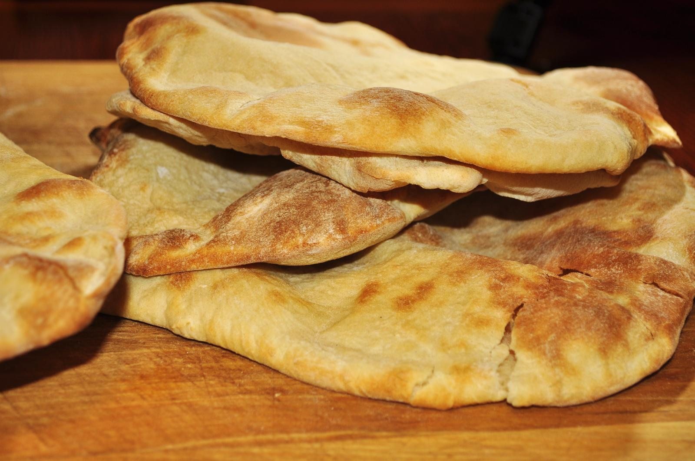

# Human-made Things in the Bible

## License Information

Human-made Things in the Bible © United Bible Societies, 2025. Adapted from: <cite>The Works of Their Hands: Man-made Things in the Bible</cite>, by Ray Pritz © 2009 United Bible Societies. This work is licensed under Creative Commons Attribution-ShareAlike 4.0 International (<a href="https://creativecommons.org/licenses/by-sa/4.0/">https://creativecommons.org/licenses/by-sa/4.0/</a>).

--------------------------------

## 標題：個（餅）（loaf） (id: REALIA:9.4.3)

9\.4\.3 標題：個（餅）（loaf）
=====================

經文出處
----

Hebrew 來： כִּכָּר (音譯： kikar)

[EXO 29:23](https://ref.ly/Exod29:23), [JDG 8:5](https://ref.ly/Judg8:5), [1SA 2:36](https://ref.ly/1Sam2:36), [1SA 10:3](https://ref.ly/1Sam10:3), [1CH 16:3](https://ref.ly/1Chr16:3), [PRO 6:26](https://ref.ly/Prov6:26), [JER 37:21](https://ref.ly/Jer37:21)

Hebrew 來： צְלִיל (音譯： tslil)

[JDG 7:13](https://ref.ly/Judg7:13)

描述
--

*一疊扁麵包（圓麵餅） (© jeffreyw, CC BY 2\.0, via Wikimedia Commons)*

「個」是餅的量詞。餅一般是扁圓形的，大約有手指張開後的一隻手那麼大。不過，餅的大小和形狀可能有很大的差別。經文提到有三種餅：第一種小餅和今天的麵包卷或餅乾類似；第二種餅大又圓；第三種餅扁而薄，用來像勺子一樣舀食物吃。一般來說，比較富有的人吃小麥做的餅，窮人吃大麥做的餅（[JDG 7:13](https://ref.ly/Judg7:13) ；[JHN 6:7](https://ref.ly/John6:7) ）。

---

翻譯
--

*一疊扁麵包（圓麵餅） (© jeffreyw, CC BY 2\.0, via Wikimedia Commons)*

大多數有「餅」一詞的語言也會有表示「餅」的量詞。在很多經文中，「餅」就表示「一個餅」的意思（參[9\.4 餅、麵包 (bread)\<REALIA:9\.4\>](#) 中的討論）。

[JDG 7:13](https://ref.ly/Judg7:13) ：在這節經文中，這個大麥餅的重要特徵是它滾下了山。如果目標語言根據形狀來區分餅的種類，那麼這裡適合採用表示圓餅的詞。

聖餅、陳設餅、供餅：參[4\.3\.5\.1 供餅 (consecrated bread, bread of the presence, showbread)\<REALIA:4\.3\.5\.1\>](#) 。

* **Associated Passages:** 出埃及記 29:23; 士師記 8:5; 撒母耳記上 2:36; 撒母耳記上 10:3; 歷代志上 16:3; 箴言 6:26; 耶利米書 37:21; 士師記 7:13; 約翰福音 6:7

