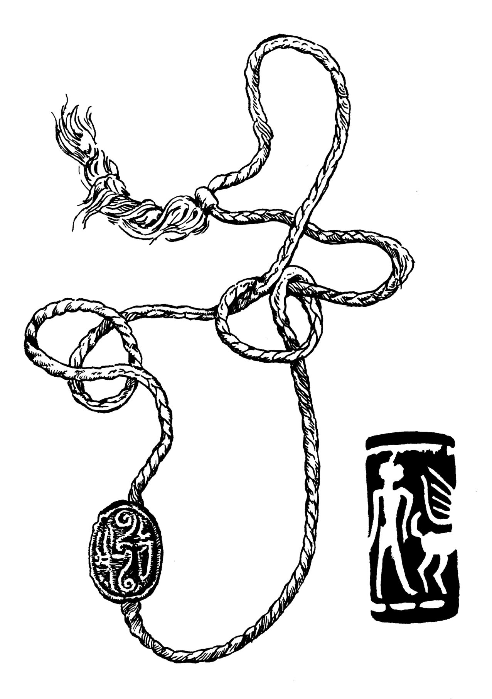

# Human-made Things in the Bible

## License Information

Human-made Things in the Bible © United Bible Societies, 2025. Adapted from: <cite>The Works of Their Hands: Man-made Things in the Bible</cite>, by Ray Pritz © 2009 United Bible Societies. This work is licensed under Creative Commons Attribution-ShareAlike 4.0 International (<a href="https://creativecommons.org/licenses/by-sa/4.0/">https://creativecommons.org/licenses/by-sa/4.0/</a>).

--------------------------------

## 標題：印、印章、印戒、打印的戒指、戒指（seal, signet ring, ring） (id: REALIA:10.2)

10\.2 標題：印、印章、印戒、打印的戒指、戒指（seal, signet ring, ring）
==================================================

經文出處
----

Hebrew 來： חתם, חוֹתָם, חוֹתֶמֶת (音譯： chatham, chotham, chothemeth)

[GEN 38:18](https://ref.ly/Gen38:18), [GEN 38:25](https://ref.ly/Gen38:25), [EXO 28:11](https://ref.ly/Exod28:11), [EXO 28:21](https://ref.ly/Exod28:21), [EXO 28:36](https://ref.ly/Exod28:36), [EXO 39:6](https://ref.ly/Exod39:6), [EXO 39:14](https://ref.ly/Exod39:14), [EXO 39:30](https://ref.ly/Exod39:30), [DEU 32:34](https://ref.ly/Deut32:34), [1KI 21:8](https://ref.ly/1Kgs21:8), [1KI 21:8](https://ref.ly/1Kgs21:8), [NEH 10:1](https://ref.ly/Neh10:1), [NEH 10:2](https://ref.ly/Neh10:2), [EST 3:12](https://ref.ly/Esth3:12), [EST 8:8](https://ref.ly/Esth8:8), [EST 8:8](https://ref.ly/Esth8:8), [EST 8:10](https://ref.ly/Esth8:10), [JOB 38:14](https://ref.ly/Job38:14), [JOB 41:7](https://ref.ly/Job41:7), [SNG 8:6](https://ref.ly/Song8:6), [SNG 8:6](https://ref.ly/Song8:6), [ISA 8:16](https://ref.ly/Isa8:16), [ISA 29:11](https://ref.ly/Isa29:11), [ISA 29:11](https://ref.ly/Isa29:11), [JER 22:24](https://ref.ly/Jer22:24), [JER 32:10](https://ref.ly/Jer32:10), [JER 32:11](https://ref.ly/Jer32:11), [JER 32:14](https://ref.ly/Jer32:14), [JER 32:44](https://ref.ly/Jer32:44), [EZK 28:12](https://ref.ly/Ezek28:12), [DAN 12:4](https://ref.ly/Dan12:4), [DAN 12:9](https://ref.ly/Dan12:9), [HAG 2:23](https://ref.ly/Hag2:23)

Aramaic 蘭：עִזְקָה (音譯： ‘izqah)

[DAN 6:18](https://ref.ly/Dan6:18)

Hebrew 來： טַבַּעַת (音譯： taba‘ath)

[GEN 41:42](https://ref.ly/Gen41:42), [EXO 35:22](https://ref.ly/Exod35:22), [NUM 31:50](https://ref.ly/Num31:50), [EST 3:10](https://ref.ly/Esth3:10), [EST 3:12](https://ref.ly/Esth3:12), [EST 8:2](https://ref.ly/Esth8:2), [EST 8:8](https://ref.ly/Esth8:8), [EST 8:8](https://ref.ly/Esth8:8), [EST 8:10](https://ref.ly/Esth8:10), [ISA 3:21](https://ref.ly/Isa3:21)

Greek 希： δακτύλιος (音譯： daktulios)

[LUK 15:22](https://ref.ly/Luke15:22), [TOB 1:22](https://ref.ly/Tob1:22), [JDT 10:4](https://ref.ly/Jdt10:4), [BEL 1:14](https://ref.ly/Bel1:14), [BEL 1:14](https://ref.ly/Bel1:14), [1MA 6:15](https://ref.ly/1Macc6:15)

Greek 希： σφραγίς, σφραγίζω, κατασφραγίζω (音譯： sfragis, sfragizō（動詞）, katasfragizō（動詞）)

[MAT 27:66](https://ref.ly/Matt27:66), [JHN 3:33](https://ref.ly/John3:33), [JHN 6:27](https://ref.ly/John6:27), [ROM 4:11](https://ref.ly/Rom4:11), [1CO 9:2](https://ref.ly/1Cor9:2), [2CO 1:22](https://ref.ly/2Cor1:22), [EPH 1:13](https://ref.ly/Eph1:13), [EPH 4:30](https://ref.ly/Eph4:30), [2TI 2:19](https://ref.ly/2Tim2:19), [REV 5:1](https://ref.ly/Rev5:1), [REV 5:1](https://ref.ly/Rev5:1), [REV 5:2](https://ref.ly/Rev5:2), [REV 5:5](https://ref.ly/Rev5:5), [REV 5:9](https://ref.ly/Rev5:9), [REV 6:1](https://ref.ly/Rev6:1), [REV 6:3](https://ref.ly/Rev6:3), [REV 6:5](https://ref.ly/Rev6:5), [REV 6:7](https://ref.ly/Rev6:7), [REV 6:9](https://ref.ly/Rev6:9), [REV 6:12](https://ref.ly/Rev6:12), [REV 7:2](https://ref.ly/Rev7:2), [REV 7:3](https://ref.ly/Rev7:3), [REV 7:4](https://ref.ly/Rev7:4), [REV 7:4](https://ref.ly/Rev7:4), [REV 7:5](https://ref.ly/Rev7:5), [REV 7:8](https://ref.ly/Rev7:8), [REV 8:1](https://ref.ly/Rev8:1), [REV 9:4](https://ref.ly/Rev9:4), [REV 10:4](https://ref.ly/Rev10:4), [REV 20:3](https://ref.ly/Rev20:3), [REV 22:10](https://ref.ly/Rev22:10)

Greek 希： χρυσοδακτύλιος (音譯： chrusodaktulios)

[JAS 2:2](https://ref.ly/Jas2:2)

Latin 拉： consigno（動詞）

[2ES 6:5](https://ref.ly/2Esd6:5)

Latin 拉： signaculum

[2ES 7:104](https://ref.ly/2Esd7:104), [2ES 10:23](https://ref.ly/2Esd10:23)

Latin 拉： signo（動詞）

[2ES 2:38](https://ref.ly/2Esd2:38), [2ES 8:53](https://ref.ly/2Esd8:53)

Latin 拉： supersignabitur

[2ES 6:20](https://ref.ly/2Esd6:20)

描述和用途
-----

*(Image generated by ChatGPT using OpenAI technology)*

印（或圖章）是一個刻有文字或圖案的物件，用來表示所有權、批准或封閉。這是有地位的人普遍使用的一種重要物品，象徵所有權，用來在合同和其他秘密或保密文件上蓋章，甚至還是個人身份的標記（參[GEN 38:18](https://ref.ly/Gen38:18) ）。印通常是圓形或橢圓形的，並且橢圓形更為常見。蓋印時，把印壓在新鮮的黏土上，再將黏土燒硬，或者壓在熱蠟上，蠟冷卻後便顯出壓印。印可以蓋在文件、信函，或者其他要封住的物件上。印本身刻的圖案是反的，這樣印出來的圖案就是正的。除了所有者的職業、職位或地位之外，印有時還帶有圖像或符號。印用某種寶石做成。所有者通常隨身攜帶著印，或者嵌在戒指上，或者用一根帶子繫在脖子上。

*印章戒指 (Metropolitan Museum of Art, Public domain, MMA)*

需要保密的重要信件、機密信函或法律文件都要用印封嚴。人們把寫在蒲草紙（後來是牛皮紙和羊皮紙）上的文件捲起來、綁住，然後在打的結上面蓋章。要打開文件，必須先破開印記。如果文字是寫在瓦片或陶片上的，人们就會用一種黏土做成的封套將其包起來。如果內容是合同或其他法律文件，有時會在封套上刻寫內容摘要，另外還可能在另一個地方保存一份文件副本（參[JER 32:14](https://ref.ly/Jer32:14) ）。

---

翻譯
--

*繩上的密封印 (© Deutsche Bibelgesellschaft, Stuttgart by United Bible Societies)*

在有些語言中，「印」或「圖章」最接近的對等詞是印留下來的記號，例如「他名的記號」或「他所有權的標記」。此外，翻譯者也可以使用一個表示「橡皮圖章」的詞語，只是不要明確提到橡皮或墨水。在有些經文中，翻譯者可以使用「作記號的工具」之類的短語。

希伯來文*taba‘ath* 源於一個意為「蓋上印記」的詞根。這說明該物最初的目的就是用作圖章，如上文所述。但是，戒指也是一種首飾，[EXO 35:22](https://ref.ly/Exod35:22) 和[NUM 31:50](https://ref.ly/Num31:50) 提到的戒指可能就是飾物。戒指作為飾物廣為人知，但打印的戒指卻較少為人所知。因此，翻譯者可能有必要詳細地加以描述；例如在[GEN 41:42](https://ref.ly/Gen41:42) 中，NCV (New Century Version) 把原文直譯「他的戒指」的短語展開，英文意為「他那個帶有王室印章的戒指」，GNT (Good News Translation (1992)) 意為「刻有王室印記的戒指」，SPCL (Spanish Common Language Version (Dios Habla Hoy)) 意為「帶有公章的戒指」。在[EST 3:10](https://ref.ly/Esth3:10) ，GNT (Good News Translation (1992)) 的表達更加詳細，英文意為，「他的戒指，用來在旨意上蓋章以使其正式生效」。不過，有些翻譯者可能更願意把這些解釋放在腳註裡面。

[MAT 27:66](https://ref.ly/Matt27:66) ：沒有人確切地知道這節經文中的「封了墳墓」是什麼意思。有學者曾提出這樣一種見解：把一根繩子拉在石頭上，然後在上面蓋印。還有學者認為，「封了墳墓」指的是在岩石表面和墓門石頭之間填滿軟黏土，然後在上面蓋上猶太當局的印章。因為不是所有文化都知道封印，所以這節經文的結尾也可以翻譯為：「他們在石頭上做了一個標記，以便知道它是否被移動過」，或「他們在石頭上做了標記，禁止人移動」。

* **Associated Passages:** 創世記 38:18; 創世記 38:25; 出埃及記 28:11; 出埃及記 28:21; 出埃及記 28:36; 出埃及記 39:6; 出埃及記 39:14; 出埃及記 39:30; 申命記 32:34; 列王紀上 21:8; 尼希米記 10:1; 尼希米記 10:2; 以斯帖記 3:12; 以斯帖記 8:8; 以斯帖記 8:10; 約伯記 38:14; 約伯記 41:7; 雅歌 8:6; 以賽亞書 8:16; 以賽亞書 29:11; 耶利米書 22:24; 耶利米書 32:10; 耶利米書 32:11; 耶利米書 32:14; 耶利米書 32:44; 以西結書 28:12; 但以理書 12:4; 但以理書 12:9; 哈該書 2:23; 但以理書 6:18; 創世記 41:42; 出埃及記 35:22; 民數記 31:50; 以斯帖記 3:10; 以斯帖記 8:2; 以賽亞書 3:21; 路加福音 15:22; 多俾亞傳 1:22; 友弟德傳 10:4; 彼勒與大龍 1:14; 瑪加伯上 6:15; 馬太福音 27:66; 約翰福音 3:33; 約翰福音 6:27; 羅馬書 4:11; 哥林多前書 9:2; 哥林多後書 1:22; 以弗所書 1:13; 以弗所書 4:30; 提摩太後書 2:19; 啟示錄 5:1; 啟示錄 5:2; 啟示錄 5:5; 啟示錄 5:9; 啟示錄 6:1; 啟示錄 6:3; 啟示錄 6:5; 啟示錄 6:7; 啟示錄 6:9; 啟示錄 6:12; 啟示錄 7:2; 啟示錄 7:3; 啟示錄 7:4; 啟示錄 7:5; 啟示錄 7:8; 啟示錄 8:1; 啟示錄 9:4; 啟示錄 10:4; 啟示錄 20:3; 啟示錄 22:10; 雅各書 2:2; 厄斯德拉下 6:5; 厄斯德拉下 7:104; 厄斯德拉下 10:23; 厄斯德拉下 2:38; 厄斯德拉下 8:53; 厄斯德拉下 6:20

