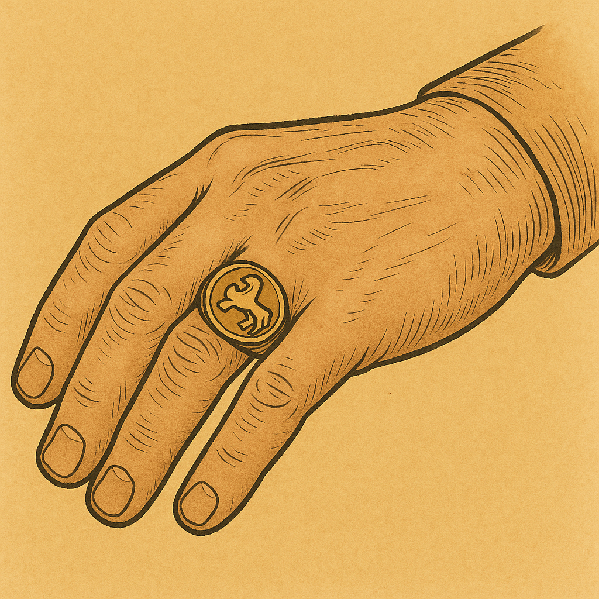
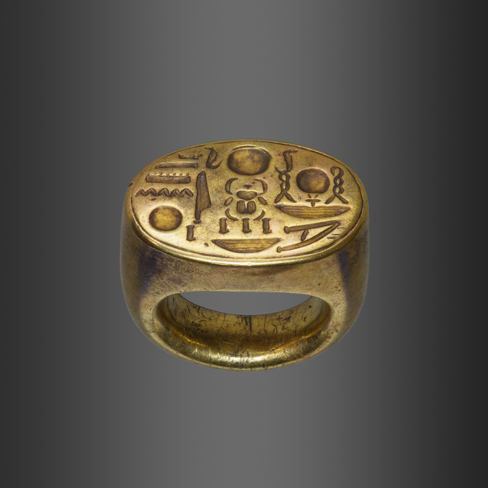
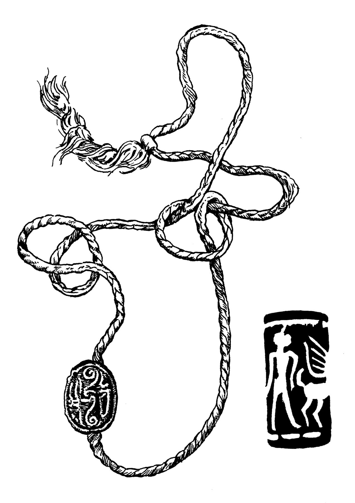

# Human-made Things in the Bible

## License Information

Human-made Things in the Bible © United Bible Societies, 2025. Adapted from: <cite>The Works of Their Hands: Man-made Things in the Bible</cite>, by Ray Pritz © 2009 United Bible Societies. This work is licensed under Creative Commons Attribution-ShareAlike 4.0 International (<a href="https://creativecommons.org/licenses/by-sa/4.0/">https://creativecommons.org/licenses/by-sa/4.0/</a>).

--------------------------------

## 標題：印、印章、印戒、打印的戒指、戒指（seal, signet ring, ring） (id: REALIA:10.2)

10\.2 標題：印、印章、印戒、打印的戒指、戒指（seal, signet ring, ring）
==================================================

經文出處
----

Hebrew 來： חתם, חוֹתָם, חוֹתֶמֶת (音譯： chatham, chotham, chothemeth)

GEN 38:18, GEN 38:25, EXO 28:11, EXO 28:21, EXO 28:36, EXO 39:6, EXO 39:14, EXO 39:30, DEU 32:34, 1KI 21:8, 1KI 21:8, NEH 10:1, NEH 10:2, EST 3:12, EST 8:8, EST 8:8, EST 8:10, JOB 38:14, JOB 41:7, SNG 8:6, SNG 8:6, ISA 8:16, ISA 29:11, ISA 29:11, JER 22:24, JER 32:10, JER 32:11, JER 32:14, JER 32:44, EZK 28:12, DAN 12:4, DAN 12:9, HAG 2:23

Aramaic 蘭：עִזְקָה (音譯： ‘izqah)

DAN 6:18

Hebrew 來： טַבַּעַת (音譯： taba‘ath)

GEN 41:42, EXO 35:22, NUM 31:50, EST 3:10, EST 3:12, EST 8:2, EST 8:8, EST 8:8, EST 8:10, ISA 3:21

Greek 希： δακτύλιος (音譯： daktulios)

LUK 15:22, TOB 1:22, JDT 10:4, BEL 1:14, BEL 1:14, 1MA 6:15

Greek 希： σφραγίς, σφραγίζω, κατασφραγίζω (音譯： sfragis, sfragizō（動詞）, katasfragizō（動詞）)

MAT 27:66, JHN 3:33, JHN 6:27, ROM 4:11, 1CO 9:2, 2CO 1:22, EPH 1:13, EPH 4:30, 2TI 2:19, REV 5:1, REV 5:1, REV 5:2, REV 5:5, REV 5:9, REV 6:1, REV 6:3, REV 6:5, REV 6:7, REV 6:9, REV 6:12, REV 7:2, REV 7:3, REV 7:4, REV 7:4, REV 7:5, REV 7:8, REV 8:1, REV 9:4, REV 10:4, REV 20:3, REV 22:10

Greek 希： χρυσοδακτύλιος (音譯： chrusodaktulios)

JAS 2:2

Latin 拉： consigno（動詞）

2ES 6:5

Latin 拉： signaculum

2ES 7:104, 2ES 10:23

Latin 拉： signo（動詞）

2ES 2:38, 2ES 8:53

Latin 拉： supersignabitur

2ES 6:20

描述和用途
-----

*(Image generated by ChatGPT using OpenAI technology)*

印（或圖章）是一個刻有文字或圖案的物件，用來表示所有權、批准或封閉。這是有地位的人普遍使用的一種重要物品，象徵所有權，用來在合同和其他秘密或保密文件上蓋章，甚至還是個人身份的標記（參GEN 38:18 ）。印通常是圓形或橢圓形的，並且橢圓形更為常見。蓋印時，把印壓在新鮮的黏土上，再將黏土燒硬，或者壓在熱蠟上，蠟冷卻後便顯出壓印。印可以蓋在文件、信函，或者其他要封住的物件上。印本身刻的圖案是反的，這樣印出來的圖案就是正的。除了所有者的職業、職位或地位之外，印有時還帶有圖像或符號。印用某種寶石做成。所有者通常隨身攜帶著印，或者嵌在戒指上，或者用一根帶子繫在脖子上。

*印章戒指 (Metropolitan Museum of Art, Public domain, MMA)*

需要保密的重要信件、機密信函或法律文件都要用印封嚴。人們把寫在蒲草紙（後來是牛皮紙和羊皮紙）上的文件捲起來、綁住，然後在打的結上面蓋章。要打開文件，必須先破開印記。如果文字是寫在瓦片或陶片上的，人们就會用一種黏土做成的封套將其包起來。如果內容是合同或其他法律文件，有時會在封套上刻寫內容摘要，另外還可能在另一個地方保存一份文件副本（參JER 32:14 ）。

---

翻譯
--

*繩上的密封印 (© Deutsche Bibelgesellschaft, Stuttgart by United Bible Societies)*

在有些語言中，「印」或「圖章」最接近的對等詞是印留下來的記號，例如「他名的記號」或「他所有權的標記」。此外，翻譯者也可以使用一個表示「橡皮圖章」的詞語，只是不要明確提到橡皮或墨水。在有些經文中，翻譯者可以使用「作記號的工具」之類的短語。

希伯來文*taba‘ath* 源於一個意為「蓋上印記」的詞根。這說明該物最初的目的就是用作圖章，如上文所述。但是，戒指也是一種首飾，EXO 35:22 和NUM 31:50 提到的戒指可能就是飾物。戒指作為飾物廣為人知，但打印的戒指卻較少為人所知。因此，翻譯者可能有必要詳細地加以描述；例如在GEN 41:42 中，NCV (New Century Version) 把原文直譯「他的戒指」的短語展開，英文意為「他那個帶有王室印章的戒指」，GNT (Good News Translation (1992)) 意為「刻有王室印記的戒指」，SPCL (Spanish Common Language Version (Dios Habla Hoy)) 意為「帶有公章的戒指」。在EST 3:10 ，GNT (Good News Translation (1992)) 的表達更加詳細，英文意為，「他的戒指，用來在旨意上蓋章以使其正式生效」。不過，有些翻譯者可能更願意把這些解釋放在腳註裡面。

MAT 27:66 ：沒有人確切地知道這節經文中的「封了墳墓」是什麼意思。有學者曾提出這樣一種見解：把一根繩子拉在石頭上，然後在上面蓋印。還有學者認為，「封了墳墓」指的是在岩石表面和墓門石頭之間填滿軟黏土，然後在上面蓋上猶太當局的印章。因為不是所有文化都知道封印，所以這節經文的結尾也可以翻譯為：「他們在石頭上做了一個標記，以便知道它是否被移動過」，或「他們在石頭上做了標記，禁止人移動」。

* **Associated Passages:** 創世記 38:18; 創世記 38:25; 出埃及記 28:11; 出埃及記 28:21; 出埃及記 28:36; 出埃及記 39:6; 出埃及記 39:14; 出埃及記 39:30; 申命記 32:34; 列王紀上 21:8; 尼希米記 10:1; 尼希米記 10:2; 以斯帖記 3:12; 以斯帖記 8:8; 以斯帖記 8:10; 約伯記 38:14; 約伯記 41:7; 雅歌 8:6; 以賽亞書 8:16; 以賽亞書 29:11; 耶利米書 22:24; 耶利米書 32:10; 耶利米書 32:11; 耶利米書 32:14; 耶利米書 32:44; 以西結書 28:12; 但以理書 12:4; 但以理書 12:9; 哈該書 2:23; 但以理書 6:18; 創世記 41:42; 出埃及記 35:22; 民數記 31:50; 以斯帖記 3:10; 以斯帖記 8:2; 以賽亞書 3:21; 路加福音 15:22; 多俾亞傳 1:22; 友弟德傳 10:4; 彼勒與大龍 1:14; 瑪加伯上 6:15; 馬太福音 27:66; 約翰福音 3:33; 約翰福音 6:27; 羅馬書 4:11; 哥林多前書 9:2; 哥林多後書 1:22; 以弗所書 1:13; 以弗所書 4:30; 提摩太後書 2:19; 啟示錄 5:1; 啟示錄 5:2; 啟示錄 5:5; 啟示錄 5:9; 啟示錄 6:1; 啟示錄 6:3; 啟示錄 6:5; 啟示錄 6:7; 啟示錄 6:9; 啟示錄 6:12; 啟示錄 7:2; 啟示錄 7:3; 啟示錄 7:4; 啟示錄 7:5; 啟示錄 7:8; 啟示錄 8:1; 啟示錄 9:4; 啟示錄 10:4; 啟示錄 20:3; 啟示錄 22:10; 雅各書 2:2; 厄斯德拉下 6:5; 厄斯德拉下 7:104; 厄斯德拉下 10:23; 厄斯德拉下 2:38; 厄斯德拉下 8:53; 厄斯德拉下 6:20

* **Associated ACAI Concepts:** Seal (ID: `realia:Seal`)
