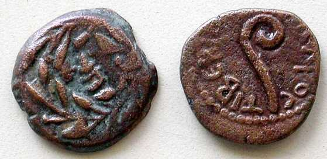

# Human-made Things in the Bible

## License Information

Human-made Things in the Bible © United Bible Societies, 2025. Adapted from: <cite>The Works of Their Hands: Man-made Things in the Bible</cite>, by Ray Pritz © 2009 United Bible Societies. This work is licensed under Creative Commons Attribution-ShareAlike 4.0 International (<a href="https://creativecommons.org/licenses/by-sa/4.0/">https://creativecommons.org/licenses/by-sa/4.0/</a>).

--------------------------------

## 標題：希臘錢幣（Greek coins） (id: REALIA:11.6.2)

11\.6\.2 標題：希臘錢幣（Greek coins）
=============================

argurion，參[1\.6\.3金錢、錢幣(money, coins)\<REALIA:1\.6\.3\>](#) 。

## 標題：銅錢（assarion） (id: REALIA:11.6.2.1)

11\.6\.2\.1 標題：銅錢（assarion）
===========================

經文出處
----

Greek 希： ἀσσάριον (音譯： assarion)

[MAT 10:29](https://ref.ly/Matt10:29), [LUK 12:6](https://ref.ly/Luke12:6)

希臘文*assarion* （銅錢）、*kodrantēs* （大文錢）和*lepton* （小文錢）指小額錢幣；另參[11\.6\.2\.2 大文錢（kodrantes）\<REALIA:11\.6\.2\.2\>](#) 和[11\.6\.2\.3 小文錢（lepton）\<REALIA:11\.6\.2\.3\>](#) 。這些詞語都可以譯成「很小的硬幣」、「面值很小的硬幣」或「不多的錢」。一般來說，所有三個詞語都可以用一個詞語或短語來翻譯，然而[MRK 12:42](https://ref.ly/Mark12:42) 除外，那裡提到兩個*lepta* 等於一個*kodrantēs* 。

對於*assarion* ，各譯本一般會在[MAT 10:29](https://ref.ly/Matt10:29); [LUK 12:6](https://ref.ly/Luke12:6) 選擇一個很小面值的硬幣；例如，「一便士」（如RSV (Revised Standard Version (1952)) 、GNT (Good News Translation (1992)) ）。PV 也很好地表達了耶穌的意思，英文意為「幾乎不要錢」。

* **Associated Passages:** 馬太福音 10:29; 路加福音 12:6; 馬可福音 12:42

* **Associated ACAI Concepts:** Assarion (ID: `realia:Assarion`)

## 標題：大文錢（kodrantes） (id: REALIA:11.6.2.2)

11\.6\.2\.2 標題：大文錢（kodrantes）
=============================

經文出處
----

Greek 希： κοδράντης (音譯： kodrantēs)

[MAT 5:26](https://ref.ly/Matt5:26), [MRK 12:42](https://ref.ly/Mark12:42)

*提庇留時期的四分硬幣（quadrans或kondrantes），幣值近似一仙 (© Kwo\-Wei Peng by United Bible Societies)*

大文錢：

[MAT 5:26](https://ref.ly/Matt5:26) ：大多數譯本譯作，「直到你付清最後一便士」（如NIV (New International Version (1984)) ）。另外，也可以不指明錢幣就清楚表達這一點；例如，NCV (New Century Version) 和PV 英文意為，「直到你把所有欠的債都還清。」然而，有些學者認為這裡的意思更有可能是：「直到你付清法官判定的罰款。」比較GNT (Good News Translation (1992)) ，該譯本的英文意為，「直到你付清罰款的最後一便士」（GW (God's Word Translation) 類似）。

[MRK 12:42](https://ref.ly/Mark12:42) ：這節經文末尾的希臘文本字面意為「兩個lepta，即一個kodrantes」。許多譯本略微擴展「兩個lepta」，譯為「兩個小銅幣」（如NCV (New Century Version) ），然後指出這兩個小銅幣的價值很小，說它們只值「一便士」（RSV (Revised Standard Version (1952)) 直譯）、「幾分錢」（NCV (New Century Version) 直譯）、「不到一分錢」（GW (God's Word Translation) 直譯）、「約一便士」（GNT (Good News Translation (1992)) 直譯），「面值很低」（SPCL (Spanish Common Language Version (Dios Habla Hoy)) 直譯）。ITCL (Italian Common Language Version) 省略了第二個短語，因為在原文中，這個短語是為了向馬可的讀者解釋他們不太知道的*lepton* 一詞的價值。

* **Associated Passages:** 馬太福音 5:26; 馬可福音 12:42

## 標題：小文錢（lepton） (id: REALIA:11.6.2.3)

11\.6\.2\.3 標題：小文錢（lepton）
==========================

經文出處
----

Greek 希： λεπτόν (音譯： lepton)

[MRK 12:42](https://ref.ly/Mark12:42), [LUK 12:59](https://ref.ly/Luke12:59), [LUK 21:2](https://ref.ly/Luke21:2)

參上文[11\.6\.2\.2 大文錢（kodrantes）\<REALIA:11\.6\.2\.2\>](#) 關於*kodrantēs* 的註解。

* **Associated Passages:** 馬可福音 12:42; 路加福音 12:59; 路加福音 21:2

* **Associated ACAI Concepts:** Lepton (ID: `realia:Lepton`)

## 標題：達利克（adarkon, darkmon） (id: REALIA:11.6.2.4)

11\.6\.2\.4 標題：達利克（adarkon, darkmon）
====================================

經文出處
----

Hebrew 來： אֲדַרְכּוֹן (音譯： ’adarkon)

[1CH 29:7](https://ref.ly/1Chr29:7), [EZR 8:27](https://ref.ly/Ezra8:27), [EZR 2:69](https://ref.ly/Ezra2:69), [NEH 7:69](https://ref.ly/Neh7:69), [NEH 7:70](https://ref.ly/Neh7:70), [NEH 7:71](https://ref.ly/Neh7:71)

希伯來文*’adarkon* /*darkmon* （達利克）是一個數值不確定的貨幣單位。

有些學者認為，*’adarkon* 和*darkmon* 不是同一種錢幣，前者相當於波斯的達利克，後者相當於希臘的德拉克馬。然而，在上述所有經文中，所指對象可能都是金子的重量而不是金幣。

[1CH 29:7](https://ref.ly/1Chr29:7) 似乎不必保留實際數字，也不必太過精確。GNT (Good News Translation (1992)) 提供了一個很好的範例，英文意為「190噸金子，380噸銀子，675噸銅和3,750噸鐵」。這裡若說錢幣會犯時代錯誤，因為錢幣是在幾百年後的大衛時期才首次出現的。《歷代志》作者將金子的數量換算成寫作時的貨幣單位。

* **Associated Passages:** 歷代志上 29:7; 以斯拉記 8:27; 以斯拉記 2:69; 尼希米記 7:69; 尼希米記 7:70; 尼希米記 7:71

## 標題：得拿利（denarius） (id: REALIA:11.6.2.5)

11\.6\.2\.5 標題：得拿利（denarius）
============================

經文出處
----

Greek 希： δηνάριον (音譯： dēnarion)

[MAT 18:28](https://ref.ly/Matt18:28), [MAT 20:2](https://ref.ly/Matt20:2), [MAT 20:9](https://ref.ly/Matt20:9), [MAT 20:10](https://ref.ly/Matt20:10), [MAT 20:13](https://ref.ly/Matt20:13), [MAT 22:19](https://ref.ly/Matt22:19), [MRK 6:37](https://ref.ly/Mark6:37), [MRK 12:15](https://ref.ly/Mark12:15), [MRK 14:5](https://ref.ly/Mark14:5), [LUK 7:41](https://ref.ly/Luke7:41), [LUK 10:35](https://ref.ly/Luke10:35), [LUK 20:24](https://ref.ly/Luke20:24), [JHN 6:7](https://ref.ly/John6:7), [JHN 12:5](https://ref.ly/John12:5), [REV 6:6](https://ref.ly/Rev6:6), [REV 6:6](https://ref.ly/Rev6:6)

*在銀幣上的提庇留皇帝頭像 (© Kwo\-Wei Peng by United Bible Societies)*

由於全球近期通貨快速膨脹，金銀銅等鑄幣金屬的購買力相對於古時大大降低，因此許多翻譯者試圖將貨幣與購買力或薪資水平聯繫起來。因此，「得拿利」不是譯成某個數額的現代貨幣，而是與日工資等同。例如， [MRK 6:37](https://ref.ly/Mark6:37) 的原文字面意為「兩百得拿利」，RSV (Revised Standard Version (1952)) 採用了直譯，然而也可以譯成「相當於兩百天的工資」，甚至「一個工人八個月的工資」。在大多數情況下，這都是一個很好的譯法，不過也有一些例外：（1）有些經文不容易換算成日工資；例如在[MAT 18:28](https://ref.ly/Matt18:28) ，第二個僕人的債務差不多是4個月的工資，這個數字人們比較容易想象，但是第一個僕人的債務差不多相當於1000個人20年的工資，如果譯文這樣表達就很笨拙了。（2）在有些文化中，村莊中的每個人或每個家庭獨自狩獵、採摘或種地，因此沒有按天雇用工人的概念，此時「日工資」可能就沒有什麼意義。

在計算日工資時，翻譯者不要忘記，猶太人和古代世界的其他族群不一樣，他們在七天中有一天是不工作的。因此，工作周有六個工作日，工作月約有25天。[MAT 18:28](https://ref.ly/Matt18:28) 所述100得拿利等於四個月的工資，而不是三個月的工資；有些通俗譯本就譯成了三個月。

* **Associated Passages:** 馬太福音 18:28; 馬太福音 20:2; 馬太福音 20:9; 馬太福音 20:10; 馬太福音 20:13; 馬太福音 22:19; 馬可福音 6:37; 馬可福音 12:15; 馬可福音 14:5; 路加福音 7:41; 路加福音 10:35; 路加福音 20:24; 約翰福音 6:7; 約翰福音 12:5; 啟示錄 6:6

* **Associated ACAI Concepts:** Denarius (ID: `realia:Denarius`)

## 標題：德拉克馬（drachma） (id: REALIA:11.6.2.6)

11\.6\.2\.6 標題：德拉克馬（drachma）
============================

經文出處
----

Greek 希： δραχμή (音譯： drachmē)

[LUK 15:8](https://ref.ly/Luke15:8), [LUK 15:8](https://ref.ly/Luke15:8), [LUK 15:9](https://ref.ly/Luke15:9), [TOB 5:15](https://ref.ly/Tob5:15), [2MA 4:19](https://ref.ly/2Macc4:19), [2MA 10:20](https://ref.ly/2Macc10:20), [2MA 12:43](https://ref.ly/2Macc12:43), [3MA 3:28](https://ref.ly/3Macc3:28)

德拉克馬的價值與得拿利相同，即一天的工資。參上文[11\.6\.2\.6 德拉克馬（drachma）\<REALIA:11\.6\.2\.6\>](#) 關於得拿利的註解。

[LUK 15:8](https://ref.ly/Luke15:8); [LUK 15:8](https://ref.ly/Luke15:8); [LUK 15:9](https://ref.ly/Luke15:9) ：這裡所記婦人丟失的金錢似乎不是很多，只是一天的工資，然而譯文不應顯得這個數額無關緊要，否則就與比喻的主旨不符。許多譯本（如RSV (Revised Standard Version (1952)) 、GNT (Good News Translation (1992)) ）出現的「銀子」一詞源自「德拉克馬」一詞（這是一種銀幣）。譯文中包含「銀子」這個信息，可以避免讀者誤以為丟失的錢極少。

* **Associated Passages:** 路加福音 15:8; 路加福音 15:9; 多俾亞傳 5:15; 瑪加伯下 4:19; 瑪加伯下 10:20; 瑪加伯下 12:43; 瑪加伯三書 3:28

* **Associated ACAI Concepts:** Drachma (ID: `realia:Drachma`)

## 標題：二德拉克馬（didrachma） (id: REALIA:11.6.2.7)

11\.6\.2\.7 標題：二德拉克馬（didrachma）
===============================

經文出處
----

Greek 希： δίδραχμον (音譯： didrachmon)

[MAT 17:24](https://ref.ly/Matt17:24), [MAT 17:24](https://ref.ly/Matt17:24)

[MAT 17:24](https://ref.ly/Matt17:24); [MAT 17:24](https://ref.ly/Matt17:24) ：這裡的希臘文*didrachma* （二德拉克馬）是[EXO 30:13](https://ref.ly/Exod30:13) 規定每個20歲以上的猶太男子都必須繳納的稅。RSV (Revised Standard Version (1952)) 譯為“the half\-shekel tax”「半舍客勒稅」。

*來自推羅的半舍客勒 (© Kwo\-Wei Peng by United Bible Societies)*

在這節經文中，半舍客勒的稅額不是重點，重要的是這種稅的性質，如GNT (Good News Translation (1992)) 所譯“the Temple tax”（「聖殿稅」）所見。翻譯者可以譯成：「所有男子［或譯：所有猶太男子］為了聖殿費用所繳納的稅」，或「支持聖殿運作所繳納的稅」。

有些翻譯者意欲在這裡說明錢的數目，譯為「半舍客勒稅」，甚至「人們必須付給聖殿的半舍客勒錢」。另外，翻譯者可以在腳註中說明這大約是一個工人兩天的工資。但是，這是旁註信息，不需要在經文中特別說明。另一種譯法是，「人們必須支付給聖殿使其運作的一小筆錢」。但是，翻譯者應該小心不要使表達太過笨拙，另外也不可強調數額過於強調其功能。聖殿稅每年繳納一次。

* **Associated Passages:** 馬太福音 17:24; 出埃及記 30:13

## 標題：司塔特（stater） (id: REALIA:11.6.2.8)

11\.6\.2\.8 標題：司塔特（stater）
==========================

經文出處
----

Greek 希： στατήρ (音譯： statēr)

[MAT 17:27](https://ref.ly/Matt17:27)

希臘文*statēr* （司塔特）是一種銀幣。價值兩個*didrachma* （二德拉克馬）或約四得拿利。在[MAT 17:27](https://ref.ly/Matt17:27) ，這個詞可以譯為「一個錢幣」。可以增加一個腳註：「字面意為『一司塔特』，這是一種價值四德拉克馬的銀幣，恰好夠兩個人繳納聖殿稅。」

* **Associated Passages:** 馬太福音 17:27

* **Associated ACAI Concepts:** Stater (ID: `realia:Stater`)
